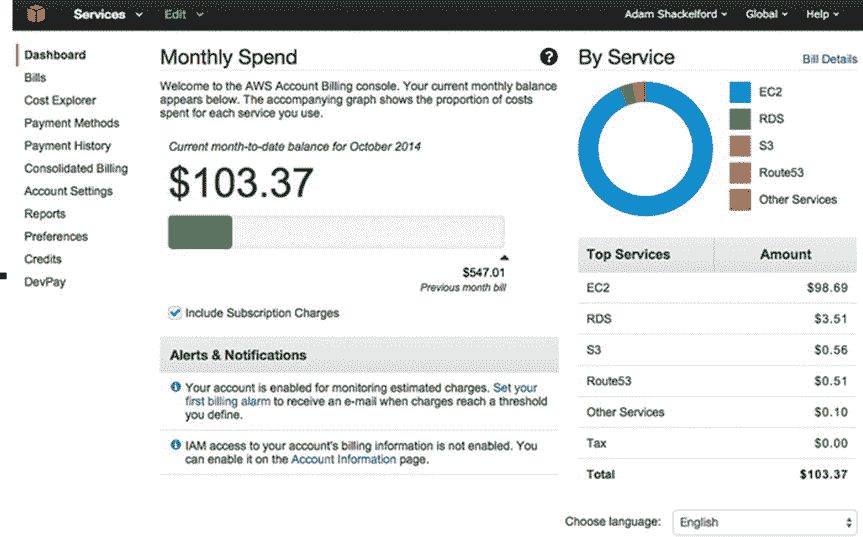
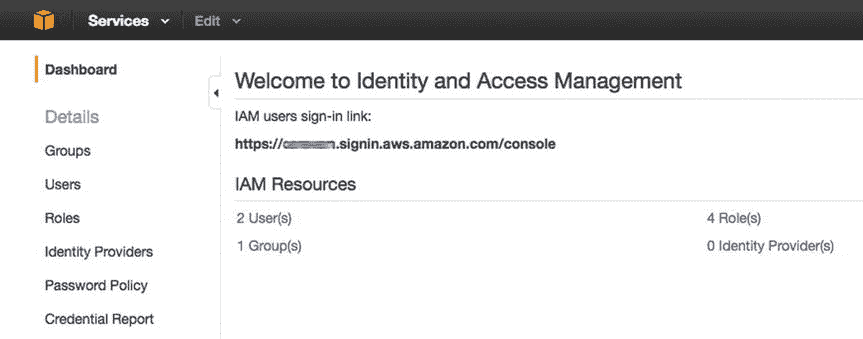
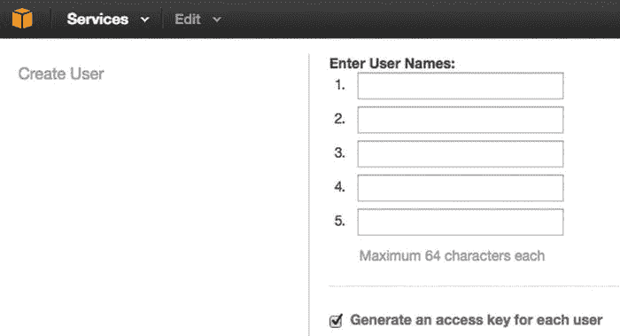
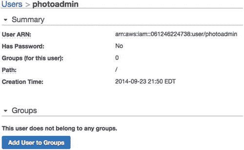
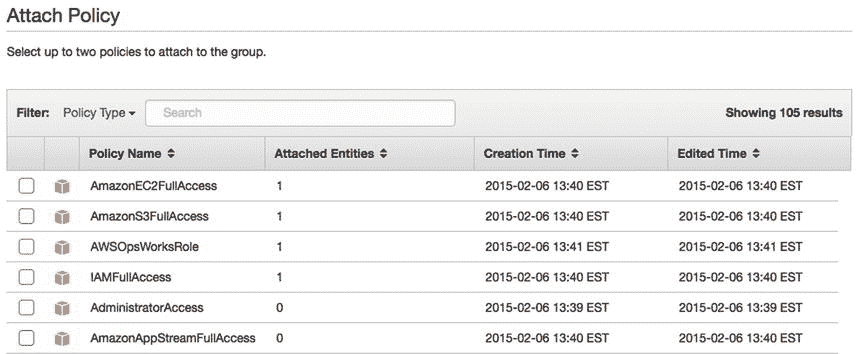
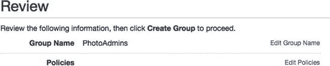
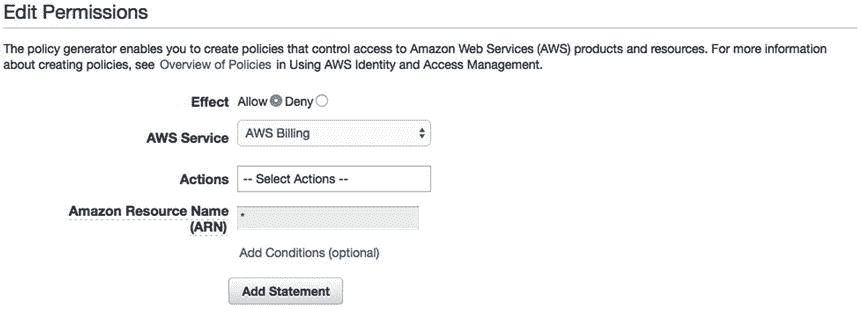
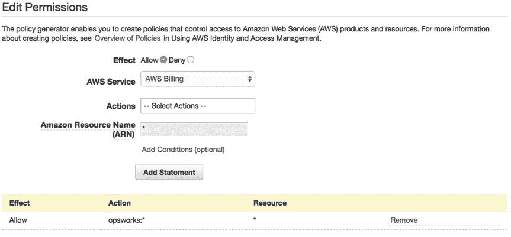
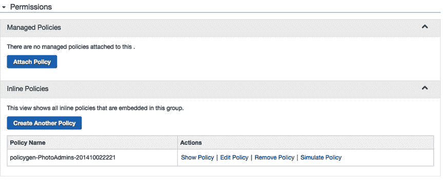

# 一、Amazon Web Services 入门

欢迎使用 Node.js 开始 Amazon Web Services！在本书的整个过程中，您将学习如何优化 Node.js 应用，以便在 Amazon Web Services (AWS)上部署。通过使用 AWS 托管您的应用，您可以利用一系列通常称为“云”的特性。您将了解 AWS 的一些核心特性，了解如何设计您的应用堆栈，并将您的应用集成到 AWS 环境中。虽然您可以轻松地将代码上传到服务器并结束工作，但是学习如何将 AWS 的各种功能整合到您的项目中，将允许您充分利用云的优势。但是这些好处是什么呢？

## 了解云

首先也是最重要的是可伸缩性，即快速部署额外资源来支持您的应用的能力。在 AWS 等云托管提供商激增之前，如果应用的需求超过了硬件资源，部署额外的服务器是一项昂贵而费力的任务，通常超出了初创公司和中小型企业的能力。有了 AWS 上托管的应用，您可以按需分配资源，启动新的服务器并保持应用在线。根据 AWS 白皮书《云架构:最佳实践》， [1](#Fn1)

> Traditionally, applications are built for fixed, rigid and preconfigured infrastructures. Companies never need to configure and install servers every day. Therefore, most software architectures cannot solve the rapid deployment or reduction of hardware. Because the supply time and upfront investment for acquiring new resources are too high, software architects have never invested time and resources to optimize hardware utilization. This is acceptable if the hardware running the application is not fully utilized. The concept of "flexibility" in architecture is ignored, because the idea of having new resources in a few minutes is impossible.

响应应用需求的能力称为弹性。如果不是战略行动，用 100 台服务器替换一台服务器是没有用的。当需要手动启动和配置额外的服务器以响应需求时，这样做的成本导致许多企业/机构过度分配资源。这些额外的服务器将会一直运行，并且需要相应的维护，而不是为了流量峰值而增加额外的服务器。凭借 AWS 的灵活性，可以检测到流量峰值，并自动部署额外的资源。当需求恢复正常时，应用可以自动缩减到正常状态。使用您需要的东西，并为您使用的东西付费——这个简单的概念彻底改变了 web 应用开发。这节省了时间、金钱和精力，并降低了企业级软件的准入门槛。

正如您所看到的，可伸缩性和弹性是您的应用的重要属性。这些好处也意味着以不同的方式思考你作为软件开发人员和架构师的角色。从在固定硬件环境中开发转向云计算环境意味着我们现在除了软件开发人员之外，还是云架构师。这构成了开发人员必须考虑 web 应用的方式的重大变化。对于我们中的许多人来说，不再需要系统管理员或数据库管理员来维护基础设施。(他们在亚马逊、IBM、谷歌、Rackspace 等公司工作。，现在。)相反，虚拟硬件管理/云架构现在属于我们的领域。我们不仅从最佳编码实践和组织的角度考虑我们的应用，我们还必须考虑如何利用我们作为开发人员可用的大量资源。这意味着我们必须熟悉 AWS 的特性，并了解如何设计、配置和维护虚拟主机环境。

随着您学习如何成为一名云架构师，您将了解到许多 AWS 特有的优秀特性，以及弹性和可伸缩性的一般原理。AWS 的许多功能被组织成一系列重叠的服务。它们中的许多都有多余的特性，允许我们在设计系统时做出一些创造性的决定。所有这些服务都运行在位于亚马逊全球许多数据中心的虚拟化硬件环境中。我们将在接下来的章节中探讨其中的一些服务。

您将熟悉 Amazon Web Services 的基础知识。我已经讨论了使用 AWS 的一些一般原则和优点。稍后，我将更详细地讨论一些核心服务，以及我们与它们交互的不同方式。在我们开始之前，从同一页开始是很重要的。

## 本书中的方法

本书假设您至少已经是一名 Node.js 开发初学者，希望扩展您的技能，包括设计和开发一个具有可伸缩性和弹性的 Node.js 应用。您应该对 web 应用开发中的主要概念有一个基本的了解。您应该知道什么是 RESTful web 服务，熟悉 Git 或 SVN，并且手边有一个代码编辑器。

设计和开发应用是一个创造性的过程。这意味着必须做出许多高度主观的决定。首先，我们将使用 Amazon RDS(关系数据库服务)在 AWS 上托管 MySQL 数据库。许多 Node.js 开发人员更喜欢 MongoDB 而不是 MySQL。这是非常好的！然而，示例应用和后续说明主要关注 MySQL，它适合我们应用的需要。如果您想使用这本书来部署一个使用 MongoDB 的应用，您必须能够相应地重写数据库连接和查询。在这两种情况下，您都需要有关于数据库语言的基础知识。这只是一路上要做的许多创造性决定中的一个。在下一个项目中，您可能不同意某些观点或需要不同的方法，但您最终会更好地在下一个项目中做出这些决定，并且您将准备好作为开发人员和架构师与 AWS 服务一起工作。

为了在我们的应用中获得云计算的好处，您将了解可以集成到我们的应用中的各种 AWS 服务。这种集成将通过两种方式进行:通过 AWS 控制台中多个服务的配置和定制，以及通过 AWS SDK 在我们的应用代码库中以编程方式进行。在这种情况下，我们将使用 JavaScript AWS SDK，它旨在用于 Node.js 应用。然而，有针对各种服务器端语言的 SDK，书中的许多经验甚至对使用不同语言的开发人员有用。将 AWS 服务集成到具有类似功能的 PHP 应用中不会有太大的不同。

实际上，您可以在 AWS 管理控制台(AWS 控制台)中执行的每个任务都可以通过编程来执行，反之亦然。AWS 控制台通过提供对提示和文档的访问，以及为抽象概念提供可视化参考，增加了流程的清晰度。当你思考 AWS 能做的一切时，使用控制台会有很大帮助。你可能会问，“我怎么知道什么时候使用控制台，什么时候使用 SDK？”撇开学习曲线不谈，这是一个非常主观的话题。您可能会及时决定哪些规则最适合您的工作流程，但我们可以遵循一些基本规则。

Note

还有第三种与 AWS 服务交互的方法:AWS 命令行界面(CLI)。在最后一章之前，我们不会使用 CLI。

首先，例行任务肯定应该在 SDK 中执行。如果您的应用需要将每日日志或报告存储在 S3 存储桶中，您可能希望通过编程来完成。涉及文件传输的常规任务尤其适合 SDK。在我们的应用中，用户上传的图像将存储在一个 S3 桶中，供应用使用。当您了解如何做到这一点时，我将清楚地说明为什么使用 AWS 控制台是一个坏主意。现在，要知道在这个用例中，SDK 是一个非常省时的工具。这同样适用于事件驱动的任务，除了 CloudWatch 可以检测到它们的地方(比如服务器离线)。例如，如果您的应用必须在用户注册您的应用时生成电子邮件，您希望您的代码在它发生时立即触发它。我们将在第 6 章和第 7 章[中更详细地探讨这些类型的事件。](7.html)

然而，为了清楚起见，我们将在 AWS 控制台上执行许多一次性任务。与调试只需运行一次的代码相比，使用 AWS 控制台的 GUI 来诊断错误或完全避免错误要容易得多。例如，虽然我们可以通过编程方式创建一个警报，在应用对请求的响应缓慢时通知我们，但为了清晰起见，我们将在 AWS 控制台中这样做。当你学习的时候，你会发现自己用 AWS SDK 制造了可笑的错误。糟糕，我不是有意在无限循环中创建服务器实例。如果您在完成课程后感到雄心勃勃，您可能会编写本书中许多 AWS 控制台任务的脚本。我称之为额外学分。

在向您介绍我们将使用的 AWS 产品之前，重要的是要重申，使用 AWS 实现相同目标的方法不止一种。本书的范围仅限于一组产品，这些产品可以很好地协同工作，以实现我们的应用可伸缩性和弹性的目标，以及我们需要的功能集和合理的预算。然而，许多 AWS 服务有一些冗余。例如，我们将使用 OpsWorks 来管理我们的应用堆栈，但这不是唯一的服务。许多 AWS 开发人员更喜欢使用 Elastic Beanstalk 而不是 OpsWorks，因为它提供了简单性，还有其他原因。久而久之，AWS 服务已经变得越来越有凝聚力，所以我希望学习如何使用一些产品会让你走上了解更多、更轻松的道路。

许多 AWS 产品都使用 EC2 实例。EC2 或弹性计算云是 AWS 的基础。实例实际上是运行您选择的操作系统的虚拟服务器，托管在亚马逊的众多数据中心之一。该实例不固定在单个硬件上；它是在一台机器上运行的软件过程；如果那台机器崩溃或损坏，这个过程将在另一台机器上继续。在最坏的情况下，AWS 数据中心的硬件故障会中断您的应用，但是内置在云中的冗余将防止您的数据丢失。如果您的应用没有响应，您可以在 [`http://status.aws.amazon.com/`](http://status.aws.amazon.com/) 检查所有 AWS 服务的状态。

当您创建和运行 EC2 实例时，您是在一个或多个 AWS 数据中心租用计算资源，这些数据中心是按地理区域组织的。这些资源的价格基于使用的能力和小时数。EC2 使用分层定价结构，由此 EC2 硬件规格(时钟速度、RAM 等)。)是根据它们的相对大小来命名的。当您创建一个实例时，资源被分配给您的实例，并且您的计费开始。不管你实际使用了多少你租用的资源。您需要为您的价格等级付费。您可以花很多钱保留最大的可用实例，但这将是一种浪费，就像前面描述的传统部署方法一样。相反，我们将使用其他 AWS 服务，根据我们的需要来扩大和缩小我们的 EC2 实例，以获得最大的性价比。由于我们现在也是云架构师和开发人员，我们将尽最大努力做到不吝啬。为您使用的东西付费；花钱买什么用什么。

虽然您可以手动创建和配置 EC2 实例，但是使用管理工具(如 OpsWorks)可以大大简化流程，并且可以大大降低设置复杂系统时的人为错误风险。我们将使用 OpsWorks 来管理我们的应用层、部署和应用的许多其他重要方面。OpsWorks 将是您配置我们项目的主要界面，也是您需要掌握的第一件事。在第 2 章中，将向您介绍 OpsWorks 的核心特性，并配置您的应用以部署到 EC2 实例。在本章结束时，您的应用将通过 OpsWorks 部署到 EC2 实例中。

在第 3 章中，您将使用 Amazon RDS 向您的应用添加一个可扩展的 MySQL 数据库。您还将了解如何向您的应用添加额外的服务器实例，以及如何设置负载平衡器来管理流量。在[第 4 章](4.html)和[第 5 章](5.html)中，你将学习如何在 CloudFront 中建立 CDN，以及如何处理文件传输和缓存。您还将了解路由 53 的 DNS 配置。在第 6 章的[和第 7 章](6.html)的[中，您将学习如何使用 SES(简单电子邮件服务)从您的应用发送电子邮件，您将学习如何使用 CloudWatch 来监控您的应用。最后，在](7.html)[第 8 章](8.html)中，您将通过将关键 API 端点限制为 HTTPS 连接来为您的用户保护您的应用。

尽管我们构建的应用相对简单，但使用云计算却不简单。除了 Node.js 的知识之外，完成这本书还需要一些工具和服务。

## 要求

当然，您需要 Node.js 和 MySQL 开发的所有工具:IDE、本地 MySQL 数据库和 Git 或 SVNclient(除非您更喜欢命令行)。此外，您还需要一个域名注册商、SSL 证书提供商，当然还有 AWS 的账户。

### AWS 帐户

你首先需要的是你自己的 AWS 账户。您可以通过进入 [`http://aws.amazon.com/`](http://aws.amazon.com/) 并点击注册按钮来创建一个。您需要提供帐单信息来完成注册过程。您现在应该完成此过程；没有激活服务的账户是免费的。随着您继续学习课程并激活更多服务，您将开始积累一些支出。注册后，您可以在这里随时查看您的支出: [`https://console.aws.amazon.com/billing/home`](https://console.aws.amazon.com/billing/home) (见图 [1-1](#Fig1) )。

图 1-1。

The Billing and Cost Management dashboard

在上图中，您可以看到主计费和成本管理仪表板(注意，在此图中整个屏幕都是可见的，但情况并非总是如此)。您当前的月账单以粗体大字体突出显示，下方是一个进度条，范围从零到上个月的账单。这是给你一个每月费用的可靠预测，尽管它们可能会根据使用情况的变化而波动。不过，不要让我的账单吓到你，我的账户上运行的不仅仅是示例应用。

还有一个用于启用警报和通知的标注。您可以将 AWS 配置为在达到特定成本指标时向您发出警报。这样做的效用是不言自明的。要是电力公司提供这个功能就好了！

右边是一个圆形图和你的账单明细。如您所见，EC2 可能是您最大的开销，其次是 RDS 或您使用的任何数据库服务。您可以预期您的数据库服务账单会随着您的应用所做的查询量的增加而增加，因此也会随着您的用户群的扩大而增加。

你只为你使用的东西付费，但是如果你过度使用权力，你会在你的银行账户中感觉到。要完成这本书里的课程，你无疑会产生一笔不小的费用。确切的费用将取决于你完成这本书的速度，以及你是否让你的应用 24/7 运行。这里还有许多其他与报告和计费相关的工具和选项，不在这些课程的范围之内。我们将在本章的后面返回 AWS 控制台，开始配置帐户以用作生产环境。

Tip

为了省钱，你可以在不上课的时候关闭很多资源。

### 域注册

你需要自己的领域来完成所有的课程。这并不重要，只要你有能力改变域名服务器。如果你还没有域名，你可以在任何一个注册机构注册一个，比如 GoDaddy ( [`www.godaddy.com`](http://www.godaddy.com/) )。那不是对 GoDaddy 的认可；注册商大多都一样。预计这一成本约为每年 13 美元。你现在也可以直接在 AWS Route 53 仪表板上注册你的域名，如果你想把你所有的移动部件放在一个地方，这是很方便的。

### SSL 证书

这个话题在[第八章](8.html)会有详细介绍，所以你现在不需要这个。但是，您必须向证书颁发机构提供有效的 SSL 证书。这至少每年要花费 9 美元。

### 代码库

接下来，当您在 AWS OpsWorks 中设置应用时，您会发现您需要选择一种部署应用的方式。你会有很多选择。最简单也可以说是最安全的部署方式是通过 GitHub ( [`https://github.com`](https://github.com/) )账户，或者其他具有类似功能的 Git 账户托管服务。我们特别想要一个支持自动部署或者可以通过 SSH 连接被 AWS 访问的。下载示例项目后，您会希望将该项目添加到您自己的存储库中，您可以根据需要对其进行修改，并配置您自己的部署过程。

### 下载示例项目

您不会通过复制冗长的、一步一步的代码示例来开始编码课程。相反，您可以从这里下载示例项目开始:( [`www.apress.com/9781484206546`](http://www.apress.com/9781484206546) )。然后，我们将回顾预打包的代码，并在接下来的课程中反复修改。在执行此操作之前，请确保安装了最新版本的 Node.js(或至少 0.10.26 版)。下载示例项目的 zip 文件，或者将分支拖到您的机器上，并在代码编辑器中打开目录。

### 局部环境

您应该已经在本地计算机上安装了 Node.js，并且能够在命令行界面中运行它。开始时，您还需要一个本地 MySQL 数据库。最简单的方法就是用 MAMP ( [`www.mamp.info/en/`](http://www.mamp.info/en/) )或者 XAMPP ( [`www.apachefriends.org/index.html`](http://www.apachefriends.org/index.html) )。我只是假设您可以自己安装它，而不需要一步一步的指导(提示:转到网站并单击下载)。与 PHP 不同，你不需要 MAMP/XAMPP 来运行你的应用，但这是建立和访问本地 MySQL 数据库最简单的方法。你可能还想安装 MySQL Workbench ( [`www.mysql.com/products/workbench/`](http://www.mysql.com/products/workbench/) )，但是我会在后面详细讨论这个问题。

我们的应用的前端是一个 RESTful JSON API，供 web 或移动客户端使用。我们将在整个课程中与 API 进行交互，但是我们还没有客户端。因为我们将向 API 发出`GET`和`POST` HTTP 请求，所以在开发过程中，您需要的不仅仅是一个 web 浏览器来正确测试应用。幸运的是，在所有操作系统上都有许多 REST 客户端可用，这使得与像我们这样的 API 接口变得更加容易。有一个很好的 Google Chrome 扩展叫做 Advanced Rest Client，它应该可以很好地完成这项工作。你可以在 [`https://chrome.google.com/webstore/detail/advanced-rest-client/hgmloofddffdnphfgcellkdfbfbjeloo`](https://chrome.google.com/webstore/detail/advanced-rest-client/hgmloofddffdnphfgcellkdfbfbjeloo) 找到。

### ExpressJS

您可能希望熟悉 ExpressJS，这是 Node.js 的一个流行的(可能是最流行的)web 应用框架。使用 ExpressJS 将完成大量路由和解析 HTTP 请求的繁重工作，并简化通过模板引擎、raw text/HTML 或 JSON 发送响应的过程。此外，ExpressJS 接受一些方便的全局配置，并允许您创建或安装中间件。这允许您通过公共函数传递对服务器的所有 HTTP 请求，这使得集成身份验证、字段验证和错误处理等功能变得容易。

该示例项目针对最新的主要版本 Express 4 进行了优化。如果你更熟悉 Express 2 或者 Express 3，那么这个版本有显著的变化。你应该复习 [`http://expressjs.com/guide/migrating-4.html`](http://expressjs.com/guide/migrating-4.html) 来提高速度。

现在让我们让您熟悉一下这个示例项目。已经为您创建了一个简单的 RESTful web 服务的一些基本功能。请记住，这本书的目标不是教你如何编码，也不是要让功能具有开创性。我希望，通过学习一个简单的应用，你会对如何将 AWS 集成到你自己的工作中有一个清晰的认识。

## 示例项目

虽然这在技术上不是 Node.js 指南，但我们将使用一个示例项目来将本书中的课程放在上下文中。样本项目将提供一个真实世界的应用来开发，而我们与 AWS 合作。一开始，我们将从一个基本的应用开始——它需要做大量的工作才能在现场使用。我们将在整本书中做一些这样的工作。

### 概观

示例项目是一个非常简单的基于照片的社交媒体应用的代码基础。功能很简单:用户可以注册一个帐户并登录。他们可以创建相册对象，相册对象由标题和照片对象集合组成。用户可以上传带标题的照片到相册，一次一张(但我们还没有存储和提供文件)。用户可以看到所有其他用户的列表，并获得特定用户的所有相册。用户通过 JSON 格式的 RESTful API 与应用进行交互，记录存储在 MySQL 数据库中。

随着课程的进行，我们将为应用添加更多功能。它将使用适当的安全用户认证方案。用户注册帐户时会收到欢迎电子邮件。我们将图像文件存储在 CDN 中，以便轻松快速地存储。应用日志将被生成并存储在 AWS 中，它将利用一系列的 AWS 服务。

像这样的应用有很多使用案例。从社交网络到新闻阅读器应用，无数平台的核心都拥有类似的功能。只需做一点工作，您就可以通过在用户之间创建一种关系来添加好友或关注的概念，以及用户创建和删除他们的方法。您可以给照片添加标签、地理位置数据和注释。

我们的应用输出是 JSON 格式的，但是 web 模板也可以很容易地由应用生成。请记住，虽然应用在这一点上很简单，但它会很快变得更复杂。示例项目的目的不是让您对 Node.js 编码技能感到眼花缭乱，而是提供一个简单、清晰的代码库，该代码库易于理解，并且可以扩展到更复杂的应用中。

Note

项目的大部分组织是使用`express`命令创建的，它会自动生成您的项目。如果您在课程结束后开始自己的项目，那么重新创建项目的组织将会很容易。

### 源代码组织

让我们从在代码编辑器中打开项目开始，看看内容。您应该在项目目录中看到以下内容:

`/lib`

`/public`

`/routes`

`/setup`

`/views`

`server.js`

`package.json`

在代码编辑器中打开`package.json`。您将看到一些 JSON 格式的项目信息和配置选项。您将看到 dependencies 属性，类似于以下内容:

`"dependencies": {`

`"express": "∼4.8.6",`

`"body-parser": "∼1.6.6",`

`"cookie-parser": "∼1.3.2",`

`"morgan": "∼1.2.3",`

`"serve-favicon": "∼2.0.1",`

`"debug": "∼1.0.4",`

`"jade": "∼1.5.0",`

`... // additional dependencies truncated`

`}`

这些是运行应用所需的其他 npm 模块。当您使用 ExpressJS app generator 命令时，它们中的许多会自动添加到依赖项列表中。您必须在本地安装这些程序，才能在本地运行应用。打开您的命令行界面(例如，OS X 的终端)，并导航到此目录。在命令行中键入以下内容:

`npm install`

该命令将在同一目录中查找一个`package.json`文件，并尝试安装依赖属性中的所有模块。在几分钟的时间内，您应该会看到所有的软件包都下载并安装完毕。

让我们浏览一下项目中的其他一些文件和目录。总的来说，这个项目的结构遵循模型视图控制器(MVC)设计模式。如果您不知道这是什么，它只是将您的代码库组织成三种类型的类之间的逻辑分离的一种方式。在 MVC 中，这三种类型是模型，或对象定义和操作；应用的视图或输出；以及控制器，它包含所有的逻辑，根据应用的输入决定向模型发送什么信息/从模型中检索什么信息。当然，这是对概念的简化，但是当我们浏览它时，它会让您了解它是如何工作的。

首先，我们将探索`lib`目录，其中包含`globals.js`和`/model`。正如前面所描述的，`model`目录包含了我们将要使用的各种对象的所有类定义。因为应用输出将主要是 JSON，或者由 JSON 填充的模板，所以模型本身将比使用 PHP 抽象得多，例如，如果使用 PHP，您可能会设计一个类，使用从数据库检索的属性来实例化对象。

`model`目录中的文件主要从控制器接收与数据库交互的命令，并将抽象对象发送回控制器作为响应。因此，示例应用中对象的属性是动态创建的。对于这种性质的应用，对象的生命周期非常短，因此使用灵活的数据模型通常是有意义的。如果您愿意，您可以创建自己的类，实例化它们，并填充它们，而不是遵循示例项目中的方法。如果这样做有助于更有效地维护您的代码库，那么这样做并没有错。

MVC 模式的控制器在`/routes`目录中。每个文件对应于用户请求中的一个目录路径(例如，`/` `photos` `/1`或`/` `users` `/adam`)，并处理对该路径内的 URL 的所有请求。它将从相应的模型中检索所需的任何数据，并发送响应。

那么风景在哪里呢？在响应是 JSON 的情况下，视图就是 JSON 数据本身。不过作为 ExpressJS4 app，原生支持 jade 模板引擎( [`http://jade-lang.com/`](http://jade-lang.com/) )。如果您要开发 web 模板，这些文件将位于`/views`目录中。在这种情况下，当考虑 MVC 时，视图并不总是在模板文件中可访问的。无论内容类型是`text/html`还是`application/json`，视图总是 HTTP 响应。

接下来，`public`目录存储所有的静态资产，比如前端模板使用的样式表、图像和 JavaScript 文件。这个目录是由 ExpressJS 自动生成的。在第四章中，你将学习如何使用 AWS CloudFront 更有效地为用户提供这些文件。

你已经了解了`server.js`。如果查看这个文件，您会看到请求路由是如何映射到`/routes`目录中的文件的。您还将在这里看到一系列中间件和 ExpressJS 配置。目前，这些都不太重要。

你也应该知道`/lib/globals.js`。这个文件只是存储全局配置和常用值的一个方便的地方，便于参考，不会污染全局名称空间。开发人员对于如何在他们的代码中处理这种类型的特性有各种不同的想法，所以这仅仅是许多方法中的一种。

示例项目还包括一个名为`/setup/photoalbums.sql`的文件。这是您可以导入到本地 MySQL 数据库的数据库模式。如果您打算在本地环境中测试示例应用，那么您需要将它导入到一个名为 photoalbums 的本地数据库中。稍后，您还需要将这个文件导入到 Amazon RDS 数据库中。

### 配置和启动

您可以通过以下两种方式之一启动应用:

*   在命令行上键入`node app.js`
*   在命令行上键入`npm start`

如果应用编译成功，您应该可以在`http://localhost:8081`查看欢迎页面(假设您使用了 8081 端口)。如果没有，您应该会在命令行界面上看到一个错误。如果是这样，很有可能是您的某个依赖项没有正确安装。如果是这种情况，尝试再次运行`npm install`。

另一个可能的错误是端口 8081 在您的机器上不可用。当我们将应用部署到云中时，我们将使用端口 80。如果您必须改变这一点，打开`/lib/globals`并将`applicationPort`属性更改为不同的值，比如 8081。如果您的应用试图打开一个不可用的端口，错误将如下所示:

`events.js:72`

`throw er; // Unhandled 'error' event`

`^`

`Error: listen EACCES`

`at errnoException (net.js:904:11)`

`at Server._listen2 (net.js:1023:19)`

`at listen (net.js:1064:10)`

`at Server.listen (net.js:1138:5)`

如果这些建议都不能解决您的问题，您将不得不阅读命令行界面中的错误，并尝试自己解决它。只是提醒一下:任何时候你修改代码，你都必须重新编译你的应用。如果你习惯于使用 PHP 或前端 JavaScript 并刷新你的浏览器来测试一个补丁，这可能需要一些时间来养成定期重新编译你的应用的习惯。

### 使用示例应用

祝贺您让示例应用正常运行。除了安装几个 npm 包之外，您不需要在您的机器上做任何进一步的配置。从现在开始，示例项目源代码就是您的了！您现在应该将它登记到一个存储库中，这样如果您迷路了，您就有一个好的快照可以返回。

在余下的课程中，我们将在浏览器中的源代码、命令行界面和 AWS 控制台之间来回切换。让我们更深入地研究样本代码，以便更好地理解它是如何工作的。首先，我们来看看`server.js`。在文件的开头，您会看到所有包含的 npm 模块。从第 8 行开始，您将看到我们添加到项目中的所有源文件:

`var routes = require('./routes/index');`

`var users = require('./routes/users');`

`var photos = require('./routes/photos');`

`var albums = require('./routes/albums');`

`var globals = require('./lib/globals');`

再往下，在第 27 行左右，您会看到它们的使用位置:

`app.use('/', routes);`

`app.use('/users', users);`

`app.use('/photos', photos);`

`app.use('/album', albums);`

现在，我们将探索我们在应用中注册的每条不同路线的功能。

#### 回家路线

第一行将 HTTP 请求定向到我们的应用到位于`/routes/index.js`的文件的根路径。我们可以在这里稍作停留，因为这条路线仅用于显示欢迎页面，所以你知道应用运行正常。在文件的顶部，您会看到

`var express = require('express');`

`var router = express.Router();`

我们构建应用的方式是，我们需要在每个控制器(路由)中包含`express`和`express.Router()`，以便与发送到所述控制器的 HTTP 请求进行交互。这意味着这些路由文件中的每一个都将在顶部实例化名为`express`和`router`的变量。

Note

完全有可能以一种方式组织你的代码，使你的控制器不必要求`express`，但是我们在这一点上遵循 ExpressJS 模板。

在`index.js`中只登记了一条路线:

`/* GET home page. */`

`router.get('/', function(req, res) {`

`res.render('index', { title: 'Photoalbums' });`

`});`

如您所见，我们没有对请求做任何事情，只是发送了一个响应。不读取参数，不与模型交互，等等。我们简单地用来自`views`文件夹的索引模板和标题“`Photoalbums`”来响应。我们应用的其余部分使用 JSON 进行响应，但是对于这个登录页面，我们使用一个由 jade 模板生成的 HTML 响应。我不会详细讨论这个问题。需要知道的重要一点是，您可以使用 ExpressJS 响应对象发送各种不同的响应类型。更多信息请点击: [`http://expressjs.com/4x/api.html#response`](http://expressjs.com/4x/api.html#response) 。

对`/users/`的请求被路由到`/routes/users.js`，依此类推。为了在我们的应用中实现，所有的路径或控制器文件都必须在`server.js`中注册。所有的控制器都是以同样的方式设计的，所以我们将从用户开始，作为一个很好的例子来说明一切是如何协同工作的。在`server.js`中，我们看这条线

`app.use('/users', users);`

并且知道按照要求去`/routes/users.js`看看会发生什么。

#### 用户路线

目前，我们只有框架功能。这款应用的功能刚刚够基本的互动。随着课程的进行，用户会变得比现在更加健壮。为用户提供的现成功能包括

*   注册账户(`POST /users/register`)
    *   参数:`username`，`email`，`password`
*   登录账户(`POST /users/login`)
    *   参数:`username`，`password`
*   账户注销(`POST /users/logout`)
*   查看所有用户(`GET /users/`)
*   按用户查看所有相册(`GET /users/user/:user`)
    *   参数:`user`

同样，这个示例代码只是为了帮助您入门。只需一点点努力，您就可以为用户帐户添加尽可能多的功能。您可以向用户数据库表中添加其他字段，如个人资料图像、个人简历或用户网站。然后，您可以添加一个更新方法，允许用户首先注册一个帐户，然后提交更新来完成他/她的配置文件。你可以要求用户在注册后确认他们的名字。您可以允许他们重置用户名或密码。记住这一点，让我们看看代码。在文件的顶部，您会看到一组不同的包含文件，如下所示:

`var express = require('express');`

`var router = express.Router();`

`var model = require('./../lib/model/model-users');`

因为我们在用户控制器中，所以我们知道我们会想要频繁地访问用户模型。我们将继续在这里包括用户模型文件。事实上，你可以期望每个控制器在顶部包含它的模型。然而，一些路线将需要包括多个模型类，尤其是当功能变得更加强大时。为了一致起见，我们可以将默认的模型变量命名为`model`，并将任何附加的模型命名为`modelPhoto`或`modelAlbum`等。如果我们只需要访问另一个模型一次呢？我们将根据具体情况确定任何其他型号的可变范围。

让我们来看看用户控制器中的一个典型的`router`方法。

`/* GET users listing. */`

`router.get('/', function(req, res) {`

`model.getAllUsers(function(err, obj){`

`if(err){`

`res.status(500).send({error: 'An unknown server error has occurred!'});`

`} else {`

`res.send(obj);`

`}`

`});`

`});`

前面的代码是我们在 ExpressJS 控制器类中路由和处理 HTTP 请求的典型方式。从第一行可以看到，`GET`对`/users/`路径的请求将在这里处理。如果有任何参数需要验证，我们会在方法开始时进行验证。然而，这只是检索所有用户列表的一种方式；没有用户输入。随着应用用户群的增长，我们可能希望允许用户通过该请求传递参数，以支持所有用户的分页列表。现在，我们可以保持简单，忽略任何用户输入。

我们立即用`model.getAllUsers()`从模型中检索数据。在这种情况下，没有参数被传递给模型。当我们收到从模型对象返回的消息时，我们检查它是一个错误对象还是我们想要使用的数据。

在某些情况下，我们会希望将模型对象的错误返回给用户。这看起来会像下面这样:

`model.getAllUsers(function(err, obj){`

`if(err){`

`res.send(err);`

`}`

`});`

然而，我们将在大多数情况下避免这样做。模型返回的一些错误可能是 MySQL 数据库查询错误。向用户公开关于数据库表的信息不是一个好的安全实践，MySQL 错误信息也不可能对我们的任何最终用户非常有用。对于控制器来说，检查从模型收到的错误并向向我们的 API 发出请求的客户机发送合适的消息会更合适。接下来，我们来看看模型，看看`getAllUsers`是做什么的。

与 routes 文件一样，让我们从顶部开始。

`var mysql = require('mysql');`

`var globals = require('./../globals');`

`var connection = mysql.createConnection(globals.database);`

当然，所有模型类中都需要`mysql`模块。我们将使用这个模块连接到数据库并执行所有查询。

Note

在 [`https://github.com/felixge/node-mysql`](https://github.com/felixge/node-mysql) 可获得`mysql`模块的完整文档。

如前所述，`globals`是一个存储公共变量而不污染`global`名称空间的对象，这里使用它是为了方便。MySQL 数据库连接被初始化为`connection`，使用存储在`globals`中的数据库配置。让我们看看第一种方法，我们已经知道了，`getAllUsers()`。

`function getAllUsers(callback){`

`connection.query('SELECT username, userID FROM users', function(err, rows, fields){`

`if(err){`

`callback(err);`

`} else {`

`callback(null, rows);`

`}`

`});`

`}`

这个方法是模型获取函数所能得到的最简单的方法。没有要验证的参数，没有要转义的用户输入，也没有任何其他中间函数。我们简单地从数据库中检索所有用户，并将他们返回给`routes/user`中的回调函数。现在，让我们滚动到文件的最底部，注意`exports`赋值。

`exports.getAllUsers = getAllUsers;`

`exports.getUser = getUser;`

`exports.createUser = createUser;`

`exports.loginUser = loginUser;`

`exports.logoutUser = logoutUser;`

这几行非常重要，因为它们是你在这个文件中公开一个方法的手段；否则，所有方法都是私有的，或者对其他对象不可访问。如果您使用这个示例应用构建额外的功能，很容易忘记这一步。

#### 回顾——事情的顺序

回到`/routes/user`一会儿，您应该看到请求是如何被处理的。以下是客户如何从我们的应用中检索用户列表的快速回顾:

`server.js` is listening for all HTTP requests at the designated port.   The client makes an HTTP `GET` request to `/users/`.   `Server.js` forwards the request to the controller at `/routes/users`.   The controller at `/routes/users` notes that the request is for “`/`” relative to “`/users`” and passes the request to the corresponding listener method.   The `GET` “`/`” listener in the controller calls `model.getAllUsers()`.   The model method `getAllUsers()` queries the database, processes the results, and returns the data set to the controller.   The controller populates the response object with data.   `server.js` sends an HTTP response with the data requested by the user.  

这些都有意义吗？如果您已经熟悉 ExpressJS，它可能没有告诉您任何新的东西。如果你是第一次学习这个，不要担心；在接下来的课程中，我们将花大量时间来学习这些概念。最好的学习方法是试着写下你自己的路线，看看怎样才能让它们发挥作用。永远不要低估试错的力量！

#### 示例-使用参数

让我们回到`/routes/users`来看另一个概念。到目前为止，我们已经看到了在没有任何参数或客户端输入的情况下处理一个基本请求。当你不涉及任何变量时，失败的可能性很小。一旦我们开始接受来自客户的特定请求，故障点就开始迅速增加。我们可以以`/users/login`路线为例来看。

`/* POST user login. */`

`router.post('/login', function(req, res) {`

`if(req.param('username') && req.param('password') ){`

`var params = {`

`username: req.param('username').toLowerCase(),`

`password: req.param('password')`

`};`

`model.loginUser(params, function(err, obj){`

`if(err){`

`res.status(400).send({error: 'Invalid login'});`

`} else {`

`res.send(obj);`

`}`

`});`

`} else {`

`res.status(400).send({error: 'Invalid login'});`

`}`

`});`

这个路由接受 HTTP `POST`请求，并期望客户机已经发送了用户名和密码。然而，我们不能假定两个参数都包括在内。因此，在我们尝试使用这些参数之前，我们必须检查它们是否存在。如果参数已经包括在内，我们继续。否则，将发送无效登录错误来响应请求。

我们可以使用控制器来验证输入和格式化参数以传递给模型。在这种情况下，在我们将用户的登录凭证发送到模型之前，我们还希望实施一条规则:用户名应该不区分大小写。用请求参数实例化`params`对象，当`params.username`被设置时，用户名被转换成小写。然后我们可以看看这个模型，看看接下来会发生什么。

`function loginUser(params, callback){`

`connection.query('SELECT username, password, userID FROM users WHERE username=' + connection.escape(params.username), function(err, rows, fields) {`

`if(err){`

`callback(err);`

`} else if(rows.length > 0){`

`var response = {`

`username: rows[0].username,`

`userID: rows[0].userID`

`}`

`callback(null, response);`

`} else {`

`var error = new Error("Invalid login");`

`callback(error);`

`}`

`});`

`}`

现在，如果用户名有效，我们将从数据库中选择用户。在未来，我们将解密用户的密码来验证用户。目前，我们会自动返回一个成功响应，其中包括经过身份验证的用户的用户名和用户 ID。这里重要的一课是，在将客户机输入发送到模型之前，控制器用于净化和验证客户机输入。以这种方式分离关注点并封装功能是一个好主意。模型期望将一个具有必要属性的对象发送给它的方法，控制器负责构造该对象或拒绝格式错误的请求。如果您遵循这种模式，您将能够在不同的场景中安全地重用模型类中的公共方法，并且从长远来看，您的应用将更容易维护和调试。

#### 尝试一下

是时候启动应用，看看它的运行情况了。如果应用没有运行，打开命令行界面，导航到应用目录，然后键入`node server.js`。打开 REST 客户端，输入以下 URL:

`http://localhost:8081/users/register`

如果你在不同的端口上运行应用，记得更换 8081。将您的 HTTP 方法设置为`POST`。添加名为`username`、`password`和`email`的`POST`参数。您可以在这些参数中输入任何想要的值。发送请求！

您应该会收到以下成功消息:

`{`

`"message": "Registration successful!"`

`}`

接下来，您应该能够使用刚刚注册的用户名登录。删除`email`参数，并将 URL 改为

`http://localhost:8081/users/login`

您应该会收到以下用户名和用户 ID 作为响应:

`{`

`"username": "adam",`

`"userID": 1`

`}`

您现在可以在浏览器中向`http://localhost:8081/users/`发出一个`GET`请求。您应该会在响应中看到您创建的用户。您可以创建其他用户，他们也会出现在此响应中。在这里，您可以使用登录响应中的用户 ID 为您的用户创建相册和照片。我将很快更详细地讨论这些。现在，让我们在`/users/user/:user`向用户细节 API 端点发出一个快速的`GET`请求，用您刚刚注册的用户名替换`:user`。您应该会看到类似以下的响应:

`{`

`"username":"adam",`

`"userID":1,`

`"albums":[]`

`}`

目前，这里没有太多新的信息。但是一旦你开始为这个用户创建相册，你将在这里得到关于他们的信息。接下来我们来看看专辑。

### 相册

每个用户可以拥有无限数量的相册。相册对象非常简单，由标题和用户 ID 组成。任何数量的照片也可以与相册相关联。

相册具有以下功能:

*   创建新相册(`POST /albums/upload`)
    *   参数:`userID`，`title`
*   按 ID 获取相册，包括相册中包含的所有照片(`GET /albums/id/:albumID`)
    *   参数:`albumID`
*   删除相册(`POST /albums/delete`)
    *   参数:`albumID`

让我们打开`/routes/albums.js`仔细看看。在顶部声明的变量应该已经很熟悉了。在这种情况下，您可以看到`model`变量被设置为`/lib/model/model-albums.js`。第一条路线将允许我们创建一个相册。使用注册时收到的用户 ID，将 RESTful 客户机指向`http://localhost:8081/albums/upload`，将方法设置为`POST`，并为用户 ID 和标题添加字段。你可以把任何你想要的名字放在标题里。我们现在就用“你好世界”吧。您应该会收到以下响应:

`{`

`"id":7,`

`"title":"Hello World"`

`}`

`In /routes/albums.js, find the route:`

`/* POST create album. */`

`router.post('/upload', function(req, res) {`

`if(req.param('title') && req.param('userID')){`

`var params = {`

`userID : req.param('userID'),`

`title : req.param('title')`

`}`

`model.createAlbum(params, function(err, obj){`

`if(err){`

`res.status(400).send({error: 'Invalid album data'});`

`} else {`

`res.send(obj);`

`}`

`});`

`} else {`

`res.status(400).send({error: 'Invalid album data'});`

`}`

`});`

首先，验证所需的参数，并用我们传递给它的参数构造一个名为`params`的对象。虽然您可以将请求参数直接传递给模型，但是使用中间变量是一个好习惯，主要是为了可读性。让我们转到`/lib/model/model-albums.js`的模型文件，看看在`createAlbum()`发生了什么。

`function createAlbum(params, callback){`

`var query = 'INSERT INTO albums SET ? ';`

`connection.query(query, params, function(err, rows, fields){`

`if(err){`

`callback(err);`

`} else {`

`var response = {`

`id : rows.insertId,`

`title : params.title`

`};`

`callback(null, response);`

`}`

`});`

`}`

我们在这里传递的所有参数都被插入到 albums 表的新行中。然后，我们用自动递增的 ID 和标题创建一个响应对象。请注意，ID 可以作为`rows.insertId`访问。当在 MySQL 数据库中创建一行时，`rows`参数是一个单独的对象。您会发现`SELECT`查询的行为略有不同。

接下来的路线允许你通过 ID 获取相册。

`/* GET album by ID */`

`router.get('/id/:albumID', function(req, res) {`

`if(req.param('albumID')){`

`var params = {`

`albumID : req.param('albumID')`

`}`

`model.getAlbumByID(params, function(err, obj){`

`if(err){`

`res.status(400).send({error: 'Invalid album ID'});`

`} else {`

`res.send(obj);`

`}`

`});`

`} else {`

`res.status(400).send({error: 'Invalid album ID'});`

`}`

`});`

这很简单。如果请求中包含相册 ID，控制器将从模型中检索相册并发送相册数据作为响应。您可以使用刚刚创建的相册中的相册 ID。现在，前往`/lib/model/model-albums.js`并找到`getAlbumByID()`方法。

`function getAlbumByID(params, callback){`

`var query = 'SELECT * FROM albums WHERE albumID=' + connection.escape(params.albumID);`

`connection.query(query, function(err, rows, fields){`

`if(rows.length > 0){`

`getPhotosForAlbum(rows[0], function(err, obj){`

`if(err){`

`callback(err);`

`} else {`

`callback(null, obj);`

`}`

`});`

`} else {`

`callback(null, []);`

`}`

`});`

`}`

首先，从数据库中检索相册及其所有字段。在所有数据库查询中，`rows`是从数据库查询中填充的对象。在使用`SELECT`查询的情况下，`rows`总是一个数组。如果你找到了你要找的东西，`rows`的长度将为 1 或更长。在本例中，我们通过唯一标识符`albumID`选择一行。但是这一次，我们不在这里停下来，返回我们找到的数据。相反，我们调用`getPhotosForAlbum()`并将我们的结果传递给它，然后最终将数据发送回控制器。向下滚动到`getPhotosForAlbum()`查看那里发生了什么。

`function getPhotosForAlbum(album, callback){`

`var modelPhotos = require('./model-photos');`

`modelPhotos.getPhotosByAlbumID(album, function(err, obj){`

`if(err){`

`callback(err);`

`} else {`

`album.photos = obj;`

`callback(null, album);`

`}`

`});`

`}`

如果我们通过 ID 发送一个相册，终端用户期望我们提供与该相册相关的所有数据似乎是合理的。在这种情况下，我们需要获取与相册相关的所有照片。

Note

我们知道客户端有用户的信息，因为这是他/她检索专辑 ID 的方式。在功能更全面的应用中，您可能还想在这个响应中包含一些用户信息。

首先，我们在`/lib/model/model-photos.js`实例化一个对照片模型的引用。我们给相册一个`photos`属性，设置为我们从照片模型中获取的照片数组(即使它是空的)。导航到`/lib/model/model-photos.js`，找到`getPhotosByAlbumID()`完成路线。

`function getPhotosByAlbumID(params, callback){`

`var query = 'SELECT * FROM photos WHERE published=1 AND albumID=' + connection.escape(params.albumID);`

`connection.query(query, function(err, rows, fields){`

`if(err){`

`callback(err);`

`} else {`

`if(rows.length > 0){`

`callback(null, rows);`

`} else {`

`callback(null, []);`

`}`

`}`

`});`

`}`

这个方法只是检索所有带有我们传递给它的相册 ID 的照片。请注意，照片的值`published`必须设置为 1。对于相册和照片，我们将使用`published=1`来表示该对象可供公众消费，使用`published=0`来表示该对象被隐藏。这使我们能够提供删除功能，而不会实际破坏数据库中的数据。接下来我们可以看看删除，从`/routes/album.js`开始。

`/* POST delete album. */`

`router.post('/delete', function(req, res) {`

`if(req.param('albumID')){`

`var params = {`

`albumID : req.param('albumID')`

`}`

`model.deleteAlbum(params, function(err, obj){`

`if(err){`

`res.status(400).send({error: 'Album not found'});`

`} else {`

`res.send(obj);`

`}`

`});`

`} else {`

`res.status(400).send({error: 'Invalid album ID'});`

`}`

`});`

到目前为止，您已经多次看到了这种模式。所以，我们将立即前进到`model.deleteAlbum()`。

`function deleteAlbum(params, callback){`

`var query = 'UPDATE albums SET published=0 WHERE albumID=' + connection.escape(params.albumID);`

`connection.query(query, function(err, rows, fields){`

`if(err){`

`callback(err);`

`} else {`

`callback(null, {message: 'Album deleted successfully'});`

`}`

`});`

`}`

如你所见，我们实际上并没有删除专辑。我们正在取消发布，这意味着它对所有用户都是不可见的。这是防止用户永久意外删除的好方法，它降低了恶意使用我们的应用的风险。如果有人的密码被盗或破解，他的所有内容被删除，我们可以恢复它没有太多的麻烦。还要注意，我们的回调没有返回任何数据，只是一条确认删除成功的消息。我们的应用非常简单，目前对于用户删除某些内容后会看到什么没有预期。目前这还可以，但是在你自己的应用中，你可能要考虑你的用户会期待什么样的响应。最后，我们将回顾照片。

### 照片

照片是个人照片/图像上传的对象。目前，应用中使用的照片对象不包括实际文件。此时，照片对象只不过是一个 ID 和一个标题。文件上传和 URL 生成是我们将专门为 AWS 定制的功能。我们将在后面的课程中构建此功能。

照片具有以下功能:

*   创建新照片(`POST /photos/upload`)
    *   参数:`albumID`，`caption`，`userID`
*   通过 ID ( `GET /photos/id/:id`)获取照片
    *   参数:`id`
*   删除一张照片(`POST /photos/delete`)
    *   参数:`id`

你会注意到这些方法实际上与专辑中的方法相同。让我们回顾一下关于照片的几点，从上传一张“照片”开始。您应该从之前的 API 查询中获得一个相册 ID 和用户 ID。(我们假设两者都等于 1。)让我们继续创建一个新的照片对象，使用这些 id 作为参数。在您的 REST 客户端中，使用以下参数向`http://localhost:8081/photos/upload`发出一个`POST`请求:

`userID: 1`

`albumID: 1`

`caption: "My First Photo"`

响应只包含您刚刚创建的照片的 ID。

`{`

`"id": 5`

`}`

看看你刚才查询的方法，在`/routes/photos`里。

`/* POST create photo. */`

`router.post('/upload', function(req, res) {`

`if(req.param('albumID') && req.param('userID')){`

`var params = {`

`userID  : req.param('userID'),`

`albumID : req.param('albumID')`

`}`

`if(req.param('caption')){`

`params.caption = req.param('caption');`

`}`

`model.createPhoto(params, function(err, obj){`

`if(err){`

`res.status(400).send({error: 'Invalid photo data'});`

`} else {`

`res.send(obj);`

`}`

`});`

`} else {`

`res.status(400).send({error: 'Invalid photo data'});`

`}`

`});`

值得注意的一个区别是`caption`参数是可选的。如果标题存在，我们会将它包含在传递给`model.createPhoto()`的参数对象中。这显示了构造一个中介对象的价值，而不仅仅是将请求参数直接传递给模型。如果请求中省略了一个可选字段，我们只需让数据库应用默认值。继续向`/photos/upload`发出另一个请求，并删除`caption`参数。您应该会从 API 收到相同的响应。

现在，让我们花点时间检查一下我们的相册，以确保我们的照片在那里。向`http://localhost:8081/albums/id/1`发出`GET`请求。请注意，没有标题的照片有一个空的标题字符串。响应应该如下所示:

`{`

`"albumID":1,`

`"userID":1,`

`"title":"Hello World",`

`"photos":[`

`{`

`"photoID":4,`

`"userID":1,`

`"albumID":1,`

`"caption":"My First Photo"`

`},{`

`"photoID":5,`

`"userID":1,`

`"albumID":1,`

`"caption":""`

`}`

`]`

`}`

再花点时间浏览照片路线和模型的其余代码。不应该有什么惊喜。

### 使用示例应用开发

到目前为止，您已经看到示例应用只有基本的功能。如果您是一名经验丰富的 MySQL 开发人员，您现在应该已经注意到没有关联表，这限制了我们在对象之间建立多对多关系的能力。为了提供简单的示例，此功能已被省略。其他更重要的功能—上传文件、身份验证等。—不完整。随着您对 AWS 的了解越来越多，您将会充实这些特性。当您学习示例应用的课程时，请记住我们的目标是开发一个利用 AWS 服务的应用。还有很多其他的书籍教授 RESTful web 服务、Node.js 和 MySQL 的优点。记住这一点，让我们开始吧！

下一步将是我们在 AWS 中的第一个任务。按照前面的步骤，您应该已经注册了一个 AWS 帐户。我们将在 AWS 控制台中做的第一件事是学习如何使用 IAM(身份和访问管理)来管理应用基础架构中的权限和安全性。IAM 是 Amazon 针对需要管理多种权限的问题的解决方案。当管理权限时，我们不仅仅是说让其他用户访问我们的 AWS 基础设施，还包括 AWS 服务之间的访问。例如，您可能有一个 EC2 实例，您希望它能够连接到 RDS 数据库，但不希望它具有访问 OpsWorks 的 send 命令的权限。

对安全凭证过于慷慨是不好的做法。想象一下，你正在管理一个新闻网站。您可能希望为不同类型的用户提供不同的权限。读者只能阅读文章和发表评论。编辑将被允许发布和编辑文章，并删除用户评论。管理员将能够禁止用户，创建新的编辑，并执行站点级管理任务。您不希望授予所有用户管理权限，并相信他们会相应地采取行动。即使只是让你的编辑成为管理员，你也可能有一天醒来发现你自己的管理权力被剥夺了。

我们将同样谨慎地管理我们的 AWS 基础设施。AWS 控制台中的用户应该只拥有完成工作所需的权限。类似地，每个服务器实例都有一个角色要扮演，并且应该仅限于该角色。当您很好地掌握了 IAM 之后，您就可以部署您的应用，而不必将密码存储在等待被黑客攻击的配置文件中。

## 身份和访问管理

在这种类型的应用中管理权限和凭证有很多挑战。

首先，我们只希望一组选定的用户能够管理我们的基础设施。例如，只有某些团队成员能够重启服务器。也许一组不同的用户应该拥有邮件服务器的管理权限，而另一组不同的用户应该拥有数据库管理权限。

此外，还有管理每台服务器安全性的问题。组织和限制对一系列服务器的安全密钥的访问本身就是一门艺术。通常，我们还必须在应用的源代码中包含数据库访问凭证。我们不仅要担心限制对存储凭证的源代码的访问，还要确保开发环境凭证不会意外地部署到生产环境中，反之亦然。

除了所有这些问题之外，我们还有人员流动的问题。工程师和管理员要么辞职，要么被解雇，我们必须审查我们所有的安全措施，以确保他们不能接触任何敏感的东西。如果某个拥有大量安全访问权限的人意外退出，我们将不得不手忙脚乱地锁定我们所有的凭据。安全漏洞，尽管可能是短暂的，却是有保证的。每次我们必须重置凭证时，所有错误配置的风险都会重新引入系统。现在应该很清楚，即使像我们这样简单的应用，在控制内部安全方面也存在许多故障点和巨大的人为错误风险。

AWS 通过将所有用户安全、数据库和服务器安全以及 API 访问统一到一个名为身份和访问管理(IAM)的系统中来解决这些问题。现在，我们假设没有其他 AWS 用户需要我们关注。然而，我们确实希望确保我们在 OpsWorks 中创建的 EC2 实例能够与其他 AWS 服务正确交互。

### IAM 仪表板

让我们登录 AWS 控制台并导航到 IAM。当您成功登录 AWS 时，您会看到一个由三列组成的 AWS 产品列表。您可以在第二列的部署和管理标题下找到 IAM。单击它，您应该会看到类似图 [1-2](#Fig2) 的内容(为了清晰起见，一些用户界面元素被裁剪掉了)。

图 1-2。

IAM dashboard

在 IAM 仪表板的左侧，您将找到 IAM 的导航(这是 AWS 控制台的标准界面范例)。在右侧，您将看到您已经创建的所有 IAM 资源的列表。页面上还有许多其他的教程和咨询 UI 元素。您可以在闲暇时随意探索这些内容，以熟悉仪表盘。作为 AWS 中的第一个正式任务，您必须在 IAM 中创建一个用户。

### IAM 用户

用户是一个管理帐户，它有一个登录名(用户名/密码)以及其他安全凭据(如果需要)。现在，让我们创建一个单一的用户帐户来管理我们的应用。在导航中选择 Users 链接，您应该会看到一个空的表视图。单击页面顶部的“创建新用户”按钮。这将带您进入图 [1-3](#Fig3) 所示的屏幕。

图 1-3。

Create up to five IAM Users

在这个屏幕上，您最多可以创建五个新用户名，但我们只需要一个。在第一个输入字段中，键入用户名 photoadmin。有一个自动选中的复选框，表示将为每个用户生成一个访问密钥。如果我们使用这个用户在我们的应用中进行 AWS API 查询，我们将需要一个访问键。然而，我们的意图是，这个用户将有权访问 AWS 控制台的必要部分，而与应用本身的功能无关。因此，我们将在单击“创建”之前取消选中该框。

用户名现在应该出现在 users 表中。您会注意到，我们的用户不属于任何组，也没有访问密钥。单击用户的行会将我们带到该用户的详细视图。您应该会看到类似于图 [1-4](#Fig4) 的内容。

图 1-4。

The user detail view

这一页上有很多信息。首先，是用户 ARN，或亚马逊资源名称。ARN 本质上是任何种类的所有 AWS 资源的全局标识符。任何时间任何资源，例如用户、EC2 实例、数据库实例等。，则会自动生成一个 ARN。稍后您可能会发现它们很有用，但是我们现在不需要对这个 ARN 做任何事情。您会注意到“组”和“权限”标题下的粗体文本。我们的用户没有组，也没有策略！

策略可能是 IAM 中最重要的概念。策略本质上是对用户、组、角色或其他资源的一个或多个权限的声明。简而言之，它们是为 AWS 中的所有实体配置权限的通用系统。策略可以包含非常细粒度的权限，或者对 AWS 产品中的所有属性进行全面的“允许”。相反，您也可以明确拒绝对服务或资源的访问。出于我们的目的，我们希望用户拥有管理我们的应用使用的所有 AWS 产品的完全权限。该用户是我们的超级管理员。

### IAM 组

这里的诱惑是开始向该用户添加新的策略。等等！我们确定这是个好主意吗？我们真的知道这是唯一拥有这种力量的使用者吗？从长远来看，这个项目可能会有不止一个超级管理员。或许创建一个小组并在那里管理我们的政策会更有意义。

在导航中选择 Groups，您将看到一个类似于我们前面看到的 users 表的屏幕。单击创建新组。我们应该怎么称呼这个团体？我们知道，我们希望这些管理员能够访问我们的应用使用的所有产品。我们给了这个群体巨大的力量，因为现在，我们只是为自己创造了一个用户。让我们称这个组为 PhotoAdmins。单击下一步，您将进入附加策略视图。

### IAM 管理的策略

如果您以前使用过 AWS，您可能会注意到 IAM 策略生成工具已经发生了变化。现在有两种类型的 IAM 策略:托管策略和内联策略。受管策略是 AWS 管理的策略中的一个或多个权限。例如，AmazonEC2FullAccess 策略包括对 EC2 服务的完全访问，以及弹性负载平衡和 CloudWatch 等相关服务。内联策略是当您有特定策略需求时可以创建的自定义权限，我们稍后将对此进行讨论。

创建组时，系统会提示您附加托管策略。如图 [1-5](#Fig5) 所示的 Attach Policy 视图将很快成为一个好朋友。该工具的唯一目的是简化为用户、组和角色选择正确权限的复杂过程(稍后将详细介绍)。

图 1-5。

Selecting a managed IAM policy in the Attach Policy view

虽然我们可以选择其中一个管理策略，然后就此结束，但这并不有趣，不是吗？相反，让我们创建该组，然后手动向其中添加内联策略。单击下一步进入查看视图，如图 [1-6](#Fig6) 所示，您将再次看到您的组名和策略。单击创建组完成。

图 1-6。

Review Group

您将返回到组列表视图。选择 PhotoAdmins 组并展开 Inline Policies 面板。单击链接创建新的内联策略。在下一个视图中，您可以从以下选项中进行选择:

*   策略生成器:该选项将启动一个向导，允许您向组中添加一系列单独的策略语句。这是一种配置需要访问某些(但不是全部)服务的组的简便方法。
*   习俗政策:这是阻力最大的道路。所有策略都以 JSON 格式读写。定制策略选项允许您手动输入策略的 JSON。例如，如果您想要配置一个策略来授予特定 AWS 资源的权限，那么您可以在这里使用策略 JSON 中的 ARNs。在某种程度上，您可以直接使用 IAM 策略声明 JSON。亚马逊在这里也提供了独立的 JSON 生成器: [`http://awspolicygen.s3.amazonaws.com/policygen.html`](http://awspolicygen.s3.amazonaws.com/policygen.html) 。

让我们继续下去，确保我们的 PhotoAdmins 组拥有它需要的所有权力(仅此而已！)并选择策略生成器选项。单击选择。

### IAM 权限编辑器

下一个屏幕是权限编辑器。这里，我们将添加用户需要的每个单独的权限。除了返回 IAM 创建其他策略之外，我们将为他们提供完成其余课程的能力。参见图 [1-7](#Fig7) 。

图 1-7。

Generating individual IAM policy statements

我们配置权限的第一个选项是 Effect。虽然我们可以选择“拒绝”来禁止对特定服务的访问，但由于我们的组目前没有权限，这将是逆向操作。我们将选择“允许”,因为我们将允许访问特定服务。

从下拉列表中选择 AWS 服务。首先，我们要选择 AWS OpsWorks。接下来，我们可以只选择该组拥有权限的特定操作。此下拉列表中填充了可以在此 AWS 服务中执行的所有可能的操作。AWS 服务下拉列表中的每个选项都将重新填充操作列表。AWS 总共有数百个(如果不是数千个)操作。现在，选择所有动作。如果我们只想授予特定资源权限，我们可以在 Amazon 资源名称(ARN)输入中输入它的 ARN。我们暂时把它保留为*或全部。单击添加语句。您应该立即看到您的权限声明出现在该屏幕上，如图 [1-8](#Fig8) 所示。

图 1-8。

Permissions statement listing

让我们添加我们需要的其余权限。对于下面的每个服务，创建一个允许该服务的所有操作的语句。

*   亚马逊云前线
*   亚马逊云观测
*   亚马逊云观察日志
*   亚马逊 EC2
*   亚马逊 RDS
*   亚马逊路线 53
*   亚马逊路由 53 个域
*   亚马逊 S3
*   亚马逊的 SES

您应该会在页面上看到所有这些权限。然后单击下一步。您将看到一个自动生成的策略名称。您可以让它保持原样，除非您为了方便使用而想要一个特定的名称。看哪！您的策略 JSON 出现在策略文档文本区域。点击“应用策略”，您的内联策略将被添加到组中，如图 [1-9](#Fig9) 所示。

图 1-9。

IAM Group Inline Policies view

接下来，我们希望将我们的用户添加到组中。导航到“用户”选项卡，并从表格中选择 photoadmin。在组标题下，单击将用户添加到组。选中我们的 PhotoAdmins 组旁边的框，然后单击添加到组。您将看到该组现在出现在用户详细视图中。很快用户就可以登录并开始工作了。

向下滚动一点，您会看到用户还没有密码。让我们给他一个默认密码。点击右下角的管理密码。在“管理密码”页面上，我们现在为他分配一个自定义密码。选择分配自定义密码旁边的单选按钮，并在框中键入单词 photo。在这些字段的正下方有一个复选框，要求用户在登录时更改密码。显然，照片不是一个安全的密码。让我们选中该框，然后单击“应用”。

如果您不信任您的用户自己选择安全密码，您可以导航到“密码策略”选项卡，并选择用户设置密码时要强制执行的一些规则，如最小长度或要求一个数字。

回到 IAM 仪表板。在页面顶部，您应该会看到文本“IAM 用户登录链接”这是您的用户将用来登录其帐户的 URL。让我们测试一下我们的进度。

将 URL 复制到剪贴板，并通过单击浏览器窗口右上角的您的姓名并选择“注销”来注销 AWS 控制台。将 URL 粘贴回地址栏，您将看到一个典型的登录屏幕。输入用户名 photoalbum 和密码 photo。如果您强制用户在登录时重置密码，系统会要求您现在重置。然后进入 AWS 控制台。您应该仍然可以在仪表板上看到所有 AWS 服务，但是您将无法执行您现在被限制执行的任何操作。

## 摘要

现在，您已经设置了本地环境，并完成了示例项目。现在，您应该对应用的用途有了一个清晰的概念，并为开发应用的后续步骤做好了准备。通过在身份和访问管理中创建用户、组和策略，您已经迈出了使用 AWS 的第一步，并了解了 Amazon 资源名称，这是 AWS 的全局标识符。现在，您已经准备好开始构建您的应用了。在下一章中，您将了解 AWS OpsWorks，并开始第一次在 AWS 上设置应用！

Footnotes [1](#Fn1_source)

亚马逊网络服务，“云架构:最佳实践”， [`http://aws.amazon.com/es/whitepapers/architecting-for-the-aws-cloud-best-practices/`](http://aws.amazon.com/es/whitepapers/architecting-for-the-aws-cloud-best-practices/) ，2010 年 5 月 21 日。