# 4.CloudFront 和 DNS 管理

到目前为止，我们已经使用了很多 AWS 服务:EC2、RDS、ELB、IAM 和 OpsWorks。在这一章中，我们将在我们的清单中增加两个服务:CloudFront 和 Route 53。在这些课程中，我们将实施亚马逊的全球内容缓存工具，并在顶级网络域发布我们的应用。到本章结束时，该应用将几乎为黄金时间做好准备。

在前面的章节中，我已经讨论了地理上的接近对应用性能的影响，如果我们用毫秒来衡量的话。为了针对全球用户优化我们的应用，理论上我们可以在每个 AWS 区域运行我们整个应用堆栈的副本。然而，这将非常昂贵，并且会分散我们的资源。如果我们没有无限的预算，我们按地区划分资源越多，我们在每个地区的资源就越少。在这种情况下，我们的应用将失去一些弹性和可伸缩性。

幸运的是，我们可以使用 CloudFront 来加速我们在全球的内容分发。CloudFront 服务在全球各地的数据中心(称为边缘位置)存储我们网络内容的副本。当从 CloudFront 请求一个 URL 时，用户的请求被定向到离请求的地理起点最近的边缘位置。这并不意味着 CloudFront 只能提供静态内容。对 CloudFront 的请求可以传递到我们的应用，并在必要的情况下接收未缓存的内容，例如当用户登录并接收身份验证令牌时。

正如您可能已经注意到的，对于分配给 EC2 实例的公共 IP，AWS 中的 IP 和 URL 是动态的，如果我们希望我们的应用栈在我们选择的域中是活动的，这可能会带来挑战。您不希望将您的域指向您的一个实例的 IP 地址，也不希望将请求直接路由到 ELB 实例。相反，我们将使用名为 Route 53 的服务，它是 AWS 的 DNS 管理器。

使用 Route 53，您可以创建一个与您的域相对应的托管区域，并将各种子域映射到不同的 AWS 服务。您将收到 AWS 名称服务器，您可以指向您的域，然后在 Route 53 中配置您的 DNS 记录。

我们将结合使用这些服务，使我们的应用在我们选择的领域全球可用。Route 53 将把对我们域名的请求发送到 CloudFront，CloudFront 将在离我们用户最近的边缘位置提供我们的应用内容。在图 [4-1](#Fig1) 中，您可以看到这些服务是如何与我们的应用堆栈一起工作的。

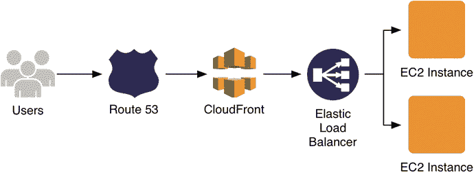

图 4-1。

The request route, from Route 53 to EC2 instances in the application stack

要完成本章，您必须已经注册了一个域，或者在课程中准备好这样做。为了完成这一课，我们将把`cloudyeyes.net`称为域——一个我已经注册的任意域。

## 内容推送服务

在 web 应用中实现缓存有许多不同的方法，CloudFront 只是其中一种。使用 CloudFront 将允许我们缓存和提供独立于应用 EC2 实例的静态资产，以及来自应用的缓存响应数据。其结果是一种缓存机制，可以极大地减少流量对应用的影响。

在本章中，我们将设置 CloudFront 作为应用服务器层请求的通道。要做到这一点，我们必须定义规则，通过这些规则，对 CloudFront 的 URL 请求被处理并路由到我们的应用堆栈。在第 5 章中，我们将设置一个 S3 桶来存储我们所有的图像和其他静态资产。然后，我们将使用 CloudFront 来服务这些资产，只需几个步骤就能有效地创建企业级内容交付网络(CDN)。

CloudFront 允许你在应用中使用 CDN [1](#Fn1) 的功能，完全独立于你的应用层。虽然 CDN 通常只用于图像和其他资产，但我们将使用 CloudFront 向用户交付整个应用，并使用我们定义的缓存规则。

Note

在 CloudFront 术语中，发出 HTTP 请求的最终用户被称为查看者。

### 创建发行版

CloudFront 规则被组织成所谓的分布。首先，我们将为我们的应用创建一个发行版，然后我们将基于各种 URL 模式定义规则。重新登录 AWS 控制台，并在主仪表板上的存储和内容交付标题下选择 CloudFront。像往常一样，创建按钮位于主内容区域的左上角(见图 [4-2](#Fig2) )。单击创建发行版开始创建您的发行版。

图 4-2。

The top of the CloudFront dashboard, with the Create Distribution button

AWS 将发行版创建呈现为一个两步过程。实际上，这些步骤是完全不平衡的。您首先选择一种交付方法，然后在第二步中经历一个漫长的配置过程。

当您选择配送方式时，您可以选择网上或 RTMP。RTMP 是一种 Adobe 流媒体协议，可用于音频或视频流。其他内容都在 web distribution 下，因此您可以单击 Web Distribution 标题下的 Get Started 继续。

### 配置分发

接下来，您将配置分布，并定义默认的源和缓存行为。完成这个过程的唯一方法就是一个一个地检查设置。如果您迷路或犯了错误，您随时可以在以后编辑配置。

#### 原点设置

您将通过定义原点设置开始配置，其中我们为我们的分布配置原点(参见图 [4-3](#Fig3) )。用 CloudFront 的术语来说，origin 就是 CloudFront 提供的内容的来源(origin)。CloudFront 发行版可以提供来自多个来源的内容，我们将充分利用这一特性。

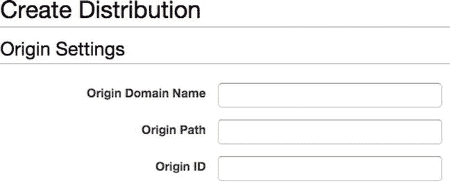

图 4-3。

Origin Settings in a CloudFront web distribution

当您单击 Origin Domain Name 字段时，将出现一个下拉列表，列出您的 AWS 帐户上的所有 S3 存储桶和 HTTP 服务器。在我们的例子中，唯一有效的 HTTP 服务器是我们的弹性负载平衡器，但是高级用户也可以将 CloudFront 用于托管在单个 EC2 实例上的网站。选择我们的负载平衡器 photoalbums-elb-[id]。us-east-1.elb.amazonaws.com，从下拉菜单。Origin ID 只是一个显示在 CloudFront 中的字符串标识符，它将自动生成类似 elb-相册-elb-[id]的内容。让它保持原样，除非你想给它起个聪明的名字。

将原始协议策略设置为匹配查看器，这意味着如果查看器尝试 HTTPS 连接，CloudFront 将接受它们。我们目前没有使用 HTTPS，但以后会，我们不希望 CloudFront 干扰设置。或者，如果您只想允许 HTTP 连接，您可以在 CloudFront 级别控制它。最后，您可以更改默认的 HTTP:80 和 HTTPS:443 端口。您应该还记得，我们的应用正在侦听端口 80，所以我们肯定不想更改这个值。

#### 默认缓存行为设置

当您创建一个发行版时，您基于 URL 路径模式定义缓存规则，我将更详细地讨论这一点。这些规则被称为行为。当我们定义行为时，我们也建立了一个将请求与我们的行为规则进行比较的顺序。因此，请求会按顺序与每个行为进行比较，直到它与某个行为匹配。如果请求与我们声明的任何行为都不匹配，那么 CloudFront 需要一个默认行为来应用于请求。因此，当我们创建 CloudFront 发行版时，我们将定义默认行为(参见图 [4-4](#Fig4) ),任何其他行为都可以在事后定义。

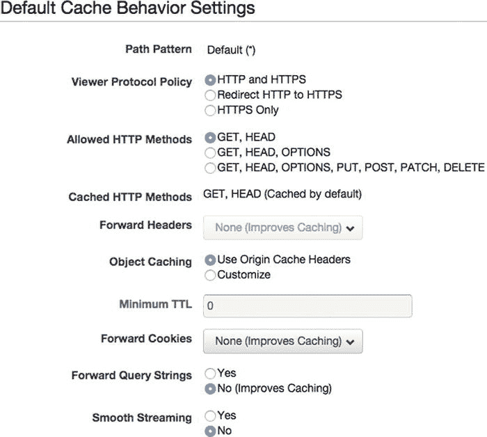

图 4-4。

Distribution Default Cache Behavior Settings

行为之间的主要区别是路径模式，即匹配查看者请求的 URL 路径语法。对于您识别的每个路径模式，您可以配置一组唯一的缓存规则。您可以在表 [4-1](#Tab1) 中找到一些路径模式示例列表。

表 4-1。

A Few Examples of Valid Path Patterns

<colgroup><col> <col></colgroup> 
| 路径模式 | 说明 |
| --- | --- |
| `/users/login` | 仅适用于`/users/login`的规则 |
| `/users/*` | 用于`/users/`目录中所有其他请求的规则 |
| `*.jpg` | 所有`.jpg`文件的规则 |
| 默认(*) | 默认规则 |

你会注意到表 [4-1](#Tab1) 中的第一个路径模式是最具体的，而最后一个模式是最通用的。这是有意的，因为我们将以同样的方式实现缓存行为。从列表顶部开始，按降序检查模式。因此，`*`的默认值必须是最后一个规则。

这也意味着默认路径模式是不可协商的。例如，如果您的默认值是某个值，比如`/users/*`，那么请求可能与您定义的任何路径模式都不匹配。这样一来，CloudFront 就不知道如何满足请求，也就无法为用户生成响应。因此，您将看到您无法更改路径模式，因此我们将继续查看器协议策略。在行为级别，您可以确定查看者是只能通过 HTTP 和 HTTPS 或 HTTPS 访问内容，还是将 HTTP 请求重定向到 HTTPS。现在，我们可以保留默认设置，HTTP 和 HTTPS。

接下来，我们用允许的 HTTP 方法设置选择我们想要允许的 HTTP 方法。可能有些行为或整个应用是只读的。在这些情况下，您将只允许 GET，HEAD 或 GET，HEAD 选项。在我们的例子中，我们必须决定是允许所有方法，然后将它们限制在只读路由中，还是默认为只读，并在特定路由中启用`POST`。让我们采用后一种方法，因为很少有端点不是只读的。因此，我们将选择 GET，HEAD。

下一个字段是缓存的 HTTP 方法。您可能会注意到，无论您在前面的字段中允许什么 HTTP 方法，您都不能选择缓存`PUT`、`POST`、`PATCH`或`DELETE`。这对你来说应该有些意义。例如，如果带有用户登录信息的 HTTP `POST`请求为该特定用户生成了一个身份验证令牌，我们不希望响应被 CloudFront 缓存。如果是这样的话，就会有将缓存的错误信息返回给下一个用户的风险。在任何情况下，该字段都会根据您之前的选择进行更新，所以我们现在不能更改那里的值。

接下来，当 CloudFront 收到请求时，您必须决定是否启用转发头。如果您选择 None，那么您的缓存将会显著提高——CloudFront 在决定是提供响应的缓存副本还是从应用服务器请求新副本时，将会忽略消息头。

如果出于某种原因，您需要解析应用中的 HTTP 请求头，您可以选择 All 或 Whitelist。当您选择白名单时，您可以手动选择与您的应用相关的单个请求头，这将在下一节中详细介绍，但是如果您不感兴趣，可以跳过它。

SCENARIO: WHITE-LISTING HEADERS

为了便于讨论，让我们假设我们想要捕获将访问者链接到我们的应用的网页。我们通常可以在`Referrer` HTTP 头中找到这些信息。如果我们没有从 CloudFront 转发标头，我们就无法访问这些信息，所以我们希望将那个特定的标头列入白名单。

从 Forward Headers 下拉列表中选择 Whitelist，将会出现一个类似下图的界面，带有一个滚动的请求头列表。您会注意到，在标题列表上方有一个文本框，除了从预设中进行选择之外，您还可以在其中输入一个自定义标题，以防您想要在应用中使用自己的请求标题(请参见下图)。

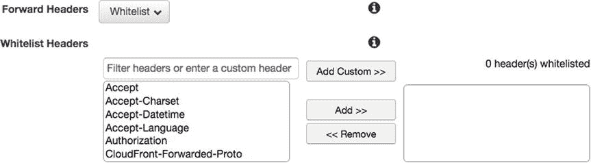

向下滚动标题列表以查找推荐人，然后单击添加> >。当您完成创建这个 CloudFront 发行版时，`Referrer`头在所有通过 CloudFront 运行的请求中都将是动态的，而其他头将是静态的。

在浏览该列表时，您可能会注意到一些不熟悉的标题:

*   `CloudFront-Forwarded-Proto`
*   `CloudFront-Is-Mobile-Viewer`
*   `CloudFront-Is-Desktop-Viewer`
*   `CloudFront-Is-Tablet-Viewer`
*   `CloudFront-Viewer-Country`

这些是 CloudFront 根据自己的内部逻辑添加到请求中的头。例如，前面的三个标题可以帮助您确定查看者是在移动设备、平板电脑还是桌面设备上。AWS 维护自己的内部设备列表，并检查`User-Agent` HTTP 头，将其与设备列表进行比较，并相应地生成这些头。如果您正在考虑使用自己的设备列表来识别移动用户，CloudFront 可以帮您完成这项工作！你可以在 AWS 的博客中找到更多关于这些标题的文档: [`http://aws.amazon.com/blogs/aws/enhanced-cloudfront-customization/`](http://aws.amazon.com/blogs/aws/enhanced-cloudfront-customization/) 。

现在回到主要的课程…

我们将选择 None，不向我们的应用转发任何 HTTP 头。接下来的两个字段，对象缓存和最小 TTL，也是耦合的。在这里，我们必须决定是以编程方式管理缓存响应的到期时间，还是希望在 CloudFront 中这样做。在前一种情况下，我们将选择使用原始缓存头，我们将不得不用 ExpressJS 手动设置我们的头。如果您希望将响应缓存 60 秒，那么在将响应发送回用户之前，您应该添加以下行:

`res.set('Cache-Control', 'public, max-age=60'); // cache for up to 60 seconds`

但是，您也可以使用 CloudFront 来设置这个头，方法是为您的对象缓存选择 Customize，然后将您的最小 TTL 设置为 60。CloudFront 中默认的`max-age`是 24 小时，供参考。我们将选择后者，并将我们的自定义 TTL 设置为 60 秒。

接下来，我们有一些额外的属性可以从 CloudFront 转发到我们的应用服务器。首先是转发 Cookies。同样，我们的选项是 None(为了更好的缓存)、Whitelist 和 All。我们现在将选择 None，因为我们目前没有在我们的应用中使用 cookies。

向前查询字符串是一个简单的是/否选择。我们可以选择否，因为这是我们默认的行为；然而，我们保证在我们定义的其他行为中需要查询字符串。重要的是，任何解析查询字符串的请求都有相应的 CloudFront 行为来转发它们。

SCENARIO: FORWARDING QUERY STRINGS

假设我们没有转发查询字符串，`/user`路由接受一个名为`id`的`GET`参数，并基于这个参数返回关于用户的信息。第一个用户登录到我们的应用并发送一个对`/user?id=1`的请求。她收到了她请求的信息，CloudFront 为`/user`创建了一个缓存对象。然后第二个用户登录并发送一个`/user?id=2`请求。CloudFront 忽略查询字符串，为`/user`寻找缓存对象。它找到为`/user?id=1`缓存的响应，并发送它以响应第二个用户的请求。

看到发生了什么？如果查询字符串影响了输出，并且我们没有转发它们，那么`/user?id=1`和`/user?id=2`被缓存为同一个对象，错误的响应被发送给我们的用户。第二个用户得到了错误的数据，因为我们在应该转发查询字符串的时候没有转发！

因为我们还没有设置用户认证，所以我们不需要保存 cookies。暂时将转发 Cookies 设置为无。将来，我们将不得不允许对某些行为使用 cookies。Smooth Streaming 同样可以设置为 No。这是由 Microsoft 创建的一个 HTTP 协议，它可以针对客户端的带宽实时优化流媒体。这在我们的应用中没有多大用处，不是吗？

本节的最后一部分是使用签名的 URL 来限制查看者访问的选项。您也可以将其设置为 No。您可以启用此功能，以便通过 CloudFront 提供私人内容。如果您要这样做，您必须自己管理已签名的 URL，这本身就是一项重要的任务。

#### 分发设置

既然您已经为您的发行版配置了默认行为，那么是时候配置发行版本身了(参见图 [4-5](#Fig5) )。首先，我们必须选择一个价格等级，它通常会影响服务的价格和性能。

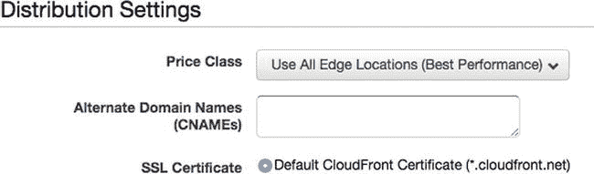

图 4-5。

CloudFront Distribution Settings

##### 价格等级

与 EC2 或 RDS 不同，我们不选择具有内置计算能力的实例。相反，定价基于传输的数据量和激活的区域。对于我们启用了 CloudFront 的每个地区，我们支付数据传输入(从 CloudFront 到分发源)和出(到互联网)的速率，以及每个地区的 HTTP 和 HTTPS 请求的数量。

更令人困惑的是，随着数据量的增加，每个地区的数据传输(到互联网)价格会降低。价格层是企业级的，因此第一个价格层包括每月高达 10TB 的容量。对于按请求数量定价，费率为每 10，000。您可以在 [`http://aws.amazon.com/cloudfront/pricing/`](http://aws.amazon.com/cloudfront/pricing/) 找到当前汇率的完整明细。

用一个简单的例子来总结定价，如果您只为美国和欧洲启用了 CloudFront，您的定价公式如下:

*   美国数据输入+欧洲数据输入+美国数据输出+欧洲数据输出+(美国 HTTP 请求/10，000) +(美国 HTTPS 请求/10，000) +(欧洲 HTTP 请求/10，000) +(欧洲 HTTPS 请求/10，000)

尽管定价复杂，但您的 CloudFront 账单可能比 EC2 或 RDS 账单低一个数量级。如果您只期望美国和欧洲的用户，您可以将您的 CloudFront 发行版限制在这些地区。您还可以将发行范围限制在美国、欧洲和亚洲。但是我们将选择使用所有边缘位置。

##### 备用域名

在这个字段中，您最多可以输入 100 个 CNAMEs，通过这些 CNAMEs 可以访问您的 CloudFront 发行版。这是您将在应用中使用域的第一个地方。您将在此处输入，包括`www`但不包括`http://`。

##### SSL 证书

如果我们有 SSL 证书，我们将在这里配置它。我们现在将跳过这一部分，选择默认的 CloudFront 证书。

##### 默认根对象

当查看者仅在浏览器中输入域时，您可以使用此字段指定索引文件的路径。在我们的例子中，您会记得我们已经在 ExpressJS 中设置了这个相同的函数。当用户请求“`/`”路径时，我们的 Hello World 页面被提供。例如，如果我们使用 CloudFront 来提供一个普通的 HTML 文件，我们会将`index.html`设置为默认的根对象。因此，我们不必使用该功能。

接下来的几个字段与为 CloudFront 生成日志有关。我们将在后面的课程中进一步研究日志。我们暂时将日志设置为关闭。还有一个评论字段，纯粹是内部使用。如果需要的话，你可以在这里给你自己/你的团队留言。最后，分布状态是整个分布的开/关开关。将该值设置为 Enabled，并检查您的选择，以确保一切配置正确。

#### 分发设置—摘要

`Origin Settings`

`Origin Domain Name` `photoalbums-elb-[id].us-east-1.elb.amazonaws.com`

`Origin ID` `ELB-photoalbums-elb-[id]`

`Origin Protocol Policy` `Match Viewer`

`HTTP Port` `80`

`HTTPS Port` `443`

`Default Cache Behavior Settings`

`Viewer Protocol Policy` `HTTP & HTTPS`

`Allowed HTTP Methods` `GET, HEAD`

`Forward Headers` `None`

`Object Caching` `Use Origin Cache Headers`

`Forward Cookies` `None`

`Forward Query String` `No`

`Smooth Streaming` `No`

`Restrict Viewer Access` `No`

`Distribution Settings`

`Price Class` `Use All Edge Locations`

`Alternate Domain Names`[`www.[yourdomain].com`T3】](http://www.yourdomain.com)

`SSL Certificate` `Default CloudFront Certificate`

`Default Root Object` `(blank)`

`Logging` `Off`

`Comment` `(blank)`

`Distribution State` `Enabled`

最后，单击创建发行版。您将返回到 CloudFront 发行版视图，您的发行版将出现在表中，状态为“进行中”。创建您的发行版需要几分钟时间。但是，在创建发行版时，您仍然可以访问它。

### 分布明细视图

单击分发的 ID 以进入分发详细信息视图。它看起来应该如图 [4-6](#Fig6) 所示。

图 4-6。

Distribution detail view

您会注意到，CloudFront 的组织与我们使用的其他服务略有不同。在左边的列中，您将看到辅助导航主要用于访问指标和报告。这与 OpsWorks、IAM 和 EC2 仪表板中建立的模式有些冲突，在这些仪表板中，左侧的导航允许您深入到服务的子部分。

在 CloudFront 中，可以在主内容区域的选项卡式视图中访问发行版子部分。您从常规选项卡(图 [4-7](#Fig7) )开始，在这里您可以看到刚刚创建的分布设置。请注意分发状态，它可以告诉您对分发的最新更改是已经传播(已部署)，还是仍在生效(正在进行)。“起源”标签列出了该分布的所有起源。“行为”选项卡允许您根据请求的 URL 路径定义查看器请求的行为。错误页允许您向查看者显示自定义错误页和 HTTP 状态代码。“限制”选项卡允许您创建访问内容的地理限制，并且您可以使用“失效”选项卡手动清除 CloudFront 缓存。

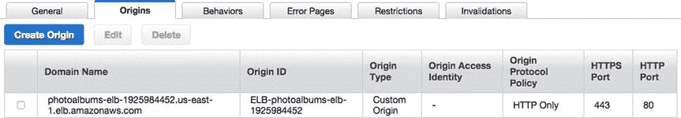

图 4-7。

Distribution origins

#### 起源

点击原点选项卡，如图 [4-7](#Fig7) 所示。在 Origins 表中，您会发现在创建这个分布时创建了一个单一的原点。你现在唯一的来源是相册负载平衡器。这意味着对 CloudFront 实例的请求只能转发给负载均衡器，而不能转发给其他源。将来，我们将在这里添加第二个原点。虽然一个来源可以包含在多个分配中，但是您必须为每个分配中的来源创建一个记录。

Note

你现在可能意识到这里有很大的潜力。您可以创建多个 OpsWorks 堆栈，每个堆栈都有自己的负载平衡器，并在单个域下提供来自多个应用堆栈的内容！

#### 行为

下一个选项卡如图 [4-8](#Fig8) 所示，显示了该分布的行为。当您创建发行版时，您也创建了默认行为。每个分布必须总是至少有一个行为。您会注意到，如果您选择默认行为，您可以编辑它，但不能删除它。

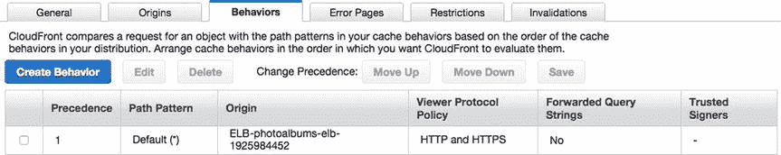

图 4-8。

Behaviors

如果您回忆一下我们为默认行为选择的设置，您会记得不允许使用`POST` HTTP 方法。然而，我们确实需要`POST`来进行用户注册、登录/注销，以及创建照片和相册。因此，我们将根据具体情况确定和创建其他行为。我们立即面临一个选择:我们是否应该为每条允许`POST`的路线创建一个行为？或者我们应该让群体行为变得更加宽容而不那么专一？先说`/users/`。让我们重温一下我们在`/users/*`路径中定义的路线。

`GET /users/`

`POST /users/login`

`POST /users/logout`

`POST /users/register`

`GET /users/user/:user`

我们知道我们必须允许`/users/login`、`/users/register`和`/users/logout`使用`POST`。那么，我们似乎可以考虑用`/users/*`的路径模式将这些逻辑地组合在一个行为中。但是当我们设计我们的行为时，还有其他规则要考虑。我们必须接受带有这些路径的查询字符串吗？`/users/`只有两条`GET`路由，都不接受`GET`参数。饼干呢？我们还没有建立我们的身份验证，但可以肯定地说，我们可能需要它们。

看起来这里的路线有足够的共同点来证明创建一个行为是正确的。点按左上方的“创建行为”按钮。您将看到一个看起来很熟悉的创建行为视图。我们看到这个视图嵌套在更大的 Create Distribution 视图中。

在 Path Pattern 字段中，输入/users/*，以捕获`/users/`路径中的所有请求。我们要明确的是，这不仅仅包括像`/users/login`这样的 URLs 它将拦截任何文件类型的请求。如果您的查看器请求`/users/profile.jpg`或`/users/profile.txt`，它仍然会被这个行为处理，除非列表中更早的行为先捕捉到它。

将允许的 HTTP 方法更改为 GET、HEAD、OPTIONS、PUT、POST、PATCH、DELETE。然后，将转发 Cookies 更改为全部。您可以将其余设置保留为默认值。确保一切看起来像图 [4-9](#Fig9) 中的选择，然后点击创建。

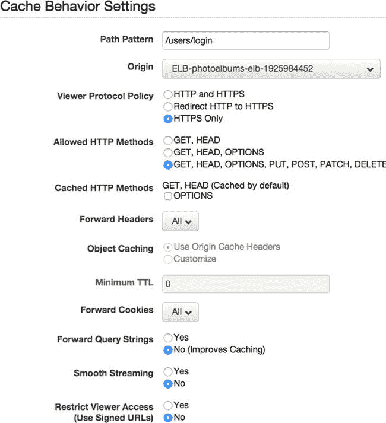

图 4-9。

Create behavior for `/users/*`

接下来，我们将对`/albums/`条路线进行同样的处理。相册功能非常有限，包括以下内容:

`GET /albums/id/:albumID`

`POST /albums/upload`

`POST /albums/delete`

好像和`/users/`挺像的。同样，不需要转发查询字符串，但是我们希望稍后转发 cookies。再次点按“创建行为”，并在“路径模式”栏中输入/albums/*。将允许的 HTTP 方法更改为 GET、HEAD、OPTIONS、PUT、POST、PATCH、DELETE。然后，将转发 Cookies 更改为全部。您可以将其余设置保留为默认值。确保一切正常，然后单击创建。

`/photos/`路线同样与`/users/`非常相似。`/photos/`定义的路线如下:

`GET /photos/id/:photoID`

`POST / photos /upload`

`POST / photos /delete`

让我们用同样的规则创建这个行为。再次单击“创建行为”,并在“路径模式”字段中输入/photos/*。将允许的 HTTP 方法更改为 GET、HEAD、OPTIONS、PUT、POST、PATCH、DELETE。然后，将转发 Cookies 更改为全部。您可以将其余设置保留为默认值。确保一切正常，然后单击创建。

如果您现在查看行为表，您会注意到您可以方便地在表中看到来源、查看器协议策略和转发的查询字符串值，这只是为了更容易地管理您的行为。

再看一下行为表，如图 [4-10](#Fig10) 所示。您将会看到，尽管默认行为是首先创建的，但在表格中，其余行为会按照创建的顺序出现在它的上方。这是因为当 CloudFront 接收到一个 HTTP 请求时，将按照从列表顶部开始递减的顺序检查请求中的每个行为。“优先级”字段从 1 开始向上编号，表示行为的比较顺序。默认行为是最通用的，应该是请求所要比较的最后一个行为。目前，我们的其他行为之间没有重叠，因此它们的顺序并不太重要。如果有的话，您会希望更具体的路径在顶部，优先级更高，而更一般的路径在底部。通过选择行为，单击上移或下移，然后保存，可以更改行为优先级。

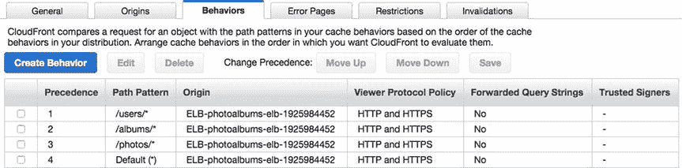

图 4-10。

Updated Behaviors table

### 查询字符串的行为

让我们继续添加一个允许查询字符串的行为。但是首先，我们必须在应用中实际创建路线。在我们添加行为之前，我们将最终返回到代码编辑器，并为 Photoalbums 应用添加一些新功能。我们没有花太多时间讨论示例应用的更大目标，因为它是一个公认的基本应用。但是我们可以尝试添加一些对这个应用和一般的 web 应用开发有用的小功能。

查询字符串(或`GET`参数)的一个常见用途是通过一个或多个参数搜索或过滤内容。为照片添加一个基本的搜索功能会很有用，这样用户就可以在照片中搜索标题字段中的匹配文本。打开`/routes/photos.js`，找到`/id/:id`路线和`/upload`路线之间的空间。将清单 [4-1](#FPar5) 中的代码粘贴到这里。

Listing 4-1\. The `/photos/search` Route

`/* GET photo search */`

`router.get('/search', function(req, res) {`

`if(req.param('query')){`

`var params = {`

`query : req.param('query')`

`}`

`model.getPhotosSearch(params, function(err, obj){`

`if(err){`

`res.status(400).send({error: 'Invalid photo search'});`

`} else {`

`res.send(obj);`

`}`

`});`

`} else {`

`res.status(400).send({error: 'No search term found'});`

`}`

`});`

正如您所看到的，这个路由只是在查询参数中接受一个字符串，并将其传递给`model.getPhotosSearch`。如果缺少查询，则会返回一个错误。控制器逻辑的结构类似于我们创建的其他路由的结构。我们不直接将`GET`参数传递到模型中。相反，我们构造了一个`params`对象，在其上我们可以执行任何我们需要的额外操作。例如，如果我们想从搜索查询中过滤掉脏话，我们可以很容易地用这个模式插入这个功能。

接下来，我们必须在模型中添加`getPhotosSearch`函数。导航至`/lib/models/model-photos.js`。在`getPhotosByAlbumID`函数下面，粘贴清单 [4-2](#FPar6) 中的代码。

Listing 4-2\. `getPhotosSearch` Function in `model-photos.js`

`function getPhotosSearch(params, callback){`

`var query = 'SELECT photoID, caption, albumID, userID FROM photos WHERE caption LIKE "%' +`

`params.query + '%"';`

`connection.query(query, function(err, rows, fields){`

`if(err){`

`callback(err);`

`} else {`

`if(rows.length > 0){`

`callback(null, rows);`

`} else {`

`callback(null, []);`

`}`

`}`

`});`

`}`

该函数也遵循与我们创建的其他模型函数相同的模式。我们选择几个照片字段，并使用 SQL 操作符`LIKE`根据`caption`的值过滤照片。我们运行查询并将结果返回给控制器。我们必须确保通过在文件底部添加下面一行来公开这个函数:

`exports.getPhotosSearch = getPhotosSearch;`

### 部署代码更改

我们已经准备好将我们的代码更改推送到我们的应用堆栈中。如果本地数据库还在运行，您也可以先在本地进行测试。将您的更改提交到代码库中。在 AWS 控制台中，导航回 OpsWorks。点按相册堆栈。打开导航菜单，然后单击应用。单击部署按钮返回到部署应用视图。在“注释”栏中，为“添加的照片搜索方法”添加注释，然后点按“部署”。

### 添加新行为

导航回 CloudFront 并单击您的发行版。打开行为选项卡，然后再次单击创建分布。这一次，我们为一个特定的路径创建一个行为，所以我们将把它直接输入到路径模式:`/photos/search`。这一次，我们将允许的 HTTP 方法设置为默认的 GET，HEAD。同样，Forward Cookies 可以设置为 None，因为这是一个不需要身份验证的公共方法。将转发查询字符串设置为是，然后单击创建。

当您返回到“行为”表时，您会看到新行为位于列表的第四位，优先级为 4。这是行不通的，因为请求在到达这里之前会被`/photos/*`行为捕获。选择新行为并点按“上移”，然后点按“存储”。你的行为表现在应该如图 [4-11](#Fig11) 所示。

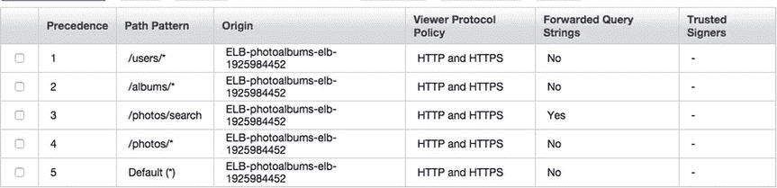

图 4-11。

Behaviors table with new behavior

随着代码的部署和行为的到位，我们应该准备好测试了。我们第一次测试托管在 AWS 上的代码时，我们直接访问了 EC2 实例。接下来的测试，我们在负载平衡器的 URL 上运行我们的请求。这一次，我们在实例和用户之间添加了另一个中间层，我们将使用 CloudFront URL。

返回“常规”选项卡，找到域名。应该是像`[unique-identifier].cloudfront.net`这样的格式。在浏览器中打开这个 URL，您应该会看到 Hello World 页面。现在，让我们创建一些照片，以确保我们的行为正常工作。在我们上传照片之前，我们需要一个`userID`和一个`albumID`。如果您之前创建了一个用户，您可以在`/user/:username`获得他/她的 ID(但是最有可能的是`userID`将是 1)。如果还没有，那么打开 REST 客户机，用下面的参数向`/users/register`发出一个`POST`请求:`username`、`email`和`password`。

当你有了你的`userID`，用`userID`和`title`的参数制作一个`POST`到`/albums/upload`，创建一个相册。您应该会收到对您请求的响应中的`albumID`。接下来，我们可以创建照片对象(是的，仍然没有文件上传附加到它们)。用你的`userID`、`albumID`和标题“Hello World”向`/photos/upload`发出一个`POST`请求。如果您得到一个 ID 作为响应，那么您的照片就创建成功了(当然，您也可以从状态代码 200 中看出这一点)。为了测试搜索，我们需要一些照片。再次发出标题为“你好，芝加哥”的请求，然后发出标题为“再见，纽约”的第三个请求

到目前为止，我们有三张照片，这足以测试一些搜索。在 REST 客户机或浏览器中，请求路径`/photos/search?query=Hello`。您应该会看到两个照片条目:“Hello World”和“Hello Chicago”将您的请求更改为`/photos/search?query=Hello%20World`，您应该只会看到一个条目。

### 贮藏

现在是时候看看 CloudFront 的缓存了。向`/photos/upload`发出另一个`POST`请求，这次标题为“Hello London”然后，向`/photos/search?query=Hello`发出另一个`GET`请求。响应应该快如闪电，但是如果你仔细看 JSON，你将看不到你最近的照片，“你好，伦敦。”这是因为在第一次请求之后，CloudFront 现在为地址`/photos/search?query=Hello`存储了一个缓存对象。它将继续对该 URL 的所有请求发送相同的响应，直到对象过期。但是什么时候到期呢？

存储在缓存中的每个对象都链接到一个行为，其到期时间由相应行为中几个字段的值决定，如图 [4-12](#Fig12) 所示。

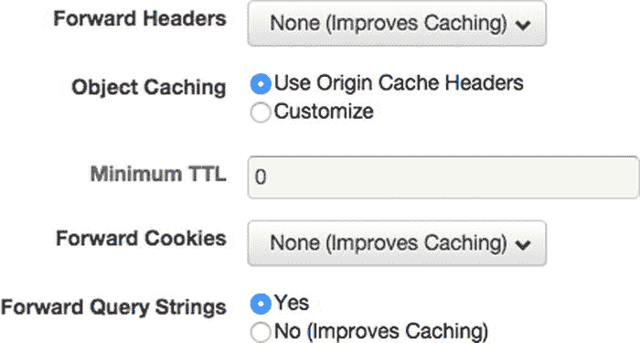

图 4-12。

Important CloudFront behavior fields when determining object caching

决定一个对象在缓存中停留多长时间有两个基本因素:最小 TTL 和 HTTP 请求头。如图 [4-12](#Fig12) 所示，`/photos/search`的行为采用使用原始缓存头来确定对象的缓存。通过这种设置，我们必须以编程方式控制响应的缓存。如果我们将设置改为 Customize，我们可以指定一个对象在缓存中停留的秒数，在这种情况下，CloudFront 将覆盖我们的应用发送的任何`Cache-Control:max-age`头。然而，CloudFront 的默认过期时间是 24 小时，如果我们不努力，它不会在更短的时间内缓存一个对象。

FORWARDED QUERY STRINGS

重要的是要注意其他设置如何影响缓存。因为我们正在转发查询字符串，这意味着它们被纳入对象在 CloudFront 中的存储方式。这意味着`/photos/search?query=hello`和`/photos/search?query=goodbye`作为不同的对象存储在缓存中。如果不是，两次搜索可能会产生相同的结果。

测试这一点的一个简单方法是通过向请求添加一个唯一的查询字符串来强制刷新结果。例如，`/photos/search?query=hello&time=4815162332`与`/photos/search?query=hello&time=4211138`不同，它将迫使 CloudFront 为原点检索一个新的响应。

您应该会在搜索请求中看到如下代码所示的标题:

`Request Header`

`Accept:` `text/html,application/xhtml+xml,application/xml;q=0.9,image/webp,*/*;q=0.8`

`Accept-Encoding:` `gzip,deflate,sdch`

`Accept-Language:` `en-US,en;q=0.8`

`Cache-Control:` `max-age=0`

`Connection:` `keep-alive`

`Host:` `d23xpp2aiwzqtf.cloudfront.net`

`If-None-Match:` `W/"fe-4203691681"`

`Response Header`

`Connection:` `keep-alive`

`Date:` `Mon, 24 Nov 2014 23:51:35 GMT`

`ETag:` `W/"180-2935506378"`

`X-Powered-By:` `Express`

`Age:` `1196 X-Cache: Hit from cloudfront`

`Via:` `1.1 f519cbbbbf1657343dde8ed4d32a9966.cloudfront.net (CloudFront)`

`X-Amz-Cf-Id:` `l1UWAownAiSOIHoV0XGuw5dHo3Rt_9P0Cx5eqCL-Dqus4BijxF-oWg==`

正如您所看到的，请求中的`Cache-Control`头被设置为`max-age=0`，但是这个头明显地没有出现在响应中。虽然您可能认为这意味着 CloudFront 必须刷新对象，但实际上并非如此。如前所述，默认的最小 TTL 为 0 实际上意味着 24 小时，并且在没有源覆盖该指令的情况下，最小 TTL 优先。在我们当前的场景中，浏览器只会缓存响应 0 秒，但是 CloudFront 会将对象保留在缓存中 24 小时。

对于我们的行为，我们面临着一个古老的问题:我们的反应要缓存多久。一方面，缓存我们的结果将减少我们的应用堆栈的工作负载，因为请求可以完全由 CloudFront 处理，而不会加重应用层或数据库的负担。另一方面，用户或客户对企业应用的期望通常意味着我们必须提供近乎即时的结果。我们的代码更改只需要几分钟就可以完成和部署；然而，首先，我们必须从 CloudFront 中移除缓存的对象。

#### 无效

不幸的是，我们不能简单地部署我们的代码并再次测试它。在 CloudFront 的缓存中已经有关于这些 URL 的对象，所以 CloudFront 将继续使用旧的响应头提供响应。这让我们想到了 CloudFront 发行版的另一个特性:失效。

失效本质上是一个从 CloudFront edge 缓存中删除对象的命令。您不能简单地清除浏览器中的缓存，因为失效必须全局发送到 CloudFront 缓存。因为 CloudFront 将您的内容缓存在全球各地的数据中心，所以需要一些时间来撤销它。

乍一看，您可能会想，“为什么我不能在内容更新时以编程方式动态地使我的缓存无效，而在其他情况下对我的响应使用最大缓存？”理论上，这个概念是有意义的:在 CloudFront 中存储所有响应的缓存副本，只有当响应的内容发生变化时才生成新的副本。虽然这听起来不错，但不幸的是，CloudFront 的失效远不是瞬间的。虽然您可以使用 AWS SDK 以编程方式使您的缓存失效(实际上，我们在控制台中所做的一切都可以以编程方式完成)，但是您很快就会发现，在您创建失效和操作完成之间有很大的延迟。

在 CloudFront 中，再次打开您的发行版并单击 Invalidations 选项卡。您将看到一个空的无效表。点击顶部的创建失效按钮，将打开一个模态文本区，如图 [4-13](#Fig13) 所示。添加两条要使其无效的路径，用换行符隔开，如下所示:

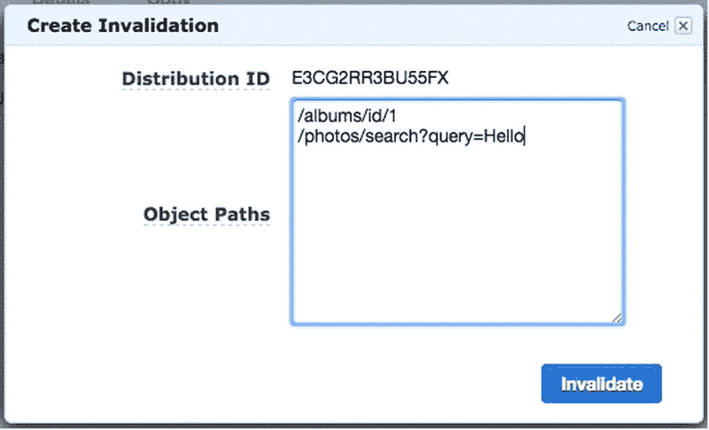

图 4-13。

Creating a CloudFront invalidation

`/albums/id/1`

`/photos/search?query=Hello`

继续并点击无效按钮。您将看到您的失效出现在表格中，状态为“进行中”。更改需要几分钟才能生效，此时状态将变为“已完成”。您还会注意到，每个失效都有一个惟一的 ID 和一个时间戳。现在我们可以修改代码了，一旦代码部署完毕，我们就可以开始测试了。请注意，我们只是在推送修复之前使缓存无效，以节省时间，因为没有其他人在使用该应用。在生产设置中，您应该在使缓存失效之前部署您的更改。

#### 控制缓存

让我们做两个改变，反映两个不同的场景。首先，我们希望照片搜索结果是即时的。让我们指示 CloudFront 永远不要缓存结果。当然，随着用户群的扩大，这将是一个问题，但至少我们知道如何去做。其次，我们将使用 Expires 请求头让请求路由在特定的时间间隔到期。

在第一个场景中，我们将配置请求头，这样浏览器和 CloudFront 都不会试图缓存响应。在代码编辑器中，导航到`/routes/photos.js`。找到`/search` rout 的处理程序，并将下面一行粘贴到函数的开头:

`res.header('Cache-Control', 'no-cache, no-store');`

这应该很简单，因为我们只是使用 ExpressJS 语法将一个键值对传递给响应头。它属于函数的开头，以避免复制粘贴。概括地说，该函数应该类似于清单 [4-3](#FPar8) 。

Listing 4-3\. `/photos/search` with Cache-Control Header

`router.get('/search', function(req, res) {`

`res.header('Cache-Control', 'no-cache, no-store');`

`if(req.param('query')){`

`var params = {`

`query : req.param('query')`

`}`

`model.getPhotosSearch(params, function(err, obj){`

`if(err){`

`res.status(400).send({error: 'Invalid photo search'});`

`} else {`

`res.send(obj);`

`}`

`});`

`} else {`

`res.status(400).send({error: 'No search term found'});`

`}`

`});`

接下来，我们将添加第二个用例。假设按 ID 请求相册时的响应可以被 CloudFront 缓存十秒。这将使响应保持最新，而不会像完全禁用缓存那样加重服务器的负担。打开`/routes/albums.js`并找到`/id/:id`路线的处理程序。在函数的顶部，添加以下两行:。

`res.header("Cache-Control", "public, max-age=10");`

`res.header("Expires", new Date(Date.now() + 10).toUTCString());`

您的处理程序应该类似于清单 [4-4](#FPar9) 。

Listing 4-4\. `/albums/id/:albumID` with Cache-Control Header

`router.get('/id/:albumID', function(req, res) {`

`res.header("Cache-Control", "public, max-age=10");`

`res.header("Expires", new Date(Date.now() + 10000).toUTCString());`

`if(req.param('albumID')){`

`var params = {`

`albumID : req.param('albumID')`

`}`

`model.getAlbumByID(params, function(err, obj){`

`if(err){`

`res.status(400).send({error: 'Invalid album ID'});`

`} else {`

`res.send(obj);`

`}`

`});`

`} else {`

`res.status(400).send({error: 'Invalid album ID'});`

`}`

`});`

响应接受当前日期，并在其上加上十秒(以毫秒为单位)，然后设置标头。需要注意的一点是，这十秒钟并不准确，因为在发送响应之前，从模型中检索数据仍然需要时间。如果你想让它尽可能接近完美，那就在回调中为`model.getAlbumByID`设置头。

你可能想知道为什么标题被设置在顶部。还有其他可能的响应，例如当 URL 中缺少相册 ID 时，或者当没有为所提供的 ID 找到相册时，会发送 400 错误，后者可能是由某种数据库错误引起的。CloudFront 可能会缓存用户看到的错误响应，从而导致这个错误错误地显示给其他用户。在这种情况下，CloudFront 可能会因为不必要地延长客户端的错误而适得其反。因此，最好让所有响应都包含 Expires 标头。您可以在每次从这个路由发送响应时设置标题，但是这只会使列表看起来更混乱。毕竟，如果一个代码样本太杂乱，那么它又有什么用呢？

无论如何，继续将您的更改提交到您的代码库中。在 AWS 控制台中，导航回 OpsWorks。点按相册堆栈。打开导航菜单，然后点按“应用”。单击部署按钮返回到部署应用视图。在“注释”字段中，添加“添加的缓存控制头”的注释，然后单击“部署”。给 OpsWorks 几分钟时间来推进你的代码。

#### 测试 CloudFront 缓存

部署完成后，让我们先测试相册路径。在您的浏览器中向`/albums/id/1`发出`GET`请求(确保清除您的本地缓存)或 REST 客户端。看一下响应标题。它们看起来应该类似于清单 [4-5](#FPar10) 。

Listing 4-5\. New and Improved, Ten-Second Cache Response Headers

`Response Header`

`Cache-Control:public, max-age=10`

`Connection:keep-alive`

`Content-Length:631`

`Content-Type:application/json; charset=utf-8`

`Date:Wed, 26 Nov 2014 01:29:02 GMT`

`ETag:W/"277-3646801943"`

`Expires:Wed, 26 Nov 2014 01:29:02 GMT`

`Via:1.1 a2c541774483a4b9c153c3cb7c7a7753.cloudfront.net (CloudFront)`

`X-Amz-Cf-Id:pcxqj03svkFItzzQ3KWi4OK5jJf4eGXs91PCQLjv2liWf9f7iP-KaQ==`

`X-Cache:Miss from cloudfront`

`X-Powered-By:Express`

响应标头的重要部分以粗体显示。首先，您可以看到我们添加的 Cache-Control 头逐字出现。Expires 标头应该在当前时间后大约十秒钟出现，以适应时区差异。你还会看到一个我们没有添加的头，X-Cache。第一次，这可能是“cloudfront 小姐。”快速连续地发出几个请求，您将看到“来自 cloudfront 的点击”这个头通知您 CloudFront 是提供了一个缓存的响应(命中)还是必须从源位置检索一个新的响应(未命中)。

但是，您的浏览器或 REST 客户端也可能符合缓存头，缓存 X-Cache 头，因此您可能看不到预期的结果。如果是这种情况，您必须使用 cURL 进行测试。打开您的命令行界面(终端)，并键入以下命令:

`curl –I http://[cloudfront-id].cloudfront.net/albums/id/1`

如果您从 CloudFront 收到一个带有 miss 的响应头，请多运行几次该命令。在第二次或第三次请求时，您应该会收到一个命中结果。

您还会注意到 X-Amz-Cf-Id 头。您可能已经推断出这是请求的 CloudFront ID。如果在 CloudFront 中启用日志记录，这是 CloudFront 收到的每个请求的惟一 ID。如果您在调试 CloudFront 问题时需要向 AWS 寻求支持，它可能会询问您遇到问题的 X- `Amz-Cf-Id`请求。

接下来，让我们测试一下照片搜索的无缓存解决方案。为了演示这一点，我们将进行搜索，上传另一张照片，然后再次运行搜索。首先，通过向`/photos/search?query=New%20York`发出请求来搜索带有“纽约”字样的照片。您应该会看到类似于清单 [4-6](#FPar11) 的内容。

Listing 4-6\. No-Cache Response Headers and Body

`Response Header`

`Cache-Control:no-cache, no-store`

`Connection:keep-alive`

`Content-Length:67`

`Content-Type:application/json; charset=utf-8`

`Date:Wed, 26 Nov 2014 04:23:44 GMT`

`ETag:W/"43-3955827999"`

`Via:1.1 b05dafe95c8baade280459c121e622be.cloudfront.net (CloudFront)`

`X-Amz-Cf-Id:zhNlH4MXzU9G7Mrb5tVgBq8qtMLlW3XONjZsmEZOmQ5MhXmCqdJxAg==`

`X-Cache:Miss from cloudfront`

`X-Powered-By:Express`

`Response Body`

`[{"photoID":3,"caption":"Goodbye New York","albumID":1,"userID":1}]`

重要的标题再次被加粗。你可以在顶部看到我们的缓存控制头。我们的第一次搜索在 X 缓存头中得到一个`Miss from cloudfront`。这是有意义的，因为这应该是我们在缓存中使对象无效后运行的第一次搜索。现在让我们创建另一张照片并再次搜索，以确保得到我们期望的结果。

制作一个新的`POST`到`/photos/upload`，使用与之前相同的相册和用户 id，标题为“Hello New York”当您得到 200 响应时，再次运行搜索查询。你的回应应该看起来像清单 [4-7](#FPar12) ，新照片几乎立即出现在下一次搜索中。

Listing 4-7\. Search Results Showing Up Instantly in the Next Request

`Response Header`

`Cache-Control:no-cache, no-store`

`Connection:keep-alive`

`Content-Length:132`

`Content-Type:application/json; charset=utf-8`

`Date:Wed, 26 Nov 2014 04:35:58 GMT`

`ETag:W/"84-3303063004"`

`Via:1.1 2b0986af7f8d32d3d4b4cf9330702abf.cloudfront.net (CloudFront)`

`X-Amz-Cf-Id:KTpgTxO9XBebAzuS0MSP1f2EkrcRGfqijMFz3Fc6xGqI93TPXsnldw==`

`X-Cache:RefreshHit from cloudfront`

`X-Powered-By:Express`

`Response Body`

`[`

`{`

`"photoID":3,`

`"caption":"Goodbye New York",`

`"albumID":1,`

`"userID":1`

`},`

`{`

`"photoID":10,`

`"caption":"Hello New York",`

`"albumID":1,"userID":1`

`}`

`]`

这一次，X 缓存头的值是`RefreshHit from cloudfront`。这意味着 CloudFront 意识到它需要刷新请求，它也确实这么做了。这正是我们想要发生的！

由于浏览器的行为，这两种场景之间的差异可能会令人困惑，因为 CloudFront 和浏览器都响应相同的 HTTP 响应头。对于`/albums/id/1`请求，CloudFront 和浏览器都响应头指令来缓存响应，所以浏览器通常会缓存整个响应，包括响应头。您可以通过关注 X-Amz-Cf-Id 头并观察它的变化来验证这一点。

在`/photos/search`响应的情况下，浏览器服从 Cache-Control: no-cache，no-store 头，因此总是向 CloudFront 发出新的请求，CloudFront 又通过总是将请求转发给源来响应头。

虽然还有许多其他可能的场景，但是我们已经讨论了两个主要的缓存策略，您将从您的源以编程方式生成这两个策略。如果您发现自己不得不适应一些不寻常的场景，AWS 在 [`http://docs.aws.amazon.com/AmazonCloudFront/latest/DeveloperGuide/Expiration.html`](http://docs.aws.amazon.com/AmazonCloudFront/latest/DeveloperGuide/Expiration.html) 提供了一个所有可能的源响应头用例的表格。

#### 缓存统计

我们已经运行了一些测试，以查看 CloudFront 何时为我们的内容提供服务，以及源何时提供服务。幸运的是，很容易得到我们对象行为的统计分类。在左侧导航中，在 Reports & Analysis 标题下，您将看到许多描绘 CloudFront 性能的报告。首先，单击 Cache Statistics，这将显示一系列图表。在顶部，您会看到一系列字段，您可以使用这些字段来过滤页面上的所有图表。选择开始日期和结束日期，包括您在本章中处理的日期范围。将 Web 分发更改为您的分发，然后单击更新。

第一个图表“请求总数”不言自明。第二个图表是按结果类型划分的查看者请求百分比，如图 [4-14](#Fig14) 所示。在这里，您可以看到您的请求按命中、未命中和错误分类。有趣的是，图表中没有显示刷新次数。尽管如此，命中请求的百分比是一个很好的观察指标。这基本上告诉了你什么时候 CloudFront 正在保存你的应用，因为每次点击都是一个由 CloudFront 处理的请求。正如你在图 [4-14](#Fig14) 中看到的，当新的缓存规则被应用时，点击量急剧下降。

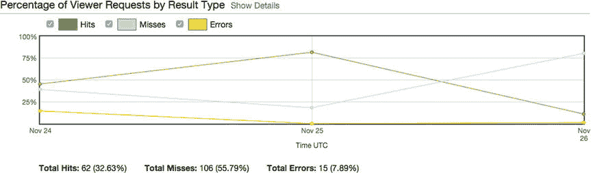

图 4-14。

Percentage of Viewer Requests by Result Type

请按照自己的进度随意查看其他图表。稍后，当讨论监控应用堆栈健康状况的方法时，我们将回到 CloudFront 报告。接下来，单击 CloudFront 导航中的热门对象。您将再次看到一个顶部带有过滤工具的视图。选择与您学习本章的天数相对应的日期范围，然后单击更新。您应该会看到类似于图 [4-15](#Fig15) 中的表格。

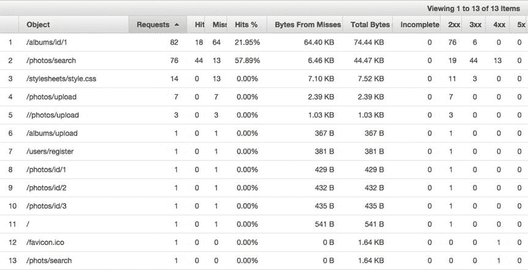

图 4-15。

Popular objects in CloudFront distribution

这是一个方便的细分，因为您可以确定用户在哪些地方点击和未点击，以及应用生成了多少可能由 CloudFront 生成的输出。

如果您正在寻找优化代码或提高 CloudFront 效率的起点，您还可以看到哪些请求收到得最多。同样重要的是，您可以看到哪些对象响应 4XX 或 5XX 错误，这是非常宝贵的诊断信息。

下一节，使用报告，也充满了有用的指标来衡量您的应用的流量。您也可以随意探索，但这并不是本课程的重点。我会在[第 7 章](7.html)讨论监控和报警，所以你现在不用复习。

GEO-RESTRICTIONS

另一个在企业层面可能有帮助的功能是地理限制，即阻止往来于世界特定地区的流量。虽然您以前可能不得不在软件级别执行这种阻止，或者依赖网络管理员来执行，但有了 CloudFront，您可以非常轻松地使用这一特性。

让我们假设我们只希望我们的应用在美国可用。返回到 CloudFront 仪表板，再次选择您的发行版。单击限制选项卡，这将带您到限制表。这里的用户界面有点滑稽。表中唯一的实际限制是地理限制。点按表格上方的“编辑”按钮。您将面临一个单一的设置:启用地理限制。嗯嗯……让我们选择是。

有两种启用地理限制的方法:白名单和黑名单。简而言之，你可以选择允许哪些国家(白名单)，也可以选择不允许哪些国家(黑名单)。因为我们只希望允许一个国家，所以将美国列入白名单比将其他国家列入黑名单更符合逻辑。选择美国-美国并单击添加> >(见下图)，然后单击是，编辑。

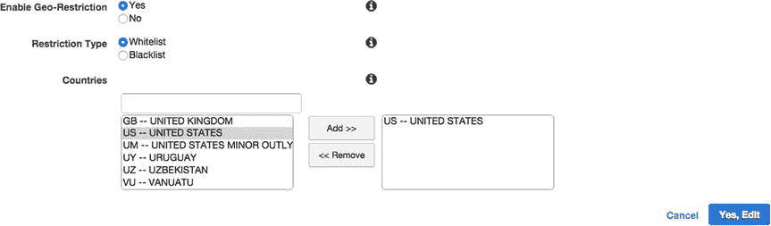

您将返回到分布视图中的限制选项卡，在这里您将看到地理限制的状态为已启用，类型设置为白名单。同样，当更改生效时，您的发行版将处于“正在进行”状态。

Note

如果你想测试地理限制，你可以将你当前所在的国家列入黑名单，并尝试通过 CloudFront URL 访问你的应用。

既然我已经介绍了 CloudFront 的基本特性和用例，那么是时候继续讨论在您的应用托管在域名之前我们必须配置的最终服务了。返回 AWS 控制台并选择路线 53。

## 53 号公路

我们如何将我们的域指向应用？如果您以前使用过 DNS，您可能会注意到我们可以指向我们的域的几个位置:我们的一个实例的公共 IP、我们的负载平衡器的 URL 或者我们的 CloudFront 实例的 URL。这些方法都有一些限制。

首先也是最重要的，我们要坚持第一章中提出的原则:可伸缩性和弹性。显然，我们的 EC2 实例的 IP 地址是不可靠的，如果我们添加新的实例，但是我们的域只指向一个实例，我们就不能适当地伸缩。DNS 更改可能需要 72 小时才能传播。现在，我们可以对我们的配置进行任意数量的更改，并在几秒或几分钟内看到结果。无论出现什么问题，我们都希望保持这种能力。如果我们出于某种原因必须启动应用堆栈的克隆，负载平衡器地址将会改变。我们也不能肯定地说我们的 CloudFront URL 永远不会改变。有可能，我们要做好准备！

为了获得最佳结果，我们将使用路由 53 来配置我们的 DNS。我们将配置我们的域指向 AWS 名称服务器，然后我们可以添加我们的 CNAMES、A 记录、MX 记录等。在 53 号公路。我们可以将`www`和`app`子域用于不同的目的，或者我们可以让`www`和`dev`子域指向各自的生产和开发应用堆栈。在这一课中，我们将简单地了解服务，并在`www.[` `your-domain` `].com`设置我们的应用堆栈。我们开始吧！

我们假设您已经预订了想要使用的域名，并且知道如何使用域名注册机构的门户网站。如果您还没有域名，实际上您可以在 53 号公路上注册一个，方法是单击左侧导航中的注册域名，然后按照步骤进行操作。然而，我们的重点将是与现有的领域。

在 Route 53 仪表板上，您将在顶部看到您的资源:0 个托管区域、0 个运行状况检查和 0 个域。一个域的记录集收集在称为托管区域的实体下。这与域名不同，域名只是您从 Route 53 注册的域名。

单击左上角的托管区域，然后单击顶部的创建托管区域。这一次，创建工具将出现在屏幕右侧的一个容器中，而不是将您带到一个新的视图或呈现一个模态弹出窗口(看，每个 AWS 服务都有一个微妙的独特界面)。在域名字段中，输入您的域名，不要包含 http://或 www。输入标记托管区域的注释，并将类型字段设置为公共托管区域(参见图 [4-16](#Fig16) )。单击视图底部的创建。

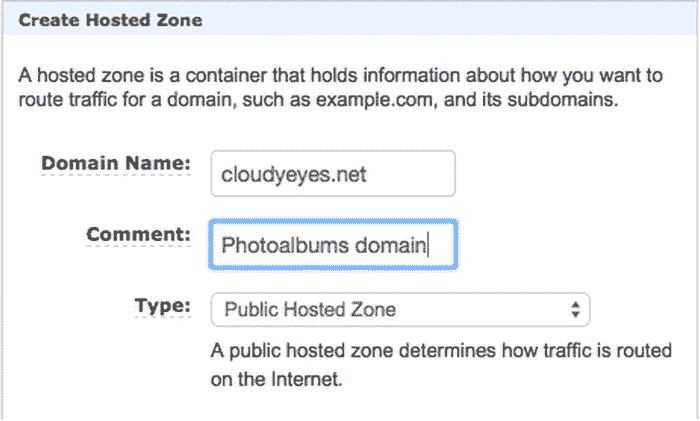

图 4-16。

Create Hosted Zone in Route 53

您的托管区域将很快出现在表格中(您可能需要单击右上角的刷新按钮)。选择它并单击转到记录集。

如图 [4-17](#Fig17) 所示，记录集视图是一个双面板布局，左侧是您的托管区域记录，右侧是详细信息/编辑视图。一旦创建了托管区域，AWS 将自动生成四个 AWS 名称服务器地址，作为 NS(名称服务器)类型记录的值。回到您的域名注册机构，将您的域名服务器依次更改为这些地址。如您所知，DNS 更改传播可能需要 72 小时。你还会看到一个 SOA，权威的开始，记录。你很可能不需要接触它，但它是域名注册的必要组成部分。

图 4-17。

Record sets

我们将假设您已经准备好继续前进，同时您的域更改正在传播。下一个任务是将请求从您的域路由到 CloudFront。为此，我们将创建一个 A 记录并将其指向我们的`www`子域。

在屏幕顶部，单击创建记录集。您将看到屏幕右侧的面板会更新您需要的界面元素，以便创建一个记录集。在名称字段中，输入要为其创建记录的子域。在字段中输入 www。Type 字段应设置为–IP v4 地址，因此只有在情况并非如此时才更改该字段的值。

下一个名为“别名”的字段有许多附属选项。术语“别名”是“AWS 资源别名”的简写您实际上是在选择是要直接链接到您创建的 AWS 资源，还是要手动配置它。如果选择“否”,则可以设置 TTL 并直接在值字段中输入 IP 地址。选择 Yes，您将看到界面发生了变化。现在，系统会提示您输入别名目标的名称。如果您单击该字段，将出现一个下拉列表，列出您所有符合条件的 AWS 资源，如图 [4-18](#Fig18) 所示。您应该可以看到您的负载平衡器和您的 CloudFront 发行版。

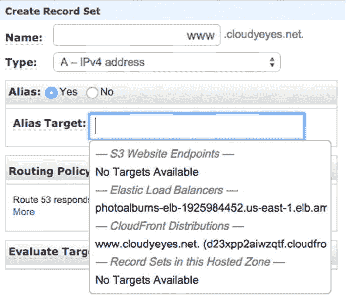

图 4-18。

Selecting your record set alias target

从下拉列表中选择您的 CloudFront 发行版，您会看到字段旁边出现一个黄色的警告图标。此图标提醒您在 CloudFront 发行版中设置备用域。幸运的是，我们之前做过，所以我们不需要担心。

接下来，是我们的子域的路由策略。我们将把它设置为简单，但是最好知道您可以用这个策略做什么。通过利用路由策略，您可以为同一个子域创建多个记录，这些记录协同工作以将用户路由到最佳的 AWS 资源。虽然这方面的教程超出了本课的范围，但我将讨论路由策略可能有用的几种情况。

设想一个场景，您希望在每个 AWS 区域中建立一个完整的应用堆栈，而不是使用 CloudFront。首先，您将克隆您的应用堆栈，并为不同的区域配置不同的堆栈。然后，您将前往 Route 53 并使用路由策略创建一个 www 记录集:Geolocation。您将选择默认，并创建您的记录集。然后，您可以为每个洲创建一个 www 记录，这样总共有八个 www 记录。然后，您可以将每个堆栈指向离该大陆最近的负载平衡器(可能会有一些重复，比如南极洲就没有任何 AWS 数据中心)。

在另一个场景中，假设您只想在主堆栈性能不佳时准备好一个备份应用堆栈来处理请求。首先，您将在 OpsWorks 中克隆您的应用堆栈。然后，您将使用路由策略创建两个记录集:故障转移。一个记录集是故障转移记录类型:主要，另一个是故障转移记录类型:次要。当然，您需要一些指标来确定请求被路由到备份堆栈的点。您将在您的子域上创建一个健康检查，并确定用于确定健康状况的参数。然后，当您的应用堆栈运行缓慢或遭遇中断时，Route 53 会自动将流量路由到备份堆栈。

这只是几个例子，但是您可以看到使用 Route 53 保存 DNS 记录的效用。继续操作并单击 Create，使用简单的路由策略完成记录集的构建。您的记录集应该立即出现，类型列为 A(别名)，如图 [4-19](#Fig19) 所示。一旦您给了您的 DNS 更改传播时间，您应该最终能够访问您的域中的 Hello World 页面！

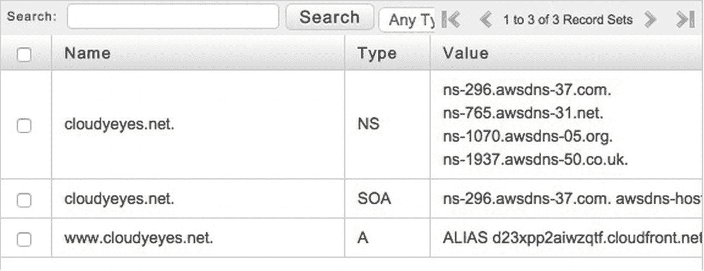

图 4-19。

ALIAS record created

## 摘要

在这一章中，我们达到了使我们的应用在万维网上可访问的重要里程碑。这并不容易，但是到目前为止，我们在发布网络应用方面已经取得了巨大的进步。通过使用 CloudFront，我们通过缓存和加速内容交付优化了我们的应用性能。然而，有几个主要部分不见了。

首先，我们有一个照片分享应用，不接受任何照片上传！我们将在下一章中添加这一功能，但重要的是我们首先要设置 CloudFront，因为我们在编写代码时会考虑到 CloudFront。

记住我们试图坚持的基本原则也很重要:可伸缩性和弹性。虽然我们拥有一些难以置信的资源，但我们还没有真正实现这些。您将在后面的课程中处理应用健康和监控问题，但重要的是要记住，路的尽头并不是让我们的应用上线。不管真正的目标是什么，都要保持我们的应用在线。

Footnotes [1](#Fn1_source)

有关 CDN 和性能的有用讨论，请参见 [`www.webperformancetoday.com/2013/06/12/11-faqs-content-delivery-networks-cdn-web-performance/`](http://www.webperformancetoday.com/2013/06/12/11-faqs-content-delivery-networks-cdn-web-performance/) 。