# 七、监控应用

我们已经谈了很多我们设计系统的主要原则——可伸缩性和弹性——在这个过程中，你已经了解了这些概念。迄今为止，我们几乎无法将这些原则付诸实践。虽然您已经看到可以通过各种 AWS 服务快速增加资源分配，但我们还没有明智地这样做。当然，您总是可以在尽可能大的服务器上运行您的应用，但是这忽略了一点。弹性再次意味着能够扩展我们的基础设施以响应需求或其他事件，我们将这些统称为事件。在本章中，您将学习如何应用这一原则，首先识别事故，然后做出反应。

我们如何知道我们需要扩展？应对事故的第一个也是最重要的障碍是评估我们基础设施的健康状况。虽然我们不需要知道当前有多少用户登录，但是我们需要能够评估对我们的应用有一定影响的特定指标。例如，如果我们想知道 EC2 实例的大小是否足够，我们必须测量诸如 CPU 利用率和内存之类的东西，以便确定当前实例的状态。如果我们的应用运行在单个实例上，并且它的 CPU 利用率为 100%，那么将会出现严重的性能问题，我们可以称之为事件。

一旦我们发现一个事件，我们必须制定一个反应。在前面的场景中，最明显的反应是向我们的应用堆栈添加另一个实例。在本章中，我们将针对这种情况和其他可能发生的情况制定计划，并自动对事件做出响应。您将学习如何使用基于负载和基于时间的 EC2 实例来部署额外的资源，以响应和预测高需求。当然，有些事件需要人工干预来解决，或者其解决方案超出了初学者手册的范围。在这些情况下，我们将在发生重大事件时设置通知。

## 云监控

亚马逊已经将他们所有的监控指标整合到一个名为 CloudWatch ( [`http://aws.amazon.com/cloudwatch/`](http://aws.amazon.com/cloudwatch/) )的伞形服务下。您可以在任何其他 AWS 服务中查看的任何指标也可以在 CloudWatch 中收集和跟踪。通常，在 CloudWatch 中更容易详细查看指标。需要注意的是，AWS 指标仅在两周内有效。

让我们先来看看 OpsWorks 中的指标，并将它们与 CloudWatch 进行比较。登录 AWS 控制台并导航到 OpsWorks。选择相册堆栈。然后打开导航下拉菜单，并单击监控。默认情况下，您将看到分配了 EC2 实例的应用层的监控视图(参见图 [7-1](#Fig1) )。在此视图中，RDS 和 ELB 图层不会出现。

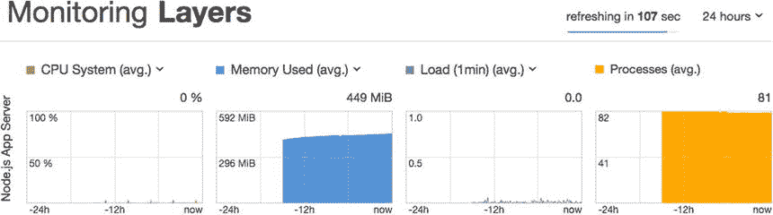

图 7-1。

The OpsWorks Monitoring view

将显示四个类别的层度量，每个都有自己的图表:CPU 系统、使用的内存、负载和进程。默认情况下，会加载过去 24 小时的指标。您可以快速查看是否有任何 CPU 系统(利用率)、内存使用或负载达到最大值的重大事件，或者活动进程中是否有峰值。前三个图表标题实际上都是一个下拉菜单，可用于从该类别中选择另一个指标。图 [7-2](#Fig2) 显示已用内存下拉列表。

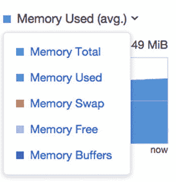

图 7-2。

An OpsWorks Monitoring metric drop-down

您也可以将日期范围从 24 小时更改为另一个范围。这些似乎是非常有用的指标，但是没有办法更详细地查看它们。您可能认为单击其中一个图表会将其展开，但它会将您带到其他地方:到层中实例的监视视图。记下内存使用指标，因为我们将在 CloudWatch 中查看它。现在，让我们转到 CloudWatch 控制面板，在那里查看这些指标。

打开服务下拉列表，并选择 CloudWatch。在控制台的顶部，您会看到一个标题为“指标摘要”的标题(参见图 [7-3](#Fig3) )。在此标题下，单击浏览指标按钮。

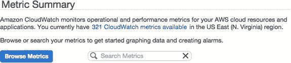

图 7-3。

CloudWatch Metric Summary

在 Metrics 视图中，您可以看到您的 AWS 帐户的所有指标，先按服务细分，然后再按该服务中的类别细分(参见图 [7-4](#Fig4) )。您在此处看到的指标数量取决于您的帐户上已经创建了哪些资源。

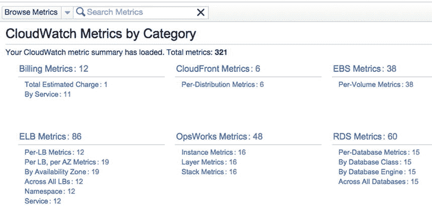

图 7-4。

CloudWatch Metrics by Category

让我们来看看我们的应用的指标。假设我们想看看我们的应用层使用了多少内存。在 OpsWorks 度量标题下，单击层度量。您应该会看到一个按名称及其对应的 LayerId 字母顺序排列的指标列表，如图 [7-5](#Fig5) 所示。因为我们只有一个分配了 EC2 实例的 OpsWorks 层，所以每个指标出现一次，并对应于 Node.js 应用层。

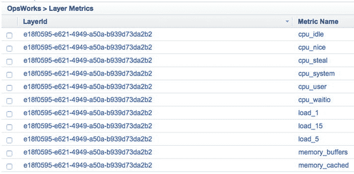

图 7-5。

OpsWorks Layer Metrics

向下滚动到名为 memory_used 的指标。单击它旁边的复选框。在指标列表下方，会神奇地出现一个图表，以 5 分钟的间隔显示过去 12 小时的指标(参见图 [7-6](#Fig6) )。

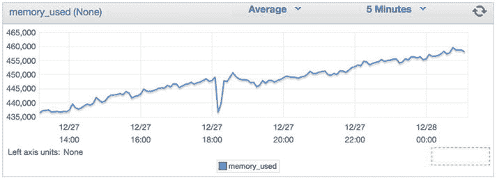

图 7-6。

OpsWorks Layer Metrics in CloudWatch

这与我们刚才在 OpsWorks 中看到的指标相同，只是更加详细。默认情况下，数据点的跨度和间隔是不同的，但是我们可以很容易地将图表更改为 24 小时和 1 分钟的平均值，以匹配 OpsWorks 中的图表。单击 5 分钟展开间隔下拉列表，并更改为 1 分钟。使用图表右侧的时间范围过滤器(图中未显示)，将 From 字段更改为 24。然后单击更新图表。您现在应该会看到与在 OpsWorks 中看到的相同的数据集。您也可以将鼠标悬停在图表中的直线上，查看每个点的更多详细信息。

CloudWatch 中另一个有用的特性是可以查看多个指标。在我们的例子中，与总的可用内存相比，使用的内存量是一个更有价值的指标。在度量列表中，选择 memory_total 度量。您的 memory_used 图应该变成橙色，memory_total 指标将显示为蓝色。这看起来不太对吧？如果 memory_used 线高于 memory_total 线，则必须翻转坐标轴。将鼠标放在其中一行上，找到 Y 轴属性。然后，单击“切换”来更改轴。现在您应该对这两个指标都有了一个视图，向您显示在过去的 24 小时内您的可用内存使用了多少(参见图 [7-7](#Fig7) )。

图 7-7。

Memory used vs. memory total

正如你在图 [7-7](#Fig7) 中看到的，我有 600MB 的总可用内存，我在过去 24 小时的使用量大部分都在 400MB 到 500MB 之间徘徊。请记住，这不仅仅是 Node.js 应用的内存使用情况；它包括在实例上运行的所有软件，包括操作系统。下一个问题是如何处理这些信息。

## CloudWatch 警报

当您的指标超过特定阈值时，您可以配置一个 CloudWatch 警报，向您或您的团队发送通知。您可以使用 CloudWatch 中可用的任何指标在您的帐户上创建多达 5，000 个警报，在撰写本文时，这些警报每月每个警报的费用为 0.10 美元。创建这些警报的主要目的是量化应用堆栈中发生的事件，从而导致手动或自动响应。

创建有用的警报可能不像听起来那么容易。如果您的应用出现问题，您完全有可能创建警报，然后完全忽略正在发生的事件。例如，假设您正在创建警报，以通过 HTTP 监控应用的输出(稍后将详细介绍)。您可以创建一个警报，当 HTTP 响应代码 500 返回给用户时触发该警报，但是由于代码中的一些不可预见的错误，您的应用只是挂起，并且请求超时。您的应用将没有响应，而您永远也不会知道！

创建警报时，选择一个指标和一个比较运算符(大于、小于、大于或等于等)。).您不能直接比较两个指标来创建警报。例如，您不能创建当已用内存> =总内存时发出的警报。您必须将警报配置为在已用内存> = 600，000 时响起。不幸的是，这个警报并没有那么有用，除非您打算将实例保持在特定的比例。

乍一看，你可能会想，当我们使用所有 600MB 时，警报不会响起吗？那么，我们不能添加新的实例，并在警报停止时关闭它们吗？当您向您的层添加另一个实例时，也会有与该实例相关联的大量内存开销，因此这可能不是最实用的警报。只要您有更多的实例(因此有更多的内存)在线，内存占用可能会错误地保持警报状态为活动状态，而实际上事件不再发生。

报警有三种可能的状态:正常、报警和数据不足。当报警条件为`false`时，出现正常状态。如果你的闹钟被设计成在 memory_used == 600，000(据我们所知，并没有那么有用)时响起，它将处于 OK 状态，直到满足这个条件，此时它将切换到 alarm。INSUFFICIENT _ DATA 状态意味着没有足够的数据来确定报警是处于正常状态还是报警状态。当第一次创建警报时，如果没有收集足够的数据，或者由于某种原因，度量数据当前不可用，您可能会看到此警报。如果您长时间看到这种状态，这意味着您的警报有问题，您应该调查为什么它没有按预期工作。

### 警报周期

当然，AWS 基础设施和您的应用都容易出现问题，就像任何其他技术一样。如果您的应用慢了几秒钟，或者单个用户经历了延迟，您不一定希望所有的警报都响起。为此，您必须定义检查报警状态的时间间隔以及构成报警状态的连续周期数。

假设我们要根据应用层的 CPU 利用率设置一个警报。如果 CPU 利用率大于 50%，我们希望得到通知。这是一个相当重要的指标——如果我们的 CPU 利用率太高，这意味着我们的实例超负荷工作，我们的应用将变得无响应。因此，我们应该将闹铃的间隔或周期设置为一分钟，这是一种相当常规的健康检查。也就是说，如果 CPU 利用率出现孤立的峰值，我们不一定希望警报响起。

CPU 利用率是您的应用正在经历过度需求事件的一个很好的指标，因此通过向应用堆栈添加更多实例来对此做出响应是有意义的。然而，我们现在知道 EC2 实例不会立即启动。如果你的闹钟前一分钟响了，下一分钟又停了，然后又响了，你可能会让你的额外实例不停地启动和关闭。这将构成巨大的资源浪费，并且不断地得到假警报将是令人恼火的。因此，假设三个连续的警报周期构成一个事件，那么我们将配置我们的警报，如果我们的 CPU 利用率在三分钟内大于 50%,就触发警报。

### 简单通知服务(SNS)

在我们开始创建 CloudWatch 警报之前，我们必须快速转向简单的通知服务。这项服务允许您将 CloudWatch 警报与各种通知方法联系起来，包括 HTTP、电子邮件、移动推送通知和 SMS。像许多其他服务一样，这项服务本身就值得一本书。我们只会将 SNS 用于其最简单的用途:当 CloudWatch 警报响起时，向一组用户发送电子邮件。

从 AWS 服务菜单中，选择简单通知服务。您会注意到这里的几个关键术语，主要是主题和订阅。就像其他 AWS 服务一样，一个主题有一个唯一的 ARN(Amazon Resource Name——AWS 生态系统中的全局 ID ),它本身就是一个资源——通知事件的目标。我们将为所有与相册基础设施相关的警报创建一个主题。然后，我们将为每个管理员创建订阅，当在此主题下生成通知时，将向他们发送电子邮件。虽然订阅也可以是 URL、SMS 收件人或其他端点，但在我们这个简单的例子中，您可以将订阅视为用户的电子邮件地址。

让我们首先为相册管理员创建一个主题。在 SNS 仪表板的中央，您应该会看到一个标记为“创建新主题”的按钮(参见图 [7-8](#Fig8) )。

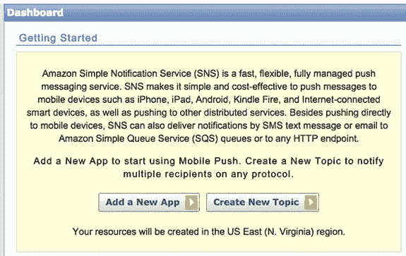

图 7-8。

SNS dashboard

将出现一个模式弹出窗口，提示您输入主题名称和可选的显示名称。在这两个字段中，输入 PhotoalbumsAlarms，因为该主题将仅由我们的应用堆栈的 CloudWatch 警报触发(参见图 [7-9](#Fig9) )。单击创建主题。

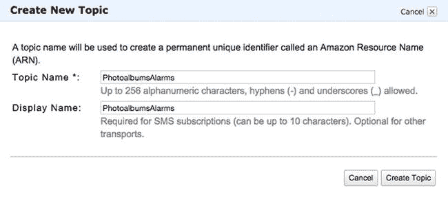

图 7-9。

Create SNS topic

您将立即转到主题详细信息视图，在这里您可以查看主题的基本信息以及主题的订阅。现在，我们只需要为这个主题创建一个订阅:给应用的唯一管理员发送一封电子邮件。继续并点击“创建订阅”按钮。另一个模态将会出现。展开主题下拉列表并选择电子邮件。在端点字段中输入您的电子邮件地址，然后单击订阅。

该窗口将显示一条消息，通知您必须确认电子邮件地址。单击关闭返回主题详细信息视图。您应该会收到一封主题为“AWS 通知-订阅确认”的电子邮件。在电子邮件正文中，应该有一个指向订阅确认 URL 的链接。点击它会引导你进入一个类似于图 [7-10](#Fig10) 所示的页面。

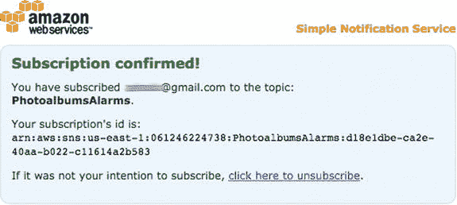

图 7-10。

An SNS subscription confirmed

如果您返回到主题详细信息视图并单击刷新，您将看到已经为您的电子邮件生成了一个订阅 ID(ARN)，就像您在订阅确认页面上看到的一样。现在你已经准备好使用这个 SNS 话题了！我们可以通过手动发布到这个主题来运行一个简单的测试。在主题细节视图的顶部，您会看到一个发布按钮。点击这个，另一个模态就会出现。填写一个主题和一些测试内容的消息，如图 [7-11](#Fig11) ，点击发布消息按钮。然后，再次检查你的电子邮件。你应该会看到一条来自< `no-reply@sns.amazonaws.com` >的主题信息。

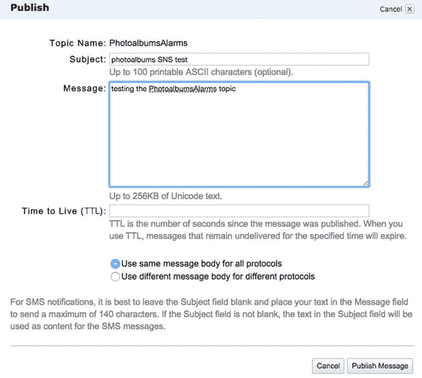

图 7-11。

Publishing an SNS topic

### 创建云监控警报

现在，我们已经为警报创建了一个 SNS 主题，我们准备创建我们的第一个 CloudWatch 警报。不幸的是，对于读者来说，每一个 CloudWatch 指标都有自己的讨论主题，需要对这个主题进行一些阐述。这一次，让我们使用 CloudFront 的指标来创建一个警报。如果您还记得，通过 Web 对我们的应用的所有请求都将通过我们的 CloudFront 发行版。例如，知道是否有许多请求正在被发出可能是有用的。

使用服务菜单，返回到 CloudWatch 仪表盘。这一次，看看左边的导航。在 Metrics 标题下，您将看到您拥有 CloudWatch 指标的所有服务的列表。单击 CloudFront，这将用 CloudFront 分布的指标填充主视图(参见图 [7-12](#Fig12) )。

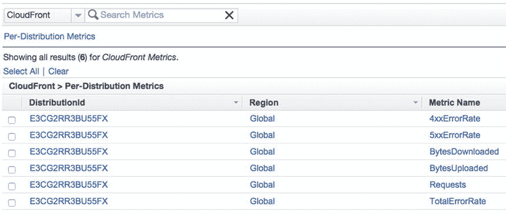

图 7-12。

ELB metrics in CloudWatch

其中一些指标可能非常有用。列表中的前两个，4xxErrorRate 和 5xxErrorRate 特别有趣。这些指标跟踪由 400–500 个错误代码响应的 HTTP 请求的百分比。4xxErrorRate 通常与 404 或资源未找到错误相关联。由于用户错误——人们输入了错误的 URL，或者客户端出现了请求格式不正确的问题，预计会出现少量的 404 响应。但是，如果 4xx 错误在我们发送的回复中占了很大比例，那么就有一个值得调查的问题了。虽然没有一个神奇的数字，但我们同意 25%导致 4XX 错误的请求将构成一个事件。

同样，5XX 错误构成内部服务器错误。一个用户也许能够用一个糟糕的构造请求引发一个 404，但是在我们的应用中，一个用户不应该引发一个 500 错误。我们应该容忍比 400 更低的 500 错误代码阈值。如果我们要为此指标创建一个 CloudWatch 警报，我们可能会在比率大于 0%时触发警报。

Note

TotalErrorRate 是接收任何非 200 HTTP 响应的请求的百分比，它是前两个度量的组合百分比。

Requests 指标统计了对您的 CloudFront 发行版的原始请求数。理论上你可以用它来识别分布式拒绝服务攻击， [1](#Fn1) 或者跟踪流量的激增。

对于后一点，这不是检测非恶意流量激增的最佳方式。您最好通过查看实例的 CPU 和内存来识别流量激增。首先，并非所有的请求都是平等的。一千个用户上传照片不应该被解释为等同于一千个用户请求图像——对系统的影响是完全不同的。此外，许多到达 CloudFront 的请求，比如对图像的请求，根本不会到达应用堆栈，因此会影响性能。

让我们首先创建一个简单的警报，它将在我刚才讨论的条件下触发，即当 4XX 错误率大于 25%时。为您的分配选择 4xxErrorRate 行。图表视图将出现在下面，图表上可能有也可能没有点，这取决于您如何使用您的应用。在右下角，你会看到一个写着“创建警报”的按钮(见图 [7-13](#Fig13) )。单击该按钮开始该过程。

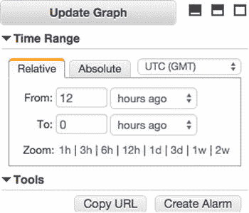

图 7-13。

Graph view tools and Create Alarm button (cropped to show time-range interface)

### 定义警报

您现在应该处于警报创建过程的第二步，已经为您的警报选择了指标。该视图中有三个标题:报警阈值、报警预览和动作(参见图 [7-14](#Fig14) 查看完整视图)。在警报阈值下，我们命名并定义警报。在“名称”字段中，输入 photo albums CloudFront http 400>25%。警报的名称将出现在您的电子邮件通知中，因此您希望它是描述性的。描述字段允许您输入警报的更长形式的描述，因此您可以输入诸如相册 CloudFront 分发请求的平均百分比已超过 25%之类的内容。如果你愿意，你甚至可以进一步描述。

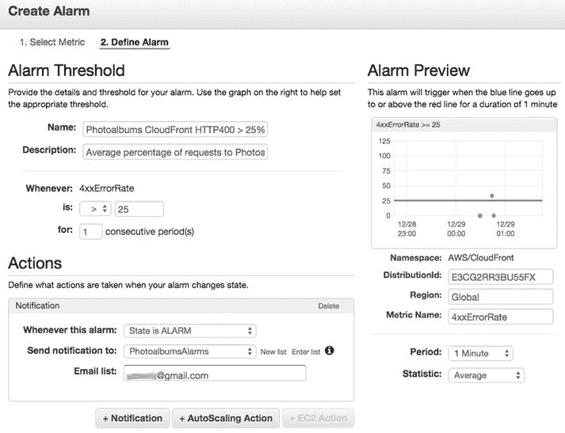

图 7-14。

Defining an alarm

在描述的下面，您会找到警报的实际参数。“无论何时”字段已经设置为您选择的度量。在 is:行中，将比较运算符设置为>，并在相邻的字段中输入 25。

查看右栏，如果现在启用了报警，报警预览会显示报警的当前状态。从图表中可以看出，当越过红线时，警报就会响起。目前，没有任何请求，所以在我的图表上甚至没有一条蓝线。这将导致警报处于不足数据状态。您会注意到在这一列的底部有用于周期和统计的字段。将周期设置为 5 分钟，这将是根据警报阈值评估指标的频率。统计是我们衡量的价值。在这种情况下，平均就可以了。在某些情况下，您可能想测量指标的最大值或最小值。

回到左侧，Actions 标题表示 CloudWatch 对警报响起的自动响应。您将看到您的选择是添加通知或自动缩放操作。对于我们的设置，自动缩放操作不是一个可行的选项。有了一个更加微观管理的应用堆栈，您可以配置额外的 EC2 实例来自动启动或关闭以响应警报。因为我们使用 OpsWorks 来管理我们的实例，所以我们将在那里配置我们的自动伸缩。有了这个 CloudWatch 警报，我们所要做的就是生成一个通知。单击+通知创建您的第一个通知。将通知配置为每当此警报:至状态为警报时设置，并将通知发送至:照片相册警报。图 [7-14](#Fig14) 为完整视图。

### 警报状态

现在，当警报处于警报状态时，您将收到通知。您还可以创建一个通知，在警报处于正常状态时发出。再次点击+通知，并在该警报:状态正常时设置该字段。然后，单击创建提醒。

您应该会在页面顶部看到一条成功消息，表明您的警报已经创建。如果你看左边的导航，你会看到报警标题实际上给你一个当前报警状态的总结(见图 [7-15](#Fig15) )。因为您刚刚创建了警报，所以它的状态为“不足 _ 数据”。过一会儿，它应该会变为正常。

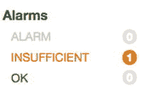

图 7-15。

CloudWatch alarm states

一会儿，我们会发现这个警报的一个问题，因为我们永远不知道什么样的机器人，脚本或随机流量会在您的域中运行。尽管如此，它将很好地提醒我们所拥有的工具。如果你想触发警报，你所要做的就是向不存在的路径发出几个请求，比如`http://www.[` `yourdomain` `].com/helloworld`。几分钟后，您应该会收到一封电子邮件，指示该警报处于警报状态。

如果你再等一会儿，闹钟可能很快就会响。那么我们该如何处理这些信息呢？拥有如此复杂的基础设施的挑战之一是熟悉各种故障点。

特别是这个警报是基于 CloudFront 度量的，所以我们应该做的第一件事是检查 CloudFront，看看问题是什么。继续前进，导航到 CloudFront 仪表板。在 CloudFront 导航中，单击热门对象。您可能还记得，这提供了一份关于对您的 CloudFront 发行版的流行 URL 请求的报告(参见图 [7-16](#Fig16) )。

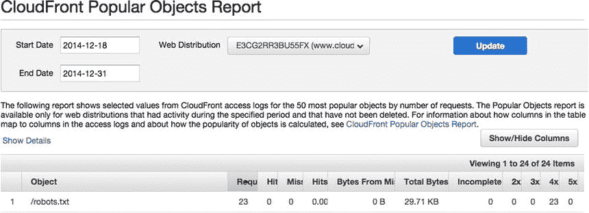

图 7-16。

CloudFront Popular Objects

如图 [7-16](#Fig16) 所示，我的发行版中最受欢迎的对象是`/robots.txt`文件，它不见了。搜索引擎！他们在这个域上寻找一个`robots.txt`文件，并得到一个 404 响应。您会遇到同样的问题，您可以通过在您的 Express 应用中添加一个静态路径到一个`robots.txt`文件来解决这个问题。关键是你知道如何创建一个警报，调查问题，并可以确定一个响应。

Note

在弹性负载平衡级别也有类似的指标。您可以监视应用堆栈中的负载平衡器，以获得相同的响应，而不是从 CloudFront 计算 400 和 500。

## 将 OpsWorks 与 CloudWatch 配合使用

回想一下，当您将实例添加到 OpsWorks 应用层时，有三种类型的实例:24/7、基于负载和基于时间。目前，我们有一个全天候运行的实例。接下来，让我们向应用添加一些基于负载的实例。这样，我们将设计我们的应用来有效地处理增加的需求。在本节的后面，我们还将研究基于时间的实例。

对于一个 web 应用来说，流量的波动是正常的，我们不想手动响应流量的起伏。我们更愿意灵活地使用我们的资源，这样它们就可以根据需求自动扩展。但这种策略只会带来更多的问题。

假设您的应用堆栈通常可以处理运行在 t1.micro EC2 实例上的 500 个用户。您通常预计流量会增加到 1，000 个用户，所以您希望在这种情况下有可用的资源(这些完全是虚构的数字)。然而，通常情况下，您可能有基础设施预算，因此您必须有效地管理您的资源。我们不能只是扔 100 台服务器来解决这个问题。

在这些约束条件下，我们将配置 OpsWorks 来自动检测应用层实例中的事件，并继续添加新的服务器，直到事件得到解决，此时我们的额外实例将自动关闭。

NOTES ON DETERMINING SCALING BEHAVIOR

稍后，我们将开始使用指标和计划来扩展我们的基础架构。在一个完美的世界里，你可以从这一课中得到确切的数字。不幸的是，它比那更抽象一点。你将不得不用你自己的方法来决定最佳策略。您可以用一定数量的用户测试您的应用性能，检查指标，并由此推断您需要的资源，尽管这种方法可能不准确。例如，如果五个用户正常使用应用使您的实例达到 5%的 CPU 利用率，二十个用户达到 10%的 CPU 利用率，您可以通过这种方式进行测试来预测曲线。

在为您的决策提供信息方面，没有什么比现实世界的运营历史更好的了。有些人更喜欢对他们的应用软件进行试运行或封闭测试。其他公司在发布时部署了多余的资源，然后小心翼翼地缩减到更保守的部署。所有这些都是一门艺术。根据我的经验，两个不同的应用可能会以完全不同的标准体验速度变慢。我们还将关注基于时间的扩展，这是基于您的应用的独特流量模式。因此，我无法告诉您何时触发缩放操作，但可以向您展示您将使用的工具。在这个场景中，我们将使用一些实例，这些实例代表了您实际上可以使用大量功能强大的实例做些什么。

### 基于负载的实例

面对现实吧，一个 t1.micro 实例是不够的！我们需要添加一些实例来响应需求。前往 OpsWorks，选择您的应用堆栈。打开导航下拉菜单，在实例标题下，您将看到一个基于负载的实例的链接(参见图 [7-17](#Fig17) )。单击该按钮，您将看到基于负载的实例的空白视图。

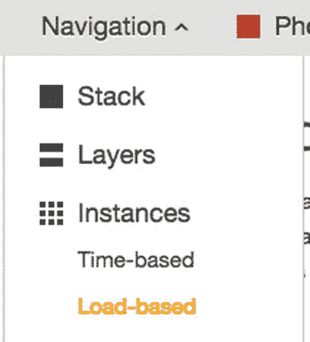

图 7-17。

Load-based instances in the Navigation menu

在屏幕中间，您应该会看到以下消息:No load-based instances。添加基于负荷的实例。

单击“添加基于负荷的实例”。您会认出在第 2 章中添加第一个实例时出现的视图。默认主机名应该没问题。为了节约起见，将大小更改为 t1.micro。您应该选择不同的可用区域，例如 us-east-1b(参见图 [7-18](#Fig18) )。如果您还记得的话，最佳实践是将您的实例分布在不同的可用性区域，以防 AWS 中断。这意味着我们应该跨可用性区域分布 24/7 个实例，但我们暂时将就一下。

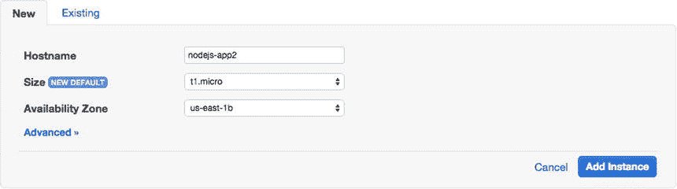

图 7-18。

Adding a new instance to the application layer

但是到目前为止，这与创建一个 24/7 的实例没有任何区别。接下来，在创建实例之前，单击“高级”查看其他设置。高级设置应类似于图 [7-19](#Fig19) 中的设置。因为我们是从基于负荷的实例视图中创建实例的，所以预先选择了基于负荷的缩放类型。我们不必更改这些值中的任何一个，但是如果您从 general instances 视图中创建基于负载的实例，您必须确保在 advanced 视图中更改缩放类型。继续，然后单击“添加实例”继续。

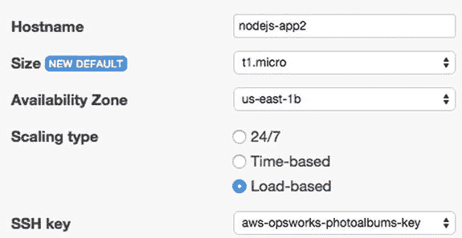

图 7-19。

Load-based instance advanced configuration

### OpsWorks 自动缩放规则

当您返回到“实例”视图时，您应该会在黄色警告框中看到以下消息:基于载荷的自动缩放已禁用-编辑。

您看到此警告是因为，虽然我们创建了基于负载的实例，但我们没有启用基于负载的伸缩，也没有定义实例联机的规则。单击“编辑”按钮即可。

首先:将基于负载的自动缩放启用开关切换到 Yes。接下来，让我们定义一些自动缩放规则。请记住，就您的应用而言，这些值基本上是任意的，您应该根据测试和操作历史来确定自己的缩放阈值。现在，我们将设计一个简单的规则集，如图 [7-20](#Fig20) 所示，之后我将讨论其行为。

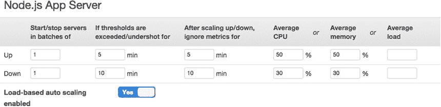

图 7-20。

Load-based auto-scaling rules

当您使用 OpsWorks 自动伸缩时，您将使用一个简化的界面，该界面使用我们之前使用的底层 CloudWatch 指标。然而，在使用 OpsWorks 和使用 CloudWatch 进行缩放之间存在一些差异。在 OpsWorks 中设置自动缩放规则时，可以在不同的规则集中分别定义放大和缩小规则。放大或缩小时，可以设置每个缩放操作要添加/移除的实例数。您的扩展操作不是为每个指标创建警报和自动扩展操作，而是基于每个时间间隔对最多三个指标的评估:平均 CPU (%)、平均内存(%)或平均负载。您不必在缩放规则中使用所有这三种元素。如果您使用所有三个指标，当任何指标超过您定义的阈值时，将发生缩放操作。

对于 CloudWatch 警报，我们为指标设置了一个周期，以及触发警报之前的连续周期数。在 OpsWorks 中，为了清楚起见，我们为缩放设置了一个单一的时间框架，我们称之为阈值超出时间。这是一个或多个阈值必须被超过才能应用比例规则的时间量。阈值超过时间触发缩放操作，之后是一个时间间隔，在此期间度量被忽略。我们将这个间隔称为忽略度量间隔。这个时间间隔的原因是，它为新实例提供了一个宽限期，以减少堆栈中现有实例的工作负载。让我们根据图 [7-20](#Fig20) 中显示的值，分解我们可以预期的行为。

#### 自动缩放场景 1

考虑以下场景:

A single 24/7 instance is online.   Average CPU utilization reaches 51% and remains there for five minutes.   Threshold exceed time for Up rule is met.   A single load-based instance is started.   Metrics are ignored for five minutes.   Metrics are checked again. Average CPU utilization is now reduced to 23%.   Ten minutes pass.   Average CPU utilization is still below 30%.   Threshold exceed time for Down rule is met.   Load-based instance is stopped.  

基于负载的实例运行时间:15 分钟

根据我们定义的自动扩展规则和创建的实例，仍有有限的资源可以部署到我们的应用堆栈，这有助于我们控制成本，但我们的能力是有限的。考虑使用完全相同配置的另一个场景。

#### 自动缩放场景 2

考虑以下场景:

A single 24/7 instance is online.   Average CPU utilization reaches 75% and remains there for five minutes.   Threshold exceed time for Up rule is met.   A single load-based instance is started.   Metrics are ignored for five minutes.   Metric checks are resumed. Average CPU utilization is at 63% and remains there for five minutes.   No additional load-based instances are available.   Average CPU utilization remains at 63% for an additional five minutes.   No additional load-based instances are available.   And so on and so on...  

基于负载的实例运行时:不确定

如您所见，尽管我们同时拥有 24/7 和基于负载的资源，但我们并没有准备好处理应用的需求。在这种情况下，我们的基于负载的实例也可以是 24/7 实例，如果它始终在线以满足我们的基线流量要求。此外，我们资源的缺乏可能会开始影响应用的性能。

这个问题有几种可能的解决方法。最简单的解决方案是添加额外的 24/7 实例。如果我们认为这是暂时的需求激增，那么添加一个额外的基于负载的实例会更划算。让我们继续这样做，然后在另一个场景中回顾该行为。

记得单击保存以创建您的缩放规则。缩放规则应该不再可编辑。然后，单击表格下方的+实例按钮。再次选择 t1.micro 实例大小。选择不同的可用区域，例如 us-east-1c(参见图 [7-21](#Fig21) )。单击“添加实例”创建第二个基于负荷的实例。

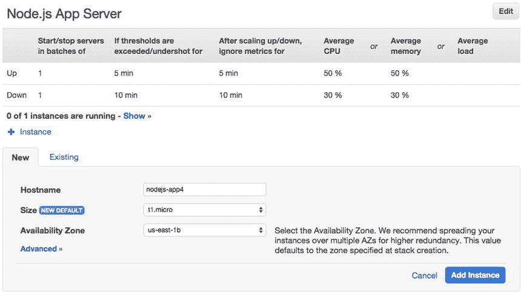

图 7-21。

Adding a second load-based instance

您将在缩放规则下看到如下摘要:2 个实例中的 0 个正在运行–显示> >。

使用我们当前的扩展规则，让我们再来看看在有第二个基于负载的实例可用的情况下，我们的实例将如何进行不同的扩展。

#### 自动缩放场景 3

考虑第三种情况:

A single 24/7 instance is online.   Average CPU utilization reaches 75% and remains there for five minutes.   Threshold exceed time for Up rule is met.   A single load-based instance is started.   Metrics are ignored for five minutes.   Metric checks are resumed. Average CPU utilization is at 63% and remains there for five minutes.   Threshold exceed time for Up rule is met.   A second load-based instance is started.   Metrics are ignored for five minutes.   Metric checks are resumed. Average CPU utilization is at 25% and remains there for ten minutes.   Threshold exceed time for Down rule is met.   The second load-based instance is stopped.   Metrics are ignored for ten minutes.   Metric checks are resumed. Average CPU utilization is at 23% and remains there for ten minutes.   Threshold exceed time for Down rule is met.   The first load-based instance is stopped.   A single 24/7 instance is online.  

基于负载的实例运行时间:60 分钟

因为我们已经定义了自动扩展规则，当我们向上扩展时添加一个实例，当我们向下扩展时删除一个实例，所以我们能够根据需要进行扩展，从而非常有效地利用资源。在这个场景中，我们基于负载的实例运行了 60 分钟:第一次运行了 45 分钟，第二次运行了 15 分钟。你会注意到，我们放大和缩小时间的差异让我们在谨慎方面犯了错误。虽然我们在向上扩展后仅等待 5 分钟，然后再记录要再次扩展的指标，但我们在开始记录要向下扩展的指标之前会等待 10 分钟，并要求在停止实例之前达到阈值 10 分钟。

假设我们再添加 100 个实例，并继续使用相同的缩放规则。如果需求激增，我们的应用堆栈会每 10 分钟自动让一个新实例上线，而我们的实例超过了纵向扩展阈值，每 15-20 分钟就会让实例离线。面对极端的需求，这种反应可能不够迅速。您可以将阈值超过时间减少到 1 分钟，并将忽略度量间隔减少到 1 分钟。

#### 自动缩放场景 4

最后，考虑这个场景:

A single 24/7 instance is online.   Average CPU utilization reaches 75% and remains there for one minute.   Threshold exceed time for Up rule is met.   A single load-based instance is started.   Metrics are ignored for one minute.   Metric checks are resumed. Average CPU utilization is at 63% and remains there for one minute.   Threshold exceed time for Up rule is met.   A second load-based instance is started.   And so on...  

使用更积极的纵向扩展规则，每两分钟就可以让一个实例上线。您可以保持缩减规则不变，因此一旦实例联机，我们会等待一段时间以确保事件结束，然后再减少资源。

### 基于时间的实例

您可以在 OpsWorks 中创建最后一种类型的实例:基于时间的实例。如果您知道在大多数情况下，您的应用在特定时间会有较高的流量，您可以创建在高流量窗口自动启动和停止的实例。同样，如果您知道通常流量很少的时候，您可以使用基于时间的实例，否则您可能会使用 24/7 实例。

结合使用所有这三种实例类型是运行应用的最有效方式，并且是在 OpsWorks 中实现比手动实现容易得多的策略。您对基线资源使用 24/7 实例，对较高的流量时间使用基于时间的实例，同时使用基于负载的实例来响应需求的增加。如果您在基于时间的实例计划脱机时遇到流量激增，那么基于负载的实例仍然可以响应。

让我们开始向应用添加基于时间的实例。使用 OpsWorks 中的导航菜单，选择实例标题下的基于时间的实例。您将看到一条消息，就像我们在基于负载的实例视图中看到的一样:没有基于时间的实例。添加基于时间的实例。

单击添加基于时间的实例以创建单个基于时间的实例。和前面一样，在您喜欢的任何可用性区域中选择一个 t1.micro 实例。当您点击高级时，您将看到缩放类型被设置为基于时间(参见图 [7-22](#Fig22) )。单击“添加实例”进入“计划创建”视图。

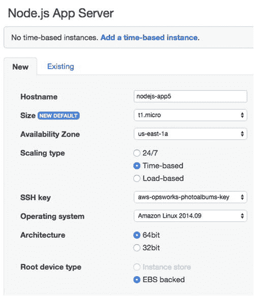

图 7-22。

Adding a time-based instance

在 Schedule Creation 视图中，您可以为应用层中每个基于时间的实例手动设置时间表。界面相当简单:您选择一个小时的时间段(UTC ),在此期间您的实例将处于在线状态。

继续点击 12 和 13 之间的方框，如图 [7-23](#Fig23) 所示。保存更改时，您会看到一个简短的活动指示器。

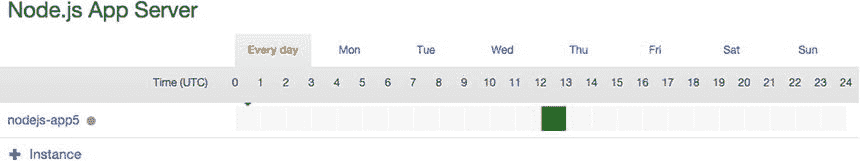

图 7-23。

Time-based instance scheduling

现在，您的实例将从 UTC 时间每天下午 12 点至 1 点运行。假设您还希望它在 UTC 时间周五晚上 6-8 点运行。单击“Fri”选项卡，仅选择星期五的时间表。您将看到您的每日小时数被自动选择，您只需选择您想要在周五运行的额外小时数。选择 18–19 和 19–20 街区，将星期五晚上添加到您的选择中(参见图 [7-24](#Fig24) )。

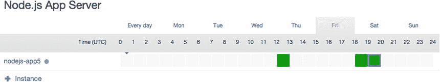

图 7-24。

Time-based instance scheduling—single-day view

#### 通过 OpsWorks 使用警报

您应该能够让您的应用自动伸缩，但您可能希望在发生这种情况时得到通知。当您的所有实例都在线时，您特别希望得到通知。正如我所讨论的，如果所有基于负载的实例都在线，这并不能保证当前的事件已经解决。我们希望在达到或接近最大容量时发出警报，通知我们。从那里，您可以监视情况并手动添加新的实例。

不幸的是，目前没有 CloudWatch 指标来跟踪您当前的 OpsWorks 实例数。但是，在 ELB 级别有两个非常有用的指标:健康主机和不健康主机。这些指标告诉我们连接到负载平衡器的处于健康状态和不健康状态的实例的数量。你会记得我们很久以前就定义了健康和不健康！

我们可以创造性地使用这些指标来通知我们问题。例如，当所有实例都在线时，当健康主机==最大实例数时发出的警报就会响起。当不健康的主机> 1 时，可能会发出另一个警报。这样，当我们的所有实例都在线时，或者当我们的一个实例处于错误状态时，我们就会收到警报。

这种方法可能不是在所有情况下都有效。例如，如果您有 100 个实例在运行，您可能不需要对一个不正常的实例做出响应。此外，您还需要考虑正在使用的基于时间的实例的数量，因为这将影响应该发出警报的健康主机的数量。

#### ELB 监控

要创建您的 ELB 警报，您不必通过 CloudWatch 仪表盘，您也可以从 ELB 视图本身来完成。可以通过 EC2 仪表板访问 ELB 实例。从服务菜单中选择 EC2。在左侧导航中，选择网络和安全标题下的负载平衡器。

如果您只有一个负载平衡器，它将被自动选择。如果没有，现在就选择它。然后，导航到“监控”选项卡。在这个选项卡中，您可以看到许多绘制在图表上的 CloudWatch 指标，如图 [7-25](#Fig25) 所示。

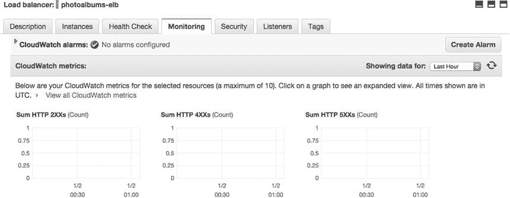

图 7-25。

ELB Monitoring view

您会注意到右手边有一个创建警报按钮。正如您可能已经猜到的，这允许您为所选的负载平衡器创建一个 CloudWatch 警报。

当你点击这个按钮时，你会看到一个模态视图，它只是 CloudWatch 界面的精简版。向您的社交网络主题发送通知。在“无论何时”字段中，选择“普通”和“健康”主机。Is 应该> = 3，这是您的 24/7 实例和基于负载的实例的总和。至少可以设置为 1 个连续 1 分钟的时间段(见图 [7-26](#Fig26) )。

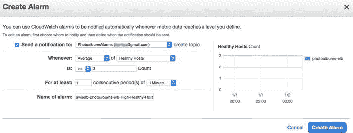

图 7-26。

Create ELB alarm

在此视图中创建闹钟时，您可以给闹钟命名，但不能设置描述。自动生成的名称对于电子邮件通知来说可能不够清楚。如果你愿意，可以把闹钟的名字改成像相册这样的东西——所有在线实例。如果一切正常，单击创建警报。

同样，这是一个不完善的方法。当您有一个基于负载的实例、一个基于时间的实例和一个 24/7 实例在线时，此警报将会响起。创建警报后，模式窗口将确认操作成功(参见图 [7-27](#Fig27) )。在此模式中，CloudWatch 仪表板中有一个警报链接，您可以从中访问警报详细信息的完整视图。

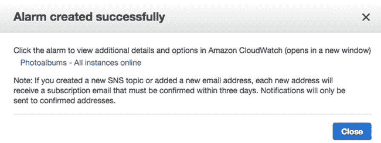

图 7-27。

ELB alarm confirmation

接下来，让我们为不健康的主机创建警报。请注意，如果您的应用由于代码中的异常而崩溃，它将自动重启。单个不正常的实例可能无法保证响应。再次单击“创建提醒”按钮，并将通知发送到同一个 SNS 主题。这一次，只要不健康主机的平均值> = 1，警报就会响起。为了降低警报的敏感度，您可以设置它在连续两个一分钟的时间段过去时触发。正如您在右图中看到的，现在应该没有任何不健康的主机。将您的闹钟命名为 Photoalbums - 1 或更多不健康的主机，如图 [7-28](#Fig28) 所示，然后再次点击创建闹钟。

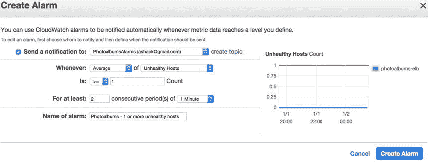

图 7-28。

Creating a second ELB alarm

如果你看看其他的 ELB 指标，你会发现它们大部分都很有说服力。您可能希望设置额外的通知来监视您的应用的健康状况。例如，平均延迟度量跟踪实例返回对请求的响应需要多长时间。您可以为此指标设置警报，以监控应用性能的下降。

Note

请记住，当您在没有完整的 CloudWatch UI 的情况下创建内嵌警报时，当警报返回正常状态时，您将不会收到通知。

#### 自动缩放摘要

您已经看到了手动向应用添加实例是多么容易，现在您可以根据需求或计划自动扩展应用。我们已经创建了一些警报，帮助您监控您的应用并对事件做出响应。ELB 级别的警报展示了你可以创造性地使用警报的许多方法中的几个。

您可以随意创建更多的警报来帮助您进行监控。创建警报时，挑战在于保持良好的信噪比。您不希望一系列警报被忽略——最好只有在您必须对应用中的问题保持警惕时才触发警报。

### RDS 警报

如果你还记得第 3 章中的 RDS 课程，你会知道我们的 RDS 数据库中内置了许多冗余和故障保险。我们使用调配的 IOPS 为我们的实例保留增加的 I/O 容量，并在必要时使用多 AZ 部署将请求重新路由到备份实例。出于备份目的，我们还会定期自动拍摄数据库快照。

有了所有这些工具，RDS 实例在很大程度上应该可以自我维护。尽管如此，我们不想被任何问题弄得措手不及。我们可以轻松地增加数据库的磁盘空间，或者从具有更大容量的快照创建一个新实例。我们可以在 OpsWorks 中轻松地交换数据库凭证，因此如果我们需要快速部署备份数据库，我们已经学会了如何这样做。简而言之，我们有应对重大危机的手段。

让我们继续创建一些警报来通知我们 RDS 实例的任何事件。这些事件可能不需要作出重大反应，但它们应该引起进一步的调查。

导航到 RDS 仪表板，在那里应该会自动选择您的实例。单击顶部的显示监控。与 ELB 一样，嵌入式监控视图允许您访问所选实例的 CloudWatch 指标(参见图 [7-29](#Fig29) )，只是这一次，Create Alarm 按钮位于页面的更下方。

图 7-29。

RDS monitoring

您将在这里看到许多有用的指标，大部分是原始数据，而不是百分比。这意味着，如果您扩展您的数据库，您可能需要相应地调整警报，就像我们在本章开始时看到的度量标准一样。

根据您阅读这本书花了多长时间，您可能已经有了一些数据库的操作历史。查看图 [7-30](#Fig30) 中的 CPU 利用率，您可以通过单击微型 CPU 利用率图来访问该图。

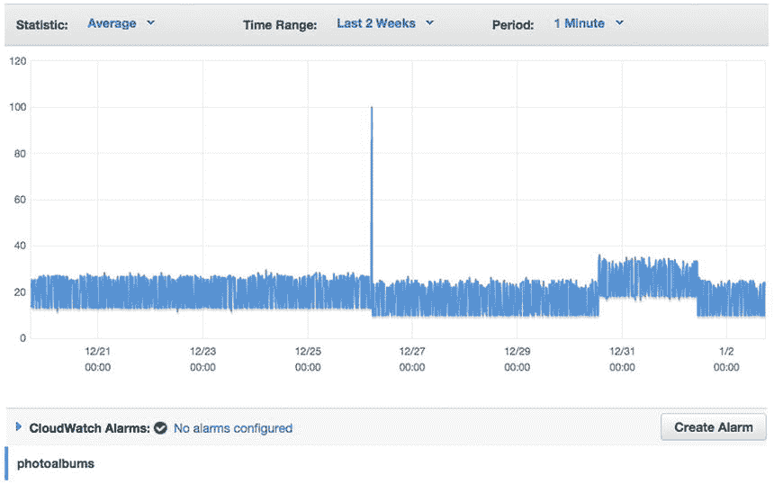

图 7-30。

RDS instance CPU utilization

如您所见，在绝大多数时间里，我的 CPU 利用率保持在 40%以下。有一个事件，它突然飙升到 100%。虽然 AWS 已经自动解决了该事件，但我们应该在将来收到该事件的通知。单击创建警报按钮。

对于此警报，我们希望在一分钟内收到 CPU 利用率> 60%的通知(参见图 [7-31](#Fig31) )。我们再次在过于敏感而无用的警报和过于宽容而无法检测到事故的警报之间游走。60%的 CPU 使用率远远超出正常范围，我们将立即得到通知。单击创建提醒以完成提醒并返回 RDS。

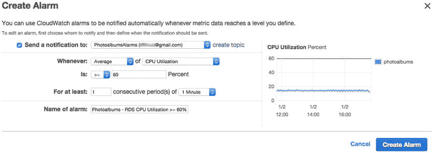

图 7-31。

RDS CPU utilization alarm

您可能希望在这里为许多其他指标创建警报。例如，如果读 IOPS 或写 IOPS 指标偏离了它们的正常模式，这将构成一个事件。我们不必逐个地运行每个指标，因为我们知道我们必须分析模式的指标，并在模式严重偏离时创建警报。

## CloudWatch 日志

熟悉 Node.js 中的本地开发后，您可能已经习惯了将日志直接打印到终端窗口中。不幸的是，有了 OpsWorks 应用堆栈，我们就失去了这种能力。相反，我们必须利用另一个名为 CloudWatch Logs 的特性。

CloudWatch 日志允许您在 AWS 控制台中对系统日志进行分组、存储和监控。虽然默认情况下没有启用它们，但只需几个步骤就可以让它们启动并运行起来。首先，我们将安装和配置 CloudWatch 日志，以存储由 OpsWorks 生成的一些系统级日志。一旦完成，我们将在 CloudWatch 中设置一些应用级别的日志记录。最后，我们将根据这些日志设置一个警报。

### EC2 实例角色

在我们深入探讨这个问题之前，我们的应用堆栈中的实例将需要对 CloudWatch 日志的完全权限。如您所知，我们将不得不在身份和访问管理上再做一次停留。从服务菜单中选择 IAM。单击左侧导航栏中的角色，并从列表中选择 AWS-ops works-photo albums-ec2-role。同样，这是分配给应用堆栈中每个实例的角色。在 role detail 视图中，您应该看到您创建的允许实例访问 S3 和 SES 的策略(参见图 [7-32](#Fig32) )。单击“附加策略”为 CloudWatch 日志创建另一个策略。

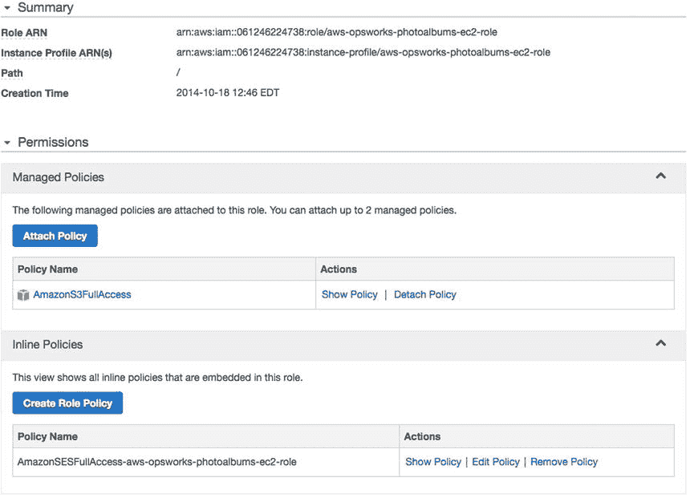

图 7-32。

Instance Role Policies

选择 CloudWatchLogsFullAccess 托管策略，然后单击附加策略。如果您查看策略文档，它将类似于清单 [7-1](#FPar5) 。

Listing 7-1\. CloudWatch Logs Full-Access Policy

`{`

`"Version": "2012-10-17",`

`"Statement": [`

`{`

`"Action": [`

`"logs:*"`

`],`

`"Effect": "Allow",`

`"Resource": "*"`

`}`

`]`

`}`

您的角色已更新，但在实例重新启动之前，这些更改不会在实例上生效。现在让我们回到 OpsWorks 并设置日志记录！

### 在 OpsWorks 中使用 Chef

我们提到了 OpsWorks 背后的核心技术 Chef 的力量。现在我们终于要用上它了！别担心，我们不会写任何食谱，我们只是让它们为我们服务。

要将我们的系统日志写入 CloudWatch 日志，我们必须为应用堆栈中的每个实例安装一个 Chef cookbook。在每个食谱中有一个或多个配置脚本，称为厨师食谱。如果我们必须在每个实例上手动安装脚本，我们将面临一个巨大的任务。尤其是现在我们使用基于时间和负载的实例，在每个实例上手动安装脚本将非常不方便、耗时且难以维护。

当您在 OpsWorks 层中启动一个新实例时，流程中有许多阶段，每个阶段都会自动执行一些命令。事实上，服务器端包和 AWS 软件的安装是在 Chef 中管理的。在为每个阶段运行 AWS 配方之后，有机会运行定制配方。

写我们自己的食谱是一个完全不同的话题。幸运的是，Amazon 已经很慷慨地为我们提供了一个样本食谱，用于将 OpsWorks 日志发送到 CloudWatch。我们将在堆栈中实现示例食谱，并在实例的设置阶段执行食谱中的特定食谱。

#### 安装烹饪书和食谱

要安装 cookbook，我们必须在 OpsWorks 中的堆栈级别进行更改。默认情况下，定制 cookbooks 是禁用的，所以当创建实例时，没有机会添加我们自己的定制。

导航到 OpsWorks 并从导航菜单中选择 Stack。然后，点按右上角的堆栈设置。在页面中间，您会看到一个标题，上面写着配置管理。我们要做的第一件事是更改全局配置，以允许安装定制的 Chef cookbooks。将“使用定制厨师烹饪书”切换到“是”位置。系统会立即提示您选择食谱的位置。虽然您可以随意添加任意数量的食谱，但是它们应该被打包到一个食谱中，存储在存储库或 zip 中。

我们将使用的定制食谱可以从这里的一个公共网址获得: [`https://s3.amazonaws.com/aws-cloudwatch/downloads/CloudWatchLogs-Cookbooks.zip`](https://s3.amazonaws.com/aws-cloudwatch/downloads/CloudWatchLogs-Cookbooks.zip) 。选择 Http Archive 作为您的存储库类型(参见图 [7-33](#Fig33) )。尽管它存储在 S3，因为它是一个公共文件，你可以通过 HTTP 访问它，就像网上的其他 zip 文件一样。

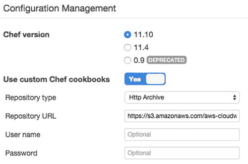

图 7-33。

Enabling custom cookbooks in OpsWorks

单击右下角的保存。接下来，我们必须配置实例，使其在启动过程中的特定时刻运行特定的配方。我们不在实例级别这样做！相反，我们必须转向层，在层中为所有附加到 Node.js 应用层的实例完成配置。在 Layers 视图中，您会注意到 Node.js App Server 下有一个编辑菜谱的链接，如图 [7-34](#Fig34) 所示。单击此处查看和编辑应用层的配方。

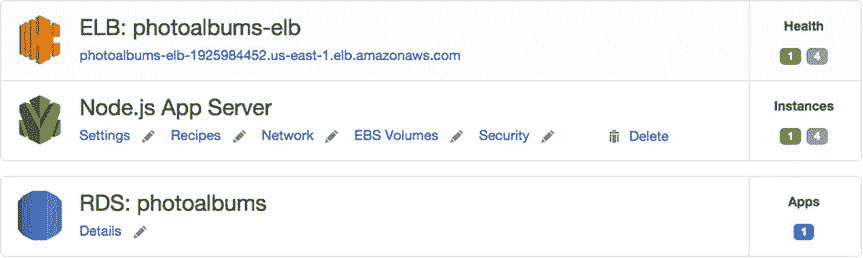

图 7-34。

Layers view revisited

在 recipes 视图的顶部，您会看到自动安装在实例中的内置 Chef 食谱。每个配方都以 cookbook::recipe 的格式列出，并显示在其执行阶段。这些是不可编辑的，因为它们由 AWS 控制。在 Custom Chef Recipes 标题下，您可以添加要在每个阶段的内置配方之后执行的自定义配方。我们必须在设置阶段添加两个配方。在设置右侧的文本框中，输入以下内容:

`logs::config, logs::install`

然后点击右边的+按钮。您的视图应该类似于图 [7-35](#Fig35) 。确认后，点击右下角的保存。

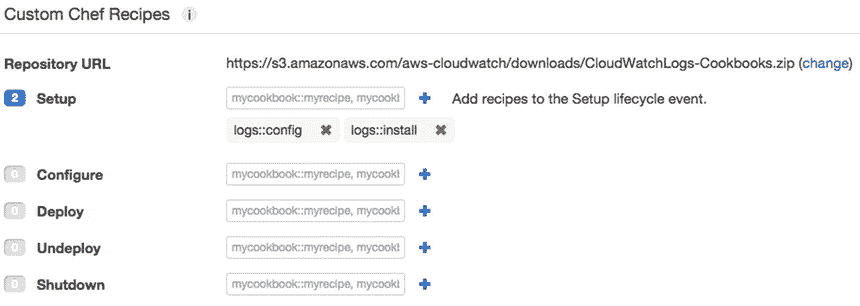

图 7-35。

Custom chef recipes

因为菜谱是在设置阶段运行的，所以我们必须在运行的实例上触发它。安装程序将在将来启动的任何实例上自动运行。如果您现在只有一个实例在运行，我们可以很容易地在它上面运行 Setup 命令。导航到 Instances 视图，并单击正在运行的实例的名称。在右上角，单击运行命令。在设置标题下，从命令下拉菜单中选择设置(参见图 [7-36](#Fig36) )。然后点击右下角的设置。

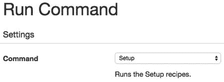

图 7-36。

Run Setup command

您的实例完成安装命令需要一些时间。当实例建立时，我们正在运行的菜谱会自动将存储在`/var/log/aws/opsworks/opsworks-agent.log`的日志上传到 CloudWatch 日志。

CHANGING THE RECIPE

如果你喜欢冒险，你可以尝试上传不同的系统日志到 CloudWatch，而不是默认选择的日志。您的实例上没有可用的日志主列表。您可以尝试使用 SSH 连接到您的实例，查找您感兴趣的日志，然后修改食谱，选择不同的日志文件，从您的 S3 存储桶或存储库中上传和部署食谱。

### CloudWatch 日志

一分钟后，你的日志就会出现在 CloudWatch 中。我们去看看。转到 CloudWatch 控制面板，并从左侧导航中选择 Logs。你很快就会看到一个名为“相册”的日志组，如图 [7-37](#Fig37) 所示。

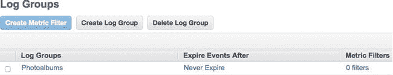

图 7-37。

CloudWatch log groups

CloudWatch 日志有自己的层次结构。单个日志语句被称为一个事件。日志事件存储在一系列流中，这些流在顶层组织成组。在组级别，您可以控制日志保留策略，设置日志事件过期的时间段。在大多数情况下，您可能不想为您的堆栈保留完整的日志历史。如果在日志组视图中单击永不过期，您可以将保留期更改为一天到十年。

目前，让我们将日志保留时间减少到三天。单击永不过期，将显示编辑保留模式视图。从下拉列表中选择 3 天。您将看到一条消息，如图 [7-38](#Fig38) 所示，确认旧数据将被删除。单击确定进行确认。

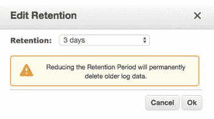

图 7-38。

Changing CloudWatch log retention

另一个有趣的特性叫做度量过滤器。您可以创建指标过滤器来自动扫描日志中的特定术语或模式，并使用它们来创建自定义的 CloudWatch 指标。一旦您的日志生成了可量化的指标，您就可以创建一个 CloudWatch 警报，在指标超过某个阈值时通知您。

这是一个强大的功能，尽管没有得到应有的重视。我们可以自动扫描日志中特定类型的错误，并在检测到错误时触发警报。这个特性对于应用级别的日志记录非常有用:当错误发生时，我们可以得到通知，并快速做出响应。

在我们设置应用级日志记录之前，请单击相册日志组。在这个组中，您应该看到应用层中每个 EC2 实例的日志流:nodejs-app1、nodejs-app2 等。在启用自定义配方后，您将只能看到运行设置命令的实例。如果堆栈中有基于负载和基于时间的实例，它们会在启动时自动创建日志流。

将系统级日志存储在特定于实例的日志流中是有意义的。如果启动实例时出现问题，您可能希望查看特定于该实例的日志。对于应用日志来说，情况并非如此。当应用在多个实例上运行时，负载平衡器将决定哪个实例处理用户的请求。如果其中一个用户遇到错误，您无法确定错误发生在哪个实例上。最简单的解决方案是为我们的应用级日志记录创建一个单独的日志流，这将合并我们的应用中生成的所有日志事件。

#### 应用日志流

虽然我们可以很容易地创建带时间戳的日志流，但是在这个例子中，我们只保留一个主日志流。我们将使用三天日志保留策略来防止我们的日志因历史数据过多而变得臃肿。

在“日志流”视图中，点按顶部的“创建日志流”按钮。将出现一个模式窗口，要求您命名日志流。输入名称 application，如图 [7-39](#Fig39) 所示，点击创建日志流。

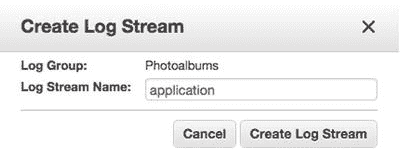

图 7-39。

Creating an application log stream

您会注意到，虽然其他日志流在最后接收时间列中有时间戳，但是我们的新日志流没有时间戳。为了用数据填充我们的日志流，我们将使用 AWS SDK 以编程方式发布事件。在下面的例子中，我们将手动构造发送到日志的字符串。也就是说，这仅仅是功能的一个例子。完全可以将 CloudWatch 日志与其他日志库整合，比如 log4js、logger、winston 等。为了最大限度地减少对第三方模块的依赖，并保持对 AWS 工具的关注，我们选择了更简单的方法。但是，使用现有的日志库将简化日志数据的格式化和标准化过程。如果您选择了日志库，我强烈建议您基于下面的例子将它与 CloudWatch 日志集成在一起。

##### 自定义 CloudWatch 日志记录类(cwlogs)

首先，让我们创建一个新类来抽象我们对 AWS SDK 的使用。在`/lib`目录中，创建一个名为`cwlogs.js`的新文件。在文件的顶部，我们必须添加 AWS SDK。我们还将存储一个对象，用于存储日志事件。见清单 [7-2](#FPar7) 。

Listing 7-2\. `/lib/cwlogs.js`

`var aws= require('aws-sdk');`

`var cloudwatchlogs = new aws.CloudWatchLogs({region:'us-east-1'});`

`var logParams = {`

`logGroupName: 'Photoalbums',`

`logStreamName: 'application',`

`logEvents: []`

`};`

`logParams`对象被硬编码到“相册”日志组和“应用”日志流中。如果您想保存精心制作和组织良好的日志，您可以很容易地将这些动态日志发布到多个不同的日志流甚至日志组。例如，您可以为正常的应用活动保留一个日志流，为严重错误保留另一个日志流。

接下来，我们将添加一个从简单字符串创建日志事件的公共方法。该函数简单地创建一个具有属性`message`和`timestamp`的对象，并将它们添加到`logParams.logEvents`数组中。添加清单 [7-3](#FPar8) 到`/lib/cwlogs.js`中的代码。

Listing 7-3\. `logEvent` Function

`// store event in logs to be sent to CloudWatch Logs`

`function logEvent(message){`

`var eventTimestamp = Math.floor(new Date());`

`var newEvent = {`

`message: message,`

`timestamp: eventTimestamp`

`}`

`logParams.logEvents.push(newEvent);`

`}`

在创建时将每一条日志消息都上传到 CloudWatch 是一种资源浪费。相反，我们将在应用运行时聚集日志，并定期上传日志。你上传日志的频率完全由你决定。因为我们将日志事件分开并上传，所以我们有一个单独的发布方法来放置日志。将清单 [7-4](#FPar9) 添加到文件中。

Listing 7-4\. `putLogs` Function

`function putLogs(){`

`if(logParams.logEvents.length > 0){`

`getSequenceToken(function(err, token){`

`if(token){`

`logParams.sequenceToken = token;`

`}`

`cloudwatchlogs.putLogEvents(logParams, function(err, data) {`

`if (err){`

`} else {`

`logParams.sequenceToken = data.nextSequenceToken;`

`logParams.logEvents = [];`

`}`

`});`

`});`

`}`

`}`

当您使用 AWS API 时，现有的日志流有一个序列标记。为了将日志事件发布到流中，必须首先检索该流的下一个序列标记。这个过程是在一个私有函数中执行的，我们很快就会回顾这个函数。如果令牌存在，`cloudwatchlogs.putLogEvents()`使用`logParams`对象将日志上传到流。如果成功，清空`logParams.logEvents`数组，并销毁内存中的日志事件。如果还没有日志事件被上传到流中，那么这个流就没有序列标记，当您使用`putLogEvents`时，您也不必包含一个序列标记。

为了获得下一个序列令牌，我们必须使用方法`describeLogStreams`来检索特定日志组的所有日志流。清单 [7-5](#FPar10) 在`getNextSequenceToken`函数中展示了这一点。添加这个函数和`exports`声明，使`logEvent`和`putlogs`成为公共的。

Listing 7-5\. `getNextSequenceToken` Function

`function getSequenceToken(callback) {`

`cloudwatchlogs.describeLogStreams({logGroupName:logParams.logGroupName}, function(err, data){`

`if (err){`

`callback(err);`

`} else {`

`for(var i = 0; i < data.logStreams.length; i++){`

`var logStream = data.logStreams[i];`

`if(logStream.logStreamName == logParams.logStreamName){`

`callback(null, logStream.uploadSequenceToken);`

`break;`

`}`

`}`

`}`

`});`

`}`

`exports.logEvent = logEvent;`

`exports.putLogs = putLogs;`

##### 集成 cwlogs

现在是时候开始向代码库添加一些基本的日志记录了！我们只看一个简单的例子。假设您想要在 web 服务中记录特定路线的工作流，将一些值打印到控制台。打开`/routes/users.js`，我们将在`GET /users/user/:user`路线中添加一些日志。首先，在文件的顶部包含`cwlogs`类，如下所示:

`var cwlogs  = require('./../lib/cwlogs');`

找到`router.get(/user/:user)`函数，我们将在其中添加几个日志语句。用清单 [7-6](#FPar11) 替换该功能。

Listing 7-6\. `getUser` with Logging Enabled

`router.get('/user/:user', function(req, res) {`

`var params= {`

`username: req.param('user')`

`}`

`var eventMessage = 'GET /users/user/' + params.username;`

`cwlogs.logEvent(eventMessage);`

`model.getUser(params, function(err, obj){`

`if(err){`

`res.status(500).send({error: 'An unknown server error has occurred!'});`

`} else {`

`var eventMessage = 'getUser ' + params.username + ' ' + JSON.stringify(obj);`

`cwlogs.logEvent(eventMessage);`

`res.send(obj);`

`}`

`});`

`cwlogs.putLogs();`

`});`

我们在这里只记录几件事:请求的方法和路径以及从`model.getUser()`检索的对象。因为您可以将任何字符串传递给`cwlogs`，所以它足够灵活，您可以决定什么有效。在路线的终点，`cwlogs.putLogs()`将日志上传到 CloudWatch。应该只有两个条目，但是您可以轻松地添加更多条目，包括用户模型中的一些条目。

是时候点火了！将这些更改提交到您的存储库中，然后返回 OpsWorks 并选择您的堆栈。从导航菜单中选择部署，然后单击右上角的部署应用。如果愿意，添加一些部署注释，然后单击右下角的 Deploy。一旦您的部署完成，继续向`/users/user/[` `your username` `]`发出`GET`请求。

您应该会得到与之前相同的 JSON 响应，但是这一次，一些数据被添加到了您的 CloudWatch 日志中。返回到 CloudWatch，并从导航中选择日志。当您单击相册日志组时，您应该会看到应用日志流现在在“上次摄取时间”列中有一个值。这是个好兆头！单击应用查看日志流。您应该会看到类似图 [7-40](#Fig40) 的内容。

图 7-40。

Viewing the CloudWatch Log Stream

万岁！应用日志曾经如此激动人心吗？

#### 异常处理

让我们进入下一个逻辑步骤，即将异常上传到 CloudWatch 日志。一旦我们这样做了，我们就可以创建一个度量过滤器并生成一个警报，通知我们应用中出现了一个异常。

让我们不要试图破坏应用，而是让一个错误发生。将以下代码添加到`/routes/users.js`:

`router.get('/error', function(req, res) {`

`throw new Error("[ERROR] This is an intentional error");`

`});`

这纯粹是为了测试的目的，你应该尽快删除它。接下来，我们将把`cwlogs`添加到 Express 中间件。打开`/server.js`，再次将`cwlogs`包含在顶部。

`var cwlogs = require('./lib/cwlogs');`

然后，定位如下所示的中间件功能:

`app.use(function(err, req, res, next) {`

`});`

对于这个函数出现的任何错误，我们都会将错误消息发送到 CloudWatch。将函数更改为类似于清单 [7-7](#FPar12) 。

Listing 7-7\. `server.js` `error-handling` Middleware

`app.use(function(err, req, res, next) {`

`cwlogs.logEvent(err.message);`

`cwlogs.putLogs();`

`res.status(err.status || 500);`

`res.send({`

`message: err.message,`

`error: {}`

`});`

`});`

Note

您可能有这个中间件的开发和生产版本。如果要使用此功能，可以使用 OpsWorks 环境变量来覆盖 Express app 环境变量。

继续提交并部署此更改。现在，让我们创建一个度量过滤器来检测错误。返回到 CloudWatch 日志，然后单击相册日志组旁边的 0 过滤器。除了一个添加度量过滤器的按钮之外，您在这个页面上应该看不到什么。点击这个。

在“定义日志”度量过滤器视图中，您可以创建一个文本模式来匹配您的度量过滤器。我们将创建一个简单的例子，它计算任何带有文本“[ERROR]”的日志事件在过滤模式字段中，输入文本“[错误]”(包括双引号)，如图 [7-41](#Fig41) 。如果您试图创建一个过滤器来捕获现有的日志数据，页面上有一个方便的工具来测试您的过滤器模式。单击分配指标继续。

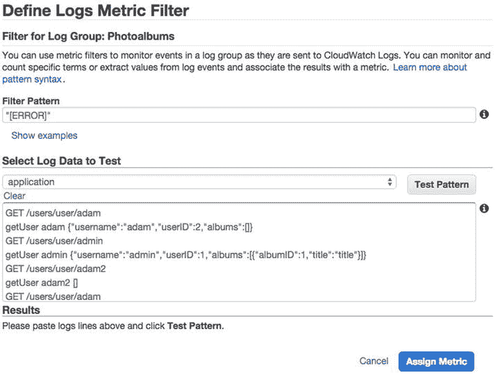

图 7-41。

Create metric filter

在下一个视图中，您可以命名您的过滤器以及它过滤的指标。如果您有很多度量过滤器，那么过滤器名称对于管理度量过滤器非常有用，而度量名称是 CloudWatch 中实际计数的值的名称。您可以保持过滤器名称不变，但一定要将指标名称设置为 UncaughtErrors 之类的名称，如图 [7-42](#Fig42) 所示。然后，单击创建过滤器。

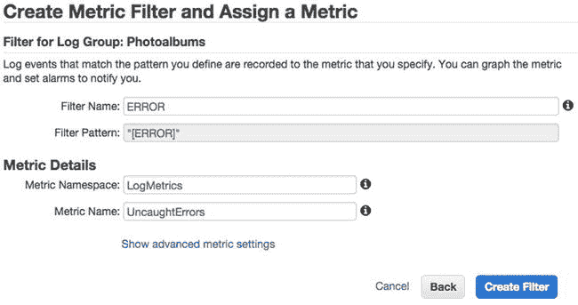

图 7-42。

Filter and metric names

您将在 Filters 视图中仅看到您的新过滤器，以及一条成功消息(参见图 [7-43](#Fig43) )。在这里，您可以编辑或删除过滤器，或者更重要的是，根据指标创建警报。

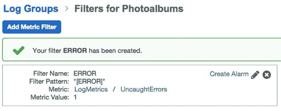

图 7-43。

Photoalbums filters

单击“创建警报”为该指标创建新的 CloudWatch 警报。这个警报的想法是，任何时候抛出一个异常，警报就会响起。因此，我们希望每当 UncaughtErrors > = 1 时就发出警报。将闹钟命名为 Photoalbums-unccatched Error，使闹钟向 PhotoalbumsAlarm 列表发送通知，如图 [7-44](#Fig44) 所示。

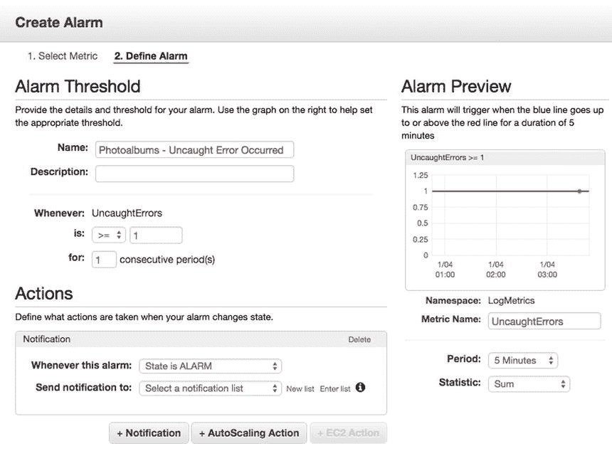

图 7-44。

Metric filter alarm

点击创建报警，然后制作一个`GET`到`/users/error`。如果您检查日志流，您应该会看到错误，并且您还应该会收到一个电子邮件通知，告知发生了错误。虽然您不会收到错误的电子邮件副本，但您确切地知道在哪里可以看到错误打印出来的内容！

## 摘要

从这里开始，你可以走很多不同的路。您可以更改错误日志记录来记录错误堆栈(提示:err.stack 而不是 err.message)，或者您可以修改 cwlogs 来使用您喜欢的日志记录库。您还可以为不同类型的信息创建多个日志流，这取决于您希望如何组织。

在本章开始时，您对如何监控、维护和扩展我们的应用堆栈知之甚少。最终，您将拥有根据我们的规则自动扩展的服务器、监控各种故障点的警报，以及保存在 CloudWatch 中的多实例应用日志。呈现这一章的挑战之一是在有如此多的可能性的时候，保持核心课程的轨道！

在下一章，也是最后一章，我将把重点放在安全性上，最后，将认证添加到应用中。你可能已经注意到，任何人都可以直接走进去开始上传内容。像其他课程一样，我们的安全措施将是编码和使 AWS 服务工作的结合。

Footnotes [1](#Fn1_source)

关于 DDoS 攻击类型及对策的研究，请参见“分布式拒绝服务(DDoS)洪泛攻击防御机制综述”， [`http://d-scholarship.pitt.edu/19225/1/FinalVersion.pdf`](http://d-scholarship.pitt.edu/19225/1/FinalVersion.pdf) 。