第一章


为 Node.js 开发设置

在本章中，我们将指导您在各种平台上安装 Node.js，并讨论如何设置 Node.js 开发环境。然后，我们将带您浏览 Node.js REPL(读取-评估-打印-循环),并向您展示如何运行 Node.js 应用程序。最后，我们提供了集成开发环境(IDEs) 的例子，可以帮助您更快地交付应用程序，让您的旅程更加愉快。

安装 Node.js

开发 Node.js 应用程序不再需要从源代码构建 Node.js。Node.js 现在提供了 Windows 和 Mac OS X 的安装程序，它可以像这些平台上的任何其他应用程序一样安装([图 1-1](#Fig1) )。你可以从`http://nodejs.org/download/`下载 Node.js 安装程序。

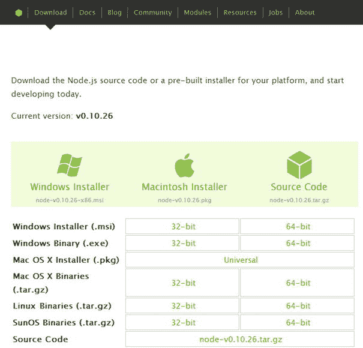

[图 1-1](#_Fig1) 。列出安装程序的 Node.js 下载页面

在下一节中，我们将指导您完成操作系统(OS)的重要步骤。您可以安全地跳过与您当前操作系统无关的部分。

在 Windows 上安装

Node.js 的网站列出了“Windows 二进制(`.exe`)”和“Windows Installer(。msi)。”你不希望使用 windows 二进制(`.exe`)进行开发，因为它不包含重要的东西，如节点包管理器(NPM) ，我们将在[第 4 章](04.html)中介绍。Node.js 为 32 位和 64 位 Windows 提供了单独的安装程序(`.msi`)。我们建议您根据您的平台安装。您可以像在 Windows 上启动任何其他安装程序一样启动安装程序([图 1-2](#Fig2) )。

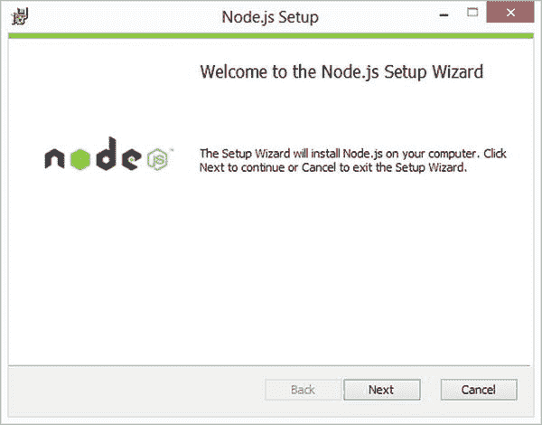

[图 1-2](#_Fig2) 。Windows 上的 Node.js 安装向导

首次启动时，我们建议您使用默认选项安装到默认目录。尤其重要的是你要让安装程序*添加到路径* ( [图 1-3](#Fig3) ) *。*

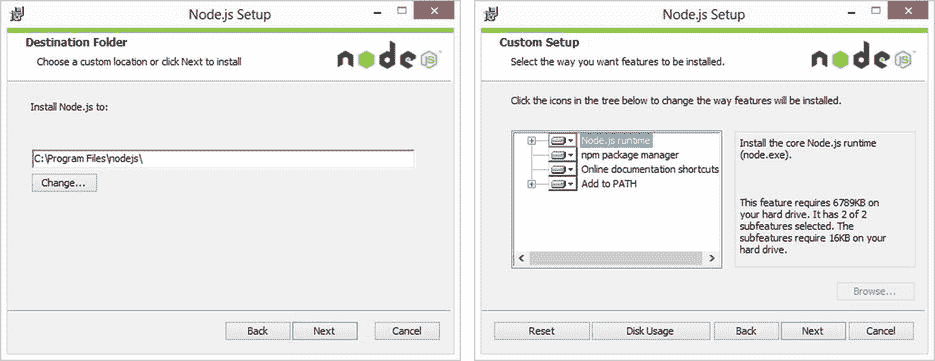

[图 1-3](#_Fig3) 。Windows 上 Node.js 安装程序的默认选项

安装后，卸载和重新安装 Node.js 极其容易。如果再次运行安装程序，会提示*移除*选项，如图[图 1-4](#Fig4) 所示。

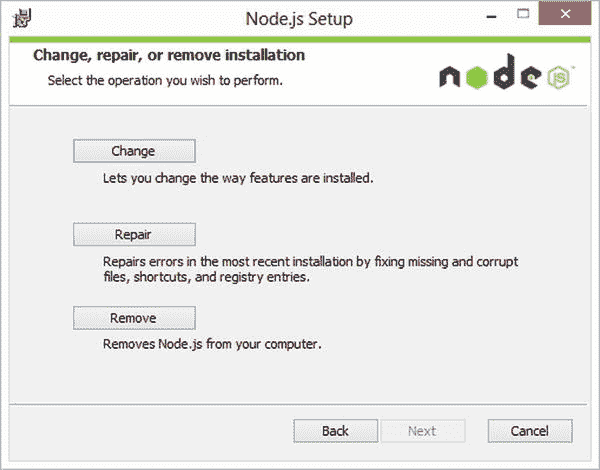

[图 1-4](#_Fig4) 。Windows 的 Node.js 卸载程序

由于安装程序设置了系统路径，所以可以从*命令*提示符运行 Node.js(在 Windows 开始菜单中搜索“命令提示符”)。我们只需在 cmd ( [图 1-5](#Fig5) )中输入`node`就可以启动 Node.js。这将使您进入 REPL，我们将在下一节对此进行解释。

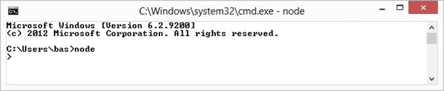

[图 1-5](#_Fig5) 。从命令行运行 Node.js

在 Mac OS X 上安装

从`http://nodejs.org/download/`下载 Node.js 团队提供的 Mac OS X 安装程序。安装程序是一个可以从 Finder 启动的`.pkg`文件([图 1-6](#Fig6) )。

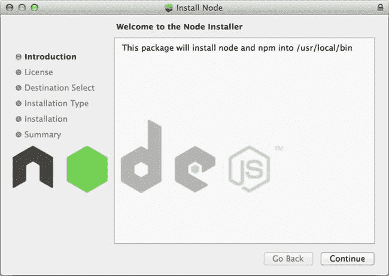

[图 1-6](#_Fig6) 。Mac OS X 的 Node.js 安装程序

开始时，坚持默认设置并为所有用户安装([图 1-7](#Fig7) )。

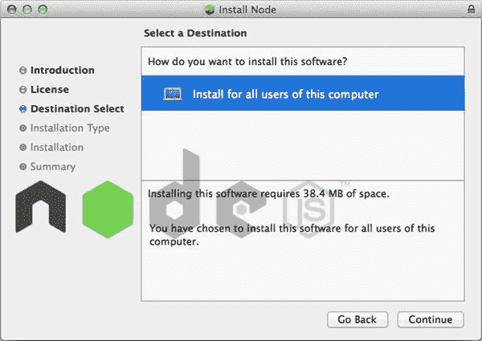

[图 1-7](#_Fig7) 。Node.js 为所有用户设置选项

一旦完成，安装程序会通知你它安装了两个二进制文件(`node`和`npm`)，如图[图 1-8](#Fig8) 所示。

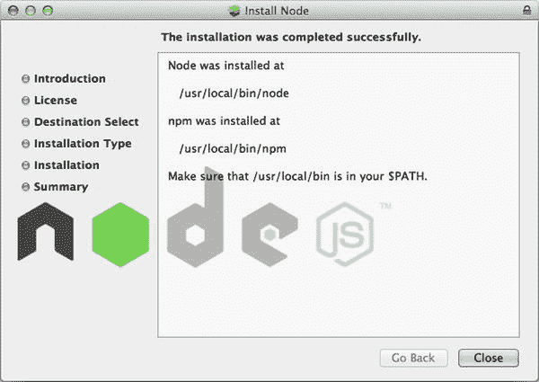

[图 1-8](#_Fig8) 。已安装 Node.js 二进制文件

我们将在第四章的[中详细介绍`npm`。你在 Node.js 中运行 JavaScript 的主可执行文件是`node` (](04.html) [图 1-9](#Fig9) )。对于 Mac OS X，您可以从终端启动`node`(使用 Mac OS X spotlight 搜索终端)。如果您在终端中执行`node`，它将启动 Node.js REPL，我们接下来将讨论它。

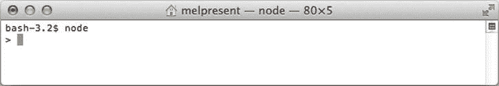

[图 1-9](#_Fig9) 。在 Mac OS X 上从命令行运行 Node.js

使用REPL

Node.js 为您提供了一个 REPL(read-evaluate-print-loop)，这样您就可以测试任意的 JavaScript，并试验和探索您试图解决的问题的解决方案。当您不带任何命令行参数运行`node`时，它会将您置于 REPL。要查看您可用的选项，如图 1-10 中的[所示，键入`.help`并按回车键。](#Fig10)

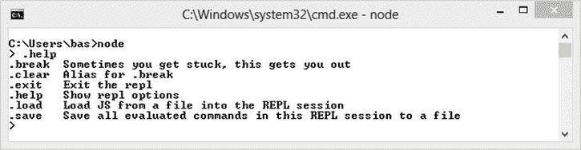

[图 1-10](#_Fig10) 。Node.js REPL 帮助

你可以在 REPL 中执行任意的 JavaScript 并立即看到它的结果，如图[图 1-11](#Fig11) 所示。

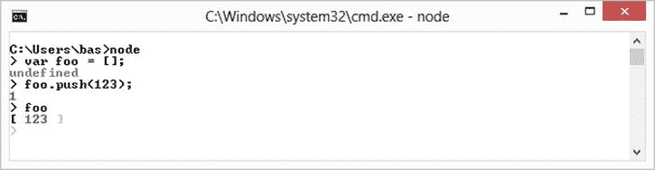

[图 1-11](#_Fig11) 。在 Node.js REPL 中执行 JavaScript

在每一步，REPL 打印最后执行的语句的结果。REPL 不会执行您的输入代码，直到所有的括号都被平衡。要执行多行，只需用括号将它们括起来。REPL 使用(…)来表示它在执行之前正在等待完整的代码。只需关闭括号并按下回车键，REPL 就可以计算输入的 JavaScript(见[图 1-12](#Fig12) )。从块内部退出(...)无需执行您已经输入的内容，只需键入`.break`或按 Ctrl+C。

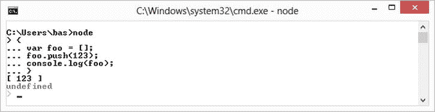

[图 1-12](#_Fig12) 。在 Node.js REPL 中执行多行

当您想要测试一些 JavaScript 并确保它按照您想要的方式运行时，REPL 非常有用。您可以通过键入`.exit`(或按 Ctrl+D)退出 REPL。

执行 Node.js 脚本

我们已经看到了如何通过在 REPL 中键入 JavaScript 来执行它。然而，你最常见的是编写 Node.js 程序(脚本文件)并使用 Node.js 执行它们。你可以在 Node.js 中执行一个 JavaScript 源文件，只需在命令行上将文件传递给`node`(图 1-13[)。创建一个名为`helloworld.js`的新文件，包含一个简单的`console.log`，如](#Fig13)[清单 1-1](#list1) 所示。

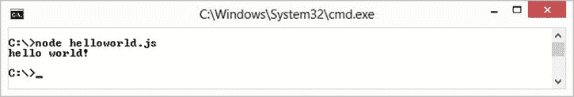

[图 1-13](#_Fig13) 。在 Node.js 中执行脚本文件

**[清单 1-1](#_list1)** 。helloworld.js

```js
console.log("hello world!");

```

然后从保存文件的同一个目录中通过在命令行上运行`node helloworld.js`来运行文件(在我们的例子中是`C:\`)。

注意，我们使用`console.log`的方式和我们做前端 web 开发时使用的方式一样。Node.js 的一个理念是，对于前端开发者来说应该是直观的。Node.js 团队试图在任何有意义的时候保持 API 与浏览器的一致性。

Node.js 只是像浏览器一样从上到下执行输入的 JavaScript。然而，通常将应用程序的主文件命名为`app.js`，这样人们就知道为了运行应用程序应该执行哪个文件。

建立集成开发环境

Node.js 非常棒，因为只需一个文本编辑器和终端就能轻松上手。(这并不意味着没有更全功能的开发环境。)Node.js 从 JetBrains(IntelliJ Idea、RubyMine 和 PyCharm 的创造者)的 WebStorm 以及微软的 Visual Studio 中获得了巨大的支持。WebStorm 可以在 Windows、Mac OS X 和 Linux 上使用，而 Visual Studio 只能在 Windows 上使用。

WebStorm Node.js 支持

WebStorm 自称是“最智能的 JavaScript IDE”。它基于 IntelliJ IDEA 平台，如果您是 Java、Ruby 或 Python 背景的人，可能很容易迁移到这个平台。从`http://www.jetbrains.com/webstorm/`就可以得到。

WebStorm 使用“项目”的概念工作当您启动 WebStorm 时，您会看到一个选项，*创建一个新项目*。对于这个例子，我们将创建一个简单的空项目([图 1-14](#Fig14) )。

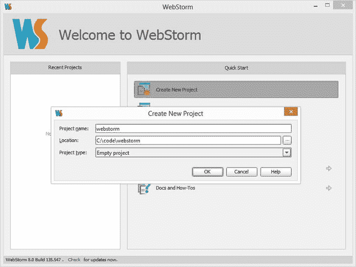

[图 1-14](#_Fig14) 。在 WebStorm 中新建一个项目

打开项目窗口后，右键单击项目名称(如图[图 1-15](#Fig15) 所示)。添加一个新的 JavaScript 文件，并将该文件命名为“main”(也如[图 1-15](#Fig15) 所示)。

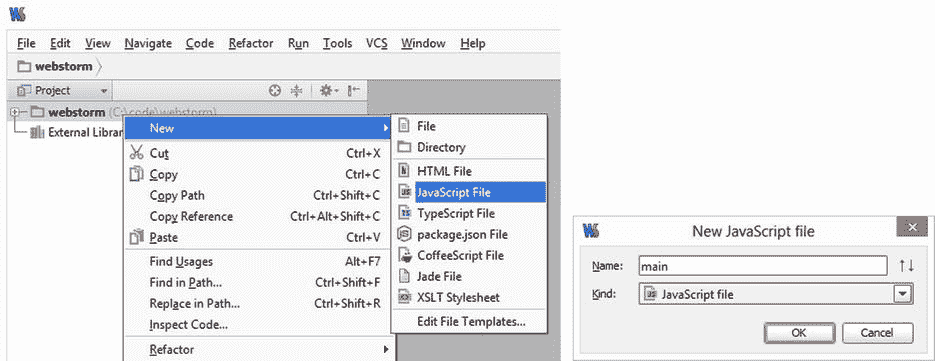

[图 1-15](#_Fig15) 。给 WebStorm 项目添加一个新文件

清除文件的内容并简单地放入一个`console.log`，如[清单 1-2](#list2) 所示。

**[清单 1-2](#_list2)** 。

```js
console.log("Hello WebStorm!");

```

因为我们已经安装了 Node.js，所以 WebStorm 足够聪明来解决这个问题。所以，如果你右击文件内的任何地方，WebStorm 会显示选项*运行‘main . js’*([图 1-16](#Fig16) )。


[图 1-16](#_Fig16) 。从 WebStorm 运行 Node.js 中的脚本文件

如果选择该选项，WebStorm 会启动 Node.js，将该文件作为参数传入，并显示输出，如图[图 1-17](#Fig17) 所示。

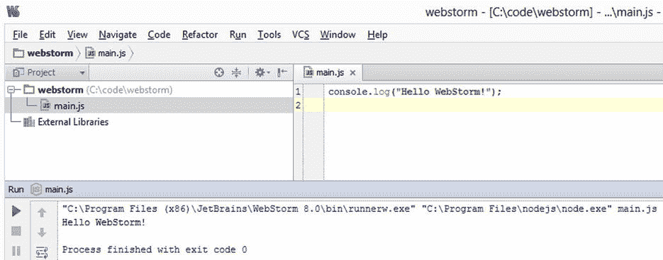

[图 1-17](#_Fig17) 。脚本执行导致网络风暴

当您要求 WebStorm 运行该文件时，它实际上创建了一个运行配置。您可以查看该运行配置，并通过使用运行编辑配置对其进行进一步定制，如图[图 1-18](#Fig18) 所示。

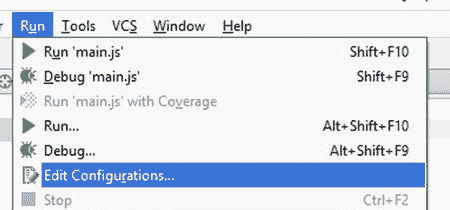

[图 1-18](#_Fig18) 。在 WebStorm 中编辑运行配置

这将打开配置编辑器对话框，如图[图 1-19](#Fig19) 所示。您可以看到为您创建的配置，并根据需要进行编辑。

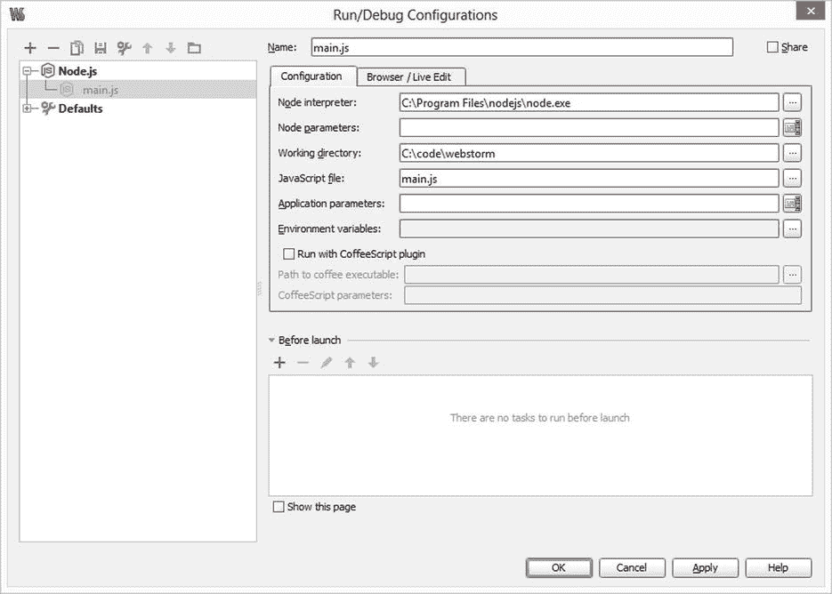

[图 1-19](#_Fig19) 。WebStorm 中的 Node.js 配置选项

WebStorm 比我们在这里展示的容量更大，我们在这里展示的目的是让您快速入门。WebStorm 与 Node.js 内置调试器有很好的集成，将在[第 11 章](11.html)中探讨。

Visual Studio Node.js 支持

如果你来自一个`.NET`背景，你可能会很高兴听到 Visual Studio 有一流的 Node.js 支持。这种支持以“Node.js Tools for Visual Studio”的形式提供，适用于微软的 Visual Studio 2012 和 Visual Studio 2013。你可以从`https://nodejstools.codeplex.com`下载这些工具。安装这些工具再简单不过了。只需启动下载的`.msi`安装程序，点击完成。

现在，当您启动 Visual Studio 并创建一个新项目时，您会看到一个新的语言选项， *JavaScript* 。选择它并创建一个`Blank Node.js Console App`，指定其名称和位置，如图 1-20 中的[所示。](#Fig20)

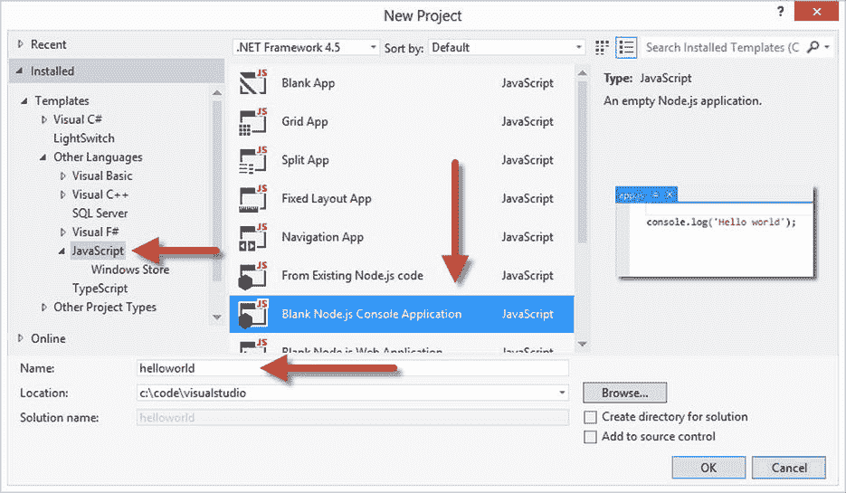

[图 1-20](#_Fig20) 。创建一个新节点T3。使用 Visual Studio 的 js 项目

应用程序创建完成后，Visual Studio 打开 *app.js* ，如图[图 1-21](#Fig21) 所示。

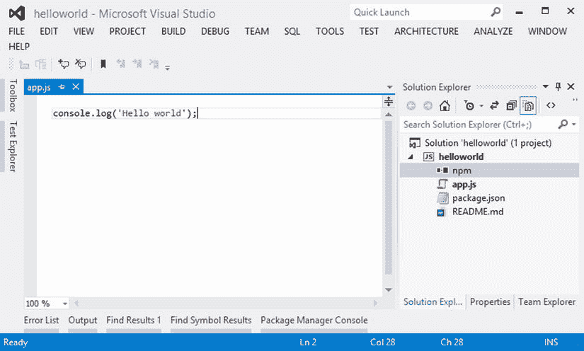

[图 1-21](#_Fig21) 。使用 Visual Studio 创建的 Node.js 应用程序

此时不要担心 *package.json* 和 *npm* 。这些选项将在[第 4 章](04.html)中解释。现在让我们从 Visual Studio 运行这个简单的控制台应用程序。点击编辑器侧边栏添加调试断点，如图[图 1-22](#Fig22) 所示。

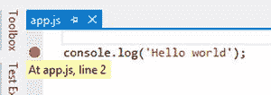

[图 1-22](#_Fig22) 。在 Visual Studio 中向文件添加调试断点

要在调试模式下运行该应用程序，请按 F5，Visual Studio 会将 app.js 传递给 Node.js，并在断点处暂停，如图 1-23 所示。Visual Studio 使用 Node.js 内置的 V8 调试器，我们将在[第 11 章](11.html)中讨论。

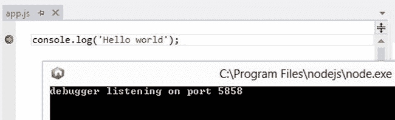

[图 1-23](#_Fig23) 。在 Visual Studio 中激活断点T3

Visual Studio 中的所有常见调试工具，如调用堆栈、局部变量和 watch，都可以很好地与 Node.js 一起工作。您甚至可以在 Node.js 的“内部”看到源代码。例如，图 1-24 中的调用堆栈中显示的 module.js 是 Node.js 的一部分，而不是我们的应用程序。


[图 1-24](#_Fig24) 。Visual Studio 显示局部变量和调用堆栈

按 F5 继续。然后将“Hello world”打印到控制台并退出([图 1-25](#Fig25) )。

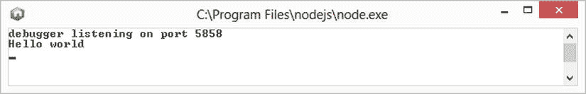

[图 1-25](#_Fig25) 。从 Visual Studio 执行的 Node.js 应用程序

使用 Visual Studio 时需要注意的最后一件事是属性窗格。您可以在解决方案资源管理器中右键单击项目，选择*属性*，修改 Visual Studio 与`node.exe`的交互方式，如图[图 1-26](#Fig26) 所示。

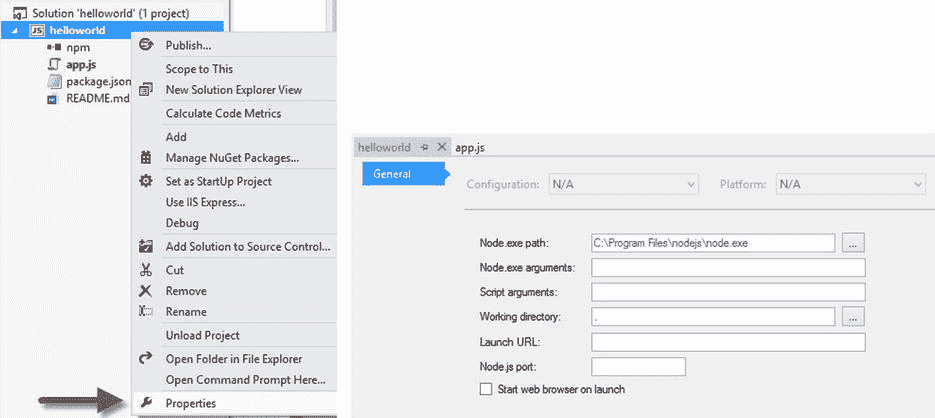

[图 1-26](#_Fig26) 。Visual Studio 中的 Node.js 配置选项

摘要

Node.js 从一开始就获得了极好的社区支持。感谢安装程序，您不再需要从源代码编译 Node.js 来在您喜欢的平台上创建 Node.js 应用程序。在设置了 Node.js 之后，我们展示了一些 ide 示例，它们可以使使用 Node.js 变得更加容易，从而使您能够快速启动并运行。

在下一章中，我们将讨论为了成功使用 Node.js 你需要理解的重要 JavaScript 概念。