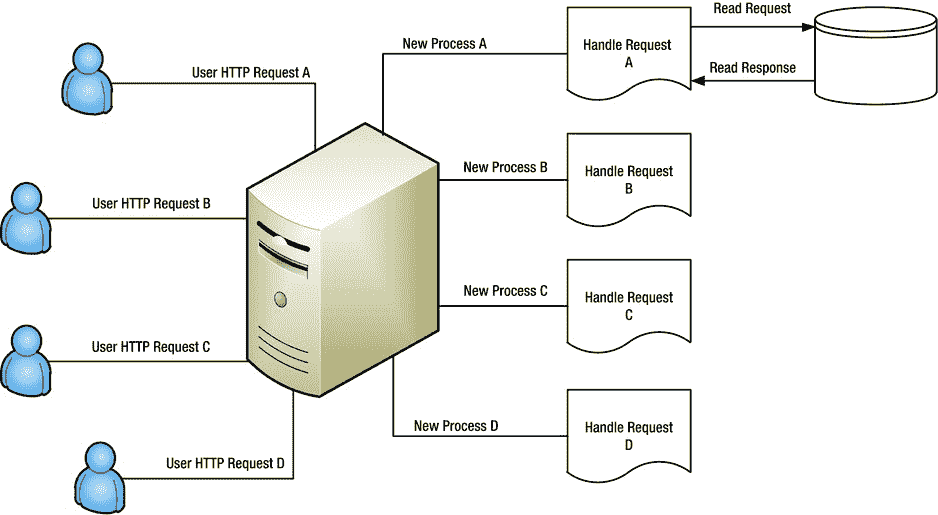
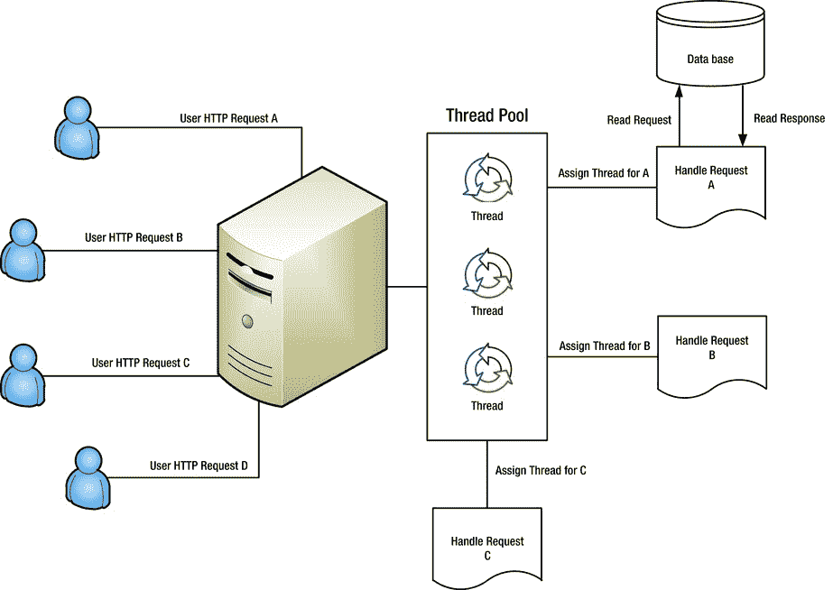
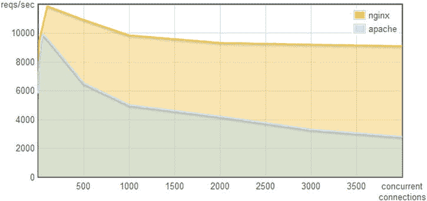
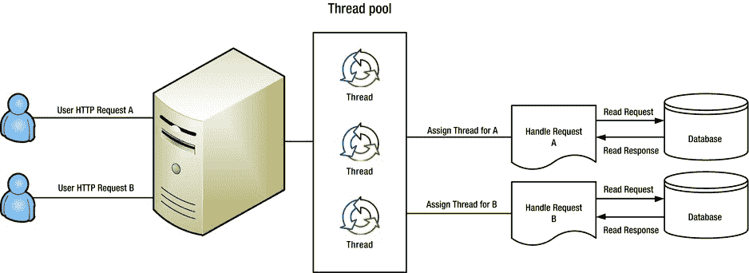

第二章


了解 Node.js

要理解 Node.js 是如何工作的，首先需要理解 JavaScript 的一些关键特性，这些特性使它非常适合服务器端开发。JavaScript 是一种简单的语言，但它也非常灵活。这种灵活性是它经受住时间考验的原因。一流的函数和闭包使它成为 web 应用的理想语言。

JavaScript 有一个不可靠的坏名声。然而，这种想法与事实相去甚远。实际上，JavaScript 的坏名声来自于 DOM 的不可靠性。DOM(文档对象模型)是浏览器供应商提供的使用 JavaScript 与浏览器交互的 API(应用编程接口)。不同浏览器厂商的 DOM 各不相同。然而，JavaScript 这种语言是定义良好的，可以跨浏览器和 Node.js 可靠地使用。在本章中，我们将讨论 JavaScript 的一些基础知识，然后讨论 Node.js 如何使用 JavaScript 为 web 应用提供高性能的平台。其他人抱怨 JavaScript 如何处理编程错误(它试图让无效代码工作)。然而，在这种情况下，开发人员确实应该受到责备，因为他们在使用高度动态的语言时需要小心。

变量

变量是在 JavaScript 中使用关键字`var`定义的。例如，下面的代码段创建了一个变量`foo`，并将其记录到控制台。(参见[清单 2-1](#list1) 。)正如您在上一章中看到的，您将使用`node variable.js`从您的控制台(Mac OS X 上的终端和 Windows 上的 cmd)运行这段代码。

**[清单 2-1](#_list1) 。**变量. js

```js
var foo = 123;
console.log(foo); // 123

```

JavaScript 运行时(浏览器或 Node.js)有机会定义一些我们可以在代码中使用的全局变量。其中之一是`console`对象，到目前为止我们一直在使用它。`console`对象包含一个成员函数(`log`)，它接受任意数量的参数并将它们打印到控制台。我们将在使用全局对象时讨论更多的全局对象。正如您将看到的，JavaScript 包含了您期望一个好的编程语言拥有的大部分东西。

数字

JavaScript 中的所有数字都有相同的浮点数类型。算术运算(+、-、*、/、%)如您所料对数字起作用，如[清单 2-2](#list2) 所示。

**[清单 2-2](#_list2) 。** numbers.js

```js
var foo = 3;
var bar = 5;
console.log(foo + 1); // 4
console.log(foo / bar); // 0.6
console.log(foo * bar); // 15
console.log(foo - bar); // -2;
console.log(foo % 2); // remainder: 1

```

布尔值

为布尔值定义了两个字面值:`true`和`false`。您可以将这些赋值给变量，并按预期对它们应用布尔运算。(参见[清单 2-3](#list3) 。)

**[清单 2-3](#_list3) 。**布尔型. js

```js
var foo = true;
console.log(foo); // true

// Boolean operations (&&, ||, !) work as expected:
console.log(true && true); // true
console.log(true && false); // false
console.log(true || false); // true
console.log(false || false); // false
console.log(!true); // false
console.log(!false); // true

```

数组

您可以使用`[]`在 JavaScript 中非常容易地创建数组。数组有许多有用的功能，其中一些在[清单 2-4](#list4) 中显示。

**[清单 2-4](#_list4) 。** arrays.js

```js
var foo = [];

foo.push(1); // add at the end
console.log(foo); // prints [1]

foo.unshift(2); // add to the top
console.log(foo); // prints [2,1]

// Arrays are zero index based:
console.log(foo[0]); // prints 2

```

对象文字

通过解释这几个基本类型，我们已经向您介绍了对象文字。在 JavaScript 中创建对象最常见的方式是使用对象符号`{}`。对象可以在运行时任意扩展。清单 2-5 给出了一个例子。

**[清单 2-5](#_list5) 。** objectLiterals1.js

```js
var foo = {};
console.log(foo); // {}
foo.bar = 123; // extend foo
console.log(foo); // { bar: 123 }

```

不用在运行时扩展它，你可以通过使用清单 2-6 中的对象文字符号来定义对象的属性

**[清单 2-6](#_list6) 。** objectLiterals2.js

```js
var foo = {
    bar: 123
};
console.log(foo); // { bar: 123 }

```

您还可以在对象文字中嵌套对象文字，如清单 2-7 所示。

**[清单 2-7](#_list7) 。** objectLiterals3.js

```js
var foo = {
    bar: 123,
    bas: {
        bas1: 'some string',
        bas2: 345
    }
};
console.log(foo);

```

当然，你也可以在对象文字中包含数组，如清单 2-8 所示。

**[清单 2-8](#_list8) 。** objectLiterals4.js

```js
var foo = {
    bar: 123,
    bas: [1, 2, 3]
};
console.log(foo);

```

而且，你也可以让这些数组本身包含对象文字，正如你在[清单 2-9](#list9) 中看到的。

**[清单 2-9](#_list9) 。** objectLiterals5.js

```js
var foo = {
    bar: 123,
    bas: [{
        qux: 1
    },
    {
        qux: 2
    },
    {
        qux: 3
    }]
};
console.log(foo.bar); // 123
console.log(foo.bas[0].qux); // 1
console.log(foo.bas[2].qux); // 2

```

对象文字作为函数参数和返回值非常方便。

功能

JavaScript 中的函数非常强大。JavaScript 的大部分能力来自于它处理函数类型的方式。我们将在后面更复杂的例子中研究 JavaScript 中的函数。

职能 101

JavaScript 中的一个普通函数结构在[清单 2-10](#list10) 中定义。

**[清单 2-10](#_list10) 。**。职能机构。射流研究…

```js
function functionName() {
    // function body
    // optional return;
}

```

JavaScript 中的所有函数都返回值。在没有显式 return 语句的情况下，函数返回`undefined`。当您执行[清单 2-11](#list11) 中的代码时，您会在控制台上看到`undefined`。

**[清单 2-11](#_list11) 。** functionReturn.js

```js
function foo() { return 123; }
console.log(foo()); // 123

function bar() { }
console.log(bar()); // undefined

```

我们将在本章讨论默认值时更多地讨论`undefined`函数。

立即执行功能

定义一个函数后，您可以立即执行它。简单地将函数放在括号()中并调用它，如清单 2-12 所示。

**[清单 2-12](#_list12) 。** ief1.js

```js
(function foo() {
    console.log('foo was executed!');
})();

```

使用立即执行函数的原因是为了创建一个新的变量范围。在 JavaScript 中，`if`、`else`或`while`不会创建新的变量范围。这个事实在[清单 2-13](#list13) 中得到了证明。

**[清单 2-13](#_list13) 。** ief2.js

```js
var foo = 123;
if (true) {
    var foo = 456;
}
console.log(foo); // 456;

```

在 JavaScript 中创建新变量作用域的唯一推荐方法是使用函数。因此，为了创建一个新的变量范围，我们可以使用一个立即执行的函数，如清单 2-14 所示。

**[清单 2-14](#_list14) 。** ief3.js

```js
var foo = 123;
if (true) {
    (function () { // create a new scope
        var foo = 456;
    })();
}
console.log(foo); // 123;

```

注意，我们选择避免不必要的函数命名。这被称为一个*匿名函数*，我们将在下面解释。

匿名函数

没有名字的函数叫做匿名函数。在 JavaScript 中，您可以将函数赋给变量。如果你打算用一个函数作为变量，你不需要给函数命名。清单 2-15 展示了两种内联定义函数的方法。这两种方法是等效的。

**[清单 2-15](#_list15) 。**无名氏

```js
var foo1 = function namedFunction() { // no use of name, just wasted characters
    console.log('foo1');
}
foo1(); // foo1

var foo2 = function () { // no function name given i.e. anonymous function
    console.log('foo2');
}
foo2(); // foo2

```

如果一个函数可以像该语言中的任何其他变量一样被处理，则称该语言具有*一级函数*。JavaScript 有一流的功能。

高阶函数

因为 JavaScript 允许我们将函数赋给变量，所以我们可以将函数传递给其他函数。以函数为自变量的函数称为*高阶函数*。高阶函数的一个非常常见的例子是`setTimeout`。这显示在[清单 2-16](#list16) 中。

**[清单 2-16](#_list16) 。** higherOrder1.js

```js
setTimeout(function () {
    console.log('2000 milliseconds have passed since this demo started');
}, 2000);

```

如果您在 Node.js 中运行这个应用，您将在两秒钟后看到`console.log`消息，然后应用将退出。注意，我们提供了一个匿名函数作为`setTimeout`的第一个参数。这使得`setTimeout`成为一个高阶函数。

值得一提的是，没有什么可以阻止我们创建一个函数并将其传入。清单 2-17 中显示了一个例子。

**[清单 2-17](#_list17) 。** higherOrder2.js

```js
function foo() {
    console.log('2000 milliseconds have passed since this demo started');
}
setTimeout(foo, 2000);

```

既然我们已经对对象文字和函数有了明确的理解，我们就可以研究闭包的概念了。

关闭

每当我们在一个函数中定义了另一个函数时，内部函数就可以访问外部函数中声明的变量。闭包最好用例子来解释。

在清单 2-18 中，你可以看到内部函数从外部作用域访问变量(`variableInOuterFunction`)。外部函数中的变量已被内部函数封闭(或绑定)。因此有了关闭 T4 的说法。这个概念本身足够简单，也相当直观。

**[清单 2-18](#_list18) 。** closure1.js

```js
function outerFunction(arg) {
    var variableInOuterFunction = arg;

    function bar() {
        console.log(variableInOuterFunction); // Access a variable from the outer scope
    }

    // Call the local function to demonstrate that it has access to arg
    bar();
}

outerFunction('hello closure!'); // logs hello closure!

```

现在最棒的部分是:内部函数可以从外部作用域*访问变量，即使外部函数已经返回了*。这是因为变量仍然绑定在内部函数中，不依赖于外部函数。[清单 2-19](#_list19) 。显示了一个示例。

**[清单 2-19](#_list19) 。** closure2.js

```js
function outerFunction(arg) {
    var variableInOuterFunction = arg;
    return function () {
        console.log(variableInOuterFunction);
    }
}

var innerFunction = outerFunction('hello closure!');

// Note the outerFunction has returned
innerFunction(); // logs hello closure!

```

现在我们已经了解了一流的函数和闭包，我们可以看看是什么让 JavaScript 成为服务器端编程的伟大语言。

了解 Node.js 性能

Node.js 专注于创建高性能的应用。在下一节中，我们将介绍 I/O 伸缩问题。然后我们展示传统上是如何解决的，接着是 Node.js 是如何解决的。

I/O 扩展问题

Node.js 致力于成为编写高性能 web 应用的最佳方式。为了理解它是如何实现的，我们需要了解 I/O 伸缩问题。让我们根据 CPU 周期来粗略估计一下从不同来源访问数据的速度([图 2-1](#Fig1) )。


[图 2-1](#_Fig1) 。比较常见的 I/O 源

您可以清楚地看到，磁盘和网络访问与访问 RAM 和 CPU 缓存中的数据完全不同。

大多数 web 应用依赖于从磁盘或其他网络来源(例如，数据库查询)读取数据。当收到一个 HTTP 请求，我们需要从数据库加载数据时，通常这个请求会等待磁盘读取或网络访问调用完成。

这些打开的连接和挂起的请求会消耗服务器资源(内存和 CPU)。为了使用同一个 web 服务器处理来自不同客户端的大量请求，我们遇到了 I/O 伸缩问题。

传统的网络服务器对每个请求使用一个进程

传统的服务器过去常常启动一个新的进程来处理每一个 web 请求。为每个请求旋转一个新的进程是一项开销很大的操作，在 CPU 和内存方面都是如此。这是 PHP 等技术最初创建时的工作方式。

这一概念的演示如图 2-2 所示。为了成功回复 HTTP 请求“A”，我们需要来自数据库的一些数据。这种读取可能需要很长时间。在整个读取期间，我们将有一个进程在空闲和等待数据库响应时占用 CPU 和内存。此外，进程启动缓慢，并且在 RAM 空间方面有很大的开销。这不能长期扩展，这就是为什么现代 web 应用使用线程池的原因。



[图 2-2](#_Fig2) 。使用进程的传统 web 服务器

使用线程池的传统 Web 服务器

现代服务器使用线程池中的一个线程来服务每个请求。因为我们已经创建了一些操作系统(OS)线程(因此有一个线程池)，所以我们不需要为启动和停止 OS 进程付出代价(创建 OS 进程的成本很高，并且占用的内存比线程多得多)。当请求进来时，我们分配一个线程来处理这个请求。在处理请求的整个过程中，该线程都是为请求保留的，如[图 2-3](#Fig3) 所示。



[图 2-3](#_Fig3) 。使用线程池的传统 web 服务器

因为我们节省了每次创建新进程的开销，而且线程比进程轻，所以这种方法比原来的服务器设计好得多。几年前，大多数 web 服务器都使用这种方法，并且今天仍在使用。然而，这种方法并非没有缺点。同样，线程之间存在内存浪费。此外，操作系统需要在线程之间进行上下文切换(即使当它们空闲时)，这导致了 CPU 资源的浪费。

Nginx 方式

我们已经看到，创建单独的进程和单独的线程来处理请求会导致操作系统资源的浪费。Node.js 的工作方式是只有一个线程处理请求。对于 Node.js 来说，单线程服务器的性能优于线程池服务器的想法并不新鲜。

Nginx 是一个单线程 web 服务器，可以处理大量并发请求。一个比较 Nginx 和 Apache 的简单基准，两者都服务于文件系统中的一个静态文件，如图 2-4 所示。



[图 2-4](#_Fig4) 。Nginx 与 Apache 每秒请求数和并发打开连接数的比较

如您所见，当并发连接数增加时，Nginx 每秒可以处理比 Apache 多得多的请求。更有趣的是内存消耗，如图[图 2-5](#Fig5) 。


[图 2-5](#_Fig5) 。Nginx 与 Apache 内存使用量和并发连接数

随着并发连接越来越多，Apache 需要管理更多的线程，因此消耗更多的内存，而 Nginx 保持在一个稳定的水平。

Node.js 性能秘密

JavaScript 中只有一个执行线程。这是网络浏览器传统的工作方式。如果您有一个长时间运行的操作(例如等待计时器完成或数据库查询返回)，您必须使用回调继续操作。[清单 2-20](#_list20) 。提供了一个简单的演示程序，它使用 JavaScript runtime `setTimeout`函数来模拟一个长时间运行的操作。您可以使用 Node.js 运行这段代码。

**[清单 2-20](#_list20) 。** simulateUserClick.js

```js
function longRunningOperation(callback) {
    // simulate a 3 second operation
    setTimeout(callback, 3000);
}

function userClicked() {
    console.log('starting a long operation');
    longRunningOperation(function () {
        console.log('ending a long operation');
    });
}
// simulate a user action
userClicked();

```

这种模拟在 JavaScript 中是可能的，因为我们有一级函数和传递函数——回调是该语言中一种受良好支持的模式。当您将一流的函数与闭包的概念结合起来时，事情就变得有趣了。假设我们正在处理一个 web 请求，并且我们有一个长时间运行的操作，比如我们需要做的数据库查询。清单 2-21 中显示了一个模拟版本。

**[清单 2-21](#_list21) 。** simulateWebRequest.js

```js
function longRunningOperation(callback) {
    // simulate a 3 second operation
    setTimeout(callback, 3000);
}

function webRequest(request) {
    console.log('starting a long operation for request:', request.id);
    longRunningOperation(function () {
        console.log('ending a long operation for request:', request.id);
    });
}
// simulate a web request
webRequest({ id: 1 });
// simulate a second web request
webRequest({ id: 2 });

```

在[清单 2-21](#list21) 中，由于闭包，我们可以在长时间运行的操作完成后访问正确的用户请求。我们刚刚毫不费力地在单线程上处理了两个请求。现在你应该明白下面这句话了:“Node.js 是高性能的，它使用 JavaScript 是因为 JavaScript 支持一流的函数和闭包。”

当有人告诉你你只有一个单线程来处理请求时，你应该立即想到的问题是，“但是我的计算机有一个四核 CPU。只使用单线程肯定会浪费资源。”答案是肯定的。然而，有一个很好的解决方法，我们将在第 13 章讨论部署和可伸缩性时研究它。简单提示一下您将会看到什么:使用 Node.js，通过为每个 CPU 内核使用单独的 JavaScript 进程来使用所有 CPU 内核实际上非常简单。

还需要注意的是，Node.js 在 C 层管理一些线程(比如某些文件系统操作)，但是所有的 JavaScript 都在一个线程中执行。这为您提供了 JavaScript 几乎完全拥有至少一个线程的性能优势。

更多 Node.js 内部信息

理解 Node.js 的内部工作原理并不十分重要，但是当您与同行讨论 Node.js 时，更多的讨论会让您更加了解这些术语。Node.js 的核心是一个*事件循环*。

事件循环使任何 GUI 应用都能在任何操作系统上工作。当有事情发生时(例如，用户点击一个按钮)，操作系统调用应用中的一个函数，然后应用执行这个函数中包含的逻辑直到完成。之后，您的应用准备好响应可能已经到达(并且在队列中)或者可能稍后到达(基于用户交互)的新事件。

线程饥饿

通常，在 GUI 应用中从一个事件调用一个函数的过程中，不会处理其他事件。因此，如果您在点击处理程序中执行长时间运行的任务，GUI 将变得没有响应。这是我遇到的每个电脑用户都曾经历过的事情。这种 CPU 资源可用性的缺乏被称为*饥饿*。

Node.js 构建在与 GUI 程序相同的事件循环原则上。因此，它也会挨饿。为了更好地理解它，我们来看几个代码示例。[清单 2-22](#_list22) 。展示了一小段使用`console.time`和`console.timeEnd`函数测量时间的代码。

**[清单 2-22](#_list22) 。** timeit.js

```js
console.time('timer');
setTimeout(function(){
   console.timeEnd('timer');
},1000)

```

如果您运行这段代码，您应该会看到一个非常接近您预期的数字—换句话说，1000 毫秒。这个超时回调是从 Node.js 事件循环中调用的。

现在让我们写一些需要很长时间来执行的代码，例如，计算第 n 个斐波那契数的非优化方法，如[清单 2-23](#list23) 所示。

**[清单 2-23](#_list23) 。**大型操作. js

```js
console.time('timeit');
function fibonacci(n) {
    if (n < 2)
        return 1;
    elses
        return fibonacci(n - 2) + fibonacci(n - 1);
}
fibonacci(44); // modify this number based on your system performance
console.timeEnd('timeit'); // On my system it takes about 9000ms (i.e. 9 seconds)

```

现在我们有了一个可以从 Node.js 事件循环中引发的事件(set `Timeout`)和一个可以让 JavaScript 线程保持忙碌的函数(`fibonacci`)。我们现在可以在 Node.js 中演示饥饿。但是在这个超时完成之前，我们执行了一个占用大量 CPU 时间的函数，因此占用了 CPU 和 JavaScript 线程。由于这个函数被 JavaScript 线程占用，事件循环不能调用其他任何东西，因此超时被延迟，如[清单 2-24](#list24) 所示。

**[清单 2-24](#_list24) 。** starveit.js

```js
// utility funcion
function fibonacci(n) {
    if (n < 2)
        return 1;
    else
        return fibonacci(n - 2) + fibonacci(n - 1);
}

// setup the timer
console.time('timer');
setTimeout(function () {
    console.timeEnd('timer'); // Prints much more than 1000ms
}, 1000)

// Start the long running operation
fibonacci(44);

```

这里的一个教训是，如果您有一个高 CPU 任务，需要在多客户机服务器环境中对客户机请求执行*，Node.js 不是最佳选择。然而，如果是这样的话，你将很难在任何平台上找到一个可扩展的软件解决方案。大多数高 CPU 任务应该脱机执行，通常使用物化视图、map reduce 等将任务卸载到数据库服务器。大多数 web 应用通过网络访问这些计算的结果，这就是 Node.js 的亮点——事件网络 I/O。*

现在，您已经理解了事件循环的含义以及 Node.js 的 JavaScript 部分是单线程的这一事实的含义，让我们再来看看为什么 Node.js 对 I/O 应用非常有用。

数据密集型应用

Node.js 非常适合数据密集型应用。正如我们所看到的，使用单线程意味着 Node.js 在用作 web 服务器时占用的内存非常少，并且可以处理更多的请求。考虑一个数据密集型应用的简单场景，该应用通过 HTTP 从数据库向客户端提供数据集。我们知道，与执行代码和/或从 RAM 中读取数据相比，收集响应客户端查询所需的数据需要很长时间。图 2-6 显示了一个传统的带有线程池的 web 服务器在响应两个请求时的样子。



[图 2-6](#_Fig6) 。传统服务器如何处理两个请求

Node.js 中相同的服务器如图[图 2-7](#Fig7) 所示。所有的工作都将在一个线程中进行，这导致了更少的内存消耗，并且由于缺少线程上下文切换，CPU 负载也更少。就实现而言，`handleClientRequest`是一个调用数据库的简单函数(使用回调)。当回调返回时，它使用用 JavaScript 闭包捕获的请求对象来完成请求。清单 2-25 中的伪代码显示了这一点。


[图 2-7](#_Fig7) 。Node.js 服务器如何处理两个请求

**[清单 2-25](#_list25) 。** handleClientRequest.js

```js
function handleClientRequest(request) {
    makeDbCall(request.someInfo, function (result) {
        // The request corresponds to the correct db result because of closure
        request.complete(result);
    });
}

```

注意，对数据库的 HTTP 请求也是由事件循环管理的。拥有异步 IO 的优势以及 JavaScript + Node.js 非常适合数据密集型应用的原因现在应该很清楚了。

V8 JavaScript 引擎

值得一提的是，Node.js 内部的所有 JavaScript 都是由 V8 JavaScript 引擎执行的。V8 伴随着谷歌 Chrome 项目应运而生。V8 是 Chrome 的一部分，当你访问一个网页时，它运行 JavaScript。

任何做过网络开发的人都知道谷歌 Chrome 对网络来说有多神奇。浏览器使用统计非常清楚地反映了这一点。据 w3schools.org 称，访问他们网站的近 56%的互联网用户现在都在使用谷歌浏览器。这有很多原因，但 V8 和它的速度是一个非常重要的因素。除了速度之外，使用 V8 的另一个原因是谷歌的工程师使它易于集成到其他项目中，并且它是独立于平台的。

更多 JavaScript

现在我们已经理解了使用 Node.js 的动机，让我们更深入地研究 JavaScript，这样我们就可以编写可维护的应用。如果想成为 Node.js 开发人员，除了需要擅长 JavaScript 之外，擅长 JavaScript 的另一个原因是利用围绕 Node.js 和 JavaScript 的蓬勃发展的生态系统。GitHub 上项目数量最多的语言是 JavaScript。Node.js 是 GitHub 上最受欢迎的服务器端技术，如图 2-8 所示，也是第三大受欢迎的存储库。


[图 2-8](#_Fig8) 。GitHub 上最流行的存储库

一切都是参考

JavaScript 被设计得很简单，并且只需要有限的计算机资源。每当我们将一个变量赋给另一个变量时，JavaScript 都会复制对该变量的引用。要理解这意味着什么，请看一下清单 2-26 。

**[清单 2-26](#_list26) 。** reference1.js

```js
var foo = { bas: 123 };
var bar = foo;
bar.bas = 456;
console.log(foo.bas); // 456

```

无论对象的大小如何，在函数调用中传递对象都是非常轻量级的，因为我们只复制对对象的引用，而不是对象的每个属性。要制作数据的真实副本(打破引用链接)，你可以创建一个新的对象文字，如清单 2-27 所示。

**[清单 2-27](#_list27) 。** reference2.js

```js
var foo = { bas: 123 };
var bar = { bas: foo.bas }; // copy

bar.bas = 456; // change copy
console.log(foo.bas); // 123, original is unchanged

```

我们可以使用相当多的第三方库来复制任意 JavaScript 对象的属性。(这是一个简单的函数，如果我们愿意，我们可以自己编写。)这些库在第 4 章中有所介绍。

默认值

JavaScript 中任何变量的默认值都是`undefined`。你可以在[清单 2-28](#list28) 中看到它被注销，你创建了一个变量，但没有给它赋值。

**[清单 2-28](#_list28) 。** default1.js

```js
var foo;
console.log(foo); // undefined

```

类似地，变量上不存在的属性返回`undefined` ( [清单 2-29](#list29) )。

**[清单 2-29](#_list29) 。**默认 2.js

```js
var foo = { bar: 123 };
console.log(foo.bar); // 123
console.log(foo.bas); // undefined

```

精确相等

JavaScript 中需要注意的一点是`==`和`===`之间的区别。当 JavaScript 试图抵抗编程错误时，`==`试图在两个变量之间进行类型强制。例如，它将一个字符串转换成一个数字，这样你就可以将它与一个数字进行比较，如[清单 2-30](#list30) 所示。

**[清单 2-30](#_list30) 。**等于 1.js

```js
console.log(5 == '5'); // true
console.log(5 === '5'); // false

```

然而，它做出的选择并不总是理想的。例如，在[清单 2-31](#list31) 中，第一条语句为假，因为“”和“0”都是字符串，显然不相等。然而，在第二种情况下,' 0 '和空字符串(')都是 false(换句话说，它们的行为类似 false ),因此相对于`==`是相等的。当你使用`===`时，这两种说法都是错误的。

**[清单 2-31](#_list31) 。**等于 2.js

```js
console.log('' == '0'); // false
console.log('' == 0); // true

console.log('' === '0'); // false
console.log('' === 0); // false

```

这里的提示是不要比较不同的类型。比较不同类型的变量(比如一个字符串和一个数字)是你无论如何都无法在静态类型语言中完成的事情(在静态类型语言中，你*必须*指定变量的类型)。如果你记住了这一点，你就可以放心地使用`==`。但是，建议您尽可能使用`===`。

与`==` vs. `===`类似，还有不等式运算符`!=`和`!==`，工作方式相同。换句话说！= does 类型强制，而`!==`是严格的。

零

`null`是一个特殊的 JavaScript 对象，用来表示一个空对象。这与`undefined`不同，后者被 JavaScript 用于不存在和未初始化的值。您不应该为`undefined`设置任何东西，因为按照惯例，`undefined`是您应该留给运行时的默认值。使用`null`的一个好时机是当你想明确地说某样东西不存在的时候，比如作为一个函数参数。你会在本章的错误处理部分看到它的用法。

真与假

JavaScript 中的一个重要概念是真值和假值。真值是那些在布尔运算中表现得像`true`的值，假值是那些在布尔运算中表现得像`false`的值。对于`null` / `undefined`，使用`if` / `else` / `!`通常比进行显式检查更容易。清单 2-32 显示了这些值的虚假性质的一个例子。

**[清单 2-32](#_list32) 。** truthyandfalsy.js

```js
console.log(null == undefined); // true
console.log(null === undefined); // false

// Are these all falsy?
if (!false) {
    console.log('falsy');
}
if (!null) {
    console.log('falsy');
}
if (!undefined) {
    console.log('falsy');
}

```

其他重要的 falsy 值是`0`和空字符串(`''`)。所有的对象文字和数组在 JavaScript 中都是真的。

显示模块模式

返回对象的函数是创建相似对象的好方法。这里的对象是指打包成一个漂亮的包的数据和功能，这是面向对象编程(OOP)的最基本形式。揭示模块模式的核心是 JavaScript 对闭包的支持和返回任意(函数+数据)对象文字的能力。清单 2-33 是一个简单的例子，展示了如何使用这个模式创建一个对象。

**[清单 2-33](#_list33) 。** revealingModules.js

```js
function printableMessage() {
    var message = 'hello';
    function setMessage(newMessage) {
        if (!newMessage) throw new Error('cannot set empty message');
        message = newMessage;
    }
    function getMessage() {
        return message;
    }

    function printMessage() {
        console.log(message);
    }

    return {
        setMessage: setMessage,
        getMessage: getMessage,
        printMessage: printMessage
    };
}

// Pattern in use
var awesome1 = printableMessage();
awesome1.printMessage(); // hello

var awesome2 = printableMessage();
awesome2.setMessage('hi');
awesome2.printMessage(); // hi

// Since we get a new object everytime we call the module function
// awesome1 is unaffected by awesome2
awesome1.printMessage(); // hello

```

这个例子的优点在于它是一个易于理解的简单模式，因为它只使用了闭包、一级函数和对象文字——这些概念您已经很熟悉了，我们在本章开始时已经详细介绍过了。

理解这一点

JavaScript 关键字 **this** 在语言中有着非常特殊的地位。它是传递给函数的东西，取决于你如何调用它(有点像函数参数)。最简单的理解是，它指的是调用上下文。调用上下文是用于调用函数的前缀。[清单 2-34](#_list34) 。演示其基本用法。

**[清单 2-34](#_list34) 。** this1.js

```js
var foo = {
    bar: 123,
    bas: function () {
        console.log('inside this.bar is:', this.bar);
    }
}

console.log('foo.bar is: ', foo.bar); // foo.bar is: 123
foo.bas(); // inside this.bar is: 123

```

在函数`bas`内部，`this`引用`foo`，因为`bas`在`foo`上被调用，因此是调用上下文。那么，如果我调用一个没有任何前缀的函数，调用上下文是什么呢？默认的调用上下文是 Node.js `global`变量，如[清单 2-35](#list35) 所示。

**[清单 2-35](#_list35) 。** this2.js

```js
function foo() {
    console.log('is this called from globals? : ', this === global); // true
}
foo();

```

注意，如果我们在浏览器中运行它，`global`变量将是`window`而不是`global`。

当然，由于 JavaScript 对一级函数有很好的支持，我们可以给任何对象附加一个函数并改变调用上下文，如[清单 2-36](#list36) 所示。

**[清单 2-36](#_list36) 。** this3.js

```js
var foo = {
    bar: 123
};

function bas() {
    if (this === global)
        console.log('called from global');
    if (this === foo)
        console.log('called from foo');
}

// global context
bas(); // called from global

// from foo
foo.bas = bas;
foo.bas(); // called from foo

```

关于 JavaScript 中的`this`,你还需要知道最后一件事。如果用 JavaScript 操作符`new`调用一个函数，它会创建一个新的 JavaScript 对象，函数中的`this`会引用这个新创建的对象。再次，[清单 2-37](#list37) 提供了另一个简单的例子。

**[清单 2-37](#_list37) 。** this4.js

```js
function foo() {
    this.foo = 123;
    console.log('Is this global?: ', this == global);
}

// without the new operator
foo(); // Is this global?: true
console.log(global.foo); // 123

// with the new operator
var newFoo = new foo(); // Is this global?: false
console.log(newFoo.foo); // 123

```

你可以看到我们在函数内部修改了`this.foo`，并且`newFoo.foo`被设置为那个值。

理解原型

一个常见的误解是 JavaScript 不是面向对象的。的确，直到最近 JavaScript 还没有关键字`class`。但是 JavaScript 中的函数比许多其他语言中的函数更强大，可以用来模仿传统的面向对象原则。秘方是`new`关键字(你已经见过了)和一个叫做`prototype`T3 的属性。JavaScript 中的每个对象都有一个到另一个对象的内部链接，这个对象叫做*原型*。在我们研究用 JavaScript 创建传统类之前，让我们更深入地了解一下 prototype。

当您读取一个对象的属性时(例如，`foo.bar`从`foo`读取属性`bar`，JavaScript 检查这个属性是否存在于 foo 上。如果没有，JavaScript 检查属性是否存在于`foo.__proto__`上，依此类推，直到`__proto__`本身不存在。如果在任何级别找到一个值，则返回该值。否则，JavaScript 返回`undefined`(参见[清单 2-38](#list38) )。

**[清单 2-38](#_list38) 。**原型 1 。射流研究…

```js
var foo = {};
foo.__proto__.bar= 123;
console.log(foo.bar); // 123

```

尽管这是可行的，JavaScript 中的`__`前缀通常用于用户代码不应该使用的属性(换句话说，私有/内部实现细节)。所以不要直接用`__proto__`。好消息是，当你在一个函数上使用`new`操作符创建一个对象时，`__proto__` 被设置为该函数的`.prototype`成员，这可以用一段简单的代码来验证，如[清单 2-39](#list39) 所示。

**[清单 2-39](#_list39) 。**原型 2.js

```js
// Lets create a test function and set a member on its prototype
function foo() { };
foo.prototype.bar = 123;

// Lets create a object using `new`
// foo.prototype will be copied to bas.__proto__
var bas = new foo();

// Verify the prototype has been copied
console.log(bas.__proto__ === foo.prototype); // true
console.log(bas.bar); // 123

```

这很棒的原因是因为原型在由同一个函数创建的所有对象(让我们称这些*实例*)之间共享。这个事实显示在[清单 2-40](#list40) 中。

**[清单 2-40](#_list40) 。**原型 3.js

```js
// Lets create a test function and set a member on its prototype
function foo() { };
foo.prototype.bar = 123;

// Lets create two instances
var bas = new foo();
var qux = new foo();

// Show original value
console.log(bas.bar); // 123
console.log(qux.bar); // 123

// Modify prototype
foo.prototype.bar = 456;

// All instances changed
console.log(bas.bar); // 456
console.log(qux.bar); // 456

```

假设您需要创建 1000 个实例。你放在`prototype`上的所有功能都是共享的。因此第一课:`prototype`节省记忆。

Prototype 非常适合从对象中读取数据。但是，如果您在对象上设置了一个属性，您就断开了与原型的链接，因为(如前所述)只有在对象上不存在该属性时，才能访问原型。在一个对象上设置一个属性所导致的与原型属性的断开如清单 2-41 所示。

**[清单 2-41](#_list41) 。** prototype4.js

```js
// Lets create a test function and set a member on its prototype
function foo() { };
foo.prototype.bar = 123;

// Lets create two instances
var bas = new foo();
var qux = new foo();

// Overwrite the prototype value for bas
bas.bar = 456;
console.log(bas.bar); // 456 i.e. prototype not accessed

// Other objects remain unaffected
console.log(qux.bar); // 123

```

你可以看到，当我们修改`bas.bar` ，`bas.__proto__.bar` 不再被访问。因此，第二个教训:`.prototype`对你打算写给*的资产没有好处。*

问题变成了我们应该对需要写入的属性使用什么。回想一下我们对`this`的讨论，`this`指的是用`new`操作符调用函数时创建的对象。所以`this`是读/写属性的完美候选，您应该将它用于所有属性。但是功能在创建后一般不会改变。因此函数是继续`.prototype`的绝佳候选。这样，功能(函数/方法)在所有实例之间共享，属性属于单个对象。现在我们可以理解用 JavaScript 写一个类的模式，如清单 2-42 所示。

**[清单 2-42](#_list42) 。**class . jsT5】

```js
// Class definition
function someClass() {
    // Properties go here
    this.someProperty = 'some initial value';
}
// Member functions go here:
someClass.prototype.someMemberFunction = function () {
    /* Do something using this */
    this.someProperty = 'modified value';
}

// Creation
var instance = new someClass();

// Usage
console.log(instance.someProperty); // some initial value
instance.someMemberFunction();
console.log(instance.someProperty); // modified value

```

在成员函数中，我们可以使用`this`访问当前实例，即使所有实例共享同一个函数体。根据我们之前对`this`和调用上下文的讨论，原因应该很明显。这是因为我们在某个实例上调用了一个函数，换句话说，`instance.someMemberFunction()` 。这就是为什么在函数内部`this`会引用所使用的`instance`。

这里与显示模块模式的主要区别在于，函数在所有实例之间共享，并且不会为每个新实例占用内存。这是因为功能只在`.prototype`上而不在`this`上。core Node.js 中的大多数类都是使用这种模式编写的。

错误处理

错误处理是任何应用的重要组成部分。错误可能是由于您的代码或者甚至是不在您的控件中的代码而发生的，例如，数据库失败。

JavaScript 有一个很好的异常处理机制，您可能已经从其他编程语言中熟悉了。要抛出异常，只需使用`throw` JavaScript 关键字。为了捕捉一个异常，你可以使用`catch` 关键字。对于无论是否捕获到异常都要运行的代码，可以使用`finally` 关键字。[清单 2-43](#_list43) 。是演示这一点的一个简单示例。

**[清单 2-43](#_list43) 。**错误 1.js

```js
try {
    console.log('About to throw an error');
    throw new Error('Error thrown');
}
catch (e) {
    console.log('I will only execute if an error is thrown');
    console.log('Error caught: ', e.message);
}
finally {
    console.log('I will execute irrespective of an error thrown');
}

```

只有在抛出错误时，`catch`部分才会执行。尽管在`try`部分中抛出了任何错误，但是`finally`部分还是会执行。这种异常处理方法非常适合同步 JavaScript。但是，它在异步工作流下不起作用。[清单 2-44](#_list44) 。证明了这个缺点。

**[清单 2-44](#_list44) 。** error2.js

```js
try {
    setTimeout(function () {
        console.log('About to throw an error');
        throw new Error('Error thrown');
    }, 1000);
}
catch (e) {
    console.log('I will never execute!');
}

console.log('I am outside the try block');

```

它不起作用的原因是因为在执行对`setTimeout`的回调时，我们已经在 try/catch 块之外了。`setTimeout` 将调用稍后提供的函数，您可以在这个代码示例中看到这种情况，因为“我在 try 块之外”被执行了。Node.js 中未捕获异常的默认行为是退出进程，这就是我们的应用崩溃的原因。

正确的做法是处理回调中的错误*，如[清单 2-45](#list45) 所示。*

**[清单 2-45](#_list45) 。**错误 3.js

```js
setTimeout(function () {
    try {
        console.log('About to throw an error');
        throw new Error('Error thrown');
    }
    catch (e) {
        console.log('Error caught!');
    }
}, 1000);

```

这个方法在一个`async`函数中运行良好。但是现在我们有一个问题，就是找到一种方法来告诉外部代码这个错误。我们来看一个具体的例子。考虑一个简单的`getConnection`函数，它接受一个我们需要在成功连接后调用的`callback`，如[清单 2-46](#list46) 所示。

**[清单 2-46](#_list46) 。** error4.js

```js
function getConnection(callback) {
    var connection;
    try {
        // Lets assume that the connection failed
        throw new Error('connection failed');

        // Notify callback that connection succeeded?
    }
    catch (error) {
        // Notify callback about error?
    }
}

```

我们需要通知回调关于成功和失败。这就是为什么 Node.js 有一个惯例，如果出现错误*，就用第一个参数`error` *调用回调。*如果没有错误，我们将错误设置为`null`进行回调。因此，为 Node.js 生态系统设计的`getConnection`函数将类似于[清单 2-47](#list47) 中所示。*

**[清单 2-47](#_list47)** 。错误 5.js

```js
function getConnection(callback) {
    var connection;
    try {
        // Lets assume that the connection failed
        throw new Error('connection failed');

        // Notify callback that connection succeeded?
        callback(null, connection);
    }
    catch (error) {
        // Notify callback about error?
        callback(error, null);
    }
}

// Usage
getConnection(function (error, connection) {
    if (error) {
        console.log('Error:', error.message);
    }
    else {
        console.log('Connection succeeded:', connection);
    }
});

```

将错误作为第一个参数可以确保错误检查的一致性。这是所有具有错误条件的 Node.js 函数遵循的约定。一个很好的例子是文件系统 API，我们将在[第 3 章](03.html)中介绍。还要注意，开发人员倾向于使用`null`的虚假特性来检查错误。

摘要

在本章中，我们讨论了成功使用 Node.js 所必需的重要 JavaScript 概念。现在，您应该对 JavaScript 和 Node.js 在创建数据密集型应用方面的优势以及为何其性能优于之前的技术有了深刻的理解。在下一章，我们将讨论更多 Node.js 特定的模式和实践来创建可维护的应用。

引用的作品

Ryan Dahl (2009) *Node.js* 来自 JSConf。

" ginx 诉 Apache "，" T0 "

`http://www.w3schools.com/browsers/browsers_stats.asp`“浏览器统计”

`https://github.com/search?o=desc&q=stars%3A%3E1&s=stars&type=Repositories`“GitHub 知识库按星星搜索”