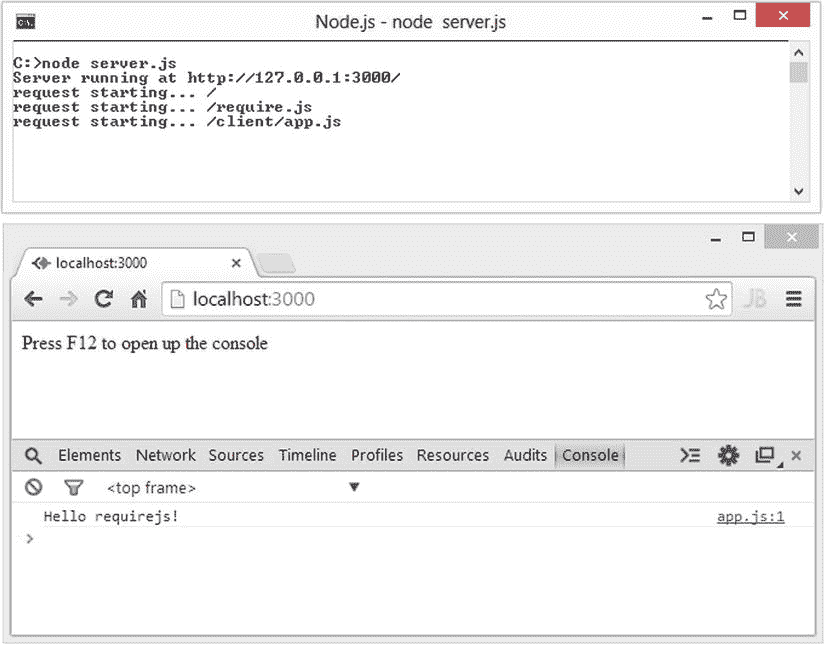
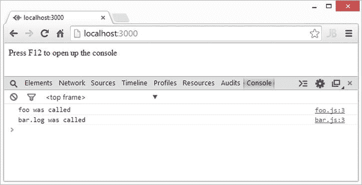
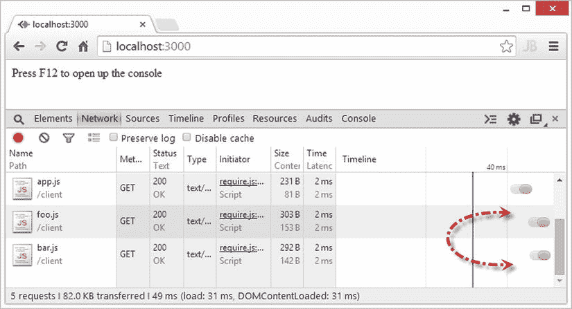
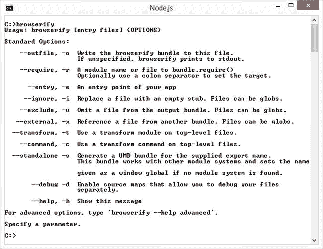
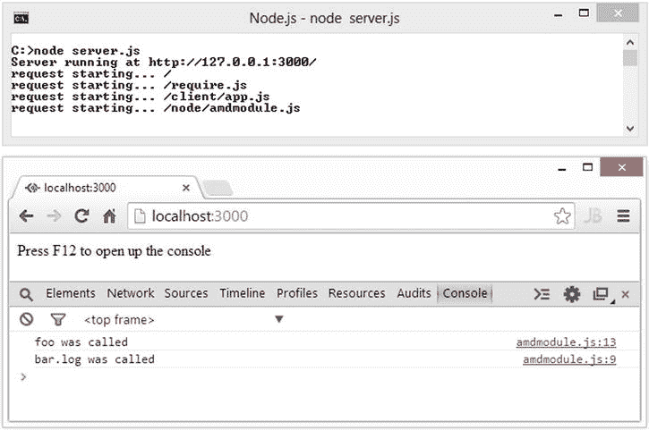

# 三、核心 Node.js

Node.js 附带了许多内置模块，这些模块提供了一组我们可以构建的核心特性。在这一章中，我们将展示 Node.js 的重要部分，每个认真的开发者都应该熟悉这些部分。Node.js 的伟大之处在于，对于普通开发人员来说，完全了解所有功能的确切方式是完全可能的。

为了成功地交付大型应用并在相当大的团队中工作，我们需要一种封装复杂性的方法。JavaScript 最初被设计成由 web 浏览器以一种简单的方式从上到下读取，并且使用`<script>`标签加载文件。随着越来越大的应用被用 JavaScript 编写，两个模块系统(AMD 和 CommonJS)被开发出来。它们使代码更易于管理和重用。存在两种模式，因为浏览器和服务器在模块加载延迟(网络请求与文件系统)方面提出了不同的挑战。在本章中，我们将讨论这些模式，并展示如何在浏览器中重用 Node.js 代码。

关于本章和其他章节中使用多个文件的代码示例，需要注意的是，示例的主入口点通常按照 Node.js 社区惯例被称为`app.js`。所以您应该能够以`node app.js`的身份运行一个样本。

基于 Node.js 文件的模块系统

Kevin Dongaoor 在 2009 年创建了 CommonJS，目标是为服务器上的 JavaScript 模块指定一个生态系统。Node.js 遵循 CommonJS 模块规范。以下是模块系统的几个要点:

*   每个文件都是它自己的模块。
*   每个文件都可以使用`module`变量访问当前的模块定义。
*   当前模块的输出由`module.exports`变量决定。
*   要导入一个模块，使用全局可用的`require`函数。

和往常一样，最好直接进入代码。让我们考虑一个简单的例子，我们希望与应用的不同部分共享文件`foo.js`中的函数。要从文件中导出函数，我们只需将它分配给`module.exports` ，如[清单 3-1](#list1) 所示。

[清单 3-1](#_list1) 。intro/base/foo.js

```js
module.exports = function () {
    console.log('a function in file foo');
};

```

为了从文件`bar.js`中使用这个函数，我们简单地使用全局可用的`require`函数导入`foo`，并将返回值存储在一个局部变量中，如清单 3-2 中的[所示。](#list2)

[清单 3-2](#_list2) 。intro/base/bar.js

```js
var foo = require('./foo');
foo(); // logs out : "a function in file foo"

```

Node.js 被设计得很简单，这一点在它的模块系统中有所体现。现在我们已经看到了一个简单的例子，让我们从`require`函数开始，更深入地研究各种细节。

Node.js 需要函数

Node.js `require`函数是将模块导入当前文件的主要方法。Node.js 中有三种模块:*核心模块*、*文件模块、*和外部 *node_modules、*，它们都使用`require`函数。我们目前正在讨论文件模块。

当我们使用相对路径进行`require`调用时——例如像`require('./filename')`或`require('../foldername/filename')`——node . js 在一个新的范围内运行目标 JavaScript 文件，并返回该文件中`module.exports`的最终值。这是文件模块的基础。让我们看看这个设计的分支。

Node.js 很安全

许多编程环境中的模块并不安全，并且污染了全局范围。PHP 就是一个简单的例子。假设你有一个文件`foo.php`，它简单地定义了一个函数`foo`，如[清单 3-3](#list3) 所示。

[清单 3-3](#_list3) 。foo.php

```js
function foo($something){
        return $something;
}

```

如果你想在一个文件`bar.php`中重用这个函数，你可以简单地使用`include`函数包含`foo.php`，然后文件`foo.php`中的所有东西都成为`bar.php`的(全局)作用域的一部分。这允许您使用函数`foo`，如清单 3-4 中的[所示。](#list4)

[清单 3-4](#_list4) 。在 PHP 中包含函数

```js
include('foo.php');
foo();

```

这个设计有很多负面影响。例如，变量`foo`在当前文件中的含义可能会根据您导入的内容而改变。因此，如果两个文件`foo1`和`foo2`有可能有同名的变量，那么您就不能安全地包含这两个文件。另外，*所有的*都被导入，所以在一个模块中不能只有局部变量。您可以在 PHP 中使用名称空间来解决这个问题，但是 Node.js 完全避免了名称空间污染的可能性。

使用`require`函数只给你一个`module.exports`变量，你需要在本地将结果赋给一个变量，以便在作用域内使用它，如[清单 3-5](#list5) 所示。

[清单 3-5](#_list5) 。显示您控制名称的代码段

```js
var yourChoiceOfLocalName = require('./foo');

```

没有偶然的全局范围—有显式名称和具有相似内部局部变量名的文件可以和平共存。

有条件地加载模块

`require`的行为就像 JavaScript 中的任何其他函数一样。它没有特殊的属性。这意味着你可以根据某些条件选择调用它，因此只有在你需要的时候才加载模块，如清单 3-6 所示。

[清单 3-6](#_list6) 。延迟加载模块的代码片段

```js
if(iReallyNeedThisModule){
     var foo = require('./foo');
}

```

这允许您基于您的需求，仅在第一次使用时延迟加载模块。

阻塞

`require`函数阻止进一步的代码执行，直到模块加载完毕。这意味着在模块被加载和执行之前，不会执行`require`调用之后的代码。这允许你避免提供不必要的回调，就像你需要为 Node.js 中的所有异步 I/O 做的那样，这在[第 2 章](02.html)中讨论过。(参见[清单 3-7](#list7) 。)

[清单 3-7](#_list7) 。演示模块同步加载的代码片段

```js
// Blocks execution till module is loaded
var foo = require('./foo');

// Continue execution after it is loaded
console.log('loaded foo');
foo();

```

缓存的

正如你从第二章中所知道的，从文件系统中读取数据比从 RAM 中读取要慢一个数量级。因此，在第一次对特定文件进行`require`调用后，`module.exports`被缓存。下一次调用解析为相同文件的`require`(换句话说，只要目标文件相同，传递给`require`调用的原始相对文件路径是什么并不重要)，目标文件的`module.exports`变量从内存中返回，保持速度。清单 3-8 用一个简单的例子展示了这种速度差异。

[清单 3-8](#_list8) 。intro/cache/bar . js

```js
var t1 = new Date().getTime();
var foo1 = require('./foo');
console.log(new Date().getTime() - t1); // > 0

var t2 = new Date().getTime();
var foo2 = require('./foo');
console.log(new Date().getTime() - t2); // approx 0

```

共享状态

拥有某种在模块间共享状态的机制在各种环境中都很有用。由于模块被缓存，如果我们从模块`foo.js`返回一个对象`foo`，那么`require`的`foo.js`的每个模块将获得相同的(可变的)对象。清单 3-9 用一个简单的例子展示了这个过程，在这个例子中我们导出了一个对象。该对象在`app.js`中被修改，如[清单 3-10](#list10) 所示。这个修改影响了`bar.js`中`require`返回的内容，如[清单 3-11](#list11) 所示。这允许您在模块之间共享内存中的对象，这对于使用模块进行配置是很有用的。清单 3-12 中显示了一个执行示例。

[清单 3-9](#_list9) 。intro/shared/foo.js

```js
module.exports = {
    something: 123
};

```

[清单 3-10](#_list10) 。intro/shared/app.js

```js
var foo = require('./foo');
console.log('initial something:', foo.something); // 123

// Now modify something:
foo.something = 456;

// Now load bar:
var bas = require('./bar');

```

[清单 3-11](#_list11) 。intro/shared/bar.js

```js
var foo = require('./foo');
console.log('in another module:', foo.something); // 456

```

[清单 3-12](#_list12) 。intro/shared/app.js 的运行示例

```js
$ node app.js
initial something: 123
in another module: 456

```

对象工厂

正如我们已经展示的，每次在 Node.js 进程中一个`require`调用解析到同一个文件时，都返回同一个对象。如果您希望每个`require`函数调用都有某种形式的新对象创建机制，那么您可以从返回新对象的源模块中导出一个函数。然后在你的目的地`require`模块并调用这个导入的函数来创建一个新的对象。清单 3-13 中显示了一个例子，我们导出一个函数，然后使用这个函数创建一个新对象，如清单 3-14 中的[所示。](#list14)

[清单 3-13](#_list13) 。intro/factory/foo.js

```js
module.exports = function () {
    return {
        something: 123
    };
};

```

[清单 3-14](#_list14) 。intro/factory/app.js

```js
var foo = require('./foo');

// create a new object
var obj = foo();

// use it
console.log(obj.something); // 123

```

请注意，您甚至可以一步完成此操作(换句话说，`require('./foo')()`；)

Node.js 导出

现在我们对`require`有了更多的了解，让我们更深入地了解一下`module.exports`。

模块.导出

如前所述，Node.js 中的每个文件都是一个模块。我们打算从模块中导出的项目应该附加到`module.exports`变量上。需要注意的是`module.exports`已经在每个文件中被定义为一个新的空对象。也就是说，`module.exports = {}`是隐性存在的。默认情况下，每个模块导出一个空对象，换句话说，`{}`。(参见[清单 3-15](#list15) 。)

[清单 3-15](#_list15) 。intro/module.exports/app.js

```js
console.log(module.exports); // {}

```

出口别名

到目前为止，我们只从一个模块中导出了一个对象。这可以很简单地通过将我们需要导出的对象分配给`module.exports`来完成。然而，从一个模块中导出多个变量是一个常见的需求。实现这一点的一个方法是创建一个新的对象文字并将其赋给`module.exports`，如[清单 3-16](#list16) 所示。

[清单 3-16](#_list16) 。intro/exports/foo1.js

```js
var a = function () {
    console.log('a called');
};

var b = function () {
    console.log('b called');
};

module.exports = {
    a: a,
    b: b
};

```

然而，这有点难以管理，因为模块*返回的内容*可能与模块*包含的内容*相差甚远。在[清单 3-16](#list16) 中，函数`a`的定义比我们实际将其导出到外部世界的时间要早得多。所以一个常见的惯例是简单地将我们想要导出的对象内联到`module.exports`，如[清单 3-17](#list17) 所示。这是可能的，因为`module.exports`被 Node.js 隐式设置为`{}`，正如我们在前面的[清单 3-15](#list15) 中看到的。

[清单 3-17](#_list17) 。intro/exports/foo2.js

```js
module.exports.a = function () {
    console.log('a called');
};

module.exports.b = function () {
    console.log('b called');
};

```

然而，一直输入`module.exports`也变得很麻烦。因此 Node.js 通过为`module.exports`创建一个别名`exports`来帮助我们，所以不用每次都键入`module.exports.something`，你可以简单地使用`exports.something`。这显示在[清单 3-18](#list18) 中。

[清单 3-18](#_list18) 。intro/exports/foo3.js

```js
exports.a = function () {
    console.log('a called');
};

exports.b = function () {
    console.log('b called');
};

```

需要注意的是`exports`就像任何其他 JavaScript 变量一样；Node.js 只是为我们做了`exports = module.exports`。如果我们添加一些东西，例如，`foo`到`exports`，也就是`exports.foo = 123`，我们实际上是在做`module.exports.foo = 123`，因为 JavaScript 变量是引用，正如在[第 2 章](02.html)中讨论的。

但是，如果你做了`exports = 123`，就断了对`module.exports`的引用；即`exports`不再指向`module.exports`。同样，它也不做`module.exports = 123`。所以，知道应该只使用`exports`别名给 *attach* stuff 而不直接给它赋值是很重要的。如果您想分配一个导出，使用`module.exports =`,就像我们在本节之前一直做的那样。

最后，你可以运行[清单 3-19](#list19) 中所示的代码样本来证明所有这些方法从消费(导入)的角度来看是等价的。

[清单 3-19](#_list19) 。intro/export/app . js

```js
var foo1 = require('./foo1');
foo1.a();
foo1.b();

var foo2 = require('./foo2');
foo2.a();
foo2.b();

var foo3 = require('./foo3');
foo3.a();
foo3.b();

```

模块最佳实践

现在我们已经了解了基于 Node.js 文件的模块系统背后的技术，让我们来看看社区遵循的一些最佳实践。Node.js 和 JavaScript 对编程错误具有很强的弹性，并努力保持灵活性，这就是为什么有各种各样的工作方式。但是，您应该遵循一些约定，我们强调了社区中常见的一些约定。

不要使用。js 扩展

最好是做`require('./foo')`而不是`require('./foo.js')`，尽管两者对 Node.js 都很好。

**原因:**对于基于浏览器的模块系统(比如 RequireJS，我们将在本章后面讨论)，假设您没有提供`.js`扩展，因为我们无法查看服务器文件系统来理解您的意思。为了保持一致，避免添加。js 扩展在你所有的`require`调用中。

相对路径

在使用基于文件的模块时，需要使用相对路径(换句话说，用`require('./foo')`代替`require('foo')`)。

**原因:**非相对路径是为核心模块和 node_modules 预留的。我们在本章讨论核心模块，在下一章讨论 node_modules。

利用出口

当您想要导出多个内容时，尝试使用`exports`别名。

**原因:**它使*输出的*接近其*定义*。对于你导出的每一个东西都有一个本地变量也是一个惯例，这样你就可以很容易地在本地使用它。在一行中完成所有这些，如清单 3-20 所示。

[清单 3-20](#_list20) 。创建一个局部变量并导出

```js
var foo = exports.foo = /* whatever you want to export as `foo` from this module */ ;

```

导出整个文件夹

如果你有太多的模块放在一起，你一直在导入到其他文件中，尽量避免重复导入，如清单 3-21 所示。

[清单 3-21](#_list21) 。避免重复巨大的导入块

```js
var foo = require('../something/foo');
var bar = require('../something/bar');
var bas = require('../something/bas');
var qux = require('../something/qux');

```

相反，在`something`文件夹中创建一个单独的`index.js`。在`index.js`中，一次性导入所有模块，然后从该模块中导出，如[清单 3-22](#list22) 所示。

[清单 3-22](#_list22) 。index.js 示例

```js
exports.foo = require('./foo');
exports.bar = require('./bar');
exports.bas = require('./bas');
exports.qux = require('./qux');

```

现在，只要您需要所有这些东西，就可以简单地导入这个`index.js`:

```js
var something = require('../something/index');

```

**理由:**更易维护。在导出方面，单个模块(单个文件)仍然较小——您不需要将所有内容都放在一个文件中，这样您就可以轻松地将它导入到其他地方。你只需要创建一个`index.js`文件。在导入方面，您需要编写(和维护)更少的`require`调用。

重要的全局

Node.js 提供了大量全局可用的实用变量。这些变量中有些是真正的全局变量(在所有模块之间共享)，有些是局部全局变量(特定于当前模块的变量)。我们已经看到了几个真正的全局变量的例子，即`require`函数。我们已经看到了一些模块级隐式定义的变量— `module`(由`module.exports`使用)和`exports`。让我们检查几个更重要的全局变量。

控制台

`console`是可用的最有用的全局变量之一。因为从命令行启动和重新启动 Node.js 应用非常容易，所以当您需要调试应用时，控制台在快速显示应用中发生的情况方面起着重要作用。为了同样的目的，我们在整个例子中使用了`console.log`。`console`有更多的 o 函数，我们将在[第 11 章](11.html)中讨论。

计时器

我们之前在[第二章](02.html)中讨论 Node.js 事件循环时已经看到过`setTimeout`。它设置了一个在指定的延迟时间(毫秒)后调用的函数。请注意，此延迟是调用指定函数之前的最小间隔。它被调用的实际持续时间取决于 JavaScript 线程的可用性，正如我们在第二章的[中关于线程饥饿的章节中看到的。它还取决于操作系统何时调度 Node.js 进程执行(通常这不是问题)。清单 3-23](02.html) 中的[显示了一个`setTimeout`的快速示例，它在 1000 毫秒(换句话说，一秒)后调用一个函数。](#list23)

[清单 3-23](#_list23) 。globals/timers/setTimeout.js

```js
setTimeout(function () {
    console.log('timeout completed');
}, 1000);

```

与`setTimeout`功能类似的是`setInterval`功能。`setTimeout`仅在指定的持续时间后执行一次回调函数*。但是`setInterval`在*之后重复调用回调，每次*经过指定的持续时间。这显示在清单 3-24 中，我们每秒钟打印出`second passed`。与`setTimeout`类似，根据 JavaScript 线程的可用性，实际持续时间可能会超过指定值。*

[清单 3-24](#_list24) 。globals/timers/setInterval.js

```js
setInterval(function () {
    console.log('second passed');
}, 1000);

```

`setTimeout`和`setInterval`都返回一个对象，该对象可用于使用`clearTimeout` / `clearInterval`函数清除超时/间隔。清单 3-25 演示了如何使用`clearInterval`在五秒钟内每秒调用一个函数，然后清除应用退出的间隔。

[清单 3-25](#_list25) 。globals/timers/clear interval . js

```js
var count = 0;
var intervalObject = setInterval(function () {
    count++;
    console.log(count, 'seconds passed');
    if (count == 5) {
        console.log('exiting');
        clearInterval(intervalObject);
    }
}, 1000);

```

_ _ 文件名和 _ _ 目录名

这些变量在每个文件中都可用，并为您提供当前模块的文件和目录的完整路径。完整路径意味着它们包括所有内容，直到该文件所在的当前驱动器的根目录。使用[清单 3-26](#list26) 中的代码来查看当你将文件移动到文件系统的不同位置并运行它时这些值的变化。

[清单 3-26](#_list26) 。globals/fileAndDir/app.js

```js
console.log(__dirname);
console.log(__filename);

```

过程

`process`是 Node.js 提供的最重要的全局变量之一。除了我们将在下一节讨论的一些有用的成员函数和属性之外，它还是一些关键事件的来源，我们将在[第 5 章](05.html)中更深入地研究这些事件。

命令行参数

由于 Node.js 没有传统 C/C++/JAVA/C#意义上的 main 函数，所以使用`process`对象来访问命令行参数。参数作为成员属性`process.argv`可用，它是一个数组。第一个元素是`node`(即Node可执行文件)，第二个元素是传入 Node.js 以启动进程的 JavaScript 文件的名称，剩下的元素是命令行参数。作为一个例子，考虑一个简单的文件`argv.js`，它简单地将这些记录到控制台，如清单 3-27 中的[所示。如果您以`node argv.js foo bar bas`的身份运行它，您将得到类似于](#list27)[清单 3-28](#list28) 中所示的输出。

[清单 3-27](#_list27) 。全局/流程/argv.js

```js
// argv.js
console.log(process.argv);

```

[清单 3-28](#_list28) 。argv.js 的示例输出

```js
 ['node',
  '/path/to/file/on/your/filesystem/argv.js',
  'foo',
  'bar',
  'bas']

```

在 Node.js 中，有一些优秀的库可以以有意义的方式处理命令行参数。在下一章学习 NPM 时，我们将研究一个这样的库。

process.nextTick

`process.nextTick`是一个采用回调函数的简单函数。它用于将回调放入 Node.js 事件循环的下一个循环中。它被设计得非常高效，并且被许多 Node.js 核心库使用。它的用法简单到足以演示，清单 3-29 中给出了一个例子。该示例的输出如清单 3-30 中的[所示。](#list30)

[清单 3-29](#_list29) 。globals/process/nexttick.js

```js
// nexttick.js
process.nextTick(function () {
    console.log('next tick');
});
console.log('immediate');

```

[清单 3-30](#_list30) 。nexttick.js 输出示例

```js
immediate
next tick

```

如您所见，立即调用首先执行，而`nextTick`回调在事件循环的下一次运行中执行。您应该知道此函数的原因是，由于 Node.js 的异步特性，此函数通常会出现在调用堆栈中，因为这将是 Node.js 事件循环的起点。这个函数之前的都是 c，调用栈中这个函数之后的都是 JavaScript。

缓冲器

缓冲世界！纯 JavaScript 非常适合 Unicode 字符串。然而，为了处理 TCP 流和文件系统，开发人员添加了本地和快速支持来处理二进制数据。开发人员在 Node.js 中使用全球通用的`Buffer`类实现了这一点。

作为一名从事应用开发的 Node.js 开发人员，您与 buffer 的主要交互很可能是将`Buffer`实例转换为`string`，或者将字符串转换为`Buffer`实例。为了进行这两种转换，您需要告诉`Buffer`类每个字符在字节中的含义。这些信息被称为字符编码。Node.js 支持所有流行的编码格式，如 ASCII、UTF 8 和 UTF-16。

将字符串转换成缓冲区非常简单。你只需调用`Buffer`类构造函数(参见第 2 章中[的原型讨论来回顾 JavaScript 中的类)传入一个字符串和一个编码。将一个`Buffer`实例转换成一个字符串也同样简单。您调用缓冲区实例的`toString`方法，传递一个编码方案。这两者都在清单 3-31](02.html) 中进行了演示。

[清单 3-31](#_list31) 。全局/缓冲区/缓冲区. js

```js
// a string
var str = "Hello Buffer World!";

// From string to buffer
var buffer = new Buffer(str, 'utf-8');

// From buffer to string
var roundTrip = buffer.toString('utf-8');
console.log(roundTrip); // Hello

```

全球的

变量`global`是我们在 Node.js 中的全局名称空间的句柄，如果你熟悉前端 JavaScript 开发，这有点类似于`window`对象。我们见过的所有真正的全局变量(`console`、`setTimeout`和`process`)都是`global`变量的成员。你甚至可以在全局变量中添加成员，使其随处可用，如清单 3-32 所示。这使得变量`something`随处可用的事实在[清单 3-33](#list33) 中得到证明。

[清单 3-32](#_list32) 。globals/global/addToGlobal.js

```js
global.something = 123;

```

[清单 3-33](#_list33) 。全球/全球/app.js

```js
console.log(console === global.console); // true
console.log(setTimeout === global.setTimeout); // true
console.log(process === global.process); // true

// Add something to global
require('./addToGlobal');
console.log(something); // 123

```

尽管您可以向 global 添加成员，但我们强烈建议不要这样做。原因是它使得知道一个特定的变量来自哪里变得极其困难。模块系统的设计使得大型代码库的分析和维护变得容易。到处都是全局变量是不可维护、不可伸缩或不可重用的。然而，知道这样做是有用的，更重要的是，作为库开发人员，您可以按照自己喜欢的方式扩展 Node.js。

核心模块

Node.js 的设计理念是提供一些经过实战检验的核心模块，并让社区在这些模块的基础上提供高级功能。在本节中，我们将研究几个重要的核心模块。

消耗核心模块

消费核心模块与消费自己编写的基于文件的模块非常相似。你还在用`require`功能。唯一的区别是，您只需为`require`函数指定模块的名称，而不是文件的相对路径。例如，要使用核心的`path`模块，您需要编写一个类似`var path = require('path')`的 require 语句。与基于文件的模块一样，不存在隐式的全局命名空间污染，您得到的是一个自己命名的局部变量来访问模块的内容。例如，在`var path = require('path')`中，我们将它存储在一个名为`path`的局部变量中。现在让我们检查几个核心模块，您应该了解这些模块才能成功使用 Node.js。

路径模块

使用`require('path')`加载该模块。path 模块导出函数，这些函数提供了使用文件系统时常见的有用的字符串转换。使用`path`模块的主要动机是消除处理文件系统路径时的不一致性。例如，`path.join`在 Mac OS X 等基于 UNIX 的系统上使用正斜杠`/`而在 Windows 系统上使用反斜杠` \ '。下面是一些更有用的函数的快速讨论和示例。

path.normalize(str)

这个函数修复了特定于操作系统的斜线。和..并删除重复的斜杠。展示这些特性的一个简单例子如清单 3-34 所示。

[清单 3-34](#_list34) 。core/path/normalize.js

```js
var path = require('path');

// Fixes up .. and .
// logs on Unix: /foo
// logs on Windows: \foo
console.log(path.normalize('/foo/bar/..'));

// Also removes duplicate '//' slashes
// logs on Unix: /foo/bar
// logs on Windows: \foo\bar
console.log(path.normalize('/foo//bar/bas/..'));

```

path.join([str1]，[str2]，…)

考虑到操作系统，该函数将任意数量的路径连接在一起。清单 3-35 中显示了一个示例。

[清单 3-35](#_list35) 。核心/路径/连接. js

```js
var path = require('path');

// logs on Unix: foo/bar/bas
// logs on Windows: foo\bar\bas
console.log(path.join('foo', '/bar', 'bas'));

```

dirname、basename 和 extname

这些函数是路径模块中最有用的三个函数。`path.dirname`给出特定路径字符串的目录部分(独立于操作系统)，而`path.basename`给出文件的名称。`path.extname`给你文件扩展名。这些功能的一个例子如清单 3-36 所示。

[清单 3-36](#_list36) 。核心/路径/目录 _ 基本 _ 扩展. js

```js
var path = require('path');

var completePath = '/foo/bar/bas.html';

// Logs : /foo/bar
console.log(path.dirname(completePath));

// Logs : bas.html
console.log(path.basename(completePath));

// Logs : .html
console.log(path.extname(completePath));

```

现在你应该对如何使用`path`以及它的设计目标有所了解。Path 还有一些其他有用的函数，您可以使用 Node.js 官方文档(`http://nodejs.org/api/path.html`)在线探索。

fs 模块

`fs`模块提供了对文件系统的访问。使用`require('fs')`加载该模块。`fs`模块具有重命名文件、删除文件、读取文件和写入文件的功能。在清单 3-37 中显示了一个简单的写入和读取文件系统的例子。

[清单 3-37](#_list37) 。core/fs/create.js

```js
var fs = require('fs');

// write
fs.writeFileSync('test.txt', 'Hello fs!');

// read
console.log(fs.readFileSync('test.txt').toString());

```

关于`fs`模块的一个伟大的事情是它有异步和同步功能(使用`-Sync`后缀)来处理文件系统。例如，要删除一个文件，你可以使用`unlink`或`unlinkSync`。同步版本如[清单 3-38](#list38) 所示，相同代码的异步版本如[清单 3-39](#list39) 所示。

[清单 3-38](#_list38) 。core/fs/deleteSync.js

```js
var fs = require('fs');
try {
    fs.unlinkSync('./test.txt');
    console.log('test.txt successfully deleted');
}
catch (err) {
    console.log('Error:', err);
}

```

[清单 3-39](#_list39) 。核心/fs/delete.js

```js
var fs = require('fs');
fs.unlink('./test.txt', function (err) {
    if (err) {
        console.log('Error:', err);
    }
    else {
        console.log('test.txt successfully deleted');
    }
});

```

主要区别在于异步版本接受回调，如果有错误对象的话，就向其传递错误对象。我们在第 2 章中讨论了使用回调和错误参数的错误处理惯例。

我们在[第 2 章](02.html)中也看到，访问文件系统比访问 RAM 慢一个数量级。访问文件系统会同步阻塞 JavaScript 线程，直到请求完成。在繁忙的流程中，例如在 web 服务器场景中，最好尽可能使用异步函数。

关于`fs`模块的更多信息可以在 Node.js 官方文档(`http://nodejs.org/api/fs.html`)中在线找到。

操作系统模块

`os`模块提供了一些基本的(但至关重要的)操作系统相关的实用函数和属性。您可以使用`require('os')`调用来访问它。例如，如果我们想知道当前的系统内存使用情况，我们可以使用`os.totalmem()`和`os.freemem()`函数。这些在[清单 3-40](#list40) 中进行了演示。

[清单 3-40](#_list40) 。core/os/memory.js

```js
var os = require('os');
var gigaByte = 1 / (Math.pow(1024, 3));
console.log('Total Memory', os.totalmem() * gigaByte, 'GBs');
console.log('Available Memory', os.freemem() * gigaByte, 'GBs');
console.log('Percent consumed', 100 * (1 - os.freemem() / os.totalmem()));

```

由`os`模块提供的一个重要功能是关于可用 CPU 数量的信息，如[清单 3-41](#list41) 所示。

[清单 3-41](#_list41) 。core/OS/CPU . js

```js
var os = require('os');
console.log('This machine has', os.cpus().length, 'CPUs');

```

当我们讨论可伸缩性时，我们将在第 13 章中学习如何利用这一事实。

实用程序模块

`util`模块包含许多有用的通用函数。您可以使用`require('util')`调用来访问`util`模块。要用时间戳将一些东西注销到控制台*，可以使用`util.log`函数，如[清单 3-42](#list42) 所示。*

[清单 3-42](#_list42) 。core/util/log.js

```js
var util = require('util');
util.log('sample message'); // 27 Apr 18:00:35 - sample message

```

另一个非常有用的特性是使用`util.format`函数进行字符串格式化。这个函数类似于 C/C++ `printf`函数。第一个参数是包含零个或多个*占位符*的字符串。然后，根据占位符的含义，使用剩余的参数替换每个占位符。流行的占位符是`%s`(用于字符串)和`%d`(用于数字)。这些在[清单 3-43](#list43) 中进行了演示。

[清单 3-43](#_list43) 。核心/实用程序/格式. js

```js
var util = require('util');
var name = 'nate';
var money = 33;

// prints: nate has 33 dollars
console.log(util.format('%s has %d dollars', name, money));

```

另外，`util`有几个函数来检查某个东西是否属于特定类型(`isArray`、`isDate`、`isError`)。这些功能在[清单 3-44](#list44) 中进行了演示。

[清单 3-44](#_list44) 。core/util/isType.js

```js
var util = require('util');
console.log(util.isArray([])); // true
console.log(util.isArray({ length: 0 })); // false

console.log(util.isDate(new Date())); // true
console.log(util.isDate({})); // false

console.log(util.isError(new Error('This is an error'))); // true
console.log(util.isError({ message: 'I have a message' })); // false

```

在浏览器中重用 Node.js 代码

在我们学习如何在浏览器中重用 Node.js 代码之前，我们需要学习更多关于各种模块系统的知识。我们需要了解 AMD 的需求，以及它与 CommonJS 的区别。

AMD 简介

正如我们在本章开始时讨论的，Node.js 遵循 CommonJS 模块规范。当我们可以直接访问文件系统时，这个模块系统对服务器环境非常有用。我们第一次讨论了从 Node.js 中的文件系统加载模块是一个阻塞调用。考虑加载两个模块的简单情况，如清单 3-45 所示。

[清单 3-45](#_list45) 。显示使用 CommonJS 加载两个模块的代码片段

```js
var foo = require('./foo');
var bar = require('./bar');
// continue code here

```

在这个例子中，直到所有的`foo.js`都被加载后`bar.js`才被解析。事实上，Node.js 甚至不知道您将需要`bar.js`，直到`foo.js`被加载并且行`require('./bar')`被解析。在服务器环境中，这种行为是可以接受的，因为它被视为应用引导过程的一部分。在启动服务器时，您通常需要一些东西，然后这些东西会从内存中返回。

然而，如果在浏览器中使用相同的模块系统，每个`require`语句将需要触发一个到服务器的 HTTP 请求。这比文件系统访问调用慢一个数量级，并且不太可靠。加载大量模块会迅速降低用户在浏览器中的体验。解决方案是异步、并行和提前加载模块。为了支持这种异步加载，我们需要一种方式来声明这个文件将依赖于前面的`./foo`和`./bar`，并使用回调来继续执行代码。已经有一个专门的规范叫做异步模块定义(AMD) 。AMD 格式的[清单 3-45](#list45) 中的相同示例显示在[清单 3-46](#list46) 中。

[清单 3-46](#_list46) 。显示使用 AMD 加载两个模块的代码片段

```js
define(['./foo', './bar'], function(foo, bar){
        // continue code here
});

```

`define`函数不是浏览器自带的。这些必须由第三方库提供。其中最受浏览器欢迎的是 RequireJS ( `http://requirejs.org/`)。

再次重申，浏览器与服务器启动有不同的延迟要求。这使得以异步方式加载模块需要不同的语法。require 调用的不同性质使得在浏览器中重用 Node.js 代码稍微复杂一些。在我们深入研究之前，让我们设置一个 RequireJS 引导应用。

设置要求 j

因为我们需要为 web 浏览器提供 HTML 和 JavaScript，所以我们需要创建一个基本的 web 服务器。我们将使用 Chrome 作为我们的首选浏览器，因为它可以在所有平台上使用，并且拥有出色的开发工具支持。这个示例的源代码可以在`chapter3/amd/base`文件夹中找到。

启动网络服务器

我们将使用`server.js`，这是一个非常基本的 HTTP web 服务器，我们将在[第 6 章](06.html)中自己编写。使用 Node.js ( `node server.js`)启动服务器。服务器将开始在端口 3000 上侦听来自浏览器的传入请求。如果你访问`http://localhost:3000`，服务器将尝试从与`server.js`相同的文件夹中提供`index.html`，如果它可用的话。

下载要求

可以从官方网站(`http://requirejs.org/docs/download.html`)下载 RequireJS。它是一个简单的 JavaScript 文件，可以包含在项目中。它已经存在于`chapter3/amd/base`文件夹中。

自举要求

在与`server.js`相同的文件夹中创建一个简单的`index.html`，内容如[列表 3-47](#list47) 所示。

[清单 3-47](#_list47) 。amd/base/index.html

```js
<html>
<script
    src="./require.js"
    data-main="./client/app">
</script>
<body>
    <p>Press Ctrl + Shift + J (Windows) or Cmd + Opt + J (MacOSX) to open up the console</p>
</body>
</html>

```

我们有一个简单的脚本标签来加载`require.js`。当 RequireJS 加载时，它查看加载了 RequireJS 的脚本标签上的`data-main`属性，并将其视为应用入口点。在我们的例子中，我们将`data-main`属性设置为`./client/app`，因此 RequireJS 将尝试加载`http://localhost:3000/client/app.js`。

客户端应用入口点

当我们设置 RequireJS 来加载`/client/app.js`时，让我们创建一个`client`文件夹，并在该文件夹中创建一个`app.js`,它只是将一些东西记录到控制台，如[清单 3-48](#list48) 所示。

[清单 3-48](#_list48) 。amd/base/client/app.js

```js
console.log('Hello requirejs!');

```

现在，如果你打开浏览器`http://localhost:3000`并打开开发工具(按 F12)，你应该看到记录到控制台的消息，如图 3-1 所示。



[图 3-1](#_Fig1) 。基本 AMD 样本

这是设置 RequireJS 的基础。该设置将用于本节的剩余演示。你只需要复制这个`server.js + index.html + require.js + client/app.js`组合，开始随心所欲的黑客攻击。

RequireJS 有更多的配置选项，我们鼓励您浏览在线提供的 API 文档。

玩 AMD

现在我们知道了如何启动一个 RequireJS 浏览器应用，让我们看看如何在模块中导入/导出变量。我们将创建三个模块:`app.js`、`foo.js`和`bar.js`。我们将使用 AMD 的`app.js`中的`foo.js`和`bar.js`。该演示可在`chapter3/amd/play`文件夹中获得。

要从一个模块中导出某些东西，你可以简单地从`define`回调中返回它。例如，让我们创建一个导出简单函数的文件`foo.js`，如清单 3-49 中的[所示。](#list49)

[清单 3-49](#_list49) 。amd/play/客户端/foo.js

```js
define([], function () {
    var foo = function () {
        console.log('foo was called');
    };
    return foo; // function foo is exported
});

```

坦率地说，我们需要一个文件中的所有模块，文件的根包含一个对`define`的调用。要将`app.js`中的模块`./foo`和`./bar`加载到同一个文件夹中，定义调用如[清单 3-50](#list50) 所示。

[清单 3-50](#_list50) 。amd/play/client/app.js

```js
define(['./foo', './bar'], function (foo, bar) {
        // use foo and bar here
});

```

`define`可以接受一个名为`exports`的特殊参数，其行为类似于 Node.js 中的`exports`变量。让我们使用这个语法创建模块`bar.js`，如[清单 3-51](#list51) 所示。

[清单 3-51](#_list51) 。amd/play/client/bar.js

```js
define(['exports'], function (exports) {
    var bar = exports.log = function () {
        console.log('bar.log was called');
    };
});

```

请注意，您只能使用`exports`来附加您想要导出的变量(例如，`exports.log = /*something*/),`),但是您不能将它分配给其他变量(`exports = /*something*/`),因为那样会破坏由 RequireJS 监控的`exports`变量的引用。这在概念上与 Node.js 中的`exports`变量非常相似。现在，让我们完成`app.js`并使用这两个模块，如[清单 3-52](#list52) 所示。

[清单 3-52](#_list52) 。amd/play/client/app.js

```js
define(['./foo', './bar'], function (foo, bar) {
    foo();
    bar.log();
});

```

如果您运行这个应用，您将得到如图 3-2 所示的期望结果。



[图 3-2](#_Fig2) 。app.js 中使用的 foo 和 bar

当我们查看 chrome 调试工具中的网络选项卡时，对模块使用这种替代(AMD)语法的真正好处变得显而易见，如图 3-3 中的[所示。](#Fig3)



[图 3-3](#_Fig3) 。基本 AMD 样本

可以看到`foo.js`和`bar.js`一下载完`app.js`就并行下载了，RequireJS 发现`app.js`因为调用`define`需要`foo.js`和`bar.js`才能发挥作用。

关于 AMD 的更多信息

以下是一些关于 AMD 的有用且有趣的事实，您应该了解这些事实以完善您的知识:

*   模块被缓存。这与 Node.js 中缓存模块的方式类似，即每次都返回相同的对象。
*   许多要定义的参数都是可选的，并且有各种方式来配置如何在 RequireJS 中扫描模块。
*   您仍然可以使用一个`require`调用来有条件地加载特定的模块，这是 RequireJS 提供的另一个功能，如[清单 3-53](#list53) 所示。这个函数也是异步的，不同于`require`的 Node.js 版本。

[清单 3-53](#_list53) 。展示如何在 AMD 中有条件地加载模块的代码片段

```js
define(['./foo', './bar'], function(foo, bar){
        if(iReallyNeedThisModule){
                require(['./bas'], function(bas){
                        // continue code here.
                });
        }
});

```

这里的目标是给出如何使用 RequireJS 的快速概述，并理解浏览器不同于 Node.js。

将 Node.js 代码转换为浏览器代码

正如您所看到的，浏览器模块系统(AMD)和 Node.js 模块系统(CommonJS)之间存在显著的差异。然而，好消息是 Node.js 社区已经开发了许多工具来获取您的 CommonJS / Node.js 代码，并将其转换为与 AMD / RequireJS 兼容。最常用的(也是其他工具依赖的)是 Browserify ( `http://browserify.org/`)。

Browserify 是一个命令行工具，作为 NPM 模块提供。NPM 模块将在下一章详细讨论。现在，只要知道如果你按照第一章中的说明安装了 Node.js，你就已经有 npm 可用了。要在命令行工具上安装 Browserify，只需执行清单 3-54 中的命令。(注意:在 Mac OS X 上，你需要以 root 用户身份运行它(`sudo npm install –g browserify`)。

[清单 3-54](#_list54) 。安装浏览器

```js
npm install -g browserify

```

这将在全局范围内安装 Browserify(这个概念将在下一章中变得清晰),并使它在命令行上进一步可用。现在，如果您运行 browserify，您应该会看到如图[图 3-4](#Fig4) 所示的输出，表明安装成功。



[图 3-4](#_Fig4) 。在命令提示符下使用 browser ify

使用 browserify 最常见的方法是为 Node.js 模块指定一个入口点，并使用–o(`--outfile`)参数将该文件及其所有依赖文件转换为一个 AMD 兼容文件。和往常一样，让我们开始演示，获得一些实际操作经验。

浏览器验证演示

在本节中，我们将创建几个简单的 Node.js 模块，然后使用 Browserify 将它们转换为 AMD 语法并在浏览器中运行。这个例子的所有代码都在`chapter3/amd/browserify`文件夹中。

首先，我们将创建三个遵循 Node.js / CommonJS 模块规范的文件(代码在`chapter3/amd/browserify/node`文件夹中)。我们正在使用来自使用 CommonJS 的`app.js` ( [清单 3-57](#list57) )的`foo.js` ( [清单 3-55](#list55) )和`bar.js` ( [清单 3-56](#list56) )。您可以在 Node.js 中运行这段代码，看看它是否按预期工作。

[清单 3-55](#_list55) 。amd/browserify/node/foo.js

```js
module.exports = function () {
    console.log('foo was called');
}

```

[清单 3-56](#_list56) 。amd/browserify/node/bar.js

```js
exports.log = function () {
    console.log('bar.log was called');
}

```

[清单 3-57](#_list57) 。amd/browserify/node/app.js

```js
var foo = require('./foo');
var bar = require('./bar');

foo();
bar.log();

```

现在让我们转换这段代码，使它成为一个 AMD 兼容的模块。在命令行上，运行如清单 3-58 所示的命令。

[清单 3-58](#_list58) 。将 app.js 转换为 AMD 模块的命令行参数

```js
browserify app.js -o amdmodule.js

```

这会将`app.js`及其所有依赖项(`foo.js`和`bar.js`)转换成同一个文件夹中的单个 AMD 兼容模块`amdmodule.js`。最后一步，我们简单地从我们的客户端`app.js` ( [清单 3-59](#list59) )加载这个模块，以显示它可以在浏览器中工作。

[清单 3-59](#_list59) 。amd/browserify/client/app.js

```js
define(['../node/amdmodule'], function (amdmodule) {
});

```

现在如果我们启动服务器(server.js)并打开网页浏览器(`http://localhost:3000`)，你会在 chrome 开发工具中看到`console.log`消息，如图[图 3-5](#Fig5) 所示。我们已经成功地将 Node.js 代码移植到浏览器中。



[图 3-5](#_Fig5) 。在浏览器中重用 Node.js/CommonJS 代码

需要注意的一点是，不可能将每个 Node.js 模块的*都转换成浏览器模块。具体来说，依赖于只在服务器上可用的特性(如文件系统)的 Node.js 模块在浏览器中无法工作。*

Browserify 有很多选项，也能够导航 NPM 包(`node_modules`)。您可以在`http://browserify.org/`在线了解 Browserify 的更多信息。

摘要

在本章中，我们讨论了一些重要的可维护性主题，为了成为一名成功的 Node.js 开发人员，您应该了解这些主题。我们仔细观察了`require` / `module.exports`的组合，让您对 Node.js 模块的原理及其简单性有了一个牢固的理解。然后我们讨论了几个核心的内置 Node.js 模块。(当我们了解事件、流和特定领域(如 TCP/HTTP)时，我们将更多地了解这些核心模块。)最后，我们讨论了 AMD 和 CommonJS 的区别，以及如何在浏览器中重用 Node.js 代码。

在下一章，我们将讨论 Node.js 的伟大之处之一——它的开源生态系统。开源 Node.js 项目包中有很多可用的包，我们将向您展示如何使用 NPM 来利用它们。