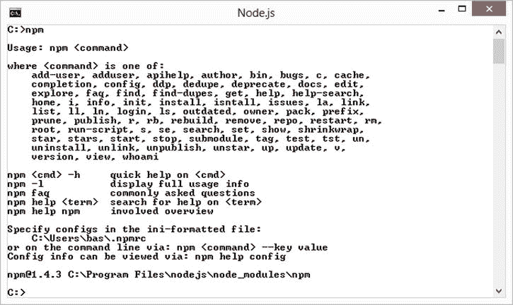
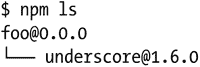
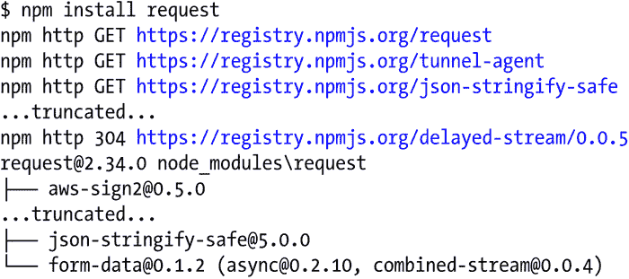
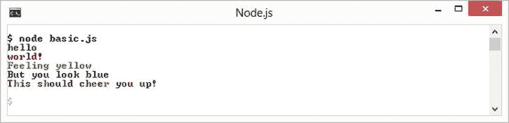

# 四、Node.js 包

任何可以用 JavaScript 编写的应用最终都会用 JavaScript 编写。

—杰夫·阿特伍德的《阿特伍德定律》

正如我们在第 3 章中看到的，core Node.js 并没有提供大量的库。这是有充分理由的。将某些东西作为 core Node.js 的一部分发布可能会扼杀竞争和思想的发展。因此，core Node.js 试图限制它包含的内容，并依赖开源社区来描绘完整的画面。让开源社区找到问题 X 的最佳解决方案比开出万能的解决方案要好。

JavaScript 开发人员的数量比任何其他编程语言都多。此外，越来越多的人正在编写越来越多的库来完成浏览器中的任何给定任务，所有这些工作都可以在应用中使用。

为了方便在应用中使用第三方 JavaScript 库，Node.js 自带了一个名为*Node Package Manager*(NPM)*的包管理系统。*在本章中，我们将讨论如何在我们的应用中使用 NPM 包。我们将讨论每个 Node.js 开发人员都应该知道的几个重要问题。我们也将把这作为一个实践机会来学习更多关于 JavaScript 如何工作的知识。

重访 Node 模块

在前一章中，我们了解到有三种 Node.js 模块:基于文件的模块、核心模块和外部 node_modules。我们讨论了基于文件的模块和核心模块，现在我们将看看 node_modules *。*为了更好地理解它们，让我们更深入地看看 Node.js `require`函数的文件系统扫描顺序。

*   如果传入 require 函数的模块名带有前缀。/'或'../'或'/'，那么它被认为是一个基于文件的模块，文件被加载，正如我们在第 3 章中看到的[。一些示例调用:`require('./bar)`、`require('../bar/bar')`、`require('/full/path/to/a/node/module/file')`](03.html)
*   否则，我们寻找具有相同名称的核心模块，例如，如果调用是`require('bar')`，则为`'bar'`。如果没有找到与这个名字匹配的核心模块，我们就寻找一个叫做`'bar'`的`node_module`。

扫描 Node 模块

我们先来看一个例子。如果一个文件`/home/ryo/project/foo.js`有一个 require 调用`require('bar')`，Node.js 按照下面的顺序扫描文件系统中的 node_modules。返回找到的第一个`bar.js` 。

*   `/home/ryo/project/` `node_modules/bar.js`
*   `/home/ryo/` `node_modules/bar.js`
*   `/home/` `node_modules/bar.js`
*   `/node_modules/bar.js`

换句话说，Node.js 在当前文件夹中查找`'node_modules/bar.js'`,然后是每个父文件夹，直到它到达当前文件的文件系统树的根，或者直到找到一个`bar.js`。一个简单的例子是模块`foo.js`加载模块`node_modules/bar.js`，如[清单 4-1](#list1) 和[清单 4-2](#list2) 所示。

[清单 4-1](#_list1) 。hello/foo.js

```js
var bar = require('bar');
bar(); // hello node_modules!

```

[清单 4-2](#_list2) 。hello/node_modules/bar.js

```js
module.exports = function () {
    console.log('hello node_modules!');
}

```

如你所见，我们的模块`bar.js`看起来*完全*一样，如果我们只是使用基于文件的模块。这是故意的。基于文件的模块和 node_modules 之间唯一的*区别是*扫描文件系统以加载 JavaScript 文件的方式*。其他所有行为都是一样的。*

基于文件夹的模块

在我们讨论 node_modules 机制的所有优点之前，我们需要学习 Node.js `require`函数支持的最后一个代码组织技巧。几个文件为同一个目标工作的情况并不少见。将这些文件组织到单个模块中是有意义的，该模块可以通过单个 require 调用来加载。我们讨论过将这样的文件组织到一个单独的文件夹中，并在第三章中用一个`index.js`来代表这个文件夹。

这种情况很常见，Node.js 明确支持这种机制。也就是说，如果模块的路径解析为一个文件夹(而不是一个文件)，Node.js 将在该文件夹中查找一个`index.js`文件，并将其作为模块文件返回。这在一个简单的例子(`chapter4/folderbased/indexbased1`)中得到演示，在这个例子中，我们使用一个`index.js`导出两个模块`bar1.js`和`bar2.js`，并在一个模块`foo`中加载模块栏(并隐式地加载`bar/index.js`)，如[清单 4-3](#list3) 所示(运行`node folderbased/indexbased1/foo.js`)。

[清单 4-3](#_list3) 。从文件夹中隐式加载 index.js 的(代码:Folder base/index based 1)

```js
// bar/bar1.js
module.exports = function () {
    console.log('bar1 was called');
}

// bar/bar2.js
module.exports = function () {
    console.log('bar2 was called');
}

// bar/index.js
exports.bar1 = require('./bar1');
exports.bar2 = require('./bar2');

// foo.js
var bar = require('./bar');
bar.bar1();
bar.bar2();

```

如前所述，基于文件的模块和 node_modules 之间唯一的区别是扫描文件系统的方式。因此，对于像`require('./bar')`这样的调用，node_modules 的相同代码将是简单地将`bar`文件夹移动到`node_modules/bar`文件夹中，并将需求调用从`require('./bar')`更改为`require('bar')`。

这个例子存在于`chapter4/folderbased/indexbased2`文件夹中(运行`node folderbased/indexbased2/foo.js`)。由于调用现在解析到`node_modules/bar`文件夹，Node.js 寻找`node_modules/bar/index.js`，既然找到了，那就是为`require('bar')`返回的内容。(参见[清单 4-4](#list4) 。)

[清单 4-4](#_list4) 。从 node_modules/module 文件夹隐式加载 index.js(代码:Folder base/index base 2)

```js
// node_modules/bar/bar1.js
module.exports = function () {
    console.log('bar1 was called');
}

// node_modules/bar/bar2.js
module.exports = function () {
    console.log('bar2 was called');
}

// node_modules/bar/index.js
exports.bar1 = require('./bar1');
exports.bar2 = require('./bar2');

// foo.js
var bar = require('bar'); // look for a node_modules module named bar
bar.bar1();
bar.bar2();

```

node_modules 的 require 调用语义看起来与核心模块完全相同(比较`require('fs')`和`require('bar')`函数调用)。这是故意的。使用 node_modules 时，您会有一种扩展内置 Node.js 功能的感觉。

在使用 node_modules 时，使用基于文件夹的代码组织是一种常见的策略，也是您应该尽可能做的事情。换句话说，如果只需要一个文件，就不要在 node_modules 文件夹中创建顶级 JavaScript 文件。然后，用一个`node_modules/bar/index.js`文件代替`node_modules/bar.js`。

Node 模块的优势

我们现在知道 node_modules 与基于文件的模块是一样的，只是在加载模块 JavaScript 文件时使用了不同的文件系统扫描机制。此时最明显的问题是，“优势是什么？”

简化长文件相对路径

假设您有一个模块`foo/foo.js`，它提供了许多实用程序，您需要在应用的不同地方使用它们。在区段`bar/bar.js`中，你会有一个要求呼叫`require('../foo/foo.js')`，在区段`bas/nick/scott.js`中，你会有一个要求呼叫`require('../../../foo/foo.js')`。此时，您应该问自己:“这个`foo`模块是独立的吗？”如果是这样，这是一个很好的选择，移动到项目文件夹的根目录下的`node_modules/foo/index.js`。这样你可以简化你的调用，在你的代码中只有`require('foo')`。

增加可重用性

如果你想与另一个项目共享一个模块`foo`，你只需要复制`node_modules/foo`到那个项目。事实上，如果你正在处理两个相似的子项目，你可以将`node_modules/foo`移动到包含两个项目的文件夹中，如[清单 4-5](#list5) 所示。这使您更容易从一个地方维护`foo`。

[清单 4-5](#_list5) 。使用共享 node_modules 的子项目代码组织示例

```js
projectroot
   |-- node_modules/foo
   |-- subproject1/project1files
   |-- subproject2/project2files

```

减少副作用

由于 node_modules 的扫描方式，您可以将模块的可用性限制在代码库的特定部分。这允许你安全地进行部分升级，假设你的原始代码组织如清单 4-6 所示。

[清单 4-6](#_list6) 。使用模块 foo 的演示项目

```js
projectroot
   |-- node_modules/foo/fooV1Files
   |-- moduleA/moduleAFiles
   |-- moduleB/moduleBFiles
   |-- moduleC/moduleCFiles

```

现在，当你正在处理一个新模块(比如说`moduleD`)需要模块`foo`的一个新版本(并且向后不兼容)时，你可以简单地组织你的代码，如[清单 4-7](#list7) 所示。

[清单 4-7](#_list7) 。模块 foo 的部分升级

```js
projectroot
   |-- node_modules/foo/fooV1Files
   |-- moduleA/moduleAFiles
   |-- moduleB/moduleBFiles
   |-- moduleC/moduleCFiles
   |-- moduleD
          |-- node_modules/foo/fooV2Files
          |-- moduleDFiles

```

这样，`moduleA`、`moduleB`、`moduleC`继续照常运行，你可以在`moduleD`中使用新版本的`foo`。

克服模块不兼容性

Node.js 不存在许多传统系统中存在的模块依赖性/不兼容性问题。在许多传统的模块系统中，`moduleX`不能与`moduleY`一起工作，因为它们依赖于`moduleZ`的不同(并且不兼容)版本。在 Node.js 中，每个模块可以有自己的 node_modules 文件夹，不同版本的`moduleZ`可以共存。模块不需要*在 Node.js 中*是全局的！

模块缓存和 Node 模块

你可能还记得我们在[第 3 章](03.html)中的讨论，即`require`在第一次调用后缓存一个请求调用的结果。原因是您不需要加载 JavaScript 并从文件系统一次又一次地运行它，从而获得了性能提升。我们说过，每次路径将*解析到同一个文件*时，`require`都返回同一个对象。

正如我们已经展示的，node_modules 只是扫描基于文件的模块的一种不同方式。因此，它们遵循相同的模块缓存规则。如果你有两个文件夹，其中`moduleA`和`moduleB`需要模块 foo，即`require('foo')`，它存在于某个父文件夹中，如[清单 4-8](#list8) 所示，它们得到相同的对象(在给定的例子中从`node_modules/foo/index.js`导出)。

[清单 4-8](#_list8) 。两个模块获得相同的 foo 模块

```js
projectroot
    |-- node_modules/foo/index.js
    |-- moduleA/a.js
    |-- moduleB/b.js

```

然而，考虑一下清单 4-9 中所示的代码组织。这里`moduleB`的`require('foo')`调用将解析到`moduleB/node_modules/foo/index.js`，而`moduleA`的 require 调用将解析到`node_modules/foo/index.js`，因此它们没有得到相同的对象。

[清单 4-9](#_list9) 。模块 A 和 B 得到不同的 foo 模块

```js
projectroot
    |-- node_modules/foo/index.js
    |-- moduleA/a.js
    |-- moduleB
         |-- node_modules/foo/index.js
         |-- b.js

```

这是一件好事，因为我们已经看到，它可以防止你陷入依赖问题。但这种脱节是你应该意识到的。

数据

NPM 使用 JSON 文件来配置模块。在我们深入研究 NPM 之前，让我们先来看看 JSON。

JSON 入门

JSON 是一种用于通过网络传输数据的标准格式。在大多数情况下，它可以被视为 JavaScript 对象文字的子集。它基本上限制了哪些 JavaScript 对象被认为是有效的。JSON 对象使规范更容易实现，并保护用户 免受他们需要担心的边缘情况的影响。在这一节中，我们将从实践的角度来看 JSON。

JSON 规范强制实施的限制之一是，您必须对 JavaScript 对象键使用引号。这允许您避免 JavaScript 关键字不能作为对象文字的键的情况。例如，[清单 4-10](#list10) 中的 JavaScript 在 ECMA 脚本 3(JavaScript 的旧版本)中是一个语法错误，因为`for`是一个 JavaScript 关键字。

[清单 4-10](#_list10) 。旧浏览器(ECMAScript 5 之前)中的无效 JS

```js
var foo = { for : 0 }

```

相反，与所有版本的 JavaScript 兼容的同一个对象的有效表示应该是清单 4-11 中所示的内容。

[清单 4-11](#_list11) 。即使在旧浏览器中也有效(ECMAScript 5 之前)

```js
var foo = { "for" : 0 }

```

此外，JSON 规范限制了给定键的值是 JavaScript 对象的安全子集。值只能是字符串、数字、布尔值(`true`或 fa `lse`)、数组、`null`或其他有效的 JSON 对象。清单 4-12 中的[展示了一个 JSON 对象，展示了所有这些。](#list12)

[清单 4-12](#_list12) 。样本 JSON

```js
{
    "firstName": "John",
    "lastName": "Smith",
    "isAlive": true,
    "age": 25,
    "height_cm": 167.64,
    "address": {
        "streetAddress": "21 2nd Street",
        "city": "New York",
        "state": "NY",
    },
    "phoneNumbers": [
        { "type": "home", "number": "212 555-1234" },
        { "type": "fax", "number": "646 555-4567" }
    ],
    "additionalInfo": null
}

```

`firstName`值是字符串，`age`是数字，`isAlive`是布尔型，`phoneNumbers`是有效 JSON 对象的数组，`additionalInfo`是`null` ，`address`是另一个有效 JSON 对象。这种类型限制的原因是为了简化协议。如果需要将任意 JavaScript 对象作为 JSON 传递，可以尝试将它们序列化/反序列化为一个字符串(常见于日期)或一个数字(常见于枚举)。

另一个限制是最后一个属性不能有多余的逗号。这也是因为旧的浏览器(例如，IE8)对什么是有效的 JavaScript 文字有限制。比如在[清单 4-13](#list13) 中，虽然第一个例子是 Node.js 和现代浏览器中有效的 JavaScript 对象文字，但它不是有效的 JSON。

[清单 4-13](#_list13) 。最后一个值后的尾随命令

```js
// Invalid JSON
{
    "foo": "123",
    "bar": "123",
}
// Valid JSON
{
    "foo": "123",
    "bar": "123"
}

```

重申一下，JSON 基本上只是 JavaScript 对象文字，有一些合理的限制，这些限制只是为了增加实现该规范的便利性，并有助于它作为数据传输协议的普及。

正在 Node.js 中加载 JSON

由于 JSON 是 web 如此重要的一部分，Node.js 已经完全接受它作为一种数据格式，甚至在本地也是如此。可以像加载 JavaScript 模块一样从本地文件系统加载 JSON 对象。每次在模块加载序列中，如果一个`file.js`是*未找到*，Node.js 寻找一个`file.json`。如果找到了，它将返回一个表示 JSON 对象的 JavaScript 对象。让我们来看一个简单的例子。创建一个带有单键`foo`和字符串值的文件`config.json`(如[清单 4-14](#list14) 所示)。

[清单 4-14](#_list14) 。json/filebased/config.js

```js
{
    "foo": "this is the value for foo"
}

```

现在，让我们将这个文件作为 JavaScript 对象加载到`app.js`中，并注销键`foo`的值(如[清单 4-15](#list15) 所示)。

[清单 4-15](#_list15) 。json/filebased/app.js

```js
var config = require('./config');
console.log(config.foo); // this is the value for foo

```

加载 JSON 的简单性解释了为什么 Node.js 社区中如此多的库依赖于使用 JSON 文件作为配置机制。

JSON 全局

网络上的数据传输以字节的形式进行。要将内存中的 JavaScript 对象写到网络上或者保存到文件中，您需要一种方法将该对象转换成 JSON 字符串。JavaScript 中有一个名为`JSON`的全局对象，它提供了一些实用函数，用于将 JSON 的字符串表示转换为 JavaScript 对象，并将 JavaScript 对象转换为 JSON 字符串，以便通过网络发送或写入文件或进行其他任何操作。Node.js 和所有现代浏览器中都有这个`JSON`全局变量。

要将 JavaScript 对象转换成 JSON 字符串，只需调用`JSON.stringify`并将 JavaScript 对象作为参数传入。这个函数返回 JavaScript 对象的 JSON 字符串表示。要将 JSON 字符串转换成 JavaScript 对象，可以使用`JSON.parse`函数，它只是解析 JSON 字符串并返回一个与 JSON 字符串中包含的信息相匹配的 JavaScript 对象，如[清单 4-16](#list16) 和[清单 4-17](#list17) 所示。

[清单 4-16](#_list16) 。json/convert/app.js

```js
var foo = {
    a: 1,
    b: 'a string',
    c: true
};

// convert a JavaScript object to a string
var json = JSON.stringify(foo);
console.log(json);
console.log(typeof json); // string

// convert a JSON string to a JavaScript object
var backToJs = JSON.parse(json);
console.log(backToJs);
console.log(backToJs.a); // 1

```

[清单 4-17](#_list17) 。app.js 的输出

```js
$ node app.js
{"a":1,"b":"a string","c":true}
string
{ a: 1, b: 'a string', c: true }
1

```

对 JSON 及其与 JavaScript 对象文字的关系的初步理解，将有助于您成为一名成功的 Node.js 开发人员。

新公共管理理论

现在我们知道了如何使用 node_modules 创建可重用的模块。难题的下一部分回答了这个问题，“我如何获得社区与我共享的内容？”

答案:Node 包马槽，爱称 *NPM* 。如果你按照[第一章](01.html)中的规定安装 Node.js，它不仅在命令行中增加了`node`，还增加了`npm`，这只是一个与在线 NPM 注册表(`www.npmjs.org/`)集成的命令行工具。NPM 截图如图[图 4-1](#Fig1) 所示。



[图 4-1](#_Fig1) 。简单来说，NPM 是一种与社区共享 Node 模块的方式

package.json

NPM 生态系统不可或缺的一部分是一个简单的 JSON 文件，名为 package.json。这个文件对 NPM 有特殊的意义。当你想与世界分享你的模块时，正确地设置它是至关重要的，但是如果你正在使用其他人的模块，它也同样有用。要在当前文件夹中创建 package.json 文件，只需在命令行上运行清单 4-18 中的代码。

[清单 4-18](#_list18) 。初始化 package.json 文件

```js
$ npm init

```

这将询问您几个问题，例如模块的名称及其版本。我倾向于一直按回车直到结束。这将在当前文件夹中创建一个样板文件 package.json，其名称设置为当前文件夹，版本设置为 0.0.0，以及其他一些合理的缺省值，如清单 4-19 所示。

[清单 4-19](#_list19) 。默认的 package.json

```js
{
  "name": "foo",
  "version": "0.0.0",
  "description": "",
  "main": "index.js",
  "scripts": {
    "test": "echo \"Error: no test specified\" && exit 1"
  },
  "author": "",
  "license": "ISC"
}

```

安装 NPM 包

让我们安装一个模块，例如，下划线(`www.npmjs.org/package/underscore`)到一个文件夹。要下载最新版本的下划线，只需运行清单 4-20 中的命令。

[清单 4-20](#_list20) 。安装 NPM 模块

```js
$ npm install underscore

```

这将从 npmjs.org 下载最新版本的下划线，并将其放入当前文件夹的`node_modules/underscore`中。要加载这个模块，您现在需要做的就是进行一个`require('underscore')`调用。这在[清单 4-21](#list21) 中有所展示，我们加载了下划线库，并简单地将数组的最小元素输出到控制台。

[清单 4-21](#_list21) 。使用已安装的模块

```js
// npm/install/app.js
var _ = require('underscore');
console.log(_.min([3, 1, 2])); // 1

```

我们将在本章的后面看一下下划线和其他流行的 NPM 包；然而，在这一点上的重点是 NPM 命令行工具。

保存依赖关系

无论何时运行`npm install`，你都有一个可选的命令行标志可用`(--save`，它告诉 NPM 将关于你安装了什么的信息写入 package.json，如[清单 4-22](#list22) 所示。

[清单 4-22](#_list22) 。安装 NPM 模块并更新 package.json

```js
$ npm install underscore --save

```

如果用`–-save`运行 install，它不仅会将`underscore`下载到 node_modules 中，还会更新 package.json 中的依赖项，指向已安装的下划线版本，如[清单 4-23](#list23) 所示。

[清单 4-23](#_list23) 。package.json 的更新部分

```js
"dependencies": {
    "underscore": "^1.6.0"
  }

```

以这种方式跟踪依赖关系有很多好处。首先，只需查看 package.json 就可以很容易地知道您使用的是哪个特定库的发布版本。只要打开他们的 package.json，看看他们所依赖的是什么。

刷新 node_modules 文件夹

要刷新 package.json 中的 node_modules 文件夹，可以运行以下命令:

```js
$ npm install

```

这只是查看您的 package.json 文件，并下载您的 package.json 中指定的依赖项的新副本。

使用 package.json 的另一个优点是，您现在可以从您的源代码控制机制中排除 node_modules，因为您总是可以通过一个简单的`npm install`命令从 npmjs.org 获得一个副本。

列出所有依赖项

要查看你已经安装了哪些包，你可以运行`npm ls`命令，如[清单 4-24](#list24) 所示。

[清单 4-24](#_list24) 。清单依赖关系



移除依赖关系

使用`npm rm`删除依赖关系。例如，`npm rm underscore --save`在本地从`node_modules`中删除下划线文件夹，并修改 package.json 的 dependencies 部分。该命令有一个直观的同义词`npm uninstall`，因为该命令在安装时是`npm install`。

package.json 在线依赖跟踪

使用 package.json 进行依赖项跟踪的另一个好处是，如果在以后某个时候您决定与世界其他地方共享您的模块(即在`npmjs.org`共享)，您不需要发送依赖项，因为您的用户可以在线下载它们。

如果你的 package.json 设置正确，并且他们安装了你的模块，NPM 会自动下载并安装你的模块的依赖项。看一个简单的例子，让我们安装一个有依赖关系的包(`request`)，如[清单 4-25](#list25) 所示。

[清单 4-25](#_list25) 。安装具有大量依赖项的模块



你可以看到 NPM 不仅安装了`request`，还下载了`request`所依赖的许多其他软件包。反过来，这些包中的每一个都可以依赖于其他包(例如，`form-data`依赖于`async`和`combined-stream`)，并且它们得到它们所依赖的包的自己的本地副本(并且将被下载到它们自己的 node_modules 文件夹中，例如，`node_modules/request/node_modules/form-data/node_modules/async`)。如前所述，由于 Node.js 中的`require`函数的工作方式，您可以安全地使用依赖于同一模块的不同版本的子模块，因为当使用 NPM 设置时，它们每个都有自己的副本。

语义版本控制

好的 Node.js 包/NPM 遵循语义版本化，这是一个行业标准，应该作为一个好的软件开发实践来遵循。语义学是对意义的研究。语义版本化 意味着以一种版本号具有重要意义的方式来版本化你的软件。关于语义版本化有很多可以说的，但下面是对 Node.js 开发人员的一个简单但实用的解释:

*   简而言之，Node.js 开发人员遵循三位数版本控制方案 X.Y.Z，其中所有 X、Y 和 Z 都是非负整数。x 是主要版本，Y 是次要版本，Z 是补丁版本。
*   如果引入了向后兼容的补丁，补丁版本*必须*递增。
*   如果引入向后兼容的新功能，次要版本*必须*递增。
*   如果引入了向后*不兼容的*修复/特性/变化，主版本*必须*递增。

记住这几点，您可以看到包的 1.5.0 版应该可以被 1.6.1 版就地替换，因为新版本应该是向后兼容的(主版本 1 也是如此)。这是好的包装所追求的。

然而，现实情况是，新版本有时不可避免地会引入错误，或者代码以包的最初作者没有预料到的方式被使用。在这种情况下，一些突破性的变化可能会不知不觉地被引入。

NPM / package.json 中的语义版本化

NPM 和 package.json 对语义版本化有很大的支持。你可以告诉 NPM 你想要哪个版本的软件包。例如，下面的代码安装下划线的确切版本 1.0.3:

```js
$ npm install underscore@1.0.3

```

您可以使用代字号“~”告诉 NPM 您可以接受 1.0 的所有补丁版本:

```js
$ npm install underscore@"~1.0.0"

```

接下来，要告诉 NPM 您可以接受任何微小的版本更改，请使用“^":

```js
$ npm install underscore@"^1.0.0"

```

支持的其他版本字符串运算符包括“> =”和“>”，具有直观的数学意义，如“> =1.4.2”。同样的还有“<=” and “每次。

您也可以在 package.json 中使用这些语义版本字符串。例如，下面的`package.json`告诉 NPM，你的包兼容 1.6.0 版下划线的任何小升级:

```js
"dependencies": {
   "underscore": "^1.6.0"
 }

```

更新依赖关系

每当您使用`--save`标志时，NPM 用于更新 package.json 依赖项部分的缺省值是“^”，前面是下载的版本。原因是您应该总是尝试使用主版本号没有改变的最新版本。通过这种方式，你可以免费获得任何新特性和最新的错误修复，并且不应该有任何突破性的变化。

例如，如果运行下面的命令，你会得到 package.json dependencies 部分:

```js
$ npm install request@1.0.0 -save

```

以下是添加到 package.json 的默认版本字符串:

```js
"dependencies": {
  "request": "^1.0.0"
}

```

然而 1.0.0 并不是最新发布的`request`版本。要找到与 package.json 中指定的当前语义版本兼容的最新在线版本(在本例中为^1.0.0)，可以运行`npm outdated`，如[清单 4-26](#list26) 所示。

[清单 4-26](#_list26) 。检查软件包的最新版本

```js
$ npm outdated
npm http GET https://registry.npmjs.org/request
npm http 304 https://registry.npmjs.org/request
Package Current Wanted Latest Location
request 1.0.0 1.9.9 2.34.0 request

```

您可以看到与^1.0.0 兼容的最新版本是^1.9.9，这是基于我们的 package.json 中的语义字符串的想要的版本。它还向您显示有一个更新的版本可用。

要将这些包更新到最新的兼容版本，并将结果保存到您的`package.json`中(要将版本号与下载的相匹配)，您可以简单地运行下面的命令。你更新的 package.json 显示在[清单 4-27](#list27) 中。

```js
$ npm update -save

```

[清单 4-27](#_list27) 。更新的 package.json

```js
"dependencies": {
   "request": "^1.9.9"
}

```

了解 package.json 和命令`npm install`、`npm rm`、`npm update`和`--save` NPM 标志的基本知识，以及对语义版本化的尊重，是您在项目中管理 NPM 包所需要了解的全部内容。

Global Node.js 包

在 Node.js 中制作命令行实用程序非常简单。如今学习 Node.js 的最常见动机之一是，许多前端项目的管理实用程序都是用 Node.js 编写的。有一些项目可以测试您的 web 前端，将 CoffeeScript 和 TypeScript 等各种新的编程语言编译成 JavaScript 和 Sass、stylus，以及 CSS，缩小您的 JavaScript 和 CSS 等等。jQuery、AngularJS、Ember.js、React 等流行的前端 JavaScript 项目都依赖 Node.js 脚本来管理自己的项目。

js 包的目标是提供命令行工具，你可以从命令行使用它。我们看到的所有 NPM 命令都带有一个可选的`-g`标志，表示您正在使用全局模块。

记得在第三章中，我们使用了一个实用程序 Browserify 将 Node.js 代码转换成浏览器兼容代码。Browserify 是我们全局安装的一个 Node.js 包(`npm install -g browserify`)。这将把 *browserify* 放到命令行上，我们在上一章中使用过。

同样，您可以更新全局软件包(`npm update -g package-name`)、列出全局软件包(`npm ls -g`)和卸载软件包(`npm rm -g package-name`)。例如，要卸载 Browserify，您可以运行`npm rm -g browserify`。

在全局安装模块时，NPM 不会修改您的系统配置。命令行实用程序突然变得可用的原因是因为全局模块被放置在一个位置(例如，Mac OSX 上的`/usr/local/bin`和 Windows 上的用户漫游配置文件的 NPM 文件夹),在那里它们在命令行上变得可用。

对全局模块使用 require

全局安装的模块并不意味着在您的代码中使用`require`函数调用，尽管许多支持全局标志的包也支持在您的项目中本地安装(node_modules 文件夹)。如果在本地安装，也就是说，没有`–g`标志，你可以像我们已经看到的那样，通过`require`函数来使用它们。一个好的简单的例子是`rimraf`模块(`www.npmjs.org/package/rimraf`)。

如果`rimraf`是全局安装的(`npm install -g rimraf`)，它提供了一个命令行实用程序，你可以使用它跨平台递归地、强制地删除一个目录(实际上是 Unix 命令行行话中的`rm -rf`)。要在全局安装`rimraf`后删除一个目录`foo`，只需运行`rimraf foo`。

要从 Node.js 代码中做同样的事情，在本地(`npm install rimraf`)安装`rimraf`，创建一个如[清单 4-28](#list28) 所示的`app.js`，并运行它(`node app.js`)。

[清单 4-28](#_list28) 。global/rimrafdemo/app.js

```js
var rimraf = require('rimraf');
rimraf('./foo', function (err) {
    if (err) console.log('Error occured:', err);
    else console.log('Directory foo deleted!');
})

```

为了完整起见，值得一提的是，如果您设置了`NODE_PATH`环境变量，有一种从全局位置加载模块的方法。但是在使用模块时，T2 强烈反对这样做，你应该在本地使用依赖关系(package.json 和 node_modules)。

Package.json 和 require

我们看到的大多数 package.json 都是为 NPM 设计的。它所做的只是管理我们的依赖关系，并将它们放在 node_modules 中。从这一点开始，`require`以我们已经展示的方式工作。它在 node_modules 中查找与我们要求`require`加载的内容相匹配的 JavaScript 文件/文件夹，例如`require('foo')`中的`foo`。我们已经展示过，如果它解析到一个文件夹，Node.js 会尝试从那个文件夹加载`index.js`作为模块加载的结果。

关于`require`函数还有最后一件事你需要知道。您可以使用 package.json 来重定向`require`以从一个文件夹加载不同的文件，而不是默认文件(它会查找 index.js)。这是通过使用 package.json 中的`main`属性来完成的。该属性的值是要加载的 JavaScript 文件的路径。让我们看一个例子并创建一个目录结构，如清单 4-29 所示。

[清单 4-29](#_list29) 。演示代码第 4 章/mainproperty 的项目结构

```js
|-- app.js
|-- node_modules
          |-- foo
               |-- package.json
               |-- lib
                    |-- main.js

```

`main.js`是一个简单的文件，它记录到控制台以表明它已经被加载，如[清单 4-30](#list30) 所示。

[清单 4-30](#_list30) 。主属性/Node 模块/foo/lib/main.js

```js
console.log('foo main.js was loaded');

```

在 package.json 中，只需将 main 指向`lib`文件夹中的`main.js`:

```js
{
    "main" : "./lib/main.js"
}

```

这意味着如果有人要访问`require('foo')`，Node.js 会查看 package.json，看到`main`属性，然后运行`'./lib/main.js'`。所以让我们在我们的`app.js`中要求这个模块。如果你运行它(`node app.js`，你会看到 main.js 确实被加载了。

```js
require('foo');

```

值得一提的是，“main”是`require`和`node`可执行文件所关心的*唯一的*属性。package.json 中的所有其他属性都是针对 NPM / `npm`可执行的，是专门为包管理设计的。

拥有这个“主”属性的好处是，它允许库开发人员完全自由地设计他们的项目，并保持结构清晰。

通常，人们会将简单的 Node.js 包(可以放在文件中的包)放入一个与包名`packageName.js`匹配的文件名中，然后创建一个 package.json 来指向该文件名。例如，这就是`rimraf`所做的——它有一个`rimraf.js`,这就是 package.json 的`main`属性所指向的，如[清单 4-31](#list31) 所示。

[清单 4-31](#_list31) 。显示主要属性的 rimraf npm 模块中的 package.json

```js
{
  "name": "rimraf",
  "version": "2.2.7",
  "main": "rimraf.js",

... truncated...

```

模块概述

在这一点上，似乎`require`有很多事情要做。确实如此，但是在我们看来，它都非常简单，这里有一个总结来证明你已经是 Node.js 模块专家了！假设你`require('something')`。那么接下来就是 Node.js 遵循的逻辑了:

*   如果`something`是核心模块，返回。
*   如果`something`是相对路径(以'开头)。/' , '../')返回文件或文件夹。
*   如果没有，向上寻找每一层的`node_modules/filename`或`node_modules/foldername`，直到找到与`something`匹配的文件或文件夹。

匹配文件或文件夹时，请按照下列步骤操作:

*   如果它匹配一个文件名，返回它。
*   如果它匹配一个文件夹名，并且 package.json 包含 main，则返回该文件。
*   如果它匹配一个文件夹名并且有一个索引文件，则返回它。

当然，该文件可以是一个`file.js`或`file.json`，因为 JSON 是 Node.js 中的第一个类！对于 JSON，我们返回解析后的 JSON，对于 JavaScript 文件，我们只需执行文件并返回'`module.exports`'。

这就是全部了。有了这些知识，你就可以打开查看`npmjs.org`和 Github 上成千上万的开源 Node.js 包。

流行的 Node.js 包

现在我们已经知道了使用 Node.js 包的所有重要细节，让我们来看看几个最流行的包。

下划线

下划线(`npm install underscore`)是目前 NPM 上最流行的 JavaScript 库。它是依赖项最多的库(依赖于此包的其他包)。

它被称为*下划线*，因为它在浏览器中使用时会创建一个全局变量' _ '。在 node 中，您可以随意命名从`require('underscore')`返回的变量，但是习惯上仍然使用`var _ = require('underscore')`。

下划线为 JavaScript 提供了很多函数式编程支持，这在 Ruby 和 Python 等其他语言中也能找到。每个优秀的 JavaScript 开发人员都应该熟悉它。注意，在新版本中，下划线的一些功能被添加到核心 JavaScript 中，但是为了在所有浏览器和 Node.js 上工作，建议您使用下划线，如果只是为了一致性和减少认知负荷的话(这样您一次记住的东西就少了)。

假设我们有一个数组，我们只需要大于 100 的数组。用普通的旧 JavaScript 做这件事看起来很乏味，如清单 4-32 所示。

[清单 4-32](#_list32) 。popular/下划线/filter/raw.js

```js
var foo = [1, 10, 50, 200, 900, 90, 40];

var rawResults = []
for (i = 0; i < foo.length; i++) {
    if (foo[i] > 100) {
        rawResults.push(foo[i]);
    }
}
console.log(rawResults);

```

下划线中的相同代码更简单、更整洁。函数`_.filter`获取一个数组，将数组的每个元素传递给一个函数(第二个参数)，并返回一个包含所有元素的数组，其中第二个函数返回`true`。这在[清单 4-33](#list33) 中有所展示。

[清单 4-33](#_list33) 。popular/下划线/过滤器/us.js

```js
var foo = [1, 10, 50, 200, 900, 90, 40];

var _ = require('underscore');
var results = _.filter(foo, function (item) { return item > 100 });
console.log(results);

```

在我们继续之前，我们将快速介绍一下函数式编程。函数式编程中的函数有明确定义的数学行为。如果输入相同，输出也将始终相同。这是函数的数学定义，而不是我们作为开发人员通常将术语*函数*联系在一起的编程构造。作为数学函数的一个简单例子，想想加法。如果`foo`和`bar`相同，那么`foo+bar`将永远相同。因此+就是我们所说的*纯*函数。类似地，JavaScript 函数`function add(a,b){return a+b}`是一个纯函数，因为输出*只有*依赖于输入。

纯函数易于理解、遵循，因此易于维护。阻止代码纯粹功能化的是*状态*。状态是通过变异(修改)对象来维护的。这就是我们在原始示例中所做的。我们正在一个循环中改变`rawResults`数组。这通常被称为一种强制性的编码或思考方式。但是，在下划线示例中，filter 函数接受两个参数，如果参数相同，结果将始终相同。因此，它是*功能*。

同样，这样做的主要动机是可维护性。如果您知道`filter`是做什么的，那么从这一行就可以立即看出什么被过滤了。关于函数式编程还有很多可以说的，但是这应该已经足够让你发现更多了。

现在让我们看看下划线中的其他函数。`_.map`函数获取一个数组，为数组中存储返回值的每个元素调用一个函数作为结果，并返回一个包含所有结果的新数组。它通过一个函数将一个输入数组映射到一个输出数组。例如，假设我们要将数组中的每个元素乘以 2。我们可以使用`_.map`很简单地做到这一点，如[清单 4-34](#list34) 所示。

[清单 4-34](#_list34) 。popular/下划线/map/app.js

```js
// using underscore
var foo = [1, 2, 3, 4];

var _ = require('underscore');
var results = _.map(foo, function (item) { return item * 2 });
console.log(results);

```

集合中常见的另一个场景是获取除了符合条件的元素之外的所有元素*。对此，我们可以使用`_.reject`。清单 4-35 中的[显示了一个只获取数组中奇数元素的例子。](#list35)*

[清单 4-35](#_list35) 。流行/下划线/拒绝/app.js

```js
var _ = require('underscore');
var odds = _.reject([1, 2, 3, 4, 5, 6], function(num){ return num % 2 == 0; });
console.log(odds); // [1, 3, 5]

```

要获得数组的最大元素，请使用`_.max`，要获得最小元素，请使用`_.min`:

```js
var _ = require('underscore');
var numbers = [10, 5, 100, 2, 1000];
console.log(_.min(numbers)); // 2
console.log(_.max(numbers)); // 1000

```

这足以让你开始。要了解关于下划线提供的功能的更多信息，请查看位于`http://underscorejs.org/`的在线文档。

处理命令行参数

我们在第三章的[中看到了`process.argv`。这是一个简单的数组，将所有命令行参数传递给 Node 进程。我们在前一章中承诺，一旦我们了解了 NPM](03.html) ，我们将会关注一个提供更好命令行处理的库。嗯，在这里。这叫乐观主义者。由于 NPM 上发布了大量的命令行工具，这是下载量最大的软件包之一。

一如既往，使用`npm install optimist`进行安装。它只是导出一个对象，该对象包含解析后的命令行参数作为`argv`属性。所以不用`process.argv`，你只用`require('optimist').argv`。

说够了。我们编码吧。创建一个 JavaScript 文件，简单地记录处理过的参数，如清单 4-36 所示。

[清单 4-36](#_list36) 。流行/乐观/app1.js

```js
var argv = require('optimist').argv;
console.log(argv);

```

如果你现在运行这个，你会注意到类似于清单 4-37 中的输出。

[清单 4-37](#_list37) 。popular/optimist/app1.js 的简单运行

```js
$ node app.js
{ _: [],
  '$0': 'node /path/to/your/app.js' }

```

Optimist 将`process.argv`数组的前两个成员(分别是`node`可执行文件和 JavaScript 文件的路径)保留为`'$0'`。因为我们希望在这个演示中保持我们的输出清晰，所以让我们删除这个属性，这样我们就可以将所有其他内容记录到控制台。为此，修改你的代码，如清单 4-38 所示。

[清单 4-38](#_list38) 。popular/optimist/app.js

```js
var argv = require('optimist').argv;
delete argv['$0'];
console.log(argv);

```

现在，如果您运行该应用，您将获得以下输出:

```js
$ node app.js
{ _: [] }

```

啊，好多了。属性`argv._`是所有命令行参数的数组，这些参数不是标志。标志是以减号`'-'`开头的参数，例如`'-f'`。让我们运行`app.js`并传入一组参数，如[清单 4-39](#list39) 所示。

[清单 4-39](#_list39) 。使用非标志参数时显示输出

```js
$ node app.js foo bar bas
{ _: [ 'foo', 'bar', 'bas'] }

```

作为一个用例，考虑一个实现删除文件实用程序的简单场景。如果需要，为了支持接受多个文件进行删除，所有这些文件都将放在`'argv._'`属性中。

如果我们想支持强制删除(`-f`)这样的标志，乐观主义者完全支持。您传入的任何简单标志都将成为值设置为`true`的`argv`的属性。例如，如果你想检查标志`f`是否被设置，只需检查`argv.f`是否真实。乐观主义者甚至支持一些漂亮的快捷方式，如清单 4-40 所示。

[清单 4-40](#_list40) 。使用标志时显示输出

```js
$ node app.js -r -f -s
{ _: [], r: true, f: true, s: true }

$ node app.js -rfs
{ _: [], r: true, f: true, s: true }

```

乐观主义者也支持接受值的标志，比如说，如果你想接受一个超时标志(`-t 100`)。乐观主义者支持它们，就像支持简单的标志一样。匹配标志名的属性设置在`argv`(本例中为`argv.t`)上，值设置为用户传递的值(本例中为`100`)，如[清单 4-41](#list41) 所示。

[清单 4-41](#_list41) 。使用带有值的标志时显示输出

```js
$ node app.js -t 100
{ _: [], t: 100 }

$ node app.js -t "la la la la"
{ _: [], t: 'la la la la' }

```

如您所见，无需任何配置，开箱即可完成大量处理工作。对于大多数需要支持简单标志的情况，这就足够了。

Optimist 还有许多其他选项，允许进行高级配置，例如强制用户传入参数，强制参数为布尔值，列出配置中支持的所有命令行参数，并提供默认参数值。不管你的命令行处理使用什么`case`，NPM/乐观主义者已经覆盖了你，你肯定应该进一步探索它。

使用时刻处理日期/时间

内置的 JavaScript `Date`类型相当有限。这对于简单的情况已经足够好了，例如，您可以通过简单的构造函数调用来创建表示当前时间的日期。还有一个构造函数，允许您以想要的分辨率创建日期，例如年、月、日、小时、分钟、秒和毫秒。关于 JavaScript 日期需要注意的一点是，月份是基于 0 索引的。所以一月是 0，二月是 1，以此类推。您可以在[清单 4-42](#list42) 中看到一些创建的日期。

[清单 4-42](#_list42) 。popular/moment/rawdate.js

```js
// Now
var now = new Date();
console.log('now is:', now);

// get sections of time
var milliseconds = now.getMilliseconds();
var seconds = now.getSeconds();
var hours = now.getHours();
var minutes = now.getMinutes();
var date = now.getDate();
var month = now.getMonth();
var year = now.getFullYear();

// detailed constructor for a date
var dateCopy = new Date(year, month, date,
                                hours, minutes, seconds, milliseconds);
console.log('copy is:', dateCopy);

// Other dates
// year, month, date
console.log('1 jan 2014:', new Date(2014, 0, 1));
// year, month, date, hour
console.log('1 jan 2014 9am', new Date(2014, 0, 1, 9));

```

除了 moment ( `npm install moment`)提供的 JavaScript 基本特性集`Date`之外，还有很多特性。其核心是，moment 提供了一个函数，可以用来将一个 JavaScript 日期对象包装成一个`moment`对象。创建力矩对象有很多种方法。最简单的方法是简单地传入一个日期对象。相反，要将 moment 对象转换成 JavaScript 日期，只需调用`toDate`成员函数。这在[清单 4-43](#list43) 中进行了演示。

[清单 4-43](#_list43) 。popular/moment/wrapping.js

```js
var moment = require('moment');

// From date to moment
var wrapped = moment(new Date());
console.log(wrapped);

// From moment to date
var date = wrapped.toDate();
console.log(date);

```

Moment 提供可靠的字符串解析。解析字符串的结果是一个包装的矩对象。这显示在[清单 4-44](#list44) 中。为了解开包装，我们简单地调用`toDate`，正如我们已经在[清单 4-43](#list43) 中看到的。

[清单 4-44](#_list44) 。popular/moment/parsing.js

```js
var moment = require('moment');

// From string to date
console.log(moment("12-25-1995", "MM-DD-YYYY").toDate());
console.log(moment("2010-10-20 4:30", "YYYY-MM-DD HH:mm").toDate());

```

moment 提供的另一个伟大特性是日期格式支持(即日期到字符串的转换)。清单 4-45 给出了几个例子。

[清单 4-45](#_list45) 。popular/moment/formating . js

```js
var moment = require('moment');

var date = new Date(2010, 1, 14, 15, 25, 50);
var wrapped = moment(date);

// "Sunday, February 14th 2010, 3:25:50 pm"
console.log(wrapped.format('"dddd, MMMM Do YYYY, h:mm:ss a"'));

// "Sun, 3PM"
console.log(wrapped.format("ddd, hA"));

```

在格式化方面,`moment.js`提供了很多功能。您甚至可以获得友好的值，如“6 小时后”、“明天上午 9:40”和“上周日晚上 9:40”，如清单 4-46 所示。

[清单 4-46](#_list46) 。popular/moment/timeago.js

```js
var moment = require('moment');

var a = moment([2007, 0, 15]); // 15 Jan 2007
var b = moment([2007, 0, 16]); // 16 Jan 2007
var c = moment([2007, 1, 15]); // 15 Feb 2007
var d = moment([2008, 0, 15]); // 15 Jan 2008

console.log(a.from(b)); // "a day ago"
console.log(a.from(c)); // "a month ago"
console.log(a.from(d)); // "a year ago"

console.log(b.from(a)); // "in a day"
console.log(c.from(a)); // "in a month"
console.log(d.from(a)); // "in a year"

```

moment 提供了许多额外的好东西，希望你现在看到了探索更多的动机，并理解了如何使用它们。

序列化日期

因为我们正在讨论日期，所以让我们讨论一个在序列化日期以保存到 JSON 文件或通过网络发送 JSON 时可以遵循的良好实践。当我们在前面讨论 JSON 时，您可能已经注意到`Date`不被支持为有效的 JSON 值类型。通过网络传递数据有多种方式，但最简单的是以字符串形式发送。

特定日期字符串就其实际日期值而言的含义因本地区域性而异(例如，月前日期或月前日期)，因此最好遵循全球标准。ISO8601 标准特别涉及如何将特定日期表示为字符串。

ISO8601 支持各种格式，但是 JavaScript 本身支持的格式类似于`2014-05-08T17:35:16Z`，其中日期和时间用相对于 UTC 的同一个字符串表示。因为它总是相对于 UTC，所以与用户时区无关。这是一件好事，因为用户可能与服务器不在同一个时区，而 UTC 是全球时间参考。

如果我们在 JavaScript date 上调用`toJSON`方法，我们得到的是 ISO8601 格式的字符串。类似地，将这个字符串传递给 JavaScript 日期构造函数会给我们一个新的 JavaScript 日期对象，如清单 4-47 所示。

[清单 4-47](#_list47) 。流行/时刻/json.js

```js
var date = new Date(Date.UTC(2007, 0, 1));

console.log('Original', date);

// To JSON
var jsonString = date.toJSON();
console.log(jsonString); // 2007-01-01T00:00:00.000Z

// From JSON
console.log('Round Tripped',new Date(jsonString));

```

这种支持也在瞬间延续。如果您在一个包装的 moment 对象上调用`.toJSON`,您会得到与在原始 date 对象上相同的结果。这允许您安全地序列化将日期或时刻对象作为值的对象。

最后值得一提的是，如果*任何对象*(不仅仅是日期)有一个`toJSON`方法，那么当`JSON.stringify`试图将它序列化为 JSON 时，它将被调用。因此，如果我们愿意的话，我们可以用它来定制任何*JavaScript 对象的序列化。这在[清单 4-48](#list48) 中的一个简单例子中显示。*

[清单 4-48](#_list48) 。popular/moment/tojson.js

```js
var foo = {};
var bar = { 'foo': foo };

// Uncustomized serialization
console.log(JSON.stringify(bar)); // {"foo":{}}

// Customize serialization
foo.toJSON = function () { return "custom" };
console.log(JSON.stringify(bar)); // {"foo":"custom"}

```

自定义控制台颜色

在处理大型 Node.js 项目时，出于监控目的，控制台上会记录相当多的信息，这种情况并不少见。随着时间的推移，这个简单的输出开始变得乏味，这是另一个你需要管理复杂性的地方。语法突出显示有助于管理代码复杂性。颜色包 ( `npm install colors`)给你的控制台输出带来了类似的好处，使它更容易跟踪正在发生的事情。它也是使用最多的 NPM 软件包之一(每天近 50，000 次下载)。

colors 提供的 API 极其简单。它将函数添加到本地 JavaScript 字符串中，以便您可以执行诸如`"some string".red`之类的操作，如果您打印这个字符串，它将在控制台上显示为红色。清单 4-49 中显示了所使用的各种选项和输出的一个小样本。

[清单 4-49](#_list49) 。popular/colors/1basic.js

```js
// Loading this module modifies String for the entire process
require('colors');

console.log('hello'.green); // outputs green text
console.log('world!'.red); // outputs red text
console.log('Feeling yellow'.yellow); // outputs yellow text
console.log('But you look blue'.blue); // outputs yellow text
console.log('This should cheer you up!'.rainbow); // rainbow

```



用法真的很简单。除了将这种能力带到你的指尖的明显优势之外，我们向你展示这个包的原因是为了进一步定制 JavaScript 内部。让我们看看这个包实际上是如何实现的。在这个过程中，我们将重温原型(我们在[第二章](02.html)中讨论过的一个主题)并了解 JavaScript 属性 getters 和 setters。

它是如何工作的？

这个 API 有两个方面:

*   如何在控制台上打印颜色
*   如何修改 JavaScript 字符串并向其添加函数

大多数使用 *ANSI 转义码* 的控制台(windows 和 UNIX)都支持以特定颜色打印字符串。如果您打印这些代码中的一个，控制台的行为就会改变。创建一个简单的 JavaScript 文件，打印由一些代码包围的 JavaScript 字符串，如[清单 4-50](#list50) 所示。如果您运行它，您将看到控制台记录了一个红色字符串。

[清单 4-50](#_list50) 。popular/colors/2raw.js

```js
function getRed(str) {
    // Changes the console foreground to red
    var redCode = '\x1b[31m';

    // Resets the console foreground
    var clearCode = '\x1b[39m';

    return redCode + str + clearCode;
}

console.log(getRed('Hello World!'));

```

这是对我们如何修改控制台行为的充分理解。阅读终端文档并找到匹配的颜色代码是一件简单的事情。作为 JavaScript 开发人员，我们更感兴趣的问题是，“我怎样才能给所有字符串添加成员函数？”

在第 2 章的[中，我们讨论了当你用 new 操作符创建一个对象时，函数的`prototype`如何被复制到创建的实例的`__proto__`成员中。因为它是一个引用，如果你给原始函数`prototype`添加一个属性，所有使用这个函数创建的对象实例都将获得新的属性。](02.html)

幸运的是，JavaScript 中的所有本机类型(日期、字符串、数组、数字等等)都是由与类型名称匹配的函数创建的。因此，如果我们向这些函数的原型添加一个成员，我们就可以成功地扩展这些类型的所有实例。[清单 4-51](#list51) 提供了一个简单的例子来演示这个原则，我们给所有的`Arrays`、`Numbers`和`Strings`添加了一个属性`foo`。

[清单 4-51](#_list51) 。popular/colors/3 prototypeintrop . js

```js
Array.prototype.foo = 123;
Number.prototype.foo = 123;
String.prototype.foo = 123;

var arr = [];
var str = '';
var num = 1;

console.log(arr.foo); // 123
console.log(str.foo); // 123
console.log(num.foo); // 123

```

要给字符串添加一个函数，添加到`String.prototyp`，如[清单 4-52](#list52) 所示。

[清单 4-52](#_list52) 。popular/colors/4addFunction.js

```js
String.prototype.red = function (str) {
    // Changes the console foreground to red
    var redCode = '\x1b[31m';

    // Resets the console foreground
    var clearCode = '\x1b[39m';

    return redCode + this + clearCode;
}

console.log('Hello World!'.red());

```

但是，请注意，在这个例子中，我们在字符串上调用了一个函数，即`'Hello World!'.red()`，而当我们使用颜色时，我们只是简单地调用了`'Hello World!'.red`。也就是说，有了颜色，我们就不需要“`call()`”这个成员了。这是因为颜色将`red`定义为*属性获取器*而不是*函数*。

属性 getter/setter 只是一种插入 JavaScript 的 getter/read 值(例如，`foo.bar`)和 setter/set 值(例如，`foo.bar = 123`)语义的方法。添加 getter/setter 的一个简单方法是使用所有 JavaScript 对象上都有的`__defineGetter__` / `__defineSetter__`成员函数 。清单 4-53 给出了一个简单的例子来演示这种用法。

[清单 4-53](#_list53) 。popular/colors/5 property intro . js

```js
var foo = {};

foo.__defineGetter__('bar', function () {
    console.log('get bar was called!');
});

foo.__defineSetter__('bar', function (val) {
    console.log('set bar was called with value:',val);
});

// get
foo.bar;
// set
foo.bar = 'something';

```

所以，最后要在所有字符串上添加`'.red'`属性，我们只需要将它添加到`String.prototype` 中，如[清单 4-54](#list54) 所示。

[清单 4-54](#_list54) 。popular/colors/6addProperty.js

```js
String.prototype.__defineGetter__('red', function (str) {
    // Changes the console foreground to red
    var redCode = '\x1b[31m';

    // Resets the console foreground
    var clearCode = '\x1b[39m';

    return redCode + this + clearCode;
});

console.log('Hello World!'.red);

```

至少，您现在对 JavaScript 语言有了更深的理解，并能更好地理解它的成功。在向你们展示了所有这些力量之后，我们给出一个必须的警告。正如我们以前说过的，全球状态是糟糕和不直观的。因此，如果您开始以不受控制的方式(在各种不同的文件中)向这些本机类型(字符串、数字、数组等)添加成员，下一个人将很难理解这种功能来自哪里。将这种能力保留给专门为扩展内置类型而设计的模块，并确保记录下来！还要注意不要覆盖任何现有的或本地的 JavaScript 行为，因为其他库可能依赖于它！

额外资源

NPM 在线注册:`http://npmjs.org/`

语义版本化官方指南:`http://semver.org/`

NPM 语义版本解析器:`https://github.com/isaacs/node-semver`

摘要

在本章中，我们讨论了 Node.js 模块系统剩余的复杂性。在这个过程中，我们展示了为什么模块系统需要以这种方式工作的优势。我们认为最大的优势是没有困扰许多其他环境的依赖地狱问题，在这种情况下，模块不兼容会阻止您使用依赖于第三个模块的不同版本的两个模块。

我们展示了 NPM 是如何工作的。它只是一种管理 Node.js 社区共享的基于 node_modules 的模块的方法。我们浏览了 NPM 提供的重要命令行选项来管理您使用的社区包。

您还了解了 JSON 和语义版本。这两条信息对于所有开发人员(不仅仅是 Node.js 开发人员)都是至关重要的信息。

最后，我们展示了一些重要的 Node.js 包，以及您可以从中吸取的经验教训。这些应该有助于让你成为世界级的 Node.js 和 JavaScript 开发人员，你应该不怕打开 node_modules 文件夹，看看是什么让你喜欢的库*打勾*。