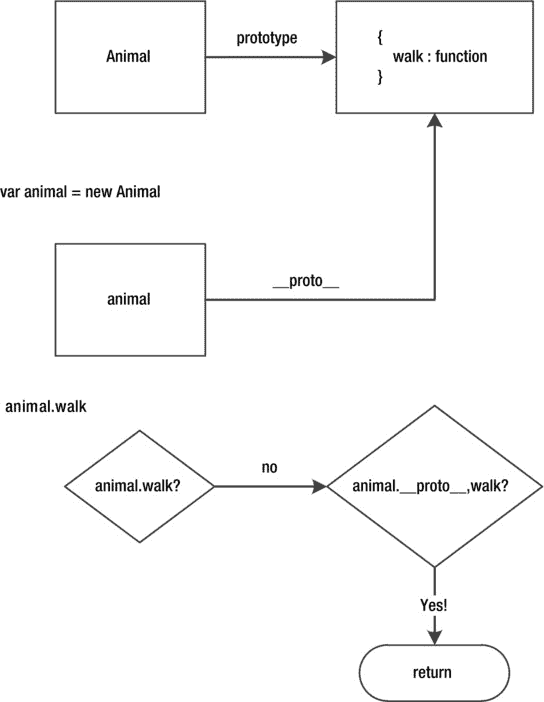
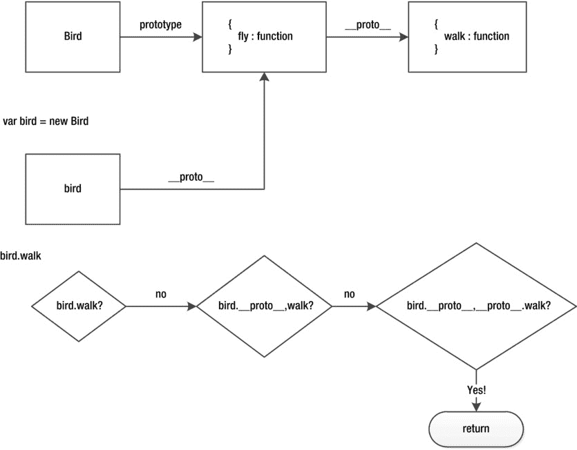
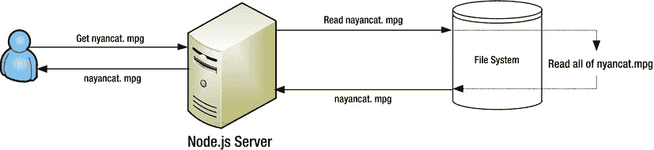
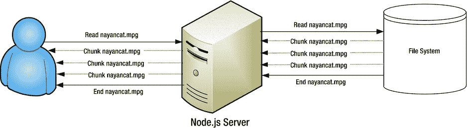

# 五、事件和流

在我们研究 Node.js 开发的具体领域之前，我们需要解决一些关于 JavaScript 的核心概念，特别是 Node.js。Node.js 致力于成为创建服务器应用的最佳、最简单的方式。事件和流在实现这个目标的过程中扮演着重要的角色。

Node.js 是单线程；我们已经讨论了这个事实的优点。由于 Node.js 的事件性质，它对事件订阅/取消订阅模式提供了一流的支持。这种模式非常类似于您在浏览器中使用 JavaScript 处理事件的方式。

流数据是非常适合 Node.js 的领域之一。流对于改善用户体验和降低服务器资源利用率非常有用。

为了理解我们如何创建自己的事件发射器和流，我们首先需要理解 JavaScript 继承。

JavaScript 中的经典继承

我们在第二章中看到了原型是如何工作的。JavaScript 支持原型继承。在 JavaScript 中，在当前项上查找一个成员(比如`item.foo`)，然后是它的原型(`item.__proto__.foo`)，接着是它的原型的原型(`item.__proto__.__proto__.foo`)，依此类推，直到原型本身(比如`item.__proto__.__proto__.__proto__`)是`null`。我们已经看到了如何用 JavaScript 来模拟一个经典的面向对象的*类*结构。现在让我们看看如何用它来实现传统的面向对象的继承。

达成继承模式

让我们创建一个动物类。它有一个简单的成员函数，名为`walk`。我们已经讨论过，当使用``new``操作符(例如``new Animal``)调用函数时，函数中的``this`'指的是新创建的对象。我们还讨论了由于使用了`new`操作符，构造函数的原型成员(`Animal.prototype`)被对象原型(`animal.__proto__`)引用。(参见[清单 5-1](#list1) )。

[清单 5-1](#_list1) 。oo/1animal.js

```js
function Animal(name) {
    this.name = name;
}
Animal.prototype.walk = function (destination) {
    console.log(this.name, 'is walking to', destination);
};

var animal = new Animal('elephant');
animal.walk('melbourne'); // elephant is walking to melbourne

```

为了更好地理解“T0”上的查找是如何进行的，请看一下图 5-1 中的图表。



[图 5-1](#_Fig1) 。从原型中查找成员的示例

现在让我们在一个新的类中继承所有的`Animal`类功能 ，例如`Bird`。为此，我们需要做两件事:

*   从`Bird`构造函数中调用`Animal`构造函数。这确保了为`Bird`对象(我们示例中的`Animal.name`)正确设置属性。
*   想办法让所有父(`Animal`)原型成员(例如，`__proto__.walk`)成为子(`Bird`)实例原型的原型的成员。这将允许`Bird`实例(例如，`bird`)在它们自己的原型(`bird.__proto__.fly`)上拥有它们自己的函数，在它们原型的原型(`bird.__proto__.__proto__.walk`)上拥有它们的父成员。这叫做*建立一个原型链*。

我们将从充实`Bird`类开始。基于算法，它将看起来像[清单 5-2](#list2) 中的代码。

[清单 5-2](#_list2) 。为继承做准备

```js
function Bird(name){
    // Call the Animal constructor
}
// Setup the prototype chain between Bird and Animal

// Finally create child instance
var bird = new Bird('sparrow');

```

调用父构造函数

我们不能简单地从`Bird`调用父`Animal`构造函数。这是因为如果我们这样做，那么`Animal`中的“T2”将不会引用新创建的`Bird`对象(从`new Bird`创建)。因此，我们需要将`Animal`函数中`this`的含义指向`Bird`函数中`this`的值。幸运的是，我们可以通过使用所有 JavaScript 函数上可用的`'.call'`成员函数来强制解释含义(它来自`Function.prototype`)。[清单 5-3](#list3) 展示了`call`成员。像往常一样，评论解释了正在发生的事情。

[清单 5-3](#_list3) 。oo/2call.js

```js
var foo = {};
var bar = {};

// A function that uses `this`
function func(val) {
    this.val = val;
}

// Force this in func to be foo
func.call(foo, 123);

// Force this in func to be bar
func.call(bar, 456);

// Verify:
console.log(foo.val); // 123
console.log(bar.val); // 456

```

你可以看到我们将``func`'函数中的``this`'强制为`foo`,然后是`bar`。太好了。现在我们知道了如何强制`this`，让我们用它来调用父Node，如[清单 5-4](#list4) 所示。

[清单 5-4](#_list4) 。调用父构造函数

```js
function Bird(name){
    Animal.call(this,name);

    // Any additional initialization code you want
}
// Copy all Animal prototype members to Bird

```

每次需要调用父构造函数时，都要使用这种模式(`Parent.call(this, /* additional args */)`)。现在你对为什么会这样有了一个明确的功能理解。

设置原型链

我们需要一种机制，这样当我们创建一个新的`Bird`(比如，`bird = new Bird`)时，它的原型链就包含了所有的父原型函数(比如，`bird.__proto__.__proto__.walk`)。如果我们做`Bird.prototype.__proto__ = Animal.prototype`，这可以很简单地完成。

这个过程之所以有效，是因为当我们执行`bird = new Bird`时，我们将有效地获得`bird.__proto__.__proto__ = Animal.prototype`，这将使父原型成员(例如，`Animal.prototype.walk`)在子原型(`bird.__proto__.__proto__.walk)`)上可用，这是我们想要的结果。[清单 5-5](#list5) 显示了一个简单的代码样本。

[清单 5-5](#_list5) 。oo/3 协议类型. js

```js
// Animal Base class
function Animal(name) {
    this.name = name;
}
Animal.prototype.walk = function (destination) {
    console.log(this.name, 'is walking to', destination);
};

var animal = new Animal('elephant');
animal.walk('melbourne'); // elephant is walking to melbourne

// Bird Child class
function Bird(name) {
    Animal.call(this, name);
}
Bird.prototype.__proto__ = Animal.prototype;
Bird.prototype.fly = function (destination) {
    console.log(this.name, 'is flying to', destination);
}

var bird = new Bird('sparrow');
bird.walk('sydney'); // sparrow is walking to sydney
bird.fly('melbourne'); // sparrow is flying to melbourne

```

为了理解继承成员(在我们的例子中是`bird.walk`)的查找是如何执行的，请看一下[图 5-2](#Fig2) 。



[图 5-2](#_Fig2) 。从原型链中查找成员的示例

注意手动修改`__proto__`属性是不推荐的*，因为它不是 ECMAScript 标准的一部分。我们稍后将讨论设置原型的更标准的方法，但是这里展示的原理会让您成为 JavaScript 原型继承的专家。*

 *构造函数属性

默认情况下，每个函数都有一个名为“`prototype`”的成员，我们已经看到了。默认情况下，这个成员有一个指向函数本身的`constructor`属性。[清单 5-6](#list6) 演示了这一点。

[清单 5-6](#_list6) 。oo/4 构造器/1basic.js

```js
function Foo() { }
console.log(Foo.prototype.constructor === Foo); // true

```

有这个属性有什么好处？在使用一个函数(例如，`instance = new Foo`)创建了一个实例之后，您可以使用一个简单的查找`instance.constructor`(实际上是查看`instance.__proto__.constructor`)来访问构造函数。清单 5-7 在一个例子中展示了这一点，在这个例子中，我们使用命名函数的属性`name`(`function Foo`)来记录是什么创建了这个对象。

[清单 5-7](#_list7) 。oo/4constructor/2new.js

```js
function Foo() { }

var foo = new Foo();
console.log(foo.constructor.name); // Foo
console.log(foo.constructor === Foo); // true

```

了解构造函数属性使您能够在需要时对实例进行运行时反射。

正确的 Node.js 方式

我们在[第 3 章](03.html)中讨论的`util`核心模块 ( `require('utils')`)提供了一个可爱的小函数来为我们创建原型链，这样你就不需要自己处理``__proto__``(非标准属性)了。该函数名为`【T3 ],接受一个子类，后跟一个父类，如清单 5-8 中的示例所示。`Bird`类扩展了我们前面看到的`Animal`类。

[清单 5-8](#_list8) 。oo/5nodejs/util.js

```js
// util function
var inherits = require('util').inherits;

// Bird Child class
function Bird(name) {
    // Call parent constructor
    Animal.call(this, name);

    // Additional construction code
}
inherits(Bird, Animal);

// Additional member functions
Bird.prototype.fly = function (destination) {
    console.log(this.name, 'is flying to', destination);
}

var bird = new Bird('sparrow');
bird.walk('sydney'); // sparrow is walking to sydney
bird.fly('melbourne'); // sparrow is flying to melbourne

```

有两件事值得注意:

*   调用父构造函数:`Animal.call(this, /* any original arguments */)`
*   设置原型链:`inherits(Bird, Animal);`

简单到成为第二天性，这就是你继承类所需要做的一切！

覆盖子类中的函数

要覆盖父函数但仍利用一些原始功能，只需执行以下操作:

*   在子Node`prototype`上创建一个同名的函数。
*   调用父函数的方式类似于我们调用父构造函数的方式，基本上是使用`Parent.prototype.memberfunction.call(this, /*any original args*/)`语法。

清单 5-9 展示了这一点。

[清单 5-9](#_list9) 。oo/6override.js

```js
// util function
var inherits = require('util').inherits;

// Base
function Base() { this.message = "message"; };
Base.prototype.foo = function () { return this.message + " base foo" };

// Child
function Child() { Base.call(this); };
inherits(Child, Base);

// Overide parent behaviour in child
Child.prototype.foo = function () {
    // Call base implementation + customize
    return Base.prototype.foo.call(this) + " child foo";
}

// Test:
var child = new Child();
console.log(child.foo()); // message base foo child foo

```

我们简单地创建了子函数`Child.prototype.foo`并在`Base.prototype.foo.call(this).`中调用父函数

检查继承链

正如我们所看到的，建立一个原型链(`__proto__.__proto__`)有一个额外的好处，它允许你检查一个特定的对象实例是否属于一个特定的类，或者它的父类，或者它的父类，等等。这是使用`instanceof`操作符完成的。

在伪代码中当你做`someObj instanceof Func`时你使用这个算法:

*   检查`someObj.__proto__ == Func.prototype`，如果是，返回`true`。
*   如果不是，检查`someObj.__proto__.__proto__ == Func.prototype`，如果是，返回`true`。
*   重复向上移动原型链。
*   如果`__proto__`是`null`并且我们还没有找到匹配，返回`false`。

从伪代码中，您可以看到它非常类似于如何执行属性查找。我们沿着原型链向上走，直到找到一个等于 T1 的 T0。当`new`操作符将`prototype`复制到`__proto__`时，找到匹配表示`new`操作符正在指定的`Func`上使用。使用`instanceof`的快速演示如[清单 5-10](#list10) 所示。

[清单 5-10](#_list10) 。oo/7instanceof.js

```js
var inherits = require('util').inherits;

function A() { }
function B() { }; inherits(B, A);
function C() { }

var b = new B();
console.log(b instanceof B); // true because b.__proto__ == B.prototype
console.log(b instanceof A); // true because b.__proto__.__proto__ == A.prototype
console.log(b instanceof C); // false

```

对 util.inherits 内部的更深入的理解

你不需要*通过*来了解这一部分，但这是值得的，因为你可以坐在酷孩子的桌子旁。我们说过不推荐手动设置`__proto__`，因为它不是标准化 JavaScript 的一部分。

幸运的是，JavaScript 中有一个函数可以创建一个已经设置了指定的`__proto__`的空白对象。该功能被称为`Object.` `create` ，其工作方式如[清单 5-11](#list11) 所示。

[清单 5-11](#_list11) 。oo/8internals/1check.js

```js
var foo = {};
var bar = Object.create(foo);
console.log(bar.__proto__ === foo); // true

```

在这个例子中，我们简单地验证了新创建的对象(即，`bar`)的`__proto__`成员被设置为我们传递给`Object.create`的成员(换句话说，`foo`)。它可以用于继承，如[清单 5-12](#list12) 所示。

[清单 5-12](#_list12) 。oo/8internals/2inherit.js

```js
// Animal Base class
function Animal() {
}
Animal.prototype.walk = function () {
    console.log('walking');
};

// Bird Child class
function Bird() {
}
Bird.prototype = Object.create(Animal.prototype);

var bird = new Bird();
bird.walk();

```

与我们之前展示的原始非标准`__proto__`机制相比，这里我们简单地将`Bird.prototype.__proto__ = Animal.prototype`替换为有效的`Bird.prototype = { __proto__ : Animal.prototype }`。

这种机制正确地继承了父类的成员，但是它产生了一个小问题。当我们重新分配`Bird.prototype`时，`Bird.prototype.constructor`中的`constructor`信息丢失了，因为我们将`Bird.prototype`重新分配给了一个全新的对象。要恢复`constructor`属性，一个简单的解决方案是向`Object.` `create`传递第二个参数，该参数指定要添加到要创建的对象的附加属性。在[清单 5-13](#list13) 中，我们指定`constructor`是一个指向函数本身的属性，这就是`Bird.prototype.constructor`最初的样子(记住`Bird.prototype.constructor === Bird`)。

[清单 5-13](#_list13) 。oo/8 internals/3 inherit better . js

```js
// Animal Base class
function Animal() {
}
Animal.prototype.walk = function () {
    console.log('walking');
};

// Bird Child class
function Bird() {
}
Bird.prototype = Object.create(Animal.prototype, {
    constructor: {
        value: Bird,
        enumerable: false,
        writable: true,
        configurable: true
    }
});

var bird = new Bird();
bird.walk();
console.log(bird.constructor === Bird); // true

```

这正是 Node.js util 模块中的实现(用 JavaScript 编写)。清单 5-14 中的[显示了直接来自源代码的实现](#list14)。

[清单 5-14](#_list14) 。从 Node.js 源 util.js 检索的代码

```js
exports.inherits = function(ctor, superCtor) {
  ctor.super_ = superCtor;
  ctor.prototype = Object.create(superCtor.prototype, {
    constructor: {
      value: ctor,
      enumerable: false,
      writable: true,
      configurable: true
    }
  });
};

```

`inherits`函数做的另一件事是向子类添加一个属性`super_`，该属性指向父类。这只是约定俗成，这样你就知道在调试或编写基于反射的代码时，这个子函数原型已经从这个`super_`类接收了成员。

掌握继承非常复杂，因为 JavaScript 是用简单的原型继承设计的。我们只是利用它提供的能力来模仿传统的 OO 层次结构。

Node.js 事件

我们已经有了一种使用回调基于某些事件执行某些代码的方法。处理重要事件的更一般的概念是事件。事件就像广播，而回调就像握手。引发事件的组件对其客户端一无所知，而使用回调的组件却知道很多。这使得事件非常适合于事件的重要性由客户端决定的场景。也许客户想知道，也许不想。注册多个客户端也更加简单，正如我们将在本节中看到的那样。

Node.js 内置了对核心`events`模块中事件的支持。像往常一样，使用`require('events')`加载模块。事件模块有一个简单的类“`EventEmitter`”，我们接下来会介绍它。

EventEmitter 类

`EventEmitter`是一个被设计用来使发出事件(这并不奇怪)和订阅引发的事件变得容易的类。[清单 5-15](#list15) 提供了一个小代码示例，我们订阅一个事件，然后引发它。

[清单 5-15](#_list15) 。events/1basic.js

```js
var EventEmitter = require('events').EventEmitter;

var emitter = new EventEmitter();

// Subscribe
emitter.on('foo', function (arg1, arg2) {
    console.log('Foo raised, Args:', arg1, arg2);
});

// Emit
emitter.emit('foo', { a: 123 }, { b: 456 });

```

如示例所示，您可以通过一个简单的``new EventEmitter`'调用来创建一个新实例。要订阅事件，可以使用``on`'函数传入事件名称(总是一个字符串),后跟事件处理函数(也称为*监听器*)。最后，我们使用`emit`函数引发一个事件，该函数传入事件名，后跟我们希望传入监听器的任意数量的参数(在[清单 5-15](#list15) 中，我们使用了两个参数进行演示)。

多个用户

正如我们之前提到的，使用事件的优势之一是为多个订阅者提供内置的支持。[清单 5-16](#list16) 是一个简单的例子，一个事件有多个订阅者。

[清单 5-16](#_list16) 。events/2multiple.js

```js
var EventEmitter = require('events').EventEmitter;
var emitter = new EventEmitter();

emitter.on('foo', function () {
    console.log('subscriber 1');
});

emitter.on('foo', function () {
    console.log('subscriber 2');
});

// Emit
emitter.emit('foo');

```

在这个例子中需要注意的另一件事是，侦听器是按照它们为事件注册的顺序被调用的。这是 Node.js 单线程特性的一个很好的结果，它使您更容易对代码进行推理。此外，为事件传递的任何参数都在不同的订阅者之间*共享*，如[清单 5-17](#list17) 所示。

[清单 5-17](#_list17) 。事件/3shared.js

```js
var EventEmitter = require('events').EventEmitter;
var emitter = new EventEmitter();

emitter.on('foo', function (ev) {
    console.log('subscriber 1:', ev);
    ev.handled = true;
});

emitter.on('foo', function (ev) {
    if (ev.handled) {
        console.log('event already handled');
    }
});

// Emit
emitter.emit('foo', { handled: false });

```

在这个示例中，第一个侦听器修改了传递的事件参数，第二个侦听器获得了修改后的对象。你可以潜在地利用这个事实让你摆脱一个棘手的局面，但我要高度警惕这一点。显示事件参数共享的原因是为了警告您在侦听器中直接修改事件对象的危险。

注销

下一个要问的问题是我们如何退订一个事件。`EventEmitter`有一个`removeListener`函数，它接受一个事件名，后面跟着一个函数对象，以便从监听队列中删除。需要注意的一点是，您必须有一个对要从监听队列中移除的函数的引用，因此，不应该使用匿名(内联)函数。这是因为如果 JavaScript 中的两个函数体相同，它们就不相等，如下面的[清单 5-18](#list18) 所示，因为这是两个不同的函数对象。

[清单 5-18](#_list18) 。演示函数不等式的示例

```js
$ node -e "console.log(function(){} == function(){})"
false

```

清单 5-19 展示了如何取消订阅一个监听器。

[清单 5-19](#_list19) 。events/4unsubscribe.js

```js
var EventEmitter = require('events').EventEmitter;
var emitter = new EventEmitter();

var fooHandler = function () {
    console.log('handler called');

    // Unsubscribe
    emitter.removeListener('foo',fooHandler);
};

emitter.on('foo', fooHandler);

// Emit twice
emitter.emit('foo');
emitter.emit('foo');

```

在此示例中，我们在事件引发一次后取消订阅该事件。结果，第二个事件被忽略了。

是否引发过此事件？

这是一个常见的用例，您并不关心事件是否每次都被引发——只关心它被引发一次。为此，`EventEmitter`提供了一个函数“`once`”,它只调用注册的监听器一次。[清单 5-20](#list20) 演示了它的用法。

[清单 5-20](#_list20) 。events/5once.js

```js
var EventEmitter = require('events').EventEmitter;
var emitter = new EventEmitter();

emitter.once('foo', function () {
    console.log('foo has been raised');
});

// Emit twice
emitter.emit('foo');
emitter.emit('foo');

```

`foo`的事件监听器只会被调用一次。

听众管理

作为 Node.js 事件处理专家，您需要了解在`EventEmitter`上提供的一些额外的实用函数。

`EventEmitter`有一个成员函数`listeners`，它接受一个事件名并返回订阅该事件的所有侦听器。这在调试事件侦听器时非常有用。[清单 5-21](#list21) 演示了它的用法。

[清单 5-21](#_list21) 。events/6listeners.js

```js
var EventEmitter = require('events').EventEmitter;
var emitter = new EventEmitter();

emitter.on('foo', function a() { });
emitter.on('foo', function b() { });

console.log(emitter.listeners('foo')); // [ [Function: a], [Function: b]]

```

`EventEmitter`实例还会在添加新的侦听器时引发“`newListener`”事件，在删除侦听器时引发“`removeListener`”事件，这在一些棘手的情况下会有所帮助，比如当您想要跟踪事件侦听器注册/取消注册的时刻。当添加或删除监听器时，它对您想要做的任何管理都很有用，如清单 5-22 中的[所示。](#list22)

[清单 5-22](#_list22) 。events/7listenerevents.js

```js
var EventEmitter = require('events').EventEmitter;
var emitter = new EventEmitter();

// Listener addition / removal notifications
emitter.on('removeListener', function (eventName, listenerFunction) {
    console.log(eventName, 'listener removed', listenerFunction.name);
});
emitter.on('newListener', function (eventName, listenerFunction) {
    console.log(eventName, 'listener added', listenerFunction.name);
});

function a() { }
function b() { }

// Add
emitter.on('foo', a);
emitter.on('foo', b);

// Remove
emitter.removeListener('foo', a);
emitter.removeListener('foo', b);

```

请注意，如果您在添加了“`newListener`”的处理程序之后添加了“`removeListener`”,那么您也会得到关于添加了“`removeListener`”的通知，这就是为什么我们习惯上像在本示例中那样首先添加`removeListener`事件处理程序。

EventEmitter 内存泄漏

处理事件时，内存泄漏的一个常见来源是在回调中订阅事件，但在结束时忘记取消订阅。默认情况下，`EventEmitter`将允许每种事件类型的*有 10 个监听器，并且它将向控制台输出一个警告。此警告是专门为您提供帮助的。您的所有代码都将继续运行。换句话说，将会在没有警告的情况下添加更多的侦听器，并且当一个事件被引发时，所有的侦听器都会被调用，如[清单 5-23](#list23) 所示。*

[清单 5-23](#_list23) 。events/8maxEventListeners.js

```js
var EventEmitter = require('events').EventEmitter;
var emitter = new EventEmitter();

var listenersCalled = 0;

function someCallback() {
    // Add a listener
    emitter.on('foo', function () { listenersCalled++ });

    // return from callback
}

for (var i = 0; i < 20; i++) {
    someCallback();
}
emitter.emit('foo');
console.log('listeners called:', listenersCalled); // 20

```

应用的输出显示在[清单 5-24](#list24) 中。您可以看到，尽管有警告，但当我们发出事件时，所有 20 个侦听器都被调用了。

[清单 5-24](#_list24) 。运行最大事件监听器演示

```js
$ node 8maxEventListeners.js
(node) warning: possible EventEmitter memory leak detected. 11 listeners added.
Use emitter.setMaxListeners() to increase limit.
Trace
    at EventEmitter.addListener (events.js:160:15)
    at someCallback (/path/to/8maxEventListeners.js:8:13)
    at Object.<anonymous> (/path/to/8maxEventListeners.js:14:5)
    at Module._compile (module.js:456:26)
    at Object.Module._extensions..js (module.js:474:10)
    at Module.load (module.js:356:32)
    at Function.Module._load (module.js:312:12)
    at Function.Module.runMain (module.js:497:10)
    at startup (node.js:119:16)
    at node.js:902:3
listeners called: 20

```

这种内存泄漏的一个常见原因是在回调出错时忘记取消订阅事件。一个简单的解决方案是在回调中创建一个新的事件发射器。这样，事件发射器就不会被共享，当回调终止时，它会和它的所有订阅者一起被释放。

最后，在有些情况下，拥有 10 个以上的侦听器是一个有效的场景。在这种情况下，您可以使用`setMaxListeners`成员函数增加这个警告的限制，如[清单 5-25](#list25) 所示。

[清单 5-25](#_list25) 。events/9setMaxListeners.js

```js
var EventEmitter = require('events').EventEmitter;
var emitter = new EventEmitter();

// increase limit to 30
emitter.setMaxListeners(30);

// subscribe 20 times
// No warning will be printed
for (var i = 0; i < 20; i++) {
    emitter.on('foo', function () { });
}
console.log('done');

```

请注意，这增加了该事件发射器上所有事件类型的*限制。此外，您可以传入 0，以允许在没有警告的情况下订阅无限数量的事件侦听器。*

Node.js 默认情况下尽量做到安全；在服务器环境中工作时，内存泄漏会造成很大的影响，这也是此警告消息存在的原因。

错误事件

一个`'error'`事件在 Node.js 中被视为一个特殊的*异常*案例，如果它没有*没有*监听器，那么默认的动作是打印一个堆栈跟踪并退出程序。清单 5-26 给出了一个简单的例子来说明这一点。

[清单 5-26](#_list26) 。事件/10errorEvent.js

```js
var EventEmitter = require('events').EventEmitter;
var emitter = new EventEmitter();

// Emit an error event
// Since there is no listener for this event the process terminates
emitter.emit('error', new Error('Something horrible happened'));

console.log('this line never executes');

```

如果您运行这段代码，您将得到一个输出，如清单 5-27 中的[所示。如果你需要引发一个`error`事件，你应该使用一个`Error`对象，就像我们在这个例子中所做的那样。您还可以从示例中看到，当流程终止时，包含`console.log`的最后一行永远不会执行。](#list27)

[清单 5-27](#_list27) 。错误事件示例的运行示例

```js
$ node 10errorEvent.js

events.js:72
        throw er; // Unhandled 'error' event
              ^
Error: Something horrible happened
    at Object.<anonymous> (/path/to/10errorEvent.js:6:23)
    at Module._compile (module.js:456:26)
    at Object.Module._extensions..js (module.js:474:10)
    at Module.load (module.js:356:32)
    at Function.Module._load (module.js:312:12)
    at Function.Module.runMain (module.js:497:10)
    at startup (node.js:119:16)
    at node.js:902:3

```

因此，教训是:只有在*异常*的情况下*必须*处理，才引发错误`event`。

创建您自己的事件发射器

既然您已经是 Node.js 中处理和引发事件的专家，那么大量的开源外围应用就向您敞开了大门。许多库导出继承自`EventEmitter`的类，因此遵循相同的事件处理机制。在这个阶段，了解如何扩展`EventEmitter`并创建一个内置了`EventEmitter`所有功能的公共类是很有用的。

创建自己的`EventEmitter`所需要做的就是从类的构造函数中调用`EventEmitter`构造函数，并使用`util.inherits`函数来建立原型链。考虑到我们在本章开始时对这个问题的讨论，这应该是你的第二天性。清单 5-28 是演示这一点的一个简单例子。

[清单 5-28](#_list28) 。事件/11custom.js

```js
var EventEmitter = require('events').EventEmitter;
var inherits = require('util').inherits;

// Custom class
function Foo() {
    EventEmitter.call(this);
}
inherits(Foo, EventEmitter);

// Sample member function that raises an event
Foo.prototype.connect = function () {
    this.emit('connected');
}

// Usage
var foo = new Foo();
foo.on('connected', function () {
    console.log('connected raised!');
});
foo.connect();

```

你可以看到你的类的用法就像它是一个`EventEmitter`一样。有了这两行简单的代码，您就有了一个全功能的自定义事件发射器。

处理事件

core Node.js 中的许多类都继承自`EventEmitter`。全局`process`对象也是`EventEmitter`的一个实例，正如你在[清单 5-29](#list29) 中看到的。

[清单 5-29](#_list29) 。演示进程是 EventEmitter 的示例

```js
$ node -e "console.log(process instanceof require('events').EventEmitter)"
true

```

全局异常处理程序

任何全局未处理的异常都可以通过侦听进程上的“`uncaughtException`”事件来截获。您不应该在此事件处理程序之外继续执行，因为这只会在应用处于不稳定状态时发生。最好的策略是为了方便起见记录错误，*用错误代码*退出进程，如[清单 5-30](#list30) 所示。

[清单 5-30](#_list30) 。process/1 un catch . js

```js
process.on('uncaughtException', function (err) {
    console.log('Caught exception: ', err);
    console.log('Stack:', err.stack);
    process.exit(1);
});

// Intentionally cause an exception, but don't try/catch it.
nonexistentFunc();

console.log('This line will not run.');

```

如果你运行[清单 5-30](#list30) 中的代码，你会得到一个不错的错误日志，如[清单 5-31](#list31) 所示。

[清单 5-31](#_list31) 。未捕获异常的运行示例

```js
$ node 1uncaught.js
Caught exception: [ReferenceError: nonexistentFunc is not defined]
Stack: ReferenceError: nonexistentFunc is not defined
    at Object.<anonymous> (E:\DRIVE\Google Drive\BEGINNING NODEJS\code\chapter5\
process\1uncaught.js:8:1)
    at Module._compile (module.js:456:26)
    at Object.Module._extensions..js (module.js:474:10)
    at Module.load (module.js:356:32)
    at Function.Module._load (module.js:312:12)
    at Function.Module.runMain (module.js:497:10)
    at startup (node.js:119:16)
    at node.js:902:3

```

如果任何事件发射器引发“**错误**”事件，并且没有侦听器订阅该事件的事件发射器，则“`uncaughtError`”事件也会在流程上引发。

出口

当进程将要退出时，发出`exit`事件。此时无法中止退出。事件循环已经在拆卸中，所以此时你*不能*做任何*异步*操作。(参见[清单 5-32](#list32) 。)

[清单 5-32](#_list32) 。process/2exit.js

```js
process.on('exit', function (code) {
    console.log('Exiting with code:', code);
});

process.exit(1);

```

请注意，事件回调是在进程退出时使用的退出代码中传递的。此事件主要用于调试和日志记录。

信号

Node.js `process`对象还支持 UNIX 的信号概念，这是一种进程间通信的形式。它还模拟了 Windows 系统上最重要的程序。Windows 和 UNIX 都支持的一个常见场景是，用户试图在终端中使用 Ctrl+C 组合键来中断进程。默认情况下，Node.js 将退出该进程。但是，如果您有一个监听器订阅了``SIGINT``(信号中断)事件，监听器将被调用，您可以选择是否要退出进程(`process.exit`)或继续执行。[清单 5-33](#list33) 提供了一个小例子，我们选择继续运行并在五秒钟后退出。

[清单 5-33](#_list33) 。process/3 signal . js

```js
setTimeout(function () {
    console.log('5 seconds passed. Exiting');
}, 5000);
console.log('Started. Will exit in 5 seconds');

process.on('SIGINT', function () {
    console.log('Got SIGINT. Ignoring.');
});

```

如果您执行这个示例并按 Ctrl+C，您将得到一条消息，表明我们选择忽略它。最后，一旦我们没有任何未完成的任务，进程将在五秒钟后自然退出(如清单 5-34 所示)。

[清单 5-34](#_list34) 。忽略 Ctrl+C 消息的示例运行演示

```js
$ node 3signals.js
Started. Will exit in 5 seconds
Got SIGINT. Ignoring.
Got SIGINT. Ignoring.
5 seconds passed. Exiting

```

流

一滴一滴地是装满水的罐子。

—佛陀

流在创建高性能的 web 应用 中扮演着重要的角色。为了理解流带来了什么，考虑一个简单的例子，从 web 服务器提供一个大文件(1GB)。在没有溪流的情况下，它看起来像[图 5-3](#Fig3) 。用户将不得不等待很长时间才能得到他们所请求的文件的任何迹象。这叫做*缓冲*，我们应该尽可能的限制它。除了用户体验明显不好，还浪费资源。在我们开始将文件发送给用户之前，需要加载完整的文件并保存在内存中。



[图 5-3](#_Fig3) 。缓冲网络响应

当我们使用流式传输时，同样的场景看起来要好得多。我们开始读取文件，每当我们有一个新的数据块时，我们将它发送到客户端，直到我们到达末尾，如图[图 5-4](#Fig4) 所示。



[图 5-4](#_Fig4) 。流媒体网络响应

用户体验的改善和服务器资源的更好利用是 steams 背后的主要动机。

最重要的概念是`Readable`流、`Writable`流、`Duplex`流、**、**和`Transform`流。一个*可读*流是一个你可以从中读取数据但不能写入的流。一个很好的例子是`process.stdin`，它可以用来从标准输入流数据。*可写*流是可以写入但不能读取的流。一个很好的例子是`process.stdout`，它可以用来将数据流输出到标准输出。一个*双工*流是一个你可以读写的流。网络套接字就是一个很好的例子。您可以向网络套接字写入数据，也可以从中读取数据。*转换*流是双工流的一种特殊情况，流的输出以某种方式从输入中计算出来。这些溪流也被称为*至*溪流。一个很好的例子就是加密和压缩流。

流的所有基本构建块都存在于使用`require('stream')`加载的 Node.js 核心流模块中。这个模块中有实现流的基类，恰当地称为`Readable`、`Writable`、`Duplex`和`Transform`。

Node.js 中的流是基于事件的，这就是为什么在我们深入流之前对事件有一个牢固的理解是很重要的。所有这些流类都继承自一个基本抽象`Stream`类(抽象是因为你不应该直接使用它)，它又继承自`EventEmitter`(我们前面已经看到了)。这个层次结构在[清单 5-35](#list35) 中演示。

[清单 5-35](#_list35) 。streams/1 concepts/event based . js

```js
var stream = require('stream');
var EventEmitter = require('events').EventEmitter;

console.log(new stream.Stream() instanceof EventEmitter); // true

console.log(new stream.Readable({}) instanceof stream.Stream); // true
console.log(new stream.Writable({}) instanceof stream.Stream); // true
console.log(new stream.Duplex({}) instanceof stream.Stream); // true
console.log(new stream.Transform({}) instanceof stream.Stream); // true

```

在我们了解如何创建自己的流之前，让我们看看如何使用 Node.js 库中现有的流。

管道

所有的流都支持管道操作，可以使用`pipe`成员函数来完成。这是 Node.js 中的流如此出色的原因之一。考虑我们简单的初始场景，从文件系统加载一个文件并将其传输到客户机。这可以像代码段`fileSystemStream.pipe(userSocket)`一样简单。

您可以通过管道从可读取的流(可读/双工/转换)传输到可写入的流(可写/双工/转换)。这个函数被称为*管道*，因为它模仿了命令行管道操作符的行为，例如`cat file.txt | grep lol`。

核心模块`fs`提供了从文件创建可读或可写流的实用函数。清单 5-36 是一个将文件从文件系统传输到用户控制台的例子。

[清单 5-36](#_list36) 。streams/2pipe/1basic.js

```js
var fs = require('fs');

// Create readable stream
var readableStream = fs.createReadStream('./cool.txt');

// Pipe it to stdout
readableStream.pipe(process.stdout);

```

您还可以使用`pipe`链接多个流。例如，清单 5-37 中的代码从一个文件中创建一个读取流，通过一个 zip 转换流，然后通过管道将其传输到一个可写文件流。这将在文件系统上创建一个 zip 文件。

[清单 5-37](#_list37) 。streams/2pipe/2chain.js

```js
var fs = require('fs');
var gzip = require('zlib').createGzip();

var inp = fs.createReadStream('cool.txt');
var out = fs.createWriteStream('cool.txt.gz');

// Pipe chain
inp.pipe(gzip).pipe(out);

```

Node.js 中的流是基于事件的。`pipe`操作所做的只是订阅源上的相关事件，并调用目的地上的相关函数。对于大多数目的来说，`pipe`是作为 API 消费者需要了解的全部内容，但是当您想要更深入地研究流时，了解更多的细节是值得的。

消费可读流

我们已经说过很多次，流是基于事件工作的。可读流最重要的事件是`'readable'`。每当有新数据要从流中读取时，都会引发此事件。一旦进入事件处理程序，就可以调用流中的`read`函数从流中读取数据。如果这是流的结尾，read 函数返回`null`，如[清单 5-38](#list38) 所示。

[清单 5-38](#_list38) 。streams/3readable/basic.js

```js
process.stdin.on('readable', function () {
    var buf = process.stdin.read();
    if (buf != null) {
        console.log('Got:');
        process.stdout.write(buf.toString());
    }
    else {
        console.log('Read complete!');
    }
});

```

清单 5-39 中显示了该代码的一个运行示例，其中我们从命令行将数据传输到`process.stdin`。

[清单 5-39](#_list39) 。streams/3readable/basic.js 的运行示例

```js
$ echo 'foo bar bas' | node basic.js
Got:
'foo bar bas'
Read complete!

```

写入可写流

要写一个流，只需调用`write`来写一些数据。当你写完(流结束)时，你只需调用`end`。如果你愿意，你也可以使用`end`成员函数写一些数据，如[清单 5-40](#list40) 所示。

[清单 5-40](#_list40) 。streams/4writable/basic.js

```js
var fs = require('fs');
var ws = fs.createWriteStream('message.txt');

ws.write('foo bar ');
ws.end('bas');

```

在这个例子中，我们简单地将`foo bar bas`写到一个可写的文件流中。

创建您自己的流

创建自己的流与创建自己的`EventEmitter`非常相似。对于从相关基类继承的流，流类和实现一些基方法。这在[表 5-1](#Tab1) 中有详细说明。

继承机制和我们之前看到的一样。也就是你从你的类构造函数中调用基构造函数，在声明你的类之后调用`utils.inherits`。

[表 5-1](#_Tab1) 。创建您自己的自定义流

| 

使用案例

 | 

班级

 | 

要实现的方法

 |
| --- | --- | --- |
| 只读 | 易读的 | _ 阅读 |
| 只写 | 可写的 | _ 写入 |
| 阅读和写作 | 双层公寓 | _ 读，_ 写 |
| 对读取的数据进行操作并写入结果 | 改变 | _ 转换，_ 刷新 |

创建可读的流

如上所述，您只是从`Readable`类继承。您在自己的类中实现了`_read`成员，当有人请求读取数据时，stream API 会在内部调用这个成员。如果您有想要传递(推送)的数据，您可以调用继承的成员函数`push`来传递数据。如果您调用`push(null)`，这表示读取流结束。

清单 5-41 是一个返回 1-1000 的可读流的简单例子。如果你运行这个，你将会看到所有这些数字被打印出来(当我们用管道连接到`stdout`)。

[清单 5-41](#_list41) 。streams/5 create readable/counter . js

```js
var Readable = require('stream').Readable;
var util = require('util');

function Counter() {
    Readable.call(this);
    this._max = 1000;
    this._index = 1;
}
util.inherits(Counter, Readable);

Counter.prototype._read = function () {
    var i = this._index++;
    if (i > this._max)
        this.push(null);
    else {
        var str = ' ' + i;
        this.push(str);
    }
};

// Usage, same as any other readable stream
var counter = new Counter();
counter.pipe(process.stdout);

```

如您所见，底层的可读类为您提供了大部分流逻辑。

创建可写流

创建自己的可写流类类似于创建可读流。您从`Writable`类继承并实现了`_write`方法。`_write`方法以需要处理的块作为第一个参数传递。

清单 5-42 是一个简单的可写流，它将所有传入的数据记录到控制台。在这个例子中，我们简单地从可读文件流传输到这个可写流(`Logger`)。

[清单 5-42](#_list42) 。streams/6 create writable/logger . js

```js
var Writable = require('stream').Writable;
var util = require('util');

function Logger() {
    Writable.call(this);
}
util.inherits(Logger, Writable);

Logger.prototype._write = function (chunk) {
    console.log(chunk.toString());
};

// Usage, same as any other Writable stream
var logger = new Logger();

var readStream = require('fs').createReadStream('message.txt');
readStream.pipe(logger);

```

同样，在大多数情况下，大部分功能由`Writable`基类在内部处理。

摘要

希望这一章已经让你对 JavaScript 这种语言有了更好的理解。有几个简单的想法提供了很大的表现力。本章开始时，我们提供了 JavaScript 原型继承的速成课程，并解释了在 Node.js 中实现这一点是多么简单。然后，我们展示了 Node.js 如何内置对常见事件处理范例的支持。我们还演示了如何通过简单的继承创建自己的事件发射器。最后，我们看了 streams，以及为什么您想要将它们添加到您的武器库中。您看到了在 Node.js 中消费和写入流是多么容易。Node.js 几乎就像是为它们而设计的一样！在本章的最后，我们讨论了如何利用 Node.js 核心基类提供的内置功能创建自己的定制流。*