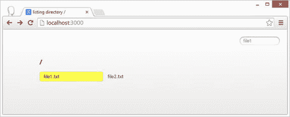

# 七、Express 简介

如果您今天要制作 Node.js 网站，您可能会使用 Express web 应用框架。

在前一章中，我们讨论了 Node.js 提供的 HTTP/HTTPS 功能的核心。我们还演示了 Connect 如何在原始的`createServer`调用之上提供一个中间件框架。ExpressJS 提供了 Connect 所提供的一切(与我们在上一章中看到的`use`函数相同，还有一个调度程序),并且走得更远。它构成了许多 web 应用的基础，我们将在本章中探讨它。

在这个过程中，我们将介绍一些与成为 HTTP/Node.js 专家相关的概念。

快速基础

快递在 NPM 有`express` ( `npm install express`)。让我们从 Connect 的共同点开始。Express 来自开发 Connect 的同一个开发团队。当你调用`require('express')`时，你会得到一个函数，你可以调用它来创建一个快速应用。这个应用具有我们在前一章中看到的连接调度程序的所有行为。例如，它可以接受使用'`use`'函数的中间件，并且可以向`http.createServer`注册，如[清单 7-1](#list1) 所示。

[清单 7-1](#_list1) 。intro/1basic.js

```js
var express = require('express'),
     http = require('http');

// Create an express application
var app = express()
            // register a middleware
            .use(function (req, res, next) {
                res.end('hello express!');
            });

// Register with http
http.createServer(app)
    .listen(3000);

```

能够注册为 HTTP 的侦听器允许您使用 HTTPS(与 Connect 相同)。类似于 Connect，Express 提供了一个实用程序`listen`函数向`http`注册自己。最简单的 Express 应用可以像清单 7-2 中的[一样简单。](#list2)

[清单 7-2](#_list2) 。intro/2simpler.js

```js
var express = require('express');

express()
    .use(function (req, res, next) {
        res.end('hello express!');
    })
    .listen(3000);

```

此外，错误处理与 Connect 的工作方式相同，错误处理中间件接受四个参数。正如你所看到的，我们从上一章学到的知识在这里都适用。

流行的 Connect/ExpressJS 中间件

所有连接中间件都是 Express 中间件。然而，并不是所有的 Express 中间件都是 Connect 中间件，因为为了方便起见，Express 对请求和响应做了更多的修改。对于大多数简单的中间件来说，这不是一个问题，但这是一个你需要知道的事实。

在这一节中，我们将展示核心团队中流行的连接/快捷中间件 。

提供静态页面

最常见的事情之一，你会想马上是服务静态网站内容。`serve-static`中间件(`npm install serve-static`)就是专门为此设计的。我们在前一章中介绍了一个类似的概念，但是我们没有完成这件事(例如，容易受到基于路径的攻击)，因为虽然这些概念很有价值，但是您最好使用`serve-static`。(参见[清单 7-3](#list3) 。)

[清单 7-3](#_list3) 。static/1basic.js

```js
var express = require('express');
var serveStatic = require('serve-static');

var app = express()
    .use(serveStatic(__dirname + '/public'))
    .listen(3000);

```

使用 node 运行这段代码，您将得到一个简单的 web 服务器，它提供来自``/public``目录的 web 页面。这个小服务器做了很多好事，包括:

*   设置响应的正确 mime 类型
*   具有良好的 HTTP 响应代码(例如，如果您刷新页面，而 HTML 没有改变，您会注意到它发送的响应是 304 Not Modified，而不是 200 OK。如果你请求一个不存在的文件，你会得到一个 404。如果由于某种原因无法访问该文件，它会发送 500 内部服务器错误响应。)
*   默认情况下，不允许您获取想要提供服务的目录以上的文件(不容易受到前一章中我们的简单服务器中的`../path`错误的影响)
*   如果路径解析为目录，则为目录中的`index.html`提供服务

 **注意**通过使用“`__dirname`”，我们确保路径总是相对于当前文件，而不是当前工作目录(CWD)。如果我们从另一个目录运行我们的应用，比如从上一级使用“`node static/1basic.js`”而不是同一个目录，即“【T2”)，CWD 可能与文件目录不同。相对路径名，如'【T3]'相对于 CWD 进行解析。利用‘T4’，使其独立于 CWD。

您还可以将附加选项作为第二个参数传递给`serve-static`中间件。例如，要设置它应该查找的索引文件，请使用`index`选项:

```js
app.use(serveStatic(__dirname + '/public', {'index': ['default.html', 'default.htm']}))

```

Express 将中间件作为其 NPM 包的一部分。所以如果你使用 Express，你可以使用`express.static`，它是`require('serve-static')`的别名。清单 7-4 展示了如何重写这个例子。

[清单 7-4](#_list4) 。static/2static.js

```js
var express = require('express');

var app = express()
    .use(express.static(__dirname + '/public'))
    .listen(3000);

```

列表目录内容

要列出一个目录的内容，有一个`serve-index (npm install serve-index)`中间件。因为它只列出了目录的内容，所以通常将它与`serve-static`中间件结合使用，以允许用户获取文件。[清单 7-5](#list5) 演示了它的用法。

[清单 7-5](#_list5) 。serveindex/basic.js

```js
var express = require('express');
var serveIndex = require('serve-index');

var app = express()
    .use(express.static(__dirname + '/public'))
    .use(serveIndex(__dirname + '/public'))
    .listen(3000);

```

默认情况下，它会给出一个漂亮的带有搜索框的目录列表页面，如图 7-1 所示。



[图 7-1](#_Fig1) 。服务索引中间件的默认目录列表

请注意，我们在`serve-index`之前注册了`serve-static`,因为它给了`serve-static`一个提供索引文件的机会(如果有的话),而不是`serve-index`用一个目录列表来响应。

接受 JSON 请求和 HTML 表单输入

*主体解析*是将基于字符串的*客户端请求主体*解析成 JavaScript 对象的行为，您可以在您的应用代码中轻松使用该对象。这是 web 开发中一个非常常见的任务，这使得中间件成为你工具箱中的必备工具。它只做以下两件事:

*   如果`content-type`匹配 JSON ( `application/JSON`)或用户提交的 HTML 表单(浏览器将其作为 MIME 类型`application/x-www-form-urlencoded`发送)，则将请求体解析为 JavaScript 对象
*   将这个 JavaScript 对象(如果解析成功)放在`req.body`中，以便在以后的中间件中访问

[清单 7-6](#list6) 提供了一个简单的例子，根据`body-parser`中间件解析的内容来响应客户端。

[清单 7-6](#_list6) 。bodyparser/basic.js

```js
var express = require('express');
var bodyParser = require('body-parser');

var app = express()
    .use(bodyParser())
    .use(function (req, res) {
        if (req.body.foo) {
            res.end('Body parsed! Value of foo: ' + req.body.foo);
        }
        else {
            res.end('Body does not have foo!');
        }
    })
    .use(function (err, req, res, next) {
        res.end('Invalid body!');
    })
    .listen(3000);

```

如果请求主体不包含任何`JSON`或`urlencoded`有效载荷，那么主体解析器将`req.body`设置为空对象。然而，如果客户端发送了一个无效的 JSON 内容，它会引发一个明显的错误，您可以使用一个错误处理中间件来处理这个错误(如[清单 7-7](#list7) 所示)。

我们可以像在上一章测试我们自己的 JSON 中间件一样测试它。首先，我们发送一个有效的 JSON 负载，然后我们发送一些无效的 JSON，如[清单 7-7](#list7) 所示。

[清单 7-7](#_list7) 。使用 JSON 内容测试 bodyparser/basic.js

```js
$ curl http://127.0.0.1:3000/ -H "content-type: application/json" -d "{\"foo\":123}"
Body parsed! Value of foo: 123
$ curl http://127.0.0.1:3000/ -H "content-type: application/json" -d "{\"foo\":123,}"
Invalid body!

```

如果客户端发送一个 HTML 表单数据(而不是 JSON)，中间件允许我们使用相同的代码，如清单 7-8 所示。

[清单 7-8](#_list8) 。使用 HTML 表单内容测试 bodyparser/basic.js

```js
$ curl http://127.0.0.1:3000/ --data-urlencode "foo=123"
Body parsed! Value of foo: 123

```

在前一章中，我们创建了自己的 JSON 解析器。我们的简单实现存在一些问题。首先，它很容易受到恶意客户端的攻击，导致服务器内存耗尽，因为我们需要在调用`JSON.parse`之前加载整个主体。默认情况下，`body-parser`将只解析最大 100KB 的有效负载。这是一个很好的默认设置。您可以在创建中间件时通过传递一个选项参数来指定不同的限制，比如`use('/api/v1',bodyParser({limit:'1mb'}))`。

 **注意** `Body-parser`内部使用字节(`npm install bytes` ) NPM 包解析极限值。这是一个简单的包，它导出了一个函数(`var bytes = require('bytes')`)，允许您将常见的字节字符串解析为字节数，如`bytes('1kb'), bytes('2mb')`、`bytes('3gb')`。

记住，所有的中间件都可以安装在特定的路径上，`body-parser`也不例外。因此，如果您只想对某些 API 端点(如`"/api/v1"`)进行主体解析，您可以使用`use('/api/v1',bodyParser())`。

处理 Cookies

一个 *cookie* 是从Web 服务器发送并存储在用户网络浏览器中的一些数据。每次用户的浏览器向 web 服务器发出请求时，web 浏览器都会发回它从服务器收到的 cookie。cookie为创建用户会话提供了一个很好的基础。

Express response 对象包含一些有用的成员函数来设置客户端 cookies。要设置 cookie，调用`res.` `cookie` `(cookieName,value,[options])`函数。例如，清单 7-9 中的代码会将一个名为`'name'`的 cookie 设置为`'foo'`:

[清单 7-9](#_list9) 。cookie/1basic.js

```js
var express = require('express');

var app = express()
    .use(function (req, res) {
        res.cookie('name', 'foo');
        res.end('Hello!');
    })
    .listen(3000);

```

如果您运行这个 web 服务器，您将在响应中看到'`set-cookie`'头，如清单 7-10 中的[所示。](#list10)

[清单 7-10](#_list10) 。用 curl 测试 cookie/1 basic . js

```js
$ curl http://127.0.0.1:3000 -i
HTTP/1.1 200 OK
X-Powered-By: Express
Set-Cookie: name=foo; Path=/
Date: Sun, 08 Jun 2014 01:02:23 GMT
Connection: keep-alive
Transfer-Encoding: chunked

Hello!

```

如果此响应由浏览器处理，那么如果服务器上的路径以“/”开头，浏览器将总是发送名为“`name`”且值为“`foo`”的 cookie。客户端在“`cookie`”报头中发送 cookie。在[清单 7-11](#list11) 中，修改我们的服务器来记录客户端请求中发送的任何 cookies。

[清单 7-11](#_list11) 。cookie/2show.js

```js
var express = require('express');

var app = express()
    .use(function (req, res) {
        console.log('---client request cookies header:\n', req.headers['cookie']);
        res.cookie('name', 'foo');
        res.end('Hello!');
    })
    .listen(3000);

```

如果您在浏览器中打开`http://localhost:3000`，您将会看到服务器控制台中记录的 cookie:

```js
---client request cookies header:
 name=foo

```

虽然头很有用，但是您需要将它解析成 JavaScript 对象。这就是 **cookie 解析器** ( `npm install cookie-parser`)中间件的用武之地。将这个中间件放入你的队列中，它将解析后的 cookies 填充到'`req.cookies`'对象中，如[清单 7-12](#list12) 所示，以演示它的用法。

[清单 7-12](#_list12) 。cookie/3parsed.js

```js
var express = require('express');
var cookieParser = require('cookie-parser');

var app = express()
    .use(cookieParser())
    .use(function (req, res) {
        if (req.cookies.name) {
            console.log('User name:', req.cookies.name);
        }
        else {
            res.cookie('name', 'foo');
        }
        res.end('Hello!');
    })
    .listen(3000);

```

如果您运行这个服务器，它将记录下在客户端请求中找到的`name` cookie 的值(例如，`User name: foo`)。否则，它将设置 cookie。该示例还展示了如何通过简单地检查是否在`req.cookies`对象中设置了特定的键来检查客户端请求中是否存在特定的 cookie。

您也可以使用 Express 提供的`res.` `clearCookie` `(cookieName, [options])`成员函数清除服务器响应中的客户端 cookies。例如，[清单 7-13](#list13) 中的服务器如果没有找到 cookie 就会设置它，如果找到了就会清除它。

[清单 7-13](#_list13) 。cookie/4clear.js

```js
var express = require('express');
var cookieParser = require('cookie-parser');

var app = express()
    .use(cookieParser())
    .use('/toggle', function (req, res) {
        if (req.cookies.name) {
            res.clearCookie('name');
            res.end('name cookie cleared! Was:' + req.cookies.name);
        }
        else {
            res.cookie('name', 'foo');
            res.end('name cookie set!');
        }
    })
    .listen(3000);

```

如果你在浏览器中访问`http://localhost:3000/toggle`，你会得到消息“名称 cookie 设置！”和“名称 cookie 已清除！”在交替尝试中。在我们清除它之前，我们还向您展示了浏览器发送的 cookie 值(应该是“`foo`”)。

 **注意**如果你好奇的话，我们会使用之前看到的用于设置初始 cookie 的旧的`set-cookie`头来清除 cookie。但是，对于 clearing，该值被设置为空，而 expiry 被设置为 UNIX epoch，即服务器响应中的'`Set-Cookie: name=; Path=/; Expires=Thu, 01 Jan 1970 00:00:00 GMT`'头。这告诉浏览器删除 cookie。

使用签名防止 Cookie 用户修改

由于 cookie 存储在客户端系统上(并在客户端请求中发送)，用户有可能伪造 cookie。我们可以对 cookie 进行数字签名，以检测任何客户端 cookie 伪造。这个特性也是由同一个`cookie-parser`中间件提供的。

数字签名确保了数据的真实性。快速 cookie 签名是使用一个*密钥哈希消息认证码(HMAC)* **完成的。**HMAC 是通过获取一个密钥(只有服务器知道)并将其与哈希算法相结合来计算 cookie 内容的哈希。由于秘密只有服务器知道，HMAC 只能由服务器计算和验证。

如果我们使用 Express(通过提供一个密钥)创建一个签名的 cookie，HMAC 值将被附加到我们发送给客户端的 cookie 值中。因此，当客户端在请求中将 cookie 发回给我们时，我们可以查看 cookie 中的 HMAC 值，并将其与重新计算的 HMAC 值进行比较，以检查它是否与内容匹配。如果不匹配，我们知道饼干是坏的，我们可以丢弃它。所有这些都是由`cookie-parser`中间件为您完成的。

您可以通过将密钥*传递给`cookie-parser`中间件创建函数来为 cookie 签名设置密钥*——换句话说，`use(cookieParser('optional secret string')).`到*设置一个签名的 cookie，*您只需调用`res.cookie(name,value,{` **signed:true** `})`(换句话说，名称和值为普通值，并传入一个选项`signed=true`)。为了*读取客户端请求中发送的签名 cookie*，使用`req.signedCookies`就像使用`req.cookies`一样。在读取时使用不同的属性使您很容易知道 cookie 签名已经过验证。作为一个例子，[清单 7-14](#list14) 展示了我们更新的切换 cookie 服务器，以使用签名 cookie。

[清单 7-14](#_list14) 。cookie/5sign.js

```js
var express = require('express');
var cookieParser = require('cookie-parser');

var app = express()
    .use(cookieParser('my super secret sign key'))
    .use('/toggle', function (req, res) {
        if (req.signedCookies.name) {
            res.clearCookie('name');
            res.end('name cookie cleared! Was:' + req.signedCookies.name);
        }
        else {
            res.cookie('name', 'foo', { signed: true });
            res.end('name cookie set!');
        }
    })
    .listen(3000);

```

httpOnly and Secure

默认情况下，用户的浏览器 JavaScript 可以读取为当前网页设置的 cookie(使用`document.cookie`)。这使得 cookie 容易受到跨端脚本(XSS)的攻击。也就是说，如果某个恶意用户设法将 JavaScript 注入到您的网站内容中，它将允许该 JavaScript 读取可能包含当前登录用户的敏感信息的 cookies，并将它发送到恶意网站。为了防止 JavaScript 访问 cookies，可以将`httpOnly`设置为`true`(`res.cookie(name,value,{`**http only:true**`})`)。这告诉浏览器不应该允许任何 JavaScript 访问这个 cookie，并且只应该在与服务器通信时使用它。

此外，正如我们在前一章中所展示的，你应该在你所有的公共服务器上使用 HTTPS。HTTPS 确保包括`cookie`报头在内的所有报头都被加密，并且不会受到中间人攻击。要让浏览器永远不要通过 HTTP 发送特定的 cookie，只对 HTTPS 使用，可以设置安全标志，即`res.cookie(name,value,{` **secure:true** `})`。

基于你现在所知道的，对于敏感的 cookies 你应该总是使用设置为`true`的`httpOnly`和`secure`。当然，安全需要一个 HTTPS 服务器。

设置 Cookie 到期时间

Cookies 非常适合在浏览器中存储与特定用户相关的持久信息。但是，如果没有在`Set-Cookie`标题中提到的 cookie 到期时间，浏览器会在关闭后清除 cookie！这种 cookie 通常被称为**浏览器会话** cookie(因为它只对当前浏览器会话有效)。如果您希望 cookies 持续一段时间，您应该总是设置`expiry`。您可以通过向`setCookie`传递一个`maxAge`选项来做到这一点，这需要这个 cookie 有效并在客户端请求中发送的毫秒数。例如:

```js
res.cookie('foo', 'bar', { maxAge: 900000, httpOnly: true })

```

基于 Cookie 的会话

为了在同一用户的不同 HTTP 请求之间提供一致的用户体验，通常在客户端 HTTP 请求旁边提供用户*会话*信息。举个简单的例子，我们可能想知道用户是否已经登录。

Cookies 为我们希望与客户端请求相关联的少量特定于用户的信息提供了良好的基础。但是 API 太低级了。例如，cookie 值只能是字符串。如果想要 JavaScript 对象，需要做 JSON 解析。这就是`cookie-session`中间件(`npm install cookie-session`)的用武之地。它允许您使用单个 cookie 来存储您认为与该用户会话相关的信息。

当使用`cookie-session`中间件时，用户会话对象被公开为`req.session`。您可以使用对`req.session`成员的简单赋值来设置或更新一个值。您可以通过从`req.session`删除一个键来清除一个值。默认情况下，`cookie-session`中间件必须被传递至少一个密钥，正如我们前面看到的，它使用这个密钥通过签名来确保会话 cookie 的完整性。清单 7-15 给出了一个简单的例子来演示如何使用`cookie-session`中间件。

[清单 7-15](#_list15) 。cookiesession/counter.js

```js
var express = require('express');
var cookieSession = require('cookie-session');

var app = express()
    .use(cookieSession({
        keys: ['my super secret sign key']
    }))
    .use('/home', function (req, res) {
        if (req.session.views) {
            req.session.views++;
        }
        else{
            req.session.views = 1;
        }
        res.end('Total views for you: ' + req.session.views);
    })
    .use('/reset',function(req,res){
        delete req.session.views;
        res.end('Cleared all your views');
    })
    .listen(3000);

```

启动该服务器，打开浏览器，访问`http://localhost:3000/home`查看计数器的增量，访问`http://localhost:3000/reset`重置计数器。除了像我们演示的那样从会话中清除单个值之外，您还可以通过将`req.session`设置为`null`，换句话说就是`req.session=null`，来删除整个用户会话。

您可以在`cookieSession`函数中传递附加选项(除了`keys`)。要指定存储会话的 cookie 名称，可以传入`name`选项。默认情况下，cookie 名称为`express:sess`。还支持其他一些 cookie 选项，例如`maxage`、`path`、`httpOnly`(默认为`true`)和`signed`(默认为`true`)。

谨慎使用 Cookie 会话

请注意，cookie 需要在 HTTP 报头中随每个客户端请求一起发送(如果路径匹配),因此大的 cookie 会影响性能。浏览器允许在 cookie 中存储多少信息也有限制(大多数浏览器的一般指导是 4093 字节，每个站点最多 20 个 cookie)。因此，让所有用户信息成为 cookie 的一部分是不可行的。

更强大的会话管理策略是使用数据库来存储用户会话信息，而不是使用 cookies。在这种情况下，您只需在用户 cookie 中存储一个令牌，该令牌将指向我们可以从服务器数据库中读取的会话信息。为此，您可以将`express-session`中间件(`npm install express-session`)与数据库(如 Mongo 或 Redis)一起使用。我们将在[第 8 章](08.html)中看到一个例子。

压缩

多亏了压缩(`npm install compression`)中间件，在基于 Express 和 Connect 的应用中，通过网络进行 Zip 压缩非常容易。[清单 7-16](#list16) 是一个简单的服务器，它在将大于`1kb`的页面发送给客户端之前对其进行压缩。

[清单 7-16](#_list16) 。compression/compress.js

```js
var express = require('express');
var compression = require('compression');

var app = express()
    .use(compression())
    .use(express.static(__dirname + '/public'))
    .listen(3000);

```

您可以使用`curl`通过指定`--compressed`命令行标志来测试它，如[清单 7-17](#list17) 所示，告诉服务器您可以处理压缩信息。

[清单 7-17](#_list17) 。使用 curl 测试 compression/compress.js

```js
$ curl http://127.0.0.1:3000 -i --compressed
HTTP/1.1 200 OK
...truncated...
Content-Encoding: gzip
Connection: keep-alive
Transfer-Encoding: chunked

<div>Hello compression!</div>
<div>
lalalalalalalalalalalalalalalalalalalala
... truncated ...

```

请注意，即使启用了压缩，Node.js 仍然可以传输响应。要指定不同于默认`1kb`的阈值，您可以使用`threshold`选项来指定字节数。例如，`compression({threshold: 512})`将压缩长度超过 512 字节的响应。

超时挂起请求

可能会出现这样的情况:一些中间件无法结束请求*，而*无法调用`next`。例如，如果您的数据库服务器关闭，而您的中间件正在等待数据库服务器的响应，就会发生这种情况。在这种情况下，客户机 HTTP 请求将被挂起，占用服务器内存。在这些情况下，您应该让客户端请求超时，而不是让它挂起。

这正是连接超时 ( `npm install connect-timeout`)中间件的用途，如[清单 7-18](#list18) 所示。

[清单 7-18](#_list18) 。timeout/basic.js

```js
var express = require('express');
var timeout = require('connect-timeout');

var app = express()
    .use('/api', timeout(5000),
                function (req, res, next) {
                    // simulate a hanging request by doing nothing
                })
    .listen(3000);

```

如果您启动这个 web 服务器并访问`http://localhost:3000/api`，请求将挂起五秒钟，之后`connect-timeout`中间件启动并终止请求，向客户端发送 503 服务不可用 HTTP 响应。

您可以通过添加一个错误处理中间件来定制超时的响应，并通过检查`req.timedout`属性来检查是否发生了超时，如[清单 7-19](#list19) 所示。

[清单 7-19](#_list19) 。timeout/error.js

```js
var express = require('express');
var timeout = require('connect-timeout');

var app = express()
    .use('/api', timeout(5000)
               , function (req, res, next) {
                   // simulate a hanging request by doing nothing
               }
               , function (error, req, res, next) {
                   if (req.timedout) {
                       res.statusCode = 500;
                       res.end('Request timed out');
                   }
                   else {
                       next(error);
                   }
               })
    .listen(3000);

```

请注意，您不应该在顶层使用这个中间件('/')，因为您可能希望流式传输一些响应，这些响应可能比您之前所想的要长。

小心休眠的中间件

当您使用这个中间件时，您需要注意挂起的中间件突然醒来并调用`next`的情况(例如，一个数据库请求花费了比预期更长的时间，但最终成功了)。在这种情况下，您应该检查`req.timedout`并阻止中间件继续操作，因为错误处理响应已经被发送了。这在[清单 7-20](#list20) 中演示过，它会在第一次请求时崩溃。

[清单 7-20](#_list20) 。超时/比例错误。射流研究…

```js
var express = require('express');
var timeout = require('connect-timeout');

var app = express()
    .use(timeout(5000))
    .use(function (req, res, next) {
        // simulate database action that takes 6s
        setTimeout(function () {
            next();
        }, 6000)
    })
    .use(function (req, res, next) {
        res.end('Done'); // ERROR request already terminated
    })
    .listen(3000);

```

为此，你应该在你的链中的每一个中间件之后使用一个实用程序 halt 函数，这很容易被挂起，如清单 7-21 所示。

[清单 7-21](#_list21) 。time out/progogateerrorhandled . js

```js
var express = require('express');
var timeout = require('connect-timeout');

var app = express()
    .use(timeout(1000))
    .use(function (req, res, next) {
        // simulate database action that takes 2s
        setTimeout(function () {
            next();
        }, 2000)
    })
    .use(haltOnTimedout)
    .use(function (req, res, next) {
        res.end('Done'); // Will never get called
    })
    .listen(3000);

function haltOnTimedout(req, res, next) {
    if (!req.timedout) next();
}

```

快递响应对象

Express response 源自我们在前一章中看到的标准 Node.js 服务器响应对象。它还添加了许多有用的实用功能，让您的 web 开发体验更加有趣。其实我们已经看到了`res.cookie` / `res.clearCookie`函数，是 Express 提供的。

响应有一个函数`res.status`，除了它是可链接的之外，与设置`res.statusCode`的效果相同。例如:

```js
res.status(200).end('Hello world!');

```

要一次设置单个或*多个*响应头，你可以使用`res.set`函数，如[清单 7-22](#list22) 所示。

[清单 7-22](#_list22) 。使用 set 方法

```js
res.set('Content-Type', 'text/plain');

res.set({
  'Content-Type': 'text/plain',
  'Content-Length': '123',
  'ETag': '12345'
})

```

同样，要得到一个排队头，除了`res.getHeader`上的 good，还有一个`res.get`，就是`case-insensitive`:

```js
res.get('content-Type'); // "text/plain"

```

如果您想做的只是设置`content-type`(一个常见任务)，它提供了一个很好的`utility res.type(type)`函数，可以直接获取`content-type`，甚至可以根据文件扩展名或文件扩展名为您查找内容类型。例如，以下所有内容具有相同的效果:

```js
res.type('.html');
res.type('html');
res.type('text/html');

```

发送重定向响应是一项非常常见的任务。Express 提供了`res.redirect([status], url)`功能，让您的工作变得非常简单。`url`参数可以是绝对的，相对于站点根目录，相对于当前 URL，甚至相对于中间件挂载点，如[清单 7-23](#list23) 所示。

[清单 7-23](#_list23) 。使用重定向方法

```js
res.redirect('http://example.com'); // absolute
res.redirect('/login'); // relative to site root
res.redirect('../bar'); // relative to current url
res.redirect('foo/bar'); // relative to middleware mount point

// Status code demo
res.redirect(301, 'http://example.com');

```

默认的状态代码 302 FOUND 是很好的，但是如果您愿意，可以通过传递第一个数字参数来覆盖它。

简化发送

有一个非常有用的功能，一旦你学会了，你就不能停止使用。其`res.send([body|status], [body])`。每当您想要发送非流响应时，都应该使用这个函数。这极大地简化了我们一直使用的声明状态和发送主体的常见模式，如清单 7-24 所示。

[清单 7-24](#_list24) 。发送拯救线路，线路拯救小猫

```js
// instead of
res.statusCode = 404;
res.end('These are not the droids you are looking for');

// you can do
res.send(404, 'These are not the droids you are looking for');

```

它还允许您一次性将 JavaScript 对象作为 JSON 发送。如果您传入一个 JavaScript 对象作为主体，它也会为您将`content-type`头设置为`application/json`:

```js
res.send({ some: 'json' });

```

最后，您可以发送一个状态代码。如果是已知的状态代码，将自动为您填充正文。例如，在下面的示例中，它将显示 OK:

```js
res.send(200); // OK

```

快速请求对象

与响应类似，Express request 对象源自我们在[第 6 章](06.html)中看到的 Node.js 请求对象。Express 增加了一些很好的特性，我们将在本节中探讨这些特性。

Express 用一个`req.get`函数简化了对请求头的访问(正如我们在上一章看到的`req.headers`),它允许不区分大小写的查找，如[清单 7-25](#list25) 所示。

[清单 7-25](#_list25) 。演示 Get 方法

```js
req.get('Content-Type'); // "text/plain"
req.get('content-type'); // "text/plain"
req.get('not-present'); // undefined

```

如果你想做的只是查找请求的`content-type`，你可以使用如[清单 7-26](#list26) 所示的实用程序`req.is(type)`函数，它甚至会为你做一个 mime 类型的检查。

[清单 7-26](#_list26) 。使用 Is 方法

```js
// When Content-Type is application/json
req.is('json'); // true
req.is('application/json'); // true
req.is('application/*'); // true
req.is('html'); // false

```

您可以使用`req.ip`属性获取客户端 IP 地址。

要检查请求是否来自 HTTPS，可以使用`req.secure`标志，如果请求来自 HTTPS，则为`true`，否则为`false`。

URL 处理

Express 将来自 URL 的查询参数解析到`req.query` JavaScript 对象中。当您想要返回搜索结果时，查询参数非常有用。清单 7-27 提供了一个如何将 URL 查询部分解析成 JavaScript 对象的例子。

[清单 7-27](#_list27) 。展示内置查询解析的演示

```js
// GET /shoes?order=desc&shoe[color]=blue&shoe[type]=converse
req.query.order // "desc"
req.query.shoe.color // "blue"
req.query.shoe.type // "converse"

```

如果只是想要 URL 的路径段(也就是查询前的段)，可以在`req.path`中找到:

```js
// GET /users?sort=desc
req.path // "/users"

```

当您的中间件被挂载时，Express 试图让您更容易地只访问`req.url`的相关部分。例如，如果您在'`'/api`'挂载您的中间件，对于请求'`/api/admin`'，`req.url`将只是'`/admin`'。清单 7-28 展示了这一点。

[清单 7-28](#_list28) 。requestmount/mountUrl.js

```js
var express = require('express');

express()
    .use('/home', function (req, res, next) {
        console.log('first:', req.url); // GET /home => "first: /"
        next();
    })
    .use(function (req, res, next) {
        console.log('second:', req.url); // GET /home => "second: /home"
        next();
    })
    .listen(3000);

```

要获得完整的原始 URL，您可以使用`req.originalUrl`属性。

使请求和响应交叉可见

Express 还将响应对象分配给`req.res`，将请求对象分配给`res.req`。这使得您可以只传递其中的一个(请求或响应)，并在调试时访问相应的请求或相应的响应对象。

理解休息

REST ( *表述性状态转移*)是 Roy Fielding(HTTP 规范的主要作者之一)创造的一个术语，作为一种通用的架构风格，规定了分布式超媒体系统中连接的组件应该如何行为的约束。遵循这些约束的 Web APIs 被称为 RESTful。

在 REST 中，有两大类 URL。指向集合的 URL(如`http://example.com/resources`)，以及指向集合中单个项目的 URL(如`http://example.com/resources/item5identifier`)。为了实现 RESTful，您需要根据 URL 的种类和客户端使用的 HTTP 方法，坚持如[表 7-1](#Tab1) 中针对集合和[表 7-2](#Tab2) 中针对项目 URL 所示的行为。还要注意集合 URL 和集合 URL 中的项之间的关系(集合 URL +集合中的项标识符)。

[表 7-1](#_Tab1) 。用于**集合**URL 的 RESTful API HTTP 方法行为

| 

HTTP 方法

 | 

行为

 |
| --- | --- |
| 得到 | **获取**集合成员的汇总详细信息，包括它们的唯一标识符。 |
| 放 | **用新系列替换**整个系列。 |
| 邮政 | **在收藏中添加**一个新的**物品**。通常为创建的资源返回一个唯一的标识符。 |
| 删除 | **删除**整个收藏 |

[表 7-2](#_Tab2) 。用于**项目**URL 的 RESTful API HTTP 方法行为

| 

HTTP 方法

 | 

行为

 |
| --- | --- |
| 得到 | **获取**物品的详细信息。 |
| 放 | **替换**该项目。 |
| 邮政 | 会将该项目视为一个集合，并且**在集合中添加**一个新的**子项**。通常不使用它，因为您倾向于简单地替换整个项目的属性(换句话说，使用 PUT)。 |
| 删除 | **删除**项。 |

建议您将新项目的详细信息放在 put 和 POST 消息的*正文*中。同样值得一提的是，在 HTTP 中，GET 和 DELETE 方法中不能有请求体。

快速申请路线

由于 HTTP 动词在制作良好的 web APIs 时的重要性，Express 提供了一流的基于动词+ URL 的路由支持。

让我们从基础开始。您可以调用`app.get / app.put / app.post /app.delete`—换句话说，`app.VERB(path, [callback...], callback)`—来注册一个中间件链，只有当客户端请求中的 path + HTTP 动词匹配时，才会调用这个中间件链。您还可以调用`app.all`来注册一个只要路径匹配就被调用的中间件(不考虑 HTTP 动词)。清单 7-29 是一个简单的演示来说明这一点。

[清单 7-29](#_list29) 。approute/1verbs.js

```js
var express = require('express');

var app = express();
app.all('/', function (req, res, next) {
    res.write('all\n');
    next();
});
app.get('/', function (req, res, next) {
    res.end('get');
});
app.put('/', function (req, res, next) {
    res.end('put');
});
app.post('/', function (req, res, next) {
    res.end('post');
});
app.delete('/', function (req, res, next) {
    res.end('delete');
});
app.listen(3000);

```

所有这些方法形成了一个标准的中间件链，其中 order + calling `next`很重要。如果您运行这个服务器，您会注意到,`.all`中间件总是在相关动词中间件之后被调用。我们可以通过使用`curl`并指定要使用的请求(-X)动词来测试它，如[清单 7-30](#list30) 所示。

[清单 7-30](#_list30) 。使用 curl 测试 approute/1 verbs . js

```js
$ curl http://127.0.0.1:3000
all
get
$ curl -X PUT http://127.0.0.1:3000
all
put
$ curl -X POST http://127.0.0.1:3000
all
post
$ curl -X DELETE http://127.0.0.1:3000
all
delete

```

创建路线对象

现在，在这些路线中指定路径可能很麻烦(并且容易出现拼写错误)。因此，Express 有一个很好的小`app.route`成员函数，只指定一次前缀，它返回一个具有相同`all/get/put/post/delete`函数的 route 对象。所有这些都在[清单 7-31](#list31) 中的示例中进行了演示。输出与我们在前面的例子中看到的完全一样([清单 7-20](#list20) )。

[清单 7-31](#_list31) 。approute/2route.js

```js
var express = require('express');

var app = express();
app.route('/')
    .all(function (req, res, next) {
        res.write('all\n');
        next();
    })
    .get(function (req, res, next) {
        res.end('get');
    })
    .put(function (req, res, next) {
        res.end('put');
    })
    .post(function (req, res, next) {
        res.end('post');
    })
    .delete(function (req, res, next) {
        res.end('delete');
    });
app.listen(3000);

```

深入了解路径选项

与采用*路径* **前缀**的`app.use`函数不同，ExpressJS 中基于动词的路由匹配*精确路径*(而不是*精确 URL* ，因为查询字符串部分被忽略)。如果要匹配路径前缀，可以使用*占位符来匹配前缀后面的任何内容。您还可以基于正则表达式设置路由。清单 7-32 展示了所有这些选项。

[清单 7-32](#_list32) 。approute/3path.js

```js
var express = require('express');

var app = express();
app.get('/', function (req, res) {
    res.send('nothing passed in!');
});
app.get(/^\/[0-9]+$/, function (req, res) {
    res.send('number!');
});
app.get('/*', function (req, res) {
    res.send('not a number!');
});
app.listen(3000);

```

第一个中间件仅在路径恰好是'/'时被调用，在这种情况下，它发送响应，并且不将控制传递给任何其他中间件。只有当 number regex 匹配时，number 中间件才会被调用，同样，它会返回一个响应，并且不再传递控制。最后，我们有一个包罗万象的中间件。你可以使用`curl`来测试这个，如[清单 7-33](#list33) 所示。

[清单 7-33](#_list33) 。使用 curl 测试 approute/3path.js

```js
$ curl http://127.0.0.1:3000/
nothing passed in!
$ curl http://127.0.0.1:3000/123
number!
$ curl http://127.0.0.1:3000/foo
not a number!

```

基于参数的路由

一个更好的选择是使用路径参数，而不是在路径前缀匹配中加入太多的过滤逻辑。您可以使用`:parameterName`语法指定路径参数。例如，``/user/:userId``将匹配``/user/123``并为您填充`userId`请求参数。Express 将所有参数值放在`req.params`对象中。[清单 7-34](#list34) 展示了它的用法(以及清单 7-35 中显示的一个示例运行)。

[清单 7-34](#_list34) 。逼近/4param.js

```js
var express = require('express');

var app = express();
app.get('/user/:userId', function (req, res) {
    res.send('userId is: ' + req.params['userId']);
});
app.listen(3000);

```

[清单 7-35](#_list35) 。使用 curl 测试 approute/4param.js

```js
$ curl http://127.0.0.1:3000/user/123
userId is: 123

```

实际上，通过使用`app.param`函数，你可以注册一个中间件来为你加载相关信息。每当路由中的参数名称匹配时，就会调用`app.param`中间件函数，并且还会将参数值作为第四个参数传入。这在[清单 7-36](#list36) 中得到了演示。

[清单 7-36](#_list36) 。逼近/5paramload.js

```js
var express = require('express');

var app = express();
app.param('userId', function (req, res, next, userId) {
    res.write('Looking up user: ' + userId + '\n');
    // simulate a user lookup and
    // load it into the request object for later middleware
    req.user = { userId: userId };
    next();
});
app.get('/user/:userId', function (req, res) {
    res.end('user is: ' + JSON.stringify(req.user));
});
app.listen(3000);

```

运行这个服务器并执行一个简单的`curl`请求。您可以看到，如果具有指定参数的路由在任何其他中间件之前匹配，那么就调用了`param`函数。这允许您创建一个可重用的参数加载中间件:

```js
$ curl http://127.0.0.1:3000/user/123
Looking up user: 123
user is: {"userId":"123"}

```

快速路由器对象

快速路由器是中间件+路由的孤立实例。它可以被认为是一个“迷你”Express 应用。你可以使用`express.Router()`函数很容易地创建一个路由器对象。

在根级别，它有`use, all, get, post, put, delete, param`和`route`函数，它们的行为与我们已经看到的 Express app 完全相同。

除此之外，路由器对象的行为就像任何其他中间件一样。也就是说，一旦设置了路由器对象，就可以使用`app.use`函数向 Express 注册它。显然，您可以通过向`app.use`函数传递第一个参数，在指定的挂载点挂载它，就像我们之前已经看到的那样。

为了展示这种模式的威力，让我们创建一个简单的`Router`，它遵循 REST 的原则，创建一个 web API 来管理内存中任意对象的集合，如[清单 7-37](#list37) 所示。

[清单 7-37](#_list37) 。router/basic.js

```js
var express = require('express');
var bodyParser = require('body-parser');

// An in memory collection of items
var items = [];

// Create a router
var router = express.Router();
router.use(bodyParser());

// Setup the collection routes
router.route('/')
      .get(function (req, res, next) {
          res.send({
              status: 'Items found',
              items: items
          });
      })
      .post(function (req, res, next) {
          items.push(req.body);
          res.send({
              status: 'Item added',
              itemId: items.length - 1
          });
      })
      .put(function (req, res, next) {
          items = req.body;
          res.send({ status: 'Items replaced' });
      })
      .delete(function (req, res, next) {
          items = [];
          res.send({ status: 'Items cleared' });
      });

// Setup the item routes
router.route('/:id')
    .get(function (req, res, next) {
        var id = req.params['id'];
        if (id && items[Number(id)]) {
            res.send({
                status: 'Item found',
                item: items[Number(id)]
            });
        }
        else {
            res.send(404, { status: 'Not found' });
        }
    })
    .all(function (req, res, next) {
        res.send(501, { status: 'Not implemented' });
    });

// Use the router
var app = express()
            .use('/todo', router)
            .listen(3000);

```

除了我们正在创建一个 Express `Router`之外，所有这些代码您都已经很熟悉了。我们创建一个内存中对象集合。然后我们创建一个路由器，并要求它使用`body-parser`中间件(我们已经看到了)。我们建立了一个根级别的'/'路由。如果您进行 GET 调用，您将获得集合中的所有项目。如果你发表了一篇文章，我们在集合中创建一个新的条目并返回它的索引。如果您发出上传请求，我们会用您上传的内容替换集合。如果您发出删除调用，我们将清除集合。

我们还支持通过 id 获取项目的项目级途径。对于任何其他 HTTP 动词，我们返回 501 未实现。

请注意，由于路由器的可安装性，如果我们愿意，我们可以在另一个点(而不是“`/todo`”)重用相同的路由器。这使得功能高度可重用和可维护。

 **注意**记得我们说过`req.originalUrl`指向原始 URL，而`req.url`是基于挂载点的精简版本。这正是让在挂载点注册路由器成为可能的原因，因为它只在内部查看`req.url`，并且只获取与其路由相关的部分。

现在让我们用清单 7-38 中的[来测试一下。](#list38)

[清单 7-38](#_list38) 。使用 curl 测试 router/basic . js

```js
$ curl http://127.0.0.1:3000/todo
{"status":"Items found","items":[]}

$ curl http://127.0.0.1:3000/todo -H "content-type: application/json" -d 
"{\"description\":\"test\"}"
{"status":"Item added","itemId":0}
$ curl http://127.0.0.1:3000/todo/0
{"status":"Item found","item":{"description":"test"}}
$ curl http://127.0.0.1:3000/todo/
{"status":"Items found","items":[{"description":"test"}]}

$ curl http://127.0.0.1:3000/todo/ -X DELETE
{"status":"Items cleared"}
$ curl http://127.0.0.1:3000/todo/
{"status":"Items found","items":[]}

$ curl http://127.0.0.1:3000/todo -X PUT -H "content-type: application/json" -d 
"[{\"description\":\"test\"}]"
{"status":"Items replaced"}
$ curl http://127.0.0.1:3000/todo/
{"status":"Items found","items":[{"description":"test"}]}

$ curl http://127.0.0.1:3000/todo/0 -X DELETE
{"status":"Not implemented"}

```

在这个演示中，)我们得到初始集合，它是空的。然后，我们添加一个条目(使用 POST)并查询该条目(`GET /todo/0`)，返回该条目。然后我们查询所有的条目(GET /todo)。接下来，我们删除所有条目并进行查询验证。然后我们放一个新的集合，再次验证。最后，我们表明您不能删除单个项目，因为我们有意屏蔽了该功能。

当设计一个 API 时，你应该保持一致。最常见的情况是，您将使用 JSON，所以确保您接受有效的 JSON ( `bodyParser`会为您这样做)，并在所有情况下返回一个 JavaScript 对象。这包括错误条件，所以客户端总是获得 JSON。还有，标准化的 HTTP 状态码是你的朋友。

在这一点上，我们似乎为一个简单的 API 做了很多工作，但是请记住，如果没有好的 API 设计，你的 UI + API 将会杂乱无章。我们将在本书的后面看到，我们如何在一个干净的 API 之上开发一个好的前端，它既容易维护，又比过去的*页面重载* web 设计表现得更好。

额外资源

罗伊·菲尔丁最初在他的论文中提到休息，可以在`www.ics.uci.edu/~fielding/pubs/dissertation/rest_arch_style.htm`找到。

摘要

在本章中，我们深入探讨了各种 HTTP 概念。我们首先展示了用于各种 web 相关任务的流行中间件。这包括提供静态网页和使用 cookies。

我们展示了 Express 提供了与 Connect 相同的中间件框架。然后，我们深入研究了 Express 在标准请求和响应对象之上提供的一些不错的增值特性。

最后，我们讨论了休息的原则。我们展示了 Express 框架如何拥抱 web，并使创建可维护的 RESTful web APIs 变得轻而易举。

我们没有涉及 Express 的视图渲染方面，这将在[第 9 章](09.html)讨论前端设计时涉及。但是，首先，让我们坚持下去。