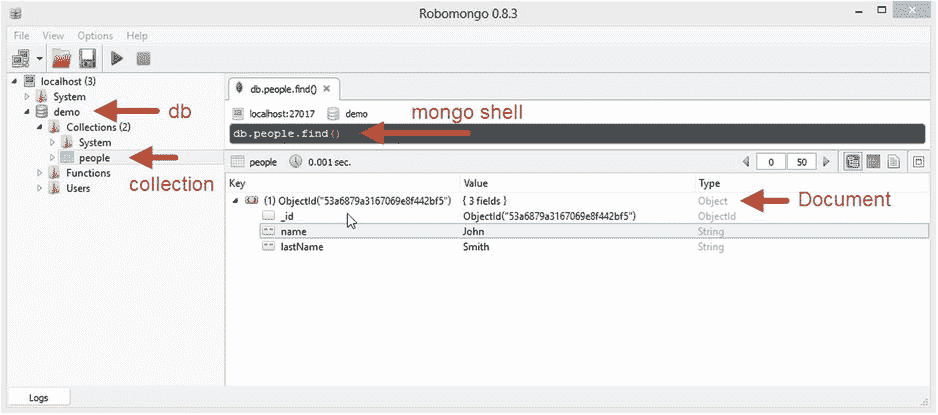

# 八、持久化数据

数据持久性是任何真实应用的重要组成部分。在这一章中，我们将为初学者提供一个可靠的数据持久化策略。我们将介绍 MongoDB 以及相关的概念，如 NoSQL、ORM 和 ODM。

NoSQL 简介

NoSQL(不仅仅是 SQL) 是一个术语，用来概括新一代数据库服务器的总体趋势。创建这些服务器是为了应对传统 SQL(结构化查询语言)关系数据库服务器(例如，Oracle 数据库、Microsoft SQL Server 和 MySQL)无法应对的挑战。这些服务器可以分为四大类:

*   文档数据库(例如，MongoDB)
*   键值数据库(例如 Redis)
*   列族数据库(例如，Cassandra)
*   图形数据库(例如，Neo4J)

*可扩展性*是所有这些的一个共同的关键动机。在大多数情况下，文档数据库提供了最大的功能集和可接受的/可伸缩的性能。对于不需要复杂查询需求的简单情况，键值数据库提供了最佳性能。

什么是文档数据库？

文档数据库是基于文档概念工作的数据库。什么是文档？一个**文档**是一个特定实体的*独立的*信息。清单 8-1 给出了一个可能的 JSON 文档。

[清单 8-1](#_list1) 。JSON 文档示例

```js
{
    "firstName": "John",
    "lastName": "Smith",
    "isAlive": true,
    "age": 25,
    "height_cm": 167.64,
    "address": {
        "streetAddress": "21 2nd Street",
        "city": "New York",
        "state": "NY",
    }
}

```

我们选择使用 JSON 来表示这个文档，但是也可以使用其他格式，比如 XML，甚至二进制格式。在关系数据库中，这样的文档将存储在两个表中，一个是人员表，另一个是地址表。在文档数据库中，它只是一个文档。

什么是键值存储？

键值存储 实际上是文档数据库的精简版本。密钥是标识文档的惟一 ID，值是实际的文档。键值存储与文档数据库的区别在于数据的查询能力。在大多数键值存储中，您只能查询键。在文档数据库中，也可以通过文档*内容*进行查询。这为键-值存储提供了一个优化的机会，以实现更快的基于键的查找，并且它们可以对值使用更压缩的存储。

Redis 是键值存储的一个很好的例子。它实际上将整个数据库保存在 RAM 中，并在后台备份到磁盘，以获得闪电般的运行时性能。

为什么是 NoSQL？

使用文档数据库和键值存储有两个原因:

*   可量测性
*   易于开发

关系设计的可伸缩性问题

在回答关系数据库难以扩展的原因之前，我们先定义几个术语:

*   **可用性:**数据是否可访问？也就是说，用户能否阅读数据并对其采取行动。
*   **一致性:**真理是否只有单一来源？如果你的所有数据只在一个地方记录一次，那么它就符合我们讨论的目的。

在单台机器上，*可用性*和*一致性*彼此紧密相连。如果有数据，就是一致的。一台服务器和一台简单的备份服务器足以满足一般企业的需求。关系服务器就是在这种情况下诞生的，在处理负载方面没有问题。

然而，在 Web 上，没有一台机器能够处理每个客户端请求的所有工作负载。此外，您可能希望将*服务器分区*，使其更靠近客户端的地理位置(例如，美国客户端与澳大利亚客户端)。为了具有可伸缩性，您需要跨机器对数据进行分区。这些分区需要相互通信，以便维护数据的*一致*视图。现在让我们引入第三个术语:

*   **分区容忍度** **:** 面对分区间的通信中断，系统继续运行。

考虑这样一种情况，我们通过一个网络分区复制数据:一台服务器在美国，另一台在澳大利亚。当两者之间的网络中断(通信中断)并且澳大利亚的一个用户请求更新数据时，我们是允许(支持*可用性*)还是拒绝请求以保持我们的*一致性*？

这就是*上限定理* *的基础。*简化来说，可以表达为:*假设你有一个网络分区，你需要在可用性和一致性之间做出选择*。这不是一个全有或全无的选择；这是一个浮动范围，您可以根据自己的业务需求做出选择。

上限定理是一个物理上容易理解的极限。为了克服它，我们可以尝试将数据分配给*从等式中移除*分区。这可以很简单地通过将数据分割成独立的单元(称为碎片)来实现。

例如，考虑一个处理美国和澳大利亚酒店的预订系统。在这里，我们可以对数据进行分片，这样，美国的服务器只包含关于美国酒店的信息，而澳大利亚的服务器只包含关于澳大利亚酒店的信息。通过这种方式，每个服务器都是独立的，并且只处理对其包含的数据的请求。对于澳大利亚酒店要求的关于美国酒店的任何信息，我们访问美国服务器，反之亦然。这让我们又回到了过去美好的单服务器场景，可用性和一致性紧密联系在一起。如果美国的服务器关闭(不可用)或从澳大利亚无法访问(网络中断)，那么对澳大利亚人的澳大利亚酒店预订做出响应是没有问题的。*这种分区不再对可用性一致性选择产生影响*。

那么，是什么使得关系数据库很难按照 CAP 定理进行扩展呢？就是*一致性边界的问题。在关系数据库模式中，鼓励你在不同的表之间建立关系。*关系使切分变得困难*。*

在文档数据库中，文档是一致性边界**。**它从一开始就被设计为独立的，数据可以很容易地进行分片。

除了分片，面向文档的数据库设计还有其他积极的性能影响。在关系数据库中，要加载实体(例如，人)的信息，还需要查询链接表(例如，地址表)。就查询响应时间而言，这是一种浪费。对于复杂的实体，您最终需要多个查询来加载单个实体。在面向文档的设计中，复杂的实体仍然只是一个单一的文档。这使得查询和加载文档更快。

易于开发

对象关系映射是计算机科学的越南。

—特德·纽沃德

关系数据库根据关系和表进行操作。为了从应用中使用或操作关系数据库中的数据，我们需要将这些“表”转换成“对象”，反之亦然。这就是对象关系映射(ORM)的过程。ORM 可能是一个繁琐的过程，通过使用文档数据库可以完全避免。对于我们的 person 文档示例，这是一个简单的`JSON.parse`问题。当然，文档数据库为您提供了一个 API 来获取从数据库返回的 JavaScript 对象，因此您不必进行任何解析，也不必使用 ORM 。

考虑关系数据库而不是 NoSQL 数据库是有现实原因的，比如复杂的查询和数据分析。然而，这些事情可以通过将关系数据库与服务于网站主要数据需求的 NoSQL 数据库并行使用来完成。

到目前为止，我们希望让你相信在网上记录数据库有真正的技术优势。这意味着您可以更好地享受本章的剩余部分，并在项目中努力考虑非关系选项。

安装 MongoDB

MongoDB 这个名字来自于 hu **mongo** us。安装 MongoDB 极其简单。它以一个简单的 zip 文件的形式发布，包含一些二进制文件，您可以将它们解压到文件系统的任何地方。压缩二进制文件可用于 Windows 以及 Mac OS X 和 Linux 系统。建议您在生产中使用 64 位版本的 MongoDB 以及 64 位操作系统。这允许 MongoDB 使用 64 位操作系统提供的所有内存地址空间。压缩文件可在`www.mongodb.org/downloads`获得。

理解二进制文件

下载 zip 文件后，将其解压到文件系统中任何有足够空间的文件夹中。你所需要的一切都包含在你为你的操作系统下载的 zip 文件中的`bin`文件夹中。MongoDB 是自包含的，只要它有写权限，它就不关心它在文件系统上的位置。它易于安装是其受欢迎的原因之一。

`bin`文件夹包含相当多的二进制文件。windows 二进制文件有一个`.exe`扩展名，但 Mac OS X 也有相同的扩展名(例如，windows 的`mongod.exe`与 Mac OS X 的`mongod`)。最重要的二进制文件如下:

*   `mongod.exe`:这是**Mongo**DB**D**aemon——也就是主服务器二进制。这是您将执行来启动数据库服务器的内容。
*   `mongo.exe`:这是一个随服务器提供的实用程序 REPL，可用于各种管理和代码探索任务。

其他二进制文件存在于`bin`文件夹中，用于导入/导出数据、收集系统统计数据以及管理 MongoDB 提供的其他功能，如分片和 MongoDB 的分布式文件系统(称为 GridFS)。这些都可以在入门的时候忽略。

为了更容易理解，在解压 zip 文件后，最好将`bin`文件夹放入系统路径。这将使`mongod`和`mongo`在你的命令提示符/终端的任何目录下都可用。

运行您的第一台服务器

MongoDB 需要一个数据目录(在 MongoDB 文献中称为`dbpath`)来存储所有数据库数据。默认的`dbpath`是`/data/db`(或者 Windows 中的`\data\db`，基于你当前工作目录的驱动，比如`C:\data\db`)。最好只指定一个显式的`dbpath` 。

首先创建一个`db`文件夹，它将包含您所有的 MongoDB 数据库数据，放在您有写权限的地方:

```js
$ mkdir db

```

现在您可以启动 MongoDB 服务器，如清单 8-2 所示。如果一切顺利，您应该会看到`waiting for connections`消息。服务器启动后，让终端保持打开状态，以保持服务器运行。

[清单 8-2](#_list2) 。用指定的数据库目录启动 MongoDB 服务器

```js
$ mongod --dbpath="./db"
Sun Jun 15 17:05:56.761 [initandlisten] MongoDB starting : pid=6076 port=27017 dbpath=./db 64- ...truncated...
Sun Jun 15 17:05:57.051 [initandlisten] waiting for connections on port 27017
Sun Jun 15 17:05:57.051 [websvr] admin web console waiting for connections on port 28017

```

MongoDB REPL

`mongo`可执行文件是 MongoDB 的一个交互式 JavaScript shell 接口。您可以使用它来进行系统管理，以及测试对数据库的查询和操作。只要你一启动它，它就试图在默认端口(`27017`)上连接到`localhost`。

REPL 提供了对一些全局变量和函数的访问，我们可以用它们来与数据库交互。最重要的是`db`变量，它是当前数据库连接的句柄。一旦 REPL 启动，你可以随时输入`exit`退出。您可以通过输入`help`获得可用选项的帮助。此外，我们将在 REPL 中使用的许多函数都有一个`'help'`成员。让我们转动`mongo` REPL，看看`db`上有哪些选项。(参见[清单 8-3](#list3) 。)

[清单 8-3](#_list3) 。使用 Mongo Shell 的示例会话

```js
$ mongo
MongoDB shell version: 2.6.1
connecting to: test
> db.help()
DB methods:
        db.adminCommand(nameOrDocument) - switches to 'admin' db, and runs command [ just calls db.runCommand(...)]
        db.auth(username, password)
        db.cloneDatabase(fromhost)
        ...truncated...
        db.version() current version of the server
> exit
bye

```

注意，默认情况下，它将我们连接到**测试**数据库。现在您已经知道了如何进出 REPL，让我们来看看几个关键的 MongoDB 概念。

重要的 MongoDB 概念

一个 MongoDB 部署包含多个数据库**。**每个数据库可以包含多个集合。每个集合可以包含多个文档**。**因此，这是一个从数据库到集合再到文档的层次结构。

文档实际上是一个我们已经熟悉的 JSON 文档，再加上一些细微之处。例如，这些文档对`Date`数据类型有一流的支持(我们在[第 4 章](04.html)中说 JSON 规范不允许`Date`作为有效值，必须序列化为字符串)。代表个人的“个人文档”就是一个例子。

一个*集合* 就是你给一个*文档集合*起的名字。将多个文档存储到同一个集合*中并不*在文档上强加任何*模式*的概念。这取决于你对你的文档语义的训练。这种无模式性使得以敏捷的方式将文档部分升级到新的模式成为可能。

最后，一个 MongoDB *服务器*可以包含多个数据库**，允许您对服务器中的一组*集合*进行逻辑分离。使用多个数据库的一个常见用例是多租户应用。多租户应用是指拥有多个客户的应用。对于每个客户，可以有不同的数据库，每个数据库中有相同的集合名称。这允许您有效地使用服务器资源，同时还允许更容易的开发(相同的集合名称)和可维护性(不同数据库的相同备份过程)。**

 **现在我们已经了解了文档、集合和数据库，让我们在`mongo` REPL 中探索它们。您可以用'`use`'命令指定 REPL 将使用的数据库(例如，`use demo`将使用`demo`数据库)。如果演示数据库不存在，将为您创建一个。变量`db`指的是当前活动的数据库。要在当前数据库中使用一个集合，您只需使用`db`上的 collection name 属性来访问它(例如，`db.people`将查看当前数据库中的 people 集合)。接下来，使用收集 API 管理单个文档。清单 8-4 提供了一个简单的例子，我们在 people 集合中插入一个人，然后查询集合中的所有人。

[清单 8-4](#_list4) 。使用 Mongo Shell 处理数据库、集合和文档

```js
$ mongo
MongoDB shell version: 2.6.1
connecting to: test
> use demo
switched to db demo
> db.people.insert({name:"John"})
WriteResult({ "nInserted" : 1 })
> db.people.find()
{ "_id" : ObjectId("539ed1d9f7da431c00026e17"), "name" : "John" }
>

```

这个例子相当简单，但是有趣的是，当我们查询文档时，我们看到它有一个`_id`字段。让我们深入探讨一下。

MongoDB _id 字段

MongoDB 中的每个文档都必须有一个“`_id`”字段。您可以为`_id`使用任何值，只要它在集合中是唯一的。默认情况下，MongoDB(提供的客户端驱动或服务器)会为您创建一个`ObjectId` 。

为什么不使用自然主键呢？

数据库开发的基本规则是主键*决不能改变*。对于一些数据模型，您可能想找到一个*自然主键*(换句话说，对于实体来说是唯一的，并且在其生命周期中不会改变。)例如，对于一个人，你可能会考虑社会安全号码(SSN) 。但是你会惊讶地发现看似普通的*自然的* *主键* 的变化。例如，在美国，如果你的生命处于危险之中，法律允许你申请新的 SSN。类似地，考虑 ISBN 的情况。如果你改变书名(看似自然的要求)，你会得到一个新的 ISBN。

在大多数情况下，您会希望使用代理主键。代理主键是对实体没有自然意义的键，但用于在数据库中唯一标识实体。MongoDB 生成的`ObjectId`就是这样一个高质量的代理键**。**

关于 ObjectId 的更多信息

既然我们已经满怀希望地让您相信使用生成的主键更好，那么问题是为什么要使用`ObjectId`？为什么不是一个自动递增的数字？因为自动递增的数字不会扩容；在分布式环境中很难管理，因为下一个号码需要知道最后使用的号码。MongoDB 生成的`ObjectId` 使用 12 字节的存储。这意味着它需要 24 个十六进制数字(每个字节 2 个数字)在一个字符串中表示，正如我们前面看到的(例如，“539ed1d9f7da431c00026e17”)。MongoDB `ObjectId`的 12 个字节的产生如图[图 8-1](#Fig1) 所示。


[图 8-1](#_Fig1) 。MongoDB ObjectId 的字节结构

前四个字节是自 EPOCH 以来以秒为单位的时间戳。这意味着使用一个`ObjectId`可以让你在*中按照对象被创建的顺序对它们进行排序。我们说*大致是*，因为产生`ObjectId`的所有机器的时钟可能不同步。*

接下来的三个字节是机器特有的，通常使用机器主机名的散列来生成。这保证了每台机器的唯一性。

接下来的两个字节取自`ObjectId`生成进程的进程 id (PID ),使其对于单台机器上的单个进程是唯一的。

重申一下，前 9 个字节保证了在一秒钟内跨机器和进程的唯一性。因此，最后三个字节是一个递增的数字，允许在一秒钟内为单台机器上的单个进程提供唯一性。由于每个字节有 256 个可能的值，这意味着我们可以在一秒钟内为每个进程生成`256^3 = 16,777,216`唯一的`ObjectId` s *。因此，在大多数情况下，您不需要担心唯一性。*

让我们在 REPL 玩一会儿。您可以使用`new` JavaScript 操作符创建一个新的`ObjectId`。另外，`ObjectId`提供了一个有用的 API 来获取`ObjectId`的创建时间(使用值的前四个字节，正如我们看到的，它包含了足够的信息)。清单 8-5 展示了这一点。

[清单 8-5](#_list5) 。从 Mongo Shell 探索 ObjectId 的示例会话

```js
$ mongo --nodb
MongoDB shell version: 2.6.1
> var id = new ObjectId()
> id
ObjectId("53a02d3979d8322ea34c4179")
> id.getTimestamp()
ISODate("2014-06-17T11:57:45Z")
>

```

请注意，我们可以启动 shell，而不需要它尝试使用`--nodb`标志连接到服务器。

mongodb 文档格式

一个 MongoDB 文档使用 BSON(**B**inary J**SON**)存储在内部。这也是 MongoDB 客户机驱动程序在网络上使用的格式。BSON 实际上是一种存储 JSON 文档的二进制方式。

BSON 提供的一个关键特性是长度前缀。换句话说，文档中的每个值都以值的长度为前缀。这使得阅读文档的人更容易跳过与当前客户端请求无关的字段。在 JSON 中，即使您想跳过一个字段，您也需要读取整个字段才能到达结束指示符(“}”或“]”)。

BSON 文档还包含有关字段值类型的信息，例如数值、字符串或布尔值。这有助于解析和执行存储优化。

此外，BSON 还提供了原始 JSON 不支持的其他原语类型，比如 UTC Datetime、原始二进制和`ObjectId`。

使用 Node.js 的 MongoDB

现在我们已经介绍了 MongoDB 的基础知识，让我们看看如何在 Node.js 应用中使用它。

MongoDB 团队维护了一个官方的 Node.js 包(`npm install mongodb`)，用于从 Node.js 与 MongoDB 服务器进行通信。MongoDB 提供的所有异步 API 都遵循 Node.js 约定，第一个参数是一个`Error`，后跟实际数据(如果有)。您到 MongoDB 服务器的主要连接是使用从 NPM 包中导出的`MongoClient` 类。清单 8-6 是一个插入一个对象，查询它，然后删除它的演示。

[清单 8-6](#_list6) 。crud/basic . jsT3】

```js
var MongoClient = require('mongodb').MongoClient;

var demoPerson = { name: 'John', lastName: 'Smith' };
var findKey = { name: 'John' };

MongoClient.connect('mongodb://127.0.0.1:27017/demo', function (err, db) {
    if (err) throw err;
    console.log('Successfully connected');

    var collection = db.collection('people');
    collection.insert(demoPerson, function (err, docs) {
        console.log('Inserted', docs[0]);
        console.log('ID:', demoPerson._id);

        collection.find(findKey).toArray(function (err, results) {
            console.log('Found results:', results);

            collection.remove(findKey, function (err, results) {
                console.log('Deleted person');

                db.close();
            });
        });
    });
});

```

在这个演示中，我们连接到`demo`数据库，然后使用`people`集合。我们在`people`系列中插入一个演示人物。注意，服务器返回实际插入的对象。还要注意，它用一个`_id`字段修改了我们的内存文档。然后，我们使用 find 方法搜索任何具有`name:'John'`的对象。最后，我们从数据库中删除所有这样的对象并断开连接。如果您有一个 MongoDB 服务器运行在`localhost`上，并且您运行这个应用，您将看到类似于[清单 8-7](#list7) 的输出。

[清单 8-7](#_list7) 。crud/basic.js 的运行示例

```js
$ node basic.js
Successfully connected
Inserted { name: 'John',
  lastName: 'Smith',
  _id: 53a14584e33487a017e6e138 }
ID: 53a14584e33487a017e6e138
Found results: [ { _id: 53a14584e33487a017e6e138,
    name: 'John',
    lastName: 'Smith' } ]
Deleted person

```

这几乎解决了 CRUD 的创建/读取/删除的基本问题。更新在 MongoDB 中确实很强大，值得拥有自己的一节。

更新文档

更新文档最简单的方法是调用集合的`save`函数 ，如[清单 8-8](#list8) 所示。

[清单 8-8](#_list8) 。update/1save.js

```js
var MongoClient = require('mongodb').MongoClient;

var demoPerson = { name: 'John', lastName: 'Smith' };
var findKey = { name: 'John' };

MongoClient.connect('mongodb://127.0.0.1:27017/demo', function (err, db) {
    if (err) throw err;

    var collection = db.collection('people');

    collection.insert(demoPerson, function (err, docs) {

        demoPerson.lastName = 'Martin';
        collection.save(demoPerson, function (err) {
            console.log('Updated');
            collection.find(findKey).toArray(function (err, results) {
                console.log(results);

                // cleanup
                collection.drop(function () { db.close() });
            });
        });
    });
});

```

您只需更新对象并将其传递回数据库。数据库通过`_id`查找对象，并按规定设置新值。`save`功能替换*整个*文档。然而，大多数时候你并不想用一个新版本替换整个*文档。这在一个分布式的数据密集型环境中是非常糟糕的。许多人可能想同时修改文档的不同字段。这就是`collection.update`方法和更新操作符的用武之地。*

更新运算符

集合的`update`函数有三个参数，一个匹配/查找想要修改的项目的对象，第二个参数指定我们想要在文档中修改的更新操作符 +属性，最后一个参数是更新完成后调用的回调。

让我们考虑一个简单的网站点击计数器的例子。许多用户可能同时访问同一个网站。如果我们从服务器上读取计数器值，在客户机上增加它的值，然后向服务器发送新值，到我们发送它的时候，原来读取的值可能已经过时了。传统上，数据库客户端会请求数据库锁定文档，通过网络向下发送值，接收更新的值，然后请求解锁文档。那会非常慢，因为网络通信需要时间。

这就是更新操作符发挥作用的地方。我们只是使用`$inc` update 操作符指示 MongoDB 在一个*单个*客户端请求中递增特定文档的当前视图计数。一旦 MongoDB 接收到请求，它就锁定文档，读取+递增值，并在服务器上解锁文档。这意味着数据库服务器处理请求的速度几乎与通过网络接收请求的速度一样快，并且没有客户端请求需要等待或重试，因为客户端请求处于挂起状态。清单 8-9 是演示这一点的一个简单例子。

[清单 8-9](#_list9) 。update/2update.js

```js
var MongoClient = require('mongodb').MongoClient;

var website = {
    url: 'http://www.google.com',
    visits: 0
};
var findKey = {
    url: 'http://www.google.com'
};

MongoClient.connect('mongodb://127.0.0.1:27017/demo', function (err, db) {
    if (err) throw err;

    var collection = db.collection('websites');

    collection.insert(website, function (err, docs) {

        var done = 0;
        function onDone(err) {
            done++;
            if (done < 4) return;

            collection.find(findKey).toArray(function (err, results) {
                console.log('Visits:', results[0].visits); // 4

                // cleanup
                collection.drop(function () { db.close() });
            });
        }

        var incrementVisits = { '$inc': { 'visits': 1 } };
        collection.update(findKey, incrementVisits, onDone);
        collection.update(findKey, incrementVisits, onDone);
        collection.update(findKey, incrementVisits, onDone);
        collection.update(findKey, incrementVisits, onDone);

    });
});

```

在这个例子中，我们演示了在不等待响应的情况下向服务器发送四个更新请求。每个请求都要求服务器将访问计数加 1。如您所见，当我们获取结果时，在所有四个请求都完成之后，访问计数确实是 4——没有一个更新请求相互冲突。

MongoDB 支持许多其他更新操作符。操作符用于设置单个字段、删除字段、在字段的当前值大于或小于我们想要的值时有条件地更新字段，等等。

此外，还有更新文档中子集合(数组)的操作符。例如，考虑文档中有一个简单的`tags`字段的情况，它是一个字符串数组。多个用户可能想要更新这个数组—一些用户想要添加一个标签，另一些用户想要删除一个标签。MongoDB 允许您使用`$push`(添加一个项目)和`$pull`(删除一个项目)更新操作符来更新服务器上的数组，这样您就不会覆盖整个数组。

猫鼬 ODM

正如我们所看到的，MongoDB 处理的是非常简单的 JSON 文档。这意味着对文档进行操作的业务逻辑(函数/方法)必须存在于其他地方。使用对象文档映射器(ODM) 我们可以将这些简单的文档映射成完整形式的 JavaScript 对象(使用数据+方法进行验证和其他业务逻辑)。最流行的(并且得到 MongoDB 团队支持的)是 mongose ODM(`npm install mongoose`)。

正在连接到 MongoDB

您可以使用 Mongoose 连接到 MongoDB，方式类似于我们前面看到的本地驱动程序。清单 8-10 是一个直接来自文档的简单例子。

[清单 8-10](#_list10) 。ODM/connection . jsT3】

```js
var mongoose = require('mongoose');

mongoose.connect('mongodb://127.0.0.1:27017/demo');

var db = mongoose.connection;
db.on('error', function (err) { throw err });
db.once('open', function callback() {
    console.log('connected!');
    db.close();
});

```

我们使用`connect`成员函数进行连接。然后，我们使用`mongoose.connection`访问数据库对象，并等待 open 事件触发，这表示连接成功。最后，我们关闭连接以退出应用。

猫鼬图式和模型

猫鼬的核心是`Schema`类。`schema`定义了文档的所有字段以及它们的类型(用于验证目的)和它们在序列化过程中的行为等。

在定义了`Schema`之后，编译它来创建一个`Model`函数，这只是一个将简单的对象文字转换成 JavaScript 对象的奇特构造函数。这些 JavaScript 对象具有您使用`Schema`设置的行为。除了创建这些域对象的能力之外，模型还具有静态成员函数，您可以使用这些函数来创建、查询、更新和删除数据库中的文档。

作为例子，考虑一个简单的坦克`Schema`。坦克有名称和尺寸(小型、中型和大型)。我们可以非常简单地定义坦克`Schema`:

```js
var tankSchema = new mongoose.Schema({ name: 'string', size: 'string' });
tankSchema.methods.print = function () { console.log('I am', this.name, 'the', this.size); };

```

我们还使用`Schema`定义了在`Model`实例上可用的方法(例如，我们指定了`print`方法)。既然有了`Schema`，那就做个模型吧。该模型将`Schema`链接到一个数据库集合，并允许您管理(CRUD)模型实例。从一个`Schema`创建一个`Model`非常简单:

```js
// Compile it into a model
var Tank = mongoose.model('Tank', tankSchema);

```

要创建模型的实例，可以像普通的 JavaScript 构造函数那样调用它，并传入原始文档/对象文字:

```js
var tony = new Tank({ name: 'tony', size: 'small' });
tony.print(); // I am tony the small

```

你可以看到我们在`Schema`中定义的方法(比如`print`)在相应的模型实例上是可用的。此外，所有的`Model`实例都有成员函数来管理它们与数据库的交互，比如保存/删除/更新。在[清单 8-11](#list11) 中显示了一个`save`调用的例子。

[清单 8-11](#_list11) 。保存/更新一个猫鼬模型实例

```js
var tony = new Tank({ name: 'tony', size: 'small' });
tony.save(function (err) {
  if (err) throw err;

  // saved!
})

```

另外，`Model`类有静态(独立于模型实例)成员函数来管理相关集合中的所有数据库文档。例如，要找到一个模型实例，您可以使用`findOne`静态函数，如[清单 8-12](#list12) 所示。

[清单 8-12](#_list12) 。使用猫鼬进行单品查询

```js
Tank.findOne({ name: 'tony' })
    .exec(function (err, tank) {

    // You get a model instance all setup and ready!
    tank.print();
});

```

结合我们所看到的，清单 8-13 提供了一个完整的例子，你可以自己运行。

[清单 8-13](#_list13) 。odm/basic.js

```js
var mongoose = require('mongoose');

// Define a schema
var tankSchema = new mongoose.Schema({ name: 'string', size: 'string' });
tankSchema.methods.print = function () { console.log('I am', this.name, 'the', this.size); };

// Compile it into a model
var Tank = mongoose.model('Tank', tankSchema);

mongoose.connect('mongodb://127.0.0.1:27017/demo');
var db = mongoose.connection;
db.once('open', function callback() {
    console.log('connected!');

    // Use the model
    var tony = new Tank({ name: 'tony', size: 'small' });
    tony.print(); // I am tony the small

    tony.save(function (err) {

        Tank.findOne({ name: 'tony' }).exec(function (err, tank) {

            // You get a model instance all setup and ready!
            tank.print();

            db.collection('tanks').drop(function () { db.close();})
        });
    });
});

```

最后一件需要特别注意的事情是，查询函数(例如，`find`，`findOne`)是可以链接的。这允许您通过添加函数调用来构建高级查询。在您调用`exec`函数之后，最终的查询被发送到服务器。例如，使用一个假设的`Person`模型，[清单 8-14](#list14) 中的代码搜索洛杉矶的前 10 个姓氏为 Ghost 的人，年龄在 17 到 66 岁之间。

[清单 8-14](#_list14) 。演示复杂查询的示例

```js
Person
.find({ city: 'LA' })
.where('name.last').equals('Ghost')
.where('age').gt(17).lt(66)
.limit(10)
.exec(callback);

```

使用 MongoDB 作为分布式会话存储

在第 7 章的[中，我们看到了如何通过使用`cookie-session`中间件来使用 cookies 存储用户会话信息。然而，我们指出，使用 cookie 来存储*所有*您的会话信息是一个坏主意，因为 cookie 需要来自每个请求的客户端，并且您受到 cookie 大小的限制。](07.html)

理想情况下，您应该尽可能让您的 web 应用无状态。然而，对于某些类型的应用，您可能需要用户会话中的大量信息。这就是`express-session`中间件(`npm install express-session`)的用武之地。

默认情况下，`express-session`中间件将使用内存存储来维护用户会话信息。发送到客户端的 cookie 将只指向这个服务器内存存储中的密钥。考虑清单 8-15 中的[服务器，它基于我们在第 7 章](#list15)中看到的 cookie 会话服务器。我们所做的只是用`express-session`中间件替换了`cookie-session`中间件。

[清单 8-15](#_list15) 。session/inmemory.js

```js
var express = require('express');
var expressSession = require('express-session');

var app = express()
    .use(expressSession({
        secret: 'my super secret sign key'
    }))
    .use('/home', function (req, res) {
        if (req.session.views) {
            req.session.views++;
        }
        else {
            req.session.views = 1;
        }
        res.end('Total views for you: ' + req.session.views);
    })
    .use('/reset', function (req, res) {
        delete req.session.views;
        res.end('Cleared all your views');
    })
    .listen(3000);

```

如果你打开浏览器并访问`http://localhost:3000/home`，你会看到它的行为和预期的一样——每次刷新页面，你的浏览量都会增加。但是，如果您重新启动 Node.js 服务器并再次刷新浏览器，计数将回到 1。这是因为服务器内存在重启时被清空。用户 cookie 只包含服务器内存中会话值的密钥，而不包含实际的会话值。对网络性能有利(cookie 是轻量级的)，对可伸缩性不利，因为会话值被限制到单个服务器上的单个进程。

这就是`express-session`中间件的`store`配置选项的用武之地。商店可用于各种数据库，但是因为我们正在讨论 MongoDB，所以让我们使用它。MongoDB 会话存储由`connect-mongo` ( `npm install connect-mongo` ) NPM 包提供。使用它非常简单——获得对`MongoStore`类的引用，并创建一个 store 实例，为您想要连接的数据库传递连接配置。[清单 8-16](#list16) 提供了完整的例子，突出显示了更改的部分。

[清单 8-16](#_list16) 。会话/分布式. js

```js
var express = require('express');
var expressSession = require('express-session');

var MongoStore = require('connect-mongo')(expressSession);
var sessionStore = new MongoStore({
    host: '127.0.0.1',
    port: '27017',
    db: 'session',
});

var app = express()
    .use(expressSession({
        secret: 'my super secret sign key',
        store: sessionStore
    }))
    .use('/home', function (req, res) {
        if (req.session.views) {
            req.session.views++;
        }
        else {
            req.session.views = 1;
        }
        res.end('Total views for you: ' + req.session.views);
    })
    .use('/reset', function (req, res) {
        delete req.session.views;
        res.end('Cleared all your views');
    })
    .listen(3000);

```

确保本地运行 MongoDB，并启动 Node.js 服务器。如果你现在访问`http://localhost:3000/home`,你会得到和以前一样的行为，除了这一次，你可以安全地重启你的服务器，如果用户重新加载页面，最后的浏览计数被保留。这里最重要的一点是，可能有许多 Node.js 服务器与 MongoDB farm 对话，无论哪个 Node.js 服务器处理请求，用户行为都是相同的。

经验:当您想在用户会话中只存储少量信息时，请使用`cookie-session`。当您的会话信息太多时，使用带有后备存储的`express-session`。

管理 MongoDB

当您刚开始使用 MongoDB 时，仅仅使用像`mongo`这样的 REPL 可能会令人生畏。最终，它对于快速查找是有用的，但是对于初学者来说，更好的 GUI 工具可能是救命稻草。为了管理生产服务器，MongoDB 团队本身提供了托管的 MongoDB 管理服务(MMS ) 。

对于开发时间，我们想推荐 Robomongo 桌面应用(`http://robomongo.org/`)。这是一个开源应用，正在积极开发中，他们为 Windows ( `.msi`)和 Mac OS X ( `.dmg`)提供安装程序。

一旦安装完毕，你只需启动软件，连接到 MongoDB 服务器，你就可以看到数据库、集合和文档，如图 8-2 所示。这个应用的一个优点是它将`mongo` shell 集成到了它的 GUI 中，因此您所有的终端技能在这里都是相关的。



[图 8-2](#_Fig2) 。Robomongo 的截图，突出显示了重要部分

额外资源

MongoDB 中的多租户:`http://support.mongohq.com/use-cases/multi-tenant.html`

BSON 语言规范:`http://bsonspec.org/`

蒙戈布 ObjectId: `http://api.mongodb.org/java/current/org/bson/types/ObjectId.html`

MongoDB 更新操作符:`http://docs.mongodb.org/manual/reference/operator/update/`

猫鼬 ODM: `http://mongoosejs.com/`

MongoDB 管理服务:`www.mongodb.com/mongodb-management-service`

摘要

在这一章中，我们研究了使用文档数据库的动机。然后，我们研究了 MongoDB，解释了重要的概念，并展示了在 Node.js 应用中使用 MongoDB 的支持方式。

关于 MongoDB、Mongoose 和查询/索引还有很多可以说的，但是我们在这里介绍的内容应该足以让您自己轻松地探索这个 API。**