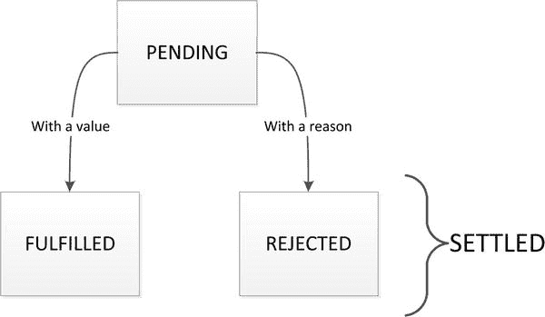

# 十、简化回调

Node.js 的事件/异步特性意味着有可能以深度嵌套的回调结束。JavaScript 中有多种策略可以帮助减少回调嵌套。在这一章中，我们将探索这些模式。这些有助于保持可读性，但更重要的是，这些策略将有助于降低 bug 爬上你的可能性。我保证。

复试地狱

请注意，在我们探讨这一部分时，情况似乎很糟糕。别担心。当我们在下一节看应许时，你会发现彩虹尽头的那罐金子。

回调的一个明显问题是*增加的缩进量*。这被亲切地称为回调*末日金字塔*。考虑一下[清单 10-1](#list1) 中的简单情况，我们需要调用三个异步函数(例如，这些函数可能是数据库搜索、选择和保存项目)。

[清单 10-1](#_list1) 。金字塔/indented.js

```js
function first(data, cb) {
    console.log('Executing first');
    setTimeout(cb, 1000, data);
}

function second(data, cb) {
    console.log('Executing second');
    setTimeout(cb, 1000, data);
}

function third(data, cb) {
    console.log('Executing third');
    setTimeout(cb, 1000, data);
}

first('data', function (text1) {
    second(text1, function (text2) {
        third(text2, function (text3) {
            console.log('done:', text3); // indented
        });
    });
});

```

正如你所看到的，这对眼睛来说并不容易。一个简单的解决办法是命名处理程序，这样你就可以组合它们而不必将它们放在内联，如清单 10-2 所示。

[清单 10-2](#_list2) 。pyramid/simplify.js

```js
function first(data, cb) {
    console.log('Executing first');
    setTimeout(cb, 1000, data);
}

function second(data, cb) {
    console.log('Executing second');
    setTimeout(cb, 1000, data);
}

function third(data, cb) {
    console.log('Executing third');
    setTimeout(cb, 1000, data);
}

// Named handlers
function handleThird(text3) {
    console.log('done:', text3); // no indent!
}

function handleSecond(text2) {
    third(text2, handleThird);
}

function handleFirst(text1) {
    second(text1, handleSecond);
}

// Start the chain
first('data', handleFirst);

```

这就解决了金字塔问题。注意，我们有相反的处理程序(`third, second, first`)，因为在使用它们之前声明函数是好的。

然而，除了我们已经修复的明显的缩进问题之外，与简单的同步编程相比，对控制流使用回调还有真正的技术问题。首先，它混淆了输入和输出——也就是说，我们使用一个回调函数，它是一个输入，实际上是返回值，它是同步函数中的一个输出。

此外，它不能很好地处理控制流原语(if、else、for 和 while)。此外，错误处理可能很难正确。让我们更深入地研究一下这些问题，以便理解这些概念。

如果/否则在异步世界中

如果您有条件地需要在一个函数中进行异步操作，您必须确保整个函数是异步的。清单 10-3 是展示这种复杂性的一个简单例子。

[清单 10-3](#_list3) 。ifelse/bad.js

```js
// WARNING! DO NOT USE!
function maybeSync(arg, cb) {
    if (arg) { // We already have data
        // BAD! Do not call synchronously!
        cb('cached data');
    }
    else { // We need to load data
        // simulate a db load
        setTimeout(function () {
            cb('loaded data')
        }, 500);
    }
}
// Without the intimate details of maybeSync
// its difficult to determine if
//     - foo is called first
//     OR
//     - bar is called first

maybeSync(true, function (data) {
    foo();
});
bar();

function foo() { console.log('foo') }
function bar() { console.log('bar') }

```

不看`maybeSync`函数的代码，开发者不可能知道是先调用`foo`还是先调用`bar`。事实上，在我们的例子中，`foo`将被立即调用，而异步开发者会假设`bar`将被首先调用，而`foo`将在*稍后被调用，就像任何其他异步操作一样。这里之所以不是这种行为，是因为`maybeSync`写得很差，根据某种条件立即调用回调。正确的方法是使用`process.nextTick`函数(正如我们在[第 3 章](03.html)中看到的)为事件循环的下一个滴答安排回调。[清单 10-4](#list4) 显示了修复的`maybeSync`功能(重命名为`alwaysAsync`)。*

[清单 10-4](#_list4) 。ifelse/good.js

```js
function alwaysAsync(arg, cb) {
    if (arg) { // We already have data
        // setup call for next tick
        process.nextTick(function () {
            cb('cached data');
        });
    }
    else { // We need to load data
        // simulate a db load
        setTimeout(function () {
            cb('loaded data')
        }, 500);
    }
}

alwaysAsync(true, function (data) {
    foo();
});
bar();

function foo() { console.log('foo') }
function bar() { console.log('bar') }

```

**简单的教训:**如果一个函数接受回调，那么它是异步的，它永远不应该直接调用回调——`process.nextTick`是你的朋友。

同样值得一提的是，对于基于浏览器的代码，您可以使用`setImmediate`(如果有的话)或`setTimeout`。

异步世界中的循环

考虑通过 HTTP 请求获取两个项目并使用其中包含的数据的简单情况。一个简单的方法如清单 10-5 所示。

[清单 10-5](#_list5) 。loop/simple.js

```js
// an async function to load an item
function loadItem(id, cb) {
    setTimeout(function () {
        cb(null, { id: id });
    }, 500);
}

// functions to manage loading
var loadedItems = [];
function itemsLoaded() {
    console.log('Do something with:', loadedItems);
}
function itemLoaded(err, item) {
    loadedItems.push(item);
    if (loadedItems.length == 2) {
        itemsLoaded();
    }
}

// calls to load
loadItem(1, itemLoaded);
loadItem(2, itemLoaded);

```

在这里，我们简单地维护一个数组(`loadedItems`)来存储落下的条目，然后在获得所有条目后运行`itemsLoaded`函数。有一些库可以使这样的控制流操作更加简单。其中最突出的是异步(`npm install async`)。使用`async`重写的相同示例显示在[清单 10-6](#list6) 中。

[清单 10-6](#_list6) 。loop/async.js

```js
// an async function to load an item
function loadItem(id, cb) {
    setTimeout(function () {
        cb(null, { id: id });
    }, 500);
}

// when all items loaded
function itemsLoaded(err, loadedItems) {
    console.log('Do something with:', loadedItems);
}

// load in parallel
var async = require('async');
async.parallel([
    function (cb) {
        loadItem(1, cb);
    },
    function (cb) {
        loadItem(2, cb);
    }
], itemsLoaded)

```

如您所见，我们不再需要手动维护已完成/已提取项目的列表。`async.parallel`函数将一个函数数组作为它的第一个参数。每个函数都被传递了一个回调函数，您应该以标准的Node方式调用这个回调函数——换句话说，首先是错误参数，然后是实际的返回值。我们的`loadItem`函数已经正确地调用了它的回调函数，所以我们只是把`async`的回调函数交给它。最后，`async`将调用作为第二个参数传入的函数(`itemsLoaded`)，一旦数组中的所有函数都调用了它们的回调函数。我们得到的行为与我们在前面的例子中手动完成的行为完全相同。

还要注意的是`async`支持我们在这个例子中免费获得的单个项目之间的错误聚合(尽管我们在这里没有出错的机会)。如果您需要的话，`async`还支持其他控制流原语(比如串行控制流)。

这里的教训是，与简单的同步编程相比，异步确实会使控制流变得更加复杂，尽管并不令人望而却步。现在让我们看看回调的最大问题。

错误处理

对异步任务使用回调的最大问题是错误处理的复杂性。让我们看一个具体的例子来巩固这个概念。考虑一个简单的例子，创作一个从文件加载 JSON 的异步版本。这种任务的同步版本如清单 10-7 所示。

[清单 10-7](#_list7) 。错误/同步. js

```js
var fs = require('fs');

function loadJSONSync(filename) {
    return JSON.parse(fs.readFileSync(filename));
}

// good json file
console.log(loadJSONSync('good.json'));

// non-existent json file
try {
    console.log(loadJSONSync('absent.json'));
}
catch (err) {
    console.log('absent.json error', err.message);
}

// invalid json file
try {
    console.log(loadJSONSync('bad.json'));
}
catch (err) {
    console.log('bad.json error', err.message);
}

```

这个简单的`loadJSONSync`函数有三种行为:一个有效的返回值、一个文件系统错误或者一个`JSON.parse`错误。我们用一个简单的`try/catch`来处理错误，就像你在用其他语言进行同步编程时所习惯的那样。明显的性能缺点是，当从文件系统中读取文件时，没有其他 JavaScript 可以执行。现在让我们制作一个这样的函数的异步版本。清单 10-8 中的[展示了一个简单的错误检查逻辑。](#list8)

[清单 10-8](#_list8) 。摘自 errors/asyncsimple.js

```js
var fs = require('fs');

function loadJSON(filename, cb) {
    fs.readFile(filename, function (err, data) {
        if (err) cb(err);
        else cb(null, JSON.parse(data));
    });
}

```

很简单——它接受回调并将任何文件系统错误传递给回调。如果没有文件系统错误，它返回`JSON.` `parse` 结果。使用基于回调的异步函数时，需要记住以下几点:

1.  千万不要打两次回电。
2.  永远不要抛出错误。

然而，这个简单的函数不能适应第二点。事实上，`JSON.parse`如果传递给 bad JSON 就会抛出一个错误，回调永远不会被调用，应用崩溃，如[清单 10-9](#list9) 所示。

[清单 10-9](#_list9) 。来自 errors/asyncsimple.js 的片段

```js
// load invalid json
loadJSON('bad.json', function (err, data) {
    // NEVER GETS CALLED!
    if (err) console.log('bad.json error', err.message);
    else console.log(data);
});

```

解决这个问题的一个天真的尝试是将`JSON.parse`包装在`try` / `catch`中，如清单 10-10 中的[所示。](#list10)

[清单 10-10](#_list10) 。errors/asyncbadcatch.js

```js
var fs = require('fs');

function loadJSON(filename, cb) {
    fs.readFile(filename, function (err, data) {
        if (err) {
            cb(err);
        }
        else {
            try {
                cb(null, JSON.parse(data));
            }
            catch (err) {
                cb(err);
            }
        }
    });
}

// load invalid json
loadJSON('bad.json', function (err, data) {
    if (err) console.log('bad.json error', err.message);
    else console.log(data);
});

```

然而，在这段代码中有一个微妙的错误。如果回调(`cb`)而不是`JSON.parse`)抛出一个错误，`catch`执行，我们再次调用回调，因为我们把它包装在了`try/catch`中。换句话说，回调被调用了两次！这在[清单 10-11](#list11) 中有所展示。清单 10-12 中的示例执行。

[清单 10-11](#_list11) 。errors/asyncbadcatchdemo.js

```js
var fs = require('fs');

function loadJSON(filename, cb) {
    fs.readFile(filename, function (err, data) {
        if (err) {
            cb(err);
        }
        else {
            try {
                cb(null, JSON.parse(data));
            }
            catch (err) {
                cb(err);
            }
        }
    });
}

// a good file but a bad callback ... gets called again!
loadJSON('good.json', function (err, data) {
    console.log('our callback called');

    if (err) console.log('Error:', err.message);
    else {
        // lets simulate an error by trying to access a property on an undefined variable
        var foo;
        console.log(foo.bar);
    }
});

```

[清单 10-12](#_list12) 。errors/asyncbadcatchdemo.js 的运行示例

```js
$ node asyncbadcatchdemo.js
our callback called
our callback called
Error: Cannot read property 'bar' of undefined

```

回调被调用两次的原因是因为我们的`loadJSON`函数错误地将回调包装在了`try`块中。这里有一个简单的教训需要记住。

**简单的教训:**把你所有的同步代码包含在一个`try` / `catch`、*中，除了*当你调用回调的时候。

根据这个简单的经验，我们有了一个全功能的异步版本的`loadJSON`，如[清单 10-13](#list13) 所示。

[清单 10-13](#_list13) 。错误/asyncfinal.js

```js
var fs = require('fs');

function loadJSON(filename, cb) {
    fs.readFile(filename, function (err, data) {
        if (err) return cb(err);
        try {
            var parsed = JSON.parse(data);
        }
        catch (err) {
            return cb(err);
        }
        return cb(null, parsed);
    });
}

```

我们唯一一次调用回调是在任何`try/catch`之外。包装中的其他东西都是一个`try/catch`。也是我们`return`对任何电话的回拨。

诚然，一旦你做了几次，这并不难做到，但尽管如此，为了良好的错误处理，还是要编写大量的模板代码。现在让我们看看使用 promises 处理异步 JavaScript 的更好的方法。

承诺介绍

在我们看到承诺如何极大地简化异步 JavaScript 之前，我们需要很好地理解`Promise`的行为。承诺很快(当 ECMAScript 6 最终完成时)将成为标准 JavaScript 运行时的一部分。在此之前，我们需要使用第三方库。到目前为止，最流行的是 Q ( `npm install q`)，我们这里就用这个。围绕 promises 的效用函数在各个库中是不同的，但是来自所有好的库中的`Promise`实例是相互兼容的，因为它们都遵循“Promises/A+”规范。该规范也将成为 ECMAScript 6 的一部分，因此您的知识是未来安全的。在本节中，我们将解释这个概念，然后指出承诺相对于回调的优势。

创造一个承诺

在详细解释承诺之前，我们将查看代码。先说创造一个承诺，Q 风格。在[清单 10-14](#list14) 中，我们创建了一个承诺，使用`promise.then`成员函数订阅其完成，并最终解析该承诺。

[清单 10-14](#_list14) 。 promiseintro/create.js

```js
var Q = require('q');

var deferred = Q.defer();
var promise = deferred.promise;

promise.then(function (val) {
    console.log('done with:', val);
});

deferred.resolve('final value'); // done with: final value

```

`then`函数还有很多，我们将在下一节详细讨论。我们在这个例子中的重点是创造一个承诺。 `Q.defer()`为你提供了一个对象(一个`deferred`)

1.  包含了承诺(`deferred.promise`)，并且
2.  包含解决(`deferred.resolve`)或拒绝(`deferred.reject`)上述承诺的功能。

在`promise`和控制承诺的事物(即`deferred`对象)之间的这种分离是有充分理由的。它允许你给任何人`promise`，并且仍然控制何时以及如何解决它，如清单 10-15 中的[所示。](#list15)

[清单 10-15](#_list15) 。promise intro/separate . js

```js
var Q = require('q');

function getPromise() {
    var deferred = Q.defer();

    // Resolve the promise after a second
    setTimeout(function () {
        deferred.resolve('final value');
    }, 1000);

    return deferred.promise;
}

var promise = getPromise();

promise.then(function (val) {
    console.log('done with:', val);
});

```

所以现在我们知道如何创造一个承诺。使用承诺的一个直接好处是功能输入和输出被清楚地定义。

**Promise 优点:**我们没有使用回调(这是一个输入)来提供输出，而是使用`return`Promise，它可以在您方便的时候用来订阅输出。

现在让我们看看承诺状态(已解决、已拒绝和待定)。

承诺状态

承诺只能是三种状态之一:待定、履行或拒绝。它们之间有一个状态转换图，如图[图 10-1](#Fig1) 所示。



[图 10-1](#_Fig1) 。Promsie 国家和命运

基于这些箭头，承诺只能从一种状态转换到另一种状态。例如，一个已经实现的承诺不可能被拒绝。此外，它的实现值或被拒绝的原因不能改变。图表中还显示，如果承诺被履行或拒绝，我们说它已经解决。

**Promise advantage:** 由于 Promise 到 fulfilled 或 rejected 的转换是不可变的，所以所有单个的`onFulfilled` / `onRejected`处理程序将只被调用一次。承诺不会有*再叫*回调的问题。

您可以使用我们前面看到的延迟对象手动转换一个承诺。但是，最常见的是(几乎总是)，一些函数会给你一个承诺，从那时起，你使用`then`函数来创建、履行或拒绝承诺。

Then 和 Catch 基础

成员函数是 promise API 的核心。在最基本的层面上，您可以使用它来订阅承诺结算结果。它有两个函数(称为`onFulfilled`和`onRejected`处理程序)，根据承诺的最终状态(完成或拒绝)调用。然而，我们建议只将`onFulfilled`处理程序传递给`then`函数。

类似于承诺上的`then`函数，还有一个`catch`函数。`catch`函数只接受`onRejected`处理程序。因此，传统上只有`then`函数中的`onFulfilled`处理程序，后面是带有`onRejected`处理程序的`catch`函数。这两个函数如[清单 10-16](#list16) 所示。

[清单 10-16](#_list16) 。 thencatch/settle.js

```js
var Q = require('q');

var willFulfillDeferred = Q.defer();
var willFulfill = willFulfillDeferred.promise;
willFulfillDeferred.resolve('final value');

willFulfill
    .then(function (val) {
        console.log('success with', val); // Only fulfill handler is called
    })
    .catch(function (reason) {
        console.log('failed with', reason);
    });

var willRejectDeferred = Q.defer();
var willReject = willRejectDeferred.promise;
willRejectDeferred.reject(new Error('rejection reason')); // Note the use of Error

willReject
    .then(function (val) {
        console.log('success with', val);
    })
    .catch(function (reason) {
        console.log('failed with', reason); // Only reject handler is called
    });

```

注意，用一个`Error`对象拒绝一个承诺是很常见的，因为它提供了一个堆栈跟踪。这类似于向回调传递错误参数时使用`Error`的建议。另外，`then/catch`模式应该让你想起同步编程中的`try/catch`模式。

同样值得一提的是，`catch(function(){})`对于`then(null,function(){})`来说只是糖。所以`catch`的行为在很多方面会和`then`非常相似。

注意，如清单 10-16 中的[所示，当我们调用`then/catch`方法时，承诺是否已经完成并不重要。如果当承诺完成时(这可能已经发生了，就像我们的例子一样)，处理程序将被调用*。*](#list16)

您可以使用清单 10-17 中的[成员函数创建一个已经履行的承诺。](#list17)

[清单 10-17](#_list17) 。thencatch/fulfilled.js

```js
var Q = require('q');

Q.when(null).then(function (val) {
    console.log(val == null); // true
});

Q.when('kung foo').then(function (val) {
    console.log(val); // kung foo
});

console.log('I will print first because *then* is always async!');

```

当您使用`Q.when`开始一个承诺链时(我们接下来将查看承诺链)，通常使用`when(null)`。否则，您可以创建具有任意值的已解决承诺(例如，`kung foo`)。注意，如本例所示，`then`回调(`onFulfilled/onRejected`)在同步代码执行后异步执行。

**承诺优势:**承诺不会遭受*也许同步*回调的问题。如果您想返回一个即时承诺，只需使用`Q.when`返回一个已解决的承诺，用户注册的任何`then`必定会被异步调用。

类似于`when`函数，有一个`Q.reject`函数创建一个已经被拒绝的承诺，如清单 10-18 中的[所示。如果在某个输入参数中发现错误，您可能希望从函数中返回一个被拒绝的承诺。](#list18)

[清单 10-18](#_list18) 。然后 catch/rejected.js

```js
var Q = require('q');

Q.reject(new Error('denied')).catch(function (err) {
    console.log(err.message); // denied
});

```

那时的连锁能力

承诺的连锁能力是他们最重要的特征。一旦你有了一个承诺，你使用`then`函数来创建一个履行或拒绝承诺的链。

最重要的行为是从`onFulfilled`处理程序(或`onRejected`处理程序)返回的值被包装在一个新的承诺中。这个新的承诺是从`then`函数返回的，该函数允许您一个接一个地连锁承诺。这显示在[清单 10-19](#list19) 中。

[清单 10-19](#_list19) 。chainability/chain.js

```js
var Q = require('q');

Q.when(null)
    .then(function () {
        return 'kung foo';
    })
    .then(function (val) {
        console.log(val); // kung foo
        return Q.when('panda');
    })
    .then(function (val) {
        console.log(val); // panda
        // Nothing returned
    })
    .then(function (val) {
        console.log(val == undefined); // true
    });

```

注意，如果您从`then`处理程序返回一个承诺(例如，我们在第二个`then`函数中将解决的承诺返回给一只熊猫)，下一个`then`处理程序将在调用适当的处理程序之前等待承诺解决(解决或拒绝)。

如果在任何时候有一个未被捕获的异常，或者处理程序返回一个被(或将被)拒绝的承诺，那么不再调用进一步的`onFulfilled`处理程序。该链继续运行，直到找到某个`onRejected`处理程序，此时该链被重置并基于从`onRejected`处理程序返回的值继续运行，如清单 10-20 中的[所示。](#list20)

[清单 10-20](#_list20) 。chain ability/chainwitherror . js

```js
var Q = require('q');

Q.when(null)
    .then(function () {
        throw new Error('panda'); // uncaught exception
    })
    .then(function (val) {
        console.log('!!!!!', val); // I will never get called
    })
    .catch(function (reason) {
        console.log('Someone threw a', reason.message);
        return 'all good';
    })
    .then(function (val) {
        console.log(val); // all good
        return Q.reject(new Error('taco'));
    })
    .then(function (val) {
        console.log('!!!!!', val); // I will never get called
    })
    .catch(function (reason) {
        console.log('Someone threw a', reason.message);
    });

```

在这个例子中，无论何时出现错误或拒绝承诺，都不会调用进一步的`onFulfilled`处理程序(我们使用`then`函数注册它)，直到某个`onRejected`处理程序(使用`catch`函数注册)处理了错误。

**承诺优势:**在`onFulfilled/onRejected`处理程序中未被捕获的异常不会破坏应用。相反，它们会导致链中的承诺被拒绝，您可以使用最终的`onRejected`处理程序优雅地处理这个问题。

最常见的是，你的承诺链看起来就像[清单 10-21](#list21) 中的那样。注意它和同步编程的`try` / `catch`语义是多么的相似。

[清单 10-21](#_list21) 。chainability/demoChain.js 片段

```js
somePromise
    .then(function (val) { /* do something */ })
    .then(function (val) { /* do something */ })
    .then(function (val) { /* do something */ })
    .then(function (val) { /* do something */ })
    .then(function (val) { /* do something */ })
    .catch(function (reason) { /* handle the error */ });

```

将回电转化为承诺

在这一节中，我们将看到如何用经典的 Node.js 异步模式互操作`Promises`。有了这些知识，我们将重温一下`loadJSON`的例子，看看它有多简单。

与 nodeback 接口

既然您已经部分理解了 Promise API，那么最直接的问题很可能是与Node回调风格函数(亲切地称为 *nodeback* )的互操作性。Node返回只是一个函数，它

*   接受 n 个参数，最后一个是回调，并且
*   用`(error)`或`(null, value)`或`(null, value1, value2,...)`调用回调。

这是核心 Node.js 模块以及可靠的社区编写模块中函数的风格。

将 nodeback 样式的函数转换为 promises 是一个简单的任务，调用 `Q.nbind`，它接受一个 nodeback 样式的函数，包装它，并返回一个新函数，该函数执行以下操作:

*   接受与 nodeback 函数相同的前 n-1 个参数(即除回调参数之外的所有参数),并将它们与内部回调函数一起静默传递给 nodeback 函数
*   返回一个承诺
    *   如果内部回调是由带有非空错误参数的 nodeback 函数调用的(换句话说，`(error)`情况)，则被拒绝，
    *   如果回调被 nodeback 函数调用，如`(null, value)`，则解析为`value`，并且
    *   如果回调被 nodeback 函数调用，如`(null, value1,value2,...)`，则解析为数组`[value1, value2,...]`。

在[清单 10-22](#list22) 中，我们展示了一个将 nodeback 风格的函数转换成带有承诺的函数的实例。

[清单 10-22](#_list22) 。interop/nodeback.js

```js
function data(delay, cb) {
    setTimeout(function () {
        cb(null, 'data');
    }, delay);
}

function error(delay, cb) {
    setTimeout(function () {
        cb(new Error('error'));
    }, delay);
}

// Callback style
data(1000, function (err, data) { console.log(data); });
error(1000, function (err, data) { console.log(err.message); });

// Convert to promises
var Q = require('q');
var dataAsync = Q.nbind(data);
var errorAsync = Q.nbind(error);

// Usage
dataAsync(1000)
    .then(function (data) { console.log(data); });

errorAsync(1000)
    .then(function (data) { })
    .catch(function (err) { console.log(err.message); });

```

该示例说明了这种转换的简单性。事实上，你甚至可以内联地调用它，例如，`Q.nbind(data)(1000)`。注意我们使用 `-Async`后缀来表示返回承诺的转换Node返回函数的约定。这是对核心Node使用的 `-Sync`后缀的一种玩法，用于 nodeback 函数的同步版本。你会在社区中找到其他类似的例子。

现在让我们重温一下我们的`loadJSON`例子，重写一个使用承诺的异步版本。我们需要做的就是读取文件内容，然后将它们解析为 JSON，这样就完成了。这在[清单 10-23](#list23) 中有所说明。

[清单 10-23](#_list23) 。 interop/ loadJSONAsync.js

```js
var Q = require('q');
var fs = require('fs');
var readFileAsync = Q.nbind(fs.readFile);

function loadJSONAsync(filename) {
    return readFileAsync(filename)
                .then(function (res) {
                    return JSON.parse(res);
                });
}

// good json file
loadJSONAsync('good.json')
    .then(function (val) { console.log(val); })
    .catch(function (err) {
        console.log('good.json error', err.message); // never called
    })
// non-existent json file
    .then(function () {
        return loadJSONAsync('absent.json');
    })
    .then(function (val) { console.log(val); }) // never called
    .catch(function (err) {
        console.log('absent.json error', err.message);
    })
// invalid json file
    .then(function () {
        return loadJSONAsync('bad.json');
    })
    .then(function (val) { console.log(val); }) // never called
    .catch(function (err) {
        console.log('bad.json error', err.message);
    });

```

注意，由于承诺的链能力，我们不需要在我们的`loadJSONAsync`函数中做任何错误处理，因为任何错误(无论是来自`fs.readFile`回调还是由`JSON.parse`抛出)都会被推到第一个`catch` ( `onRejected`处理程序)。在前面的例子中，除了更简单的错误处理，注意我们有一个很长的异步调用链，没有任何缩进问题。

承诺优势:承诺将你从不必要的死亡金字塔中拯救出来。

现在您知道将简单的 nodeback 函数转换成通过简单调用`Q.nbind`来返回承诺的函数是多么容易。当使用`Q.nbind`转换函数时，需要注意的另一件事是，一个实例的成员函数可能依赖于`this`作为正确的调用上下文，正如我们在[第 2 章](02.html)中看到的。这个调用上下文可以简单地作为第二个参数传递给`Q.nbind`，如[清单 10-24](#list24) 所示，这里我们将`foo`作为第二个参数传递给`Q.nbind`以确保正确的`this`。

[清单 10-24](#_list24) 。interop/context.js

```js
var foo = {
    bar: 123,
    bas: function (cb) {
        cb(null, this.bar);
    }
};

var Q = require('q');
var basAsync = Q.nbind(foo.bas, foo);

basAsync().then(function (val) {
    console.log(val); // 123;
});

```

转换非 nodeback 回调函数

浏览器中的许多函数(例如`setTimeout`)并不遵循错误作为第一个参数的 nodeback 约定。为了便于代码重用，这些函数被原样移植到 Node.js 。要将这些(以及其他可能不遵循 nodeback 接口的函数)转换为返回承诺，可以使用我们已经熟悉的延迟 API ( `deferred.resolve/deferred.reject`)。例如，在[清单 10-25](#list25) 中，我们从`setTimeout`中创建了一个简单的基于承诺的`sleepAsync`函数。

[清单 10-25](#_list25) 。interop/sleep.js

```js
var Q = require('q');
function sleepAsync(ms) {
    var deferred = Q.defer();
    setTimeout(function () {
        deferred.resolve();
    }, ms);
    return deferred.promise;
}

console.time('sleep');
sleepAsync(1000).then(function () {
    console.timeEnd('sleep'); // around 1000ms
});

```

提供 Promise + nodeback 接口

既然我们已经介绍了如何将基于Node返回和回调的函数转换成返回承诺的函数，那么有必要考虑一下相反的场景，让不熟悉承诺的人更容易使用带有回调的 API。毕竟，回调对于任何初学者来说都很容易掌握。

Q promises 提供了一个简单的函数，`promise.nodeify(callback)`，其中如果`callback`是一个函数，它假设它是一个 nodeback，如果承诺被拒绝，它就用`(error)`调用它，如果承诺被实现，它就用`(null,resolvedValue)`调用它。否则，`promise.nodeify`干脆回敬诺言。

作为一个例子，我们可以转换我们的基于承诺的`loadJSONAsync`来支持两个承诺以及 nodeback 约定，如清单 10-26 中的[所示。](#list26)

[清单 10-26](#_list26) 。interop/dual.js

```js
var Q = require('q');
var fs = require('fs');
var readFileAsync = Q.nbind(fs.readFile);

function loadJSONAsync(filename, callback) {
    return readFileAsync(filename)
                .then(JSON.parse)
                .nodeify(callback);
}

// Use as a promise
loadJSONAsync('good.json').then(function (val) {
    console.log(val);
});

// Use with a callback
loadJSONAsync('good.json', function (err, val) {
    console.log(val);
});

```

请注意，我们不需要在我们的`loadJSONAsync`函数中进行任何复杂的错误处理，因为我们有纯粹的回调代码，而且由于承诺，我们仍然设法支持 nodeback。这也允许您部分地和增量地更新您的应用的部分以使用承诺。

**Promise advantage:** 你可以无缝地支持 promises + nodeback，并且仍然可以获得 API 中 promises *的所有好处(比如更简单的错误检查)。*

关于 Promise API 的更多注释

既然我们已经涵盖了承诺中最有价值的领域，那么有必要提一下周围的一些领域，这样你就可以自称为真正的`Promise`专家。

承诺作为一种价值观支持其他承诺

当您看到一个值被传递到一个承诺中时，您实际上可以传递另一个承诺，下一个`onFulfilled/onRejected`处理程序(取决于事情的进展)将被调用，并带有最终确定的值。

当我们在关于链接`then`的讨论中从我们的`onFulfilled / onRejected`处理程序返回一个承诺时，我们已经看到了这种情况的发生。链中的下一个`onFulfilled / onRejected`处理者得到承诺的最终结算价值。对于`Q.when`和 `deferred.resolve`也是如此，如[清单 10-27](#list27) 所示，以及任何其他时候你试图通过一个承诺作为决心的值。

[清单 10-27](#_list27) 。further/thenable.js

```js
var Q = require('Q');

Q.when(Q.when('foo')).then(function (val) {
    console.log(val); // foo
});

var def = Q.defer();
def.resolve(Q.when('foo'));
def.promise.then(function (val) {
    console.log(val); // foo
});

Q.when(null).then(function () {
    return Q.when('foo');
})
.then(function (val) {
    console.log(val); // foo
});

```

这种行为非常有用，因为如果您有值，就可以传递该值，或者如果您需要发出异步请求将它加载到您的链中，就可以传递对该值的承诺。

不礼貌地终止承诺链(故意)

正如我们前面看到的，`onFulfilled / onRejected`处理程序中未捕获的异常只会导致链中的下一个承诺被拒绝，但它们不会在应用主循环中抛出错误。这很好，因为它允许您从函数返回承诺，并将错误级联到处理程序，处理程序可以可靠地看到承诺失败的原因。考虑清单 10-28 中的简单例子。

[清单 10-28](#_list28) 。further/gracefulcatch.js

```js
var Q = require('q');

function iAsync() {
    return Q.when(null).then(function () {
        var foo;
        // Simulate an uncaught exception because of a programming error
        foo.bar; // access a member on an undefined variable
    });
}

iAsync()
    .then(function () { }) // not called
    .catch(function (err) { console.log(err.message); });

```

然而，当在您的应用的根级别，您没有将这个承诺返回给任何人时，一个简单的`catch` ( `onRejected`处理程序)是不够的。如果我们自己的`onRejected`处理程序有错误，没有人会得到通知。清单 10-29 提供了一个例子，我们的 catch 回调本身有一个错误，并且在运行时没有通知。这是因为所发生的一切是下一个承诺被拒绝，没有人关心。

[清单 10-29](#_list29) 。further/badcatch.js

```js
var Q = require('q');

function iAsync() {
    return Q.when(null).then(function () {
        var foo; foo.bar; // Programming error. Will get caught since we return the chain
    });
}

iAsync()
    .catch(function (err) {
        var foo; foo.bar; // Uncaught exception, rejects the next promise
    });
    // But no one is listening to the returned promise

```

在这种情况下，如果最终的承诺被拒绝，您只想将错误抛出到主事件循环中。这就是`promise.done`方法的用途。如果最后一个承诺被拒绝，它会在主事件循环中抛出一个错误，如[清单 10-30](#list30) 所示。

[清单 10-30](#_list30) 。进一步/done.js

```js
iAsync()
    .catch(function (err) {
        var foo; foo.bar; // Uncaught exception, rejects the next promise
    })
    .done(); // Since previous promise is rejected throws the rejected value as an error

```

这里，您将在控制台上看到一个错误，应用将退出。这将帮助您修复代码中可能的错误(在您的`catch`中的所有地方！)而不是默默的忽略它们。

Promise 库兼容性

承诺中最重要的是‘T0’的行为。你如何在你的图书馆里创造承诺是次要的。事实上，Promises/A+规范只规定了`then`函数(和`onFulfilled / onRejected`处理程序)的行为，因为这是一个库的 Promises 与另一个库互操作所需要的。在[清单 10-31](#list31) 中，我们展示了一个在蓝鸟和 q 之间无缝使用承诺的演示

[清单 10-31](#_list31) 。进一步/librarycompat.js

```js
var Q = require('q');
var BlueBird = require('bluebird');

new BlueBird(function (resolve) { // A bluebird promise
    resolve('foo');
})
    .then(function (val) {
        console.log(val); // foo
        return Q.when('bar'); // A q promise
    })
    .then(function (val) {
        console.log(val); // bar
    });

```

这意味着，如果您正在使用返回承诺的 Node.js 库，那么一旦 ES6 完成，您可以将 then 与 Q 或您喜欢的其他库一起使用，甚至可以使用原生承诺。

检查承诺的状态

Q promises 提供了一些有用的效用函数来查看承诺的状态。你可以用`promise.isFulfilled()/ promise.isRejected()/ promise.isPending()`来确定*承诺的当前*状态。还有一个实用程序 inspect 方法`promise.inspect`，它返回当前状态的快照。清单 10-32 展示了这一点。

[清单 10-32](#_list32) 。进一步/inspect.js

```js
var Q = require('q');

var p1 = Q.defer().promise; // pending
var p2 = Q.when('fulfill'); // fulfilled
var p3 = var p3 = Q.reject(new Error('reject')); // rejected

process.nextTick(function () {
    console.log(p1.isPending()); // true
    console.log(p2.isFulfilled()); // true
    console.log(p3.isRejected()); // true

    console.log(p1.inspect()); // { state: 'pending' }
    console.log(p2.inspect()); // { state: 'fulfilled', value: 'fulfill' }
    console.log(p3.inspect()); // { state: 'rejected', reason: [Error: reject] }
});

```

并行流量控制

我们已经看到用承诺做一系列异步任务是多么微不足道。这只是一个链接调用的问题。

但是，您可能希望运行一系列异步任务，然后对所有这些任务的结果进行处理。q(以及大多数其他的 promise 库)提供了一个静态的`all`(也就是`Q.all`)成员函数，可以用来等待 n 个 promise 完成。这在[清单 10-33](#list33) 中得到了演示，在那里我们开始了许多异步任务，然后在它们完成后继续。

[清单 10-33](#_list33) 。进一步/并行. js

```js
var Q = require('q');

// an async function to load an item
var loadItem = Q.nbind(function (id, cb) {
    setTimeout(function () {
        cb(null, { id: id });
    }, 500);
});

Q.all([loadItem(1), loadItem(2)])
    .then(function (items) {
        console.log('Items:', items); // Items: [ { id: 1 }, { id: 2 }]
    })
    .catch(function (reason) { console.log(reason) });

```

由`Q.all`返回的承诺将解析为一个数组，该数组包含各个承诺的所有解析值，如清单 10-33 中的[所示。如果任何一个单独的承诺被拒绝，完整的承诺也会以同样的理由被拒绝。(此时，如果您想知道*到底是哪个承诺出了问题*，您可以检查这些承诺。)这个例子还展示了使用 promises 来快速(`Q.all`)且毫不费力地简化回调逻辑的简单性(我们仍然使用了 nodeback 函数，只是将它包装在一个`Q.nbind`中)。](#list33)

发电机

我相信在这一点上，你会同意承诺是简化回访的一个很好的方法。但是我们实际上甚至可以做得更好，几乎使异步编程成为该语言的一流成员。作为一个思想实验，想象一下:一种方法告诉 JavaScript 运行时暂停执行 promise 上使用的关键字`await`上的代码，并且只在函数返回的 promise 确定后恢复执行。(参见[清单 10-34](#list34) )。

[清单 10-34](#_list34) 。 generators/thought.js 片段

```js
// Not actual code. A thought experiment
async function foo() {
    try {
        var val = await getMeAPromise();
        console.log(val);
    }
    catch(err){
        console.log('Error: ',err.message);
    }
}

```

当承诺完成时，如果履行了，执行继续。然后 await 将返回值。如果被拒绝，就会同步抛出一个错误，我们可以捕捉到。这突然(神奇地)让异步编程像同步编程一样简单**。**需要三样东西:

*   能够*暂停功能执行*
*   能够在函数中返回一个值
*   能够在函数内部抛出异常

好消息是这种魔法非常真实，今天就可以尝试一下。语法将*略有不同*，因为我们将使用的技术不是专为这个*而设计的*。这是可能的，因为 JavaScript 生成器，这是 ECMAScript 6 附带的一项技术，您今天可以使用它。要在今天使用它，您将需要两样东西，一旦 ECMAScript 6 最终完成，这两样东西都将变得没有必要:

*   Node.js 的不稳定版本。目前这意味着表单的某个版本`v0.1`，例如`v0.11.13`。你可以从`http://nodejs.org/dist`下载预建的 Windows 和 Mac OS X 的二进制文件/安装程序，并像我们在第一章中所做的那样安装它们。
*   使用'`--harmony`'标志运行 Node.js 可执行文件。例如，要运行文件`app.js`,您需要执行以下操作:

```js
$ node --harmony app.js

```

发电机的动机

向 JavaScript 添加生成器的主要动机是为了能够在迭代期间进行惰性评估。一个简单的例子是希望从函数中返回一个无限列表。清单 10-35 展示了这一点。

[清单 10-35](#_list35) 。generators/infiniteSequence.js

```js
function* infiniteSequence(){
    var i = 0;
    while(true){
        yield i++;
    }
}

var iterator = infiniteSequence();
while (true){
    console.log(iterator.next()); // { value: xxxx, done: false }
}

```

通过使用`function*`(而不是`function`)而不是`return`关键字，你用`yield`表示一个函数将返回一个迭代器。每次你`yield,`控制离开发电机回到`iterator`。每次调用`iterator.next`时，发电机功能从最后一次产出恢复。如果您运行这个简单的例子，您将看到迭代器返回(产生)一个无限的数字列表。这个例子展示了向语言中添加生成器的动机。

JavaScript 中生成器的力量

JavaScript 中的生成器比许多其他语言中的强大得多。首先，让我们来看一个例子，这个例子更能说明他们的行为。[清单 10-37](#list37) 是应用的一个运行示例。

[清单 10-36](#_list36) 。发电机/outside.js

```js
function* generator(){
    console.log('Execution started');
    yield 0;
    console.log('Execution resumed');
    yield 1;
    console.log('Execution resumed');
}

var iterator = generator();
console.log('Starting iteration');
console.log(iterator.next()); // { value: 0, done: false }
console.log(iterator.next()); // { value: 1, done: false }
console.log(iterator.next()); // { value: undefined, done: true }

```

[清单 10-37](#_list37) 。generators/outside.js 的执行示例

```js
$ node --harmony outside.js
Starting iteration
Execution started
{ value: 0, done: false }
Execution resumed
{ value: 1, done: false }
Execution resumed
{ value: undefined, done: true }

```

如示例所示，简单地调用生成器并不会执行它。它只是返回迭代器。第一次在迭代器上调用`next`是在执行开始时，并且只持续到对`yield`关键字求值，这时`iterator.next`返回传递给`yield`关键字的值。每次你调用`iterator.next`，函数体继续执行，直到我们最终到达函数体的末尾，此时`iterator.next`返回一个`done`设置为`true`的对象。正是这种行为使得以一种懒惰的方式生成类似无限斐波那契数列的东西成为可能。

我们使用生成器的通信主要是单向的，生成器为迭代器返回值。JavaScript 中生成器的一个非常强大的特性是它们允许双向通信！给定一个迭代器，你可以调用`iterator.next(someValue)` ，该值将通过`yield`关键字在生成器函数内返回*。清单 10-38 一个简单的例子来演示我们注入值`bar`的过程。*

[清单 10-38](#_list38) 。 generators/insideValue.js

```js
function* generator(){
    var bar = yield 'foo';
    console.log(bar); // bar!
}

var iterator = generator();
// Start execution till we get first yield value
var foo = iterator.next();
console.log(foo.value); // foo
// Resume execution injecting bar
var nextThing = iterator.next('bar');

```

类似地，我们甚至可以使用`iterator.throw(errorObject)`函数在生成器内部抛出一个异常，如[清单 10-39](#list39) 所示。

[清单 10-39](#_list39) 。 generators/insideThrow.js

```js
function* generator(){
    try{
        yield 'foo';
    }
    catch(err){
        console.log(err.message); // bar!
    }
}

var iterator = generator();
// Start execution till we get first yield value
var foo = iterator.next();
console.log(foo.value); // foo
// Resume execution throwing an exception 'bar'
var nextThing = iterator.throw(new Error('bar'));

```

我们已经知道`yield`允许我们暂停函数的执行。现在我们也知道我们有办法在函数内部为关键字`yield`返回值，甚至抛出一个异常。正如本节开始时所讨论的，这就是我们对于某种形式的 async/await 语义所需要的！事实上，`Q`附带了一个函数`Q.spawn`，它封装了等待承诺解决、传入已解决的值以及拒绝承诺时抛出异常的所有复杂性。

承诺和发电机

生成器和 promises 的结合允许你进行接近同步风格的编程，并拥有异步 JavaScript 的所有性能优势。关键要素是包装在`Q.spawn`函数调用中的生成承诺(T1)的生成器函数(`function *`)。让我们看一个例子。[清单 10-40](#list40) 显示了两种情况(履行和拒绝)产生一个包含在`Q.spawn`中的发生器的承诺。

[清单 10-40](#_list40) 。spawn/basics.js

```js
var Q = require('q');

Q.spawn(function* (){
    // fulfilled
    var foo = yield Q.when('foo');
    console.log(foo); // foo

    // rejected
    try{
        yield Q.reject(new Error('bar'));
    }
    catch(err){
        console.log(err.message); // bar
    }
});

```

如果承诺被拒绝，生成器内部就会抛出一个同步错误。否则，从`yield`调用返回承诺的`value`。

q 还有`Q.async`函数，它接受一个生成器函数并将其包装成一个函数，当调用该函数时，它将返回一个承诺

*   解析为生成器的最终返回值，并且
*   如果生成器中存在未捕获的错误，或者最后一个值是被拒绝的承诺，则拒绝。

在[列出的 10-41](#list41) 中，我们演示了如何使用`Q.async`编写一个承诺消费+承诺返回函数。

[上市 10-41](#_list41) 。spawn/async.js

```js
var Q = require('q');

// an async function to load an item
var loadItem = Q.nbind(function (id, cb) {
    setTimeout(function () {
        cb(null, { id: id });
    }, 500); // simulate delay
});

// An async function to load items
var loadItems = Q.async(function* (ids){
    var items = [];
    for (var i = 0; i < ids.length; i++) {
        items.push(yield loadItem(ids[i]));
    }
    return items;
});

Q.spawn(function* (){
    console.log(yield loadItems([1,2,3]));
});

```

允许你使用生成器创作 API，这样你就可以使用近乎同步的开发风格，只需返回一个承诺，其他人就可以在他们自己的生成器中使用它。

 **注意**当你在应用的根级运行时，使用`Q.spawn`(这类似于使用`promise.done`函数)。当你创作一个函数，也就是编写代码返回一个结果时，只需将函数包装在`Q.async`中。

未来

ECMAScript 7 已经推荐将`async` / `await`作为该语言的一级可用关键字，它提供了非常少量的糖来完成类似于我们所演示的转换。也就是说，ECMAScript 7 可能会在 JavaScript VM 中悄悄地重写[清单 10-42](#list42) 中的代码:

[清单 10-42](#_list42) 。内部使用生成器的建议未来语法

```js
async function <name>?<argumentlist><body>

=>

function <name>?<argumentlist>{ return spawn(function*() <body>); }

```

结果如何还不得而知，但是看起来很有希望。注意，最终的语法可能会有很大的不同(例如，没有使用`async`关键字)，但是行为似乎基本上是固定的。

承诺优势:如果你使用承诺，你就能更好地应对未来 JavaScript 语言的变化。

额外资源

异步(npm 异步安装)文档:`www.npmjs.org/package/async`

承诺/A+规格:`http://promises-aplus.github.io/promises-spec/`

`Promise`状态和命运的描述:`https://github.com/domenic/promises-unwrapping/blob/master/docs/states-and-fates.md`

ECMAScript ES7 异步/等待:`https://github.com/lukehoban/ecmascript-asyncawait`

摘要

在这一章中，我们看到了在编写高质量回调风格代码时需要注意的所有方面。一旦你开始使用 promises，编写好的基于回调函数的经验可能与你的代码不相关，但是仍然可以帮助你调试其他人的代码。

在演示了回调可能变得棘手之后，我们提供了承诺作为一种替代方案，可以极大地简化您的代码流。我们讨论了`Promise`链的行为，并展示了它如何简化错误处理并允许您的异步代码遵循自然的顺序模式。我们还演示了将现有的 nodeback 样式的函数转换为返回承诺是多么容易，以及如何使您的承诺返回和消费函数仍然支持 nodeback，以便您可以增量更新您的 API 和应用。

最后，我们讨论了为 JavaScript 代码创新提供令人兴奋的机会的生成器。我们将生成器与承诺相结合，以获得同步编程的最佳好处——换句话说，简化的错误处理、错误冒泡和对高性能异步代码的函数执行。