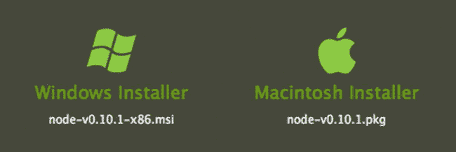
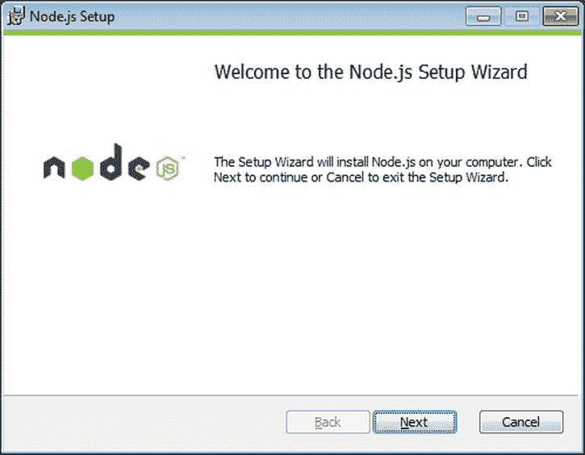
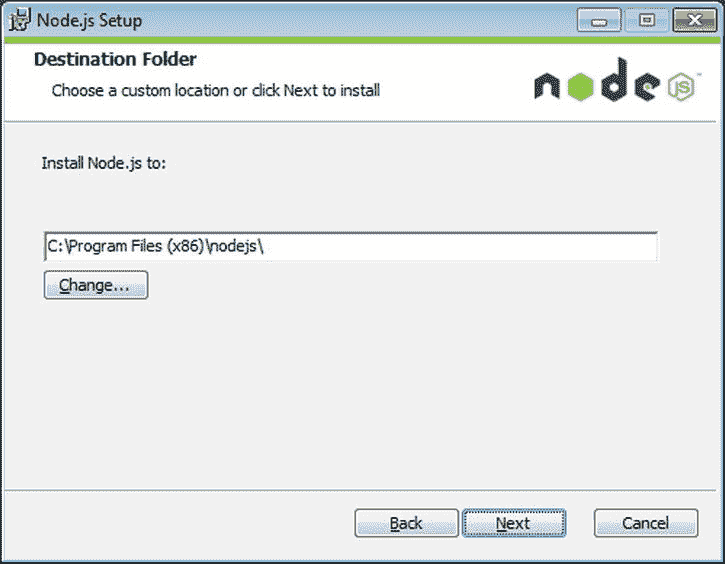
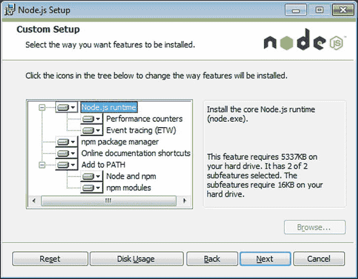
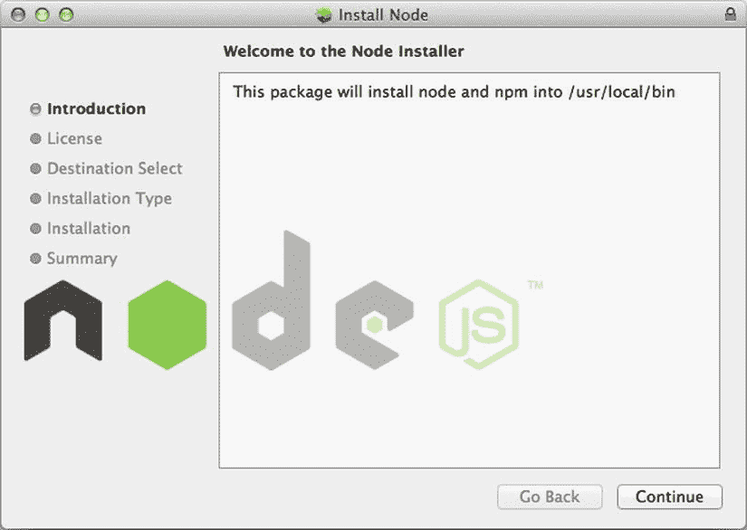
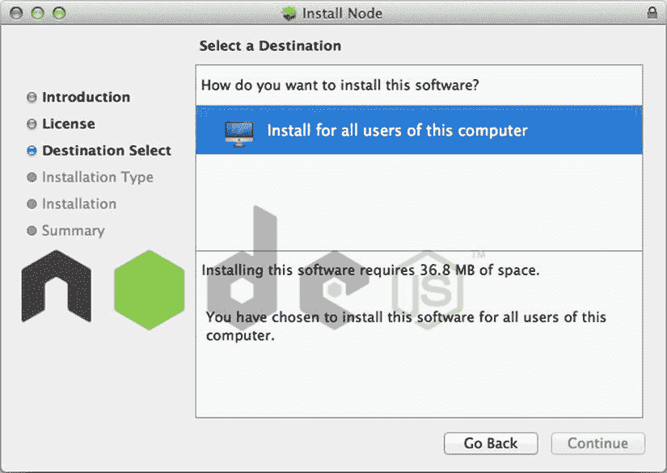
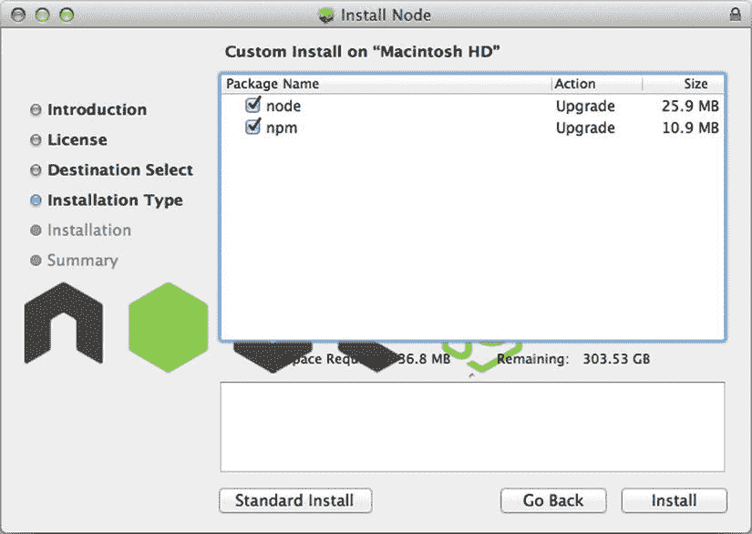
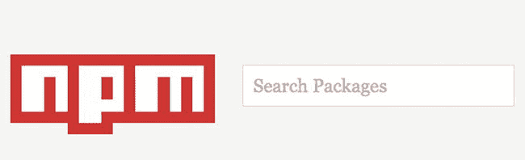

第一章


了解 Node.js

Node.js 是一个服务器端框架，用于构建高度可伸缩的快速应用。Node.js 是一个基于 v8 的平台，V8 是一个 JavaScript 运行时，支持谷歌设计的 Chrome 浏览器。Node.js 的设计非常适合使用非阻塞事件驱动架构的密集型 I/O 应用。虽然 Node.js 可以以同步方式提供函数，但它通常异步执行操作。这意味着，当您开发应用时，您使用注册的回调来调用事件，以便处理函数的返回。在等待返回时，应用中的下一个事件或函数可以排队等待执行。一旦第一个函数完成，它的回调事件就由调用回调的函数调用来执行和处理。这种事件驱动的处理在 Node.js 自己的定义中有描述:

Node.js 是一个基于 Chrome 的 JavaScript *运行时构建的平台，用于轻松构建快速、可扩展的网络应用。Node.js 使用事件驱动的非阻塞 I/O 模型，这使得它轻量级且高效，非常适合跨分布式设备运行的数据密集型实时应用。*

用 Node.js 编写的应用是用 web 平台无处不在的语言 JavaScript 编写的。由于许多有经验的开发人员和新手都可以访问 JavaScript，Node.js 平台和社区已经起飞，并成为许多公司和开发人员开发环境的重要部分。

这本书是关于 Node.js 的。特别是，这本书是一本食谱书，旨在提供大量有用的高质量的例子，说明 Node.js 能够完成什么。这本书是为对 JavaScript 有一些经验并且至少对 Node.js 有所了解的开发人员准备的。通过阅读这本书，您将了解许多被高度利用的模块，包括 Node.js 的原生模块和由第三方贡献者编写的模块，这些模块是 Node.js 开发人员的主要目标。

这第一章与本书其余部分的食谱格式不同。它旨在帮助开发人员从头开始安装和运行，并概述了如何在 Node.js 平台中运行。您将了解如何安装 Node.js，并理解许多常见范例和运行 Node.js 应用的基本工作流。正如您将看到的，我们花了相当多的时间介绍 Node.js 是如何工作的。一旦你读完了这一章，你就应该做好准备去钻研接下来几章的食谱了。

1-1.在计算机上安装 Node.js

有几种方式可以安装 Node.js，并且它们在不同的操作系统之间略有不同。安装 Node.js 的三种主要方法是通过二进制安装程序，通过包管理器，或者通过编译源代码。

要通过二进制安装程序在您的计算机上安装 Node.js，您首先需要安装程序。目前 Node.js 唯一可用的安装程序是针对 Windows 和 Macintosh OS X 的，要找到这些安装程序，你需要前往`http://nodejs.org/download/`。在这里你可以找到你选择的安装程序来下载，如图 1-1 所示。



[图 1-1](#_Fig1) 。可供下载的特定平台安装程序

窗户

在 Windows 上，首先下载。msi 安装程序包。当您打开该文件时，您将开始使用设置向导进行演练，如图 1-2 所示。



[图 1-2](#_Fig2) 。开始安装

与大多数 Windows 应用一样，您将看到一个默认位置，您可以将应用文件安装到该位置。然而，该目的地可以被覆盖，并显示在[图 1-3](#Fig3) 中。



[图 1-3](#_Fig3) 。您可以选择使用或覆盖默认文件位置

在 Windows 上完成安装之前的最后一步是设置 Node.js 安装所需的任何自定义配置。例如，您不能将 Node.js 添加到您的路径中；也许你想测试多个版本，并在测试阶段明确地调用可执行文件。该自定义步骤如[图 1-4](#Fig4) 所示。



[图 1-4](#_Fig4) 。自定义设置

X

Macintosh 上的安装程序与 Windows 安装程序非常相似。首先，下载。pkg 文件。当你打开它时，它会引导你完成在 OS X 上运行的标准安装程序。这就像你在[图 1-5](#Fig5) 中看到的那样。



[图 1-5](#_Fig5) 。在 OS X 上安装

有时在安装 Node.js 时，您希望只有一部分潜在用户能够访问它。该功能内置于 OS X 安装程序中，为您提供了如何安装 Node.js 的选项，如图 1-6 所示。



[图 1-6](#_Fig6) 。为指定用户安装

就像在 Windows 上一样，您可以自定义安装。点击自定义安装按钮，然后根据图 1-7 中的[所示设置您的配置。例如，您可能不希望安装 npm，而是希望进行更加定制的 npm 安装，我们将在下一节中对此进行概述。](#Fig7)



[图 1-7](#_Fig7) 。OS X 上的自定义 Node.js 安装

当然，有许多平台不是 Macintosh 或 Windows，但是您仍然希望不必从源代码中下载和编译 Node.js。这个问题的解决方案是找到一个会为您安装 Node.js 的包管理器。有几个不同平台的包管理系统，每一个都有自己获取新包的风格。

Ubuntu 和 Linux Mint

Ubuntu 和 Linux Mint 的软件包要求在安装 Node.js 之前在你的机器上安装一些组件，为了满足这些先决条件，你必须首先运行清单 1-1 中的代码。

***[清单 1-1](#_list1)*** 。确保安装了先决条件

```js
sudo apt-get install python-software-properties python g++ make
```

然后，您可以通过添加托管 Node.js 的存储库、更新您的源代码并使用清单 1-2 中的命令进行安装。

***[清单 1-2](#_list2)*** 。在 Ubuntu 和 Linux Mint 上安装 Node.js

```js
sudo add-apt-repository ppa:chris-lea/node.js
sudo apt-get update
sudo apt-get install nodejs
```

Fedora

Fedora 18 有一个简单的 Node.js 安装，它是一个单一的包管理器指令，如[清单 1-3](#list3) 所示。

***[清单 1-3](#_list3)*** 。在 Fedora 上安装 Node.js

```js
sudo yum --enablerepo=updates-testing install nodejs npm
```

在 Fedora 的未来版本中，Node.js 应该默认集成到操作系统中。

Arch Linux

对于 Arch Linux ，通过定位“nodejs”包来利用 pacman 包管理器，如[清单 1-4](#list4) 所示。

***[清单 1-4](#_list4)*** 。在 Arch Linux 上通过 pacman 安装

```js
pacman -S nodejs
```

FreeBSD 和 OpenBSDT3】

Berkeley 软件分发(BSD)平台上的安装利用了端口安装程序，如[清单 1-5](#list5) 所示。

***[清单 1-5](#_list5)*** 。在 BSD 上安装

```js
/usr/ports/www/node
```

open use〔t0〕

当使用 openSUSE 时，可以使用 zypper 命令行包管理工具安装 Node.js，如清单 1-6 所示。

***[清单 1-6](#_list6)*** 。使用 zypper 在 openSUSE 上安装 Node.js

```js
sudo zypper ar http://download.opensuse.org/repositories/devel:/languages:/nodejs/openSUSE_12.1/ NodeJSBuildService
sudo zypper in nodejs nodejs-devel
```

许多开发人员更喜欢在 OS X 甚至 Windows 上使用软件包管理器，而不是使用安装程序。Node.js 也可以通过这些包管理器来安装。

Windows 操作系统

使用 chocolatey 包管理器，简单地用 Chocolatey 命令安装，如清单 1-7 所示。

***[清单 1-7](#_list7)*** 。用 Chocolately 在 Windows 上安装 Node.js

```js
cinst nodejs
```

x 是什么

无论你是在 Macintosh 上使用 MacPorts 还是 Homebrew 来安装你的软件包管理器，你都可以安装 Node.js，如清单 1-8 和清单 1-9 所示。

***[清单 1-8](#_list8)*** 。MacPorts

```js
port install nodejs
```

***[清单 1-9](#_list9)*** 。自制

```js
brew install node
```

此时，您应该已经在您的机器上安装了 Node.js，方法是在您的首选平台上使用您选择的方法。接下来，您需要确保有一种方法来发现和管理 Node.js 包。

**1-2。安装 npm 软件包管理器**

许多编程语言和平台依赖于使用第三方模块来扩展平台的实用性。Node.js 没有什么不同，因为它通过使用包管理器 **:** npm **得到了极大的扩展。** npm 是从 Node.js 本身独立出来的，现在仍然作为一个独立的项目维护着。但是，由于它越来越受欢迎和接受，从 Node.js 版本 0.6.3 开始，它就与 Node.js 二进制安装一起构建和部署。这意味着安装 npm 就像获取上一节中概述的 Node.js 的最新版本一样简单。因此，如果您已经使用了某个二进制安装程序，npm 已经可供您使用了。当然，如前一节所示，您可以选择在安装中省略 npm。如果 npm 不可用，您可以运行`make install command`,很快就可以使用了。

如您所料，安装 npm 的方法并不简单。如果您想要调试 npm 或测试在默认 npm 安装中不容易获得的特定功能，这些功能将非常有用。要进入“奇特的”安装，您必须首先找到 install.sh shell 脚本，它位于`https://npmjs.org/install.sh`。

这个安装 shell 脚本包含许多工具，用于以满足您特定需求的方式调用 npm。例如，如果您希望创建一个调试模式的 npm 实例，您可以调用 install.sh，如清单 1-10 所示。

***[清单 1-10](#_list10)*** 。npm 调试安装

```js
npm_debug=1 sh install.sh
```

您还可以使用 npm 安装脚本来设置配置参数，如清单 1-11 中的[所示。](#list11)

***[清单 1-11](#_list11)*** 。npm 的附加配置参数

```js
npm_config_prefix=/my/path sh install.sh
```

当然，您可以为 npm 构建一个补丁，在这种情况下，您最好从 GitHub 源代码下载并自己构建。这需要在您下载 npm 源代码的文件夹中运行 make 命令(见[清单 1-12](#list12) )。

***[清单 1-12](#_list12)*** 。手动安装 npm

```js
make install
```

安装了 npm 后，您的计算机现在就可以利用通过该软件包实用程序可以轻松访问的软件包和模块了。

1-3.了解常用模块

因为 Node.js 是一个用 JavaScript 编写程序的框架，所以它也有一些 JavaScript 的限制。其中缺少的一项是健壮的标准库的概念，就像人们在 C++这样的语言中可能会发现的那样。因此，在 JavaScript 应用中包含模块有很多变化和方法。例如，在浏览器世界中，这可以是从简单的`<script>`标签排序到脚本加载器到模块加载器的任何事情。对于 Node.js，一个简单且健壮的模块加载系统被大量使用，尽管这不是必需的。这种模块化系统被称为 CommonJS，代表用于共享的方法；它包括 Node.js 应用中的标准模块和第三方模块。

CommonJS 是一个社区驱动的项目，它将为整个 JavaScript 社区带来一个标准的库加载功能。CommonJS 实际上代表了一组规范建议，旨在创建一个标准化的模块加载器系统。CommonJS 模块的概念很简单，包括两个部分。首先，CommonJS 模块的创建者应该拿出一段可重用的 JavaScript，并从这段可重用的 JavaScript 中导出一个或多个特定的对象。第二，模块的消费者将需要从模块导出的对象，然后这些对象将被加载到应用中。规范(`http://commonjs.org/specs/modules/1.0/` `)`)中概述的基本模块合同如下:

模块上下文

*   1.在一个模块中，有一个自由变量“require”，它是一个函数。

*   a.“require”函数接受一个模块标识符。
*   b.“require”返回外部模块的导出 API。
*   c.如果存在依赖关系循环，外部模块可能在它的一个可传递依赖关系需要它的时候还没有完成执行；在这种情况下，由“require”返回的对象必须至少包含外部模块在调用 require 之前已经准备好的、导致当前模块执行的导出。
*   d.如果请求的模块不能被返回，“require”必须抛出一个错误。

*   2 在一个模块中，有一个名为“exports”的自由变量，它是一个对象，模块可以在执行时向其添加 API。
*   3.模块必须使用“exports”对象作为唯一的导出方式。

模块标识符

1.  模块标识符是由正斜杠分隔的“术语”字符串。
2.  术语必须是 CamelCase 标识符:“”，或者”。. "。
3.  模块标识符的文件扩展名不能像“.”这样。js”。
4.  模块标识符可以是“相对的”或“顶级的”如果第一项是“.”，则模块标识符是“相对的”或者”。. "。
5.  顶级标识符从概念模块命名空间根解析出来。
6.  相对标识符是相对于编写和调用“require”的模块的标识符来解析的。

现在您可以检查 CommonJS 模块的简单实现是什么样子的。假设您创建了一个名为“describe.js ”的文件，该文件将导出一个文本字符串，该字符串以清单 1-13 中的模块描述作为响应。

***[清单 1-13](#_list13)*** 。describe.js 导出自身的描述

```js
/**
* Describe module
*/
exports.describe = function() {
        return 'I am a CommonJS Module';
};
```

该模块不需要任何其他模块来运行；它所做的只是导出 describe 函数，该函数返回一个字符串描述。但是这是非常无趣的，如果你想在你的应用中的其他地方包含这个模块，你需要在你的代码中安装这个模块。为此，使用 CommonJS require()函数，如[清单 1-14](#list14) 所示。

***[清单 1-14](#_list14)*** 。需要描述模块

```js
var describeModule = require('./describe.js');
```

现在您有了对 describe 模块的引用，但是这意味着什么呢？调用 require()时会发生什么？当您调用 require()时，Node.js 将定位资源并读取和解析文件，授予您对模块的导出 API 的访问权限。当 Node.js 将文件加载到您的应用中时，它会自动将模块隔离到它自己的作用域名称空间中，以防止全局名称在灾难性的哭泣中发生冲突。因为 Node.js 已经为您加载了这个资源，所以您可以从这个资源中调用导出的功能(参见[清单 1-15](#list15) )。

***[清单 1-15](#_list15)*** 。引用所需模块中的导出函数

```js
var describeModule = require('./describe.js');

console.log(describeModule.describe());
```

CommonJS 模块也不完全是关于导出功能的。它们可用于创建一个 API，该 API 建立在模块文件的功能之上，但将该功能留给模块本身。假设您有一个更健壮的模块，其中只需要暴露模块的某一部分；您可以很容易地为这个“私有”功能创建一个方法，并且仍然可以在导出的解决方案中看到它，如清单 1-16 中的[所示。](#list16)

***[清单 1-16](#_list16)*** 。导出模块中的“私有”方法

```js
/**
* Desc module with private method
*/
var _getType = function() {
        return 'CommonJS Module';
};

exports.describe = function() {
        return 'I am a ' + _getType();
};
```

稍后，您将看到更多关于创作和使用 CommonJS 模块的内容，但是，现在，重要的是了解这一切是如何工作的。CommonJS 模块导出功能，并且只导出显式导出的功能。其他函数或方法可能与 CommonJS 模块共存，但它们仅限于模块本身的私有范围，而不适用于访问该模块的应用。如果您仔细并适当地构建 CommonJS 模块，这可以为您的应用生成非常干净的 API。

了解 Node.js 如何实现 CommonJS 方法来加载模块，有助于您创造性地思考应用的结构和 API，允许代码共享和重用，并使您的应用代码更清晰、更易于理解。

1-4.为您的应用编写模块

现在您已经理解了什么是 CommonJS，以及它如何作为模块加载器与 Node.js 相关，您可以开始考虑如何为您的应用构建自己的模块了。如果您决定不为您的应用构建模块，您将很快看到您的应用代码变得难以处理，并导致您的维护噩梦，异构数据结构、对象和回调散布在将成为一个整体 Node.js 应用的各处。

当您开始考虑编写模块时，首先想到的应该是简单的任务划分。如果您的应用要求用户通过服务器验证才能访问内容，那么您可能需要为您的用户数据创建一个模块。这可能包含会话状态、用户信息、身份验证协议等等。如果在 Node.js 应用的核心包含了这部分特定于用户的数据，那么每次看到这段代码时，您都会后悔不得不绕过这段代码。清单 1-17 展示了当你的应用缺少模块时，这些数据会是什么样子。

***[清单 1-17](#_list17)*** 。带有可导出特性的杂乱代码

```js
/**
* User authentication code not in its own module
*/

var db = require('./db.js');

app.on('/createUser', function(req, res) {
  var user = req.username,
    pwd = req.password,
    email = req.email;

  db.lookup('user', {username: user }, function(err, data) {
    if (err) {
      return;
    }
    // Didn't find a user by that name
    if (data.userid === null) {
      createSalt(10, function(err, salt) {
        if (err) {
          return;
        }
        createHash(pwd, salt, function(err, hash) {
          db.create('user', {username: user, password: pwd, email: email }, function(err, user) {
            if (err) {
              return;
            } else {
              user.isauthenticated = true;
              app.users.push[user];
              res.send(user);
            }
          });
        });

      });
    }
  });

});

function createSalt(depth, callback) {
  // do salting here
  if (err) {
    return callback(err);
  };
  callback();
};

function createHash(password, salt, callback) {
  // hashify
  if (err) {
    return callback(err);
  }
  callback();
}
```

上面的代码是客户端请求创建新用户的示例。在成功创建用户之前，必须通过应用的各个部分。它必须首先检查数据库，以确保用户名没有被占用。然后它必须创建一个 salt 并用这个 salt 散列密码。然后，它必须将用户信息存储在数据库中，并将新的用户对象传输给应用。这本身看起来并不笨拙，但是您可以想象作为一个大型项目的一部分，您希望将它从主应用移到它自己的模块中。我们可以通过创建一个身份验证模块来保存 createSalt 和 createHash 方法 ，从而消除大部分代码。这些新方法如[清单 1-18](#list18) 所示。

***[清单 1-18](#_list18)*** 。导出 Salt 和 Hash 方法

```js
/**
* Authentication module
*/

exports.createSalt = function(depth, callback) {
  //do salty things
  if (err) {
    return callback(err);
  }
  callback();
}

exports.createHash = function(password, salt, callback) {
  //hashification
  if (err) {
    return callback(err);
  }
  callback();
}
```

我们通过将两个大函数放在一个模块中，从主代码中删除了它们。接下来我们创建一个用户模块，它将处理[清单 1-19](#list19) 中所有与用户相关的事情。

***[清单 1-19](#_list19)*** 。用户模块

```js
/**
* User module
*/

var db = require('./db.js');
var auth = require('./auth.js');

exports.create = function(req, res, callback) {
  var user = req.username,
    pwd = req.password,
    email = req.email;

  db.findOrCreate('user', {username: user});
  db.lookup('user', {username: user }, function(err, data) {
    if (err) {
      return callback(err);
    }
    // Didn't find a user by that name
    if (data.userid === null) {
      auth.createSalt(depth, function(err, salt) {
        if (err) {
          return callback(err);
        }
        auth.createHash(pwd, salt, function(err, hash) {
          db.create('user', {username: user, password: pwd, email: email }, function(err, user) {
            if (err) {
              return callback(err);
            } else {
              user.isauthenticated = true;
              return callback(user);
            }
          });
        });

      });
    }
  });
};
```

这现在在应用之外，所以我们最初的 createUser 处理程序现在简化为清单 1-20 中显示的简明信息。

***[清单 1-20](#_list20)*** 。带有所需用户模块的主应用

```js
/**
* User Authentication code within its own module
*/
var user = require('./user.js');

app.on('/createUser', user.create(function(err, user){
  if (err) {
    return;
  }
  app.users.push[user];
}));
```

这个例子概述了一种通用的方法，通过使用模块化来将您的代码减少到可管理的部分。编写 CommonJS 模块时，记住它们的一些基本规则是很重要的。您可以根据您认为合适的任何准则来创建您的模块，但是您必须使用 exports 变量，以便将您的模块的任何方法公开给您希望在其中看到它的任何代码部分。您还需要为您的模块设计一个逻辑位置以便加载它，因为 require 函数需要一个标识符来找到该模块。在许多情况下，这可以是 Node.js 应用结构中的本地相对路径，或者是一个更全球化的包(如果使用 npm 模块的话)。当然，用例会有所不同，但是根据经验，如果代码妨碍了您，您应该能够将它提取到它自己的模块中。

1-5.应用中需要模块

在构建 Node.js 应用时，几乎不可避免地需要在应用中使用一组模块，就像上一节中创建的那些模块一样。为此，您将使用 CommonJS 模块加载需求函数。这个函数将在文件系统中按名称查找模块，并加载其导出的 API。这听起来非常简单，但是要真正理解加载模块时会发生什么，您必须理解模块是如何被检索的。

Node.js 在尝试加载模块时使用了一种复杂的策略。当加载一个模块时，首先检查的地方是模块缓存，所以如果你已经加载了一个模块，你就可以访问它了。如果 Node.js 找不到缓存的模块，则优先考虑 Node.js 本地模块，如 crypto、http、fs 等。如果传递给`require()`的标识符没有找到本机模块，那么 Node.js 将在文件系统中搜索传递给它的标识符。

Node.js 模块的文件系统查找比按名称查找本机或缓存模块稍微复杂一些。当需要 Node.js 中的模块时，标识符可以有几种形式，执行的查找可以相应地改变。

当您试图加载一个非本机模块时，Node.js 遇到的第一种情况是，如果您提供一个带有文件扩展名的标识符，比如 require `('aModule.js');.`，Node.js 将尝试只加载您所要求的基本路径中的那个文件，除非您已经在 require 前面加上了一个相对路径，如`require('./modules/aModule.js');`。在这种情况下，Node.js 将尝试从您指定的路径中加载您的模块。在 Node.js 中加载模块时，文件扩展名是可选的。这允许以更简洁的方式编写模块，但也给 Node.js 提供了更模糊的解析路径。要加载不提供扩展名的模块，Node.js 要做的第一件事就是尝试加载带有每个扩展名的文件:。js，。如果 Node.js 没有基于向模块标识符隐式附加扩展名来解析文件，则假定该标识符是相对于基的路径。一旦假设这是一个路径，Node.js 将解析该路径并首先搜索`package.json`，如果它存在就加载它。如果没有，Node.js 下一步假设路径中一定有一个“索引”文件，并再次尝试加载这个文件，并隐式添加扩展名。此时，Node.js 要么有一个可以加载的文件(在这种情况下，它会将该模块添加到模块缓存中)，要么找不到该模块并将抛出错误。

为了形象化这些场景，让我们创建一个假设的应用，它的文件夹结构看起来像[清单 1-21](#list21) 中的轮廓。

***[清单 1-21](#_list21)*** 。概述嵌套的应用

```js
myApp/
        -main.js
        -aModule.js
        -subfolder/
                bModule.js
                index.js
```

您可以假设应用根在 JavaScript 文件“main.js”中，该文件加载了我们的应用所需的所有依赖项，如[清单 1-22](#list22) 所示。

***[清单 1-22](#_list22)*** 。加载依赖项

```js
/**
* main.js - module loading
*/

    // First we require 'http' which is a native Node.js Module    var http = require('http'),

    // load a module with an extension Node.js has not trouble with this
    modA = require('./aModule.js'),

    // Load ambiguous filename from subdirectory load bModule.js fine
    modB = require('./subfolder/bModule'),

    // Load index.js from subdirectory
    sub = require('/subfolder/'),

    // not a file or native module
    // Error: Cannot find Module 'cheese'
    missing = require('cheese');
```

当需要 Node.js 中的模块时，您可以自由决定如何构建应用和文件名。这些规则不仅适用于本地创建的文件和本机 Node.js 模块，还适用于通过 npm 加载到您的应用中的模块，您将在下一节中详细了解这些模块。

1-6.使用国家预防机制模块

您安装了 Node.js 和 npm。您还知道应该如何在 Node.js 应用中包含 CommonJS 模块，但是您不希望每次创建应用时都要从头开始。此外，您可能知道一个 Node.js 包，它用于您希望在代码中完成的任务。进入 npm 模块。

npm 是一个由社区驱动的 Node.js 包和实用程序的存储库，它们以允许任何人访问的方式发布。npm 系统发展非常迅速，在整个发展过程中与 Node.js 的发展保持同步。根据在`https://npmjs.org`的 npm 站点，目前有超过 25000 个可用的 npm 包。有了这么多的软件包，很容易就很难找到符合您需求的软件包。如[图 1-8](#Fig8) 所示，使用`https://npmjs.org/`上的搜索功能，即谷歌网站搜索。



[图 1-8](#_Fig8) 。https://npmjs.org/[上的 npm 搜索](https://npmjs.org/)

或者，您可以利用 npm 本身内置的搜索机制。这是在你终端的命令行上运行的(见[清单 1-23](#list23) )。

***[清单 1-23](#_list23)*** 。命令行 npm 搜索

```js
npm search <term(s) or package name>
```

当您执行搜索命令时，npm 将首先缓存所有包的本地索引，然后搜索包名称、描述、作者以及包的关键字。结果以表格的形式返回，其中显示了包名、描述、作者、发布日期、版本和关键字。这对于确定您想要使用哪个包很有用。要查看关于某个包的详细信息，请运行 npm view 命令，如清单 1-24 所示。

***[清单 1-24](#_list24)*** 。包的详细视图

```js
npm view <package name>
```

一旦你发现了你想要安装的包，并查看了包的详细信息，你就可以安装它了，也是通过命令行(见[清单 1-25](#list25) )。

***[清单 1-25](#_list25)*** 。通过命令行安装

```js
npm install <package name>
```

运行 npm install 命令将下载该软件包，并将其放在应用的一个目录中。该目录名为“node_modules ”,通常与名为 package.json 的包定义文件位于同一目录中。该文件夹有助于定义 npm 包。这意味着，如果您有一个需要此 npm 模块的文件，它将在此目录中查找。子目录中的文件也是如此，这意味着在一个包中，npm 安装的模块将从该目录安装和引用。这可以防止太多子目录包含引用单个模块的“node_modules”目录，从而使应用结构变得混乱。

与许多将包下载到中央共享目录的包管理器(例如 Python 的 easy_install)相反，npm 相对于包本身在本地安装模块。但是，当您从 npm 安装软件包时，也可以设置一个全局标志。通过将软件包设置为全局安装，该用户的任何应用都可以访问它，因为它安装在$HOME 目录中(Windows 上为$USERPROFILE)。要进行全局安装，只需在安装命令中添加标志，如清单 1-26 所示。

***[清单 1-26](#_list26)*** 。全球化软件包安装

```js
npm install –g <package name>
# or
npm install –-global <package name>
```

node_modules 目录是 Node.js 的模块查找例程中的一个特例，这在上一节中已有概述。模块查找不会直接从查找本机 Node.js 模块跳到在目录结构中搜索文件名。如果 Node.js 没有将该模块识别为本机模块，那么它将检查 node_modules 目录，以查看该模块是否位于那里，然后继续加载瀑布。

因为这是模块加载路径的一部分，所以需要一个 npm 模块和您自己创建的模块没有任何区别，这允许您以相同的方式引用它。

1-7.npm 和依赖关系入门

在开发健壮的 Node.js 应用时，使用 npm 有很多好处。如您所见，在您的应用中发现、检索和包含任何已发布的 npm 包非常容易。有更简单的方法来确定如何构建您的应用，以及您的应用包含哪些 npm 模块。这是通过应用目录中的 npm 包管理文件 来完成的。这些文件被命名为 package.json，包含完整管理应用的远程依赖项所需的所有细节。

让我们详细研究一下 package.json 是什么，以及它在 Node.js 应用中是如何工作的。首先，package.json 包含 JavaScript Object Notation (JSON)，，Node.js 和 npm 对其进行解析，以便读取应用的详细信息。当这个文件被解析时，它可以帮助加载依赖项、提供应用元数据、启动和停止应用、列出作者和贡献者、代码库、开发依赖项等等。让我们看看 package.json 的各个字段可能是什么，以及它们告诉 npm 和 Node.js 什么。其中一些字段应该包含在所有 package.json 文件中，而其他字段在您将软件包发布到 npm 注册表时更有用，这将在后面的章节中介绍。

名称

name 字段在 package.json 中是必需的。没有它，您的应用将无法安装。这个名字的一个规则是它必须是一个 URL 安全的名字。如果您发布包，该名称将成为用于定位包的 URL 的一部分，因此必须能够被解析为 URL。当其他模块需要您的模块时，它也将利用您的模块。这意味着不推荐使用一个长得离谱的名字，因为不太可能有人想要输入一个特别长的包名(就像清单 1-27 中的那个)。

***[清单 1-27](#_list27)*** 。一个长得离谱的包名

```js
var poppins = require('supercalifragilisticexpialidocious');
```

但是，您可能需要创造一个特别的名称，因为 npm 模块名称在整个 npm 注册表中必须是唯一的。也不要在名称中包含“js”或“node”。假设文件是 JavaScript，您可以添加“节点”作为“引擎”指令的一部分，稍后您将看到这一点。

版本

版本字段也是必需的。它管理安装哪个版本，并与 package.json 文件中的“name”字段一起使用，以确定一个完全唯一的标识符。每次你对你的包进行修改的时候，你都应该修改版本号。版本号可以有多种形式:一些常见的形式是简单的数字(0.0.1 或 v0.0.1)。有时候开发人员喜欢在版本号上加一个限定符，比如 0.0.2-alpha，0.0.2beta，或者 0.0.2-42。这些都表示不同的版本，并且适合由 npm 语义版本解析器 node-semver *，*解析的层次结构。

描述

描述字段仅仅是包的文本描述；描述中的术语可通过 npm 搜索进行搜索。

关键词

关键字也用于 npm 搜索；这些帮助其他开发者瞄准你的包。

主页〔t0〕

在此字段中，您可以放置包或项目主页的 URL。

bug

这为开发人员指出了一个地方(问题跟踪器或电子邮件地址)来查找或提交 bug，这样他们可以帮助您使您的项目更加令人惊叹。

许可证

此字段描述您的代码将使用的许可证。这可以很简单，如 MIT、BSD 或 GPL，或者您可以使用带有许可文件类型和 URL 的定制许可。

作者、投稿人

这些部分包含负责该包的人员的姓名、电子邮件和 URL。

文件

这个字段对于 package.json 文件 中良好的依赖性管理至关重要。该字段列出了您希望包含在软件包中的文件。这也可以包含需要与包捆绑在一起的文件夹列表。您可以加载一个文件目录，然后用。npmignore 文件，它指定要忽略哪些文件。

主要的

该字段告诉模块加载器当 Node.js 应用中需要包时，加载哪个模块。这应该是该模块的模块标识符。

容器

该字段控制 npm 将任何可执行文件安装到什么位置，这些文件将位于 node_modules/中。bin/目录或者将被象征性地全局链接。这正是 npm 本身为 npm 安装命令行界面的方式。bin 字段 接受一个键字段(将是链接的命令)和一个值(将链接到该键的脚本)。例如，bin 字段类似于[清单 1-28](#list28) 中所示。

***[清单 1-28](#_list28)*** 。package.json 中的 bin 字段

```js
{"bin": {"program": "./path/to/program"}}
```

储存库

该字段指示中央存储库的位置。该存储库包含 Node.js 包的代码。该字段接受一个类型(表示版本控制类型，如 git 或 svn)和一个 URL 参数，以便定位您的代码。

配置

该字段可用于您的包中持续存在的配置选项。您可以设置一个已配置的端口号，让应用在生产模式下运行，或者在 npm 注册表中设置要关联的用户名。

属国

在设计 package.json 文件时，这是一个非常重要的字段:它保存着对应用的成功至关重要的信息。因为有各种版本的其他可用包，所以这个字段将列出那些您可能已经用 Node.js 应用测试过并且知道可以正常工作的包。依赖关系不仅可以概括应用依赖于哪些 npm 库，还可以针对这些项目的特定版本。有多种方法可用于指定目标版本。这可以通过明确列出确切的版本号、明确定义范围、使用比较运算符隐式定义范围、列出 URL、波浪号版本系统和“X 版本范围”来实现(参见[清单 1-29](#list29) )。

***[清单 1-29](#_list29)*** 。管理 package.json 文件中的依赖关系

*明确列出依赖关系的版本号*

```js
"package": "0.0.1"
"package": "=0.0.1"
```

*依赖关系也可以通过一个范围*提供一组版本来管理

```js
"package": "0.0.1 – 0.0.3"
"package": ">=0.0.1
```

*包范围* *也通过比较运算符如*列在文件的依赖部分

```js
"package": ">0.0.1"
"package": "<0.0.1"
"package": ">=0.0.1"
"package": "<=0.0.1"
```

*范围也可以用“x”占位符表示，该占位符允许任何数字代替“x”*

```js
"package":  "0.1.x"
"package": "0.0.x"
```

*作为 URL 的包必须指向一个 tarball 或者一个可以被检出的 git 端点(*

```js
tarball
"package": "https://example.com/package.tar.gz"

Git
"package": "git://github.com/organization/source.git"
```

*波浪号范围* *表示范围的子集，该子集必须至少等于带有波浪号的版本，但不能大于下一个主要版本*

```js
"package": "∼0.8.4"
Is equivalent to:
"package": ">=0.8.4 <0.9.0"
```

有一些依赖项的变体也可以成为 package.json 文件的一部分。它们是 devDependencies、optionalDependencies 和 bundledDependencies。

devDependencies

如您所料，如果使用开发标志`--dev`调用 npm install，那么`devDependencies`是将被下载的依赖项。如果开发分支使用了一个在安装产品版本时不需要的框架，这将是有用的。

bundle dependencies

bundledDependencies 标志表示在发布包时要捆绑哪些项目。

可选依赖关系

无论是否存在，都是需要在应用中处理的依赖项。如果你有一段代码可能依赖于某个包，你必须考虑这个包是否在 optionalDependencies 散列中，如[清单 1-30](#list30) 所示。

***[清单 1-30](#_list30)*** 。实践中的可选依赖性

```js
try {
    var optional = require('optional');
} catch(err) {
    optional = null;
}

if (optional) {
    optional.doThing();
} else {
    doThingWithoutOptionalPackage();
}
```

发动机

您也可以在 package.json 文件中指定引擎。这意味着，如果您知道您的应用只能在某个版本范围内的 Node.js 或 npm 上工作，请在这里设置它。引擎的值遵循与依赖项相同的值(见[清单 1-31](#list31) )。

***[清单 1-31](#_list31)*** 。定义引擎

```js
"engines": {
    "node": "0.8.x",
    "npm": "*"
}
```

操作系统和 CPU

如果您意识到应用的某些方面只能在给定的操作系统上执行，或者您只针对特定的操作系统，那么您也可以在 package.json 文件中添加特定的值。这也适用于你的目标 CPU，比如 64 位机器，这可以在清单 1-32 中看到。

***[清单 1-32](#_list32)*** 。为您的应用定义架构

```js
"os" : ["linux", "darwin", "!win32"],
"cpu": ["!arm", "x64" ]
```

首选全局

如果您维护的软件包最好作为全局软件包运行，或者您希望它作为全局软件包安装，请将此标志设置为 true，如果用户选择在本地安装它，它将设置一条控制台警告消息。

将 package.json 文件中的所有字段放在一起有助于指定运行 Node.js 应用所需的配置和依赖关系。这使得您的包非常容易移植，并且在新机器上的设置通常很简单。当您组装一个简单的应用时，您将能够通过检查 package.json 文件获得关于您的应用的有价值的信息。在构建应用时，管理所有这些设置似乎很麻烦。幸运的是，如果您已经在 Node.js 中构建了一个应用，那么您可以通过运行命令`npm init`追溯创建一个有效的 package.json 文件，这将产生一个类似于清单 1-33 中的包的文件。

***[清单 1-33](#_list33)*** 。通过 npm init 初始化应用

```js
{
  "name": "squirrel",
  "version": "0.0.1",
  "private": true,
  "scripts": {
    "start": "node app"
  },
  "dependencies": {
    "express": "3.0.0rc4",
    "ejs": "*",
    "feedparser": ""
  },
  "gitHead": "e122...",
  "description": "A sample app to parse through your RSS feeds",
  "main": "app.js",
  "devDependencies": {},
  "repository": {
    "type": "git",
    "url": "ssh://git@bitbucket.org/username/squirrel.git"
  },
  "keywords": [
    "rss"
  ],
  "author": "cory gackenheimer",
  "license": "MIT"
}
```

当您检查上面由`npm init`生成的 package.json 框架时，您会注意到文件中并没有包含所有可用的字段。这没问题，但是这个文件表明的是应用的名称和版本。然而，更重要的是，它规定了依赖关系，因此当您从应用的根目录执行`npm install`时，npm 将安装 express、ejs 和 feedparser 的指定版本，以便解析 package.json 中列出的依赖关系。

1-8.安装 Node.js 版本管理器

如果您打算花时间开发 Node.js 应用，您将不可避免地遇到 Node.js 的新版本。这是因为 Node.js 的开发正以令人难以置信的速度前进。在撰写本文时，当前的稳定发布版本是 0.10.x。该版本包含适用于生产环境的稳定 API。还有第二个实验性版本，当前版本为 0.11.x。实验性版本不适合生产，因为它包含为即将到来的版本创建的新功能。可能您正在为当前的稳定版本开发一个包，但是您也想确保它将在即将到来的版本中继续与 Node.js API 变化一起工作。如果是这种情况，您将需要安装 Node.js 的多个版本。首先，您可以访问 Node.js 网站，下载 Node.js，并安装您的目标版本。第二，也是更优雅的，你可以使用一个版本管理工具。

一旦您决定使用 Node.js 版本管理工具，您就可以在不同的工具之间进行选择。目前有三种主要的 Node.js 版本管理工具:nvm、n 和 nave。这些工具略有不同，可能提供更适合您的特定用例的选项。

由 Tim Caswell 创建的 node Version Manager(nvm)是一个可安装的 shell 脚本，它将下载并安装您指定的 Node.js 的多个版本。要安装 nvm 实用程序，您需要获得安装脚本，它也是一个 shell 脚本。有三种方法可以获得和安装这个脚本:cURL、Wget 或手动安装。

要手动安装，首先需要获得位于 GitHub ( `https://github.com/creationix/nvm` `). It can be downloaded from that location directly, or fetched at git clone `git://github.com/creationix/nvm.git ∼/nvm`)上项目存储库中的`nvm.sh`文件。`

 `然后，您需要运行刚刚下载到 nvm 目录的 shell 脚本:

```js
∼/nvm/nvm.sh
```

幸运的是，如果你使用 cURL(参见[清单 1-34](#list34) )或 Wget(参见[清单 1-35](#list35) )，有一种更简单的方法可以安装 nvm:你可以下载 shell 脚本并在你的∽/中添加一个 nvm 别名。bash_profile 或者∽/。配置文件。

[清单 1-34](#_list34) 。使用卷曲

```js
curl https://raw.github.com/creationix/nvm/master/install.sh | sh
```

***[清单 1-35](#_list35)*** 。使用 Wget

```js
wget -qO- https://raw.github.com/creationix/nvm/master/install.sh | sh
```

安装其他 Node.js 版本管理工具同样简单。与 nvm 类似的脚本是一个名为 nave 的工具，由 Isaac Schlueter 开发，打包为 Node 的虚拟环境。Nave 运行 shell 脚本，就像 nvm 一样；但是，它可以通过 npm 安装。

```js
npm install –g nave
```

将介绍的最后一个版本管理实用程序也是通过 npm 安装的，`npm install –g n`，并且在功能上与其他工具类似。

这些工具旨在使使用多个版本的 node 变得非常简单和直观。它们各有不同的特性，因此作为开发人员，您可以找到合适的工具。在下一节中，您将看到对每个版本管理工具的工作流和可用选项的深入研究。

1-9.在您的计算机上使用多个版本的 Node.js

可以想象，开发 Node.js 应用需要时间。您可能在 Node.js 处于给定版本时开始一个项目，并且所有的包都与它无缝地工作。但是，您可能会发现，由于这样或那样的原因，您需要升级(或降级)您的应用所使用的 Node.js 版本。要在您的应用中实现这一点，并在您的计算机上利用多个 Node.js 实例，您可以使用 Node.js 版本控制工具之一。虽然每个工具都提供相似的功能，但是它们的 API 略有不同，并且包含每个工具独有的某些功能。

非易失性存储器

nvm 的安装遵循 nvm 安装<version>的模式，如[清单 1-36](#list36) 所示。您指定的版本可以是显式编写的，也可以是将安装最新版本的缩写版本。</version>

***[清单 1-36](#_list36)*** 。nvm 安装

```js
$ nvm install v0.8.23
$ nvm install 0.8.23
$ nvm install 0.8
```

安装脚本找到适当的版本号，转到`https://nodejs.org/dist/`目录中的适当位置，并在您的机器上安装 Node.js 的指定版本。该脚本不会为了在全球范围内使用而改变您的路径。为此，使用命令 use 指定您希望使用的版本(见[清单 1-37](#list37) )。

***[清单 1-37](#_list37)*** 。nvm 使用

```js
$ nvm use 0.10.1
```

如果不知道想要安装或使用的 Node.js 的具体版本，可以通过执行`nvm ls-remote`命令列出 Node.js 的远程版本。这将列出所有可供下载的版本。如果您的机器上已经安装了多个版本，那么您可以使用`nvm ls`命令来显示您的机器上当前可用的 Node.js 版本的列表。

nvm 允许您指定一个与您正在使用的已安装版本不同的特定版本，以运行您的应用。例如，您可以输入`nvm run 0.6 server.js`。这将使用最新安装的 Node.js 0.6.x 版本运行您的应用(server.js)，即使使用 use 命令设置的版本完全不同。

使用 nvm，您还可以通过运行`nvm alias <name> <version>`为版本设置别名。这种情况的用例可能类似于 run 命令，但是如果您想要对您的应用多次测试一个构建，您可能会发现键入 run 命令很麻烦。为此，别名非常有用，例如`nvm alias dev 0.11.0`，它允许您使用更简单的命令(`dev server.js`，而不是`nvm run 0.11.0 server.js)`，测试 node . js 0 . 11 . 0 版中的新特性。

当然，通过 nvm 安装多个版本，您可能会以内务管理噩梦告终。当试图维持某种秩序时，太多的版本可能会造成问题。这些问题通过`nvm uninstall <version>`命令和`nvm unalias <alias>`命令得到解决。这两个操作分别卸载指定版本的 Node.js 并从您的计算机中删除指定的别名。

中央广场

nave 和 nvm 没有太大的不同。事实上，nave 认为 nvm 是灵感的来源。实现和底层 shell 脚本之间存在一些差异，这些差异足以引起注意。重要的是要理解 nave 是作为 Node.js 虚拟环境提供者而不是版本管理器出现的。首先，`nave install <version>`期望 version 参数是 Node.js 的精确版本，除了获取最新的或者最新的稳定版本，它们看起来分别像`nave install latest`和`nave install stable`。

nave 的虚拟环境部分基于`use`命令。这个命令要么接受一个版本号本身，一个版本号后跟一个 Node.js 程序参数，要么接受一个名称后跟一个版本号，如清单 1-38 所示。

***[清单 1-38](#_list38)*** 。天真的使用

如果使用版本，这将使用指定的版本打开一个子外壳

```js
$ nave use <version>
```

*提供一个带有程序目标的版本，它将使用指定的版本在子 shell 中运行程序*

```js
$ nave use <version> <program>
```

*这将提供一个基于指定版本的别名*

```js
$ nave use <name> <version>
```

要设置用于开发的主版本，命令是`nave usemain <version>`。您还可以通过运行`nave uninstall <version>`来删除一个已安装的实例。与此类似的是`nave clean <version>`命令。clean 命令不会卸载该版本，但会删除指定版本的源代码。`nave`还提供了一组列表命令，`ls`和`ls-remote`以与 nvm ls 和 ls-remote 命令相同的方式操作，通过提供可用的 Node.js 的本地或远程版本的列表。nave 脚本提供了一个额外的`ls-all`命令，它将列出开发人员可以使用的本地和远程 Node.js 版本。如果您想知道 Node.js 的最新版本，只需运行`nvm latest`命令。

n

Node.js 版本控制工具 n 在实现和 API 方面与 nvm 和 nave 有所不同，但它的主要目的仍然是允许您安装多个版本的 Node.js。使用 n，您可以通过使用命令`n <version>`指定 Node.js 的确切版本。这没有 nvm 宽松，它允许你选择一个主要的修订版，它将安装该版本的最新版本。不同之处在于你可以指定最新的(见[清单 1-39](#list39) )，或者最新的稳定版本(见[清单 1-40](#list40) )，n 会为你获取。

[清单 1-39](#_list39) 。获取最新版本

```js
$ n latest
```

***[清单 1-40](#_list40)*** 。获取最新的稳定版本

```js
$ n stable
```

这些命令所做的是转到`https://nodejs.org/dist/`站点并搜索最新版本(可用于检索最新版本的最高编号或可用于最新稳定版本的最高偶数版本)。要移动到你已经安装的先前版本，只需使用`n prev`命令`.`

要查看本地安装的可用 Node.js 版本，并选择要使用的版本，只需键入命令 n。n 命令本身将列出测试版本，以及您指定要与该版本一起运行的任何标志。为了指定一个标志或配置选项，你只需在你的 n <version>命令后提供一个参数，如[清单 1-41](#list41) 所示。</version>

***[清单 1-41](#_list41)*** 。将调试参数传递给此版本的节点

```js
n latest --debug
```

`n bin <version>`命令将输出您机器上的二进制安装的路径。如果您的机器上没有指定的版本，n 会让您知道它没有安装。如果你想不使用作为`n use <version> [args...]`运行的`use`命令而直接针对一个特定的版本，那么 bin 命令非常方便

要卸载，或者使用 n 删除 Node.js，命令是`n rm <version list>`。您会注意到这个命令接受一个版本列表，这意味着您可以在一次绑定中从系统中删除 Node.js 的多个版本。

摘要

在本章中，您回顾了在您的机器上安装 Node.js 的多种方法。您还了解了在 Node.js 应用中实现和使用 CommonJS 模块的基础知识，包括利用 npm Node.js 包管理工具。接下来的章节将开始有一个食谱为中心的格式。这种格式将许多有趣的 Node.js 主题分成一个问题-解决方案方法。这意味着您将从构建 Node.js 应用时可能遇到的问题的定义开始，然后阅读该问题的解决方案。您可以通读这些章节，了解 Node.js 的某些部分是如何工作的，并且能够在作为案头参考返回本书时轻松找到这些解决方案。`