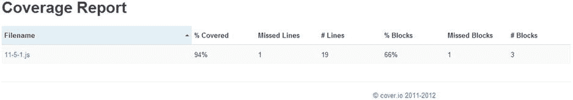
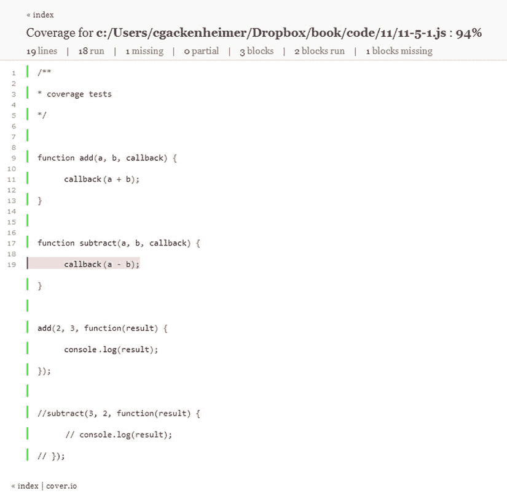
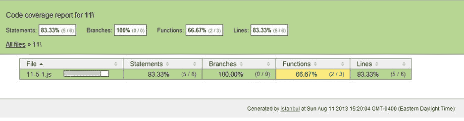
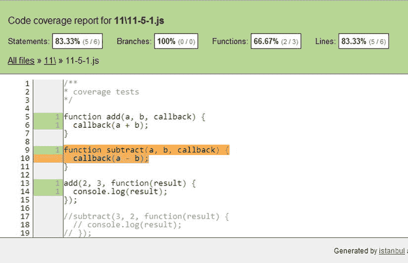

第十一章


在 Node.js 中测试

测试让您安心地知道您编写的代码实际上正在执行它想要做的操作。Node.js 为编写某种形式的单元测试提供了本机实现，Node.js 社区已经创建了几个健壮的库来帮助您进行测试驱动的开发过程。

在本章中，您将研究如何为 Node.js 应用决定一个测试框架，并且您还将看到各种各样的技术和测试机制，您可以使用它们来创建一个完全经过测试的应用。一旦您构建了 Node.js 应用所需的测试，您将学习如何报告您已经创建的测试并将它们集成到您的工作流中。

当您创建 Node.js 测试实现时，有很多选项可供您使用。在本章中，您将有机会看到一些框架的小样本，包括以下内容:

*   Node.js 断言
*   节点单元
*   摩卡
*   柴网
*   誓言. js
*   应该. js

本章中使用的那些在社区中更为突出，但无论如何这不是一个详尽的列表。本章旨在向您提供足够的信息，以便为 Node.js 应用创建一个完整的测试套件，但是我将尝试对您最终可能选择的框架保持不可知的态度。

11-1.选择测试驱动开发或行为驱动开发的框架

您希望在 Node.js 开发过程中实现测试。要做到这一点，您需要找到满足您测试需求的最佳测试解决方案。

当你选择一个测试框架时，你应该考虑的第一件事是你要做的测试的类型。有两个通用的类别来描述测试风格，它们可以被分成更小的类别。

首先，有经典的测试驱动开发(TDD) 。TDD 是有用的，因为你接受一个代码需求，为需求的那个方面写一个失败的测试，然后创建允许测试通过的代码。TDD 的演变是行为驱动开发(BDD)。 BDD 不仅采用可测试的代码功能单元，还采用可测试的业务用例，保护代码和最终用户的体验。

您的框架选择不仅取决于您喜欢的测试风格，还取决于您希望遇到的测试类型。您可能希望仅对应用中的关键值进行一些简单的断言测试。您可能希望提供一个代码覆盖率总结，让您知道可以在哪里重构并从应用中删除无关的代码。

在本章中，您将看到许多实现，每个实现都提供了 Node.js 中测试的独特方式。这不是一个详尽的列表，但旨在帮助您了解如何选择一个适合您的测试框架。

有些与异步代码无缝协作；其他人在大规模测试项目中表现更好。这些决定取决于您，即开发人员，来决定哪一个适合您的需要。应该选择这些框架中的任何一个还是都不选择，都不如将测试引入工作流并构建一个 Node.js 应用重要，因为您知道该应用已经过很好的测试。

11-2.使用 Node.js 断言模块创建测试

问题

您希望利用 Node.js 的本机 assert 模块来测试您的 Node.js 应用。

解决办法

在 Node.js 中创建基本测试有许多选项。许多测试的基础都源自 Node.js assert 模块。这个模块在内部用于 Node.js 测试，是 TDD 的一个很好的模型。

清单 11-1 展示了如何用 Node.js 断言模块实现一组基本的测试。

***[清单 11-1](#_list1)*** 。Node.js 断言基础

```js
var assert = require('assert');

/*11-2*/
var three = 3;

assert.equal(three, '3', '3 equals "3"');

assert.strictEqual('3', three.toString(), '3 and "3" are not strictly equal');

assert.notEqual(three, 'three', '3 not equals three');

// assert.ok(false, 'not truthy ');
assert.ok(true, 'truthy');

```

Node.js 断言模块也可以用来测试异步代码，如[清单 11-2](#list2) 所示。

***[清单 11-2](#_list2)*** 。测试异步平方一个数字的函数

```js
var squareAsync = function(a, cb) {
    result = a * a;
    cb(result);
};

var assert = require(‘assert’);

squareAsync(three, function(result) {
        assert.equal(result, 9, '3 squared is nine');
});

squareAsync('three', function(result) {
        assert.ok(isNaN(result), '"Three squared is NaN');
});
```

通常在 Node.js 中，您创建的代码是异步的，如上所示。然而，有时您可能有一些想要测试的同步性质的代码。你可以按照清单 11-3 中的例子用断言模块测试同步代码。

***[清单 11-3](#_list3)*** 。与 Node.js 断言同步

```js
var square = function(a) {
    if (typeof a !== 'number') return false;
    return a * a;
};

var assert = require('assert');

assert.equal(square(three), 9, '3 squared equals 9');

assert.equal(square('three'), false, 'should fail because "three" is not a number');
```

它是如何工作的

使用 require('assert ')导入的 Node.js 断言测试模块用于内部 Node.js 测试，并已成为许多第三方测试实现的基础。assert 模块是以这样一种方式创建的，如果不满足测试需要的特定条件，它将抛出一个断言错误。如果全部通过，Node.js 进程将按预期退出。

在此解决方案中，您看到了可以通过使用 assert 模块的应用编程接口(API) 的一小部分来验证真值或假值、等式和非等式。API 能够断言的完整列表如[表 11-1](#Tab1) 所示。

[表 11-1](#_Tab1) 。断言模块的 API 方法

| 方法 | 描述 |
| --- | --- |
| assert.deepEqual(实际、预期、消息) | 深度相等的测试。这将测试' === '运算符以外的内容，并检查比较中的日期、正则表达式、对象和缓冲区。 |
| assert.doesNotThrow(块，[错误]，[消息]) | 期望提供的代码块不会引发错误。 |
| assert.equal(实际、预期、消息) | 使用“==”运算符测试实际值是否等于预期值。 |
| assert.fail(实际、预期、消息、运算符) | 通过显示消息以及由运算符分隔的实际值和期望值来引发断言异常。 |
| assert.ifError(值) | 测试该值是否不为假，如果为假，则引发断言异常。这用于测试回调是否提供了错误参数。 |
| assert.notDeepEqual(实际，预期，消息) | 深度非质量测试。这超出了测试的范围！== '运算符，并在比较中检查日期、正则表达式、对象和缓冲区。 |
| assert.notEqual(实际，预期，消息) | 使用“！= '运算符。 |
| assert.notStrictEqual(实际，预期，消息) | 与相同。notEqual 的不同之处在于，它将这些值与“！== '运算符。 |
| assert.ok(值，消息) | 测试传递的值是否为真值。否则，消息将被记录为断言异常。 |
| assert.strictEqual(实际、预期、消息) | 与相同。等于，不同之处在于它使用“===”运算符来比较这些值。 |
| assert.throws(块，[错误]，[消息]) | 期望提供的块引发错误。 |

11-3.使用节点单元创建测试

问题

您希望利用 nodeunit 单元测试模块来测试 Node.js 应用。

解决办法

nodeunit 测试模块建立在 assert 模块的 API 之上，如清单 11-4 所示。

***[清单 11-4](#_list4)*** 。使用节点单元进行测试

```js
var test = require('nodeunit');

module.exports = {
        '11-2': {
                'equal': function(test) {
                        test.equal(3, '3', '3 equals "3"');
                        test.done();
                },
                'strictEqual': function(test) {
                        test.strictEqual('3', 3, '3 and "3" are not strictly equal');
                        test.done();
                },
                'notEqual' : function(test) {
                        test.notEqual(3, 'three', '3 not equals three');
                        test.done();
                },
                'ok' : function(test) {
                        test.ok(false, 'not truthy ');
                        test.done();
                }
        }
};
```

清单 11-5 展示了利用 nodeunit 测试框架来创建异步方法测试的解决方案。

***[清单 11-5](#_list5)*** 。节点单元异步测试

```js
var squareAsync = function(a, cb) {
    result = a * a;
    cb(result);
};

module.exports = {
    '11-4': {
        'squareAsync': function(test) {
            test.expect(2);
            squareAsync(three, function(result) {
                test.equal(result, 9, 'three squared is nine');
            });
            squareAsync('three', function(result) {
                test.ok(isNaN(result), 'squaring a string returns NaN');
            });
            test.done();
        }
    }
};
```

Nodeunit 还允许同步测试(如清单 11-6 所示)。

***[清单 11-6](#_list6)*** 。节点单元同步测试

```js
var square = function(a) {
    if (typeof a !== 'number') return false;
    return a * a;
};

var test = require('nodeunit');
module.exports = {
    '11-3': {
        'squareSync': function(test) {
            test.equal(square(three), 9, 'three squared is nine');
            test.equal(square('three'), false, 'cannot square a non number');
            test.done();
        }
    }
};
```

它是如何工作的

Nodeunit 提供了与 assert 模块相同的 API，并增加了两个方法。首先，添加。done()方法，它告诉 nodeunit 您已经完成了那个测试，是时候进行下一个测试了。nodeunit 带来的第二个附加功能是。期望(金额)法。该方法允许您指示 nodeunit 您计划实现多少测试，并确保所有测试都已执行。如果您已经指示 nodeunit 使用 expect(2)运行两个测试，并且只运行了一个，那么测试将失败，并显示消息:`Error: Expected 2 assertions, 1 ran.`您将在下一节中看到，能够使用 expect()和 done()方法提供了一种测试异步代码的好方法。

要用 nodeunit 实现测试，您需要从一个模块中导出测试。正如您之前看到的，您首先需要 nodeunit 模块，然后导出您的测试。这种导出的格式可以帮助您对测试进行分组。您可以在解决方案中看到，您将本部分的所有测试分组到了 11-2 标题下。然后您分别创建每个测试，调用每个测试的断言，然后调用`test.done()`。

要调用 nodeunit 测试，必须先用`npm install –g nodeunit`安装 nodeunit。然后瞄准你想测试的模块。如果您使用一个名为 nodeunit.js 的文件，您将调用`$ nodeunit nodeunit.js`，测试将执行并产生一个类似于您在[清单 11-7](#list7) 中看到的结果，带有复选标记来表示通过测试，带有“X”表示失败。

***[清单 11-7](#_list7)*** 。节点单元结果

```js
nodeunit.js
✔ 11-2 - equal
✔ 11-2 - strictEqual
✔ 11-2 - notEqual
✖ 11-2 – ok
```

11-4.用 Mocha 创建测试

问题

您需要利用 Mocha 为 Node.js 应用创建测试。

解决办法

用于编写 Node.js 测试的一个著名框架是 Mocha 。如何使用它的一个例子显示在[清单 11-8](#list8) 中。

***[清单 11-8](#_list8)*** 。使用 Mocha 框架

```js
var assert = require('assert');

var three = 3;
describe('11-2', function() {
        describe('#equal', function() {
                it('should return true that 3 equals "3"', function() {
                       assert.equal(three, '3', '3 equals "3"');
                })
        })
        describe("#strictEqual", function() {
                it('"3" only strictly equals 3.toString()', function() {
                       assert.strictEqual('3', three.toString(), '3 and "3" are not strictly equal');
                })
        })

        describe("#notEqual", function() {
                it('should be that 3 is not equal to three', function() {
                       assert.notEqual(three, 'three', '3 not equals three');
                })
        })
        describe("#ok", function() {
                it('should return that false is not truthy', function() {
                       assert.ok(false, 'not truthy ');
                })
        })
        describe("#ok", function() {
                it('should be true that true is truthy', function() {
                       assert.ok(true, 'truthy');
                })
        })
});
```

Mocha 也可以测试异步代码，如清单 11-9 中的[所示。](#list9)

***[清单 11-9](#_list9)*** 。Mocha 异步测试

```js
var squareAsync = function(a, cb) {
    result = a * a;
    cb(result);
};

squareAsync(three, function(result) {
        result.should.equal(9, 'three squared is nine');
});

squareAsync('three', function(result) {
        // NaN !== NaN
        result.should.not.equal(result);
});
```

有时，您会想要测试同步编写的代码。Mocha 可以像这样测试代码，如[清单 11-10](#list10) 所示。

***[清单 11-10](#_list10)*** 。摩卡同步测试

```js
var square = function(a) {
    if (typeof a !== 'number') return false;
    return a * a;
};

describe('11-3 sync', function() {
    describe('square a number', function() {
        it('should do this syncronously', function() {
            square(three).should.equal(9);
        });
        it('should fail when the target is not a number', function() {
            square('three').should.be.false;
        });
    });
});
```

它是如何工作的

Mocha 是一个测试框架，可以利用您选择的任何断言模块。在这个例子中，您利用 Node.js assert 模块来管理您的简单断言。然而，为了让这些断言工作，您必须将您的断言包装在特定于 Mocha 的描述中。这允许您命名您的测试套件和特定案例，以便从您的测试中看到想要的输出。

为测试创建描述的方法是将它们包装在函数“describe”中。这个函数将接受一个名称和一个回调函数。测试套件将单独的测试用例嵌套在其回调函数中。一般来说，这应该看起来像清单 11-11 中的例子。

***[清单 11-11](#_list11)*** 。用 Mocha 构建测试套件

```js
describe(‘Test suite’, function() {
    describe(‘test-case’, function() {
        // tests go here
    });
});
```

Mocha 中的测试可以包含对预期结果的描述，当您遇到断言错误时会用到它。语法读起来几乎像一个句子，正如你在[清单 11-12](#list12) 中看到的，在那里你描述了测试应该得到什么结果，并且测试本身包含在回调中。测试描述只有在测试失败时才会出现。

***[清单 11-12](#_list12)*** 。测试失败描述

```js
it('should return true that 3 equals "3"', function() {
        assert.equal(three, '3', '3 equals "3"');
});
```

一旦通过`$ npm install –g mocha`在全球范围内安装了 Mocha，有两种主要的方法可以让 Mocha 执行测试。可以直接在一个文件上调用 Mocha，通过调用`$ mocha filename.js`。如果您正在测试一个单独的测试文件，这是很有价值的，但是如果您想要测试多个文件，您可以简单地创建一个测试/目录，并将您的 Mocha 测试文件移动到该目录中。一旦你完成了这些，只需调用`$ mocha`，它就会找到那个目录并遍历它，执行遇到的测试。

11-5.用 Chai.js 创建测试

问题

您希望使用 Chai.js 测试框架创建测试。

解决办法

包含 Node.js assert 模块 API 的测试框架的另一个例子是 Chai.js 测试框架。清单 11-13 中的[显示了相同的基本测试结构](#list13)的一个例子。

***[清单 11-13](#_list13)*** 。使用 Chai.js 进行测试

```js
/**
* chaijs
*/

var chai = require('chai');

/* 11-2 simple */
var assert = chai.assert;
var three = 3;

assert.equal(three, '3', '3 equals "3"');

assert.strictEqual('3', three.toString(), '3 and "3" are not strictly equal');

assert.notEqual(three, 'three', '3 not equals three');

assert.ok(true, 'truthy');

//assert.isFalse(true, 'true is false');

var expect = chai.expect;

expect(three).to.be.a('number');

var should = chai.should();

three.should.be.a('number');
```

接下来，您可以使用 Chai.js 框架创建异步测试。这些显示在[清单 11-14](#list14) 中。

***[清单 11-14](#_list14)*** 。Chai.js 异步测试

```js
var squareAsync = function(a, cb) {
    result = a * a;
    cb(result);
};

squareAsync(three, function(result) {
        result.should.equal(9, 'three squared is nine');
});

squareAsync('three', function(result) {
        // NaN !== NaN
        expect(result).to.not.eql(result);
});
```

清单 11-15 显示了如何使用 Chai.js 实现同步测试。

***[清单 11-15](#_list15)*** 。Chai.js 同步测试

```js
var square = function(a) {
    if (typeof a !== 'number') return false;
    return a * a;
};

var chai = require('chai');

var should = chai.should();

square(three).should.equal(9);

square('three').should.be.false;
```

它是如何工作的

Chai.js 可以作为测试驱动，附带任意 Node.js 断言模块。通过安装 Chai.js 模块并将其导入本地，开始使用 Chai 进行测试。然后，您可以用 Chai.js 提供的几种风格中的任何一种来构建您的断言。

Chai.js 为 BDD 风格的断言提供了两种方法。首先是“期望”风格。expect 风格创建了一个类似句子的结构来描述你对代码的期望。您可以构建一个如下所示的语句:`expect('cheese').to.be.a('string');`。当您遇到像`expect(3).to.be.a('string'), or expect(3).to.equal(6);`这样的语句时，这种类型的测试会抛出断言错误。

BDD 风格的第二种类型是‘应该’。“Should”在许多方面类似于“expect”模块，尽管实现“should”模块需要您执行“should”函数`chai.should()`，而不是像在`chai.expect`中那样引用函数。这是因为当您调用‘expect’时，您调用的是您正在测试的对象的函数:`expect(three)`。在“应该”风格中，你从你正在测试的对象开始，然后描述应该发生的行为。

如[表 11-2](#Tab2) 所示,‘should’和‘expect’样式共享相同的 API。它们还提供了一组非测试性的方法，用于以可链接的方式构建类似句子的结构。这些方法是 to，be，been，is，that，and，have，with，at，of，some。

[表 11-2](#_Tab2) 。“应该”和“期望”模块的 API 方法

| 方法 | 描述 |
| --- | --- |
| 。高于(值) | 断言目标大于值。 |
| 。争论 | 目标必须是 arguments 对象。 |
| 。a(类型) | 确定前面的对象应为“type”类型。 |
| 。低于(值) | 目标小于值。 |
| 。closeTo(预期，增量) | 目标值在给定的期望值加上或减去一个差值的范围内。 |
| 。包含(值) | 断言前面包含给定的值，即 expect(' cheese ')to . contain(' he ')。 |
| 。深的 | 这应该与下面的 equal 或 property 方法一起使用。将对断言执行深度相等检查。 |
| 。空的 | 断言目标的长度为 0，或者对象中没有可枚举的键。 |
| 。eql(值) | 目标必须深度相等。 |
| 。相等(值) | 目标必须严格相等。如果深度方法在它之前，则执行深度相等检查。 |
| 。存在 | 目标不能为空或未定义。 |
| 。错误的 | 目标必须是假的。 |
| 。包括(值) | 断言前面包含给定的值，即 expect([1，2，4]). include(2)；。 |
| 。instanceof(构造函数) | 目标必须是构造函数的实例。 |
| 。它自己 | 设置供 respondTo 方法稍后使用的自身标志。 |
| 。按键(按键 1，[按键 2]，…，[按键]) | 目标正好包含所提供的键。 |
| 。最少值 | 目标值必须大于或等于该值，..is.at.least(值)。 |
| 。长度(值) | 目标必须有长度值。 |
| 。匹配(正则表达式) | 目标匹配正则表达式。 |
| 。成员(集) | 目标具有集合的相同成员，或者是集合的超集。 |
| 。most(值) | 目标小于或等于该值。 |
| 。不 | 否定链中后面的任何断言。 |
| 。空 | 目标必须为空。 |
| 。好的 | 确保目标是真实的。 |
| .ownProperty（name） | 目标将有自己的属性名。 |
| 。属性(名称，[值]) | 目标将具有属性名，并且可选地，该值必须匹配。 |
| 。响应者(方法) | 目标将响应该方法。 |
| 。满足(方法) | 目标通过给定的真值测试。 |
| 。字符串(字符串) | 字符串目标必须包含字符串。 |
| 。throw(构造函数) | 函数目标应该抛出一个异常。 |
| 。真实的 | 目标必须是真的。 |
| 。不明确的 | 目标必须是未定义的。 |
| 。在(开始，完成)范围内 | 目标必须在开始和结束范围之间。 |

同样在这个例子中，Chai.js 断言模块中使用了经典的 TDD 风格。这个模块类似于 Node.js assert 模块，但是它将更多的方法合并到 assert API 中，如[表 11-3](#Tab3) 所示。

[表 11-3](#_Tab3) 。Chai.js 断言

| 方法 | 描述 |
| --- | --- |
| 。closeTo(实际值，期望值，差值，[消息]) | 实际值将在预期值的差值范围内。 |
| 。deepEqual(实际，预期，[消息]) | 实际值必须与预期值相等。 |
| 。deepProperty(对象，属性，[消息]) | 对象必须包含属性，并且可以深度嵌套。 |
| 。deepPropertyNotVal(对象，属性，值，[消息]) | 对象必须包含深度属性，但值不是值。 |
| 。deepPropertyVal(对象，属性，值，[消息]) | 对象必须包含值为的深度属性。 |
| 。doesNotThrow(函数，[构造函数/正则表达式]，[消息]) | 作为构造函数或匹配正则表达式的实例，函数不会出错。 |
| 。相等(实际，预期，[消息]) | 实际值必须不严格等于(==)预期值。 |
| 。失败(实际、预期、[消息]、[运算符]) | 抛出一个失败。 |
| 。包括(干草堆、针、[消息]) | 干草堆里有一根针。这可以用于字符串(包含)或数组。 |
| 。includeMembers(超集，子集，[消息]) | 子集必须包含在超集中。 |
| 。instanceOf(对象，构造函数，[消息]) | 对象必须是构造函数的实例。 |
| 。isArray(值，[消息]) | 该值必须是数组。 |
| 。isBoolean(值，[消息]) | 该值必须是布尔值。 |
| 。isDefined(值，[消息]) | 该值不得未定义。 |
| 。isFalse(值，[消息]) | 该值必须为假。 |
| 。isFunction(值，[消息]) | 该值必须是函数。 |
| 。isNotArray(值，[消息]) | 该值不能是数组。 |
| 。isNotBoolean(value，[message]) | 该值不能是布尔值。 |
| 。isNotFunction(值，[消息]) | 该值不能是函数。 |
| 。isNotNull(值，[消息]) | 该值不得为空。 |
| 。isNotNumber(值，[消息]) | 该值不能是数字。 |
| 。isnotobject(值，[消息]) | 该值不能是对象。 |
| 。isNotString(值，[消息]) | 该值不能是字符串。 |
| 。isNull(值，[消息]) | 该值必须为空。 |
| 。isNumber(值，[消息]) | 该值必须是一个数字。 |
| 。isObject(值，[消息]) | 该值必须是对象。 |
| 。isString(值，[消息]) | 该值必须是字符串。 |
| 。isTrue(值，[消息]) | 该值必须为真。 |
| 。I 未定义(值，[消息]) | 该值必须未定义。 |
| 。lengthOf(对象，长度，[消息]) | 对象必须具有给定的长度。 |
| 。匹配(值，正则表达式，[消息]) | 该值必须与正则表达式匹配。 |
| 。notDeepEqual(实际，预期，[消息]) | 实际值不能等于预期值。 |
| 。notDeepProperty(对象，属性，[消息]) | 对象不得包含深度属性。 |
| 。notEqual(实际，预期，[消息]) | 实际值必须是非严格的 in equal(！idspnonenote)值。=)到预期。 |
| 。未包括(干草堆、针、[消息]) | 干草堆里没有针。 |
| 。notInstanceOf(对象，构造函数，[消息]) | 对象不能是构造函数的实例。 |
| 。notMatch(value，regexp，[message]) | 该值不得与正则表达式匹配。 |
| 。notOk(对象，[消息]) | 对象必须不是真实的。 |
| 。notProperty(对象，属性，[消息]) | 对象不得包含属性。 |
| 。notStrictEqual(实际，预期，[消息]) | 实际值必须严格不相等(！idspnonenote)。==)到预期。 |
| 。notTypeOf(值，名称，[消息]) | 该值不是一种名称类型。 |
| 。确定(对象，[消息]) | 对象必须是真实的。 |
| 。操作员(val1，操作员，val2，[消息]) | val1 与 val2 的关系由运算符决定，即 operator(3，'>'，0)。 |
| 。propertyNotVal(对象，属性，值，[消息]) | 对象必须包含属性，但值不是值。 |
| 。属性(对象，属性，[消息]) | 对象必须包含属性。 |
| 。propertyVal(对象，属性，值，[消息]) | 对象必须包含值为的属性。 |
| 。sameMembers(集合 1，集合 2，[消息]) | 集合 1 和集合 2 必须具有相同的成员。 |
| 。strictEqual(实际，预期，[消息]) | 实际值必须严格等于(===)预期值。 |
| 。throws(函数，[构造函数/字符串/正则表达式]，[字符串/正则表达式]，[消息]) | 该函数将作为构造函数的实例出错，或者它将抛出一个带有匹配 regexp/string 的错误。 |
| 。typeOf(值，名称，[消息]) | 该值必须是类型名称。 |

11-6.创建带有誓言的测试

问题

您需要使用誓言测试框架为 Node.js 应用创建测试。

解决办法

誓言是一个受 Node.js 开发人员欢迎的测试框架，因为它很好地配合了 Node.js 的异步特性。你可以在清单 11-16 中看到使用这个框架的基本解决方案。

***[清单 11-16](#_list16)*** 。使用 waves . js 进行测试

```js
var vows = require('vows'),
        assert = require('assert');

var three = 3;
vows.describe('vows testing').addBatch({
        '11-2': {
                'basic testing': {
                       topic: three,

                       ' 3 equals "3"': function(topic) {
                               assert.equal(three, '3');
                       },
                       ' 3 and "3" are not strictly equal': function(topic) {
                               assert.strictEqual('3', three.toString());
                       },
                       ' 3 notEqual "three"' : function(topic) {
                               assert.notEqual(three, 'three');
                       },
                       ' false is truthy? ' : function(topic) {
                               assert.ok(false);
                       },
                       ' true is truthy? ' : function(topic) {
                               assert.ok(true);
                       }
                }
        }
}).export(module);
```

***清单 11-17*** 。誓言. js 同步测试

```js
var square = function(a) {
    if (typeof a !== 'number') return false;
    return a * a;
};

var vows = require('vows'),
    assert = require('assert');

vows.describe('vows testing').addBatch({
        '11-3': {
                'sync': {
                       topic: function(a) { return 3 * 3; },
                       'squared': function(topic) {
                               assert.equal(topic, 9);
                       }
                }
        }
});
```

它是如何工作的

誓言可以说是与之前的测试框架风格最大的不同。誓言是为测试异步代码而构建的测试框架，因此它非常适合 Node.js。

在誓言中，以及在你使用誓言的解决方案中，你从描述一个测试套件开始。在我们的例子中，这是通过调用`vows.describe(<suite name>)`创建的“誓言测试”套件。然后，将一组测试分组到一个批处理中，并通过调用。`addBatch()`方法，它接受一个对象文字:测试批次。

然后将这些批次分组；在这种情况下，创建了 11-2 组，并用“基本测试”进一步细分。接下来，您将测试分成单独的主题。这里你处理变量“三”，它指向值 3。在主题中，您构建您的测试，首先描述您希望看到的结果，然后通过将主题传递给回调函数来执行测试。在这个回调中，您利用 Node.js assert 模块来验证您的测试。使用誓言的这个解决方案的测试输出可以通过两种方式生成，如清单 11-18 中的[所示。](#list18)

***[清单 11-18](#_list18)*** 。誓言输出选项

```js
$ vows vows.js
···?·

    11-2 basic testing
      ?  false is truthy?
        » expected expression to evaluate to true, but was false // vows.js:24
  ? Broken » 4 honored ∙ 1 broken

$ vows vows.js --spec

  ? vows testing

  11-2 basic testing
    √  3 equals "3"
    √  3 and "3" are not strictly equal
    √  3 notEqual "three"
    ?  false is truthy?
        » expected expression to evaluate to true, but was false // vows.js:24
    √  true is truthy?

? Broken » 4 honored ∙ 1 broken
```

简单地调用誓言方法将运行测试，但是通过在调用中添加- spec 参数，您能够获得更详细的结果输出。然后，它会打印出“兑现”誓言的数量:测试通过，或者失败，意味着测试失败。

在 Node.js 开发中，使用这些框架中的任何一个来设置测试都不应该是一个限制。这些框架应该成为您开发周期的一部分，并允许您构建一个更加成熟和可靠的 Node.js 应用。在接下来的部分中，您将看到如何测试同步方法的某些点，以及更常见的如何将这些测试框架融入到使用 Node.js 构建的异步应用中。

11-7.用 Should.js 创建测试

问题

您已经创建了一个 Node.js 应用，您需要使用 Should.js 框架为其创建测试。

解决办法

Should.js 是一个测试框架，它使用非常友好和可链接的 BDD 语法进行测试。使用 Should.js 的一个基本例子显示在[清单 11-19](#list19) 中。

***[清单 11-19](#_list19)*** 。使用 Should.js

```js
var should = require('should');
var three = 3;

should.equal(three, '3', '3 equals "3"');

should.strictEqual('3', three.toString(), '3 and "3" are not strictly equal');

should.notEqual(three, 'three', '3 not equals three');

true.should.be.ok;
false.should.not.be.ok;

three.should.be.a('number');
```

Should.js 也可以用于异步和同步测试，如清单 11-20 和清单 11-21 所示。

***[清单 11-20](#_list20)*** 。Should.js 异步测试

```js
var squareAsync = function(a, cb) {
    result = a * a;
    cb(result);
};

squareAsync(three, function(result) {
        result.should.equal(9, 'three squared is nine');
});

squareAsync('three', function(result) {
        // NaN !== NaN
        result.should.not.equal(result);
});
```

[***清单 11-21***](#_list21) 。Should.js 同步测试

```js
var square = function(a) {
    if (typeof a !== 'number') return false;
    return a * a;
};

var should = require('should');

square(three).should.equal(9);

square('three').should.be.false;
```

它是如何工作的

当您开始使用 Should.js 进行测试时，您会注意到它是作为 Node.js assert 模块的扩展开始的。这意味着您可以像平常一样实现 assert API 的所有项目。Should.js 还扩展了这个模块，以包含一个名为。`exists()`与`.ok()`相同。

Should.js 和 Chai.js 的“Should”风格一样，允许测试链接。这不仅有助于更好地描述行为，还允许测试框架成为一段自文档化的代码。可链接语法允许链接方法，如 an、and、be、have 和 with。这些方法实际上并不操作测试，但是便于链接和可读性。Should.js 的 API 包含[表 11-4](#Tab4) 中所示的方法。

[表 11-4](#_Tab4) 。Should.js API

| 方法 | 描述 |
| --- | --- |
| 。a | 目标应该是声明的类型。 |
| 。超过 | 目标必须有一个高于期望值的数值。 |
| 。争论 | 目标是一个类似于 arguments 数组的对象。 |
| 。在下面 | 目标值必须低于预期值。 |
| 。空的 | 目标的长度必须为 0。 |
| 。网站 | 检查是否相等。 |
| 。平等的 | 具有严格的平等性。 |
| 。错误的 | 目标必须=== false。 |
| 。标题(字段，[值]) | 目标必须是带有可选值相等检查的指定字段。 |
| 。超文本标记语言 | 目标必须是“text/html，charset=utf-8”。 |
| 。include SQL(obj) | 对象“obj”必须存在并且相等。 |
| 。包括(对象) | “obj”对象必须存在于的索引中。适用于字符串、数组和对象。 |
| .instanceOf | 目标应该是声明的的实例。 |
| 。数据 | 目标必须是“application/json，charset=utf-8”。 |
| 。键 | 目标必须具有指定的键。 |
| 。长度 | 目标必须是指定的长度。 |
| 。比赛 | 目标必须与正则表达式匹配。 |
| 。好的 | 目标必须是真实的。 |
| 。自有财产 | 目标必须指定自己的属性。 |
| 。财产 | 目标必须包含指定的属性。 |
| 。状态(代码) | 目标状态代码必须是指定的。 |
| 。扔过来。投掷误差 | 确保引发异常。如果您的 JavaScript Linter 不能友好地解析。扔命名法。 |
| 。真实的 | 目标必须=== true。 |
| 。在…之内 | 目标应该在一个数字范围内。 |

可以看到这个 API 类似于 Chai.js 框架使用的‘should’和‘expect’API。这是因为这种类型的测试的链接语法有助于 API 中的许多特性。

在清单 11-6 中，您使用 assert 模块语法构建了一些简单的测试。然后通过使用可链接的 Should.js 语法进入 BDD 模型:`true.should.be.ok;`，就是一个例子。

11-8.使用节点覆盖报告代码覆盖

问题

您已经为 Node.js 应用构建了一些测试。现在，您想分析您编写的代码是否会被 node-cover 完全覆盖。

解决办法

有几个库可用于报告 Node.js 应用中的代码覆盖率。对于这个解决方案，您将检查其中之一:节点覆盖。这个库可以使用 npm: `$ npm install cover –g`进行全局安装。一旦安装了它，您就可以在 Node.js 应用上运行覆盖率测试和报告。

在本节中，您将创建一个简单的 Node.js 应用，它将有目的地测试您的代码覆盖率,并有助于突出 Node.js 覆盖率库的优势。这个示例代码如清单 11-22 所示。

***[清单 11-22](#_list22)*** 。代码覆盖率示例应用

```js
/**
* coverage tests
*/

function add(a, b, callback) {
        callback(a + b);
}

function subtract(a, b, callback) {
        callback(a - b);
}

add(2, 3, function(result) {
        console.log(result);
});

//subtract(3, 2, function(result) {
        // console.log(result);
// });
```

您现在可以开始对这个代码块进行代码覆盖测试了。首先，安装 node-cover，然后运行覆盖率测试，如清单 11-23 所示。

***[清单 11-23](#_list23)*** 。安装节点覆盖并运行覆盖测试

```js
$ npm install -g cover

$ cover run 11-5-1.js
```

现在，您已经成功地为您的代码执行了覆盖测试。使用 node-cover，您可以通过两种方式查看该覆盖率的报告。首先，[清单 11-24](#list24) 展示了如何在命令提示符/终端中直接查看覆盖率。

***[清单 11-24](#_list24)*** 。终端中的节点覆盖报告

```js
> cover run 11-5-1.js
path.existsSync is now called `fs.existsSync`.
5
```

在终端中查看报告后，您可能会决定，为了更好地查看结果，或者将结果发布给对您的报道感兴趣的其他方，您应该以 HTML 模式查看报告。节点覆盖使 HTML 中的报告变得简单，如清单 11-25 所示。在这里，该模块将生成一个 cover-html 目录，并允许您在浏览器中导航到/cover_html/index.html，以便查看如图[图 11-1](#Fig1) 和[图 11-2](#Fig2) 所示的报告。

***[清单 11-25](#_list25)*** 。报告 HTML 中的节点覆盖范围。

```js
$ cover report html
```



[图 11-1](#_Fig1) 。节点 _ 覆盖 index.html



[图 11-2](#_Fig2) 。节点 _ 封面细节

 **注意**由于字体渲染的问题，在 Windows 上的命令提示符、Cygwin、Git Bash 或 PowerShell 中查看报告充其量只能算是模糊的。如果你知道你在寻找什么，你可以破译的结果，但最好是查看 HTML 报告或通过'平原'选项与`$ cover report plain`。

它是如何工作的

测试代码覆盖率很重要，因为它可以突出应用中不必要或未充分使用的代码。在这个解决方案中，您看到了如何利用节点覆盖框架来查看您的代码覆盖率。

node-cover 框架是全局安装的，允许您在您的终端或 shell 中使用 cover 方法，无论您的 Node.js 应用驻留在哪里，也无论您希望在哪里运行覆盖率测试。要运行测试，使用命令`$ cover run <file>`。

运行之后，您现在拥有了对代码覆盖率的引用。要查看该访问，您需要通过命令`$ cover results [type] [file]`查看结果。类型可以是“cli”，这是默认设置，并尝试在您的终端中生成 ASCII 图形布局。这在 Mac 或 Linux 上工作得很好，但是对于 Windows 用户来说，命令行界面(CLI)的输出几乎是无法阅读的。幸运的是，还有其他三种输出选择。第一个是 plain，它只输出代码中没有覆盖的一行或多行。对于更多的图形报告，您可以使用“html”选项，这将生成一个完整的报告，可以在浏览器中查看。或者，如果您希望管理自己的实现，或者希望在自定义报告服务中查看数据，您可以为报告选择 JSON 输出类型。JSON 输出包含了报告的所有相关细节，以及执行覆盖率测试的代码的原始源代码。

11-9.伊斯坦布尔报告代码覆盖率

问题

您希望利用伊斯坦布尔代码覆盖框架来分析代码的覆盖范围。

解决办法

有几个库可用于报告 Node.js 应用中的代码覆盖率。对于此解决方案，您将研究伊斯坦布尔。

在本节中，您将创建一个简单的 Node.js 应用，它将有目的地测试您的代码覆盖率，并有助于突出 Node.js 覆盖率库的优势。这个示例代码如清单 11-26 中的[所示。](#list26)

***[清单 11-26](#_list26)*** 。代码覆盖示例应用

```js
/**
* coverage tests
*/

function add(a, b, callback) {
        callback(a + b);
}

function subtract(a, b, callback) {
        callback(a - b);
}

add(2, 3, function(result) {
        console.log(result);
});

//subtract(3, 2, function(result) {
        // console.log(result);
// });
```

您将用来显示这组代码的代码覆盖率的代码覆盖率模块是伊斯坦布尔。伊斯坦布尔是全球安装使用`$ npm install` `–g istanbul`。然后你可以为你的模块运行覆盖测试，如清单 11-27 所示。

***[清单 11-27](#_list27)*** 。伊斯坦布尔覆盖测试

```js
$ istanbul cover 11-5-1.js
5
=============================================================================
Writing coverage object [c:\Users\cgackenheimer\Dropbox\book\code\11\coverage\coverage.json]
Writing coverage reports at [c:\Users\cgackenheimer\Dropbox\book\code\11\coverage]
=============================================================================

=============================== Coverage summary ===============================
Statements   : 83.33% ( 5/6 )
Branches     : 100% ( 0/0 )
Functions    : 66.67% ( 2/3 )
Lines        : 83.33% ( 5/6 )
================================================================================
```

伊斯坦布尔将自动为您生成一个 HTML 报告。它将把它放在 coverage 目录中一个名为 lcov-report 的目录中。上述覆盖率测试的结果可以在浏览器中查看。汇总页面如图 11-3 中的[所示，详细覆盖范围如图 11-4](#Fig3) 中的[所示。](#Fig4)



[图 11-3](#_Fig3) 。伊斯坦布尔封面摘要



[图 11-4](#_Fig4) 。伊斯坦布尔封面细节

它是如何工作的

您利用伊斯坦布尔作为一个模块来生成代码覆盖测试。伊斯坦布尔也是全球安装的，以便在整个项目中使用命令行。要用伊斯坦布尔生成覆盖测试，只需运行`$ istanbul cover <file>` 。这将为您运行测试覆盖率。

当您运行伊斯坦布尔的覆盖测试时，您也可以自动得到报告。没有像 node-cover 那样的辅助步骤来生成测试结果。运行`cover`命令还将直接在您的 CLI 中生成一个清晰的覆盖率摘要。它还会产生一个 JSON 输出和 HTML。正如你在[图 11-4](#Fig4) 中看到的，HTML 中的详细概述将突出显示没有用红色标出的陈述。未涵盖的功能以橙色突出显示。

将这些报告添加到您的测试工作流中对于分析您的编码非常有帮助，尤其是当您向您的实现中添加大型模块的时候。如果你已经在重构的过程中，你可能会看到在你的代码覆盖中有大量的缺口。这为下一次迭代提供了一种更明智的重构代码的方式。

11-10.构建完整的测试套件

问题

您希望在您的应用中包含一组测试，以便构建一个健壮的测试套件。

解决办法

在这个解决方案中，您将使用 Mocha 测试框架构建一套要执行的测试。为此，将所有测试构建到测试目录中。对于这个例子，你可以利用前面章节的所有测试，把它们分成几个文件(见[清单 11-28](#list28) 和 [11-29](#list29) )。

***[清单 11-28](#_list28)*** 。第一个测试/Mocha.js 文件

```js
/**
* mocha
*/

var assert = require('assert');

var three = 3;
describe('11-2', function() {
    describe('equal', function() {
        it('should return true that 3 equals "3"', function() {
            assert.equal('three', '3', '3 equals "3"');
        });
    });
    describe("strictEqual", function() {
        it('"3" only strictly equals 3.toString()', function() {
            assert.strictEqual('3', three.toString(), '3 and "3" are not strictly equal');
        });
    });

    describe("notEqual", function() {
        it('should be that 3 is not equal to three', function() {
            assert.notEqual(three, 'three', '3 not equals three');
        });
    });
    describe("ok", function() {
        it('should return that false is not truthy', function() {
            assert.ok(false, 'not truthy ');
        });
    });
    describe("ok", function() {
        it('should be true that true is truthy', function() {
            assert.ok(true, 'truthy');
        });
    });
});
```

***[清单 11-29](#_list29)*** 。第二次测试/Mocha.2.js

```js
/**
* mocha
*/

var three = 3;

var should = require('should');

var square = function(a) {
    if (typeof a !== 'number') return false;
    return a * a;
};

describe('11-3 sync', function() {
    describe('square a number', function() {
        it('should do this syncronously', function() {
            square(three).should.equal(9);
        });
        it('should fail when the target is not a number', function() {
            square('three').should.be.false;
        });
    });
});

var squareAsync = function(a, cb) {
    result = a * a;
    cb(result);
};

describe('11-4 async', function() {
    describe('square a number', function() {
        it('should perform async', function() {
            squareAsync(three, function(result) {
                result.should.equal(9);
            });
        });
        it('should fail', function() {
            squareAsync('three', function(result) {
                result.should.not.be.a('number');
            });
        });
    });
});
```

它是如何工作的

这是一个简单的测试套件，但是它展示了像 Mocha 这样的工具的威力，它允许您利用一个命令来执行整个测试文件夹。

当您执行`mocha`命令时，它将查找位于测试目录中的文件，并对每个文件执行 Mocha 测试。`mocha`命令将只在为至少一个 Mocha 测试格式化的文件上执行。这意味着，一个包含许多只使用 Node.js assert 方法测试代码的文件的目录，仍然只对包含 Mocha 测试的文件运行测试。不要求整个文件只包含摩卡测试；事实上，为了让 Mocha 命令行找到文件并执行测试，将结果添加到聚合总数中，文件中只需要出现一个`mocha describe`。

11-11.在您的工作流程中实施测试

问题

在开发 Node.js 应用时，您希望将测试作为工作流的一部分来实现。

解决办法

将测试添加到您的工作流程中可以通过多种方式完成。重要的是，您能够将测试添加到您的过程中。实现测试的一种方法是，每次为 Node.js 应用创建新代码时，简单地调用您选择的测试框架。这可以是一个手动过程，或者，正如您将在下一节中看到的，是一个自动化任务。

实现测试的另一种方法是在 package.json 文件的脚本部分添加一个测试命令，如清单 11-30 所示。

***[清单 11-30](#_list30)*** 。npm 测试的 Package.json

```js
{
  "name": "Ch11",
  "version": "0.0.0",
  "description": "chapter 11",
  "main": "mocha.js",
  "directories": {
    "test": "test"
  },
  "dependencies": {
    "chai": "∼1.7.2",
    "nodeunit": "∼0.8.1",
    "should": "∼1.2.2",
    "vows": "∼0.7.0"
  },
  "devDependencies": {
    "mocha": "∼1.12.0"
  },
  "scripts": {
    "test": "mocha"
  },
  "author": "cgack"
}
```

在这里，每当您想要运行您的测试时，您可以简单地调用`$ npm test`。这允许您对每个想要测试的模块进行统一的测试调用，而不管底层的测试基础设施如何。

它是如何工作的

你在本章前面已经看到了如何使用你选择的框架来执行测试，所以在你的工作流程中实现它是简单的，就像调用框架一样。

添加使用`npm test`测试模块的能力是一个有用的技巧。这是因为 npm 命令行能够解析您的测试目录，并使用您为描述 Node.js 模块的 npm package.json 文件提供的测试脚本。

在工作流中实现测试的方法有很多，但是，正如您将在下一节中看到的，自动化测试是确保您不会错过测试代码机会的最简单的方法。

11-12.自动化您的测试

问题

您需要自动化您的测试，这样您就可以始终确保您的 Node.js 在每次对代码进行更改时都得到测试并通过。

解决办法

有许多方法可以自动化您的测试解决方案。如果你正在使用摩卡，最简单的方法之一就是使用摩卡手表功能。为此，调用 Mocha，如清单 11-31 所示。

***[清单 11-31](#_list31)*** 。摩卡手表

```js
$ mocha -w

  ............

  11 passing (9 ms)
  1 failing

  1) calc tests simple maths should be easy to subtract:
     AssertionError: four minus 2 is two
      at Context.<anonymous> (c:\Users\cgackenheimer\Dropbox\book\code\11\test\calc_test.js:14:11)
      at Test.Runnable.run (c:\Users\cgackenheimer\AppData\Roaming\npm\node_modules\mocha\lib\runnable.js:211:32)
      at Runner.runTest (c:\Users\cgackenheimer\AppData\Roaming\npm\node_modules\mocha\lib\runner.js:355:10)
      at c:\Users\cgackenheimer\AppData\Roaming\npm\node_modules\mocha\lib\runner.js:401:12
      at next (c:\Users\cgackenheimer\AppData\Roaming\npm\node_modules\mocha\lib\runner.js:281:14)
      at c:\Users\cgackenheimer\AppData\Roaming\npm\node_modules\mocha\lib\runner.js:290:7
      at next (c:\Users\cgackenheimer\AppData\Roaming\npm\node_modules\mocha\lib\runner.js:234:23)
      at Object._onImmediate (c:\Users\cgackenheimer\AppData\Roaming\npm\node_modules\mocha\lib\runner.js:258:5)
      at processImmediate [as _immediateCallback] (timers.js:330:15)

   ............

  12 passing (16 ms)

  \ watching
```

另一种测试自动化方法是利用 Grunt.js 任务运行器来驱动测试。与 Grunt 更流行的集成之一是 grunt-contrib-nodeunit 模块。这允许您用一个命令将所有的节点单元测试分组并一起运行。

要配置 Grunt nodeunit，您需要安装带有`$ npm install –g grunt-cli`的 Grunt 命令行。然后，您将通过输入`$ npm install grunt-contrib-nodeunit`来安装`grunt-contrib-nodeunit`模块。接下来，您需要在 package.json 文件中添加对 Grunt 和 grunt-contrib-nodeunit 的引用。安装完这些依赖项后，将 Grunt 安装到名为`$ npm install grunt –save-dev`的项目中。

现在您需要创建一个 Gruntfile.js 文件，该文件将导出您希望 Grunt 执行的任务。一个简单的 Grunt 文件用于您之前创建的 nodeunit 测试，看起来类似于清单 11-32 中的例子。

***[清单 11-32](#_list32)*** 。节点单元的 Gruntfile.js

```js
module.exports = function(grunt) {

        grunt.initConfig({
                nodeunit: {
                       all: ['nodeunit.js']
                }
        });

        grunt.loadNpmTasks('grunt-contrib-nodeunit');
};
```

您现在可以通过运行`grunt nodeunit`命令来执行任何节点单元测试，如[清单 11-33](#list33) 所示。

***[清单 11-33](#_list33)*** 。正在执行 grunt 节点单元

```js
$ grunt nodeunit
Running "nodeunit:all" (nodeunit) task
Testing nodeunit.js......OK
>> 8 assertions passed (7ms)

Done, without errors.
```

它是如何工作的

使用 Mocha 命令行的内置文件监视器来监视文件，最初会运行一次测试，然后监视目录中的文件是否有任何更改。

在这个解决方案中，您首先创建了一个 calc.js 模块(参见[清单 11-34](#list34) )，该模块错误地将一个乘法运算符放在了减法方法中减法运算符所在的位置。

***[清单 11-34](#_list34)*** 。错误的 calc.js 模块

```js
/**
* calc
*/

var calc = module.exports = {
        add: function(a, b) {
                return a + b;
        },
        subtract: function(a, b) {
                return a * b;
        }
};
```

您在您编写的测试中调用了`mocha –w`，watcher，期望减法能够工作，但是他们在减法测试中失败了。观察目录中的文件是否有变化。然后，您需要修改文件，以从 a 中减去 b，文件监视器会发现这一变化。一旦文件发生变化，Mocha 再次运行测试——这次通过了——并继续观察文件的变化。拥有这种对测试的持续反馈是非常有益的，它可以帮助激励你首先编写测试。

接下来，您看到了如何通过将这些测试自动化到 Grunt.js 任务运行器框架来将节点单元测试集成到您的测试工作流中。这里的关键是您能够设计您的 gruntfile.js，以便您能够覆盖一个目录中的所有测试或者适合某个文件结构的测试。在您的案例中，您提供了一个文件；然而，nodeunit 的 Grunt 任务配置可以接受各种命名的测试，不仅仅是这里看到的“all ”,还可以将它们分解成子模块。nodeunit 配置还允许实现通配符，因此您可以使用' test/*来定位测试目录中的所有文件。js '或类似的模式。

让测试成为 Node.js 开发过程中自然和自动化的一部分是至关重要的，尤其是在项目规模增长的时候。您已经看到了自动实现测试的两种方法，随着项目规模的增长，这减轻了运行测试的负担。