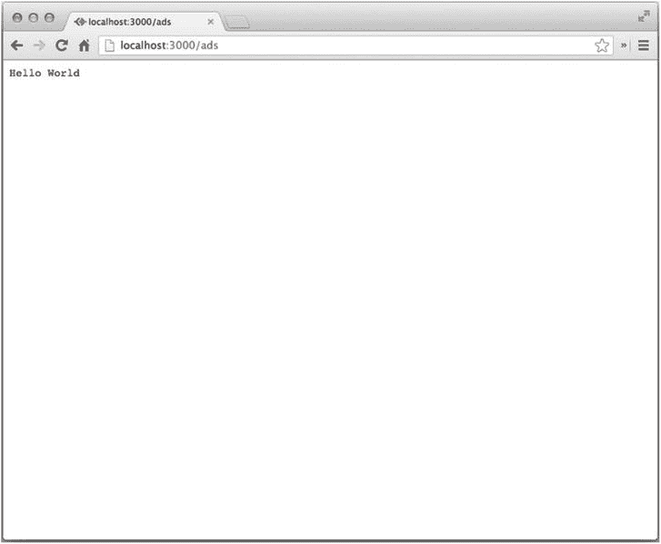
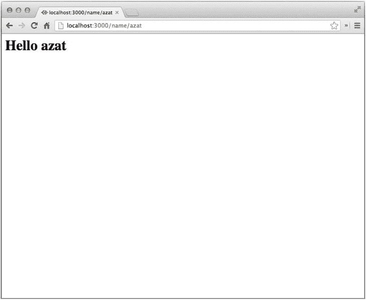
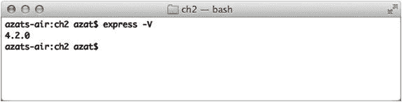
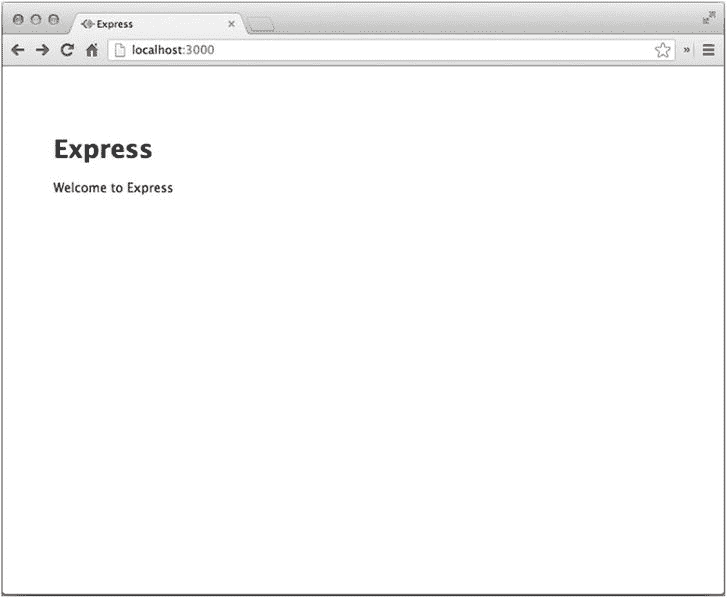
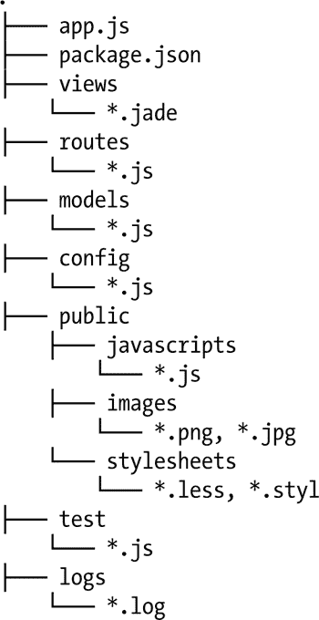

第二章


Hello World 示例

在本章中，为了帮助您使用 Express.js，我们将构建一个典型的编程示例 Hello World 应用。如果你已经构建了这个 Express.js 应用的一些变体(也许通过遵循在线教程)，请随意跳到下一章，或者去[第 3 章](03.html)获取 API 方法和对象，或者去[第 19 章](19.html) - [22](22.html) 获取示例。本章涵盖的主题如下:

*   入门:从头开始创建 minimal Express.js 应用
*   生成器命令:Express.js 生成器的命令行选项
*   MVC 结构和模块:组织 Express.js 应用代码的常用方法
*   监视文件更改:开发技巧

入门指南

我一直喜欢自下而上的教学方法，从最基本的概念开始，向更复杂的概念发展。此外，我注意到，当开发人员学会如何从头开始创建一些东西，而不仅仅是修改现有的项目或使用样板文件时，他们会获得更多的信心。

 **注意**我鼓励读者键入所有代码，因为这样可以提高学习效率。然而，作为参考，对于那些仍然喜欢复制和粘贴的人来说，本章(和其他章节)的代码在位于`https://github.com/azat-co/proexpressjs`的 GitHub 库中。

首先，您将编写一个在端口 3000 上本地运行的 web 服务器。所以，当你在浏览器中打开`http://localhost:3000`位置时，你应该会看到 Hello World。3000 是 Express.js 应用事实上的标准端口号。

 **提示**当你导航到某个页面时，浏览器会发出 GET 请求，所以至少你的服务器应该处理 GET 请求。GET 和其他类型的请求可以用 CURL (Mac [<sup> 1 </sup>](#Fn1) 或 Windows [<sup> 2 </sup>](#Fn2) )或类似的工具来执行。

在文件夹`proexpressjs/ch2`中，创建一个`hello.js`文件。使用你喜欢的文本编辑器，比如 Vim ( `www.vim.org`)、Emacs ( `www.gnu.org/software/emacs/`)、Sublime Text 2 ( `www.sublimetext.com`)或者 TextMate ( `http://macromates.com`)。文件`hello.js`服务器将利用 Express.js 因此，让我们包括这个库:

```js
var express = require('express');

```

现在我们可以创建一个应用(例如，实例化一个 Express.js 对象):

```js
var app = express();

```

web 服务器将在本地端口 3000 上运行，所以让我们在这里定义它:

```js
var port = 3000;

```

接下来，让我们用`app.get()`函数定义*通配符路由* ( `*`):

```js
app.get('*', function(request, response){
  response.end('Hello World');
});

```

`app.get()`函数接受字符串格式的 URL 模式的正则表达式 [<sup>3</sup>](#Fn3) 。在我们的例子中，我们通过指定通配符`*`来处理所有的 URL。

 **注意**正则表达式在许多编程语言中广泛使用，并且工作方式类似，所以如果您已经在 Perl、PHP、Java 等语言中使用过它们，那么您已经知道如何在 JavaScript/Node.js 中使用它们中的大多数。例如，这是电子邮件正则表达式之一:`/^(([^<>()[\]\\.,;:\s@\"]+(\.[^<>()[\]\\.,;:\s@\"]+)*)|(\".+\"))@((\[[0-9]{1,3}\.[0-9]{1,3}\.[0-9]{1,3}\.[0-9]{1,3}\])|(([a-zA-Z\-0-9]+\.)+[a-zA-Z]{2,}))$/`

对于 Express.js，您可以在 routes 中使用 RegExps 来动态定义复杂的 URL 模式。要了解更多关于正则表达式的信息，请查看位于`https://developer.mozilla.org/en-US/docs/Web/JavaScript/Guide/Regular_Expressions`的文档。

使用请求处理程序

`app.get()`方法的第二个参数是一个*请求处理程序* 。典型的 Express.js 请求处理程序类似于我们作为回调传递给 native/core Node.js `http.createServer()`方法的处理程序。对于那些不熟悉核心`http`模块的人来说，请求处理器是一个每当服务器接收到一个特定请求时就会执行的功能，通常由 HTTP 方法(例如`GET`)和 URL 路径(即没有协议、主机和端口的 URL)定义。Express.js 请求处理程序至少需要两个参数— `request`，或简称为`req`，和`response`，或`res`(稍后在[第 9 章](09.html)中会有更多相关内容)。类似于它们的核心对应物，我们可以通过`response.pipe()`和/或`response.on('data', function(chunk) {...})`利用可读和可写的流接口(`http://nodejs.org/api/stream.html`)。

输出终端消息

最后，我们启动 Express.js web 服务器，并在回调中输出一条用户友好的终端消息:

```js
app.listen(port, function(){
  console.log('The server is running, ' +
    ' please, open your browser at http://localhost:%s',
    port);
});

```

为了运行这个脚本，我们从项目文件夹中执行`$ node hello.js`。你会看到“服务器正在运行，请在`http://localhost:3000”`打开你的浏览器，如图[图 2-1](#Fig1) 。


[图 2-1](#_Fig1) 。运行$ node hello.js 的结果

现在，如果您在`http://localhost:3000`(与`http://127.0.0.1:3000`、`http://0.0.0.0:3000`或`http://localhost:3000/`、`)`相同)打开浏览器，无论 URL 路径是什么，您都应该会看到 Hello World 消息(参见[图 2-2](#Fig2) )。URL 路径是域和端口后的字符串，所以对于`http://localhost:3000/`，是`/`，对于`http://localhost:3000/messages/`，是`/messages/`。当您在路线定义中使用“`*`”时，此路径无关紧要。



[图 2-2](#_Fig2) 。浏览器在`http://localhost:3000/ads`打开

这里提供了`hello.js`文件的完整代码供您参考:

```js
var express = require('express');
var port = 3000;
var app = express();

app.get('*', function(request, response){
  resquest.end('Hello World');
});

app.listen(port, function(){
  console.log('The server is running, ' +
    ' please open your browser at http://localhost:%s',
     port);
});

```

增强应用

我们可以通过回显提供给服务器的名称以及“Hello”短语，使我们的示例更具交互性。为此，我们可以使用`$ cp hello.js hello-name.js`复制`hello.js`文件，并在前面示例中的无所不包的路线(`all.get('*', ...)`)之前添加以下路线:

```js
app.get('/name/:user_name', function(req,res) {
  res.status(200);
  res.set('Content-type', 'text/html');
  res.send('<html><body>' +
    '<h1>Hello ' + req.params.user_name + '</h1>' +
    '</body></html>'
  );
});

```

在`/name/:name_route`路由内部，我们设置适当的 HTTP 状态码 ( `200`表示 OK)和 HTTP 响应头，并将动态文本包装在 HTML `body`和`h1`标签中。

 **注意** `response.send()` 是一个特殊的 Express.js 方法，它方便地超越了核心 http 模块`response.end()` 中我们的老朋友所做的事情。例如，前者会自动为我们添加一个`Content-Length` HTTP 头。它还根据提供给它的数据扩充了`Content-Type`—[第 8 章](08.html)中提供了更多详细信息。

下面提供了`hello-name.js`文件的完整源代码(也可以在本书的可下载源代码中找到):

```js
var express = require('express');
var port = 3000;
var app = express();

app.get('/name/:user_name', function(request,response) {
  response.status(200);
  response.set('Content-Type', 'text/html');
  response.end('<html><body>' +
    '<h1>Hello ' + req.params.user_name + '</h1>' +
    '</body></html>'
  );
});

app.get('*', function(request, response){
  response.end('Hello World');
});

app.listen(port, function(){
  console.log('The server is running, ' +
    ' please open your browser at http://localhost:%s',
     port);
});

```

关闭之前的服务器并启动`hello-name.js`脚本后，您将能够看到动态响应；例如，在您的浏览器中输入`http://localhost:3000/name/azat`会产生如图[图 2-3](#Fig3) 所示的屏幕。



[图 2-3](#_Fig3) 。动态 Hello 用户示例

到目前为止，我们已经从头开始创建了两个 Express.js 应用。它们中的每一个都只有几行代码。这应该给你信心，并说明用 Express.js 和 Node.js 创建 web 服务器是多么容易！但是有一种更快的方法——express . js 生成器。让我们来看看它的命令和选项。

发电机命令

与 Ruby on Rails 和许多其他 web 框架相比，Express.js 附带了一个命令行界面(CLI ),用于启动您的开发过程。CLI 为最常见的情况生成了一个基本基础。与 Rails 或 Sails 不同，Express generator 不支持添加路线/模型(在撰写本文时)。

如果你遵循了第 1 章中的[全球安装说明，你应该能看到版本号，如果你在你机器上的任何地方运行`$ express -V`表单*的话。如果您键入`$ express -h`或`$ express --help`，您将获得可用选项及其用法的列表。在本书中，我们使用的是最新(截至本文撰写时)版本 4.2.0，它与 Express.js 4.x 兼容(参见*](01.html)*[图 2-4](#Fig4) )。*



[图 2-4](#_Fig4) 。检查 Express.js 生成器版本

要生成 skeleton Express.js app，我们需要运行一个终端命令 : `express [options] [dir|appname]`(如`express cli-app`)，选项如下:

*   `-e`或`--ejs`增加 EJS 发动机支持(`www.embeddedjs.com`)。默认使用 Jade ( `http://jade-lang.com/tutorial/`)。
*   `-H`或`--hogan`增加 hogan.js 引擎支持。
*   `-c <engine> or --css <engine>`为 Less ( `http://lesscss.org`)、Stylus ( `http://learnboost.github.io/stylus`)或 Compass ( `http://compass-style.org`)添加样式表`<engine>`支持；默认情况下，使用普通 CSS。
*   `-f`或`--force`强制在非空目录上生成应用。

当然，这些选项是可选的，所以你只需运行`express cli-app`就能得到一个默认设置的应用。

如果省略了`dir` / `appname`选项，Express.js 将使用当前文件夹作为项目的基础来创建文件。否则，应用将位于指定的目录下。

生成 Skeleton Express.js 应用

为了进行试验，我们运行这个命令:`$ express -e -c less -f cli-app`。生成器工具将输出创建的文件，并建议运行命令来启动服务器。[图 2-5](#Fig5) 显示了输出。


[图 2-5](#_Fig5) 。运行$ express -e -c less -f cli-app 的结果

如您所见，Express.js 提供了一个健壮的命令行工具来快速生成样板文件。缺点是 Express.js 生成器方法不太容易配置。例如，当你手动创建应用时，可以使用 Handlebars 模板引擎(以及许多其他工具，不仅仅是由 CLI 提供的 Hogan、Jade、JSHTML 或 EJS ),但是 Express.js Generator 没有这个选项(在撰写本文时)。你会在第 5 章中找到更多关于使用 Express.js 不同模板引擎的信息。

接下来，我们将检查生成器创建了什么——换句话说，脚手架使用了什么应用结构。

检查应用的结构

让我们简单地检查一下应用的结构。项目的根文件夹包括两个非常重要的文件，`app.js`和`package.js`，如[图 2-5](#Fig5) 中所示:`create: cli-app/package.json`和`create: cli-app/app.js`。`app.js`文件是主文件(如前一章所述),它连接所有其他部分。`package.json`文件拥有所有需要的依赖项(至少是`express`)。然后，我们有三个文件夹:

*   `public`:静态资产，如图像、浏览器 JavaScript 和 CSS 文件
*   `views`:模板文件，如`*.jade`，或本例中的`*.ejs`
*   请求处理程序被抽象成独立的文件/内部模块

`public`文件夹在`express-generator`生成项目时有三个自己的文件夹:

*   `images`:用于存储图像
*   `javascripts`:对于前端 JavaScript 文件
*   `stylesheets`:对于 CSS，或者在我们的例子中，对于更少的文件(`-c less`选项)

`routes`文件夹有两个文件:`index.js`，处理主页(root 或`/`)，和`users.js`，处理`/users`路线。

`public`文件夹中的文件夹不是强制的，你可以创建任意的文件夹，这些文件夹将通过`express.static()`中间件暴露在你的服务器的`/`路径上。比如`public/img`的内容会在`http://localhost:3000/img`有。我个人更喜欢`img`、`js`、`css`而不是`images`、`javascripts`、`stylesheets`。当您重命名`/public`中的文件夹时，您不需要在 Express.js 配置中做任何额外的更改。

您也可以重命名`views` 和`public`文件夹本身，但是您需要在配置语句中进行一些额外的更改，即更改设置。我们将在第 3 章的[中介绍这些设置。](03.html)

App.js

在您喜欢的文本编辑器中打开主 web 服务器文件`app.js`。我们将简要介绍一下自动生成的代码以及它的功能，然后再深入探讨每一种配置([第 3 章](03.html))。

我们包括以下模块依赖关系:

```js
var express = require('express');
var path = require('path');
var favicon = require('static-favicon');
var logger = require('morgan');
var cookieParser = require('cookie-parser');
var bodyParser = require('body-parser');

var routes = require('./routes/index');
var users = require('./routes/users');

```

接下来，我们创建 Express.js 应用对象:

```js
var app = express();

```

然后，我们定义配置设置。现在，你大概可以根据它们的名字猜出它们的意思。即从哪里获取模板文件(`views`)以及使用什么模板引擎(`view engine`)。关于这些参数的更多细节在[第 3 章](03.html)中提供，所以现在让我们跟随`app.js`文件:

```js
app.set('views', path.join(__dirname, 'views'));
app.set('view engine', 'ejs');

```

我们接下来定义中间件(在第 4 章中详细讨论)来服务 favicon、记录事件、解析请求体、支持旧浏览器的 HTTP 方法、解析 cookies 和利用路由:

```js
app.use(favicon());
app.use(logger('dev'));
app.use(bodyParser.json());
app.use(bodyParser.urlencoded());
app.use(cookieParser());

```

以下中间件负责将较少的样式编译成 CSS 样式，并提供给浏览器:

```js
app.use(require('less-middleware')(path.join(__dirname, 'public')));

```

我们将文件夹(`public`)作为参数传递，让它递归地扫描这个文件夹中的任何`*.less`文件。CSS 文件名和 Less 文件名需要匹配，所以如果我们用`/css/style.css(e.g., in HTML or Jade)`，就需要有`/public/css/style.less`。对于每个请求，Express.js 将编译得更少。

该语句负责从`public`文件夹中提供静态资产:

```js
app.use(express.static(path.join(__dirname, 'public')));

```

路由在一个单独的文件中被定义为一个模块，所以我们只是传递函数的表达式，而不是在这里将它们定义为匿名请求处理程序:

```js
app.get('/', routes.index);
app.get('/users', user.list);

```

Express.js 从`process.env.NODE_ENV`获取它的环境变量，例如，当服务器启动时或者在机器的配置中，它被作为`NODE_ENV=production`传递。有了这个条件，我们为开发环境启用了一个更明确的错误处理程序。生成器为我们提供了一个`404`(未找到)中间件，和两个 500(内部服务器错误)错误处理程序，一个用于开发(更详细)，一个用于生产:

```js
app.use(function(req, res, next) {
    var err = new Error('Not Found');
    err.status = 404;
    next(err);
});
if (app.get('env') === 'development') {
    app.use(function(err, req, res, next) {
        res.status(err.status || 500);
        res.render('error', {
            message: err.message,
            error: err
        });
    });
}
app.use(function(err, req, res, next) {
    res.status(err.status || 500);
    res.render('error', {
        message: err.message,
        error: {}
    });
});

```

与 Hello World 示例不同，此服务器不会立即启动，而是导出:

```js
module.exports = app;

```

在`/bin/www`中，服务器从`app.js`文件导入:

```js
#!/usr/bin/env node
var debug = require('debug')('cli-app');
var app = require('../app');

```

该语句设置了一个名为`port`的自定义设置，以便稍后在服务器启动时使用:

```js
app.set('port', process.env.PORT || 3000);

```

最后，用熟悉的`listen()`启动服务器:

```js
var server = app.listen(app.get('port'), function() {
  debug('Express server listening on port ' + server.address().port);
});

```

以下是`app.js`的完整代码，供您参考:

```js
var express = require('express');
var path = require('path');
var favicon = require('static-favicon');
var logger = require('morgan');
var cookieParser = require('cookie-parser');
var bodyParser = require('body-parser');

var routes = require('./routes/index');
var users = require('./routes/users');

var app = express();

// view engine setup
app.set('views', path.join(__dirname, 'views'));
app.set('view engine', 'ejs');

app.use(favicon());
app.use(logger('dev'));
app.use(bodyParser.json());
app.use(bodyParser.urlencoded());
app.use(cookieParser());
app.use(require('less-middleware')(path.join(__dirname, 'public')));
app.use(express.static(path.join(__dirname, 'public')));

app.use('/', routes);
app.use('/users', users);

/// catch 404 and forward to error handler
app.use(function(req, res, next) {
    var err = new Error('Not Found');
    err.status = 404;
    next(err);
});

/// error handlers

// development error handler
// will print stacktrace
if (app.get('env') === 'development') {
    app.use(function(err, req, res, next) {
        res.status(err.status || 500);
        res.render('error', {
            message: err.message,
            error: err
        });
    });
}

// production error handler
// no stacktraces leaked to user
app.use(function(err, req, res, next) {
    res.status(err.status || 500);
    res.render('error', {
        message: err.message,
        error: {}
    });
});

module.exports = app;

```

如果您导航(`$ cd cli-app)`到项目文件夹并运行`$ npm install`，您应该观察到基于`package.json`条目的 NPM 模块的安装。安装完成后，运行`npm start`或`$ ./bin/www`。当您在浏览器中导航到`http://localhost:3000`时，您应该会看到如图[图 2-6](#Fig6) 所示的响应。



[图 2-6](#_Fig6) 。由生成器创建的样板 Express.js 应用

Express.js 生成器并不是一个非常强大的工具，因为它在样板文件创建之后并没有做太多事情。然而，它为开发人员提供了可用于快速原型制作的样板/框架。此外，初学者还可以了解推荐的结构和代码组织，以及学习如何包含 Less 和`express.static()`等一些中间件。

下一节总结了关于 Express.js 应用的文件夹结构的一些常见模式和约定。

MVC 结构和模块

Express.js 是一个高度可配置的框架，这意味着我们可以应用任何我们认为合适的结构。正如我们在上一节中观察到的，生成器工具立即为我们生成了几个文件夹:`public`、`views`和`routes`。为了坚持通用的 MVC 范式，所缺少的是模型。如果您使用类似 mongose， [<sup>4</sup>](#Fn4) 的东西，您可能想要创建一个名为`models`的文件夹，并将模型和/或模式对象(mongose 模式)放在那里。更高级的应用可能有一个嵌套的文件夹结构，如下所示:



最佳实践是将静态资产放在一个特殊的文件夹下。这些资产也可以用 CoffeeScript 等可编译语言编写。

如果您更喜欢重命名文件夹，只需确保更新您的`app.js`文件(或者其他主脚本文件，如果您正在用不同的文件名从头开始创建应用)中的相应代码。例如，如果我想从文件夹`controllers`中提供与我的用户相关的路线，我会像这样更新我的`app.js`文件:

```js
var user = require('./controllers/user');

```

模块的模式不必很复杂。在主文件中，我们包含了带有`require()`函数的对象，在该模块文件中，我们应用了一个`exports`全局关键字来附加一个我们想要公开的方法(稍后在主文件中使用):

```js
exports.list = function(req, res){
  res.send("respond with a resource");
};

```

这里有一个警告——或者说一个特性，取决于你如何看待它——如果我们省略文件名并需要一个文件夹，比如我们前面例子中的`var routes = require('./routes');`, node . js 将从那个文件夹中获取`index.js`文件，如果存在的话。当声明一些您可能希望在该特定文件夹的文件间共享的助手或实用函数时，这可能会很方便。

在第 13 章中，我们将讨论如何使我们的应用本身成为一个模块，这样我们就可以在一个生产环境中产生多个进程(例如，workers)。

类似的方法也适用于模板文件夹。如果我们决定用`templates`代替`views`，我们需要将设置行改为

```js
app.set('views', path.join(__dirname, 'views'));

```

在这一行中，`app.set()`函数的第一个参数是设置的名称`views`，第二个参数是以全局`__dirname`变量为前缀的动态值。[T5 5T7`__dirname`变量返回正在执行的模块的系统路径。](#Fn5)

监视文件更改

这个主题超出了 Express.js 的范围，但是我相信它非常重要，值得一提。Node.js 应用存储在内存中，如果我们对源代码进行更改，我们需要重新启动该进程—正在运行的 Node.js 程序。在 Mac OS X 上，这是通过在终端中按下以下组合键来实现的:Ctrl+C、向上箭头、Enter。

以下出色的文件查看工具可以利用来自核心 Node.js `fs`模块的`watch()`方法 [<sup>6</sup>](#Fn6) ，并在我们保存来自编辑器的更改时重启我们的服务器。出于本书及其示例的目的，这些工具几乎是相同的，因此没有给出任何偏好；随便挑一个。

*   `forever`:在生产服务器上使用(`https://npmjs.org/package/forever`)
*   `node-dev` : *描述*(`https://npmjs.org/package/node-dev`；GitHub: `https://github.com/fgnass/node-dev`
*   `nodemon`:支持 coffee script(`https://npmjs.org/package/nodemon`)；GitHub: `https://github.com/remy/nodemon`
*   `supervisor`:由《NPM》的创作者之一`https://npmjs.org/package/supervisor`撰写；GitHub: `https://github.com/isaacs/node-supervisor`
*   `up`:由编写 Express.js 的团队编写(`https://npmjs.org/package/up`；GitHub: `https://github.com/LearnBoost/up`

 **提示**因为默认情况下，Express.js 会为每个新请求重新加载一个模板文件，所以不需要重启服务器。但是，我们可以通过启用`view cache`设置来缓存模板。这个和其他设置将在本书第三章的[中详细介绍。](03.html)

摘要

到目前为止，我们已经从头开始创建了一些应用，使用了 Express.js Generator 并探索了它的选项。然后我们看了一种构建 Express.js 应用和组织代码的方法。Express.js 生成器不是一个非常通用的工具，但是通过使用它，您可以使用不同的 CSS 库和模板引擎快速生成一些样板代码。

该框架的可配置性是 Express.js 的主要卖点之一，也是其越来越受欢迎的一个因素。这意味着 Express.js 的方式是提供默认设置，所以最起码你的服务器在没有额外配置的情况下也能正常工作(`ch2/hello.js`只有 13 行)。但与此同时，Express.js 允许熟练的开发人员以合理的方式轻松配置设置。谁会反对知道这些设定呢，对吧？因此，在第 3 章中，我们将探索 Express.js 中最重要的配置设置

________________

[<sup>1</sup>](#_Fn1)T0】

[<sup>2</sup>](#_Fn2) `http://www.confusedbycode.com/curl/#downloads`和`http://curl.haxx.se/download.html`

[<sup>3</sup>](#_Fn3)T0】

[<sup>4</sup>](#_Fn4)T0】

[<sup>5</sup>](#_Fn5)T0】

[<sup>6</sup>](#_Fn6)T0】