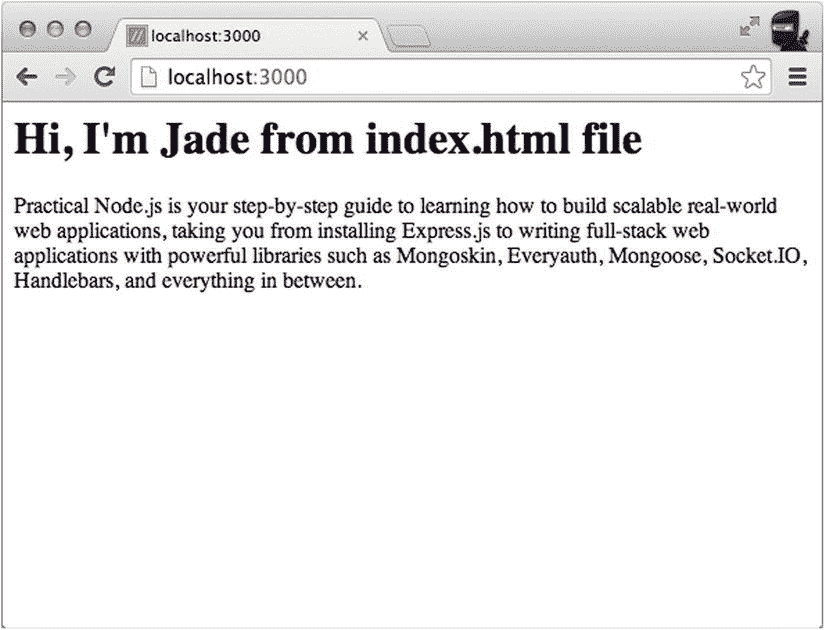
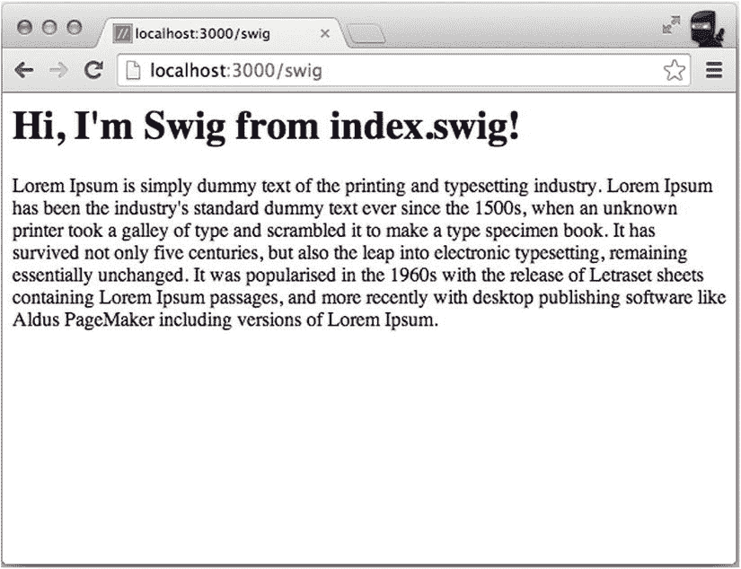
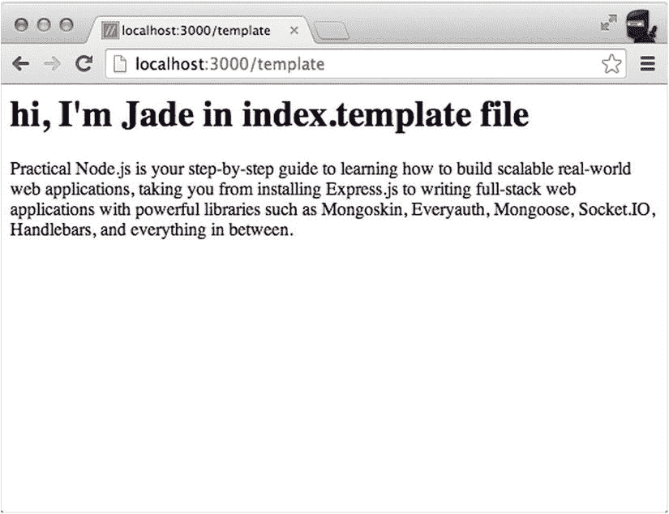

# 五、模板引擎和 Consolidate.js

模板引擎是允许我们使用不同模板语言的库(EJS，把手，Jade 等。).但是什么是模板语言呢？模板语言是一组特殊的指令(语法和控制结构)，指示引擎如何处理数据。该语言特定于特定的模板引擎。模板中的说明通常用于以适合最终用户的更好格式呈现数据。在 web 应用的情况下，这样的最终表示格式是 HTML。所以基本上，我们有一些数据(JSON 或 JavaScript/Node.js 对象)和模板(EJS、把手、Jade 等)。).当它们被组合时，我们得到输出，这是很好的旧 HTML。

数据和模板结合的过程叫做*渲染*。一些模板引擎具有在渲染之前*编译*模板作为额外步骤的功能。编译类似于缓存，适合于频繁重用的优化。

"为什么要使用模板？"你可能会问你以前是否没有用过它们。使用模板比不使用模板有很多好处，其中最重要的是你可以重用代码——例如，菜单、页眉、页脚、按钮和其他表单元素等等。这样，如果您以后需要进行更改，您将只需要在一个地方更新代码，而不是在每个文件中进行更改。另一个优点是，根据您使用的库，您可以使模板更加动态。这意味着您可以向模板添加一些逻辑，使其更加智能(例如，一个`for`循环来迭代表中的每一行)。

Jade 允许在其代码中使用几乎所有的 JavaScript/node . js；也就是说，开发人员可以利用模板中丰富的 JavaScript API 的全部功能！

这与 Handlebars 使用的方法形成了惊人的对比，handle bars 不允许在模板中使用 JavaScript/Node.js 函数。尽管 Handlebars 的理念是限制标准函数，但它允许在 JavaScript/Node.js 代码中注册自定义函数(即，在模板本身之外)。

嵌入式 JavaScript (EJS)是 Node.js 应用的另一个受欢迎的选择，当性能很重要时，它可能是一个更好的替代选择，因为在基准测试中，EJS 比 Jade 表现得更好。大多数模板引擎都适用于浏览器 JavaScript 和 Node.js。

在本章中，我们将讨论以下主题:

*   如何使用模板引擎:将不同的模板引擎插入 Express.js 项目
*   不常见的库:在 Express.js 中使用罕见的模板引擎
*   模板引擎选择:不同的独立模板引擎库
*   Consolidate.js:几乎所有模板引擎与 Express.js 无缝集成的一站式库

如何使用模板引擎

前几章中的一些例子使用了这两个配置语句:

```js
app.set('views', path);
app.set('view engine', name);

```

或者，使用值:

```js
var path = require('path')
// ... Configurations
app.set('views', path.join(__dirname, 'templates'));
app.set('view engine', 'ejs');

```

其中`path`是模板所在文件夹的路径，`name`是模板文件扩展名和 NPM 库名称(如`jade is both an extension and an NMP name`)。

这两行足以让 Express.js 呈现 EJS 或 Jade 模板。我们甚至不需要在`app.js`文件中导入 Jade。(但是我们仍然需要在本地安装模块！)这是因为，在幕后，Express.js 库基于扩展导入库(其确切的工作方式将在本章的下一节描述):

```js
require('jade');

```

或者

```js
require('ejs');

```

有两种方法可以指定模板引擎扩展:

*   用`render()`功能
*   用`view engine`设置

通常文件扩展名是该模板引擎的 NPM 模块名称。以下是第一种方法的示例，在这种方法中，扩展名可以简单地放在 render 函数的参数中的文件名之后:

```js
response.render('index.jade');

```

在路由请求处理程序内部调用 response.render。本章稍后将提供更多关于渲染和其他响应对象方法的详细信息。

如果我们使用这种方法(即带有扩展名的完整文件名)，我们可以省略这一行:

```js
app.set('view engine', 'jade');

```

您可以在一个 Express.js 应用中混合搭配不同的模板引擎。

当然，Express.js 调用的库需要安装在本地`node_modules`文件夹中。例如，要安装`jade` v1.5.0，我们必须在`package.json`中定义它，然后运行:

```js
$ npm install

```

这是来自`ch4/package.json`的台词:

```js
"jade": "1.5.0",

```

要使用任何其他模板引擎，确保用 NPM 安装该模块，最好也通过手动或者用名为 `--save`的`npm install` *将其添加到`package.json`。*

有趣的是，Express.js 使用`views`作为默认值。因此，如果在`views`文件夹中有模板，可以省略这一行:

```js
app.set('views', path.join(__dirname, 'views'));

```

您已经知道如何使用`app.set()`来创建 EJS 和 Jade 模板，所以现在让我们介绍如何使用配置方法:`app.engine()`来使用替代模板引擎。

app.engine()

`app.engine()`方法是一种设置模板引擎的低级方法。Express.js 在幕后使用了这种方法。

默认情况下，Express.js 将试图要求一个基于所提供的扩展的模板引擎(模板引擎 NPM 模块名——这就是为什么我们使用这个名称作为扩展！).例如，当我们在路由的请求处理程序或中间件中以`index.jade`文件名作为参数调用`res.render('index.jade');`(稍后将详细介绍该方法)时，框架在内部调用`require('jade')`。

Express.js 代码中的完整语句(您还不需要自己实现它)是这样的:`app.engine('jade', require('jade').__express);`，其中`__express`是模板库应该实现的约定。

比方说，你更喜欢使用`*.html`或`*.template`而不是`*.jade`来存放你的 Jade 文件。在这种情况下，您可以使用`app.set()`和`app.engine()`来覆盖默认扩展名。例如，要使用`*.html`，请编写以下语句:

```js
app.set('view engine', 'html');
app.engine('html', require('jade').__express);

```

然后，在每条路线中，编写类似这样的内容来呈现`index.html`:

```js
response.render('index');

```

或者，对于`'*.template'`示例，您可以使用另一种方法，不使用视图引擎，在请求处理程序中使用完整的文件名(基本上是复制内部 Express.js 代码):

```js
app.engine('template', require('jade').__express);

```

以下是请求处理程序调用:

```js
response.render('index.template');

```

这种覆盖对于车把和其他采用普通 HTML 的模板引擎来说尤其酷，因为您可以重用您的遗留 HTML 文件而不会有太多麻烦。

不常见的图书馆

现在让我们来看看不常见的模板引擎的使用。如果你打算只使用普通的库，比如 Jade 或 EJS，你可以安全地跳过这一节的其余部分。

不太常见的 Node.js 库选择需要公开`_express`方法，这是表示模板库支持这种 Express.js 格式的常见约定。所以检查一下模板引擎是否在你用`require()`导入的源文件上有`__express()`。如果`__express()`方法存在，那么贡献者使这个库与 Express.js 兼容。同样，大多数库已经配备了使用 Express.js 的功能，他们有`__express()`。

如果你选择的库没有`__express`怎么办？如果模板模块有一个签名类似于`__express`方法签名的方法，你可以很容易地用`app.engine`定义你的模板引擎的方法；比如在`swig` ( `https://github.com/paularmstrong/swig`)中，就是`renderFile()`法。因此，考虑到您选择的模板引擎库中的`renderFile`支持带有这些参数的函数签名:

*   `path`:模板文件的路径
*   `locals`:用于渲染 HTML 的数据
*   `callback`:回调函数

您可以编写这样的代码，将这个库作为 Express.js 中间件来应用:

```js
*// ... Declare dependencies*
*// ... Instantiate the app*
*// ... Configure the app*
app.engine('swig', require('swig').renderFile);
*// ... Define the routes*

```

文件夹中的例子展示了如何使用多个模板引擎和各种扩展。这是`app.js`报表的独家新闻:

```js
*// ... Declare dependencies*
*// ... Instantiate the app*
*// ... Configure the app*
var jade = require('jade');
var consolidate = require('consolidate');

app.engine('html', jade.__express);
app.engine('template', jade.__express);
app.engine('swig', consolidate.swig);
*// ... Define the routes*
app.get('/', function(request, response){
  response.render('index.html');
});

app.get('/template', function(request, response){
  response.render('index.template');
});

app.get('/swig', function(request, response){
  response.render('index.swig');
})

```

这个`consolidate`库将在本章后面解释。

`package.json`文件有以下依赖项(用`npm install`安装它们):

```js
{
  "name": "template-app",
  "version": "0.0.1",
  "private": true,
  "scripts": {
    "start": "node app"
  },
  "dependencies": {
    "consolidate": "^0.10.0",
    "errorhandler": "1.1.1",
    "express": "4.8.1",
    "jade": "1.5.0",
    "morgan": "1.2.2",
    "swig": "^1.4.2",
    "serve-favicon": "2.0.1"
  }
}

```

用`$ node app`启动应用应该会启动服务器，当你进入主页时，它会呈现“嗨，我是来自 index.html 的 Jade”(见[图 5-1](#Fig1) )。



[图 5-1](#_Fig1) 。从 index.html 文件中渲染出的玉石模板

此外，当你转到`/swig`(见[图 5-2](#Fig2) )时，服务器应该呈现“嗨，我正在从 index.swig 中 Swig”。



[图 5-2](#_Fig2) 。从 index.Swig 文件呈现的 swig 模板

最后，当你转到`/template`(见[图 5-3](#Fig3) )时，它应该呈现“嗨，我是 index.template 文件中的 Jade”。



[图 5-3](#_Fig3) 。从 index.Jade 文件呈现的 jade 模板

这可能是一个夸张的例子，因为您很少会在一个 Express.js 应用中使用多个模板引擎。然而，很高兴知道该框架足够灵活，允许您只需几条配置语句就可以实现它。

值得注意的是，在我们的`proexpressjs/ch5`例子中，Jade 文件`index.html`和`index.template`都通过`include filename`使用所谓的自顶向下包含(没有引号)。这允许我们在`lorem-ipsum.html`文件中重用该段落的 Lorem Ipsum 文本。

我们示例中的文件只是一个纯文本文件，但是它可以包含 Jade 模板内容。`index.html`看起来是这样的:

```js
h1 Hi, I'm Jade from index.html file
p
  include lorem-ipsum.html

And the index.temlate is similar:

h1 hi, I'm Jade in index.template file
p
  include lorem-ipsum.html

```

内含物、布局和局部

自顶向下包含是一种标准的继承模式，其中父对象命令在哪里以及对子对象(被包含的对象)做什么。例如，你有一个包含文件 B(一部分)的文件 A，文件 A 将对文件 B 做它想做的事情。这是您将在大多数模板语言中使用的。

自顶向下包含的替代方法是自底向上模式。并非所有语言都支持它。在这种情况下，文件 A 是一个更大、更高层次的实体(A 布局)，文件 B 是拼图中较小的一块，但是文件 B 将决定它想要什么。

当您从父类扩展这些方法时，您也可以将自顶向下的方法视为覆盖子类中的一些方法，同时保持其他方法不变。

在 Jade 中，自底向上是通过一组`extend`、`layout`和`block`语句实现的。关于玉石的深度报道，请参考 *Practical Node.js* (Apress，2014)。

模板引擎选择

本节简要介绍支持 Express.js 的库，无需任何修改。这个选择列表来自 Express.js wiki 页面上的列表:`https://github.com/strongloop/express/wiki#template-engines`。

翡翠

Jade ( `https://github.com/jadejs/jade`)是一个受 Haml 启发的模板引擎。它非常强大，因为它有两种类型的继承，支持所有 JavaScript/Node.js，并且由于将空白和缩进视为语言的一部分，所以需要最少数量的符号/字符。

汉姆·js

Haml.js ( `https://github.com/tj/haml.js`)是一个 Haml 实现。Haml 是 Rails 开发者的标准选择。这种语言将空白和缩进视为语言的一部分，这使得代码更紧凑，更不容易出现打字错误，从而使编写起来更愉快。

EJS

EJS ( `https://github.com/tj/ejs`)是一个嵌入式 JavaScript 模板引擎。根据一些基准性能测试，EJS 比 Jade 或 Haml 更快(例如，参见`http://paularmstrong.github.io/node-templates/benchmarks.html`)。

Handlebars.js

Hbs ( `https://github.com/donpark/hbs`)是 Handlebars.js 的适配器，是 Mustache.js 模板引擎的扩展。按照设计，Handlebars 禁止在模板中放置复杂的逻辑。相反，开发人员需要在模板之外编写函数并注册它们。这是最容易学习的模板引擎。它经常用在反应模板中。如果您熟悉(或计划使用)Angular.js、Meteor 或 DerbyJS，那么这个选择可能更适合您，因为它与它们所使用的类似。

替代适配器是`express-hbs` ( `https://github.com/barc/express-hbs`)，它是 Barc ( `http://barc.com`)的 Express 3 的带有布局、部分和块的把手。

另一个适配器是`express-handlebars` ( `https://github.com/ericf/express-handlebars`)。

Hogan.js 适配器

h4e ( `https://github.com/tldrio/h4e`)是 Hogan.js 的适配器，支持部分和布局。Hulk-hogan ( `https://github.com/quangv/hulk-hogan`)是 Twitter 的 Hogan.js (Mustache syntax)的适配器，支持 partials。

康恩. js

Combyne.js ( `https://github.com/tbranyen/combyne.js`)是一个模板引擎，希望它能按照您预期的方式工作。而`combynexpress` ( `https://github.com/tbranyen/combynexpress`)是 Combyne.js 的快递库

大喝

Swig ( `https://github.com/paularmstrong/swig`)是一个快速的类似 Django 的模板引擎。

胡须

络腮胡 ( `https://github.com/gsf/whiskers.js`)小而快，留着小胡子(看起来像车把或小胡子)。比杰德还快(按`http://paularmstrong.github.io/node-templates/benchmarks.html`)。

叶片

Blade ( `https://github.com/bminer/node-blade`)是一个 HTML 模板编译器，受 Jade 和 Haml 的启发，将空白视为语言的一部分。

汉默咖啡

Haml-Coffee ( `https://github.com/netzpirat/haml-coffee`)提供了 Haml 模板，你可以在其中编写内嵌的 CoffeeScript。如果您将 CoffeeScript 用于 Node.js 代码，这是非常完美的(CoffeeScript 的好处在本演示中突出显示:`http://www.infoq.com/presentations/coffeescript-lessons`)。

鹰眼

Webfiller ( `https://github.com/haraldrudell/webfiller`)是一个普通的 HTML5 双面渲染引擎，具有自我配置的路径，有组织的源代码树。Webfiller 是 100% JS。

巩固. js

如果您选择的模板引擎没有提供一个`__express()`方法，或者您不确定并且不想费心去寻找，可以考虑 consolidate 库(`https://npmjs.org/package/consolidate`；GitHub: `https://github.com/tj/consolidate.js`。

`consolidate`库简化并概括了几十个模板引擎模块，因此它们可以“很好地”与 Express.js 一起使用。这意味着不需要查找源代码来搜索`__express()`方法的存在。您需要做的只是整合，然后将您选择的引擎映射到扩展。

下面是一个 Consolidate.js 示例:

```js
var express = require('express');
var consolidate = require('consolidate');

var app = express();

*// ... Configure template engine*
app.engine('html', consolidate.handlebars);
app.set('view engine', 'html');
app.set('views', __dirname + '/views');

```

就是这样；`res.render()`准备使用车把！

在撰写本文时，Consolidate.js 支持的模板引擎如[表 5-1](#Tab1) 所示(编译自 Consolidate.js GitHub 页面:`https://github.com/tj/consolidate.js/blob/master/Readme.md`)。

[表 5-1](#_Tab1) 。Consolidate.js 支持的模板引擎

<colgroup><col width="20%"> <col width="40%"> <col width="40%"></colgroup> 
| 

模板引擎

 | 

开源代码库

 | 

网站(如果适用)

 |
| --- | --- | --- |
| ATP 的 | `https://github.com/soywiz/atpl.js` |   |
| 灰尘 | `https://github.com/akdubya/dustjs` | `http://akdubya.github.io/dustjs/` |
| 生态的 | `https://github.com/sstephenson/eco` |   |
| 电休克疗法 | `https://github.com/baryshev/ect` | `http://ectjs.com` |
| ejs | `https://github.com/tj/ejs` | `http://www.embeddedjs.com` |
| 低增生性急性髓细胞性白血病 | `https://github.com/tj/haml.js` | `http://haml.info` |
| 汉默咖啡 | `https://github.com/9elements/haml-coffee` | `http://haml.info` |
| handlebars.js | `https://github.com/wycats/handlebars.js/` | `http://handlebarsjs.com` |
| 霍根网 | `https://github.com/twitter/hogan.js` | `http://twitter.github.io/hogan.js` |
| 翡翠 | `https://github.com/jadejs/jade` | `http://jade-lang.com` |
| 爵士乐 | `https://github.com/shinetech/jazz` |   |
| jqtpl | `https://github.com/kof/jqtpl` |   |
| 仅仅 | `https://github.com/baryshev/just` |   |
| 酒 | `https://github.com/chjj/liquor` |   |
| 洛拉斯 | `https://github.com/lodash/lodash` | `https://lodash.com` |
| 髭 | `https://github.com/janl/mustache.js` | `http://mustache.github.io` |
| 努恩朱克斯 | `http://mozilla.github.io/nunjucks/` |   |
| QEJS | `https://github.com/jepso/QEJS` |   |
| 活跃的 | `https://github.com/ractivejs/ractive` |   |
| 大喝 | `https://github.com/paularmstrong/swig` | `http://paularmstrong.github.com/swig/` |
| 模板化的 | `http://archan937.github.io/templayed.js/` |   |
| 太妃糖 | `https://github.com/malgorithms/toffee` |   |
| 强调 | `https://github.com/jashkenas/underscore` | `http://documentcloud.github.io/underscore/` |
| 海象 | `https://github.com/jeremyruppel/walrus` | `http://documentup.com/jeremyruppel/walrus/` |
| 胡须 | `https://github.com/gsf/whiskers.js/` |   |

Jade 模板语言本身就相当广泛，超出了本书的范围。要了解每个功能以及 extend 和 include(自上而下和自下而上)之间的差异，请参考 *Practical Node.js* (Apress，2014)，其中有一整章专门讨论 Jade 和手柄。

摘要

模板是现代 web 开发的主要部分。没有它们，开发人员将不得不编写更多的代码，维护将会非常痛苦。说到 Node.js，Jade——与 Ruby on Rails 的 Haml 非常接近——是一个强大的选择。这是由于它丰富的特性和优雅的风格(空白和缩进是语言的一部分)。但是不先学玉就不要企图写玉。可能会很痛苦。

Express.js 支持不同的方法来配置模板和文件扩展名的位置。此外，Express.js 在配置拼图的不同部分时大放异彩；更改模板引擎只需要几行代码。

NPM 用户区提供了大量的模板引擎选择——正如您在“Consolidate.js”一节中看到的，还有许多其他模板库可以轻松地与 Express.js 兼容。他们有不同的风格、设计和表演。例如，Swig、EJS 和其他一些库经常在基准测试中胜过 Jade。如果你习惯了车把和小胡子的`{{...}}}`风格(例如，来自 angular . js)——或者你没有时间来适当地学习 Jade 那么你可以马上使用那些库！

本章总结了`app.js`文件的配置部分。我们继续走路线。我们将从路由的定义和从 URL 中提取参数开始。