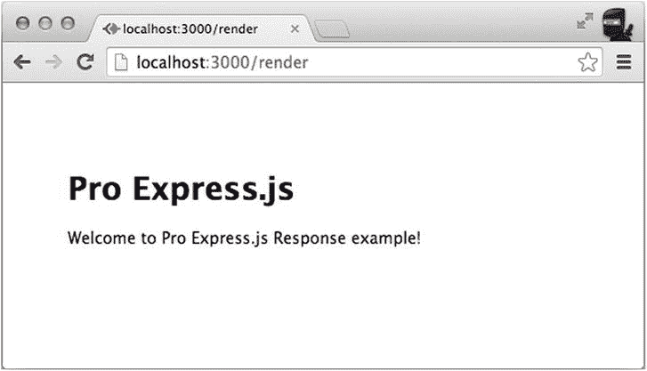
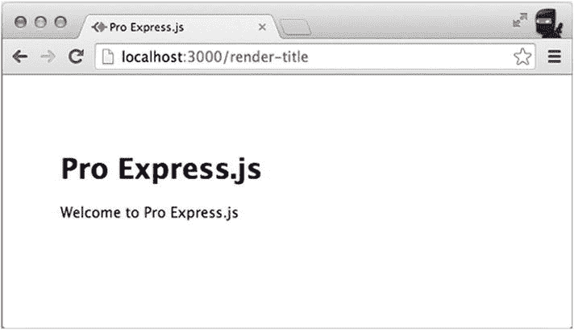
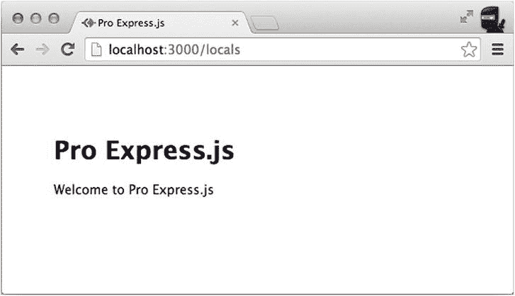
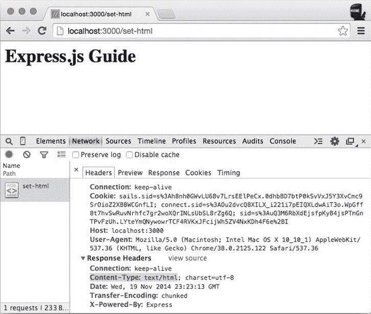
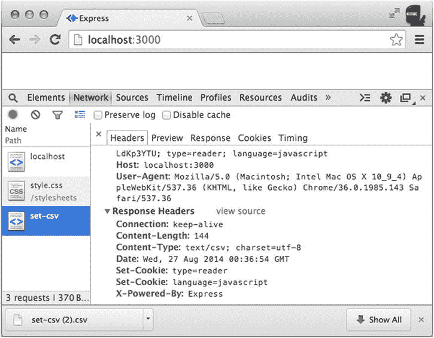
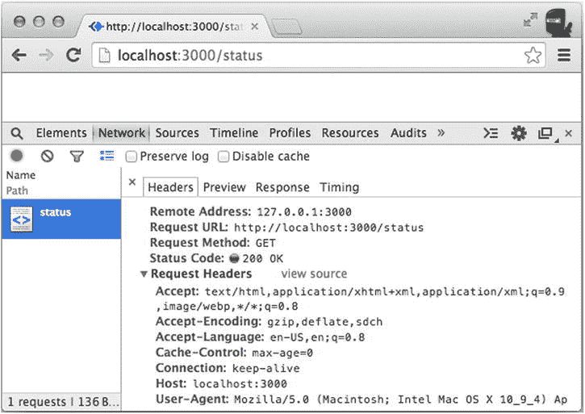
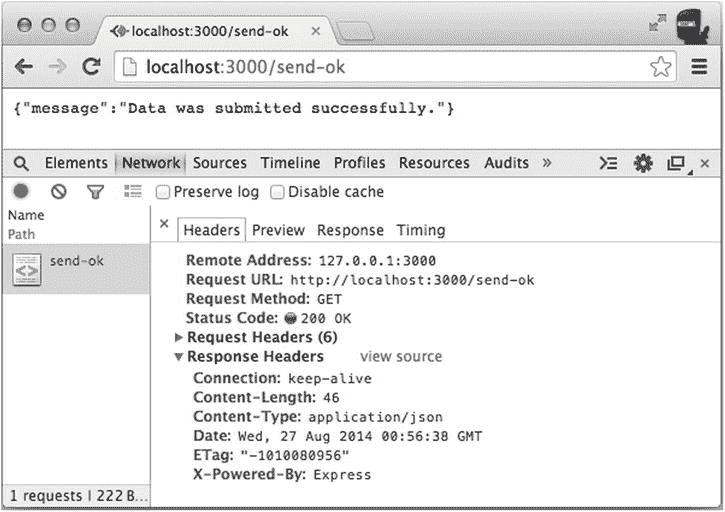
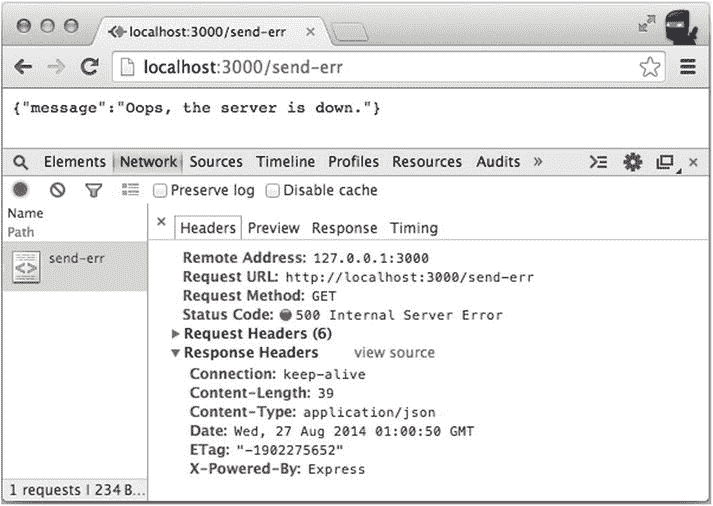
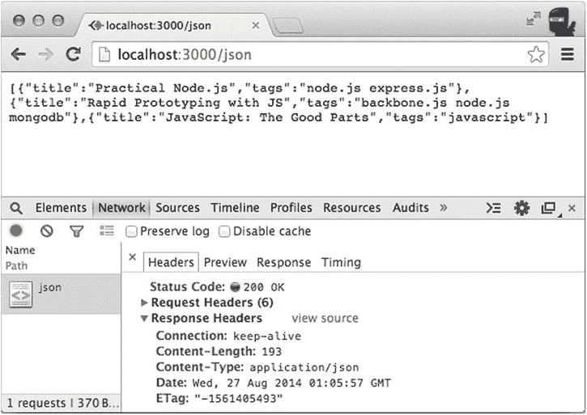
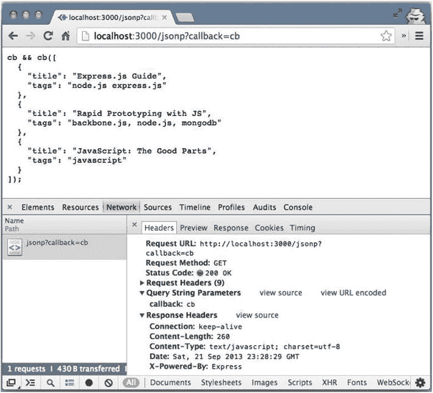

第八章


Express.js 响应对象

Express.js 响应对象(简称`res`)——它是请求处理程序回调中的一个参数——是老一套的 Node.js `http.response`对象 [<sup>1</sup>](#Fn1) 。这是因为 Express.js 响应对象有新的方法。换句话说，Express.js 响应对象是`http.response`类的扩展。

为什么有些人会使用这些额外的方法？的确，你可以使用`response.end()`方法 [<sup>2</sup>](#Fn2) 和其他核心方法，但那样你就必须编写更多的代码。例如，您必须手动添加内容类型头。但是使用 Express.js 响应对象，它包含方便的包装器，如`response.json()`和`response.send()`，适当的内容类型会被自动添加。

在本章中，我们将详细介绍 Express.js 响应对象的以下方法和属性:

*   `response.render()`
*   `response.``locals`T2】
*   `response.set()`
*   `response.status()`
*   `response.send()`
*   `response.json()`
*   `response.jsonp()`
*   `response.redirect()`

为了演示这些方法，我们在厨房水槽应用程序 `ch8/app.js`中使用了它们。其他方法和属性及其含义将在[表 8-1](#Tab1) 中列出。在本章的最后，我们将介绍如何使用 streams 和 Express.js 响应。

从示例应用程序开始，用`express-generator`和`$ express response`终端命令创建一个全新的 Express.js 应用程序。显然，现在你需要运行`$ cd response && npm install`来下载依赖项。最初的`ch8/app.js`应用程序将与来自[第 7 章](07.html)的最初应用程序相同。

response.render()

`response.render()`方法是 Express.js 的主食。从我们前面的例子和函数的名字，你可以猜测它与从模板(如 Jade、Handlebars 或 EJS)和数据生成 HTML 有关。

`response.render(name, [data,] [callback])`方法有三个参数，但只有一个是强制的，这是第一个参数:`name`，它是字符串格式的模板名称。其他参数是`data`和`callback`。如果你省略了`data`，但是有`callback`，那么`callback`成为第二个参数。

模板名可以用或不用扩展名来标识。有关模板引擎扩展的更多信息，请参考第 5 章[。](05.html)

为了说明`response.render()`最简单的用例，我们将创建一个页面，显示来自 Jade 模板的标题和段落。

首先，添加一条路线。下面是一个在`response/app.js`文件中简单设置主页路径的例子:

```js
app.get('/render', function(req, res) {
  res.render('render');
});

```

然后，添加一个新的`views/render.jade`文件，它现在看起来是静态的(即，它没有变量或逻辑):

```js
extends layout

block content
  h1= 'Pro Express.js'
  p Welcome to the Pro Express.js Response example!

```

最后，用`$ node app`启动响应应用程序，并在浏览器中转至`http://localhost:3000`。你应该会看到如图[图 8-1](#Fig1) 所示的欢迎信息。



[图 8-1](#_Fig1) 。不带参数的普通 response.render()调用的结果

 **注意** Jade 使用类似 Python/Haml 的语法，考虑到了空格和制表符。小心标记。我们可以使用`=`作为*打印*命令(`h1`标签)或者什么都不用(`p`标签)。欲了解更多信息，请访问官方文档(`http://jade-lang.com/`)或查看*Practical node . js*(a press，2014)。 [<sup>3</sup>](#Fn3) 

`response.render()`除了必须的`name`参数外，还有两个可选参数:`data`和`callback`。`data`参数使模板比静态 HTML 文件更动态，并允许我们更新输出。例如，我们可以通过“标题”来覆盖默认值中的值:

```js
app.get('/render-title', function(req, res) {
  res.render('index', {title: 'Pro Express.js'});
});

```

`index.jade`文件保持不变。它打印标题值，如下所示:

```js
extends layout

block content
  h1= title
  p Welcome to #{title}

```

`/render-title`路线的结果如图[图 8-2](#Fig2) 所示。`h1`标题文本已更改为 Pro Express.js。



[图 8-2](#_Fig2) 。带有数据参数的 response.render()示例具有标题属性

`response.render()` `callback` 参数本身接受两个参数:`error`和`html`(一个输出的 HTML 字符串)。这个例子不在`res/app.js`项目中，但是展示了如何向`response.render()`传递回调:

```js
app.get('/render-title', function(req, res) {
  res.render('index', {title: 'Pro Express.js'}, function (error, html) {
    *// Do something*
  });
});

```

 **注意**`data`参数的属性是模板中的局部变量。换句话说，如果您想访问模板中标题的值，数据对象必须包含一个键/值对。大多数模板引擎都支持嵌套对象。

因为 Express.js 能够确定参数的类型，所以`callback`可以代替`data`。这个例子不在`response/app.js`中，但是展示了如何用我们的数据传递回调:

```js
app.get('/render-title', function(req, res) {
  res.render('index', function (error, html) {
    *// Do something*
  });
});

```

在后台，`response.render()`调用`response.send()`(这将在本章后面介绍)成功编译 HTML 字符串，或者调用`req.next(error)`失败，如果没有提供回调，则调用*。换句话说，对`response.render()`的默认回调是来自位于`https://github.com/visionmedia/express/blob/3.3.5/lib/response.js#L753`的 GitHub 上 3.3.5 版本位置的代码:*

```js
*// Default callback to respond*
fn = fn || function(err, str){
  if (err) return req.next(err);
  self.send(str);
};

```

查看这段代码，您会发现，只要响应有一个结尾(`response.json`、`response.send`或`response.end`)，就可以很容易地编写自己的回调函数来做任何事情。

响应.本地人

`response.locals`对象是向模板传递数据的另一种方式，这样数据和模板都可以被编译成 HTML。您已经知道第一种方法是将数据作为参数传递给`response.render()`方法，如前所述:

```js
app.get('/render-title', function(req, res) {
  res.render('index', {title: Pro Express.js'});
});

```

然而，有了`response.locals`，我们可以实现同样的事情。我们的对象将在模板内部可用:

```js
app.get('/locals', function(req, res){
  res.locals = { title: 'Pro Express.js' };
  res.render('index');
});

```

同样，`index.jade` Jade 模板保持不变:

```js
extends layout

block content
  h1= title
  p Welcome to #{title}

```

在[图 8-3](#Fig3) 中可以看到标题为 Pro Express.js 的网页。但是，如果什么都没有改变，那么`response.locals`有什么好处呢？这样做的好处是，我们可以在一个中间件中公开(即传递给模板)信息，但是稍后在另一个请求处理程序中呈现实际的模板。例如，您可以在不渲染的情况下执行身份验证(这段代码不在`ch8/app.js`中):

```js
app.get('/locals',
  function(req, res){
    res.locals = { user: {admin: true}};
    next();
  }, function(req, res){
    res.render('index');
});

```



[图 8-3](#_Fig3) 。response.locals 示例呈现与 response.render()示例相同的页面

 **提示**有时候，为了调试，查看特定 Jade 模板中所有可用变量的列表是很有用的。为此，只需插入以下日志语句:`- console.log(locals);`。更多关于翡翠的信息，请参考*实用 Node.js * (Apress，2014)。 [<sup>4</sup>](#Fn4) 

response.set()

`response.set(field, [value])`方法是`response.header()`的别名(或者反过来),充当 Node.js http 核心模块的`response.setHeader()`函数的包装器。 [<sup>5</sup>](#Fn5) 主要区别在于，Express.js' `response.set()`足够聪明，当我们以对象的形式传递多个头值对给它时，它会递归地调用自己。如果前面的句子对您没有多大意义，请参阅本节后面的 CSV 示例。

下面是一个来自`ch8/app.js`的例子，它将单个`Content-Type`响应头设置为`text/html`，然后向客户端发送一些简单的 HTML:

```js
app.get('/set-html', function(req, res) {
  *// Some code*
  res.set('Content-Type', 'text/html');
  res.end('<html><body>' +
    '<h1>Express.js Guide</h1>' +
    '</body></html>');
});

```

你可以在 Chrome 开发者工具的“网络”标签中看到结果，在“标题”子标签下，显示为`Content-Type: text/html`(参见[图 8-4](#Fig4) )。如果我们没有带`text/html`的`response.set()`，那么响应仍然会有 HTML，但是没有标题的*。随意评论`response.set()`，自己看。*



[图 8-4](#_Fig4) 。使用 Content-Type: text/html 标题呈现 HTML 的 response.set()示例

当我们没有用`response.set()`显式设置 Content-Type 时，它就消失了，因为 Express.js' `response.send()`会自动添加`Content-Type`和其他头，但 core `response.end()`不会。本章稍后将详细介绍`response.send()`。

不过，我们的服务器通常需要提供不止一个头，以便所有不同的浏览器和其他 HTTP 客户端能够正确处理它。让我们探索一个向`response.set()`方法传递多个值的例子。

假设我们正在构建的服务发出包含书名和标签的逗号分隔值(CVS)文件。这就是我们如何在`ch8/app.js`文件中实现这条路线:

```js
app.get('/set-csv', function(req, res) {
  var body = 'title, tags\n' +
    'Practical Node.js, node.js express.js\n' +
    'Rapid Prototyping with JS, backbone.js node.js mongodb\n' +
    'JavaScript: The Good Parts, javascript\n';
  res.set({'Content-Type': 'text/csv',
    'Content-Length': body.length,
    'Set-Cookie': ['type=reader', 'language=javascript']});
  res.end(body);
});

```

现在，如果你将 Chrome 转向`http://localhost:3000/set-csv`，浏览器将识别 CSV MIME 类型并下载文件，而不是打开它(至少使用默认的 Chrome 设置，没有额外的扩展名)。您可以在图 8-5 的[中看到标题。](#Fig5)



[图 8-5](#_Fig5) 。response.set()示例使用 CSV 数据呈现内容长度、内容类型和 Set-Cookie 头

response.status()

`response.status()`方法接受一个 HTTP 状态码 [<sup>6</sup>](#Fn6) 号，并发送它作为响应。最常见的 HTTP 状态代码有:

*   `200`:好的
*   `201`:已创建
*   `301`:永久移动
*   `401`:未经授权
*   `404`:未找到
*   `500`:内部服务器错误

你可以在第 9 章中找到一个更长的 HTTP 状态列表。其核心对应物 [<sup>7</sup>](#Fn7) 的唯一区别在于`response.status()`是可链接的。状态代码对于构建 REST APIs 非常重要，因为它们使您能够标准化请求的结果。

让我们演示一下`response.status()`如何在 pulse route 上工作，如果服务器还在运行，它将返回`200` (OK)。这个路由不会故意发回任何文本或 HTML。我们使用`response.end()`，因为`response.send()`会自动添加正确的状态代码 200:

```js
app.get('/status', function(req, res) {
  res.status(200).end();
});

```

如果你去`http://localhost:3000/status`，你会看到一个绿色的圆圈和数字 200，如图[图 8-6](#Fig6) 所示。



[图 8-6](#_Fig6) 。response.status()示例响应

response.send()

`response.send()`方法介于高级`response.render()`和低级`response.end()`之间。`response.send()`方法使用自动生成的*特有的* HTTP 头(如 Content-Length、ETag 或 Cache-Control)方便地输出任何数据应用程序(如字符串、JavaScript 对象，甚至缓冲区)。

由于其杂食(消耗任何输入)行为(由`arguments.length`引起)，`response.send()`可以通过这些输入参数以无数种方式使用:

*   *用文本/html 字符串* : `response.send('success');`
*   用 JSON 表示的*对象* : `response.send({message: 'success'});`或`response.send({message: 'error'});`
*   用 JSON 表示的*数组* : `response.send([{title: 'Practical Node.js'}, {title: 'Rapid Prototyping with JS'}]);`
*   *缓冲器* : `response.send(new Buffer('Express.js Guide'));`与`application/octet-stream`

 **提示**发送以`response.send(number)`为状态码的数字在 Express.js 4.x 中已被弃用，改用`response.status(number).send()`。

状态代码和数据参数可以组合在一个链式语句中。例如:

```js
app.get('/send-ok', function(req, res) {
  res.status(200).send({message: 'Data was submitted successfully.'});
});

```

在添加新的`send-ok`路由并重启服务器之后，当您转到`/send-ok`时，您应该能够看到 JSON 消息。注意状态代码和`Content-Type`标题。虽然 200 会自动添加，但建议为所有其他情况设置状态，如`201`表示已创建，或`404`表示未找到。



图 8-7。response.send() 200 状态代码示例响应

以下是将`500`内部服务器错误状态代码与错误消息一起发送的示例(用于服务器错误):

```js
app.get('/send-err', function(req, res) {
  res.status(500).send({message: 'Oops, the server is down.'});
});

```

同样，当您在浏览器中检查这条路线时，有一个 JSON 内容类型，但现在您会看到一个红圈和数字`500`。



图 8-8。响应状态(500)。send() 500 状态代码示例响应

如果之前明确指定，由`response.send()`生成的标题可能会被覆盖。例如，缓冲区类型将把`Content-Type`作为`application/octet-stream`，但是我们可以用

```js
app.get('/send-buf', function(req, res) {
  res.set('Content-Type', 'text/plain');
  res.send(new Buffer('text data that will be converted into Buffer'));
});

```

产生的内容类型和文本如[图 8-9](#Fig9) 所示。


[图 8-9](#_Fig9) 。response.send()缓冲示例响应

 **注意**几乎所有的核心 Node.js 方法(以及 Connect.js 方法)都可以在 Express.js 对象中找到。因此，我们可以访问 Express.js 响应 API 中的`response.end()`和其他方法。

response.json()

`response.json()`方法是发送 JSON 数据的一种便捷方式。当传递的数据是数组或对象类型时，相当于`response.send()`。在其他情况下，`response.json()`用`JSON.stringify()`强制数据转换。默认情况下，标题`Content-Type`设置为`application/json`，但可以在`response.json()`之前用`response.set()`覆盖。

如果你记得我们在[第三章](03.html)、`json replacer`和`json spaces`中的老朋友，那就是这些设定被考虑的地方。

`response.json()`最常见的用法是使用适当的状态代码:

```js
app.get('/json', function(req, res) {
  res.status(200).json([{title: 'Practical Node.js', tags: 'node.js express.js'},
    {title: 'Rapid Prototyping with JS', tags: 'backbone.js node.js mongodb'},
    {title: 'JavaScript: The Good Parts', tags: 'javascript'}
  ]);
});

```

请注意图 8-10 中`response.json()`生产的 JSON `Content-Type`和`Content-Length`头。



[图 8-10](#_Fig10) 。使用 response.json()的结果:自动生成的头

 **注**[图 8-10](#Fig10) 中的`response.json()`例子截图是在`ch8/app.js`项目的`ch8/app.js`文件中添加路线后拍摄的。我们鼓励你自己尝试这样做。

`response.json()`的其他用法也是可能的——例如，没有状态代码:

```js
app.get('/api/v1/stories/:id', function(req,res){
  res.json(req.story);
});

```

假设`req.story`是一个数组或一个对象，下面的代码将产生与前面的代码片段类似的结果(在这两种情况下都不需要将头设置为`application/json`):

```js
app.get('/api/v1/stories/:id', function(req,res){
  res.send(req.story);
});

```

response.jsonp()

`response.jsonp()`方法类似于`response.json()`,但是提供了一个 JSONP 响应。也就是说，JSON 数据被包装在 JavaScript 函数调用中。例如，`processResponse({...});`通常用于跨域呼叫支持。默认情况下，Express.js 使用一个`callback`名称来提取回调函数的名称。可以用`jsonp callback name`设置覆盖该值(更多信息见第 3 章[)。如果请求的查询字符串中没有指定适当的回调(例如`?callback=cb`，那么响应就是 JSON。](03.html)

假设通过 JSONP 向前端请求提供 CSV 数据(`status(200)`是可选的，因为默认情况下 Express 会自动添加正确的状态 200):

```js
app.get('/', function (req, res) {
  res.status(200).jsonp([{title: 'Express.js Guide', tags: 'node.js express.js'},
    {title: 'Rapid Prototyping with JS', tags: 'backbone.js, node.js, mongodb'},
    {title: 'JavaScript: The Good Parts', tags: 'javascript'}
  ]);
});

```



[图 8-11](#_Fig11) 。response.jsonp()的结果和？callback=cb 是一个文本/javascript 头和 javascript 函数前缀

 **注**[图 8-11](#Fig11) 中的`response.json()`示例截图是在 ch2/ `cli-app/app.js`项目的`index.js`文件中添加路线后拍摄的。我们鼓励你自己尝试这样做。

response.redirect()

有时我们只需要将用户/请求重定向到另一个路由。我们可以使用绝对、相对或完整路径:

```js
res.redirect('/admin');
res.redirect('../users');
res.redirect('http://rapidprototypingwithjs.com');

```

默认情况下，`response.redirect()`发送 302(找到/临时移动)状态代码。 [<sup>8</sup>](#Fn8) 当然，我们可以像`response.send()`一样，根据自己的喜好进行配置；即，将第一个状态代码编号作为第一个参数进行传递(`301`被永久移动):

```js
res.redirect(301, 'http://rpjs.co');

```

其他响应方法和属性

在[表 8-1](#Tab1) 中列出的大多数方法和属性都是书中已经介绍过的方法的方便替代。换句话说，我们可以用 main 方法完成大部分逻辑，但是知道下面的快捷键可以让开发人员节省一些击键次数，提高可读性。例如，`response.type()`是仅用于`Content-Type`报头的`response.header()`的一个特例。

[表 8-1](#_Tab1) 。方法和属性备选方案

| 

方法/属性

 | 

描述/条件

 | 

应用程序接口

 |
| --- | --- | --- |
| `response.get()` | 传递的标头类型的响应标头的字符串值 | `http://expressjs.com/api.html#res.get` |
| `response.cookie()` | 接受 cookie 键/值对，并在响应时设置它 | `http://expressjs.com/api.html#res.cookie` |
| `response.clearCookie()` | 采用 cookie 键/名称和可选路径参数来清除 cookie | `http://expressjs.com/api.html#res.clearCookie` |
| `response.location()` | 将相对、绝对或完整路径作为字符串，并将该值设置为`Location`响应头 | `http://expressjs.com/api.html#res.location` |
| `response.charset` | 响应的字符集值 | `http://expressjs.com/api.html#res.charset` |
| `response.type()` | 获取一个字符串并将其设置为`Content-Type`头的值 | `http://expressjs.com/api.html#res.type` |
| `response.format()` | 将对象作为类型和响应的映射，并根据`Accepted`请求头执行它们 | `http://expressjs.com/api.html#res.format` |
| `response.attachment()` | 将可选文件名作为字符串，并将`Content-Disposition`(如果提供了文件名，`Content-Type`)标题设置为`attachment`并相应地设置文件类型 | `http://expressjs.com/api.html#res.attachment` |
| `response.sendfile()` | 获取服务器上文件的路径、各种选项和回调参数，并将文件发送给请求者 | `http://expressjs.com/api.html#res.sendfile` |
| `response.download()` | 取与`response.sendfile()`相同的参数，设置`Content-Disposition`并调用`response.sendfile()` | `http://expressjs.com/api.html#res.download` |
| `response.links()` | 接受一个 URL 对象来填充`Links`响应头 | `http://expressjs.com/api.html#res.links` |

您可以在`ch8`文件夹和 GitHub ( `https://github.com/azat-co/proexpressjs`)上找到本章示例的完整源代码。[清单 8-1](#list1) 展示了`ch8/app.js`文件的样子(包括其他例子)。

[清单 8-1](#_list1) 。ch8/app.js 文件

```js
var express = require('express');
var fs = require('fs');
var path = require('path');
var favicon = require('serve-favicon');
var logger = require('morgan');
var cookieParser = require('cookie-parser');
var bodyParser = require('body-parser');

var routes = require('./routes/index');

var largeImagePath = path.join(__dirname, 'files', 'large-image.jpg');

var app = express();

// View engine setup
app.set('views', path.join(__dirname, 'views'));
app.set('view engine', 'jade');
app.use(logger('combined'));
app.use(favicon(path.join(__dirname, 'public', 'favicon.ico')));
app.use(bodyParser.json());
app.use(bodyParser.urlencoded({extended: true}));
app.use(cookieParser('abc'));
app.use(express.static(path.join(__dirname, 'public')));

app.use('/', routes);

app.get('/render', function(req, res) {
  res.render('render');
});

app.get('/render-title', function(req, res) {
  res.render('index', {title: 'Pro Express.js'});
});

app.get('/locals', function(req, res){
  res.locals = { title: 'Pro Express.js' };
  res.render('index');
});

app.get('/set-html', function(req, res) {
  // Some code
  res.set('Content-Type', 'text/html');
  res.end('<html><body>' +
    '<h1>Express.js Guide</h1>' +
    '</body></html>');
});

app.get('/set-csv', function(req, res) {
  var body = 'title, tags\n' +
    'Practical Node.js, node.js express.js\n' +
    'Rapid Prototyping with JS, backbone.js node.js mongodb\n' +
    'JavaScript: The Good Parts, javascript\n';
  res.set({'Content-Type': 'text/csv',
    'Content-Length': body.length,
    'Set-Cookie': ['type=reader', 'language=javascript']});
  res.end(body);
});

app.get('/status', function(req, res) {
  res.status(200).end();
});

app.get('/send-ok', function(req, res) {
  res.status(200).send({message: 'Data was submitted successfully.'});
});

app.get('/send-err', function(req, res) {
  res.status(500).send({message: 'Oops, the server is down.'});
});

app.get('/send-buf', function(req, res) {
  res.set('Content-Type', 'text/plain');
  res.status(200).send(new Buffer('text data that will be converted into Buffer'));
});

app.get('/json', function(req, res) {
  res.status(200).json([{title: 'Practical Node.js', tags: 'node.js express.js'},
    {title: 'Rapid Prototyping with JS', tags: 'backbone.js node.js mongodb'},
    {title: 'JavaScript: The Good Parts', tags: 'javascript'}
  ]);
});

app.get('/non-stream', function(req, res) {
  var file = fs.readFileSync(largeImagePath);
  res.end(file);
});

app.get('/non-stream2', function(req, res) {
  var file = fs.readFile(largeImagePath, function(error, data){
    res.end(data);
  });
});

app.get('/stream1', function(req, res) {
  var stream = fs.createReadStream(largeImagePath);
  stream.pipe(res);
});

app.get('/stream2', function(req, res) {
  var stream = fs.createReadStream(largeImagePath);
  stream.on('data', function(data) {
    res.write(data);
  });
  stream.on('end', function() {
    res.end();
  });
});

/// Catch 404 and forward to error handler
app.use(function(req, res, next) {
    var err = new Error('Not Found');
    err.status = 404;
    next(err);
});

/// Error handlers

// Development error handler
// Will print stacktrace
if (app.get('env') === 'development') {
    app.use(function(err, req, res, next) {
        res.status(err.status || 500);
        res.render('error', {
            message: err.message,
            error: err
        });
    });
}

// Production error handler
// No stacktraces leaked to user
app.use(function(err, req, res, next) {
    res.status(err.status || 500);
    res.render('error', {
        message: err.message,
        error: {}
    });
});

module.exports = app;

var debug = require('debug')('request');

app.set('port', process.env.PORT || 3000);

var server = app.listen(app.get('port'), function() {
  debug('Express server listening on port ' + server.address().port);
});

```

流

至于在`response.send()`和`response.end()`之间发送非流式响应，您应该已经在前面的讨论中有所涉及。然而，对于流数据的返回，`response.send()`是行不通的；相反，您应该使用响应对象(这是一个可写的流，继承自`http.ServerResponse` ):

```js
app.get('/stream1', function(req, res) {
  var stream = fs.createReadStream(largeImagePath);
  stream.pipe(res);
});

```

或者，对`data`和`end`事件使用事件处理程序:

```js
app.get('/stream2', function(req, res) {
  var stream = fs.createReadStream(largeImagePath);
  stream.on('data', function(data) {
    res.write(data);
  });
  stream.on('end', function() {
    res.end();
  });
});

```

非流对等项可能如下所示:

```js
app.get('/non-stream', function(req, res) {
  var file = fs.readFileSync(largeImagePath);
  res.end(file);
});

```

对于这个演示，我们使用一个相对较大的 5.1MB 的图像，它位于`ch8/files/large-image.jpg`。请注意图 8-12 中的[所示的分流和图 8-13](#Fig12) 中的[所示的非分流之间在等待时间上的巨大差异。非流式路由等待整个文件加载，然后将整个文件发送回来(大约 49 毫秒)，而流式路由等待的时间要少得多(只有大约 7 毫秒)。我们在非流式示例中使用同步函数的事实并不重要，因为我们是串行加载页面的(一个接一个)。](#Fig13)


[图 8-12](#_Fig12) 。流式传输图像显示出比非流式传输更快的等待时间


[图 8-13](#_Fig13) 。非流式图像显示的等待时间比流式图像慢

 **提示**除了使用流进行响应之外，它们也可以用于请求。在处理大量数据(视频、二进制数据、音频等)时，流式传输非常有用。)因为流允许在没有完成传输的情况下开始处理。有关流的更多信息，请查看`https://github.com/substack/stream-handbook`和`https://github.com/substack/stream-adventure`。

摘要

如果您已经了解了响应的每个属性，那么您可能比一般的 Express.js 开发人员了解得更多。恭喜你！理解请求和响应是 Express.js 开发的基础。

我们几乎完成了 Express.js 接口(也称为 API)。剩下的部分是错误处理和实际启动应用程序。

_________________

[<sup>1</sup>](#_Fn1)T0】

[<sup>2</sup>](#_Fn2)T0】

[<sup>3</sup>](#_Fn3)T0】

[<sup>4</sup>](#_Fn4)T0】

[<sup>5</sup>](#_Fn5)T0】

[<sup>6</sup>](#_Fn6)T0】

[<sup>7</sup>](#_Fn7)T0】

[<sup>8</sup>](#_Fn8)T0】