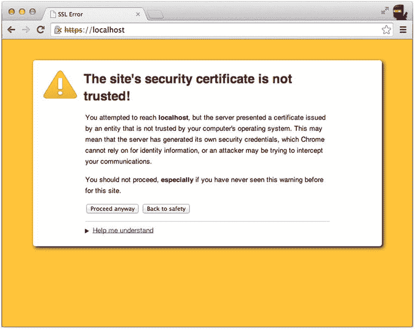
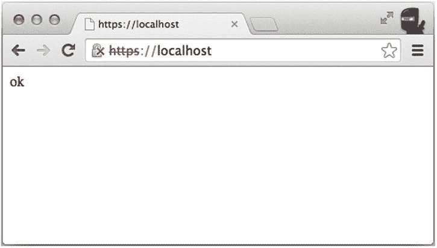

第九章


处理和运行应用时出错

好的 web 应用必须有信息丰富的错误消息来通知客户端请求失败的确切原因。错误可能是由客户端(例如，错误的输入数据)或服务器(例如，代码中的错误)引起的。

客户端可能是一个浏览器，在这种情况下，应用应该显示一个 HTML 页面。例如，当找不到请求的资源时，应该显示 404 页面。或者客户端可能是另一个通过 REST API 消耗我们资源的应用。在这种情况下，应用应该以 JSON 格式(或者 XML 或其他支持的格式)发送适当的 HTTP 状态代码和消息。由于这些原因，在开发重要的应用时，定制错误处理代码总是最佳实践。

在典型的 Express.js 应用中，错误处理程序遵循以下路线。错误处理值得在这本书里有自己的章节，因为它不同于其他中间件。在错误处理程序之后，我们将介绍 Express.js 应用方法和启动 Express.js 应用的方式。因此，本章的主要议题如下:

*   错误处理
*   运行应用

错误处理

由于 Node.js 和回调模式的异步特性，捕捉和记录错误发生的状态以备将来分析并不是一项简单的任务。在第 17 章中，我们将介绍 Express.js 应用中域名的使用。在 Express.js 中使用域进行错误处理是一种更高级的技术，对于大多数开箱即用的实现来说，框架的内置错误处理可能已经足够了(加上定制的错误处理中间件)。

我们可以从我们的`ch2/cli-app`例子中的基本开发错误处理程序开始。错误处理器抛出错误状态(`500`，内部服务器错误)、堆栈跟踪和错误消息。当应用处于开发模式时，仅通过此代码*启用*:

```js
if (app.get('env') === 'development') {
    app.use(function(err, req, res, next) {
        res.status(err.status || 500);
        res.render('error', {
            message: err.message,
            error: err
        });
    });
}

```

 **提示** `app.get('env')`是`process.env.NODE_ENV`的便捷方法；换句话说，前面一行可以用`process.env.NODE_ENV === 'development'`改写。

这是有意义的，因为错误处理通常在整个应用中使用。因此，最好将其实现为中间件。

对于定制的错误处理程序实现，除了多了一个参数`error`(或简称为`err`):之外，中间件与其他任何中间件都是一样的

```js
*// Main middleware*
app.use(function(err, req, res, next) {
  *// Do logging and user-friendly error message display*
  console.error(err);
  res.status(500).send();
});
*// Routes*

```

我们可以使用`res.status(500).end()`来获得类似的结果，因为我们没有发送任何数据(例如，错误消息)。建议至少发送一条简短的错误消息，因为这将有助于出现问题时的调试过程。事实上，响应可以是任何东西:JSON、文本、静态页面的重定向或其他东西。

对于大多数前端和其他 JSON 客户端，首选格式当然是 JSON:

```js
app.use(function(err, req, res, next) {
  *// Do logging and user-friendly error message display*
  console.error(err);
  res.status(500).send({status:500, message: 'internal error', type:'internal'});
})

```

 **注意**开发者可以使用`req.xhr`属性或者检查`Accept`请求头是否有`application/json`值。

最简单的方法就是发一条短信:

```js
app.use(function(err, req, res, next) {
  *// Do logging and user-friendly error message display*
  console.error(err);
  res.status(500).send('internal server error');
})

```

或者，如果我们知道输出错误消息是安全的，我们可以使用下面的方法:

```js
app.use(function(err, req, res, next) {
  *// Do logging and user-friendly error message display*
  console.error(err);
  res.status(500).send('internal server error: ' + err);
})

```

为了简单地呈现一个名为`500`(模板是文件`500.jade`，引擎是 Jade)的静态错误页面，我们可以使用

```js
app.use(function(err, req, res, next) {
  *// Do logging and user-friendly error message display*
  console.error(err);
  *// Assuming that template engine is plugged in*
  res.render('500');
})

```

或者，如果我们想要覆盖文件扩展名，我们可以使用以下内容作为完整的文件名`500.html`:

```js
app.use(function(err, req, res, next) {
  *// Do logging and user-friendly error message display*
  console.error(err);
  *// Assuming that template engine is plugged in*
  res.render('500.html');
})

```

我们也可以使用`res.redirect()`:

```js
app.use(function(err, req, res, next) {
  *// Do logging and user-friendly error message display*
  res.redirect('/public/500.html');
})

```

建议始终使用正确的 HTTP 响应状态，如`401`、`400`、`500`等。快速参考参见[表 9-1](#Tab1) 。

[表 9-1](#_Tab1) 。主要 HTTP 状态代码

| 

密码

 | 

名字

 | 

意义

 |
| --- | --- | --- |
| Two hundred | 好 | 成功 HTTP 请求的标准响应 |
| Two hundred and one | 创造 | 请求已被满足。新资源已创建 |
| Two hundred and four | 没有内容 | 请求已处理。没有返回内容 |
| Three hundred and one | 永久移动 | 此请求和所有将来的请求都指向给定的 URI |
| Three hundred and four | 未修改 | 自上次请求后，资源未被修改 |
| four hundred | 错误的请求 | 由于语法错误，请求无法实现 |
| Four hundred and one | 未经授权的 | 身份验证是可能的，但是失败了 |
| Four hundred and three | 被禁止的 | 服务器拒绝响应请求 |
| Four hundred and four | 未发现 | 找不到请求的资源 |
| Five hundred | 内部服务器错误 | 服务器出现故障时的一般错误消息 |
| Five hundred and one | 未实施 | 服务器无法识别该方法或缺乏实现该方法的能力 |
| Five hundred and three | 服务不可用 | 服务器当前不可用 |

 **提示**关于可用 HTTP 方法的完整列表，请参考位于`www.w3.org/Protocols/rfc2616/rfc2616-sec10.html`的 RFC 2616。

这是我们发送状态`500`(内部服务器错误)而不发回任何数据的方式:

```js
app.use(function(err, req, res, next) {
  *// Do logging and user-friendly error message display*
  res.end(500);
})

```

要从请求处理程序和中间件内部触发错误，我们只需调用

```js
app.get('/', function(req, res, next){
  next(error);
});

```

或者，如果我们想要传递一个特定的错误消息，那么我们创建一个错误对象并将其传递给`next()`:

```js
app.get('/', function(req,res,next){
  next(new Error('Something went wrong :-('));
});

```

使用`return`关键字来处理多个容易出错的情况并结合前面的两种方法是一个好主意。例如，我们将数据库错误传递给`next()`，但是一个空的查询结果不会导致数据库错误(即`error`将是`null`，所以我们用`!users` : 检查这个条件

```js
// A GET route for the user entity
app.get('/users', function(req, res, next) {
  // A database query that will get us any users from the collection
  db.get('users').find({}, function(error, users) {
    if (error) return next(error);
    if (!users) return next(new Error('No users found.'));
    *// Do something, if fail the return next(error);*
    res.send(users);
});

```

对于复杂的应用，最好使用多个错误处理程序。例如，一个用于 XHR/AJAX 请求，一个用于普通请求，一个用于通用的 catch-everything-else。使用命名函数(并将它们组织在模块中)而不是匿名函数也是一个好主意。

关于这种高级错误处理的例子，请参考第 22 章。

 **提示**在管理错误处理方面有一个简单的方法，特别适合开发目的。它被称为`errorhandler` ( `https://www.npmjs.org/package/errorhandler`)，它拥有 Express.js/Connect.js.的默认错误处理程序，更多关于`errorhandler`的信息，请参考[第 4 章](04.html)。

运行应用

Express.js 类提供了一些*应用范围内的*对象和其对象上的方法，在我们的例子中是`app`。推荐使用这些对象和方法，因为它们可以改进代码重用和维护。例如，不用到处硬编码数字`3000`，我们只需用`app.set('PORT', 3000);`分配它一次。然后，如果我们以后需要更新它，我们只有一个地方需要改变。因此，我们将在本节中介绍以下属性和方法:

*   `app.locals`
*   `app.render()`
*   `app.mountpath`
*   `app.on('mount', callback)`
*   `app.path()`
*   `app.listen()`

app.locals

`app.locals`对象类似于`res.locals`对象(在第 8 章的[中讨论过),它将数据暴露给模板。然而，有一个主要的区别:`app.locals`使它的属性在`app`呈现的所有模板中可用，而`res.locals`将它们*限制为仅*请求。因此，开发者需要小心不要通过`app.locals`泄露任何敏感信息。这方面的最佳用例是应用范围的设置，如位置、URL、联系信息等。例如:](08.html)

```js
app.locals.lang = 'en';
app.locals.appName = 'HackHall';

```

`app.locals`对象也可以像函数一样被调用:

```js
app.locals([
  author: 'Azat Mardan',
  email: 'hi@azat.co',
  website: 'http://proexpressjs.com'
]);

```

app.render()

`app.render()`方法或者用视图名和回调调用，或者用视图名、数据和回调调用。例如，系统可能有一个用于“感谢您注册”消息的电子邮件模板和另一个用于“重置您的密码”的电子邮件模板:

```js
var sendgrid = require('sendgrid')(api_user, api_key);

var sendThankYouEmail = function(userEmail) {
  app.render('emails/thank-you', function(err, html){
    if (err) return console.error(err);
    sendgrid.send({
      to: userEmail,
      from: app.get('appEmail'),
      subject: 'Thank you for signing up',
      html: html // The html value is returned by the app.render
    }, function(err, json) {
      if (err) { return console.error(err); }
      console.log(json);
    });
  });
};

var resetPasswordEmail = function(userEmail) {
  app.render('emails/reset-password', {token: generateResetToken()}, function(err, html){
    if (err) return console.error(err);
    sendgrid.send({
      to: userEmail,
      from: app.get('appEmail'),
      subject: 'Reset your password',
      html: html
    }, function(err, json) {
      if (err) { return console.error(err); }
      console.log(json);
    });
  });
};

```

 **注**例子中使用的`sendgrid`模块在 NPM[T5】1](#Fn1)和 GitHub 都有。 [<sup>2</sup>](#Fn2) 

app.mountpath

`app.mountpath`属性用于挂载/订阅的应用。挂载的应用是子应用，可以用于更好的代码重用和组织。属性返回安装了`app`的路径。

例如，在`ch9/app-mountpath.js`中有两个子应用:`post`和`comment`。帖子挂载在 app 的`/post`路径，评论挂载在帖子的`/comment`。作为日志的结果，mountpath 返回值`/post`和`/comment`:

```js
var express= require('express'),
  app = express(),
  post = express(),
  comment = express();

app.use('/post', post);
post.use('/comment', comment);

console.log(app.mountpath); // ''
console.log(post.mountpath); // '/post'
console.log(comment.mountpath); // '/comment'

```

app.on('mount '，函数(父){...})

当子应用被装载到父/主应用的特定路径上时，装载被触发。例如，在`ch9/app-on-mount.js`中，我们有两个带有装载事件监听器的子应用，它们打印父应用的装载路径。路径的值是`post`的父级(`app`)的`/`和`comment`的父级(`post`)的`/post`:

```js
var express= require('express'),
  app = express(),
  post = express(),
  comment = express();

post.on('mount', function(parent){
  console.log(parent.mountpath); // '/'
})
comment.on('mount', function(parent){
  console.log(parent.mountpath); // '/post'
})

app.use('/post', post);
post.use('/comment', comment);

```

app.path()

`app.path()`方法将返回 Express.js 应用的规范路径。如果您正在使用安装到不同路径的多个 Express.js 应用(为了更好地组织代码)，这将非常有用。

例如，通过在`post`应用的`/comment`路径上安装`comment`应用，你可以获得帖子的评论资源(与评论相关的路径)。但是你仍然可以用`comment.path()`(来自`ch9/app-path.js`)获得“完整”路径:

```js
var express= require('express'),
  app = express(),
  post = express(),
  comment = express();

app.use('/post', post);
post.use('/comment', comment);

console.log(app.path()); // ''
console.log(post.path()); // '/post'
console.log(comment.path()); // '/post/comment'

```

app.listen()

Express.js `app.listen(port, [hostname,] [backlog,] [callback])`方法类似于核心 Node.js http 模块中的`server.listen()` [<sup>3</sup>](#Fn3) 。这个方法是启动 Express.js app 的方法之一。`port`是服务器应该接受传入请求的端口号。`hostname`是域名。当您将应用部署到云时，您可能需要设置它。backlog 是排队等待连接的最大数量。默认值为 511。而`callback`是一个异步函数，在服务器启动时被调用。

要在特定端口上直接启动 Express.js 应用(3000):

```js
var express = require('express');
var app = express();
*// ... Configuration*
*// ... Routes*
app.listen(3000);

```

这种方法是由 Express.js 生成器在第 2 章 Hello World 示例中的`ch2/hello.js`和`ch2/hell-name.js`示例中创建的。在这里，`app.js`文件不启动服务器，但是它用

```js
module.exports = app;

```

我们也不使用`$ node app.js`运行`app.js`文件。相反，我们用`$ ./bin/www`启动了一个 shell 脚本`www`。shell 脚本的第一行有这个特殊的字符串:

```js
#!/usr/bin/env node

```

上面的代码行将 shell 脚本转换成 Node.js 程序。这个程序从`app.js`文件中导入`app`对象，设置端口，用`listen()`和一个回调函数启动`app`服务器

```js
var debug = require('debug')('cli-app');
var app = require('../app');

app.set('port', process.env.PORT || 3000);

var server = app.listen(app.get('port'), function() {
  debug('Express server listening on port ' + server.address().port);
});

```

当另一个过程需要您的服务器对象时，例如一个测试框架，将您的服务器对象导出为一个模块是必要的。在前面的例子中，主服务器文件(`ch2/cli-app/app.js`)导出了对象，没有办法用`$ node app`启动服务器。如果您不希望有一个单独的 shell 文件来启动服务器，但仍然希望在需要时导出服务器，您可以使用下面的技巧。这种方法的要点是检查模块是否是具有`require.main === module`条件的依赖。如果是真的，那么我们启动应用。如果不是，那么我们公开方法和`app`对象。

```js
var server = http.createServer(app);
var boot = function () {
  server.listen(app.get('port'), function(){
    console.info('Express server listening on port ' + app.get('port'));
  });
}
var shutdown = function() {
  server.close();
}
if (require.main === module) {
  boot();
} else {
  console.info('Running app as a module');
  exports.boot = boot;
  exports.shutdown = shutdown;
  exports.port = app.get('port');
}

```

除了`app.listen()`之外的另一种启动服务器的方式是将 Express.js app 应用到核心 Node.js 服务器函数中。这对于生成具有相同代码库的 HTTP 服务器和 HTTPS 服务器非常有用:

```js
var express = require('express');
var https = require('https');
var http = require('http');
var app = express();
var ops = require('conf/ops');
*//... Configuration*
*//... Routes*
http.createServer(app).listen(80);
https.createServer(ops, app).listen(443);

```

您可以创建一个自签名的 SSL 证书(例如，`server.crt`文件),通过运行以下命令使用`OpenSSL`在本地测试您的 HTTPS 服务器，以用于开发目的:

```js
$ sudo ssh-keygen -f host.key
$ sudo openssl req -new -key host.key -out request.csr
$ sudo openssl x509 -req -days 365 -in request.csr -signkey host.key -out server.crt

```

OpenSSL 是安全套接字层(SSL)协议的开源实现，也是一个工具包。你可以在`https://www.openssl.org`找到更多相关信息。当你使用 OpenSSL 时，Chrome 和许多其他浏览器会抱怨一个关于自签名证书的警告——无论如何你可以通过点击继续忽略它(见[图 9-1](#Fig1) )。



[图 9-1](#_Fig1) 。您可以忽略这个由自签名 SSL 证书引起的警告

T5 提示要在 Mac OS X 上安装`OpenSSL`，运行`$ brew install OpenSSL`。在 Windows 上，从`http://gnuwin32.sourceforge.net/packages/openssl.htm`下载安装程序。在 Ubuntu 上，运行`apt-get install OpenSSL`。

在`server.crt`准备好之后，像这样把它喂给`https.createServer()`方法(`ch9/app.js`文件):

```js
var express = require('express');
var https = require('https');
var http = require('http');
var app = express();
var fs = require('fs');

var ops = {
    key: fs.readFileSync('host.key'),
    cert: fs.readFileSync('server.crt') ,
    passphrase: 'your_secret_passphrase'
};

app.get('/', function(request, response){
  response.send('ok');
});
http.createServer(app).listen(80);
https.createServer(ops, app).listen(443);

```

该密码是您在使用`OpenSSL`创建证书时使用的密码。如果您没有输入任何密码，请忽略它。要启动这个过程，您可能必须使用 sudo，比如`$ sudo node app`。

如果一切正常，您应该会看到如图[图 9-2](#Fig2) 所示的正常信息。



[图 9-2](#_Fig2) 。使用自签名 SSL 证书进行本地开发

最后，如果您的应用执行大量的阻塞工作，您可能希望用`cluster`模块启动多个进程。这个话题在第十三章中有所涉及。

摘要

本章介绍了实现错误处理程序的多种方法、`app`对象接口以及启动 Express.js 服务器的方法。第二部分“深度 API 参考”到此结束希望您已经了解了 Express.js 框架对象的许多新属性和方法，例如响应、请求和应用本身。如果你对中间件有任何疑问，那么[第 4 章](04.html)消除了任何疑虑。最后但同样重要的是，我们讨论了路由、错误处理和模板利用主题。所有这些主题奠定了您的基础，因此您可以使用 Express.js 将这些知识应用于创建令人惊叹和激动人心的新应用

随着这本书的参考部分结束，我们正在进入更实际和复杂的主题，其中包括“如何使用 X”或“如何做 Y”的例子。继续第三部分，“解决常见和抽象的问题”

_________________

[<sup>1</sup>](#_Fn1)T0】

[<sup>2</sup>](#_Fn2)T0】

[<sup>3</sup>](#_Fn3)T0】