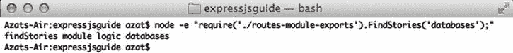

# 十、抽象

本章讨论代码组织。*抽象*通常意味着将整体逻辑分成几个部分。本章介绍的大多数技术可以应用于任何 Node.js 代码，而不仅仅是 Express.js 代码。

一个 Express.js app 通常有一个主文件(`app.js`或者`server.js`)。您应该尽量保持这个文件尽可能小，因为随着它变得越来越大，维护起来就越来越困难。最适合用来代替大型主文件的代码类型是中间件和路由。也可以抽象出配置语句，但是它们通常没有路由多，路由可能超过 200 到 300 条。

中间件

如第 4 章所述，中间件概念提供了灵活性。软件工程师可以使用匿名函数或命名函数作为中间件。使用匿名函数的方法如下所示:

```js
app.use(function(request, response) {
// ...
});
app.get(function(request, response) {
//...
}, function(request, response) {
// ...
});

```

命名函数方法如下所示:

```js
var middleware = function(request, response){
};
var middleware2 = function(request, response){
//...
};
var middleware3= function(request, response){
//...
};
app.use(middleware);
app.get(middleware2, middleware3);

```

出于代码重用的目的，命名函数方法更有吸引力。也就是说，如果命名了一个函数，就可以通过传递名称在多个路由中使用它。相反，使用匿名函数的方法只允许您在定义函数的地方使用中间件一次。

当使用命名函数时，随着应用变得越来越大，最佳实践是根据它们的功能将命名函数抽象到外部模块中，例如身份验证或数据库任务。

路线

假设我们有一个包含以下资源的 REST API:故事、元素和用户。我们可以相应地将请求处理程序分离到文件中，这样`routes/stories.js`就有了

```js
module.exports.findStories = function(req, res, next) {
// ... Query to find stories from the database
};
module.exports.createStory = function(req, res, next) {
// ... Query to create a story in the database
};
// ....

```

`routes/users.js`文件保存用户实体的逻辑:

```js
module.exports.findUser = function(req, res, next){
// ...
};
module.exports.updateUser = function(req, res, next){
// ...
};
module.exports.removeUser = function(req, res, next){
// ...
};

```

主服务器文件(`app.js`或`server.js`)可以以这种方式使用前面的模块:

```js
// ...
var stories = require('./routes/stories');
var users = require('./routes/users');
// ...
app.get('/stories', stories.findStories);
app.post('/stories', stories.createStory);
app.get('/users/:user_id', users.findUser);
app.put('/users/:user_id', users.updateUser);
app.del('/users/:user_id', users.removeUser);
// ...

```

在带有`var stories = require('./routes/stories');`的示例中，`stories`是带有省略(可选)`.js`扩展名的文件`stories.js`。

 **提示**`'./routes/stories'`中的句号(`.`)表示路径从当前文件夹开始。在 Windows 上，路径使用`\`而不是`/`，所以更好的方法是编写`require(path.join('routes', 'stories'));`，因为它对跨平台更友好。

请注意，代码在每一行/每一个模块中不断重复；也就是说，开发人员必须通过导入相同的模块(例如`users`)来复制代码。想象一下，我们需要在每个文件中包含这三个模块！为了避免这种重复，有一个聪明的方法来包含多个文件:将`index.js`文件放在`stories`文件夹中，并让该文件包含所有的路线。这是一个很好的做法，因为如果你以后想添加更多的文件到`routes`文件夹或者改变现有文件的名称，你不需要从`app.js`请求一个新文件。你只需要修改`routes/index.js`代码。

例如，在`app.js`中，我们通过只传递文件夹名来导入`index.js`(如果我们传递文件夹名，`require`会寻找`index.js`):

```js
app.get('/stories', require('./routes').stories.findStories);

```

或者，我们可以多次使用路线:

```js
var routes = ('./routes');
app.get('/stories', routes.stories.findStories);
app.post('/stories', routes.stories. createStory);

```

这段代码将访问`index.js`，这将公开`stories`对象(和其他对象)，该对象从`routes`文件夹中的`stories.js`文件导入:

```js
module.exports.stories = require('./stories');
module.exports.users = require('./users);

```

前面的代码可以重写如下:

```js
exports.stories = require('./stories');
exports.users = require('./users);

```

或者如下，这是我个人最喜欢的，因为它的口才:

```js
module.exports = {
  stories: require('./stories'),
  users: require('./users)
};

```

最后，`./routes/index.js`代码读取的`stories.js`文件有

```js
exports.findStories = function(req, res, next) {
// ...
};
exports.createStory = function(req, res, next) {
// ...
};
// ...

```

 **提示**为了更好地组织路线，你可以使用`Router`类，在[第 6 章](06.html)中有所介绍。

功能的每一部分都可以分割成一个单独的文件。例如，`findStories`方法进入`ch10/routes-exports/find-stories.js`,内容如下:

```js
exports.findStories = function(ops){
  ops=ops || '';
  console.log ('findStories module logic ' + ops);
};

```

`In the index.js we simply import the find-stories.js:`

```js
exports.stories = require('./find-stories.js');

```

举个工作例子，你可以从`expressjsguide`文件夹运行`node -e "require('./routes-exports').stories.findStories();"`来查看`console.log`从模块输出的字符串，如图[图 10-1](#Fig1) 所示。


[图 10-1](#_Fig1) 。通过文件夹和 index.js 文件导入模块

结合中间件和路由

为了说明代码重用的另一种方法，假设有一个应用具有路线`/admin`和`/api/stories`:

```js
app.get('/admin', function(req, res, next) {
  if (!req.query._token) return next(new Error('No token was provided.'));
  }, function(req, res, next) {
  res.render('admin');
});
*// Middleware that applied to all /api/* calls*
app.use('/api/*', function(req, res, next) {
  if (!req.query.api_key) return next(new Error('No API key was provided.'));
});
app.get('/api/stories', findStory, function(req, res){
  res.json(req.story):
});

```

在这两个示例中，我们使用以下代码行检查查询字符串参数:

```js
  if (!req.query._token) return next(new Error('no token provided'));

```

和

```js
  if (!req.query.api_key) return next(new Error('No API key was provided.'));

```

但是，参数是不同的，所以我们不能将两个语句抽象成一个函数。不用重复我们自己不是很聪明吗？

为了避免重复，我们可以实现一个返回函数的函数，如下所示:

```js
var requiredParam = function (param) {
  *// Do something with the param, e.g.,*
  *// Create a private attribute paramName based on the value of param variable*
  var paramName = '';
  if (param === '_token')
    paramName = 'token';
  else if (param === 'api_key')
    paramName = 'API key'
  return function (req,res, next) {
    *// Use paramName, e.g.,*
    *// If query has no such parameter, proceed next() with error using paramName*
    if (!req.query[param]) return next(new Error('No ' + paramName +' was provided.'));
    next();
  });
}

app.get('/admin', requiredParam('_token'), function(req, res, next) {
  res.render('admin');
});
    *// Middleware that applied to all /api/* calls*
app.use('/api/*', requiredParam('api_key'));

```

从某种意义上说，这种“返回函数的函数”模式是一种开关，它根据传递的参数改变模式。

 **提示**前面提到的“返回函数的函数”模式类似于状态单子(`http://en.wikipedia.org/wiki/Monad_(functional_programming)#State_monads`)。这可以作为面试时讨论的一个很好的话题。

前面的例子非常简单，在大多数情况下，开发人员不需要担心正确的错误文本消息的映射。然而，您可以将这种模式用于许多目的，例如限制输出、管理权限以及在不同的块之间切换。

 **注意**`__dirname`全局变量提供了使用它的文件的绝对路径，而`./`返回当前工作目录，这可能会根据我们执行 Node.js 脚本的位置而有所不同(例如，`$ node ~/code/app/index.js`与`$ node index.js`)。`./`规则的一个例外是当它被用在`require()`函数中时，比如`conf = require('./config.json');`，在这种情况下它充当`__dirname`。

正如您所看到的，中间件/请求处理程序的使用是保持代码有组织的一个强大的概念。最佳实践是通过将所有逻辑移入相应的外部模块/文件来保持路由精简。这样，当您需要时，重要的服务器配置参数都会整齐地放在一个地方。

全局变量`module.exports`和`exports`在给它们分配新值时并不完全相同。在前面的例子中，`module.exports = function(){...}`运行良好，完全有道理，但是`exports = function() {...}`甚至`exports = someObject;`将悲惨地失败。原因是 JavaScript 基础知识:对象的属性可以被替换，而不会丢失对该对象的引用，但当我们替换整个对象(即`exports = ...,`)时，我们会丢失与暴露我们函数的外部世界*的链接。*

这种行为也被称为*对象是可变的和原始的*(字符串、数字和布尔值在 JavaScript 中是不可变的)。因此，`exports`只能通过创建属性并为其赋值来工作，比如`exports.method = function() {...};`。例如，我们可以在`ch10`文件夹中运行下面的代码:

```js
$ node -e "require('./routes-module-exports').FindStories('databases');"

```

结果，你可以在[图 10-2](#Fig2) 中看到，我们的嵌套结构减少了一级。



[图 10-2](#_Fig2) 。使用 module.exports 的结果

如需更多示例，请参考 Karl sweep(`http://openmymind.net/2012/2/3/Node-Require-and-Exports`)的文章“Node.js，Require and Exports”。对于本书中的一个工作示例，请查看第 22 章中的 HackHall 示例。

摘要

养成良好的代码组织习惯和实践是极其重要的。没有他们，项目将很难维持。这在大型项目中更是如此。

在下一章中，我们将继续这个主题，但是将它应用于数据库。我们还将探索如何处理键(以及您不希望受到攻击的其他敏感信息)，并在应用于 Express.js 应用时使用流。