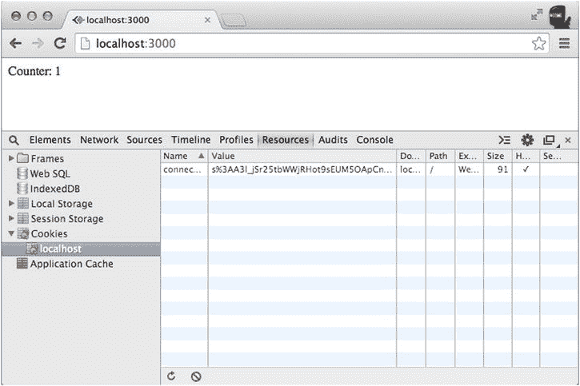
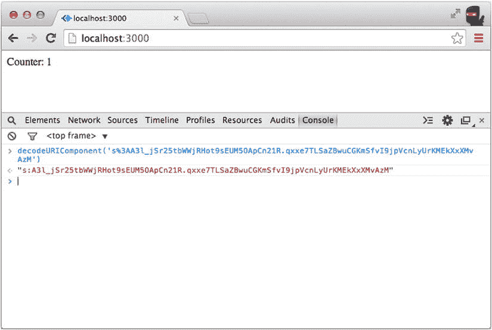

# 十二、Redis 和认证模式

本章讨论两个 Express.js 主题:Redis 和认证模式。Redis 是一个快速数据库，通常用于存储 Express.js 会话。

使用心得

Redis ( `http://redis.io`)经常在 Express.js 应用中用于会话持久性，因为将会话存储在物理存储中可以防止应用在系统重启或重新部署时丢失用户数据。它还支持使用多个 RESTful 服务器，因为它们可以连接到同一个 Redis 服务器。此外，Redis 可用于队列和调度任务(例如，电子邮件作业)。

Redis 本身是一项独立的服务。因此，要在 Express.js 中使用 Redis，我们需要两样东西:

*   *Redis 服务器*:可以监听特定端口并通过 Redis 控制台或应用访问的数据库服务器
*   *Connect-redis* :一个 NPM 模块(`https://www.npmjs.org/package/connect-redis`)；GitHub: `https://github.com/tj/connect-redis`)，使 Express.js 能够使用 redis 存储，并包含 Redis 模块(`https://www.npmjs.org/package/redis`；GitHub: `https://github.com/mranney/node_redis`)

要下载 Redis 2.6.7，请输入以下简单命令:

```js
$ wget http://download.redis.io/releases/redis-2.6.7.tar.gz
$ tar xzf redis-2.6.7.tar.gz
$ cd redis-2.6.7
$ make

```

更多 Redis 说明，可以访问`http://redis.io/download`。

要开始重定向，请按 enter 键

```js
$ src/redis-server

```

要停止重复，只需按 Ctrl+C 即可。

要访问 Redis 命令行界面，请输入

```js
$ src/redis-cli

```

以下是如何使用 Redis 管理 Express.js 会话的简单示例。

首先，要访问 Redis，使用`connect-redis`驱动程序。您可以使用`ch12/package.json`中熟悉的依赖项键/值对来实现这一点:

```js
{
  "name": "redis-example",
  "dependencies": {
    "express": "4.8.1",
    "connect-redis": "2.1.0",
    "cookie-parser": "1.3.2",
    "express-session": "1.7.6"
  }
}

```

要使用 Redis 作为 Express.js 服务器中的会话存储(`ch12/app.js`)，请输入以下内容:

```js
var express = require('express');
var app = express();
var cookieParser = require('cookie-parser');
var session = require('express-session');
var RedisStore = require('connect-redis')(session);

app.use(cookieParser());
app.use(session({
  resave: true,
  saveUninitialized: true,
  store: new RedisStore({
    host: 'localhost',
    port: 6379
  }),
  secret: '0FFD9D8D-78F1-4A30-9A4E-0940ADE81645',
  cookie: { path: '/', maxAge: 3600000 }
}));

```

接下来，定义“`/`”路由，该路由将递增每个唯一会话的计数器。换句话说，如果我们关闭浏览器，停止 Express.js 服务器，等待一段时间，重新启动服务器，然后重新打开浏览器，只要带有会话 ID 的 cookie 没有过期或被删除，该值就会被保存并递增。此外，输出计数器和会话 ID:

```js
app.get('/', function(request, response){
  console.log('Session ID: ', request.sessionID);
  if (request.session.counter) {
    request.session.counter = request.session.counter +1;
  } else {
    request.session.counter = 1;
  }
  response.send('Counter: ' + request.session.counter);
});

app.listen(3000);

```

现在，当你启动服务器时，它应该向你显示`Counter: 1`并且`connect.sid` cookie 应该有一个类似于下面的值(见[图 12-1](#Fig1) ):

```js
s%3AA3l_jSr25tbWWjRHot9sEUM5OApCn21R.qxxe7TLSaZBwuCGKmSfvI9jpVcnLyUrKMEkXxXMvAzM

```



[图 12-1](#_Fig1) 。Redis store Express.js 会话示例的输出

您的会话 ID 会有所不同，但格式和长度是相同的。让我们在浏览器或 Node.js 控制台中用`decodeURIComponent()`方法解码这个值(见[图 12-2](#Fig2) ):

```js
decodeURIComponent('s%3AA3l_jSr25tbWWjRHot9sEUM5OApCn21R.qxxe7TLSaZBwuCGKmSfvI9jpVcnLyUrKMEkXxXMvAzM')

```



[图 12-2](#_Fig2) 。解码 Express.js 会话 ID

`s:`和`.`之间的值是会话 ID。将它与服务器日志中打印的值进行比较。它们应该匹配。

要再次检查计数器值是否确实存储在 Redis 中，而不是存储在其他地方，请复制会话 ID，并在新的终端窗口中打开 Redis 控制台

```js
$ redis-cli

```

然后，键入以下命令来获取会话值:`get sess:SESSION_ID`，其中`SESSION_ID`是您的会话 ID；例如:

```js
> get sess:A3l_jSr25tbWWjRHot9sEUM5OApCn21R

```

您应该看到带有会话值计数器的 JSON 对象的字符串，以及一些选项。例如，我的输出是

```js
"{\"cookie\":{\"originalMaxAge\":3600000,\"expires\":\"2014-09-03T19:03:55.007Z\",\"httpOnly\":true,\"path\":\"/\"},\"counter\":1}"

```

您还可以使用`> keys`命令来获取存储的会话密钥列表(前缀为`sess`):

```js
> keys sess*

```

正如本章开始时提到的，connect-redis 模块由 redis 模块提供支持。有了这个模块，Redis 可以作为一个平面的、独立的数据库使用。有趣的是，Redis 支持四种类型的数据:字符串、列表、集合和散列。

 **提示**要深入研究 Redis，可以在`http://try.redis.io`找到一个互动教程。

身份验证模式

最常见的认证类型是要求用户名和密码的组合。我们可以对照数据库检查匹配，然后在会话中存储一个`authenticated=true`标志。Express.js 为该代理发出的每个其他请求自动存储*的会话数据:*

```js
app.use(function(req, res, next) {
  if (req.session && req.session.authenticated)
     return next();
  else {
    return res.redirect('/login');
  }
}

```

如果我们需要额外的用户信息，它也可以存储在会话中:

```js
app.post('/login', function(req, res) {
  *// Check the database for the username and password combination*
  *// In a real-world scenario you would salt the password*
db.findOne({username: req.body.username,
    password: req.body.password},
    function(error, user) {
      if (error) return next();
      if (!user) return next(new Error('Bad username/password');
      req.session.user = user;
      res.redirect ('/protected_area');
    }
  );
});

```

对于 salt 密码的工具，看一下`bcryptjs` ( `https://www.npmjs.org/package/bcryptjs`)，它与`bcrypt`兼容，但不需要编译，因为它完全在 JavaScript/Node.js 上运行。与其他库或您自己的哈希/salt 实现相比，`bcryptjs`(和 bcrypt)的另一个很酷的事情是，salt 是密码的一部分，所以您不需要在数据库中为每个用户存储额外的 salt 字段。例如:

```js
var bcrypt = require('bcryptjs');
bcrypt.hash('pr0expressr0cks!, 8, function(err, hash) {
// ... Store the hash, which is a password and salt together
});

```

使用异步 bcryptjs 方法，因为它们会非常慢(越慢越好保护！).

与第三方的认证通常通过 OAuth 来完成。对于`oauth`模块(`https://www.npmjs.org/package/oauth`)的工作示例；GitHub:`https://github.com/ciaranj/node-oauth`)——作者提供了一些文档——查看第 22 章中的 HackHall 示例。

OAuth 1.0/2.0 要求回调路由，以便用户重定向回我们的站点。使用 Express.js，这是毫不费力的。此外，还有完全自动化的解决方案来处理一切(数据库、签名、路由等)。):Everyauth ( `https://npmjs.org/package/everyauth`)和 Passport ( `https://npmjs.org/package/passport`)。

 **提示**要想快速了解适用于 Node.js 的 OAuth，可以考虑阅读我的书，《用 Node.js 介绍 OAuth:Twitter API OAuth 1.0、OAuth2.0、OAuth Echo、Everyauth 和 OAuth 2.0 服务器示例 (webapplog.com，2014)。

摘要

在这一章中，我们安装并使用了 Redis，这样会话信息就可以持久，也就是说，如果服务器停机，它也不会丢失。Redis(或任何其他持久性存储)允许我们在多个服务器之间共享会话。然后我们讲述了用中间件实现认证。

在下一章中，我们将讨论集群多线程，继续让您的 Express.js 应用产品化的主题。