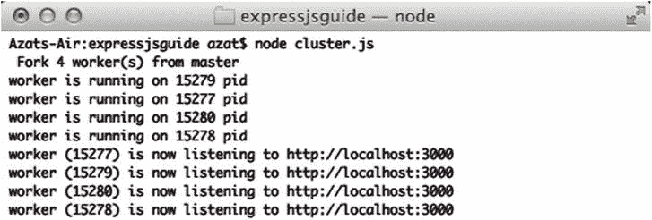
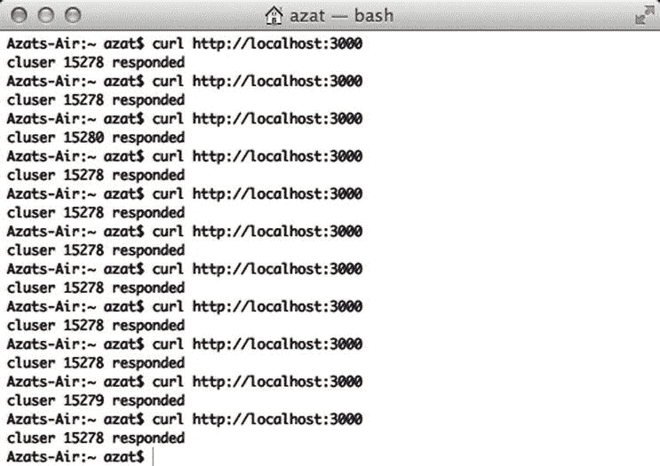

# 十三、集群和多线程

有很多批评者反对使用 Node.js，他们的许多观点都源于一个神话，即基于 Node.js 的系统*有*是单线程的。事实远非如此——使用`cluster`模块，我们可以毫不费力地派生一个 Node.js 流程来创建多个流程。是的，每个进程仍将是单线程的，并且会被不合适的同步代码或一些费力的进程(如密码散列)阻塞。然而，现在由几个进程组成的整个系统不会被阻塞。

在 web 应用的情况下，进程可以监听同一个端口，从而确保如果第一个进程繁忙，请求将由第二个(或第三个或第四个)进程处理。通常情况下，我们会根据机器上的 CPU 数量生成尽可能多的进程，这样我们就可以利用机器上的所有 CPU。

多线程的例子

下面是一个在四个进程上运行的 Express.js 应用的工作示例。其中一个是所谓的*师傅*工序，另外三个是*工人*工序。master 负责管理和监控 worker，而 worker 本身就是一个独立的 Express.js app。master 和 worker 的代码包含在同一个文件中。

在文件的开头，我们导入依赖关系:

```js
var cluster = require('cluster');
var http = require('http');
var numCPUs = require('os').cpus().length;
var express = require('express');

```

模块有一个属性告诉我们这个进程是主进程还是子进程。我们使用该属性生成四个工人(默认工人将使用相同的文件，但这可以用`setupMaster()`方法覆盖)。 [<sup>1</sup>](#Fn1) 除此之外，我们还可以附加事件监听器，接收来自工作器的消息(例如`'kill'`)。

```js
if (cluster.isMaster) {
  console.log('Fork %s worker(s) from master', numCPUs)
  for (var i = 0; i < numCPUs; i++) {
    cluster.fork();
  };
  cluster.on('online', function(worker) {
    console.log('Worker is running on %s pid', worker.process.pid)
  });
  cluster.on('exit', function(worker, code, signal) {
    console.log('Worker with %s is closed', worker.process.pid );
  });

```

worker 代码只是一个稍加改动的 Express.js 应用。我们正在获取进程 ID ，即 PID(下面的代码延续了前面的代码片段):

```js
} else if (cluster.isWorker) {

```

现在我们编写一个端口为 3000 的 Express.js 服务器代码:

```js
  var port = 3000;
  console.log('Worker (%s) is now listening to http://localhost:%s',
    cluster.worker.process.pid, port);
  var app = express();

```

服务器有一个包罗万象的路由，它将打印 PID:

```js
  app.get('*', function(req, res) {
    res.send(200, 'cluster '
      + cluster.worker.process.pid
      + ' responded \n');
  })
  app.listen(port);
}

```

请在您的项目中随意使用`ch13/cluster.js`的完整源代码:

```js
var cluster = require('cluster');
var numCPUs = require('os').cpus().length;
var express = require('express');

if (cluster.isMaster) {
  console.log('Fork %s worker(s) from master', numCPUs);
  for (var i = 0; i < numCPUs; i++) {
    cluster.fork();
  }
  cluster.on('online', function(worker) {
    console.log('Worker is running on %s pid', worker.process.pid);
  });
  cluster.on('exit', function(worker, code, signal) {
    console.log('Worker with %s is closed', worker.process.pid );
  });
} else if (cluster.isWorker) {
  var port = 3000;
  console.log('Worker (%s) is now listening to http://localhost:%s',
    cluster.worker.process.pid, port);
  var app = express();
  app.get('*', function(req, res) {
    res.send(200, 'cluster ' + cluster.worker.process.pid + ' responded \n');
  });
  app.listen(port);
}

```

像往常一样，要启动一个应用，运行`$ node cluster`。应该有四个(或者两个，取决于你机器的架构)进程，日志可能看起来像这样(见[图 13-1](#Fig1) ):

```js
worker is running on 15279 pid
worker is running on 15277 pid
...

```



[图 13-1](#_Fig1) 。用集群启动四个进程

有不同的进程监听*同一个*端口并响应我们。例如，响应可能如下(见[图 13-2](#Fig2) ):

```js
cluster 15278 responded
cluster 15280 responded

```



[图 13-2](#_Fig2) 。服务器响应由不同的进程呈现

 **提示**如果你更喜欢现成的解决方案而不是低级库(比如`cluster`)，那就去看看易贝创建并使用的真实世界的生产库:`cluster2`(`https://www.npmjs.org/package/cluster2`；GitHub: `https://github.com/ql-io/cluster2`)。

再次查看`ch13/cluster.js`，注意我们可以将实际的 Express.js 应用抽象到一个单独的文件中。这是一件好事，因为它保持了两个不同逻辑单元、集群和 Express.js 应用之间的分离。例如，前面列出的集群文件可以重构为:

```js
var cluster = require('cluster');
var numCPUs = require('os').cpus().length;
var app = require('./app'); // <- THIS FILE!

if (cluster.isMaster) {
  console.log('Fork %s worker(s) from master', numCPUs);
  for (var i = 0; i < numCPUs; i++) {
    cluster.fork();
  }
  cluster.on('online', function(worker) {
    console.log('Worker is running on %s pid', worker.process.pid);
  });
  cluster.on('exit', function(worker, code, signal) {
    console.log('Worker with %s is closed', worker.process.pid );
  });
} else if (cluster.isWorker) {
  var port = 3000;
  console.log('Worker (%s) is now listening to http://localhost:%s',
    cluster.worker.process.pid, port);
  app.listen(port);
}

```

摘要

在这一章中，我们探索了一种实现系统的方法，该系统有一个主Node和多个工作Node，它们是在同一个端口上监听的 Express.js 应用。这是一个很有价值的技巧，你可以用它来减少你的服务器负载，让你用更少的机器提供更多的流量，这反过来又会节省你的钱。

在下一章，我们将介绍如何将 Stylus、Less 和 Sass CSS 库应用于 Express.js 服务器。

__________________

[<sup>1</sup>](#_Fn1)T0】