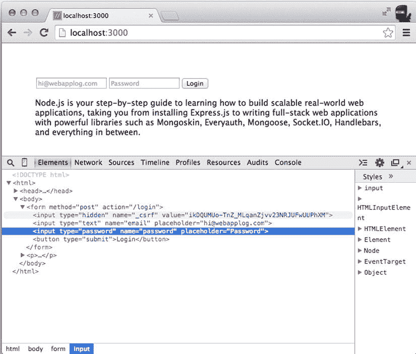
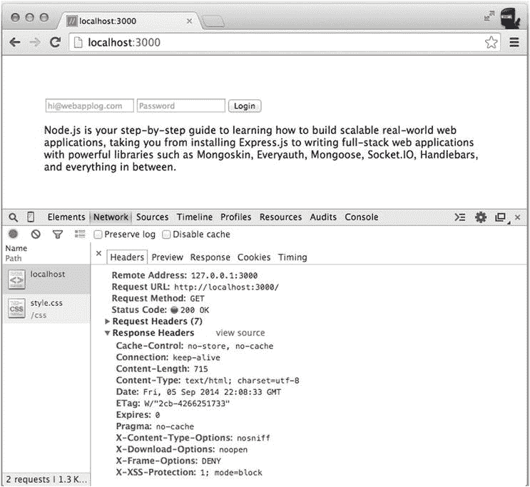
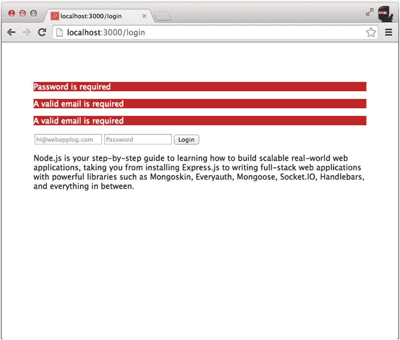

# 十五、安全提示

本章中的一组技巧涉及 Express.js 应用的安全性。安全性通常是一个被忽视的话题，直到发布前的最后一刻才被提及。显然，这种事后才考虑安全性的方法容易给攻击者留下漏洞。更好的方法是从头开始考虑和实现安全问题。

浏览器 JavaScript 因安全漏洞而声名狼藉，所以我们需要尽可能保证 Node.js 应用的安全！通过本章介绍的简单修改和中间件，您可以毫不费力地解决一些基本的安全问题。

本章涵盖以下主题:

*   跨站点请求伪造(CSRF)
*   流程权限
*   HTTP 安全标头
*   输入验证

跨站请求伪造

CSRF 和`csurf`中间件在[第 4 章](04.html)中有简要介绍。有关 CSRF 的定义和解释，请参考该章。

`csurf`中间件完成了匹配来自请求的传入值的大部分工作。然而，我们仍然需要公开响应中的值，并在模板(或 JavaScript XHRs)中将它们传递回服务器。首先，我们像安装其他依赖项一样安装`csurf`模块

```js
$ npm install csurf@1.6.0

```

然后，我们将`csurf`与`var csrf = require('csurf'); app.use()`一起应用，如[第 4 章](04.html)所述:

```js
app.use(csrf());

```

`csrf` *必须在*之前`cookie-parser`和`express-session`，因为它依赖于这些中间件(即安装、导入和应用必要的模块)。

实现验证的方法之一是使用定制的中间件将 CSRF 令牌传递给所有使用`response.local`的模板。这个定制中间件必须在路由之前(大多数中间件语句都是这种情况):

```js
app.use(function (request, response, next) {
  response.locals.csrftoken = request.csrfToken();
  next();
});

```

换句话说，我们手动促进了令牌在主体(如本例所示)、查询或头中的出现。(根据你的偏好或客户之间的合同，你可以使用查询或标题。)

因此，要将模板中的值呈现为隐藏的表单值，我们可以使用

```js
input(type="hidden", name="_csrf", value="#{csrftoken}")

```

该`hidden`输入字段将把令牌值添加到提交的表单数据中，便于将 CSRF 令牌与其他字段(如`email`和`password`)一起发送到`/login`路线。

以下是文件`ch15/index.jade`中完整的 Jade 语言内容:

```js
doctype html
html
  head
    title= title
    link(rel='stylesheet', href='/css/style.css')
  body
    if errors
      each error in errors
        p.error= error.msg
    form(method="post", action="/login")
      input(type="hidden", name="_csrf", value="#{csrftoken}")
      input(type="text", name="email", placeholder="hi@webapplog.com")
      input(type="password", name="password", placeholder="Password")
      button(type="submit") Login
    p
      include lorem-ipsum

```

要在`ch15/app.js`中观看 CSRF 的演示，像通常使用`$ node app`一样启动服务器。然后导航到位于`http://localhost:3000`的主页。你应该在表单的`hidden`字段看到令牌，如图[图 15-1](#Fig1) 所示。请记住，您的令牌值会有所不同，但其格式是相同的。



[图 15-1](#_Fig1) 。将来自`csurf`模块的 CSRF 令牌插入表单，稍后发送到/登录路由

对于对主页(`/`)或页面刷新的每个请求，您将获得一个新令牌。但是，如果您增加令牌来模拟攻击(您可以在 Chrome 开发人员工具中直接进行)，您将得到以下错误:

```js
403 Error: invalid csrf token
  at verifytoken...

```

流程权限

显然，以 root 用户身份运行 web 服务通常不是一个好主意。运营开发人员可以利用 Ubuntu 的`authbind` [<sup>1</sup>](#Fn1) 绑定到特权端口(例如，HTTP 的 80 和 HTTPS 的 443)，而无需授予 root 访问权限。

或者，也可以在绑定到端口后取消特权。这里的想法是，我们将 GID(组 ID)和 UID(用户 ID)的值传递给 Node.js 应用，并使用解析后的值来设置流程的组标识和用户标识。这在 Windows 上不起作用，所以你可能想使用`if` / `else`和`process.platform`或`NODE_ENV`来使你的代码跨平台。

下面是一个通过使用来自`process.env.GID`和`process.evn.UID`环境变量的属性设置 GID 和 UID[T3】2T5】来删除特权的示例:](#Fn2)

```js
// ... Importing modules
var app = express();
// ... Configurations, middleware and routes
http.createServer(app).listen(app.get('port'), function(){
    console.log("Express server listening on port "
    + app.get('port'));
    process.setgid(parseInt(process.env.GID, 10));
    process.setuid(parseInt(process.env.UID, 10));
});

```

HTTP 安全标头

叫做头盔 ( `https://www.npmjs.org/package/helmet`)的 Express.js 中间件；GitHub: `https://github.com/helmetjs/helmet`)是一个安全相关中间件的集合，它提供了 Recx 文章《免费提高 Web 应用安全性的七个 Web 服务器 HTTP Headers 中描述的大部分安全头。 [<sup>3</sup>](#Fn3) 撰写本文时，头盔的版本是 0.4.1，包括以下中间件:

*   `crossdomain`:用于`/crossdomain.xml`防止 Flash 加载某些不想要的内容(见`http://www.adobe.com/devnet/articles/crossdomain_policy_file_spec.html`)
*   `csp`:增加内容安全策略，允许载入内容白名单(见`http://content-security-policy.com`和`http://www.html5rocks.com/en/tutorials/security/content-security-policy`)
*   `hidePoweredBy`:删除`X-Powered-By`以防止暴露您正在使用 Node.js 和 Express.js
*   `hsts`:增加 HTTP 严格传输安全，防止您的网站被 HTTP(而不是 HTTPS)查看
*   `ienoopen`:设置 IE 8+的`X-Download-Options`头，防止 IE 浏览器加载不可信的 HTML(见`http://blogs.msdn.com/b/ie/archive/2008/07/02/ie8-security-part-v-comprehensive-protection.aspx`)
*   `nocache` : `Cache-Control`和`Pragma`头停止缓存(有助于清除用户浏览器的旧错误)
*   `nosniff`:设置适当的`X-Content-Type-Options`头以减少 MIME 类型嗅探(见`http://msdn.microsoft.com/en-us/library/gg622941%28v=vs.85%29.aspx`)
*   `xframe`:将`X-Frame-Options`标题设置为`DENY`，防止你的资源被放入框架进行点击劫持攻击(见`https://en.wikipedia.org/wiki/Clickjacking`)
*   `xssFilter`:设置 IE8+和 Chrome 的`X-XSS-Protection`头，防止 XSS 攻击(见`http://blogs.msdn.com/b/ieinternals/archive/2011/01/31/controlling-the-internet-explorer-xss-filter-with-the-x-xss-protection-http-header.aspx`)

要安装`helmet`，只需运行

```js
$ npm install helmet@0.4.1

```

像往常一样导入模块:

```js
var helmet = require('helmet');

```

然后在路由之前应用中间件*。默认用法如下(`ch15/app.js`):*

```js
app.use(helmet());

```

[图 15-2](#Fig2) 显示了`helmet` v0.4.1 HTTP 响应在使用默认选项时的样子:



[图 15-2](#_Fig2) 。头盔 v0.4.1 HTTP 响应与默认选项一起使用

输入验证

当您使用 body-parser 或 query 作为输入数据时，Express.js 不执行任何用户/客户端输入清理或验证。众所周知，我们永远不应该相信输入。恶意代码可以插入(XSS 或 SQL 注入)到您的系统中。例如，当您在页面上打印该字符串时，您视为良性字符串的浏览器 JavaScript 代码可能会变成攻击(特别是如果您的模板引擎没有自动转义特殊字符的话！).

第一道防线是在接受外部数据的路由上用正则表达式手动检查数据。额外的“防御”可以添加在对象关系映射层上，比如 Mongoose 模式(见[第 22 章](22.html))。请记住，前端/浏览器验证的执行*仅仅是为了可用性的目的*(也就是说，它更加用户友好)——它*并不能*保护你的网站免受任何攻击。

例如，在`ch15/app.js`中，我们可以实现在`email`字段、`if-else`语句和`test()`方法上使用 RegExp 模式的验证，将错误消息附加到`errors`数组，如下所示:

```js
app.post('/login-custom', function(request, response){
  var errors = [];
  var emailRegExp = /^(([^<>()[\]\\.,;:\s@\"]+(\.[^<>()[\]\\.,;:\s@\"]+)*)|(\".+\"))@((\[[0-9]{1,3}\.[0-9]{1,3}\.[0-9]{1,3}\.[0-9]{1,3}\])|(([a-zA-Z\-0-9]+\.)+[a-zA-Z]{2,}))$/;
  if (!request.body.password) errors.push({msg: 'Password is required'});
  if (!request.body.email || !emailRegExp.test(request.body.email) ) errors.push({msg: 'A valid email is required'});
  if (errors)
    response.render('index', {errors: errors});
  else
    response.render('login', {email: request.email});
});

```

随着您添加更多要验证的路径和输入字段，您将会得到更多的 RegExp 模式和`if` / `else`语句。虽然这比没有*验证*要好，但是推荐的方法是编写自己的模块或者使用`express-validator`T5。

要安装`express-validator`，请运行:

```js
$ npm install express-validator@2.4.0

```

在`ch15/app.js`中导入`express-validator`:

```js
var validator = require('express-validator');

```

然后在 `body-parser`后应用`express-validator` *:*

```js
app.use(bodyParser.json());
app.use(bodyParser.urlencoded({extended: true}));
app.use(validator());

```

现在，在请求处理程序中，我们可以访问`request.assert` 和`request.validationErrors()` :

```js
app.post('/login', function(request, response){
  request.assert('password', 'Password is required').notEmpty();
  request.assert('email', 'A valid email is required').notEmpty().isEmail();
  var errors = request.validationErrors();
  if (errors)
    response.render('index', {errors: errors});
  else
    response.render('login', {email: request.email});
});

```

`index.jade`文件简单地打印来自数组的错误，如果有的话:

```js
if errors
  each error in errors
    p.error= error.msg

```

并且`login.jade`模板打印电子邮件。仅当验证成功时，才会呈现该模板。

```js
p= email

```

要进行演示，请转到主页并尝试输入一些数据。如果有错误，会显示错误首页，如图[图 15-3](#Fig3) 所示。双重“需要有效的电子邮件”消息来自于这样一个事实，即我们对`email`字段有两个断言(`notEmpty`和`isEmail`)并且当`email`字段为空时*都失败*。



[图 15-3](#_Fig3) 。使用 express-validator 断言表单值的错误消息

摘要

安全是最重要的，但经常被忽视。在发展的早期阶段尤其如此。典型的思考过程是这样的:让我们专注于提供更多的功能，然后当我们即将发布时，我们会考虑安全性。这个决定通常是善意的，但很少按计划进行。结果，系统的安全性受到损害。

有了中间件库，比如`csurf`、`helmet`和`express-validator`，我们可以在不增加太多开发周期的情况下获得良好的基本安全性。

在下一章，我们将改变思路，介绍一些使用 Express.js 的方法。用于反应式(即实时更新)视图的 IO 库。

__________________

[<sup>1</sup>](#_Fn1)T0】

[<sup>2</sup>](#_Fn2)T0】

[<sup>3</sup>](#_Fn3)T0】