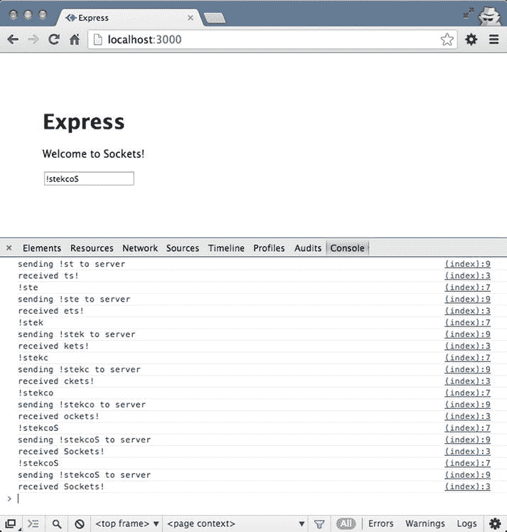
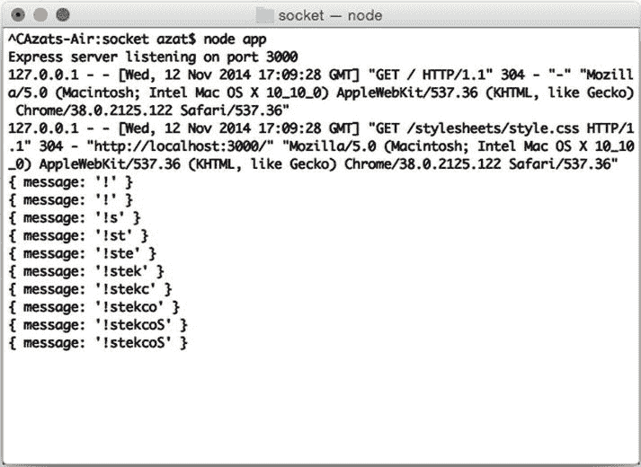

第十六章


插座。IO 和 Express.js

插座。IO ( `http://socket.io`)是一个库，它提供了在客户机和服务器之间实时建立双向通信的能力。这种双向通信是由 WebSocket 技术驱动的。

WebSocket 技术在大多数现代浏览器中都可以使用，最简单的概念化方法是想象浏览器和服务器之间的持续连接，而不是传统的零星 HTTP 请求。WebSocket 和传统 HTTP 请求的另一个区别是，前者是一个双向通道，这意味着服务器可以发起数据传输。这对于实时更新页面非常有用。

WebSocket 并不是实时类系统的唯一选择。您可以使用*轮询*实现接近实时的系统，这是指浏览器代码在很短的时间间隔内(例如，100 毫秒)发出大量 HTTP 请求。和插座。IO 不是唯一可以用来实现 WebSocket 的库。在 *Practical Node.js* (Apress，2014)中，我展示了一个使用`ws`作为服务器库和一个本地(根本没有库)浏览器 API 的例子。但是，使用 Socket 的好处。IO 在于它具有广泛的、跨平台的、跨浏览器的支持；WebSocket 不可用时回退到轮询；并使用事件作为它的主要实现模式。

插座全覆盖。IO 图书馆值得拥有自己的书。然而，用 Express.js 开始使用是如此的酷和容易，以至于我包含了这一章来向你展示一个基本的例子。

使用插座。超正析象管(Image Orthicon)

该示例将实时反向回显(浏览器到服务器，然后返回)我们的输入。这意味着我们将构建一个 Express.js 服务器，其中包含一个包含表单输入字段的 web 页面。该网页还将有一些前端 JavaScript 代码，在我们键入时将输入字段字符实时传输到服务器。服务器将反转字符串并将其发送回浏览器，我们的前端 JavaScript 代码将最终字符串打印到浏览器控制台。我们将使用插座。所有这些功能的 IO 方法和事件监听器。

在最终产品中，如果您键入“！stekcoS，”应用会将其转换为“插座！”如图[图 16-1](#Fig1) 所示。并且将显示浏览器控制台输出

```js
!
sending ! to server
received !
!
sending !
received !
!s
sending !s to server
received s!
...

```



[图 16-1](#_Fig1) 。的投入！stekcoS 出品插座！

可以从一个`$ express socket`创建的 fresh Express.js app 开始，也可以从`ch16/socket`文件夹下载源代码。然后，用`$ cd socket && npm install`安装依赖项。

 **提示**如果需要 Express.js 3.x 的例子，可以参考这个 app 为 Express.js 3.3.5 编写的版本。源代码在 GitHub repo: `https://github.com/azat-co/proexpressjs/tree/master/ch16/socket-express3`。

要包含 Socket.io，我们可以使用:

```js
$ npm install socket.io@1.1.0 --save

```

或者，我们可以使用`package.json`:

```js
{
  "name": "socket-app",
  "version": "0.0.1",
  "private": true,
  "scripts": {
    "start": "node app.js"
  },
  "dependencies": {
    "errorhandler": "1.1.1",
    "express": "4.8.1",
    "jade": "1.5.0",
    "morgan": "1.2.2",
    "serve-favicon": "2.0.1",
    "socket.io": "1.1.0"
  }
}

```

插座。从某种意义上来说，IO 可以被认为是另一个服务器。我们可以通过将 Express.js `app`对象传递给`createServer()`方法，然后调用套接字来重构自动生成的 Express.js 代码。木卫一`listen()`方法上`server`物体:

```js
var server = http.createServer(app);
var io = require('socket.io').listen(server);

//...
server.listen(app.get('port'), function(){
  console.log('Express server listening on port '
  + app.get('port'));
});

```

在`io`对象被实例化后，下面的代码可以用来建立一个连接:

```js
io.sockets.on('connection', function (socket) {

```

一旦建立了连接——我们知道这是因为我们在回调中——我们附加了`messageChange`事件监听器,它将由浏览器上的用户操作触发:

```js
socket.on('messageChange', function (data) {
  console.log(data);

```

一旦消息被更改(例如，用户输入了一些内容)，我们可以反转字符串并以带有`socket.emit():`的`receive`事件的形式将其发送回来

```js
    socket.emit('receive',
    data.message.split('').reverse().join('') );
  })
});

```

下面是`ch16/socket/app.js`的全部内容:

```js
var http = require('http'),
  express = require('express'),
  path = require('path'),
  logger = require('morgan'),
  favicon = require('serve-favicon'),
  errorhandler = require('errorhandler'),
  bodyParser = require('body-parser');

var app = express();

app.set('view engine', 'jade');
app.set('port', process.env.PORT || 3000);
app.use(logger('combined'));
app.use(favicon(path.join(__dirname, 'public', 'favicon.ico')));
app.use(express.static('public'));

app.use(bodyParser.json());
app.use(bodyParser.urlencoded({extended: true}));

app.get('/', function(request, response){
  response.render('index');
});

app.use(errorhandler());

var server = http.createServer(app);
var io = require('socket.io').listen(server);

io.sockets.on('connection', function (socket) {
  socket.on('messageChange', function (data) {
    console.log(data);
    socket.emit('receive', data.message.split('').reverse().join('') );
  });
});

server.listen(app.get('port'), function(){
  console.log('Express server listening on port ' + app.get('port'));
});

```

最后，我们的应用在`index.jade`中需要一些前端程序，以输入框和 JavaScript 代码的形式发送和接收用户输入。输入框可以这样实现:

```js
  input(type='text', class='message', placeholder='what is on your mind?', onkeyup='send(this)')

```

在每个按键事件中，它都调用`send()`函数，但是在我们编写这个函数之前，让我们包含这个套接字。IO 库:

```js
  script(src="/socket.io/socket.io.js")

```

`socket.io.js`文件不是您需要下载的真实文件，例如 jQuery 文件。Node.js 套接字。IO 服务器将“自动”提供这个文件

现在，我们可以连接到 socket 服务器并附加`receive`事件监听器:

```js
var socket = io.connect('http://localhost');
socket.on('receive', function (message) {
  console.log('received %s', message);
  document.querySelector('.received-message').innerText = message;
});

```

`document.querySelector`只是现代浏览器对 jQuery 选择器的模拟。它只是给了我们一个 HTML 元素，这样我们就不需要依赖 jQuery 了。我们使用`innerText`属性在页面上显示新的文本。

`send`函数发出将消息传递给服务器的事件`messageChange`。这种情况在每次击键时都会发生，因此变化会实时出现。

```js
var send = function(input) {
  console.log(input.value)
  var value = input.value;
  console.log('sending %s to server', value);
  socket.emit('messageChange', {message: value});
    }

```

以下是`ch16/socket/index.jade`的完整源代码:

```js
extends layout

block content
  h1= title
  p Welcome to
    span.received-message #{title}
  input(type='text', class='message', placeholder='what is on your mind?', onkeyup='send(this)')
  script(src="/socket.io/socket.io.js")
  script.
    var socket = io.connect('http://localhost');
    socket.on('receive', function (message) {
      console.log('received %s', message);
      document.querySelector('.received-message').innerText = message;
    });
    var send = function(input) {
      console.log(input.value)
      var value = input.value;
      console.log('sending %s to server', value);
      socket.emit('messageChange', {message: value});
    }

```

运行应用

现在一切都应该准备好了，你可以启动应用了(`$ node app`)。转到主页(`http://localhost:3000`)输入“！stekcoS”，应用会将其转换为“插座！”如前[图 16-1](#Fig1) 所示。

当您查看浏览器输出时，您可能会认为代码只是在客户端进行了转换，而没有服务器的参与。事实并非如此，证据在服务器日志中，你会看到转换实际上发生在服务器上(见[图 16-2](#Fig2) )。



[图 16-2](#_Fig2) 。Express.js 服务器实时捕捉和处理输入

更多插座。IO 示例，转到`http://socket.io/#how-to-use`。

摘要

同样，您已经看到了 Express.js 与另一个库的无缝集成。在这个双通道通信的简短示例中，我们使用了来自套接字的事件侦听器。IO 库。该库兼容 Node.js 和浏览器 JavaScript，这使得它更易于使用。插座。IO 为实时应用提供了良好的跨浏览器支持。它与 Express.js 堆栈无缝集成，与使用 WebSocket 的原生浏览器 API 相比具有许多优势。

在下一章，我们将讨论如何使用域来更好地处理异步错误。