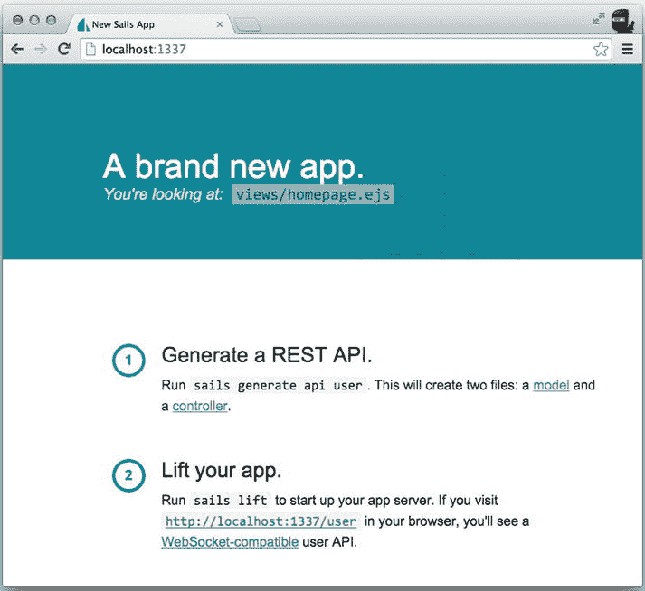
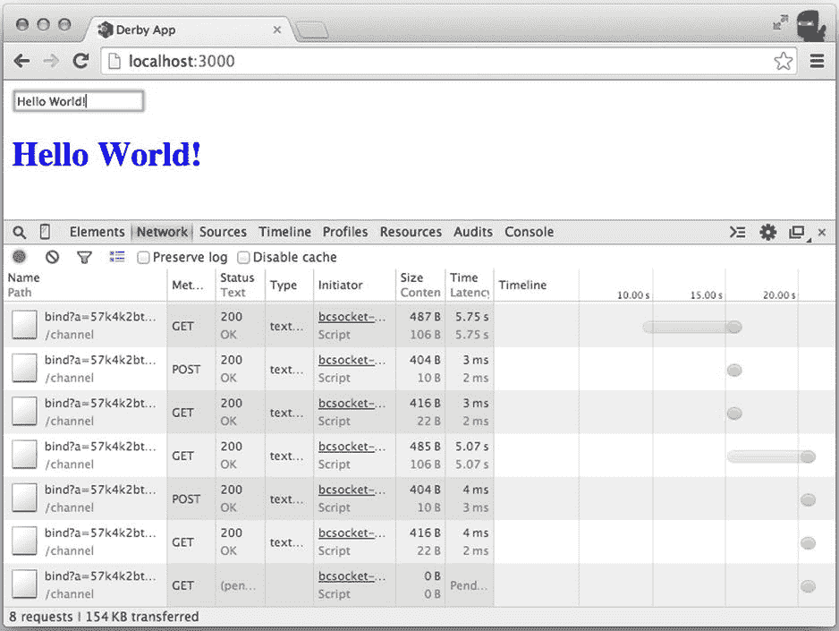
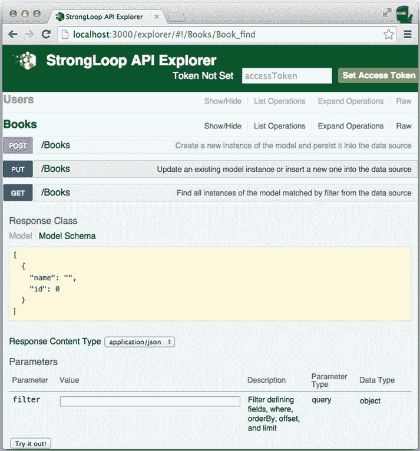

# 十八、Sails.js、DerbyJS、LoopBack 和其他框架

如果您想要完成比标准 Express.js 应用能够完成的更全面的任务，那么您可能需要考虑探索其他真正的 MVC 框架。好消息是，一些最流行的替代 Node.js 框架使用 Express.js。因此，通过理解 Express.js，您可以更快、更好地理解其他框架的内部工作方式。

本章介绍以下更多依赖于 Express.js 的*高级*框架:

*   帆. js
*   德比耶斯
*   回路

介绍这些其他框架的目的是为了证明，即使您使用的是 Express.js 以外的框架，您对 Express.js 的了解也会很方便。

帆. js

Sails.js 是一个*约定超过配置*类型的框架。这意味着它在理念上类似于 Ruby on Rails。Sails.js 是一个*真正的 MVC* 框架，不像 Express.js 依赖开发者添加像 Mongoose 这样的 ORM。Sails.js 使用水线形式(`https://github.com/balderdashy/waterline`)。

要开始使用 Sails.js:

```js
$ npm -g install sails@0.10.5

```

这将为您提供`sails`命令，您可以如下使用该命令来查看可用选项列表:

```js
$ sails -h

```

让我们使用`new`命令生成一个名为`sails` ( `ch18/sails`)的 app:

```js
$ sails new sails

```

生成 app 后，用`sails lift`启动它:

```js
$ cd sails
$ sails lift

```

现在，如果你去`http://localhost:1337`，你会看到一个 Sails.js 页面，上面有一些说明和链接，如图[图 18-1](#Fig1) 所示。



[图 18-1](#_Fig1) 。默认的 Sails.js 页面，带有一些说明和链接

Sails.js 有丰富的脚手架。要生成资源，您可以按照指定使用以下命令(用您自己的名称替换值)。

建立一个新的模型和控制器，`api/models/NAME.js`和`api/controllers/NAMEController.js`:

```js
$ sails generate api NAME

```

建立一个新模型`api/models/NAME.js`，带有属性(可选):

```js
$ sails generate model NAME [attribute1:type1, attribute2:type2 ... ]

```

构建一个新的控制器`api/controllers/NAMEController.js`，带有动作(可选):

```js
$ sails generate controller NAME [action1, action2, ...]:

```

构建新的适配器，`api/adapters/NAME`:

```js
$ sails generate adapter NAME:

```

构建一个名为`NAME`的新生成器:

```js
$ sails generate generator NAME

```

每个控制器都被构造成一个带有方法的模块。这些方法都是动作，比如`/controller/action`。每个动作都有一个请求和一个响应。它们的参数继承自它们的 Express.js 对应物。为了说明这一点，让我们创建一个控制器，并使用 Express.js 方法`response.json()`和`response.redirect()`向其添加一些自定义代码。

首先，运行以下命令:

```js
$ sails generate api user

```

打开新创建的文件`ch18/sails/api/controllers/UserController.js`，向其中添加两个动作`json`，它将输出当前时间，以及`buy-oauth`，它将使用重定向:

```js
module.exports = {
  json: function (request, response) {
    response.json({time: new Date()})
  },
  'buy-oauth': function (request, response) {
    return res.redirect('https://gum.co/oauthnode');
  }
};

```

如果你去`http://localhost:1337/user/json`，你会看到

```js
{ "time": "2014-09-09T14:59:28.377Z" }

```

如果你去`http://localhost:1337/user/buy-oauth`，你会被重定向到*介绍 OAuth 的网页，带有 node . js*(*webapplog.com*，2014) *。*

这个简短的介绍已经表明，用 Sails.js 编写控制器对您来说很容易，因为您已经熟悉了 Express.js。控制器是视图和模型之间的中介，通常包含大部分代码和逻辑。有关 Sails.js 概念及其文档的更多信息，请访问`http://sailsjs.org/#/documentation/concepts`和`http://irlnathan.github.io/sailscasts`。

德比耶斯

DerbyJS 是一个全栈框架，这意味着它同时处理客户端和服务器端代码。它还提供了数据库连接和抽象层(模型):`http://derbyjs.com`。DerbyJS 在反应式全栈方法上与 Meteor ( `https://www.meteor.com`)类似，但是 DerbyJS 在使用其包(与 NPM 模块相比)时不那么固执己见，也不急于求成。

首先，用这些版本(`ch18/derby/package.json`)创建一个`package.json`文件:

```js
{
  "name": "derby-app",
  "description": "",
  "version": "0.0.1",
  "main": "./server.js",
  "dependencies": {
    "derby": "0.6.0-alpha24",
    "derby-less": "0.1.0",
    "derby-starter": "0.2.3"
  }
}

```

要安装依赖项，请运行

```js
$ npm install

```

显然，`derby`是框架的模块。不太明显的是`derby-starter`，它是一组获取`derby`应用(`derby-app.js`)并通过设置运行它的文件。设置包括连接到 Redis 和 MongoDB，并将 DerbyJS 应用安装到 Express.js 服务器。

要使用`derby-starter`启动 DerbyJS 应用，请使用`server.js`。你可以复制和定制`derby-starter`来满足你的需求，或者编写你自己的迷你模块。`derby-starter/lib/server.js`文件使用熟悉的 Express.js 语句:

```js
//...
  expressApp
    // Creates an express middleware from the app's routes
    .use(app.router())
    .use(expressApp.router)
    .use(errorMiddleware)
//...

```

为了利用`derby-starter`，让我们创建一个`server.js`文件来启动服务器:

```js
require('derby-starter').run(__dirname+'/derby-app.js');

```

主要的 DerbyJS 逻辑将在`derby-app.js`文件中，其内容从实例化开始:

```js
var path = require('path'),
  derby = require('derby'),
  app = derby.createApp('derby-app', __filename);

```

从`derby-starter`访问 DerbyJS 应用需要下一个任务:

```js
module.exports = app;

```

仅仅为了多样化，我们在这里使用较少的 CSS 库，但是 Derby 支持Stylus和其他:

```js
app.serverUse(module, 'derby-less');

```

以下是我们加载样式的方法:

```js
app.loadStyles(path.join(__dirname, 'styles', 'derby-app'));

```

类似地，我们加载模板(`ch18/derby/views/derby-app.html`)，它在语法上类似于把手:

```js
app.loadViews (path.join(__dirname, 'views', 'derby-app'));

```

我们将定义的路由类似于 Express.js 路由。主要区别在于请求处理程序:`page`、`model`和`params`。`page`处理程序是用`page.render()`呈现的页面，`model`处理程序是传递给浏览器和从浏览器接收的数据库抽象层，`params`处理程序是具有 URL 参数(例如`/:id`)的对象:

```js
app.get('/', function(page, model, params) {
  model.subscribe('d.message', function() {
    page.render();
  });
});

```

下一个方法是`app.proto.create`，当页面同时加载到服务器和客户端时使用。请注意，这是 Node.js 代码，而不是浏览器代码。因此，该框架具有全栈特性:

```js
app.proto.create = function(model) {
  model.on('set', 'd.message', function(path, object) {
    console.log('message has been changed: ' + object);
  });
};

```

`ch18/derby/views/derby-app.html`的内容使用了一个特殊的 DerbyJS 标签，`<Body:>`:

```js
<Body:>
  <input value="{{d.message}}"><h1>{{d.message}}</h1>

```

少文件`derby-app.less`有这种风格:

```js
h1 {
  color: blue;
}

```

`derby-starter`还连接 Redis 和 MongoDB。因此，让我们在两个独立的终端窗口/选项卡中启动 Redis 和 MongoDB:

```js
$ redis-server
$ mongod

```

然后使用以下两个命令之一启动服务器:

```js
$ node server
$ node .

```

然后，去`http://localhost:3000`打个东西。文本将在页面的`<h1>`标签中自动更新(见[图 18-2](#Fig2) )，并保存到 MongoDB 数据库中。一切都是实时的！这意味着，如果您重新启动服务器并刷新页面，您将再次看到相同的消息。



[图 18-2](#_Fig2) 。DerbyJS 应用中的实时通信

回路

LoopBack 是一个全面的框架，带有命令行脚手架和 web API explorer: `http://strongloop.com/node-js/loopback`。

要安装命令行工具，请运行:

```js
$ npm install -g strongloop@2.9.1

```

要创建样板应用，请运行此命令并回答后续问题:

```js
$ slc loopback

```

最后，命令行工具将向您显示一些可用选项:

*   将目录更改为您的应用:

    ```js
    $ cd loopback

    ```

*   在您的应用中创建模型:

    ```js
    $ slc loopback:model

    ```

*   可选项:启用 StrongOps 操作监控:

    ```js
    $ slc strongops

    ```

*   运行应用:

    ```js
    $ slc run .

    ```

让我们用字符串类型的属性`name`、复数`Books`、内存存储和 REST API ( `slc`将要求输入)创建一个模型`Book`:

```js
$ cd loopback
$ slc loopback:model

```

完成模型后，运行:

```js
$ slc run

```

然后在你的浏览器中进入`http://localhost:3000/explorer`(见[图 18-3](#Fig3) )并点击书籍探索 API。



[图 18-3](#_Fig3) 。LoopBack 的 explorer 是 API 的 web 界面

为了演示 LoopBack 是建立在 Express.js 之上的，编辑`ch18/loopback/common/models/book.js`如下:

```js
module.exports = function(Book) {
  Book.buy = function(code, cb) {
    cb(null, 'Processing... ' + code);
  }

  Book.remoteMethod('buy', {accepts: [{http: function(ctx) {
    // HTTP request object as provided by Express.js
    var request = ctx.req;
    console.log(request.param('code'), request.ip, request.hostname)
    return request.param('code');
  }}],
      returns: {arg: 'response', type: 'string'}
    }
  );
};

```

`request` ( `ctx.req`)对象是 Express.js 请求。我们可以调用`request.param()`方法(在其他 Express.js 方法中，比如`request.ip()`和`request.hostname()`)来提取`code`参数。

客户端请求如下:

```js
$ curl http://localhost:3000/api/Books/Buy -X POST -d "code=1"

```

客户的反应是:

```js
{"response":"Processing... 1"}%

```

服务器日志包括:

```js
1 127.0.0.1 localhost

```

 **提示**每次修改源文件时，不要忘记用`$ slc run`重启服务器。

另一个可以使用 Express.js 技能的地方是`ch18/loopback/server/server.js`；例如:

```js
app.use(middleware());

```

其他框架

下面的列表介绍了一些你在掌握 Express.js 后可能想要使用的其他值得注意的框架(尽管它们不一定依赖于 Express.js):

*   *哈比神* ( `http://hapijs.com`):一个全面的、企业级的框架(*实用 node . js*【Apress，2014】有一个用这个框架构建的 REST API 示例)
*   *Total.js* ( `http://www.totaljs.com`):一个模块化的 web 应用框架
*   一个简单的、结构化的、用于Node的 web 框架
*   *复合* ( `http://compoundjs.com`):用 Express + structure + extensions 公式构建的框架(该框架的创建者为本书写了前言)

要了解更多 Node.js 框架，请查看`http://nodeframeworks.com`——node . js 框架的精选注册表。

摘要

正如您从 Sails.js、DerbyJS 和 LoopBack 的这一系列介绍中看到的，了解 Express.js 是有帮助的！

本书的第 3 部分到此结束，其中您已经学习了如何解决 Express.js 中的常见问题，例如抽象代码、使用域实现异步错误处理、保护您的应用、轻松实现服务器和客户端之间的实时通信、在其他框架中应用 Express.js 知识，以及使用集群跨越多个进程。现在，您已经准备好了比我们用来演示某些特性的例子更全面的例子。

在[第 4 部分](pt4.html)中，我们将涵盖四个示例应用，从 Instagram Gallery 开始，它展示了一个与第三方服务提供商集成的简单服务器。