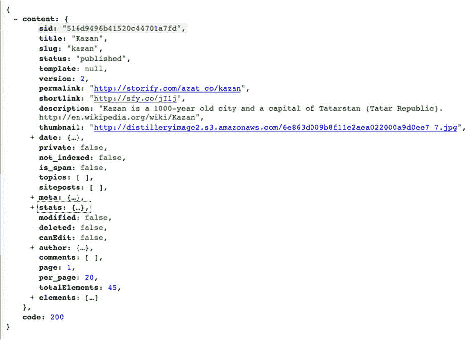

第十九章


Instagram 图库

如果你按时间顺序阅读这本书，你已经了解了 API 参考的重要但有些枯燥的细节，并且只接触了抽象的解决方案。现在你已经到了[第 4 部分](pt4.html)，激动人心的事情开始了，因为这一部分的五章都是关于编码和例子的！

本章中的教程演示了如何将 Express.js 与外部第三方服务(Storify API)一起使用。该应用程序的目的是从 Storify 获取 Instagram 照片，并将其显示在图库中。除了 Express.js，我们还将使用以下三个模块:

*   `superagent` ( `https://www.npmjs.org/package/superagent`)
*   `consolidate` ( `https://www.npmjs.org/package/consolidate`)
*   `handlebars` ( `https://www.npmjs.org/package/handlebars`)

我选择这些模块是因为它们在 Node.js 开发圈子里有些流行，所以你将来很有可能会遇到或使用它们。

 **注意**这个例子的完整源代码可以在`https://github.com/azat-co/sfy-gallery`找到。

Storify ( `http://storify.com`)运行在 Node.js ( `http://nodejs.org`)和 Express.js ( `http://expressjs.com`)上。因此，为什么不使用这些技术来编写一个应用程序，演示如何构建依赖于第三方 API 和 HTTP 请求的应用程序呢？

启动 Instagram 图库

Instagram Gallery 应用程序将获取一个故事对象，并显示其标题、描述和元素/图像的图库，如图 19-1 所示的示例。


[图 19-1](#_Fig1) 。Instagram 图库

 **注**如果你想知道喀山是什么，它是鞑靼共和国(鞑靼斯坦)有 1000 年历史的首都。

该应用程序的文件结构如下所示:

```js
- index.js
- package.json
- views/index.html
- css/bootstrap-responsive.min.css
- css/flatly-bootstrap.min.css

```

CSS 文件来自引导库(`http://getbootstrap.com`)和 Flatly theme ( `http://bootswatch.com/flatly`)。`index.js`文件是我们的主 Node.js 文件，其中包含了大部分逻辑，而`index.html`是 Handlebars 模板。这个应用程序使用了来自`css`文件夹中两个文件的普通 CSS。

我们的依赖包括

*   用于 Express.js 框架的 4.8.1 版
*   用于发出 HTTP(S)请求的 v0.18.2
*   `consolidate` v0.10.0 用于使用带有 Express.js 的把手
*   `handlebars`v 2 . 0 . 0-beta 1 用于使用车把模板引擎

`package.json`文件的内容如下:

```js
{
  "name": "sfy-gallery",
  "version": "0.2.0",
  "description": "Instagram Gallery: Storify API example written in Node.js",
  "main": "index.js",
  "scripts": {
    "test": "echo \"Error: no test specified\" && exit 1"
  },
  "dependencies": {
    "consolidate": "0.10.0",
    "express": "4.8.1",
    "handlebars": "2.0.0-beta.1",
    "superagent": "0.18.2"
  },
  "repository": "https://github.com/storify/sfy-gallery",
  "author": "Azat Mardan",
  "license": "BSD"
}

```

让我们继续安装模块

```js
$ npm install

```

NPM 完成后，创建`index.js`。在文件的开头，我们需要以下依赖项:

```js
var express = require('express');
var superagent = require('superagent');
var consolidate = require('consolidate');

var app = express();

```

然后，我们配置模板引擎:

```js
app.engine('html', consolidate.handlebars);
app.set('view engine', 'html');
app.set('views', __dirname + '/views');

```

接下来，我们用中间件建立一个静态文件夹:

```js
app.use(express.static(__dirname + '/public'));

```

如果你想提供任何其他的故事，请随意。所有你需要的是作者的用户名和故事鼻涕虫为我的鞑靼斯坦首都喀山画廊。留下以下内容:

```js
var user = 'azat_co';
var story_slug = 'kazan';

```

如下所示粘贴您的值:Storify API key、username 和 _token(如果有)。在撰写本文时，Storify API 是公开的，这意味着不需要*认证*(即不需要密钥)。如果将来这种情况发生变化，请在`http://dev.storify.com/request`请求 API 密钥或在`http://dev.storify.com`遵循官方文档:

```js
var api_key = "";
var username = "";
var _token = "";

```

让我们定义回家的路线(`/`):

```js
app.get('/',function(req, res){

```

现在，我们将使用`superagent get()`方法从 Storify API 中获取路由回调的元素:

```js
superagent.get("http://api.storify.com/v1/stories/"
  + user + "/" + story_slug)

```

Storify API 端点是`"` `http://api.storify.com/v1/stories/` `" + user + "/" + story_slug`，在本例中是`http://api.storify.com/v1/stories/azat/kazan`。`superagent`的一个优点是我们可以编写链式方法。例如，`query()`在查询字符串中发送数据:

```js
.query({api_key: api_key,
  username: username,
  _token: _token})

```

`set()`方法指定了请求头:

```js
.set({Accept: 'application/json'})

```

并且`end()`在收到响应时执行回调:

```js
.end(function(e, storifyResponse){
  if (e) return next(e);

```

要使用 HTTP 响应主体的 content 属性中的 story 对象来呈现模板，我们使用以下代码:

```js
      return res.render('index', storifyResponse.body.content);
    })

})

app.listen(3001);

```

Storify API 将数据作为 JSON 返回。您可以通过进入`https://api.storify.com/v1/stories/azat_co/kazan`来查找格式(假设 API 仍然是公共的，在撰写本文时就是如此)。你可以在图 19-2 的[中看到收缩的(即不显示每个嵌套的对象)JSON。](#Fig2)



[图 19-2](#_Fig2) 。story 实体的约定 Storify API 输出示例

查看画廊

现在，我们已经有了从 Storify 获取数据并调用`index`模板来呈现数据的应用程序，让我们来看看位于`views/index.html`文件中的 Handlebars 模板:

```js
*<!DOCTYPE html lang="en">*
<html>
  <head>
    <link type="text/css"
      href="css/flatly-bootstrap.min.css"
      rel="stylesheet" />
    <link type="text/css"
      href="css/bootstrap-responsive.min.css"
      rel="stylesheet"/>
  </head>

  <body class="container">
    <div class="row">

```

现在，我们使用`{{title}}`来显示 Storify 故事的标题，使用`{{author.name}}`来显示其作者姓名:

```js
  <h1>{{title}}<small> by {{author.name}}</small></h1>
  <p>{{description}}</p>
</div>
<div class="row">
  <ul class="thumbnails">

```

下一行是一个内置的`handlebars`构造，它遍历数组项。并且，随着每一次迭代，我们打印一个新的`<li>`标签:

```js
      {{#each elements}}
        <li class="span3">
          <a class="thumbnail" href="{{permalink}}"
          target="_blank">
            
          </a>
        </li>
      {{/each}}
      </ul>
    </div>
  </body>

</html>

```

当你用`$ node .`启动应用时，你会在`http://localhost:3000`看到图片。发生的情况是，当你进入页面时，本地服务器迅速向 Storify 发出请求，并从 Instagram 获取图片的链接。

摘要

Express.js 和`superagent`让开发者只需几行代码就可以检索和操作 Storify、Twitter 和脸书等第三方服务提供的数据。本章给出的例子相当简单，因为它不使用数据库。但是，在下一章，Todo 应用程序将向您展示如何利用 MongoDB。

 **注意**在大多数情况下，服务提供商(如谷歌、脸书和 Twitter)需要认证(在撰写本文时，Storify API 并非如此)。要使 OAuth 1.0、OAuth 2.0 和 OAuth Echo 请求，考虑 OAuth(`https://www.npmjs.org/package/oauth`；GitHub: `https://github.com/ciaranj/node-oauth`)、every auth(`https://www.npmjs.org/package/everyauth`)；GitHub: `https://github.com/bnoguchi/everyauth`)和/或护照(网址:`http://passportjs.org/`；GitHub: `https://github.com/jaredhanson/passport`)。