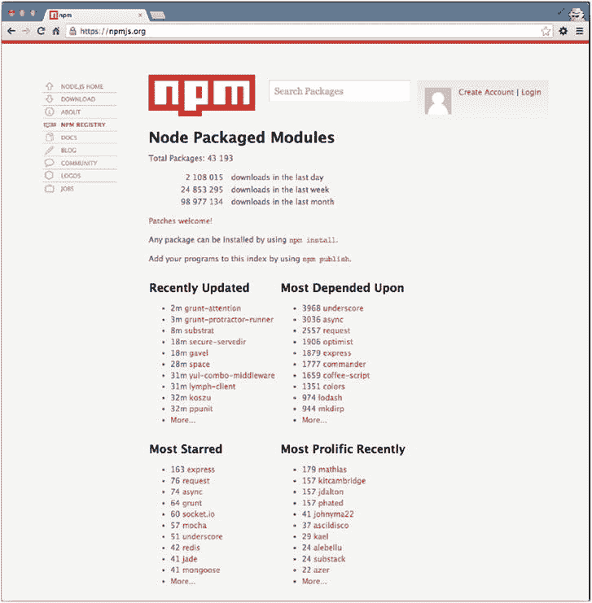
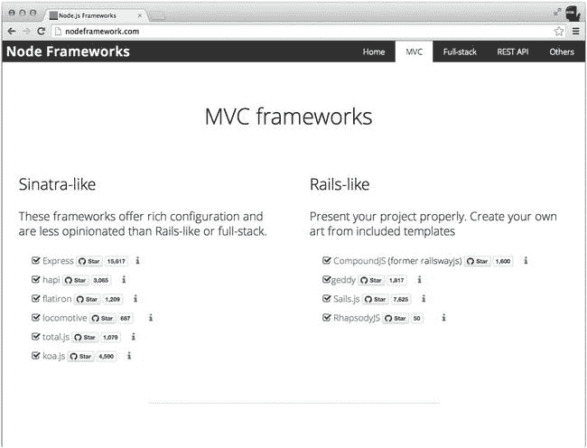

# 二十三、附录 A：相关阅读和资源

这个简短的附录提供了几个最有用的 Node.js 资源，供进一步学习使用:

*   其他 Node.js 框架
*   Node.js 书籍
*   JavaScript 经典

其他 Node.js 框架

毫无疑问，Express.js 框架是 Node.js web 服务中最成熟、最流行、最健壮、经过测试和使用最多的项目。截至本文撰写之时，Express.js 也是来自 NPM 社区的明星数量最多的 NPM 知识库，如图[图 A-1](#Fig1) 所示。依赖 Express.js 2.x 和 3.x 的真实制作 app 有很多，包括 Storify [1](#Fn1) (被 LiveFyre [2](#Fn2) 收购)、DocuSign、 [3](#Fn3) 新 MySpace、 [4](#Fn4) LearnBoost、 [5](#Fn5) Geeklist、[6](#Fn6) [10](#Fn10)

[图 A-1](#_Fig1) 。Express.js 是最受欢迎的 NPM 知识库

尽管如此，Express.js 还有很多可供选择的 Node.js 框架。为了帮助开发人员浏览众多选项，我创建了一个类似于 TodoMVC 集合(`http://todomvc.com`):Node 框架(`http://nodeframework.com`)，其 MVC 框架页面如图[图 A-2](#Fig2) 所示。顺便说一下，一些更全面的框架依赖于 Express.js(例如，SailsJS [11](#Fn11) )，所以您开始了解 Express.js 是件好事！

[图 A-2](#_Fig2) 。Node Frameworks 提供了 Node.js 框架及其统计信息的列表

Node.js 书籍

有关 Node.js 堆栈的其他组件(如数据库和 WebSockets)的更多核心概述和/或信息，请参考以下资源:

*   Azat Mardan (Apress，2014 年)的《实用 Node.js:构建真实世界的可扩展 web 应用》:这是一个循序渐进的指南，帮助您学习如何构建可扩展的真实世界的 web 应用，从安装 Express.js 到编写全栈 Web 应用。
*   *JS 快速原型:敏捷 JavaScript 开发*[12](#Fn12)(Azat Mardan，2013):一本关于 Node.js、MongoDB 和 Backbone.js 的初级到中级书籍
*   *JavaScript 和 Node 基础知识:基本知识集锦*[13](#Fn13)(Azat Mardan，2014):关于浏览器 JS 和 Node 的简单但重要的概念的简短阅读。
*   *用 Node.js 介绍 OAuth:Twitter API OAuth 1.0，OAuth2.0，OAuth Echo，Everyauth 和 OAuth 2.0 服务器示例*[14](#Fn14)(Azat Mardan，2014):一本关于不同 OAuth 场景的迷你书。
*   Colin J. Ihrig (Apress，2013 年)为开发人员编写的 Pro Node.js):这是一本关于 Node.js 的综合性低级书籍，没有任何非核心模块。
*   *Node.js in Action* ，作者 Mike Cantelon 等人(Manning Publications，2013):一本由多位作者撰写的关于 Express.js 和其他主题的书。
*   *学习 Node*，作者 Shelley Powers (O'Reilly Media，2012):涵盖了 Express、MongoDB、Mongoose 和 Socket.IO。
*   *Node 食谱*，作者 David Mark Clements(Packt Publishing，2012):涵盖了数据库和 WebSockets。
*   *Node:启动并运行*，作者汤姆·休斯-克劳奇和迈克·沃森(O'Reilly Media，2012):Node . js 的简要概述
*   *Smashing node . js:JavaScript Everywhere*，作者 Guillermo Rauch (Wiley，2012):涵盖了 Express.js、Jade 和 Stylus，作者是 Mongoose ORM for MongoDB 的创建者。

JavaScript 经典

要想更深入地了解 JavaScript 这种最容易被误解也是最流行的编程语言，请务必阅读以下经典著作:

*   *雄辩的 JavaScript，第二版*，作者 Marijn Haverbeke(无淀粉出版社，2014):JavaScript 编码中的编程基础。
*   道格拉斯·克洛克福特(O'Reilly Media，2008 年)的《JavaScript:好的部分》(The Good Parts )讲述了 JavaScript 语言中棘手的部分。

课程

如果你喜欢这本书，那么可以看看 Azat 的 Node.js 课程:Node Program ( `http://nodeprogram.com`)和 Mongoose 课程(`http://mongoosecourse.com`)。

__________________

[1](#_Fn1)T0】

[2](#_Fn2)T0】

[3](#_Fn3)T0】

[4](#_Fn4)T0】

[5](#_Fn5)T0】

[6](#_Fn6)T0】

[7](#_Fn7)T0】

[8](#_Fn8)T0】

[9](#_Fn9)T0】

[10](#_Fn10)T0】

[11](#_Fn11)T0】

[12](#_Fn12)T0】

[13](#_Fn13)T0】

[14](#_Fn14)T0】