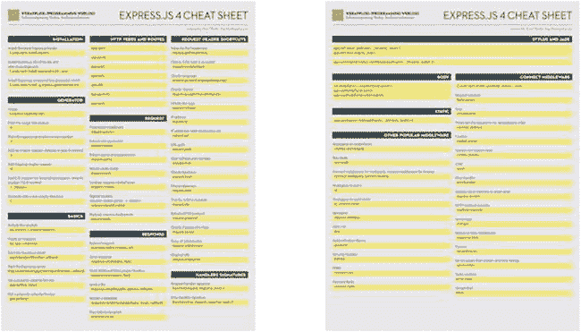

附录 C


Express.js 4 备忘单

*Pro Express.js* 是一本内容丰富的书，有很多例子教你关于中间件、模式和配置的知识。因此，当您开始从事自己的项目时，您会发现拥有最重要的函数和命令的快速参考—备忘单是非常有用的。我已经创建了自己的 Express.js 4 备忘单，如图[图 C-1](#Fig1) 所示，我将它作为礼物送给 *Pro Express.js* 的读者。你可以在`https://gum.co/NQiQ/AC30238A-5C5C`免费下载这份备忘单的精美 PDF 格式，正常价格是 4.99 美元。此链接仅供 Pro Express.js *的读者使用*，请勿分享给任何人。



[图 C-1](#_Fig1) 。Express.js 4 备忘单

备忘单中的信息可在本附录中找到，也可在线访问`https://github.com/azat-co/cheatsheets/blob/master/express4/index.md`。备忘单包含以下几个部分:

*   装置
*   发电机
*   基础
*   HTTP 动词和路由
*   请求
*   请求标题快捷方式
*   反应
*   经手人签名
*   铁笔和玉石
*   身体
*   静态
*   连接中间件
*   其他流行的中间件

在撰写本文时，备忘单适用于 Express 4.10.4。

装置

*   本地安装最新的 Express.js】
*   本地安装 Express.js v4.2.0，保存到`package.json`

    ```js
    $ sudo npm install express@4.2.0 --save

    ```

*   安装 Express.js 命令行生成器 v4.0.0

    ```js
    $ sudo npm install -g express-generator@4.0.0

    ```

发电机

用法:`$ express [options] [dir]`

选项:

*   `-h`:打印使用信息
*   `-V`:打印快速生成器版本号
*   `-e`:增加 ejs 引擎支持，省略默认为 jade
*   `-H`:增加 hogan.js 引擎支持
*   `-c <library>`:添加 CSS 支持(less|stylus|compass)，如果省略，默认为普通 CSS
*   `-f`:生成到非空目录

基础

*   包含模块:

    ```js
    var express = require('express')

    ```

*   创建实例:

    ```js
    var app = express()

    ```

*   启动 Express.js 服务器:

    ```js
    app.listen(portNumber, callback)

    ```

*   启动 Express.js 服务器:

    ```js
    http.createServer(app).listen(portNumber, callback)

    ```

*   通过

    ```js
    app.set(key, value)

    ```

    键设置属性值
*   通过关键字

    ```js
    app.get(key)

    ```

    获取属性值

HTTP 动词和路由

*   `app.get(urlPattern, requestHandler[, requestHandler2, ...])`
*   `app.post(urlPattern, requestHandler[, requestHandler2, ...])`
*   `app.put(urlPattern, requestHandler[, requestHandler2, ...])`
*   `app.delete(urlPattern, requestHandler[, requestHandler2, ...])`
*   `app.all(urlPattern, requestHandler[, requestHandler2, ...])`
*   `app.param([name,] callback)`:
*   `app.use([urlPattern,] requestHandler[, requestHandler2, ...])`

请求

*   `request.params`:参数中间件
*   `request.param`:提取一个参数
*   `request.query`:提取查询字符串参数
*   `request.route`:返回路线字符串
*   `request.cookies`:cookie，需要`cookie-parser`
*   `request.signedCookies`:已签名的 cookies，需要`cookie-parser`
*   `request.body`:有效载荷，需要`body-parser`

请求标题快捷方式

*   `request.get(headerKey)`:表头键值
*   `request.accepts(type)`:检查类型是否被接受
*   `request.acceptsLanguage(language)`:检查语言
*   `request.acceptsCharset(charset)`:检查字符集
*   `request.is(type)`:检查类型
*   `request.ip` : IP 地址
*   `request.ips` : IP 地址(打开信任代理)
*   `request.path`URL 路径
*   `request.host`:没有端口号的主机
*   `request.fresh`:检查新鲜度
*   `request.stale`:检查陈旧性
*   `request.xhr`:对于 AJAX-y 请求为真
*   `request.protocol`:返回 HTTP 协议
*   `request.secure`:检查协议是否为`https`
*   `request.subdomains`:子域数组
*   `request.originalUrl`原始 URL

反应

*   `response.redirect(status, url)`:重定向请求
*   `response.send(status, data)`:发送响应
*   `response.json(status, data):`发送 JSON 并强制正确的报头
*   `response.sendfile(path, options, callback)`:发送文件
*   `response.render(templateName, locals, callback)`:渲染模板
*   `response.locals`:将数据传递给模板

经手人签名

*   `function(request, response, next) {}`:请求处理者签名
*   `function(error, request, response, next) {}`:错误处理程序签名

铁笔和玉石

```js
app.set('views', path.join(__dirname, 'views'))
app.set('view engine', 'jade')
app.use(require('stylus').middleware(path.join(__dirname, 'public')))

```

身体

```js
var bodyParser = require('body-parser')
app.use(bodyParser.json())
app.use(bodyParser.urlencoded())

```

静态

```js
app.use(express.static(path.join(__dirname, 'public')))

```

连接中间件

```js
$ sudo npm install <package_name> --save

```

*   `body-parser`:请求有效载荷
*   `compression` : Gzip
*   `connect-timeout`:请求超时，单位为毫秒，默认为 5000
*   `cookie-parser`:饼干
*   `cookie-session`:通过 Cookies 存储的会话
*   `csurf` : CSRF
*   `errorhandler`:错误处理程序
*   `express-session`:通过内存或其他存储进行会话
*   `method-override` : HTTP 方法覆盖
*   `morgan`:服务器日志
*   `response-time`:响应时间中间件
*   `serve-favicon`:收藏夹图标
*   `serve-index`:提供包含目录列表的页面
*   `serve-static`:静态内容
*   `vhost`:虚拟主机

其他流行的中间件

*   `cookies`和`keygrip`:类似于`cookieParser`
*   `raw-body`:生体
*   `connect-multiparty`、`connect-busboy`:连接多方中间件，连接勤杂工中间件
*   `qs`:类似于`query`
*   `st`、`connect-static`类似于`staticCache`
*   `express-validator`:验证
*   `less`:少 CSS
*   `passport`:认证库
*   `helmet`:安全标题
*   `connect-cors` ： 心形
*   `connect-redis`:连接中继