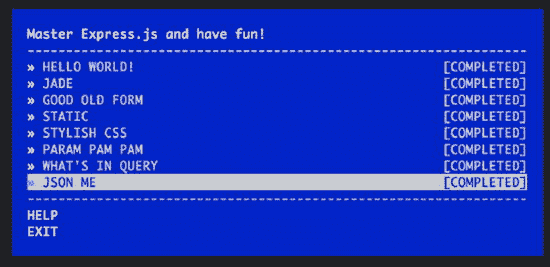

附录 D


快速工程

ExpressWorks 是一个自动化的研讨会，它引导您构建 Express.js 服务器，处理 GET、POST 和 PUT 请求，以及提取查询字符串、有效负载和 URL 参数。ExpressWorks 为您提供了任务和提示。你写下这些任务的解决方案。然后，在您将解决方案编写为 Express.js 应用程序后，ExpressWorks 会验证您对问题的解决方案。

ExpressWorks 以 workshop[<sup>1</sup>](#Fn1)为原型，以@substack [<sup>3</sup>](#Fn3) 和@maxogden 为灵感来源于 stream-adventure[<sup>2</sup>](#Fn2)。 [<sup>4</sup>](#Fn4) 本附录包括以下高速公路简介:

*   装置
*   使用
*   重复定位
*   任务

装置

ExpressWorks v0.0.23 的建议全局安装如下:

```js
$ npm install -g expressworks@0.0.23
$ expressworks

```

如果遇到错误，请尝试

```js
$ sudo npm install -g expressworks@0.0.23

```

另一种方法(对于高级开发人员)是使用本地安装。为此，请在本地运行并安装以下程序:

```js
$ mkdir node_modules
$ npm install expressworks@0.0.23
$ cd node_modules/expressworks$ node expressworks

```

使用

完成安装后，ExpressWorks 理解这些命令:

*   `$ expressworks`:显示菜单，交互选择车间。
*   显示所有车间的换行符列表。
*   `$ expressworks select NAME`:选择一个车间。
*   `$ expressworks current`:显示当前选择的车间。
*   `$ expressworks run program.js`:针对所选输入运行程序。
*   根据预期的输出来验证你的程序。

重复定位

如果要重置已完成任务列表，如[图 D-1](#Fig1) 所示，清空`~/.config/expressworks/completed.json`文件。



[图 D-1](#_Fig1) 。已完成的任务

任务

本节描述了您将遇到的一些任务。

你好世界

创建一个运行在 l `ocalhost:3000`上的 Express.js app，输出“Hello World！”有人去 root `'/home'`的时候。

ExpressWorks 给你提供的`process.argv[2]`，就是端口号。

翡翠

创建一个 Express.js 应用程序，其主页(`/home`)由 Jade 模板引擎呈现，显示当前日期(`toDateString`)。

古老的好形式

编写一个处理 HTML 表单输入(`<form><input name="str"/></form>`)并反向打印`str`值的路径(`'/form'`)。

静态

将静态中间件应用到没有任何路由的服务器`index.html`文件。通过路径的`process.argv[3]`值提供并使用`index.html`文件。但是，您可以将自己的文件用于此内容:

```js
<html>
  <head>
    <link rel="stylesheet" type="text/css" href="/main.css"/>
  </head>
  <body>
    <p>I am red!</p>
  </body>
</html>

```

时尚的 CSS

用一些手写笔中间件来设计你的 HTML。`process.argv[3]`中提供了`main.styl`文件的路径，或者您可以从这些文件/文件夹中创建自己的文件/文件夹:

```js
p
color red

```

`index.html`文件如下:

```js
<html>
  <head>
    <title>expressworks</title>
    <link rel="stylesheet" type="text/css" href="/main.css"/>
  </head>
  <body>
    <p>I am red!</p>
  </body>
</html>

```

帕梅！帕梅！帕梅！帕梅！帕梅！帕梅

创建一个 Express.js 服务器来处理 PUT `/message/:id`请求(例如，PUT `/message/526aa677a8ceb64569c9d4fb`)。

该请求的响应返回用日期散列的 id SHA1:

```js
require('crypto')
  .createHash('sha1')
  .update(new Date().toDateString().toString() + id)
  .digest('hex')

```

查询中有什么

编写一个路由，从 GET `/search` URL 路由(例如`?results=recent&include_tabs=true`)中的查询字符串中提取数据，然后转换并以 JSON 格式输出回给用户。

加入我吧

写一个服务器，读取一个文件(文件名传入`process.argv[3]`)，然后解析成 JSON，用`res.json(object)`把内容输出给用户。

摘要

ExpressWorks 是一个命令行工具，它将帮助您熟悉 Express.js 的一些基础知识。如果您喜欢这种学习方法，请在`http://nodeschool.io`查看免费提供给您的类似研讨会/工具。

__________________

[<sup>1</sup>](#_Fn1)T0】

[<sup>2</sup>](#_Fn2)T0】

[<sup>3</sup>](#_Fn3)T0】

[<sup>4</sup>](#_Fn4)T0】