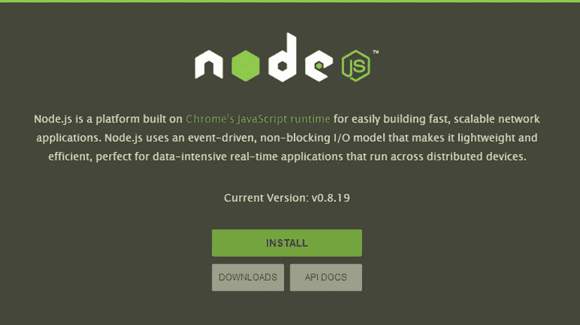

第一章


入门指南

JavaScript 最初被命名为 Mocha，是由 Brendan Eich 于 1995 年在网景公司开发的。1995 年 9 月，Netscape Navigator 2.0 的测试版与 Mocha 一起发布，Mocha 已被重命名为 LiveScript。到了 1995 年 12 月，LiveScript 经过了另一次更名，变成了 JavaScript，也就是现在的名字。在那段时间，网景公司与负责开发 Java 编程语言的 Sun 公司密切合作。JavaScript 这个名字的选择引起了很多猜测。许多人认为网景公司试图借用当时的热门词汇 Java。不幸的是，命名选择引起了很多混乱，因为许多人自动认为这两种语言在某种程度上是相关的。事实上，他们几乎没有共同点。

尽管混乱，JavaScript 成为了一种非常成功的客户端脚本语言。作为对 JavaScript 成功的回应，微软创建了自己的实现，命名为 JScript，并于 1996 年 8 月与 Internet Explorer 3.0 一起发布。1996 年 11 月，Netscape 向国际标准组织 Ecma International 提交了 JavaScript 标准。1997 年 6 月，JavaScript 成为了标准的 ECMA-262。

多年来，JavaScript 一直是客户端开发事实上的标准。然而，服务器领域是一个完全不同的故事。在很大程度上，服务器领域属于 PHP 和 Java 等语言。许多项目已经将 JavaScript 实现为服务器语言，但是没有一个项目特别成功。两个主要障碍阻碍了 JavaScript 在服务器上的广泛应用。首先是它的声誉。JavaScript 一直被视为玩具语言，只适合业余爱好者。第二个障碍是 JavaScript 与其他语言相比表现不佳。

然而，JavaScript 有一大优势。网络正在经历前所未有的增长，浏览器大战正在激烈进行。作为所有主流浏览器都支持的唯一语言，JavaScript 引擎开始受到谷歌、苹果和其他公司的关注。所有这些关注导致了 JavaScript 性能的巨大提高。突然间 JavaScript 不再落后了。

开发社区注意到了 JavaScript 的新力量，并开始创建有趣的应用。2009 年，Ryan Dahl 创建了 Node.js，这是一个主要用于为 web 应用创建高度可伸缩的服务器的框架。Node.js，简称 Node，是用 C++和 JavaScript 编写的。为了驱动 Node，达尔利用了谷歌的 V8 JavaScript 引擎 (V8 是谷歌 Chrome 内部的引擎，是现存最流行的浏览器)。使用 V8，开发人员可以用 JavaScript 编写成熟的应用——通常用 C 或 Java 等语言编写的应用。因此，随着 Node 的发明，JavaScript 最终成为了真正的服务器端语言。

Node执行模式

除了速度，Node 还带来了一个非常规的执行模型。为了理解 Node 有何不同，我们应该将它与 Apache 进行比较，Apache 是 Linux、Apache、MySQL 和 PHP (LAMP) 软件栈中流行的 web 服务器。首先，Apache 只处理 HTTP 请求，将应用逻辑留给 PHP 或 Java 之类的语言来实现。Node 通过将服务器和应用逻辑结合在一个地方，消除了一层复杂性。一些开发人员批评这种模型消除了 LAMP 堆栈中使用的传统的关注点分离。然而，这种方法也为Node作为服务器提供了前所未有的灵活性。

Node 在并发性的使用上也不同于许多其他服务器。像 Apache 这样的服务器维护一个线程池来处理客户端连接。这种方法缺乏可伸缩性，因为线程相当耗费资源。此外，繁忙的服务器会很快耗尽所有可用的线程；结果，产生了更多的线程，创建和拆除这些线程的成本很高。另一方面，Node 在单个线程中执行。虽然这看起来是个坏主意，但实际上它工作得很好，因为大多数服务器应用都是这样工作的。通常，服务器接收客户端请求，然后执行一些高延迟 I/O 操作，如文件读取或数据库查询。在此期间，服务器阻塞，等待 I/O 操作完成。服务器可以处理更多的请求或做其他有用的工作，而不是无所事事。

在传统服务器中，线程在阻塞 I/O 操作时什么都不做是可以接受的。然而，Node 只有一个线程，阻塞它会导致整个服务器挂起。为了缓解这个问题，Node 几乎只使用非阻塞 I/O。例如，如果 Node 需要执行数据库查询，它只需发出查询，然后处理其他事情。当查询最终返回时，它会触发一个负责处理查询结果的异步回调函数。该过程的伪代码示例如清单 1-1 中的[所示。](#list1)

***[清单 1-1](#_list1)*** 。非阻塞数据库查询的伪代码示例

```js
var sql = "SELECT * FROM table";

database.query(sql, function(results) {
  // process the results
});
// do something else instead of waiting
```

Node 的非阻塞异步执行模型以最小的开销提供了高度可伸缩的服务器解决方案。许多高调的公司，包括微软，LinkedIn，雅虎！和零售巨头沃尔玛已经注意到了 Node，并开始与它一起实施项目。例如，LinkedIn 将其整个移动堆栈迁移到 Node，并“从在每台物理机上运行 15 台服务器和 15 个实例(虚拟服务器)，减少到只有 4 个实例，可以处理两倍的流量。”Node 还获得了媒体的广泛认可，例如赢得了 2012 年 InfoWorld 年度技术奖。

安装Node

开始使用 Node 的第一步是安装。本节将帮助您在 Ubuntu、OS X 或 Windows 机器上安装并运行 Node。安装Node最简单的方法是通过Node主页上的安装按钮`http://nodejs.org`，如图 1-1 中的[所示。这将下载适用于您的操作系统的二进制文件或安装程序。](#Fig1)



[图 1-1](#_Fig1) 。从项目主页安装Node

您还可以在`http://nodejs.org/download`浏览所有平台的二进制文件、安装程序和源代码。Windows 用户最有可能想要下载 Windows 安装程序(`.msi`文件)，而 Mac 用户应该选择 Mac OS X 安装程序(`.pkg`文件)。Linux 和 SunOS 用户可以下载二进制文件，但是使用包管理器安装可能更简单。

通过软件包管理器安装

有关通过操作系统的软件包管理器安装Node的说明，请转到`https://github.com/joyent/node/wiki/Installing-Node.js-via-package-manager`。本页包含 Windows、OS X 和 Linux 的说明。同样，Windows 和 Mac 用户应该使用前面讨论过的安装程序。就 Linux 而言，有针对 Gentoo、Debian、Linux Mint、Ubuntu、openSUSE、SLE、Red Hat、Fedora、Arch Linux、FreeBSD 和 OpenBSD 的指令。

Ubuntu 用户可以使用清单 1-2 所示的高级打包工具(APT)命令安装 Node 和所有必备软件。这些步骤还会安装`npm`，Node的软件包管理软件(在[第 2 章](02.html)中介绍)。

***[清单 1-2](#_list2)*** 。使用 Ubuntu 的软件包管理器安装Node

```js
$ sudo apt-get install python-software-properties python g++ make
$ sudo add-apt-repository ppa:chris-lea/node.js
$ sudo apt-get update
$ sudo apt-get install nodejs npm
```

如果`add-apt-repository`命令失败，使用[清单 1-3](#list3) 中所示的命令安装`software-properties-common`包。

***[清单 1-3](#_list3)*** 。安装`Software-Properties-Common`包

```js
$ sudo apt-get install software-properties-common
```

从源头开始构建

如果您想为 Node 的 C++核心做出贡献，或者只是尝试它的功能，您将需要编译项目的源代码。您可以从下载页面获得源代码，或者从项目的 GitHub 资源库`https://github.com/joyent/node`获得。一旦下载了代码，如果适用的话，从存档中提取它。在构建 Node 之前，Ubuntu 用户需要安装 Python 等构建工具；使用清单 1-4 中的命令。安装 Python 时，一定要安装 2.7 版本，而不是更新的 Python 3。

***[清单 1-4](#_list4)*** 。在 Ubuntu 上安装必备软件包

```js
$ sudo apt-get install python-software-properties python g++ make
```

Ubuntu 和 OS X 用户可以从源代码目录中发出清单 1-5 所示的命令来构建 Node。请注意，源代码目录的完整路径不应包含任何空格。

***[清单 1-5](#_list5)*** 。在 Ubuntu 和 OS X 上从源代码安装Node

```js
./configure
make
sudo make install
```

在 Windows 上，您需要安装 Visual C++和 Python 2.7 来构建Node。Visual C++可以通过 Visual Studio Express 从微软免费下载。Python 也可以在`www.python.org/`免费获得。要编译 Node，发出清单 1-6 中的命令。

***[清单 1-6](#_list6)*** 。在 Windows 上从源安装Node

```js
> vcbuild.bat release
```

最终安装步骤

无论您决定采用哪种安装方式，此时Node都应该可以使用了。为了验证一切都设置正确，打开一个新的终端窗口，并运行`node`可执行文件(参见[清单 1-7](#list7) )。`-v`标志使`Node`打印已安装的版本，然后退出。在此示例中，安装了 0.10.18 版的Node。

***[清单 1-7](#_list7)*** 。从命令行检查`Node`的版本

```js
$ node -v
v0.10.18
```

你还应该确认`npm`已经安装(见[清单 1-8](#list8) )。

***[清单 1-8](#_list8)*** 。从命令行检查`npm`的版本

```js
$ npm -v
1.3.8
```

最后一个安装注意事项:即使您没有从源代码安装 Node，也可能需要在您的机器上安装 Python 和 C++编译器。这样做可以确保用 C++编写的本机模块可以在您的Node安装中编译和运行。在 Windows 上，这涉及到安装微软的 Visual C++编译器(参见上一节“从源代码构建”)。对于任何其他操作系统，构建基础应该包括必要的编译器。

读取-评估-打印循环

Node 提供了一个交互式 shell，称为*读取-评估-打印循环*，或 REPL。REPL 从用户那里读取输入，将输入作为 JavaScript 代码进行评估，打印结果，然后等待更多的输入。REPL 对于调试和试验小的 JavaScript 代码片段非常有用。要启动 REPL，请不带命令行参数启动`Node`。然后你会看到 REPL 命令提示符，即`>`字符。在提示符下，开始输入任意 JavaScript 代码。

[清单 1-9](#list9) 显示了如何启动 REPL 并输入代码。在这个例子中，用字符串值`"Hello World!"`创建了一个名为`foo`的变量。在第三行，REPL 打印出`"undefined"`，因为变量声明语句没有返回值。接下来，语句`foo;`使得`foo`的值被检查。不出所料，REPL 返回字符串`"Hello World!"`。最后，使用`console.log()`功能将`foo`的值打印到终端。打印完`foo`后，REPL 再次显示`"undefined"`，因为`console.log()`不返回值。

***[清单 1-9](#_list9)*** 。启动 REPL 并输入 JavaScript 代码

```js
$ node
> var foo = "Hello World!";
undefined
> foo;
'Hello World!'
> console.log(foo);
Hello World!
undefined
```

您也可以在 REPL 中输入多行表达式。例如，在清单 1-10 的[中，一个`for`循环进入了 REPL。REPL 使用`...`来表示正在进行的多行表达式。注意，`...`是由 REPL 显示的，而不是用户输入的。](#list10)

***[清单 1-10](#_list10)*** 。在 REPL 中执行多行表达式的例子

```js
> for (var i = 0; i < 3; i++) {
... console.log(i);
... }
0
1
2
undefined
```

REPL 特色

REPL 有许多增加可用性的特性，其中最有用的是使用上下箭头键浏览先前发布的命令的能力。要终止任何命令并返回空白提示符，请键入`Control+C`。从空白行按下`Control+C`两次会导致 REPL 终止。你可以随时按下`Control+D`退出 REPL。您可以使用`Tab`键查看当前命令的可能完成列表。如果只有一个可能的选项，Node 会自动插入它。该列表包括关键字、函数和变量。例如，[清单 1-11](#list11) 显示了在提示符下输入`t`时的完成选项。

***[清单 1-11](#_list11)*** 。通过键入`t`后跟 Tab 显示自动完成选项

```js
> t
this            throw           true            try
typeof          tls             tty             toLocaleString
toString
```

REPL 还提供了一个特殊的变量，`_`(下划线)，它总是包含上一个表达式的结果。[清单 1-12](#list12) 显示了`_`的几个使用示例。首先，创建一个字符串数组，使`_`引用该数组。然后使用`pop()`方法移除数组的最后一个元素`baz`。最后，访问`baz`的长度，使`_`变成`3`。

***[清单 1-12](#_list12)*** 。_ 变量的使用示例

```js
> ["foo", "bar", "baz"]
[ 'foo', 'bar', 'baz' ]
> _.pop();
'baz'
> _.length
3
> _
3
```

REPL 命令

`.help`

`.help`命令显示所有可用的 REPL 命令。[清单 1-13](#list13) 显示了运行`.help`命令的输出。

***[清单 1-13](#_list13)*** 。`.help` REPL 命令的输出

```js
> .help
.break Sometimes you get stuck, this gets you out
.clear Alias for .break
.exit Exit the repl
.help Show repl options
.load Load JS from a file into the REPL session
.save Save all evaluated commands in this REPL session to a file
```

`.exit`

命令终止了 REPL。该命令相当于按下`Control+D`。

`.break`

用于退出多行表达式的`.break`命令在您犯了一个错误或者只是选择不完成表达式时非常有用。[清单 1-14](#list14) 显示了一个使用`.break`命令在完成前终止`for`循环的例子。注意正常的`>`提示符显示在`.break`命令之后。

***[清单 1-14](#_list14)*** 。使用`.break`命令终止多行表达式

```js
> for (var i = 0; i < 10; i++) {
... .break
>
```

`.save`文件名

`.save`命令将当前 REPL 会话保存到`filename`中指定的文件中。如果文件不存在，则创建该文件。如果文件确实存在，现有文件将被覆盖。REPL 命令和输出不会被保存。[清单 1-15](#list15) 显示了一个使用`.save`命令的例子。在本例中，当前会话被保存到文件`repl-test.js`。`repl-test.js`的结果内容如[清单 1-16](#list16) 所示。请注意，该文件不包含 REPL 提示符或输出或`.save`命令。

***[清单 1-15](#_list15)*** 。使用`.save`命令保存当前 REPL 会话

```js
> var foo = [1, 2, 3];
undefined
> foo.forEach(function(value) {
... console.log(value);
... });
1
2
3
undefined
> .save repl-test.js
Session saved to:repl-test.js
```

***[清单 1-16](#_list16)*** 。由`.save`命令生成的`repl-test.js`的内容

```js
var foo = [1, 2, 3];
foo.forEach(function(value) {
console.log(value);
});
```

`.load`文件名

`.load`命令执行`filename`中指定的 JavaScript 文件。文件被执行，就好像每一行都被直接输入到 REPL 中。[清单 1-17](#list17) 显示了从[清单 1-16](#list16) 加载文件`repl-test.js`的输出。

***[清单 1-17](#_list17)*** 。使用`.load`命令执行`repl-test.js`的结果

```js
> .load repl-test.js
> var foo = [1, 2, 3];
undefined
> foo.forEach(function(value) {
... console.log(value);
... });
1
2
3
undefined
```

`.clear`

类似于`.break`，`.clear`可以用来终止多行表达式。`.clear`也用于重置 REPL 的上下文对象。在这一点上，你不需要理解细节，但是[清单 1-18](#list18) 显示了一个嵌入了 REPL 的Node程序。换句话说，运行这个程序实际上调用了 REPL 的一个实例。此外，您可以为 REPL 定义自定义的执行环境。在这种情况下，嵌入式 REPL 有一个已定义的变量`foo`，它保存字符串`"Hello REPL"`。从嵌入式 REPL 内部调用`.clear`会重置上下文并删除`foo`。

***[清单 1-18](#_list18)*** 。在另一个Node程序中嵌入 REPL

```js
var repl = require("repl");

repl.start({}).context.foo = "Hello REPL";
```

执行Node程序

尽管 REPL 环境很有用，但它很少在生产系统中使用。相反，程序被写成一个或多个 JavaScript 文件，然后由 Node 解释。最简单的Node程序如清单 1-19 所示。该示例只是将字符串`"Hello World!"`打印到控制台。

***[清单 1-19](#_list19)*** 。Hello World Node的源代码！程序

```js
console.log("Hello World!");
```

将[清单 1-19](#list19) 中的代码复制到一个新文件中，并另存为`hello.js`。接下来，打开一个终端窗口，并执行`hello.js`(参见[清单 1-20](#list20) )。注意，Node 不要求你指定`.js`文件扩展名。如果没有找到输入文件并且没有提供文件扩展名，Node将尝试添加扩展名`.js`、`.json`和`.node`。Node 将`.js`文件解释为 JavaScript 源代码，将扩展名为`.json`的文件解释为 *JavaScript 对象符号* (JSON)文件。扩展名为`.node`的文件被视为已编译的附加模块。

***[清单 1-20](#_list20)*** 。从命令行执行Node程序

```js
$ node hello.js
```

 **注** JSON 是数据交换的明文标准。本书假设读者已经熟悉 JSON。但是，如果您需要介绍或复习，JSON 包含在附录 a 中。

摘要

恭喜你！您已经正式向开发Node应用迈出了第一步。本章为您提供了 Node 的高级介绍，并指导您完成安装过程。您甚至已经使用 REPL 编写了一些Node代码。本书的其余部分建立在本章的基础上，涵盖了Node开发的最重要的方面。Node 最出名的是创建可伸缩的 web 服务器，所以当然会讨论这个特性。但是，您还将了解更多内容，包括文件系统编程、流数据、应用伸缩和Node的模块系统。