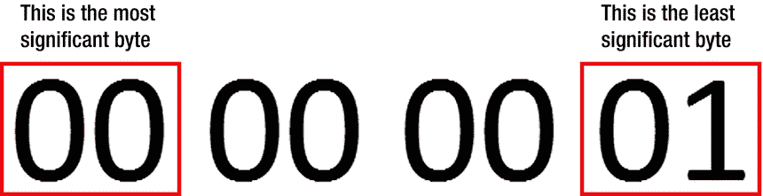
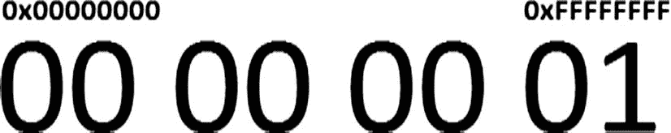
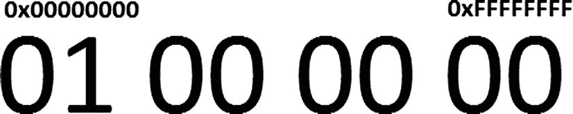

# 八、二进制数据

到目前为止，我们只研究了处理文本数据的应用。然而，为了节省空间和时间，应用通常必须处理二进制数据而不是文本。此外，一些应用数据，如图像和音频，本来就是二进制的。随着 web 应用越来越复杂，二进制数据的使用变得越来越普遍，甚至在浏览器中也是如此。因此，本章的重点转移到处理纯二进制数据的应用。它研究了什么是二进制数据，如何在 JavaScript 标准中处理二进制数据，以及 Node 特有的特性。

二进制数据概述

那么到底什么是二进制数据呢？如果你在想，“在计算机上，所有的数据都是二进制数据”，那你就对了。在最基本的层面上，计算机上的几乎所有数据都是以二进制形式存储的——由一系列 1 和 0 组成，代表二进制数和布尔逻辑值。然而，当术语“二进制数据”在编程语言的上下文中使用时，它指的是不包含附加抽象或结构的数据。例如，考虑清单 8-1 中显示的简单 JSON 对象。这个对象被认为是 JSON，因为它遵循特定的语法。为了使它成为有效的 JSON 对象，大括号、引号和冒号都是必需的。

***[清单 8-1](#_list1)*** 。一个简单的 JSON 对象

```js
{"foo": "bar"}
```

您也可以将该示例简单地视为一系列字符。在这种情况下，大括号突然失去了语义上的重要性。大括号只是字符串中的两个字符，而不是标记 JSON 对象的开始和结束。用任何其他字符替换它们都没有区别。最终，您得到了一个包含 14 个字符的字符串，恰好符合 JSON 语法。但是，这些数据仍然被解释为文本，而不是真正的二进制数据。

在处理文本时，数据是用字符来定义的。例如，清单 8-1 中的字符串长度为 14 个字符。在处理二进制数据时，我们称之为字节，或*八位字节*。要将字节解释为文本，必须使用某种类型的字符编码。根据编码类型的不同，字符到字节可能有也可能没有一对一的映射。

 **注**一个八位字节是一段 8 位的数据。术语*字节*也常用来描述 8 位数据。然而，从历史上看，字节并不总是 8 位的。本书假定了*字节*的常见 8 位定义，并与*八位字节*互换使用。

Node 支持许多字符编码，但通常默认为 UTF-8。UTF-8 是一种可变宽度编码，与 ASCII 向后兼容，但它也可以表示所有 Unicode 字符。由于 UTF-8 编码是可变宽度的，一些字符用一个字节表示，但许多字符不是。更具体地说，单个 UTF-8 字符可能需要 1 到 4 个字节。

[清单 8-2](#list2) 显示了来自[清单 8-1](#list1) 的字符串，表示为二进制数据。由于二进制数据由一(1)和零(0)的长字符串组成，因此通常使用十六进制表示法显示，其中每个数字代表 4 位。因此，每对十六进制数字代表一个八位字节。在本例中，每个文本字符都被 UTF-8 编码为一个字节。因此，[清单 8-2](#list2) 包含 14 个字节。通过检查每个字节的值，您可以开始看到字符映射的模式。例如，字节值`22`出现了四次——引号位于[清单 8-1](#list1) 中。与`"foo"`中的`"oo"`相对应的值`6f`也连续出现两次。

***[清单 8-2](#_list2)*** 。[清单 8-1](#list1) 中的字符串表示为以十六进制编写的二进制数据

```js
7b 22 66 6f 6f 22 3a 20 22 62 61 72 22 7d
```

在最后一个例子中，每个文本字符方便地映射到一个字节。然而，这可能并不总是发生。例如，考虑雪人 Unicode 字符(见[清单 8-3](#list3) )，虽然很少使用，但它在 JavaScript 中是完全有效的字符串数据。[清单 8-4](#list4) 显示了雪人的二进制表示。请注意，在 UTF-8 编码中，需要 3 个字节来表示这一个字符。

***[清单 8-3](#_list3)*** 。雪人 Unicode 字符


***[清单 8-4](#_list4)*** 。以二进制数据表示的雪人角色

```js
e2 98 83
```

字节序

处理二进制数据时有时会出现的另一个问题是字节序。字节序是指给定机器在内存中存储数据的方式，在存储多字节数据(如整数和浮点数)时发挥作用。两种最常见的字符顺序是*大端*和*小端*。大端机器首先存储数据项的最高有效字节。在这种情况下，“第一个”是指最低的内存地址。另一方面，小端机器将*最低*有效字节存储在最低内存地址中。为了说明大端存储和小端存储之间的区别，让我们来看看数字 1 在每种方案中是如何存储的。[图 8-1](#Fig1) 显示了编码为 32 位无符号整数的数字 1。为了方便起见，标记了最高有效字节和最低有效字节。由于数据长度为 32 位，因此需要 4 个字节来将数据存储在内存中。



[图 8-1](#_Fig1) 。数字 1，编码为 32 位无符号整数，以十六进制显示

[图 8-2](#Fig2) 显示了数据如何存储在大端机器上，而[图 8-3](#Fig3) 显示了以小端格式表示的相同数据。注意，包含`01`的字节从一种表示交换到另一种表示。标签`0x00000000`和`0xFFFFFFFF`表示存储空间的升序地址。



[图 8-2](#_Fig2) 。数字 1，因为它存储在大端机器的内存中

在研究了[图 8-2](#Fig2) 和[图 8-3](#Fig3) 之后，你就能明白为什么理解字符顺序很重要了。如果存储在一种字节序中的数字在另一种字节序中被解释，结果将是完全错误的。为了说明这一点，让我们回到数字 1 的例子。假设数据已经被写入使用小端存储的机器上的文件中。如果将文件移动到另一台机器上，并作为大端数据读取，会怎么样呢？事实证明，数字`00 00 00 01`会被解释为`01 00 00 00`。如果你算一下，结果是 2 <sup>24</sup> ，或者 16，777，216——相差将近 1700 万！



[图 8-3](#_Fig3) 。数字 1，因为它存储在小端机器的内存中

确定字节顺序

`os`核心模块提供了一个方法`endianness()`，顾名思义，用于确定当前机器的字节序。`endianness()`方法不带参数，返回一个表示机器字节顺序的字符串。如果机器使用大端存储，`endianness()`返回字符串`"BE"`。相反，如果使用 little-endian，则返回`"LE"`。清单 8-5 中的例子调用`endianness()`并将结果打印到控制台。

***[清单 8-5](#_list5)*** 。使用`os.endianness()`方法确定机器的字节顺序

```js
var os = require("os");

console.log(os.endianness());
```

类型化数组规范

在查看处理二进制数据的特定于 Node 的方式之前，让我们先看看 JavaScript 的标准二进制数据处理程序，称为*类型化数组规范*。这个名字来源于这样一个事实:与普通的 JavaScript 变量不同，二进制数据数组有一个特定的数据类型，它不会改变。因为类型化数组规范是 JavaScript 语言的一部分，所以本节中的内容适用于浏览器(如果支持的话)和 Node。大多数现代浏览器至少部分支持二进制数据，但哪些浏览器支持哪些特性是细节，不在本书讨论范围之内。

`ArrayBuffer`年代

JavaScript 的二进制数据 API 由两部分组成，一个缓冲区和一个视图。使用`ArrayBuffer`数据类型实现的缓冲区是一个保存字节数组的通用容器。因为`ArrayBuffer`是固定长度的结构，一旦创建，它们就不能调整大小。建议不要直接处理`ArrayBuffer`的内容。相反，创建一个视图来操作`ArrayBuffer`的内容(稍后将再次讨论视图的主题)。

通过调用`ArrayBuffer()`构造函数创建一个`ArrayBuffer`。构造函数接受一个参数，一个代表`ArrayBuffer`中字节数的整数。清单 8-6 中的例子创建了一个新的`ArrayBuffer`，它总共可以容纳 1024 个字节。

***[清单 8-6](#_list6)*** 。创建一个 1024 字节的`ArrayBuffer`

```js
var buffer = new ArrayBuffer(1024);
```

使用现有的`ArrayBuffer`与使用普通数组非常相似。使用数组下标符号读写单个字节。然而，由于不能调整`ArrayBuffer`的大小，写入不存在的索引不会改变底层数据结构。相反，写操作不会发生，会无声地失败。在[清单 8-7](#list7) 的例子中，显示了一个超过`ArrayBuffer`结尾的写尝试，一个空的 4 字节`ArrayBuffer`被初始化。接下来，向每个字节写入一个值，包括超过`ArrayBuffer`结尾的写入。最后，将`ArrayBuffer`打印到控制台。

***[清单 8-7](#_list7)*** 。将值写入`ArrayBuffer`并打印结果

```js
var foo = new ArrayBuffer(4);

foo[0] = 0;
foo[1] = 1;
foo[2] = 2;
foo[3] = 3;
// this assignment will fail silently
foo[4] = 4;
console.log(foo);
```

[清单 8-8](#list8) 显示了来自[清单 8-7](#list7) 的输出。请注意，虽然代码已经超出了缓冲区的末尾，但是写入的值并没有出现在输出中。失败的写入也没有生成任何异常。

***[清单 8-8](#_list8)*** 。运行清单 8-7 中[代码的结果](#list7)

```js
$ node array-buffer-write.js
{ '0': 0,
  '1': 1,
  '2': 2,
  '3': 3,
  slice: [Function: slice],
  byteLength: 4 }
```

在前面的输出中，您可能已经注意到了`byteLength`属性，它以字节表示`ArrayBuffer`的大小。该值在`ArrayBuffer`创建时分配，不能更改。像普通数组的`length`属性一样，`byteLength`对于循环`ArrayBuffer`的内容很有用。[清单 8-9](#list9) 显示了`byteLength`属性如何在`for`循环中显示`ArrayBuffer`的内容。

***[清单 8-9](#_list9)*** 。使用`byteLength`属性在`ArrayBuffer`上循环

```js
var foo = new ArrayBuffer(4);

foo[0] = 0;
foo[1] = 1;
foo[2] = 2;
foo[3] = 3;

for (var i = 0, len = foo.byteLength; i < len; i++) {
  console.log(foo[i]);
}
```

`slice()`

您可以使用`slice()`方法从现有文件中提取一个新的`ArrayBuffer`。`slice()`方法有两个参数，它们指定了要复制的范围的起始位置(包含)和结束位置(不包含)。结尾索引可以省略。如果未指定，切片跨度从起始索引到`ArrayBuffer`的结尾。这两个指数也可以是负数。负指数用于计算从`ArrayBuffer`末端而非开始的位置。[清单 8-10](#list10) 显示了几个从`ArrayBuffer`中截取相同的两个字节的例子。前两个示例使用显式的开始和结束索引，而第三个示例省略了结束索引。最后，第四个示例使用负起始索引创建一个切片。

***[清单 8-10](#_list10)*** 。使用`slice()`方法创建新的`ArrayBuffer`

```js
var foo = new ArrayBuffer(4);

foo[0] = 0;
foo[1] = 1;
foo[2] = 2;
foo[3] = 3;

console.log(foo.slice(2, 4));
console.log(foo.slice(2, foo.byteLength));
console.log(foo.slice(2));
console.log(foo.slice(-2));
// returns [2, 3]
```

需要注意的是，`slice()`返回的新的`ArrayBuffer`只是原始数据的副本。因此，如果`slice()`返回的缓冲区被修改，原始数据不会改变(见[清单 8-11](#list11) 中的例子)。

***[清单 8-11](#_list11)*** 。使用`slice()`方法创建新的`ArrayBuffer`

```js
var foo = new ArrayBuffer(4);
var bar;

foo[0] = 0;
foo[1] = 1;
foo[2] = 2;
foo[3] = 3;

// Create a copy of foo and modify it
bar = foo.slice(0);
bar[0] = 0xc;

console.log(foo);
console.log(bar);
```

在[清单 8-11](#list11) 中，一个名为`foo`的`ArrayBuffer`被创建并填充了数据。接下来，使用`slice()`将`foo`的全部内容复制到`bar`中。然后将十六进制值`0xc`(二进制 12)写入`bar`中的第一个位置。最后，`foo`和`bar`都打印到控制台。[清单 8-12](#list12) 显示了结果输出。注意，除了第一个字节，这两个`ArrayBuffer`是相同的。写入`bar`的值`0xc`没有传播到`foo`。

***[清单 8-12](#_list12)*** 。运行清单 8-11 中[代码的输出](#list11)

```js
$ node array-buffer-slice.js
{ '0': 0,
  '1': 1,
  '2': 2,
  '3': 3,
  slice: [Function: slice],
  byteLength: 4 }
{ '0': 12,
  '1': 1,
  '2': 2,
  '3': 3,
  slice: [Function: slice],
  byteLength: 4 }
```

`ArrayBuffer`观点

直接处理字节数组既乏味又容易出错。通过给一个`ArrayBuffer`增加一个抽象层，视图给人一种更传统的数据类型的错觉。例如，您可以使用一个视图将数据显示为两个 4 字节整数的数组，每个都是 32 位长，总共是 64 位或 8 个字节，而不是使用 8 字节的`ArrayBuffer`。[表 8-1](#Tab1) 列出了各种类型的视图以及每个数组元素的字节大小。因此，在我们的示例场景中，我们需要一个`Int32Array`或`Uint32Array`视图，这取决于我们的应用需要有符号还是无符号数字。

[表 8-1](#_Tab1) 。对 JavaScript 的各种数组缓冲视图的描述

| 

视图类型

 | 

元素大小(字节)

 | 

描述

 |
| --- | --- | --- |
| `Int8Array` | one | 8 位有符号整数数组。 |
| `Uint8Array` | one | 8 位无符号整数数组。 |
| `Uint8ClampedArray` | one | 8 位无符号整数数组。值被限制在 0–255 的范围内。 |
| `Int16Array` | Two | 16 位有符号整数数组。 |
| `Uint16Array` | Two | 16 位无符号整数数组。 |
| `Int32Array` | four | 32 位有符号整数数组。 |
| `Uint32Array` | four | 32 位无符号整数数组。 |
| `Float32Array` | four | 32 位 IEEE 浮点数数组。 |
| `Float64Array` | eight | 64 位 IEEE 浮点数的数组。 |

 **注意**虽然`Uint8Array`和`Uint8ClampedArray`非常相似，但是在 0-255 范围之外的值的处理方式上有一个关键的区别。`Uint8Array`在确定一个值时只查看最低有效的 8 位。因此，255、256 和 257 分别被解释为 255、0 和 1。另一方面，`Uint8ClampedArray`将任何大于 255 的值解释为 255，将任何小于 0 的值解释为 0。也就是说 255，256，257 都解释为 255。

清单 8-13 中的例子展示了视图在实践中是如何使用的。在这种情况下，由两个 32 位无符号整数组成的视图是基于一个 8 字节的`ArrayBuffer`创建的。接下来，将两个整数写入视图，并显示视图。

***[清单 8-13](#_list13)*** 。使用`Uint32Array`视图的示例

```js
var buf = new ArrayBuffer(8);
var view = new Uint32Array(buf);

view[0] = 100;
view[1] = 256;

console.log(view);
```

[清单 8-14](#list14) 显示了结果输出。它的前两行显示了写入视图的两个值，100 和 256。跟随数组值的是`BYTES_PER_ELEMENT`属性。这个只读属性包含在每种类型的视图中，表示每个数组元素中的原始字节数。跟在`BYTES_PER_ELEMENT`属性后面的是一个方法集合，我们将很快再次访问它。

***[清单 8-14](#_list14)*** 。运行[清单 8-13](#list13) 中的代码得到的输出

```js
$ node array-buffer-view.js
{ '0': 100,
  '1': 256,
  BYTES_PER_ELEMENT: 4,
  get: [Function: get],
  set: [Function: set],
  slice: [Function: slice],
  subarray: [Function: subarray],
  buffer:
   { '0': 100,
     '1': 0,
     '2': 0,
     '3': 0,
     '4': 0,
     '5': 1,
     '6': 0,
     '7': 0,
     slice: [Function: slice],
     byteLength: 8 },
  length: 2,
  byteOffset: 0,
  byteLength: 8 }
```

注意，底层的`ArrayBuffer`也显示为`buffer`属性。检查`ArrayBuffer`中每个字节的值，您将看到它与视图中存储的值的对应关系。在本例中，字节 0 至 3 对应于值 100，字节 4 至 7 表示值 256。

 **注意**提醒一下，256 相当于 2 <sup>8</sup> ，意思是不能用单个字节表示。单个无符号字节最多可以容纳 255。所以 256 的十六进制表示是`01 00`。

这带来了视图的另一个重要方面。与返回数据新副本的`ArrayBuffer slice()`方法不同，视图直接操作原始数据。因此修改视图的值会改变`ArrayBuffer`的内容，反之亦然。同样，拥有相同`ArrayBuffer`的两种观点可能会意外地(或有意地)改变彼此的价值观。在[清单 8-15](#list15) 中所示的例子中，一个 4 字节的`ArrayBuffer`由一个`Uint32Array`视图和一个`Uint8Array`视图共享，首先向`Uint32Array`写入 100，然后打印该值。然后`Uint8Array`将值 1 写入其第二个字节(实际上写入值 256)。然后再次打印来自`Uint32Array`的数据。

***[清单 8-15](#_list15)*** 。相互影响的视图

```js
var buf = new ArrayBuffer(4);
var view1 = new Uint32Array(buf);
var view2 = new Uint8Array(buf);

// write to view1 and print the value
view1[0] = 100;
console.log("Uint32 = " + view1[0]);

// write to view2 and print view1's value
view2[1] = 1;
console.log("Uint32 = " + view1[0]);
```

[清单 8-16](#list16) 显示了来自[清单 8-15](#list15) 的输出。正如所料，第一个 print 语句显示值 100。但是，到第二个 print 语句出现时，该值已经增加到 356。在示例中，这种行为是意料之中的。然而，在更复杂的应用中，当创建同一数据的多个视图时，您必须小心谨慎。

***[清单 8-16](#_list16)*** 。运行清单 8-15 中[代码的输出](#list15)

```js
$ node view-overwrite.js
Uint32 = 100
Uint32 = 356
```

关于视图大小的注释

视图的大小必须保证每个元素可以完全由`ArrayBuffer`中的数据组成。也就是说，视图只能从以字节为单位的长度是视图的`BYTES_PER_ELEMENT`属性的倍数的数据中构造。例如，一个 4 字节的`ArrayBuffer`可以用来构建一个保存单个整数的`Int32Array`视图。然而，同样的 4 字节缓冲区不能用于构建元素长度为 8 字节的`Float64Array`视图。

构造者信息

每种类型的视图都有四个构造函数。您已经看到的一种形式将一个`ArrayBuffer`作为它的第一个参数。这个构造函数也可以选择指定`ArrayBuffer`中的起始字节偏移量和视图的长度。字节偏移量默认为 0， ***必须*** 是`BYTES_PER_ELEMENT`的倍数，否则抛出`RangeError`异常。如果省略，长度将试图消耗整个`ArrayBuffer`，从字节偏移量开始。这些参数，如果指定的话，允许视图基于`ArrayBuffer`的一部分，而不是全部。如果`ArrayBuffer`的长度不是视图`BYTES_PER_ELEMENT`的整数倍，这就特别有用。

在[清单 8-17](#list17) 的例子中，展示了如何从一个大小不是`BYTES_PER_ELEMENT`的整数倍的缓冲区构建一个视图，一个`Int32Array`视图建立在一个 5 字节的`ArrayBuffer`上。字节偏移量 0 表示视图应该从`ArrayBuffer`的第一个字节开始。同时，length 参数指定视图应该包含一个整数。没有这些论点，就不可能从这个`ArrayBuffer`中构建出这个观点。另外，请注意，该示例包含对`buf[4]`处的字节的写操作。由于视图只使用前四个字节，因此写入第五个字节不会改变视图中的数据。

***[清单 8-17](#_list17)*** 。基于`ArrayBuffer`的一部分构建视图

```js
var buf = new ArrayBuffer(5);
var view = new Int32Array(buf, 0, 1);

view[0] = 256;
buf[4] = 5;
console.log(view[0]);
```

创建空视图

第二个构造函数用于创建一个预定义长度的空视图`n`。这种形式的构造函数还创建了一个新的足够大的`ArrayBuffer`来容纳`n`视图元素。例如，清单 8-18 中的代码创建了一个空的`Float32Array`视图，其中包含两个浮点数。在幕后，构造函数还创建了一个 8 字节的`ArrayBuffer`来保存浮动。在构建期间，`ArrayBuffer`中的所有字节都被初始化为 0。

***[清单 8-18](#_list18)*** 。创建一个空的`Float32Array`视图

```js
var view = new Float32Array(2);
```

从数据值创建视图

第三种形式的构造函数接受用于填充视图数据的值数组。数组中的值被转换为适当的数据类型，然后存储在视图中。构造函数还创建了一个新的`ArrayBuffer`来保存这些值。[清单 8-19](#list19) 显示了一个创建用值 1、2 和 3 填充的`Uint16Array`视图的例子。

***[清单 8-19](#_list19)*** 。从包含三个值的数组创建一个`Uint16Array`视图

```js
var view = new Uint16Array([1, 2, 3]);
```

从另一个视图创建视图

构造函数的第四个版本与第三个非常相似。唯一的区别是，这个版本接受另一个视图作为唯一的参数，而不是传入一个标准数组。新创建的视图还实例化了自己的后台`ArrayBuffer`——也就是说，底层数据是不共享的。清单 8-20 显示了这个版本的构造函数在实践中是如何使用的。在这个例子中，一个 4 字节的`ArrayBuffer`被用来创建一个包含四个数字的`Int8Array`视图。然后使用`Int8Array`视图创建一个新的`Uint32Array`视图。`Uint32Array`也包含四个数字，对应于`Int8Array`视图中的数据。然而，它的底层`ArrayBuffer`是 16 字节长，而不是 4 字节。当然，因为两个视图有不同的`ArrayBuffer` s，更新一个视图并不影响另一个。

***[清单 8-20](#_list20)*** 。从`Int8Array`视图创建`Uint32Array`视图

```js
var buf = new ArrayBuffer(4);
var view1 = new Int8Array(buf);
var view2 = new Uint32Array(view1);

console.log(buf.byteLength);  // 4
console.log(view1.byteLength);  // 4
console.log(view2.byteLength);  // 16
```

查看属性

您已经看到视图的`ArrayBuffer`可以通过`buffer`属性访问，并且`BYTES_PER_ELEMENT`属性表示每个视图元素的字节数。视图还有两个属性，`byteLength`和`length`，与数据大小有关，还有一个`byteOffset`属性，表示视图使用的缓冲区的第一个字节。

`byteLength`

`byteLength` 属性表示视图的数据大小，以字节为单位。这个值不一定等于底层`ArrayBuffer`的`byteLength`属性。在这个例子中，如[清单 8-21](#list21) 所示，一个`Int16Array`视图是从一个 10 字节的`ArrayBuffer`构建的。但是，因为`Int16Array`构造函数指定它只包含两个整数，所以它的`byteLength`属性是 4，而`ArrayBuffer`的`byteLength`是 10。

***[清单 8-21](#_list21)*** 。视图的不同`byteLength`及其`ArrayBuffer`

```js
var buf = new ArrayBuffer(10);
var view = new Int16Array(buf, 0, 2);

console.log(buf.byteLength);
console.log(view.byteLength);
```

`length`

`length`属性的工作方式类似于标准数组，它指示视图中数据元素的数量。这个属性对于视图数据的循环很有用，如清单 8-22 所示。

***[清单 8-22](#_list22)*** 。使用`length`属性遍历视图数据

```js
var view = new Int32Array([5, 10]);

for (var i = 0, len = view.length; i < len; i++) {
  console.log(view[i]);
}
```

`byteOffset`

属性指定了与视图使用的第一个字节相对应的`ArrayBuffer`的偏移量。该值始终为 0，除非将偏移量作为第二个参数传递给构造函数(参见[清单 8-17](#list17) )。`byteOffset`可以与`byteLength`属性结合使用，以遍历底层`ArrayBuffer`的字节。在[清单 8-23](#list23) 的例子中，展示了如何使用`byteOffset`和`byteLength`循环仅由视图使用的字节，源`ArrayBuffer`是 10 字节长，但是视图仅使用字节 4 到 7。

***[清单 8-23](#_list23)*** 。在`ArrayBuffer`中循环使用的字节子集

```js
var buf = new ArrayBuffer(10);
var view = new Int16Array(buf, 4, 2);
var len = view.byteOffset + view.byteLength;

view[0] = 100;
view[1] = 256;

for (var i = view.byteOffset; i < len; i++) {
  console.log(buf[i]);
}
```

`get()`

`get()`方法 用于检索视图中给定索引处的数据值。然而，正如您已经看到的，同样的任务可以使用数组索引符号来完成，这需要更少的字符。如果你出于某种原因选择使用`get()`，清单 8-24 显示了它的用法示例。

***[清单 8-24](#_list24)*** 。使用视图`get()`方法

```js
var view = new Uint8ClampedArray([5]);

console.log(view.get(0));
// could also use view[0]
```

`set()`

`set()` 用于给视图中的一个或多个值赋值。要分配单个值，将索引传递给 write，然后将要写入的值作为参数传递给`set()`(也可以使用数组索引符号来完成)。清单 8-25 中显示了一个将值 3.14 赋给第四个视图元素的例子。

***[清单 8-25](#_list25)*** 。使用`set()`分配单个值

```js
var view = new Float64Array(4);

view.set(3, 3.14);
// could also use view[3] = 3.14
```

为了分配多个值，`set()`还接受数组和视图作为它的第一个参数。可选地使用这种形式的`set()`来提供第二个参数，该参数指定开始写入值的偏移量。如果不包括这个偏移量，`set()`从第一个索引开始写值。在清单 8-26 的[中，`set()`被用来填充一个`Int32Array`的所有四个元素。](#list26)

***[清单 8-26](#_list26)*** 。使用`set()`分配多个值

```js
var view = new Int32Array(4);

view.set([1, 2, 3, 4], 0);
```

关于这个版本的`set()`，有两件重要的事情需要了解。首先，如果您试图写入视图的末尾，就会抛出一个异常。在[清单 8-26](#list26) 的例子中，如果第二个参数大于 0，就会超出四元素边界，导致错误。其次，注意因为`set()`接受一个视图作为它的第一个参数，参数的`ArrayBuffer`可能与调用对象共享。如果源和目标相同，Node 必须智能地复制数据，以便字节在有机会被复制之前不会被覆盖。[清单 8-27](#list27) 是两个`Int8Array`视图具有相同`ArrayBuffer`的一个例子。第二个视图`view2`也较小，表示较大视图`view1`的前半部分。当调用`set()`时，0 被分配给`view1[1]`，1 被分配给`view1[2]`。由于`view1[1]`是源的一部分(在这个操作中也是目的地的一部分)，您需要确保原始值在被覆盖之前被复制。

***[清单 8-27](#_list27)*** 。显示单个`ArrayBuffer`在`set()`中的共享位置

```js
var buf = new ArrayBuffer(4);
var view1 = new Int8Array(buf);
var view2 = new Int8Array(buf, 0, 2);

view1[0] = 0;
view1[1] = 1;
view1[2] = 2;
view1[3] = 3;
view1.set(view2, 1);
console.log(view1.buffer);
```

根据规范，“设置这些值时，就好像首先将所有数据复制到一个不与任何数组重叠的临时缓冲区中，然后将临时缓冲区中的数据复制到当前数组中。”本质上，这意味着 Node 会为您处理一切。为了验证这一点，前面例子的结果输出显示在[清单 8-28](#list28) 中。请注意，字节 1 和 2 包含正确的值 0 和 1。

***[清单 8-28](#_list28)*** 。运行清单 8-27 中[代码的输出](#list27)

```js
$ node view-set-overlap.js
{ '0': 0,
  '1': 0,
  '2': 1,
  '3': 3,
  slice: [Function: slice],
  byteLength: 4 }
```

`subarray()`

`subarray()` 返回依赖于同一`ArrayBuffer`的数据类型的新视图，它有两个参数。第一个参数指定新视图中引用的第一个索引。第二个是可选的，表示新视图中引用的最后一个索引。如果省略结束索引，新视图的范围将从起始索引到原始视图的结尾。任何一个索引都可以是负数，这意味着偏移量是从数据数组的末尾开始计算的。请注意，`subarray()`返回的新视图与原始视图具有相同的`ArrayBuffer`。清单 8-29 展示了如何使用`subarray()`创建几个相同的`Uint8ClampedArray`视图，组成另一个视图的子集。

***[清单 8-29](#_list29)*** 。使用`subarray()`从现有视图创建新视图

```js
var view1 = new Uint8ClampedArray([1, 2, 3, 4, 5]);
var view2 = view1.subarray(3, view1.length);
var view3 = view1.subarray(3);
var view4 = view1.subarray(-2);
```

Node`Buffer`sT2】

Node 提供了自己的`Buffer`数据类型来处理二进制数据。这是在 Node 中处理二进制数据的首选方法，因为它比类型化数组稍有效率。到目前为止，您已经遇到了许多处理`Buffer`对象的方法——例如，`fs`模块的`read()`和`write()`方法。这一节详细探讨了`Buffer`的工作原理，包括它们与类型化数组规范的兼容性。

`Buffer`建造师

`Buffer`使用三个`Buffer()`构造函数中的一个来创建对象。`Buffer`构造函数是全局的，这意味着它不需要任何模块就可以被调用。一旦`Buffer`被创建，它就不能被调整大小。第一种形式的`Buffer()`构造函数创建一个给定字节数的空`Buffer`。清单 8-30 中的例子创建了一个空的 4 字节`Buffer`，也展示了`Buffer`中的单个字节可以使用数组下标符号来访问。

***[清单 8-30](#_list30)*** 。创建一个 4 字节的缓冲区并访问各个字节

```js
var buf = new Buffer(4);

buf[0] = 0;
buf[1] = 1;

console.log(buf);
```

[清单 8-31](#list31) 显示了`Buffer`的字符串版本。`Buffer`中的前两个字节保存值`00`和`01`，它们分别在代码中分配。请注意，最后两个字节也有值，尽管它们从未被赋值。这些实际上是程序运行时已经在内存中的值(如果您运行这段代码，您看到的值可能会有所不同)，表明`Buffer()`构造函数没有将其保留的内存初始化为 0。这样做是有意的——在请求大量内存时节省时间(回想一下`ArrayBuffer`构造函数将其缓冲区初始化为 0)。由于 web 浏览器中经常使用，不初始化内存可能会有安全隐患——您可能不希望任意网站读取您计算机内存中的内容。由于`Buffer`类型是特定于 Node 的，所以它不存在同样的安全风险。

***[清单 8-31](#_list31)*** 。运行清单 8-30 中[代码的输出结果](#list30)

```js
$ node buffer-constructor-1.js
<Buffer 00 01 05 02>
```

第二种形式的`Buffer()`构造函数接受一个字节数组作为它唯一的参数。产生的`Buffer`用数组中存储的值填充。在[清单 8-32](#list32) 中显示了这种形式的构造函数的一个例子。

***[清单 8-32](#_list32)*** 。从八位字节数组创建一个`Buffer`

```js
var buf = new Buffer([1, 2, 3, 4]);
```

构造函数的最终版本用于从字符串数据创建一个`Buffer`。清单 8-33 中的代码展示了如何从字符串`"foo"`创建一个`Buffer`。

***[清单 8-33](#_list33)*** 。从字符串创建一个`Buffer`

```js
var buf = new Buffer("foo");
```

在本章的前面，您已经了解到为了将二进制数据转换为文本，必须指定字符编码。当一个字符串作为第一个参数传递给`Buffer()`时，第二个可选参数可以用来指定编码类型。在清单 8-33 中，没有明确设置编码，所以默认使用 UTF-8。[表 8-2](#Tab2) 分解了 Node 支持的各种字符编码。(敏锐的读者可能会从第 5 章的[中认出这个表格。然而，值得在书中重复这一点的信息。)](05.html)

[表 8-2](#_Tab2) 。Node 支持的各种字符串编码类型

| 

编码类型

 | 

描述

 |
| --- | --- |
| `utf8` | 多字节编码的 Unicode 字符。许多网页使用 UTF-8 编码来表示 Node 中的字符串数据。 |
| `ascii` | 7 位美国信息交换标准码(ASCII)编码。 |
| `utf16le` | 小端编码的 Unicode 字符。每个字符是 2 或 4 个字节。 |
| `ucs2` | 这只是`utf16le`编码的别名。 |
| `base64` | Base64 字符串编码。Base64 通常用于 URL 编码、电子邮件和类似的应用。 |
| `binary` | 允许仅使用每个字符的前 8 位将二进制数据编码为字符串。由于不赞成使用此选项，而支持使用`Buffer`对象，因此在 Node 的未来版本中将会删除它。 |
| `hex` | 将每个字节编码为两个十六进制字符。 |

字符串化方法

s 可以通过两种方式进行字符串化。第一个使用了`toString()`方法，它试图将`Buffer`的内容解释为字符串数据。`toString()`方法接受三个参数，都是可选的。它们指定了字符编码和从`Buffer`到 stringify 的开始和结束索引。如果未指定，整个`Buffer`将使用 UTF-8 编码进行字符串化。清单 8-34 中的例子使用`toString()`给出了一个完整的`Buffer`。

***[清单 8-34](#_list34)*** 。使用`Buffer.toString()`方法

```js
var buf = new Buffer("foo");

console.log(buf.toString());
```

第二个字符串化方法`toJSON()`将`Buffer`数据作为 JSON 字节数组返回。通过在`Buffer`对象上调用`JSON.stringify()`可以得到类似的结果。清单 8-35 显示了一个`toJSON()`方法的例子。

***[清单 8-35](#_list35)*** 。使用`Buffer.toJSON()`方法

```js
var buf = new Buffer("foo");

console.log(buf.toJSON());
console.log(JSON.stringify(buf));
```

`Buffer.isEncoding()`

`isEncoding()`方法清单 8-36 显示了`isEncoding()`的两个例子。第一个测试字符串`"utf8"`并显示`true`。然而，第二个会打印出`false`，因为`"foo"`不是有效的字符编码。

***[清单 8-36](#_list36)*** 。`Buffer.isEncoding()`类方法的两个例子

```js
console.log(Buffer.isEncoding("utf8"));
console.log(Buffer.isEncoding("foo"));
```

`Buffer.isBuffer()`

类方法`isBuffer()` 用于判断一条数据是否为`Buffer`对象。它的使用方式与`Array.isArray()`法相同。清单 8-37 显示了一个`isBuffer()`的使用示例。这个例子打印了`true`，因为`buf`变量实际上是一个`Buffer`。

***[清单 8-37](#_list37)*** 。`Buffer.isBuffer()`类方法

```js
var buf = new Buffer(1);

console.log(Buffer.isBuffer(buf));
```

`Buffer.byteLength()`和`length`

`byteLength()`类方法 用于计算给定字符串中的字节数。此方法还接受可选的第二个参数来指定字符串的编码类型。这个方法对于计算字节长度很有用，不需要实例化一个`Buffer`实例。但是，如果您已经构建了一个`Buffer`，那么它的`length`属性也有同样的作用。在[清单 8-38](#list38) 的例子中，显示了`byteLength()`和`length`，`byteLength()`用于计算 UTF-8 编码的字符串`"foo"`的字节长度。接下来，从同一个字符串中构造一个实际的`Buffer`。然后使用`Buffer`的`length`属性检查字节长度。

***[清单 8-38](#_list38)*** 。`Buffer.byteLength()`和`length`属性

```js
var byteLength = Buffer.byteLength("foo");
var length = (new Buffer("foo")).length;

console.log(byteLength);
console.log(length);
```

`fill()`T2】

向`Buffer`写入数据有多种方式。合适的方法取决于几个因素，包括数据类型及其字节顺序。最简单的方法是`fill()`，它将相同的值写入全部或部分`Buffer`，它有三个参数——要写入的值、开始填充的可选偏移量和停止填充的可选偏移量。与其他写入方法一样，起始偏移默认为 0，结束偏移默认为`Buffer`的结束。由于默认情况下`Buffer`没有设置为零，`fill()`对于将`Buffer`初始化为一个值是有用的。清单 8-39 中的例子显示了如何将`Buffer`中的所有内存清零。

***[清单 8-39](#_list39)*** 。使用`fill()`将`Buffer`中的内存清零

```js
var buf = new Buffer(1024);

buf.fill(0);
```

`write()`

要将一个字符串写入一个`Buffer`，使用`write()`方法 。它接受以下四个参数。

*   要写入的字符串。
*   开始写入的偏移量。这是可选的，默认为索引 0。
*   要写入的字节数。如果未指定，则写入整个字符串。但是，如果`Buffer`缺少容纳整个字符串的空间，它就会被截断。
*   字符串的字符编码。如果省略，则默认为 UTF-8。

清单 8-40 中的例子用字符串`"foo"`的三个副本填充一个 9 字节的`Buffer`。由于第一次写入在`Buffer`的开始处开始，因此不需要偏移。但是，第二次和第三次写入需要一个偏移值。在第三个示例中，包含了字符串长度，尽管这不是必需的。

***[清单 8-40](#_list40)*** 。使用`write()`对同一个`Buffer`进行多次写入

```js
var buf = new Buffer(9);
var data = "foo";

buf.write(data);
buf.write(data, 3);
buf.write(data, 6, data.length);
```

写入数字数据

有一组方法用于将数字数据 写入`Buffer`，每种方法都用于写入特定类型的数字。这类似于各种类型化的数组视图，每个视图存储不同类型的数据。[表 8-3](#Tab3) 列出了用于书写数字的方法。

[表 8-3](#_Tab3) 。用于将数字数据写入缓冲区的方法集合

| 

方法名称

 | 

描述

 |
| --- | --- |
| `writeUInt8()` | 写入一个无符号 8 位整数。 |
| `writeInt8()` | 写入一个有符号的 8 位整数。 |
| `writeUInt16LE()` | 使用 little-endian 格式写入一个无符号 16 位整数。 |
| `writeUInt16BE()` | 使用 big-endian 格式写入一个无符号的 16 位整数。 |
| `writeInt16LE()` | 使用 little-endian 格式写入有符号的 16 位整数。 |
| `writeInt16BE()` | 使用 big-endian 格式写入有符号的 16 位整数。 |
| `writeUInt32LE()` | 使用 little-endian 格式写入一个无符号 32 位整数。 |
| `writeUInt32BE()` | 使用 big-endian 格式写入一个无符号 32 位整数。 |
| `writeInt32LE()` | 使用 little-endian 格式写入有符号的 32 位整数。 |
| `writeInt32BE()` | 使用 big-endian 格式写入有符号的 32 位整数。 |
| `writeFloatLE()` | 使用 little-endian 格式写入一个 32 位浮点数。 |
| `writeFloatBE()` | 使用 big-endian 格式写入 32 位浮点数。 |
| `writeDoubleLE()` | 使用 little-endian 格式写入 64 位浮点数。 |
| `writeDoubleBE()` | 使用 big-endian 格式写入 64 位浮点数。 |

表 8-3 中的所有方法都有三个参数——要写入的数据,`Buffer`中写入数据的偏移量，以及一个关闭验证检查的可选标志。如果验证标志被设置为`false`(默认)，如果值太大或者数据溢出`Buffer`，则抛出异常。如果该标志被设置为`true`，大值将被截断，溢出写操作会自动失败。在使用[清单 8-41](#list41) 中的`writeDoubleLE()`的例子中，值 3.14 被写入缓冲区的前 8 个字节，没有验证检查。

***[清单 8-41](#_list41)*** 。使用`writeDoubleLE()`

```js
var buf = new Buffer(16);

buf.writeDoubleLE(3.14, 0, true);
```

读取数字数据

从`Buffer`中读取数值数据 ，和写一样，也需要一组方法。[表 8-4](#Tab4) 列出了用于读取数据的各种方法。注意与[表 8-3](#Tab3) 中的写入方法一一对应。

[表 8-4](#_Tab4) 。用于从缓冲区读取数字数据的方法集合

| 

方法名称

 | 

描述

 |
| --- | --- |
| `readUInt8()` | 读取一个无符号 8 位整数。 |
| `readInt8()` | 读取一个带符号的 8 位整数。 |
| `readUInt16LE()` | 使用 little-endian 格式读取无符号 16 位整数。 |
| `readUInt16BE()` | 使用 big-endian 格式读取无符号 16 位整数。 |
| `readInt16LE()` | 使用 little-endian 格式读取有符号的 16 位整数。 |
| `readInt16BE()` | 使用 big-endian 格式读取有符号的 16 位整数。 |
| `readUInt32LE()` | 使用 little-endian 格式读取一个无符号 32 位整数。 |
| `readUInt32BE()` | 使用 big-endian 格式读取一个无符号 32 位整数。 |
| `readInt32LE()` | 使用 little-endian 格式读取有符号的 32 位整数。 |
| `readInt32BE()` | 使用 big-endian 格式读取有符号的 32 位整数。 |
| `readFloatLE()` | 使用 little-endian 格式读取 32 位浮点数。 |
| `readFloatBE()` | 使用 big-endian 格式读取 32 位浮点数。 |
| `readDoubleLE()` | 使用 little-endian 格式读取 64 位浮点数。 |
| `readDoubleBE()` | 使用 big-endian 格式读取 64 位浮点数。 |

所有数字读取方法都有两个参数。第一个是从`Buffer`中读取数据的偏移量。可选的第二个参数用于禁用验证检查。如果是`false`(默认值)，当偏移量超过`Buffer`大小时抛出异常。如果标志为`true`，则不进行验证，返回的数据可能无效。[清单 8-42](#list42) 展示了一个 64 位浮点数如何被写入一个缓冲区，然后使用`readDoubleLE()`读回。

***[清单 8-42](#_list42)*** 。写入和读取数字数据

```js
var buf = new Buffer(8);
var value;

buf.writeDoubleLE(3.14, 0);
value = buf.readDoubleLE(0);
```

`slice()`

`slice()`方法 返回一个新的`Buffer`，它与原来的`Buffer`共享内存。换句话说，对新的`Buffer`的更新会影响原来的，反之亦然。`slice()`方法有两个可选参数，代表切片的开始和结束索引。索引也可以是负的，这意味着它们相对于`Buffer`的结束。[清单 8-43](#list43) 显示了如何使用`slice()`提取一个 4 字节`Buffer`的前半部分。

***[清单 8-43](#_list43)*** 。使用`slice()`创建一个新的`Buffer`

```js
var buf1 = new Buffer(4);
var buf2 = buf1.slice(0, 2);
```

`copy()`

`copy()`方法 用于将数据从一个`Buffer`复制到另一个`Buffer`。`copy()`的第一个参数是目的地`Buffer`。第二个(如果存在)表示要复制的目标中的起始索引。第三和第四个参数，如果存在的话，是要复制的源`Buffer`中的开始和结束索引。将一个`Buffer`的全部内容复制到另一个[的例子如清单 8-44](#list44) 所示。

***[清单 8-44](#_list44)*** 。使用`copy()`将一个`Buffer`的内容复制到另一个

```js
var buf1 = new Buffer([1, 2, 3, 4]);
var buf2 = new Buffer(4);

buf1.copy(buf2, 0, 0, buf1.length);
```

`Buffer.concat()`

`concat()` 类方法允许将多个`Buffer`连接成一个更大的`Buffer`。`concat()`的第一个参数是要连接的`Buffer`对象的数组。如果没有提供`Buffer`，则`concat()`返回零长度`Buffer`。如果提供了单个`Buffer`，则返回对该`Buffer`的引用。如果提供了多个`Buffer`，则创建一个新的`Buffer`。[清单 8-45](#list45) 提供了一个连接两个`Buffer`对象的例子。

***[清单 8-45](#_list45)*** 。连接两个`Buffer`对象

```js
var buf1 = new Buffer([1, 2]);
var buf2 = new Buffer([3, 4]);
var buf = Buffer.concat([buf1, buf2]);

console.log(buf);
```

类型化数组兼容性

与类型化数组视图兼容。当从一个`Buffer`构建一个视图时，`Buffer`的内容被克隆到一个新的`ArrayBuffer`中。克隆的`ArrayBuffer`不与原`Buffer`共享内存。在[清单 8-46](#list46) 的例子中，它从一个缓冲区创建一个视图，一个 4 字节的`Buffer`被克隆到一个 16 字节的`ArrayBuffer`中，后者支持一个`Uint32Array`视图。注意，在创建视图之前，`Buffer`被初始化为全 0。如果不这样做，视图将包含任意数据。

***[清单 8-46](#_list46)*** 。从`Buffer`创建视图

```js
var buf = new Buffer(4);
var view;

buf.fill(0);
view = new Uint32Array(buf);
console.log(buf);
console.log(view);
```

同样值得指出的是，虽然视图可以从一个`Buffer`构造，但是`ArrayBuffer` s 不能。一艘`Buffer`也不能由一艘`ArrayBuffer`建造。可以从视图中构造一个`Buffer`*，但是在这样做的时候要小心，因为视图很可能包含不能很好传输的数据。在说明这一点的[清单 8-47](#list47) 中的简单示例中，当从`Uint32Array`视图移动到`Buffer`视图时，整数 257 变成字节值 1。*

 ****[清单 8-47](#_list47)*** 。从视图构建`Buffer`时数据丢失

```js
var view = new Uint32Array([257]);
var buf = new Buffer(view);

console.log(buf);
```

摘要

这一章涵盖了许多材料。从二进制数据的概述开始，您接触到了包括高级字符编码和字符顺序的主题。从那以后，本章进入了类型化数组规范。希望你觉得这份材料有用。毕竟，它是 JavaScript 语言的一部分，可以在浏览器和 Node 中使用。在介绍了`ArrayBuffer`和视图之后，本章继续介绍 Node 的`Buffer`数据类型，最后，介绍了`Buffer`类型如何处理类型化数组。*