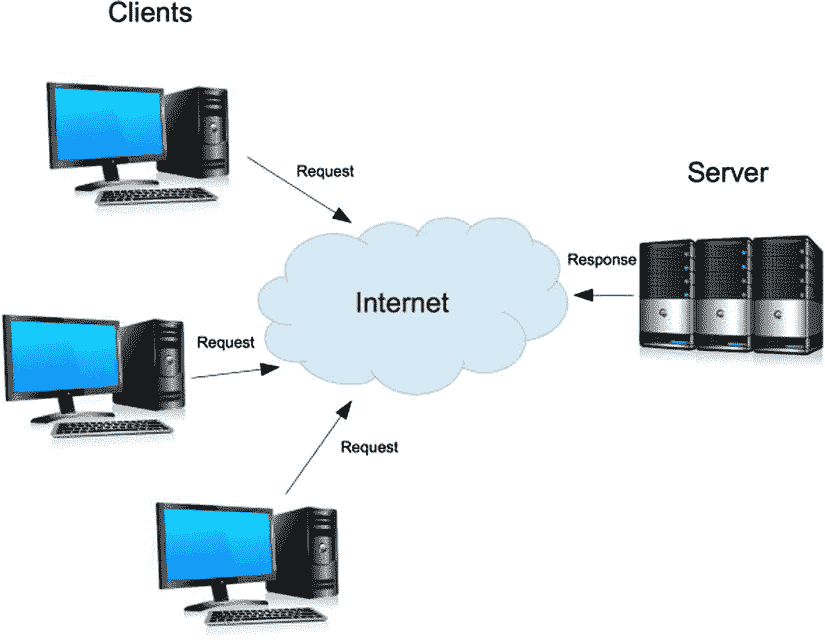

第十章


网络编程

到目前为止，本书中提供的示例代码都集中在您的本地机器上。无论是访问文件系统、解析命令行参数还是执行不受信任的代码，所有示例都被隔离到一台计算机上。本章开始探索本地主机之外的世界。它涵盖了网络编程并介绍了许多重要的主题，包括套接字、客户机-服务器编程、传输控制协议(TCP)、用户数据报协议(UDP)和域名服务(DNS)。对所有这些概念的完整解释超出了本书的范围，但是对它们的基本理解是至关重要的，因为它们是接下来几章中涉及的 web 应用的基础。

`Sockets`

当两个应用通过网络进行通信时，它们使用套接字进行通信。套接字是互联网协议(IP)地址和端口号的组合。IP 地址用于唯一标识网络上的设备，网络可以是小型家庭网络或整个互联网。该设备可以是 PC、平板电脑、智能手机、打印机或任何其他支持互联网的设备。IP 地址是 32 位数字，格式为由点分隔的四个 8 位数字。IP 地址的例子有`184.168.230.128`和`74.125.226.193`。这些对应于`www.cjihrig.com`和`www.google.com`的网络服务器。

 **注意**这里描述的 IP 地址被称为 IPv4 地址，最常见的一种。这些地址基于互联网协议版本 4。由于互联网的发展，预计 IPv4 地址的数量将会耗尽。为了缓解这个问题，互联网协议版本 6 (IPv6)被开发出来。IPv6 地址的长度为 128 位，这意味着可以代表更多的地址。IPv6 地址字符串也更长，包括十六进制值，用冒号而不是点作为分隔符。

套接字的端口组件是一个 16 位数字，用于唯一标识计算机上的通信端点。端口允许一台计算机同时维护许多套接字连接。为了更好地理解端口的概念，想象自己给在大型公司办公楼工作的人打电话。当你打电话时，你需要知道办公室的电话号码。在这个类比中，办公室是一台远程计算机，它的电话号码就是它的 IP 地址。公司办公室提供联系个人的分机。电话分机类似于端口号，您试图联系的一方代表远程机器上的一个进程或线程。进入对方分机并接通后，您就可以继续通话了。类似地，一旦两个套接字建立了通信通道，它们就可以开始来回发送数据。

前面提到过，IP 地址`74.125.226.193`对应于位于`www.google.com`的 web 服务器。要验证这一点，在你浏览器的地址栏中输入`http://74.125.226.193`。显然这个请求包含了服务器的 IP 地址，但是端口号在哪里呢？事实证明，谷歌的网络服务器接受 80 端口的连接。URL 语法允许您通过在主机后包含冒号和端口号来明确标识要连接的端口。要验证这一点，请尝试在您的浏览器中连接到`http://74.125.226.193:80`(或`www.google.com:80`)。你应该再次看到谷歌主页。现在尝试连接到`http://74.125.226.193:81` ( `www.google.com:81`)。突然，页面再也找不到了。当`www.google.com`被输入地址栏时，浏览器如何知道要连接到 80 端口？为了回答这个问题，让我们回到我们的电话类比。在美国，你如何知道在紧急情况下打 911 而不是 912？答案是:因为这个国家的每个孩子都被教导在紧急情况下拨打 911。这是社会公认的惯例。

在互联网上，公共服务遵循类似的惯例。从 0 到 1023 的端口号称为*知名端口*，或*保留端口*。例如，端口 80 保留用于服务 HTTP 流量。因此，当您导航到以`http://`开头的 URL 时，您的浏览器会假定端口号为 80，除非您明确声明不是这样。这就是为什么 Google 的 web 服务器在端口 80 上响应了我们的请求，而不是 81。可以用 HTTPS(安全 HTTP)协议进行类似的实验。端口 443 是为 HTTPS 流量保留的。如果您在浏览器的地址栏中输入 URL `http://74.125.226.193:443`，将会遇到错误。然而，如果你将网址改为`https://74.125.226.193:443`，你将通过安全连接登陆谷歌主页。请注意，在导航过程中，您可能会遇到浏览器警告。在这种情况下，可以安全地忽略此警告。

如果您计划实现一个公共服务，比如一个 web 服务器，使用它众所周知的端口号是明智的。但是，没有什么可以阻止您在非标准端口上运行 web 服务器。例如，您可以在端口 8080 上运行 web 服务器，只要每个试图连接到服务器的人都在 URL 中明确指定端口 8080。同样，如果您正在创建自定义应用，请避免使用通常用于其他目的的端口。在为您的应用选择一个端口之前，您可能希望在 Internet 上快速搜索可能与之冲突的其他常见服务。此外，避免使用保留的端口号之一。

客户端-服务器编程

客户机-服务器模型 是一种范例，其中计算任务在服务器(提供资源的机器)和客户机(请求并消耗这些资源的机器)之间进行划分。Web 是客户机-服务器模型的一个很好的例子。当您打开浏览器窗口并导航到网站时，您的计算机充当客户端。您的计算机请求和使用的资源是网页。该网页由服务器提供，您的计算机使用套接字通过互联网连接到该服务器。这个模型的高层次抽象如图[图 10-1](#Fig1) 所示。



[图 10-1](#_Fig1) 。在互联网上工作的客户机-服务器模型

 **提示【Tip 地址`127.0.0.1`用来标识本地机器，称为`localhost`。通过让客户机连接到运行在`localhost`上的服务器，许多客户机-服务器应用可以在一台机器上进行测试。**

 **注**上一节讨论了知名港口。在客户机-服务器模型中，这个概念通常只适用于服务器应用。由于客户端发起到服务器的连接，因此客户端必须知道要连接到哪个端口。另一方面，服务器不需要担心连接的客户端使用的端口。

传输控制协议

传输控制协议，简称 TCP ，是一种用于在互联网上传输数据的通信协议 。互联网数据传输不可靠。当你的计算机将一条信息发送到网络上时，这条信息首先被分解成称为信息包的小块，然后被发送到网络上，并开始向目的地前进。因为您的计算机与世界上的其他计算机没有直接连接，所以每个数据包都必须经过许多中间机器，直到找到到达目的地的路由。每个数据包都有可能采用唯一的路径到达目的地，这意味着数据包到达的顺序可能不同于它们被发送的顺序。此外，互联网不可靠，个别数据包可能会在途中丢失或损坏。

TCP 有助于给混乱的互联网带来可靠性。TCP 是所谓的*面向连接的协议* ，这个术语指的是机器之间建立的虚拟连接。两台机器通过以一种被称为握手的定义模式来回发送小块数据来进入 TCP 连接。在多步握手结束时，两台机器已经建立了连接。使用这种连接，TCP 强制执行数据包之间的排序，并确认数据包在目的地被成功接收。此外，TCP 提供的功能还包括错误检查和丢失数据包的重新传输。

在Node生态系统中，使用 TCP 的网络编程是使用`net`核心模块实现的。清单 10-1 展示了如何将`net`模块导入到一个Node应用中。本模块包括创建客户端和服务器应用的方法。本节的剩余部分将探索由`net`提供的使用 TCP 的各种方法。

***[清单 10-1](#_list1)*** 。将`Net`模块导入应用

```js
var net = require("net");
```

`Creating a TCP Server`

使用`createServer()`方法可以很容易地创建 TCP 服务器(参见[清单 10-2](#list2) )。该方法有两个可选参数。第一个是包含配置选项的对象。`createServer()`支持单个选项`allowHalfOpen`，默认为`false`。如果该选项被明确设置为`true`，服务器将保持客户端连接打开，即使客户端终止它们。在这种情况下，套接字变得不可读，但仍可由服务器写入。此外，如果`allowHalfOpen`为`true`，则无论客户端做什么，都必须在服务器端显式关闭连接。这个问题将在后面讲述`end()`方法时详细解释。

***[清单 10-2](#_list2)*** 。使用`net.createServer()` 创建 TCP 服务器

```js
var net = require("net");
var server = net.createServer({
  allowHalfOpen: false
}, function(socket) {
  // handle connection
});
```

清单 10-2 中`createServer()`的第二个参数是一个事件处理器，用于处理来自客户端的连接。事件处理程序接受一个参数，一个代表客户端套接字连接的`net.Socket`对象。在这一章的后面还会更详细地讨论`net.Socket`类。最后，`createServer()`将新创建的 TCP 服务器作为一个`net.Server`实例返回。`net.Server`类继承自`EventEmitter`并发出与套接字相关的事件。

监听连接

客户端无法访问由`createServer()`返回的服务器，因为它没有与特定端口相关联。要使服务器可访问，它必须在端口上侦听传入的客户端连接。`listen()`方法，其使用如[清单 10-3](#list3) 所示，用于将服务器绑定到指定端口。`listen()`唯一需要的参数是要绑定到的端口号。要监听随机选择的端口，请将 0 作为`port`参数传递。(请注意，通常应该避免这样做，因为客户端不知道要连接到哪个端口。)

***[清单 10-3](#_list3)*** 。使用`net.Server.listen()`方法

```js
server.listen(port, [host], [backlog], [callback])
```

如果省略了`host`参数，服务器将接受指向任何有效 IPv4 地址的连接。要限制服务器接受的连接，请指定服务器将作为其响应的主机。此功能在具有多个网络接口的服务器上非常有用，因为它允许应用的作用范围局限于一个单独的网络。如果您的机器只有一个 IP 地址，您可以尝试这个特性。例如，清单 10-4 中的[代码只接受指向`localhost` ( `127.0.0.1`)的连接。这允许您为您的应用创建一个 web 接口，同时不会将它暴露给远程的、潜在的恶意连接。](#list4)

***[清单 10-4](#_list4)*** 。仅接受端口 8000 上的`localhost`连接的代码

```js
var net = require("net");
var server = net.createServer(function(socket) {
  // handle connection
});

server.listen(8000, "127.0.0.1");
```

服务器的 backlog 是已经连接到服务器但尚未处理的客户端连接的队列。一旦积压满了，任何新的传入连接到该端口被删除。`backlog`参数用于指定该队列的最大长度。该值默认为 511。

`listen()`的最后一个参数是一个响应`listening`事件的事件处理程序。当服务器成功绑定到一个端口并监听连接时，它会发出一个`listening`事件。`listening`事件不为它的处理函数提供参数，但是它对于调试和日志记录非常有用。例如，清单 10-5 中的代码试图监听一个随机端口。包含了一个`listening`事件处理程序，显示随机选择的端口。

***[清单 10-5](#_list5)*** 。带有`listening`事件处理程序的服务器

```js
var net = require("net");
var server = net.createServer(function(socket) {
  // handle connection
});

server.listen(0, function() {
  var address = server.address();

  console.log("Listening on port " + address.port);
});
```

 **注意**`listen()`的事件处理程序是为了方便而提供的。也可以使用`on()`方法添加`listening`事件处理程序。

`address()`

在[清单 10-5](#list5) 中，服务器的`address()`方法 用于显示随机选择的端口。`address()`方法返回一个包含服务器绑定地址、地址族和端口的对象。如前所述，`port`属性表示绑定端口。如果未指定`host`，则绑定地址从`host`参数到`listen()`或`"0.0.0.0"`获取其值。地址族代表地址的类型(IPv4、IPv6 等。).注意，由于`address()`返回的值依赖于传递给`listen()`的参数，所以在发出`listening`事件之前，不应该调用这个方法。在[清单 10-6](#list6) 的例子中，展示了`address()`的另一种用法，使用了一个随机端口和地址`::1`(IPv6 中的`localhost`)。结果输出如清单 10-7 中的[所示。当然，因为是随机的，你的端口号很可能是不一样的。](#list7)

***[清单 10-6](#_list6)*** 。使用`net.Server.address()`

```js
var net = require("net");
var server = net.createServer(function(socket) {
  // handle connection
});

server.listen(0, "::1", function() {
  var address = server.address();

  console.log(address);
});
```

***[清单 10-7](#_list7)*** 。清单 10-6 中的代码产生的输出

```js
$ node server-address.js
{ address: '::1', family: 'IPv6', port: 64269 }
```

**听歌的变奏()**

`listen()`方法有两个不常用的签名。第一种变化允许服务器监听已经绑定的现有服务器/套接字。新的服务器开始接受本来会被定向到现有服务器/套接字的连接。创建两个服务器`server1`和`server2`的示例如[清单 10-8](#list8) 所示(示例输出如[清单 10-9](#list9) 所示)。接下来，在`server2`上设置一个`listening`事件处理程序，调用`address()`并显示结果。接下来，`server1`的`listen()`方法被它自己的`listening`事件处理程序调用。这个处理程序也显示`address()`的结果，但是告诉`server2`监听`server1`的配置。

***[清单 10-8](#_list8)*** 。将服务器实例传递给`listen()`

```js
var net = require("net");
var server1 = net.createServer();
var server2 = net.createServer(function(socket) {
  // handle connection
});

server2.on("listening", function() {
  console.log("server2:");
  console.log(server2.address());
});

server1.listen(0, "127.0.0.1", function() {
  console.log("server1:");
  console.log(server1.address());
  server2.listen(server1);
});
```

***[清单 10-9](#_list9)*** 。运行清单 10-8 中[代码的输出结果](#list8)

```js
$ node server-listen-handle.js
server1:
{ address: '127.0.0.1', family: 'IPv4', port: 53091 }
server2:
{ address: '127.0.0.1', family: 'IPv4', port: 53091 }
```

请注意，`address()`(见[清单 10-9](#list9) )的结果对于两台服务器是相同的。您还没有看到如何实际处理连接，但是值得指出的是，在这个例子中，到`server1`的连接被定向到`server2`。同样值得注意的是，`listen()`的这个实例接受一个`listening`事件处理程序作为可选的第二个参数。

`listen()`的最后一个变体接受一个 Unix 套接字文件名或 Windows 命名管道作为其第一个参数，接受一个`listening`事件处理程序作为其可选的第二个参数。在[清单 10-10](#list10) 中显示了一个使用 Unix 套接字的例子。

***[清单 10-10](#_list10)*** 。将 Unix 套接字文件传递给`listen()`

```js
var net = require("net");
var server = net.createServer(function(socket) {
  // handle connection
});

server.listen("/tmp/foo.sock");
```

`Handling Connections`

一旦服务器被绑定并侦听，它就可以开始接受连接。每当服务器接收到一个新连接时，就会发出一个`connection`事件。为了处理传入的连接，必须将一个`connection`事件处理程序传递给`createServer()`或使用一种方法(如`on()`)附加。连接处理程序将一个`net.Socket`对象作为它唯一的参数。然后，这个套接字用于向客户端发送数据和从客户端接收数据。相同的 socket 类用于实现 TCP 客户端，因此完整的 API 将在该部分中介绍。现在，[清单 10-11](#list11) 展示了一个监听端口 8000 并响应客户端请求的服务器。

***[清单 10-11](#_list11)*** 。用简单消息响应客户机的服务器

```js
var net = require("net");
var server = net.createServer(function(socket) {
  socket.end("Hello and Goodbye!\n");
});

server.listen(8000);
```

要测试服务器，像运行任何其他Node应用一样运行清单 10-11 中的代码。接下来，使用`telnet`或网络浏览器连接到服务器(`telnet`是用于建立网络连接和发送/接收数据的命令行实用程序)。要使用`telnet`测试服务器，从终端窗口发出命令`telnet localhost 8000`。如果使用网络浏览器，只需导航至`http://localhost:8000`。如果一切正常，终端或浏览器应该显示消息`"Hello and Goodbye!"` [清单 10-12](#list12) 显示了使用`telnet`的输出。注意，`telnet`应用打印了几行实际上与服务器无关的代码。

***[清单 10-12](#_list12)*** 。清单 10-11 中[连接到服务器的`telnet`输出](#list11)

```js
$ telnet localhost 8000
Trying 127.0.0.1...
Connected to localhost.
Escape character is '^]'.
Hello and Goodbye!
Connection closed by foreign host.
```

关闭服务器

要终止服务器，请使用`close()`方法。调用`close()`阻止服务器接受新的连接。但是，允许任何现有的连接完成它们的工作。一旦没有连接，服务器就会发出一个`close`事件。`close()`方法可选地接受一个处理`close`事件的事件处理程序。清单 10-13 中的例子启动了一个新的服务器，然后，一旦它在监听，就立即关闭。使用`on()`定义了一个`close`事件处理程序，而不是作为`close()`的参数。

***[清单 10-13](#_list13)*** 。监听然后立即关闭的服务器

```js
var net = require("net");
var server = net.createServer();

server.on("close", function() {
  console.log("And now it's closed.");
});

server.listen(function() {
  console.log("The server is listening.");
  server.close();
});
```

`ref()`和`unref()`

[第 4 章](04.html)介绍了定时器和间隔上下文中的两种方法`ref()`和`unref()` 。如果计时器/时间间隔是事件循环中唯一剩余的项目，这些方法用于防止或允许Node应用终止。TCP 服务器有相同名称的等价方法。如果一个*绑定的*服务器是事件循环队列中唯一剩下的项目，调用`unref()`允许程序终止。这个场景在[清单 10-14](#list14) 中演示。相反，如果服务器是事件循环中唯一剩下的项目，调用`ref()`会恢复阻止应用退出的默认行为。

***[清单 10-14](#_list14)*** 。调用`unref()`后立即关机的服务器

```js
var net = require("net");
var server = net.createServer();

server.listen();
server.unref();
```

错误事件

当事情出错时，`net.Server`实例发出`error`事件。一个常见的异常是`EADDRINUSE`错误，当一个应用试图使用一个已经被另一个应用使用的端口时就会出现这个错误。清单 10-15 展示了如何检测和处理这种类型的错误。一旦检测到错误，您的应用可以尝试连接到另一个端口，在尝试再次连接到同一个端口之前等待，或者直接退出。

***[清单 10-15](#_list15)*** 。检测端口已被使用的错误的处理程序

```js
server.on("error", function(error) {
  if (error.code === "EADDRINUSE") {
    console.error("Port is already in use");
  }
});
```

另一个常见的错误是`EACCES`，当您没有足够的权限绑定到一个端口时抛出的异常。在 Unix 风格的操作系统上，当您试图绑定到保留端口时，会出现这些错误。例如，web 服务器通常需要管理员权限才能绑定到端口 80。

创建 TCP 客户端

`net`模块提供了两种方法，`connect()`和`createConnection()` ，它们可以互换使用来创建 TCP 客户端套接字。这些客户端套接字用于连接本章中创建的服务器应用。本书通篇使用`connect()`是因为它的名字更短。请注意，在任何情况下，`createConnection()`都可以代替`connect()`。`connect()`有三个实例，第一个如[清单 10-16](#list16) 所示。

***[清单 10-16](#_list16)*** 。`net.connect()`方法的一个用途

```js
net.connect(port, [host], [connectListener])
```

在[清单 10-16](#list16) 中，在`port`指定的端口上创建了一个到`host`指定的机器的 TCP 连接。如果未指定`host`，则连接到`localhost`。如果连接成功建立，客户端将发出一个没有参数的`connect`事件。可选的第三个参数`connectListener`是一个事件处理程序，它将处理连接`event`。[清单 10-17](#list17) 显示了一个客户端连接到`localhost`上的端口 8000。这个客户端可以用清单 10-11 中创建的服务器进行测试。首先打开终端窗口并运行服务器应用。接下来，打开一个单独的终端窗口并运行客户端应用。成功连接到服务器后，客户端会显示一条消息。服务器返回的实际数据并没有显示出来(稍后会详细介绍)。

***[清单 10-17](#_list17)*** 。连接到端口 8000 上的`localhost`的客户端

```js
var net = require("net");
var client = net.connect(8000, "localhost", function() {
  console.log("Connection established");
});
```

第二个版本的`connect()`将一个 Unix 套接字文件名或 Windows 命名管道作为第一个参数，将一个可选的`connect`事件处理程序作为第二个参数。[清单 10-17](#list17) 已被重写，以使用[清单 10-18](#list18) 中的 Unix 套接字文件。为了测试这个客户机，使用清单 10-19 中所示的修改后的服务器，它绑定到同一个套接字文件。

***[清单 10-18](#_list18)*** 。连接到套接字文件`/tmp/foo.sock`的客户端

```js
var net = require("net");
var client = net.connect("/tmp/foo.sock", function() {
  console.log("Connection established");
});
```

***[清单 10-19](#_list19)*** 。用于测试清单 10-18 中的客户端的服务器

```js
var net = require("net");
var server = net.createServer(function(socket) {
  socket.end("Hello and Goodbye!\n");
});

server.listen("/tmp/foo.sock");
```

`connect()`的最终版本采用一个配置对象和一个可选的`connect`事件处理程序作为参数。[表 10-1](#Tab1) 显示了配置对象支持的属性。[清单 10-20](#list20) 重写了[清单 10-17](#list17) 来使用这种形式的`connect()`。类似地，[清单 10-21](#list21) 重写了[清单 10-18](#list18) 。

[表 10-1](#_Tab1) 。connect()支持的配置选项列表

| 

财产

 | 

描述

 |
| --- | --- |
| `port` | 如果通过 TCP 套接字连接(相对于 Unix 套接字文件或 Windows 命名管道)，这将指定客户端应该连接的端口号。这是必需的。 |
| `host` | 如果通过 TCP 套接字连接，这将指定要连接的主机。如果省略，默认为`localhost`。 |
| `localAddress` | 创建连接时使用的本地接口。当一台机器有多个网络接口时，此选项很有用。 |
| `path` | 如果连接到 Unix 套接字文件或 Windows 命名管道，这用于指定路径。 |
| `allowHalfOpen` | 如果`true`，客户端不会在服务器关闭连接时关闭连接。相反，必须手动关闭连接。这默认为`false`。 |

***[清单 10-20](#_list20)*** 。连接到端口 8000 上的`localhost`的客户端

```js
var net = require("net");
var client = net.connect({
  port: 8000,
  host: "localhost"
}, function() {
  console.log("Connection established");
});
```

***[清单 10-21](#_list21)*** 。连接到套接字文件`/tmp/foo.sock`的客户端

```js
var net = require("net");
var client = net.connect({
  path: "/tmp/foo.sock"
}, function() {
  console.log("Connection established");
});
```

`net.Socket`类类

理解`net.Socket`类对于客户机和服务器开发都是必不可少的。在服务器端，一个套接字被传递给`connection`事件处理程序。在客户端，`connect()`返回一个套接字。由于 socket 类使用流来移动数据，您已经知道了一些基础知识(如果您需要复习，请重新阅读第 7 章)。例如，从一个套接字读取数据使用所有你已经知道并喜欢的可读流基础，包括`data`事件和`pause()`和`resume()`方法。清单 10-22 显示了使用流从套接字读取数据是多么简单。这个客户端与清单 10-11 中的服务器协同工作，使用一个`data`事件处理程序从套接字读取数据并将数据打印到控制台。

***[清单 10-22](#_list22)*** 。在清单 10-11 的[中，客户端显示从服务器读取的数据](#list11)

```js
var net = require("net");
var clientSocket = net.connect({
  port: 8000,
  host: "localhost"
});

clientSocket.setEncoding("utf8");

clientSocket.on("data", function(data) {
  process.stdout.write(data);
});
```

向套接字写入数据也可以使用 stream `write()`方法来完成。套接字有一个额外的方法`end()`，它关闭连接。`end()`可以有选择地通过`data`和`encoding`类似于`write()`的论证。因此，可以使用单个函数调用编写和关闭一个套接字(在清单 10-11 中的[服务器中以这种方式使用了`end()`)。注意，必须至少调用一次`end()`来关闭连接。此外，在调用`end()`后试图写入套接字会导致错误。](#list11)

socket 类有几个其他的事件和方法，您应该已经知道了。例如，套接字有`ref()`和`unref()`方法，如果套接字是事件循环中唯一剩余的项，它们会影响应用终止的能力。套接字也有一个`address()`方法，它返回连接套接字的绑定地址、端口号和地址族。关于事件，当写缓冲区变空时发出一个`drain`事件，当异常发生时发出一个`error`事件。

本地和远程地址

如前所述，`address()`方法返回一个包含本地绑定地址、其家族类型和使用的端口的对象。还有四个属性——`remoteAddress`、`remotePort`、`localAddress`和`localPort`——提供关于套接字的远程和本地端点的信息。清单 10-23 中显示了这些属性的一个例子。

***[清单 10-23](#_list23)*** 。一个显示本地和远程地址和端口的例子

```js
var net = require("net");
var client = net.connect(8000, function() {
  console.log("Local endpoint " + client.localAddress + ":" +
               client.localPort);
  console.log("is connected to");
  console.log("Remote endpoint " + client.remoteAddress + ":" +
               client.remotePort);
});
```

关闭套接字

如前所述，使用`end()`方法关闭套接字。技术上来说，`end()`只是半开插座。连接的另一端仍有可能继续发送数据。如果您需要完全关闭套接字——例如，在出现错误的情况下——您可以使用`destroy()`方法，它可以确保套接字上不再发生 I/O。

当远程主机调用`end()`或`destroy()`时，本地端发出一个`end`事件。如果创建套接字时将`allowHalfOpen`选项设置为`false`(缺省值)，本地端将写出所有未决数据，并关闭其连接端。但如果`allowHalfOpen`为真，本地端必须显式调用`end()`或`destroy()`。一旦连接的两端都关闭，就会发出一个`close`事件。如果有一个`close`事件处理程序，它将接受一个布尔参数，如果套接字有任何传输错误，则为`true`,否则为`false`。

[清单 10-24](#list24) 包括一个将其`allowHalfOpen`选项设置为`true`的客户端。该示例还包括`end`和`close`事件处理程序。注意，`end()`方法在`end`处理程序中被显式调用。如果这一行不存在，连接就不会完全关闭，也不会发出`close`事件。

***[清单 10-24](#_list24)*** 。带有`end`和`close`事件处理程序的客户端

```js
var net = require("net");
var client = net.connect({
  port: 8000,
  host: "localhost",
  allowHalfOpen: true
});

client.on("end", function() {
  console.log("end handler");
  client.end();
});

client.on("close", function(error) {
  console.log("close handler");
  console.log("had error:  " + error);
});
```

`Timeouts`

默认情况下，套接字没有超时。这可能很糟糕，因为如果网络或远程主机出现故障，连接将无限期地处于空闲状态。但是，您可以使用套接字的`setTimeout()`方法在套接字上定义超时(不要与用于创建计时器的核心 JavaScript 方法混淆)。这个版本的`setTimeout()`将一个以毫秒为单位的超时作为它的第一个参数。如果套接字空闲了这段时间，就会发出一个`timeout`事件。一次性的`timeout`事件处理程序可以作为第二个参数传递给`setTimeout()`。一个`timeout`事件不关闭套接字；您负责使用`end()`或`destroy()`关闭它。此外，您可以通过将 0 传递给`setTimeout()`来移除现有的超时。清单 10-25 显示了如何在一个套接字上创建十秒钟的超时。在本例中，当超时发生时，打印一条错误消息并关闭套接字。

***[清单 10-25](#_list25)*** 。有十秒钟超时的客户端

```js
var net = require("net");
var client = net.connect(8000, "localhost");

client.setTimeout(10000, function() {
  console.error("Ten second timeout elapsed");
  client.end();
});
```

套接字、服务器和子进程

第 9 章展示了如何使用`fork()`方法创建Node子流程。使用`send()`方法，可以在进程间通信通道上的这些进程之间传输数据。要传输的数据作为第一个参数传递给`send()`。第 9 章中没有提到的是`send()`方法采用可选的第二个参数，TCP 套接字或服务器，它允许多个进程共享一个网络连接。如您所知，Node进程是单线程的。产生共享单个套接字的多个进程允许更好地利用现代多核硬件。当涉及到`cluster`模块时，将在[第 16 章](16.html)中更详细地回顾这个用例。

清单 10-26 包含了创建一个新的 TCP 服务器，派生一个子进程，并将服务器作为`server`消息传递给子进程的代码。子进程的代码(见[清单 10-27](#list27) )应该保存在一个名为`child.js`的文件中。子进程检测`server`消息并设置一个`connection`处理程序。要验证套接字是否由两个进程共享，请建立到端口 8000 的多个连接。您将看到一些连接用`"Handled by parent process"`响应，而另一些用`"Handled by child process"`响应。

***[清单 10-26](#_list26)*** 。将 TCP 服务器传递给分叉的子进程

```js
var cp = require("child_process");
var net = require("net");
var server = net.createServer();
var child = cp.fork("child");

server.on("connection", function(socket) {
  socket.end("Handled by parent process");
});

server.listen(8000, function() {
  child.send("server", server);
});
```

***[清单 10-27](#_list27)*** 。与清单 10-26 中的[一起工作的`child.js`代码](#list26)

```js
process.on("message", function(message, server) {
  if (message === "server") {
    server.on("connection", function(socket) {
      socket.end("Handled by child process");
    });
  }
});
```

用户数据报协议

用户数据报协议，或 UDP ，是 TCP 的替代方案。UDP 和 TCP 一样，运行在 IP 之上。然而，UDP 并不包括许多使 TCP 如此可靠的特性。例如，UDP 在通信期间不建立连接。它也缺乏消息排序、有保证的传递和丢失数据的重新传输。由于协议开销较少，UDP 通信通常比 TCP 更快、更简单。硬币的另一面是，UDP 与底层网络一样可靠，因此数据很容易丢失。UDP 通常适用于音频和视频流等应用，在这些应用中，性能至关重要，一些数据可能会丢失。在这些应用中，一些丢失的数据包可能会对播放质量产生最低程度的影响，但媒体仍然可用。另一方面，UDP 不适合查看网页，因为即使一个丢失的数据包也会破坏页面的呈现能力。

要在Node应用中包含 UDP 功能，请使用`dgram`核心模块。[清单 10-28](#list28) 展示了这个模块是如何导入的。本节的剩余部分将探索由`dgram`模块提供的各种方法。

***[清单 10-28](#_list28)*** 。导入`dgram`核心模块

```js
var dgram = require("dgram");
```

创建 UDP 套接字

客户机和服务器套接字都是使用`createSocket()`方法 创建的。指定套接字类型的`createSocket()`的第一个参数应该是`"udp4"`或`"udp6"`(对应于 IPv4 和 IPv6)。第二个参数(可选)是一个回调函数，用于处理通过套接字接收数据时发出的`message`事件。清单 10-29 中显示了一个创建新 UDP 套接字的示例。这个例子包含了一个`message`事件处理程序，当涉及到接收数据时将会被重新访问。

***[清单 10-29](#_list29)*** 。创建 UDP 套接字和`message`事件处理程序

```js
var dgram = require("dgram");
var socket = dgram.createSocket("udp4", function(msg, rinfo) {
  console.log("Received data");
});
```

绑定到端口

创建套接字时，它使用随机分配的端口号。然而，服务器应用通常需要监听预定义的端口。UDP 套接字可以使用`bind()`方法 监听指定的端口，其用法如[清单 10-30](#list30) 所示。`port`参数是要绑定到的端口号。可选的`address`参数指定监听的 IP 地址(如果服务器有多个网络接口，这很有用)。如果省略，套接字将监听所有地址。可选的回调函数是一次性的`listening`事件处理程序。

***[清单 10-30](#_list30)*** 。使用`bind()`方法

```js
socket.bind(port, [address], [callback])
```

清单 10-31 中的[显示了`bind()`的一个例子。这个例子创建了一个 UDP](#list31) 套接字并将其绑定到端口 8000。为了验证一切工作正常，绑定的地址被打印到控制台。[清单 10-32](#list32) 显示了结果输出。

***[清单 10-31](#_list31)*** 。将 UDP 套接字绑定到端口 8000

```js
var dgram = require("dgram");
var server = dgram.createSocket("udp4");

server.bind(8000, function() {
  console.log("bound to ");
  console.log(server.address());
});
```

***[清单 10-32](#_list32)*** 。运行清单 10-31 中[代码的输出](#list31)

```js
$ node udp-bind.js
bound to
{ address: '0.0.0.0', family: 'IPv4', port: 8000 }
```

`Receiving Data`T2】

当在 UDP 套接字上接收到数据时，会发出一个`message`事件来触发任何现有的`message`事件处理程序。一个`message`事件处理程序接受两个参数，一个`Buffer`代表数据，一个对象包含发送者的信息。在[清单 10-33](#list33) 中，创建了一个绑定到端口 8000 的 UDP 服务器。当收到消息时，服务器显示消息大小、远程主机的 IP 地址和端口以及消息有效负载。

***[清单 10-33](#_list33)*** 。接收和显示消息的服务器

```js
var dgram = require("dgram");
var server = dgram.createSocket("udp4", function(msg, rinfo) {
  console.log("received " + rinfo.size + " bytes");
  console.log("from " + rinfo.address + ":" + rinfo.port);
  console.log("message is:  " + msg.toString());
});

server.bind(8000);
```

接下来，让我们看看如何发送数据来测试服务器。

发送数据

使用`send()`方法 通过 UDP 套接字发送数据。清单 10-34 显示了如何使用这种方法。`send()`传输的数据来自一个`Buffer`，用`buffer`自变量表示。`offset`参数指定相关数据在缓冲区中的起始位置，而`length`指定要发送的字节数，从偏移量开始。由于 UDP 是一种无连接协议，因此在发送前没有必要连接到远程机器。因此，远程端口和地址是`send()`的参数。`send()`的最后一个参数是一个可选的回调函数，在数据发送后调用。回调函数有两个参数，代表潜在的错误和发送的字节数。包含这个回调是验证数据是否被实际发送的唯一方法。但是，UDP 没有用于验证数据已收到的内置机制。

***[清单 10-34](#_list34)*** 。使用`send()`方法

```js
socket.send(buffer, offset, length, port, address, [callback])
```

[清单 10-35](#list35) 中的客户端代码可以与[清单 10-33](#list33) 中的服务器结合使用。客户端向服务器发送消息，然后服务器显示该消息。请注意，客户端的回调函数检查错误并报告发送的字节数，然后关闭连接。一旦套接字关闭，就会发出一个`close`事件，而不会发出新的`message`事件。

***[清单 10-35](#_list35)*** 。从清单 10-33 向服务器发送数据的客户端

```js
var dgram = require("dgram");
var client = dgram.createSocket("udp4");
var message = new Buffer("Hello UDP");

client.send(message, 0, message.length, 8000, "127.0.0.1", function(error, bytes) {
  if (error) {
    console.error("An error occurred while sending");
  } else {
    console.log("Successfully sent " + bytes + " bytes");
  }

  client.close();
});
```

域名系统

域名系统(DNS )是一个分布式网络，它将域名映射到 IP 地址。DNS 是需要的，因为人们更容易记住名字，而不是一长串数字。DNS 可以被认为是互联网的电话簿。当您想要访问某个网站时，您可以在导航栏中键入其域名。然后，您的浏览器对该域名发出 DNS 查找请求。然后，DNS 查找返回该域的相应 IP 地址，假设它存在。

在Node生态系统中，DNS 通常在幕后处理，这意味着开发人员提供一个 IP 地址或域名，一切正常。但是，如果需要，可以使用`dns`核心模块直接访问 DNS。本节探讨用于 DNS 查找和反向查找的最重要的方法，这些方法将 IP 地址映射到域名。

执行查找

最重要的 DNS 方法可能是`lookup()`，它将一个域名作为输入，并返回找到的第一个 IPv4 或 IPv6 DNS 记录。`lookup()`方法 接受可选的第二个参数，指定要搜索的地址族。此参数默认为`null`，但也可以是`4`或`6`，对应 IPv4 或 IPv6 地址族。如果族参数为`null`，则同时搜索 IPv4 和 IPv6 地址。

`lookup()`的最后一个参数是一个回调函数，一旦 DNS 查找完成就调用这个函数。回调函数有三个参数，`error`、`address`和`family`。`error`参数表示发生的任何异常。如果查找由于任何原因失败，`error.code`被设置为字符串`"ENOENT"`。`address`参数是字符串形式的 IP 地址，而`family`参数是`4`或`6`。

在清单 10-36 的[中，执行`google.com`的 DNS 查找。其输出如清单 10-37](#list36) 中的[所示。在本例中，DNS 查找仅限于 IPv4 地址。请注意，由于 Google 使用多个 IP 地址，您观察到的 IP 地址可能会有所不同。](#list37)

***[清单 10-36](#_list36)*** 。执行 DNS 查找

```js
var dns = require("dns");
var domain = "google.com";

dns.lookup(domain, 4, function(error, address, family) {
  if (error) {
    console.error("DNS lookup failed with code " + error.code);
  } else {
    console.log(domain + " -> " + address);
  }
});
```

***[清单 10-37](#_list37)*** 。清单 10-36 中代码的结果输出

```js
$ node dns-lookup.js
google.com-> 74.125.226.229
```

`resolve()`T2】

`lookup()`方法返回找到的第一个 IPv4 或 IPv6 DNS 记录。然而，还有其他类型的记录，并且每种类型可以有多个记录。要以数组格式检索特定类型的多个 DNS 记录，请使用`resolve()`来代替。`resolve()`的用法如[清单 10-38](#list38) 所示。

***[清单 10-38](#_list38)*** 。使用`resolve()`方法

```js
dns.resolve(domain, [recordType], callback)
```

`domain`参数是要解析的域名。可选的`recordType`参数指定要查找的 DNS 记录的类型。[表 10-2](#Tab2) 列出了`resolve()`支持的各种 DNS 记录类型。如果没有提供`recordType`，`resolve()`查找`A`记录(IPv4 地址记录)。第三个参数是在 DNS 查找之后调用的回调函数。一个可能的`Error`对象和一组 DNS 响应被传递给回调函数。

T5】注还有许多方法(如[表 10-2](#Tab2) 的第三列所示)用于解析特定类型的记录。每种方法的行为类似于`resolve()`，但是只适用于单一类型的记录，因此不需要`recordType`参数。例如，如果您对检索`CNAME`记录感兴趣，只需调用`dns.resolveCname()`。

[表 10-2](#_Tab2) 。resolve()支持的各种 DNS 记录类型

| 

留档活字

 | 

描述

 | 

方法

 |
| --- | --- | --- |
| `A` | IPv4 地址记录。这是`resolve()`的默认行为。 | `dns.resolve4()` |
| `AAAA` | IPv6 地址记录。 | `dns.resolve6()` |
| `MX` | 邮件交换记录。这些记录将一个域映射到邮件传输代理。 | `dns.resolveMx()` |
| `TXT` | 文字记录。这些记录应该包括人类可读的文本。 | `dns.resolveTxt()` |
| `SRV` | 服务定位器记录。这些记录将服务映射到位置。这些用于映射新协议，而不是为每个协议创建新的 DNS 记录类型。 | `dns.resolveSrv()` |
| `PTR` | 指针记录。这些记录用于反向 DNS 查找。 | 没有人 |
| `NS` | 名称服务器记录。这些委派一个 DNS 区域来使用给定的服务器名称。 | `dns.resolveNs()` |
| `CNAME` | 规范的名称记录。这些用于将一个域作为另一个域的别名。 | `dns.resolveCname()` |

[清单 10-39](#list39) 显示了通过查找与域`google.com`相关的 IPv6 地址(`AAAA` DNS 记录)来使用`resolve()`的例子。如果没有错误发生，域和地址数组将被打印到控制台。

***[清单 10-39](#_list39)*** 。使用`resolve()`查找`google.com`的 IPv6 地址

```js
var dns = require("dns");
var domain = "google.com";

dns.resolve(domain, "AAAA", function(error, addresses) {
  if (error) {
    console.error("DNS lookup failed with code " + error.code);
  } else {
    console.log(domain + " -> " + addresses);
  }
});
```

反向查找

反向 DNS 查找将 IP 地址解析为域。在 Node 中，这种类型的查找是使用`dns`模块的`reverse()`方法 实现的。这个方法有两个参数，一个 IP 地址和一个回调函数。回调函数的参数是代表潜在错误的`error`和域名数组`domains`。在使用`reverse()`的例子中，如[清单 10-40](#list40) 所示，对`www.google.com`执行 DNS 查找。产生的 IP 地址然后用于执行反向 DNS 查找。

***[清单 10-40](#_list40)*** 。执行 DNS 查找，然后反向查找

```js
var dns = require("dns");
var domain = "www.google.com";

dns.lookup(domain, 4, function(error, address, family) {
  dns.reverse(address, function(error, domains) {
    console.log(domain + " -> " + address + " -> " + domains);
  });
});
```

 **注意**根据网站的 DNS 配置，反向搜索的结果可能会让你大吃一惊。如果一个站点没有建立任何`PTR`记录，反向查找可能是不可能的。例如，当清单 10-40 中的代码为`www.nodejs.org`运行时，反向查找返回`undefined`。

`Detecting Valid IP Addresses`T2】

为了结束这一章，让我们回到`net`模块，研究一些有用的实用方法。`net`模块提供了三种识别有效 IP 地址的方法:`isIP()`、`isIPv4()`和`isIPv6()`。每个方法都接受一个要测试的参数作为输入。`isIP()`检查其输入是否是有效的 IPv4 或 IPv6 地址。如果输入是 IPv4、IPv6 或无效，则`isIP()`返回`4`、`6`或`0`。`isIPv4()`和`isIPv6()`更具体，返回`true`或`false`表示输入是否在给定的地址族中。[列出 10-41](#list41) 展示了在各种输入字符串上调用的所有三种方法。清单 10-42 显示了结果。

***[清单](#_list41)*** 。IP 地址分类

```js
var net = require("net");
var input1 = "127.0.0.1";
var input2 = "fe80::1610:9fff:fee4:d63d";
var input3 = "foo";

function classify(input) {
  console.log("isIP('" + input + "') = " + net.isIP(input));
  console.log("isIPv4('" + input + "') = " + net.isIPv4(input));
  console.log("isIPv6('" + input + "') = " + net.isIPv6(input));
  console.log();
}

classify(input1);
classify(input2);
classify(input3);
```

***[清单 10-42](#_list42)*** 。[清单中代码的输出 10-41](#list41)

```js
$ node ip-address-classification.js
isIP('127.0.0.1') = 4
isIPv4('127.0.0.1') = true
isIPv6('127.0.0.1') = false

isIP('fe80::1610:9fff:fee4:d63d') = 6
isIPv4('fe80::1610:9fff:fee4:d63d') = false
isIPv6('fe80::1610:9fff:fee4:d63d') = true

isIP('foo') = 0
isIPv4('foo') = false
isIPv6('foo') = false
```

摘要

本章提供了大量关于网络编程的信息。它的很多内容在 Node 的世界之外都是适用的。无论您使用哪种语言进行开发，对 IP、TCP、UDP 和 DNS 等流行网络主题的一般知识都会派上用场。当然，本章的主要焦点是网络编程，因为它与Node有关。到目前为止，您应该对`net`、`dgram`和`dns`核心模块有了很好的理解。但是，由于这些模块中的所有内容无法在一章中涵盖，因此建议您浏览Node文档，看看还有哪些内容是可行的。

这本书接下来的几章集中在创建 web 应用上。大多数人将 Node 与 web 服务器/应用联系在一起(尽管您现在应该意识到 Node 可以做更多事情)。由于 Web 应用主要使用建立在本章讨论的协议之上的更高级别的协议(如 HTTP ),所以您需要理解这里所涉及的内容。