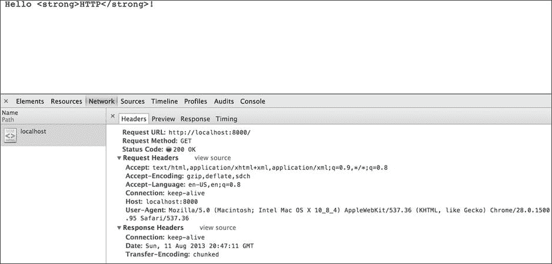
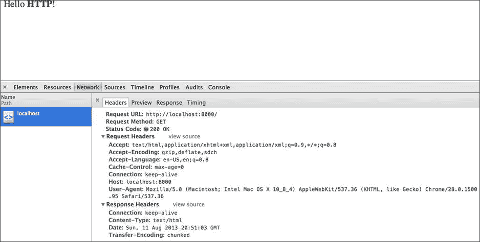

第十一章


超文本传送协议

超文本传输协议，简称 HTTP，推动了网络的发展。HTTP 是一种基于文本的无状态协议，工作在 TCP 之上。在处理敏感数据时，也经常使用 HTTP 的加密版本，即 HTTP Secure 或 HTTPS。HTTP 是一种请求-响应协议，使用第 10 章中讨论的客户端-服务器编程模型来实现。传统上，浏览器被用作 HTTP 事务中的客户端，但是您会发现情况并非总是如此。当浏览器导航到给定的 URL 时，会向托管该 URL 的服务器发出 HTTP 请求。正如你在[第 10 章](10.html)中了解到的，这个请求通常是在 TCP 端口 80(或者 443，如果 HTTPS 正在使用的话)上发出的。服务器处理请求，然后响应客户端。这就是 HTTP 如何在*非常高的层次上工作的。本章深入探讨了 Node.js 世界中的 HTTP。*

基本服务器

在我们深入了解 HTTP 之前，让我们使用清单 11-1 中的代码创建一个简单的服务器应用。Node 的 HTTP API 在`http`核心模块中实现，在[清单 11-1](#list1) 的第一行导入。在下面一行中，`http`模块的`createServer()`方法用于创建一个 HTTP 服务器的新实例。与同名的等效 TCP 方法非常相似，`createServer()`返回的服务器是一个事件发射器，并不绑定到任何特定的端口。在清单 11-1 的最后一行，服务器使用`listen()`方法绑定到端口 8000。`listen()`的`http`版本也以与 TCP `listen()`方法相同的方式使用。

***[清单 11-1](#_list1)*** 。一个基本的 HTTP 服务器

```js
var http = require("http");
var server = http.createServer(function(request, response) {
  response.write("Hello <strong>HTTP</strong>!");
  response.end();
});

server.listen(8000);
```

传递给`createServer()`的函数是一个可选的`request`事件处理程序，它在每次接收到新的 HTTP 请求时被调用。事件处理程序接受两个参数，`request`和`response`。`request`参数是`http.IncomingMessage`的一个实例，包含关于客户端请求的信息。另一方面，`response`参数是`http.ServerResponse`的一个实例，用于响应客户端。清单 11-1 中的处理程序使用`write()`和`end()`方法用一个简单的 HTML 字符串响应所有连接。您可能已经猜到，这些方法的行为类似于同名的 TCP 方法。

HTTP 请求的剖析

现在我们有了一个简单的 HTTP 服务器，我们可以开始向它发送请求。清单 11-2 中的[显示了一个 HTTP 请求的例子。请求的第一行称为*请求行*，指定了请求方法、请求的 URL 和使用的协议。在这个例子中，请求方法是`GET`，URL 是`/`，协议是 HTTP 版。我们将很快解释其中每一个的含义，但是首先让我们检查一下示例 HTTP 请求的其余部分。请求行之后是一组*请求头*，用于参数化请求。在](#list2)[清单 11-2](#list2) 中，仅包含了`Host`标题。这个头在 HTTP 1.1 中是强制性的，用于指定被请求的服务器的域名和端口。虽然没有包含在这个例子中，但是一个请求还可以包含一个*主体*，用于向服务器传递附加信息。

***[清单 11-2](#_list2)*** 。手工制作的 HTTP 请求

```js
GET / HTTP/1.1
Host: localhost:8000
```

由于 HTTP 是基于文本的协议，我们可以很容易地使用`telnet`手工创建请求。[清单 11-3](#list3) 展示了来自[清单 11-2](#list2) 的请求是如何使用`telnet` 发送给示例服务器的。需要注意的是，HTTP 请求必须以一个空行结束。在[清单 11-3](#list3) 中，该空行显示在`Host`标题之后。

***[清单 11-3](#_list3)*** 。清单 11-1 中连接到服务器的`telnet`会话

```js
$ telnet localhost 8000
Trying 127.0.0.1...
Connected to localhost.
Escape character is '^]'.
GET / HTTP/1.1
Host: localhost:8000

HTTP/1.1 200 OK
Date: Sun, 21 Jul 2013 22:14:26 GMT
Connection: keep-alive
Transfer-Encoding: chunked

1c
Hello <strong>HTTP</strong>!
0
```

请求的终止空行之后的所有内容都是服务器发送的响应的一部分。响应以指定协议的*状态行、*、*状态代码*和*原因短语*开始。同样，协议是 HTTP 1.1。`200`状态代码表示请求成功，原因短语用于提供状态代码的简短描述。状态行后面是一组*响应头*。服务器使用响应头的方式与客户端使用请求头的方式相同。响应头后面是另一个空行，然后是*响应体*。值`1c`是表示车身长度的十六进制值。在这种情况下，主体是服务器返回的 HTML 字符串。

请求方法

HTTP 请求的请求行以请求方法开始，后面是请求资源的 URL。请求方法也称为 HTTP 谓词，用于指定要在指定的 URL 上执行的操作。例如，在[清单 11-2](#list2) 中，对位于`/`的资源发出了一个`GET`请求。`GET`请求的目的是查看指定的资源(例如，`GET`要在浏览器中显示的网页)。另一个常见的 HTTP 动词是`POST`，它允许客户端向服务器提交数据。`POST`请求通常用于提交 HTML 表单。[表 11-1](#Tab1) 列出了 HTTP 1.1 支持的各种 HTTP 动词。以前 HTTP 1.0(现在还在用)只支持`GET`、`POST`和`HEAD`请求。

[表 11-1](#_Tab1) 。各种 HTTP 请求方法

| 

方法

 | 

描述

 |
| --- | --- |
| `GET` | 检索指定资源的表示形式。一个`GET`请求不应该改变服务器的状态，本质上是一个读操作。 |
| `HEAD` | 检索与等效的`GET`请求相同的数据，只是应该省略响应体。这有助于快速检索资源的响应头，而不会产生传输整个正文的开销。`HEAD`请求的一个用例是简单地检查资源是否存在，而不下载其全部内容。 |
| `POST` | 用于在服务器上创建新资源。`POST`请求的典型用途是提交 HTML 表单和向数据库添加数据。 |
| `PUT` | `PUT`请求类似于`POST`请求；然而，`PUT`是用来更新服务器上的现有资源的。如果资源不存在，服务器可以创建它。 |
| `DELETE` | 用于从服务器中删除资源。 |
| `TRACE` | 回传给客户。这对于检测中间服务器所做的任何更改非常有用。 |
| `OPTIONS` | 返回给定 URL 支持的动词列表。 |
| `CONNECT` | 用于创建通过代理服务器的隧道。代理将代表客户端建立连接。连接建立后，代理只是在客户机和远程服务器之间转发 TCP 流量。该技术允许加密的 HTTPS 流量通过未加密的 HTTP 通道进行代理。 |
| `PATCH` | `PATCH`方法类似于`PUT`。然而，`PATCH`用于对现有资源进行部分更新。这与`PUT`不同，后者应该在更新期间重新提交整个资源。 |

清单 11-4 中的例子显示了每个连接的请求行。请求行中的所有信息都可以通过`http.IncomingMessage`类访问。具体来说，这个例子使用了`method`、`url`和`httpVersion`属性来重新创建请求行。

***[清单 11-4](#_list4)*** 。显示每个传入连接的请求行的服务器

```js
var http = require("http");
var server = http.createServer(function(request, response) {
  var requestLine = request.method + " " + request.url +
                    " HTTP/" + request.httpVersion;

  console.log(requestLine);
  response.end();
});

server.listen(8000);
```

请求标题

从客户端发送的请求头集合告诉服务器如何正确处理请求。你已经看到了一个包含`Host`头的例子；然而，还有许多其他常用的请求头。例如，`Accept`头用于请求某种格式的数据。当资源有多种格式(JSON、XML、HTML 等)时，这个头非常有用。在这个场景中，客户端可以通过将`Accept`头设置为适当的`Content-Type` ( `application/json`、`application/xml`、`text/html`等等)来请求特定的数据格式。当涉及到响应头时，我们会更详细地讨论。表 11-2 中显示了常见请求标题的非详尽列表。

[表 11-2](#_Tab2) 。几种常见的 HTTP 请求头

| 

页眉

 | 

描述

 |
| --- | --- |
| `Accept` | 指定客户端愿意为此请求接受的`Content-Types`。 |
| `Accept-Encoding` | 提供可接受的编码列表。许多服务器可以压缩数据以加快网络传输速度。这个头告诉服务器客户机可以处理哪些压缩类型(gzip、deflate 等等)。 |
| `Cookie` | 服务器存储在客户机上的小块数据。`Cookie`头包含客户端当前为服务器存储的所有 cookies。 |
| `Content-Length` | 请求正文的长度，以八位字节为单位。 |
| `Host` | 服务器的域和端口。这个头在 HTTP 1.1 中是强制性的。当多台服务器托管在同一台机器上时，此标头非常有用。 |
| `User-Agent` | 标识客户端类型的字符串。这通常包含浏览器名称、版本和操作系统等信息。 |

请求头可以通过`http.IncomingMessage`类的`headers`属性访问。[清单 11-5](#list5) 提供了一个打印出每个请求标题的例子。

***[清单 11-5](#_list5)*** 。显示每个传入连接的请求标头的服务器

```js
var http = require("http");

http.createServer(function(request, response) {
  console.log(request.headers);
  response.end();
}).listen(8000);
```

`Response Codes`

每个 HTTP 响应的状态行都包括一个数字状态代码，以及描述该代码的原因短语。原因短语只是装饰性的，而状态代码实际上是由客户端使用的，它与响应头一起决定了如何处理响应。[表 11-3](#Tab3) 包含几个常见(和一个不常见)HTTP 响应状态代码和原因短语的列表。

[表 11-3](#_Tab3) 。几个常见的(和一个滑稽的)HTTP 响应代码和原因短语

| 

状态代码和原因短语

 | 

描述

 |
| --- | --- |
| `200 OK` | 指示 HTTP 请求已成功处理。 |
| `201 Created` | 指示请求已经完成，并且已经在服务器上创建了新的资源。 |
| `301 Moved Permanently` | 请求的资源已永久移动到新的 URL。`Location`响应头应该包含重定向到的新 URL。 |
| `303 See Other` | 可以通过对在`Location`响应头中指定的 URL 的`GET`请求来找到所请求的资源。 |
| `304 Not Modified` | 指示缓存的资源尚未被修改。为了提高性能，`304`响应不应该包含主体。 |
| `400 Bad Request` | 表示请求格式不正确，无法理解。这方面的一个例子是缺少必需参数的请求。 |
| `401 Unauthorized` | 如果某个资源需要身份验证，而所提供的凭证被拒绝，那么服务器将使用此状态代码进行响应。 |
| `404 Not Found` | 服务器找不到请求的 URL。 |
| `418 I'm a Teapot` | 这个状态代码是作为愚人节玩笑引入的。实际的服务器不应该返回这个状态代码。 |
| `500 Internal Server Error` | 服务器在尝试完成请求时遇到错误。 |

在`http`模块中，通过它的`STATUS_CODES`属性，可以获得 HTTP 状态代码的更详细的列表。`STATUS_CODES`是一个将数字状态代码映射到原因短语字符串的对象。[清单 11-6](#list6) 中的例子显示了与`404`状态代码相对应的原因短语。

***[清单 11-6](#_list6)*** 。使用`http.STATUS_CODES`的例子

```js
var http = require("http");

console.log(http.STATUS_CODES[404]);
// displays "Not Found"
```

您可以使用响应对象的`statusCode`属性来设置其状态代码。如果没有明确提供状态代码，该值默认为`200`。设置`statusCode`属性的示例服务器如清单 11-7 所示。如果请求 URL `/foo`，服务器将用一个`200`状态代码和一个 HTML 响应体来响应。但是，如果请求任何其他 URL，服务器会以一个`404`错误做出响应。

***[清单 11-7](#_list7)*** 。该示例根据请求的 URL 提供不同的响应

```js
var http = require("http");

http.createServer(function(request, response) {
  if (request.url === "/foo") {
    response.end("Hello <strong>HTTP</strong>");
  } else {
    response.statusCode = 404;
    response.end();
  }
}).listen(8000);
```

响应标题

响应头与响应状态代码一起用于解释从服务器发回的数据。在[表 11-4](#Tab4) 中显示了一些更常见的响应报头。

[表 11-4](#_Tab4) 。几种常见的 HTTP 响应头

| 

页眉

 | 

描述

 |
| --- | --- |
| `Cache-Control` | 指定是否可以缓存资源。如果可以，这个头指定它可以在任何缓存中存储的时间长度，以秒为单位。 |
| `Content-Encoding` | 指定对数据使用的编码。这允许服务器压缩响应，以便通过网络更快地传输。 |
| `Content-Length` | 响应正文的长度，以字节为单位。 |
| `Content-Type` | 指定响应正文的 MIME 类型。本质上，这个头告诉客户端如何解释数据。 |
| `Location` | 当客户端被重定向时，目标 URL 存储在这个头中。 |
| `Set-Cookie` | 在客户端创建新的 cookie。这个 cookie 将包含在未来请求的`Cookie`头中。 |
| `Vary` | 用于规定哪些请求头影响缓存。例如，如果一个给定的资源有一个以上的表示，而`Accept`请求头用于区分它们，那么`Accept`应该包含在`Vary`头中。 |
| `WWW-Authenticate` | 如果为给定的资源实现了一个身份验证方案，这个头用于标识该方案。一个示例值是`Basic`，对应于 HTTP 基本认证。 |

[表 11-4](#Tab4) 中一个特别重要的表头是`Content-Type` 。这是因为`Content-Type`头告诉客户端它正在处理哪种数据。为了演示这一点，使用浏览器连接到清单 11-1 中的示例服务器。[图 11-1](#Fig1) 显示了使用谷歌 Chrome 浏览器的结果。此外，Chrome 的开发工具已经被用来记录 HTTP 请求。请注意，响应中的 HTML 标记显示在屏幕上，而不是标记文本。通过检查响应，您可以看到服务器没有发回任何`Content-Type`报头。



[图 11-1](#_Fig1) 。使用谷歌的 Chrome 浏览器连接到[清单 11-1](#list1) 中的服务器

幸运的是，`http`模块提供了几种创建响应头的方法。最简单的方法是使用`response`参数的`setHeader()`方法。这个方法有两个参数，头名和值。标头名称始终是一个字符串。如果需要创建多个同名的头，该值应该是一个字符串或字符串数组。在[清单 11-8](#list8) 中，服务器被修改为返回一个`Content-Type`头。由于服务器发送回一个 HTML 字符串，`Content-Type`头应该告诉客户端将响应解释为 HTML。这是通过将头的值设置为`text/html` MIME 类型来实现的。

***[清单 11-8](#_list8)*** 。使用`setHeader()`方法设置`Content-Type`响应头

```js
var http = require("http");
var server = http.createServer(function(request, response) {
  response.setHeader("Content-Type", "text/html");
  response.write("Hello <strong>HTTP</strong>!");
  response.end();
});

server.listen(8000);
```

 **注意**用`setHeader()`创建的响应头可以用`response.removeHeader()`方法删除。该方法采用一个参数，即要移除的头的名称。你可能会问为什么这很重要。假设您有一个设置为使用缓存头进行缓存的资源。但是，在发送响应之前，会遇到一个错误。因为您不想缓存错误响应，所以可以使用`removeHeader()`方法来移除缓存头。

现在，尝试使用浏览器连接到清单 11-8 中的服务器。这一次，单词 HTTP 应该显示为粗体文本。图 11-2 显示了使用 Chrome 的结果页面，以及记录的 HTTP 请求。注意，响应头现在包括了`Content-Type`头。



[图 11-2](#_Fig2) 。使用 Chrome 连接到[清单 11-8](#list8) 中的服务器

编写响应头的第二种方法是使用`writeHead()`方法。这个方法有三个参数。第一个是要返回的状态代码。第二个参数是可选的原因短语。最后一个参数是包含响应头的可选对象。[清单 11-9](#list9) 展示了来自[清单 11-8](#list8) 的服务器是如何使用`writeHead()`而不是`setHeader()`实现的。

***[清单 11-9](#_list9)*** 。使用`writeHead()`方法的示例

```js
var http = require("http");
var server = http.createServer(function(request, response) {
  response.writeHead(200, {
    "Content-Type": "text/html"
  });
  response.write("Hello <strong>HTTP</strong>!");
  response.end();
});

server.listen(8000);
```

请注意，在调用`write()`或`end()`之前必须设置头部信息。一旦`write()`或`end()`被调用，Node将隐式调用`writeHead()`，如果你还没有显式这样做的话。如果您试图在此之后再次写入标题，您将会得到一个`"Can't set headers after they are sent"`错误。此外，每个请求只能调用一次`writeHead()`。如果您不确定头文件是否已经被写入，您可以使用`response.headersSent`属性来查找。`headersSent`保存一个布尔值，如果报头已经发送，则为`true`，否则为`false`。

`Working with Cookies`

因为 HTTP 是一种无状态协议，它不能直接记住客户机以前与服务器交互的细节。例如，如果您要访问同一个页面 1000 次，HTTP 会将每个请求视为第一次。显然，网页可以记住你的详细信息，比如你是否登录。那么，如何在无状态协议上维护状态呢？有几个选择。可以使用数据库或会话在服务器上维护状态。另一种方法是将客户机上的数据存储在 cookie 中。每种方法都有优点和缺点。将数据存储在服务器上的优点是不容易被篡改。缺点是所有的状态信息都会消耗服务器上的内存。对于负载很重的服务器，内存消耗很快就会成为一个问题。另一方面，使用 cookies 在客户机上维护状态更具可伸缩性，但安全性较低。

 **提示**尽管 cookies 比服务器存储的状态更具可伸缩性，但您仍然应该谨慎使用它们。每个 HTTP 请求，包括对图像、脚本、样式表等的请求，站点的 cookies 都会在*的`Cookie`头中发送回服务器。所有这些数据都会增加网络延迟。缓解这个问题的一种方法是将静态资产(如图像)存储在不使用任何 cookies 的单独的域或子域中。*

最简单的形式是，cookie 只是一个名称/值对，用等号分隔。使用分号作为分隔符将多个 cookies 连接在一起。清单 11-10 中的[显示了两个`Set-Cookie`响应头的例子。这些 cookies 的名字是`name`和`foo`，而值分别是`Colin`和`bar`。一旦这些 cookies 被设置，它们将被包含在未来的`Cookie`请求头中，如](#list10)[清单 11-11](#list11) 所示。

***[清单 11-10](#_list10)*** 。两个`Set-Cookie`标题的示例

```js
Set-Cookie: name=Colin
Set-Cookie: foo=bar
```

***[清单 11-11](#_list11)*** 。清单 11-10 中[标题的`Cookie`标题](#list10)

```js
Cookie: name=Colin; foo=bar
```

Cookies 也可以使用属性进行参数化。各种 cookie 属性如[表 11-5](#Tab5) 所示。这些属性中的一些——比如`Domain`和`Path`—是给定值，而其他的——比如`Secure`和`HttpOnly`—是布尔属性，它们的值要么被设置，要么不被设置。

[表 11-5](#_Tab5) 。各种 Cookie 属性的描述

| 

属性

 | 

描述

 |
| --- | --- |
| `Domain` | 限制 cookie 的范围，使其仅在给定域请求时发送到服务器。如果省略，则默认为设置 cookie 的资源的域。 |
| `Path` | 将 cookie 的范围限制为所提供路径中包含的所有资源。如果省略，`Path`默认为`/`，适用于所有资源。 |
| `Expires` | 包括 cookie 应该被删除并且不再有效的日期。 |
| `Max-Age` | 还指定 cookie 应该何时过期。但是，`Max-Age`被指定为 cookie 从设置时起应该持续的秒数。 |
| `Secure` | 标有`Secure`标志的 Cookies 仅用于安全连接。浏览器应该只通过安全(HTTPS)连接发送这些 cookies，而服务器应该只在客户端建立安全连接时设置它们。 |
| `HttpOnly` | 标有`HttpOnly`的 Cookies 只能通过 HTTP 和 HTTPS 访问。这些 cookies 不能通过浏览器中的 JavaScript 访问，这有助于减少跨站点脚本攻击。 |

在[清单 11-12](#list12) 中显示了一个使用`setHeader()`创建两个带有属性的 cookies 的例子。在本例中，`name` cookie 将于 2015 年 1 月 10 日到期。这个 cookie 也是安全的，并且是仅 HTTP cookie。另一方面，`foo` cookie 使用`Max-Age`属性，一小时后过期。

***[清单 11-12](#_list12)*** 。设置两个包含属性的 Cookies

```js
response.setHeader("Set-Cookie",
  ["name=Colin; Expires=Sat, 10 Jan 2015 20:00:00 GMT;\
   Domain=foo.com; HttpOnly; Secure",
   "foo=bar; Max-Age=3600"]);
```

中间件

即使有 Node 核心模块的帮助，实现一个普通 web 服务器的所有功能也是一项艰巨的任务。例子可能包括实现 HTTP 基本认证和 gzip 压缩。您可以自己编写所有这些代码，但是更流行的选择是使用中间件。中间件是以流水线方式处理请求的功能。这意味着一个中间件最初处理一个传入的请求。这个中间件既可以完全处理请求，也可以对请求执行操作，然后将其传递给另一个中间件进行额外的处理。

清单 11-13 显示了一个不执行任何处理的中间件的例子。注意，中间件有三个参数，`request`、`response`、`next. request`和`response`是您已经熟悉的用于处理请求的完全相同的对象。`next`是一个被调用来调用下一个中间件的函数。请注意，在本例中,`next()`已包含在`return`语句中。这不是必需的，但是在调用`next()`时返回以确保下一个中间件完成时不会继续执行是一个很好的做法。

***[清单 11-13](#_list13)*** 。中间件功能示例

```js
function middleware(request, response, next) {
  return next();
}
```

连接

现在我们已经看到了中间件的样子，让我们用它来构建一些东西。第一步是安装连接模块(`npm install connect`)。Connect 将自己标榜为“node.js 的高质量中间件”。Connect 不仅允许您使用自己的中间件构建应用，而且它还捆绑了一些非常有用的中间件。还有大量免费的第三方中间件使用 Connect 构建。

安装 Connect 之后，创建一个新的服务器，包含清单 11-14 中所示的代码。这个例子的前两行导入了`http`和`connect`模块。在第三行，使用`connect`模块初始化一个连接应用。接下来，通过它的`use()`方法将一个中间件添加到应用中。中间件的主体应该看起来很熟悉，因为我们在前面的例子中一直在使用它。这是连接中间件的美妙之处之一——它构建在`http`模块之上，因此与您已经了解的一切都兼容。最后，基于 Connect 应用构建一个 HTTP 服务器。您可能还记得，`createServer()`接受一个`request`事件处理程序(函数)作为参数。事实证明，`connect()`返回的`app`对象只是一个可以用来处理`request`事件的函数。

***[清单 11-14](#_list14)*** 。使用中间件构建的示例服务器

```js
var http = require("http");
var connect = require("connect");
var app = connect();

app.use(function(request, response, next) {
  response.setHeader("Content-Type", "text/html");
  response.end("Hello <strong>HTTP</strong>!");
});

http.createServer(app).listen(8000);
```

我们刚刚展示了如何使用中间件重新创建简单的 HTTP 服务器。然而，为了真正理解中间件，让我们看另一个使用多个中间件的例子。清单 11-15 中的服务器使用了三个中间件功能。首先是 Connect 内置的`query()` 中间件。`query()`自动解析请求的 URL，并用包含所有查询字符串参数及其值的`query`对象来扩充`request`对象。中间件的第二部分是定制的，它遍历所有解析的查询字符串参数，并一路打印每个参数。在调用`next()`之后，控制权被传递给第三个也是最后一个中间件，它响应客户端。注意，中间件的执行顺序与它们被附加的顺序相同(通过调用`use()`)。在这个例子中，`query()`必须在定制中间件之前被调用。如果顺序相反，将不会出现错误，但是在定制中间件中不会观察到控制台输出。

***[清单 11-15](#_list15)*** 。将多个连接中间件链接在一起

```js
var http = require("http");
var connect = require("connect");
var app = connect();

app.use(connect.query());

app.use(function(request, response, next) {
  var query = request.query;

  for (q in query) {
    console.log(q + ' = ' + query[q]);
  }

  next();
});

app.use(function(request, response, next) {
  response.setHeader("Content-Type", "text/html");
  response.end("Hello <strong>HTTP</strong>!");
});

http.createServer(app).listen(8000);
```

 **注意**查询字符串是 URL 的可选部分，用于传递特定于请求的参数。问号(`?`)用于将请求的资源与查询字符串分开。在查询字符串中，各个参数被格式化为`parameter=value`。&符号(`&`)用于分隔参数-值对。

来自[清单 11-15](#list15) 的控制台输出示例如[清单 11-16](#list16) 所示。要重新创建这个输出，只需将浏览器指向`http://localhost:8000?foo=bar&fizz=buzz`。注意，`query()`成功地提取了两个查询字符串参数`foo`和`fizz`，以及它们的值`bar`和`buzz`。

***[清单 11-16](#_list16)*** 。清单 11-15 中连接到服务器后的示例输出

```js
$ node connect-query.js
foo = bar
fizz = buzz
```

`query()`只是 Connect 附带的 20 多种中间件方法中的一种。`bodyParser()`和`cookieParser()`中间件分别为处理请求体和 cookies 提供了类似的功能。关于 Connect 提供的所有中间件的列表，建议读者在`https://github.com/senchalabs/connect`查看该项目的 GitHub 页面。位于`http://www.senchalabs.org/connect/`的 Connect 主页也提供了到流行的第三方中间件的链接。

发出 HTTP 请求

除了创建服务器之外，`http`模块还允许您使用名副其实的`request()`方法发出请求。`request()`有两个参数，`options`和`callback. options`是用于参数化 HTTP 请求的对象。`options`支持的各种属性描述如[表 11-6](#Tab6) 所示。`callback`参数是一个在收到请求响应时调用的函数。`http.IncomingMessage`的实例是传递给回调函数的唯一参数。`request()`还返回一个`http.ClientRequest`的实例，这是一个可写的流。

[表 11-6](#_Tab6) 。选项参数支持的各种属性来请求()

| 

[计]选项

 | 

描述

 |
| --- | --- |
| `hostname` | 要连接的域或 IP 地址。如果省略，默认为`localhost`。您也可以使用`host`属性来指定，但是最好使用`hostname`。 |
| `port` | 要连接的服务器端口。默认为 80。 |
| `method` | 请求的 HTTP 方法。这默认为`GET`。 |
| `path` | 被请求的资源的路径。如果请求包含查询字符串，则应该将其指定为路径的一部分。如果省略，默认为`/`。 |
| `headers` | 包含请求标头的对象。 |
| `auth` | 如果正在使用基本认证，则使用`auth`属性来生成`Authorization`报头。用于验证的用户名和密码应该采用`username:password`的格式。在`headers`字段设置`Authorization`标题将覆盖该选项。 |
| `socketPath` | 要使用的 UNIX 套接字。如果使用该选项，则应省略`hostname`和`port`，反之亦然。 |

清单 11-17 中显示了一个与我们的示例服务器一起工作的客户端。客户端向`http://localhost:8000/`发出`GET`请求。传递给`request()`的几个选项可以省略，因为它们是缺省值(即`hostname`、`path`和`method`)，但为了示例起见，它们已经被包括在内。当收到响应时，回调函数通过打印出状态行、标题和正文来重新创建 HTTP 响应。使用流`data`事件处理程序将主体显示为 UTF-8 数据。需要注意的一件重要事情是在示例的最后一行调用了`end()`。如果这是一个`POST`或`PUT`请求，可能会有一个通过调用`request.write()`创建的请求体。为了标记请求体的结束，即使没有请求体，也要调用`end()`。如果没有调用`end()`，这个请求就永远不会被发出。

***[清单 11-17](#_list17)*** 。使用`request()`方法发出 HTTP 请求

```js
var http = require("http");
var request = http.request({
  hostname: "localhost",
  port: 8000,
  path: "/",
  method: "GET",
  headers: {
    "Host": "localhost:8000"
  }
}, function(response) {
  var statusCode = response.statusCode;
  var headers = response.headers;
  var statusLine = "HTTP/" + response.httpVersion + " " +
                   statusCode + " " + http.STATUS_CODES[statusCode];

  console.log(statusLine);

  for (header in headers) {
    console.log(header + ": " + headers[header]);
  }

  console.log();
  response.setEncoding("utf8");
  response.on("data", function(data) {
    process.stdout.write(data);
  });

  response.on("end", function() {
    console.log();
  });
});

request.end();
```

`request()`有一个更简单但功能更弱的签名，它将 URL 字符串作为第一个参数。[清单 11-17](#list17) 在[清单 11-18](#list18) 中被重写，以使用这个版本的`request()`。这个版本的缺点是不能指定请求方法和头。因此，这个例子发出了一个没有报头的`GET`请求。还要注意，我们仍然必须调用`end()`。

***[清单 11-18](#_list18)*** 。`http.request()`的另一种用法

```js
var http = require("http");
var request = http.request("http://localhost:8000/", function(response) {
  response.setEncoding("utf8");

  response.on("data", function(data) {
    process.stdout.write(data);
  });

  response.on("end", function() {
    console.log();
  });
});

request.end();
```

为了方便起见，`http`模块还提供了一个`get()`方法来发出`GET`请求，而不调用`end()`。清单 11-19 中的[显示了一个`get()`的例子。值得指出的是`get()`支持`request()`支持的两种参数签名。](#list19)

***[清单 11-19](#_list19)*** 。`http.get()`的一个例子

```js
var http = require("http");

http.get("http://localhost:8000/", function(response) {
  response.setEncoding("utf8");

  response.on("data", function(data) {
    process.stdout.write(data);
  });

  response.on("end", function() {
    console.log();
  });
});
```

表格数据

到目前为止，我们只处理了`GET`请求，不包括请求体。现在我们来看看向服务器发送数据的请求。[清单 11-20](#list20) 中的例子向我们的示例服务器发出一个`POST`请求(它需要被更新以处理额外的数据)。首先要注意的是，`querystring`核心模块是在示例的第二行导入的。`querystring`模块的`stringify()`方法从一个对象创建一个查询字符串。在这个例子中，`stringify()`创建查询字符串`foo=bar&baz=1&baz=2`。值得指出的是，数组，比如`baz`，可以字符串化，但是嵌套对象不能。

***[清单 11-20](#_list20)*** 。示例`POST`请求

```js
var http = require("http");
var qs = require("querystring");
var body = qs.stringify({
      foo: "bar",
      baz: [1, 2]
    });
var request = http.request({
      hostname: "localhost",
      port: 8000,
      path: "/",
      method: "POST",
      headers: {
        "Host": "localhost:8000",
        "Content-Type": "application/x-www-form-urlencoded",
        "Content-Length": Buffer.byteLength(body)
      }
    }, function(response) {
      response.setEncoding("utf8");

      response.on("data", function(data) {
        process.stdout.write(data);
      });

      response.on("end", function() {
        console.log();
      });
    });

request.end(body);
```

传递给`request()`的选项是接下来要注意的。显然，请求方法被设置为`POST`，但是还要注意`Content-Type`和`Content-Length`头。`Content-Type`头向服务器表明请求体包含 URL 编码的表单数据(由`querystring.stringify()`生成)。`Content-Length`头告诉服务器请求体中包含多少字节(不是字符)。最后，使用`end()`将请求主体发送到服务器(也可以使用`write()`后跟`end()`)。

我们当前的服务器可以很好地运行更新后的客户端，但是它无法处理表单数据。清单 11-21 展示了如何使用熟悉的流 API 和`querystring`模块解析请求体。`request`流的`data`处理程序用于收集`bodyString`变量中的整个请求体。当发出`end`事件时，使用`querystring.parse()`方法 将请求体解析成一个对象。接下来，遍历主体中的每个字段，并写回客户端。

***[清单 11-21](#_list21)*** 。处理`POST`请求的示例服务器

```js
var http = require("http");
var qs = require("querystring");
var server = http.createServer(function(request, response) {
  var bodyString = "";

  request.setEncoding("utf8");

  request.on("data", function(data) {
    bodyString += data;
  });

  request.on("end", function() {
    var body = qs.parse(bodyString);

    for (var b in body) {
      response.write(b + ' = ' + body[b] + "\n");
    }

    response.end();
  });
});

server.listen(8000);
```

现在服务器已经配置好处理`POST`请求，我们可以测试我们的客户机了。如果一切正常，客户端应该生成如清单 11-22 所示的输出。

***[清单 11-22](#_list22)*** 。来自`POST`请求客户端和服务器的示例输出

```js
$ node post-client.js
foo = bar
baz = 1,2
```

处理传入的请求体并不十分困难，但是比实际需要的要繁琐一些。为了缓解这个问题，我们可以求助于 Connect 的`bodyParser()`中间件。清单 11-23 展示了如何使用 Connect 重写服务器。`bodyParser()`中间件解析传入的请求体，并将结果存储在`request.body`中，以备将来处理。

***[清单 11-23](#_list23)*** 。使用 Connect 的`bodyParser()`中间件处理`POST`请求

```js
var http = require("http");
var connect = require("connect");
var app = connect();

app.use(connect.bodyParser());

app.use(function(request, response, next) {
  var body = request.body;

  for (b in body) {
    response.write(b + ' = ' + body[b] + "\n");
  }

  response.end();
});

http.createServer(app).listen(8000);
```

嵌套对象

前面提到过`querystring.stringify()`不处理嵌套对象。解决方法是使用方括号符号定义查询参数，如[清单 11-24](#list24) 所示。在这个例子中，一个名为`name`的对象是用两个属性`first`和`last`创建的。

***[清单 11-24](#_list24)*** 。将嵌套对象传递给`querystring.stringify()`

```js
var body = qs.stringify({
  "name[first]": "Colin",
  "name[last]": "Ihrig"
});
```

Connect 的`bodyParser()`中间件将把这个请求解释为[清单 11-25](#list25) 中所示的对象。不幸的是，如果您使用`querystring.parse()`手工解析请求，这个技巧将不起作用，数据将被存储，如[清单 11-26](#list26) 所示。

***[清单 11-25](#_list25)*** 。Connect 对清单 11-24 中[数据的解释](#list24)

```js
{
  name: {
    first: "Colin",
    last: "Ihrig"
  }
}
```

***[清单 11-26](#_list26)*** 。使用`querystring.parse()`解析的来自[清单 11-24](#list24) 的数据

```js
{
  "name[first]": "Colin",
  "name[last]": "Ihrig"
}
```

`request`模块

是一个第三方模块，由 Mikeal Rogers 编写，它简化了 HTTP 请求的过程。在撰写本文时，`request`是`npm`注册表中第三大依赖模块。`request`的流行是因为它在 Node 的核心功能上提供了简单的抽象。为了展示`request`的简单性，[清单 11-20](#list20) 在[清单 11-27](#list27) 中被重写。您会立即注意到没有流和`querystring`模块——所有这些都发生在`request`中。请求的所有参数都在第一个参数中传递给`request()`。在这一点上，这些参数中的大多数是不言自明的，但是`request`支持的许多常见选项的概要在[表 11-7](#Tab7) 中提供。

***[清单 11-27](#_list27)*** 。模块`request`的使用示例

```js
var request = require("request");

request({
  uri: "http://localhost:8000/",
  method: "POST",
  headers: {
    Host: "localhost:8000"
  },
  form: {
    foo: "bar",
    baz: [1, 2]
  }
}, function(error, response, body) {
  console.log(body);
});
```

[表 11-7](#_Tab7) 。与请求模块一起使用的通用选项

| 

[计]选项

 | 

描述

 |
| --- | --- |
| `uri`(或`url`) | 被请求的 URL。这是唯一必需的选项。 |
| `method` | HTTP 请求方法。这默认为`GET`。 |
| `headers` | 要发送的请求标头。这默认为一个空对象。 |
| `body` | 字符串或`Buffer`形式的请求体。 |
| `form` | 请求正文的对象表示形式。在内部，这将把`body`选项设置为 URL 编码的等价字符串。此外，`Content-Type`标题将被设置为`application/x-www-form-urlencoded; charset=utf-8`。 |
| `qs` | 任何查询字符串参数的对象表示形式。在内部，这将被转换为 URL 编码的查询字符串，并附加到所请求的 URL。 |
| `jar` | 用于为请求定义 cookie 的 cookie jar 对象。这将在后面详细介绍。 |
| `followRedirect` | 如果`true`(默认)，`request`将自动跟随 HTTP `3xx`响应重定向。 |
| `followAllRedirects` | 如果是`true`，`request`将自动跟随 HTTP `3xx`响应重定向，即使是非`GET`请求。这默认为`false`。 |
| `maxRedirects` | 跟随重定向的最大数量。默认为 10。 |
| `timeout` | 中止请求前等待响应的毫秒数。 |

`request()`的第二个参数是一个回调函数，一旦收到响应就调用这个函数。回调的第一个参数用于传递任何错误信息。第二个参数是完整的响应，是`http.IncomingMessage`的一个实例。第三个论点，`body`，是回应体。

`request`中的 Cookies

许多网站需要 cookies 才能正常运行。例如，大多数电子商务网站使用 cookies 将请求映射到购物车。如果您能够猜测(或窃取)另一个用户的 cookies，您就可以操纵他们的购物车。仅使用Node核心，您必须在每个请求上设置`Cookie`头，并检查每个响应上的`Set-Cookie`头。`request`通过饼干罐的概念抽象出这一点。cookie jar 是一个包含 cookie 表示的对象。然后这个 jar 被传递到`request()`而不是`Cookie`头。一旦收到响应，`request`就会用任何`Set-Cookie`头更新 cookie jar。

清单 11-28 中显示了一个使用 cookies 的示例`request`客户端。`request.jar()`方法用于创建一个新的空 cookie jar。接下来，使用`request.cookie()`方法创建一个名为`count`的新 cookie，值为 1。然后使用`add()`方法将 cookie 添加到 jar 中。当发出请求时，cookie jar 通过`jar`选项传入。最后，一旦收到响应，就会打印 cookie jar 的内容。

***[清单 11-28](#_list28)*** 。使用 Cookies 的请求示例

```js
var request = require("request");
var jar = request.jar();
var cookie = request.cookie("count=1");

jar.add(cookie);

request({
  url: "http://localhost:8000/",
  jar: jar
}, function(error, response, body) {
  console.log(jar);
});
```

为了验证`request`自动更新 cookie jar，我们将创建一个更新 cookie 值的服务器。清单 11-29 中的示例服务器使用 Connect 的`cookieParser()`中间件解析`Cookie`头并创建`request.cookies`对象。接下来，`count` cookie 的值被读取并转换成一个整数。最后，创建一个带有递增计数的`Set-Cookie`响应头。连接到该服务器产生的客户端输出如清单 11-30 所示。

***[清单 11-29](#_list29)*** 。更新 Cookie 值的示例服务器

```js
var http = require("http");
var connect = require("connect");
var app = connect();

app.use(connect.cookieParser());

app.use(function(request, response, next) {
  var cookies = request.cookies;
  var count = parseInt(cookies.count, 10);
  var setCookie = "count=" + (count + 1);

  response.setHeader("Set-Cookie", setCookie);
  response.end();
});

http.createServer(app).listen(8000);
```

***[清单 11-30](#_list30)*** 。Cookie 示例的输出

```js
$ node cookie-update.js
{ cookies:
   [ { str: 'count=2',
       name: 'count',
       value: '2',
       expires: Infinity,
       path: '/' } ] }
```

安全超文本传输协议

HTTP 以明文传输数据，这使得它本身就不安全。当传输敏感/私人数据，如社会安全号码、信用卡信息、电子邮件甚至即时消息时，应使用安全协议。幸运的是，HTTP 在 HTTPS 有一个安全的姐妹协议。HTTPS 只是在安全通道上执行的标准 HTTP。更具体地说，使用 SSL/TLS(安全套接字层/传输层安全) 协议来保护信道。

在 SSL/TLS 下，每个客户端和服务器都必须有一个私有密钥。因此，我们需要做的第一件事是创建一个私钥。这可以使用免费提供的 OpenSSL 实用程序来完成。有关获取 OpenSSL 的更多信息，请访问`www.openssl.org`。接下来，使用清单 11-31 中的命令创建一个名为`key.pem`的私钥。请务必记住保存密钥的位置，因为您稍后会需要它！

***[清单 11-31](#_list31)*** 。使用 OpenSSL 创建私钥

```js
$ openssl genrsa -out key.pem 1024
```

除了私钥之外，每个服务器必须有一个*证书*，这是一个由认证机构(CA)签名的公钥。从本质上讲，证书是一种凭证，证明公钥的所有者就是他们所说的那个人。任何人都可以签署证书，因此其合法性确实取决于签署者的声誉。因此，ca 通常是受信任的第三方。要获得证书，您必须首先生成证书签名请求。使用 OpenSSL，这可以通过清单 11-32 中的[命令来完成。](#list32)

***[清单 11-32](#_list32)*** 。使用 OpenSSL 创建证书签名请求

```js
$ openssl req -new -key key.pem -out request.csr
```

此时，您可以将您的`request.csr`发送到 CA 进行签名。然而，这通常是有费用的，在这里展示的例子中并不需要。出于我们的目的，我们可以使用清单 11-33 中的[所示的 OpenSSL 命令](#list33) 创建一个自签名证书。

***[清单 11-33](#_list33)*** 。使用 OpenSSL 创建自签名证书

```js
$ openssl x509 -req -in request.csr -signkey key.pem -out cert.pem
```

使用我们刚刚创建的`key.pem`和`cert.pem`文件，我们可以构建一个简单的 HTTPS 服务器(如[清单 11-34](#list34) 所示)。Node 提供了一个核心的`https`模块，它为`http`模块中包含的许多特性提供了安全的替代方案。注意，`createServer()`的`https`版本在`request`事件监听器之前接受了一个额外的参数。该参数用于传入服务器的私钥和证书。如有必要，调整路径以指向您的密钥和证书的位置。服务器的其余部分与我们的旧 HTTP 服务器相同。

***[清单 11-34](#_list34)*** 。一个示例 HTTPS 服务器

```js
var fs = require("fs");
var https = require("https");
var server = https.createServer({
  key: fs.readFileSync(__dirname + "/key.pem"),
  cert: fs.readFileSync(__dirname + "/cert.pem")
}, function(request, response) {
  response.writeHead(200, {
    "Content-Type": "text/html"
  });
  response.end("Hello <strong>HTTP</strong>!");
});

server.listen(8000);
```

为了测试我们闪亮的新 HTTPS 服务器，我们需要一个新的客户端。您可以在浏览器中导航到`https://localhost:8000`。忽略关于无效/不可信证书的任何警告，因为它们是由于使用自签名证书而引起的。`https`模块也提供了它自己的`request()`方法，如[清单 11-35](#list35) 所示。使用`https request()`不需要做任何特别的事情。事实上，[清单 11-35](#list35) 与我们的 HTTP 示例完全相同，除了第一行，以及使用了`https`模块而不是`http`。第一行用于抑制由于服务器的不可信证书而引发的错误。在生产代码中，您可能希望删除这一行，并根据需要在应用中处理错误。

***[清单 11-35](#_list35)*** 。一个 HTTPS 客户的例子

```js
process.env.NODE_TLS_REJECT_UNAUTHORIZED = "0";

var https = require("https");
var request = https.request({
  hostname: "localhost",
  port: 8000
}, function(response) {
  response.setEncoding("utf8");

  response.on("data", function(data) {
    process.stdout.write(data);
  });

  response.on("end", function() {
    console.log();
  });
});

request.end();
```

 **注意**当我们谈到 HTTPS 客户的话题时，值得指出的是`request`模块与 HTTPS 完全兼容。

摘要

本章介绍了大量与 HTTP 相关的材料。虽然 HTTP 不是一个非常复杂的协议，但是为了正确使用 HTTP，必须理解许多相关的概念。这一章也提到了像 cookies 和通过 HTTPS 协议的安全性这样的主题。除了核心的`http`、`https`和`querystring`模块，本章还介绍了`connect`和`request`，它们是`npm`注册表中最受欢迎的两个模块。下一章专门介绍 Express，这是一个基于`http`和`connect`构建的用于创建 web 应用的框架。因此，在进入下一章之前，理解这里的内容是很重要的。