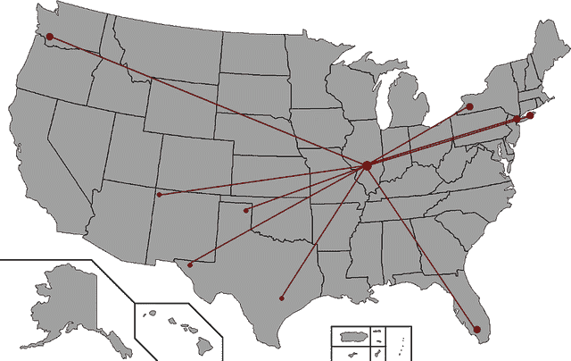
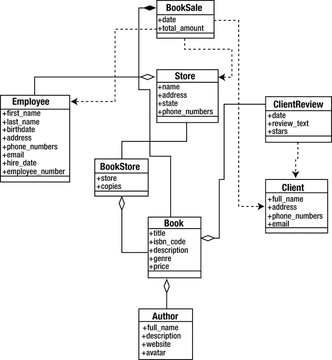

# 6.规划您的 REST API

您几乎已经准备好动手开发实际的 API 了；但是在你开始之前，让我们应用我在这一点上所说的一切:

*   休息
*   定义理想的 RESTful 架构应该是什么样子
*   开发 API 时的良好实践
*   有助于实现这一理想目标的模块

在这一章中，我将为这本书将带你经历的最终发展设置基础工作:

*   我将定义一个要解决的具体问题。
*   您将为它创建一个书面规范，写下资源和端点的列表。
*   为了帮助理解所有这些资源是如何相互关联的，您将为我们的系统创建一个 UML 图。
*   我将讨论数据库引擎的一些选项，为我们的问题选择最好的一个。

本章的最终结果将是你开始开发过程所需要的所有信息(将在下一章讨论)。

## 问题

如果你还没有注意到，在本书中，每一个主要的(也可能是次要的)代码示例和虚假场景都是使用书店作为该示例的根来完成的。这一章保持了这一趋势，因此，与其切换到另一个领域，不如深入挖掘，充实我们的假书店。

让我们称我们的假书店为 Come&Read，并假设我们被要求创建一个分布式 API，将书店带入 21 世纪。

现在，这是一个相当不错的行业。书店目前在美国有 10 个不同的销售点；不是很多，但是公司领导层正在考虑扩展到更多的州。然而，目前的主要问题是，所有这些商店几乎都没有进入数字时代。工作和记录保存的方式非常手工化和异构化；例如:

*   一些较小的商店将记录保存在纸上，并将手工打印的周报表发送给总部。
*   虽然较大的地点倾向于使用某种 CRM 软件，但只要数字被导出为通用格式并在每周报告中发送，就没有标准。
*   根据每周报告，总店处理整个连锁店的库存事宜(商店特定库存、全球库存、单店和全球销售、员工记录等)。).
*   总的来说，书店缺乏与顾客的网络互动，而这是 21 世纪的企业所必须具备的。它的网站只列出了地址和电话号码，仅此而已。

图 [6-1](#Fig1) 显示了该连锁书店的现状。

图 6-1。

How every store connects to the main store

如图 [6-1](#Fig1) 所示，所有的二级店都通过一条非常细的线连接到位于伊利诺伊州斯普林菲尔德的总店。

我们的目标是发展业务，不仅要在全国各地开设新店，还要加强所有商店之间的联系。为了实现这一点，一切的支柱将是我们的 API。我们的系统必须是一个分散的系统，这意味着您将像对待任何其他商店一样对待主商店，并为未来可能出现的每个客户端应用程序提供一组通用的工具和数据源，立即允许以下事情:

*   跨商店搜索
*   全球库存自动控制
*   在全球范围内自动控制销售
*   网站和移动应用程序等的动态数据源

这家连锁书店的新的精神形象可能如图 [6-2](#Fig2) 所示。

图 6-2。

The new status of the bookstore chain

图 [6-2](#Fig2) 显示了生活在云中的新系统，所有商店都直接连接到它。现在这种联系更加紧密，因为一切都是自动完成的，所有商店都可以获得每一条信息。此外，这种新的基于 API 的系统允许轻松开发与潜在客户互动的新方式，包括移动应用程序和动态网站。

### 规格

现在我们知道了链的当前情况和我们系统的目标，我们需要开始写一些硬规范。这些将决定系统发展的方式，并通过给我们一个更好的项目规模的概念来帮助规划开发。规范还帮助我们在开始实现之前发现任何设计错误。

Note

我们不会在编写系统规范的过程上花费太多时间，因为这个主题超出了本书的范围。我们会列出规格，并记录下任何可能极其相关的内容；剩下的就留给你对这个过程的理解了。

为了提供所提到的一切，系统需要具有以下特征:

*   跨商店图书搜索/列表功能。
*   存储:该代码负责向所有其他实体提供信息，并与您选择的数据存储系统直接对话。
*   销售:该功能专用于店内和在线销售。
*   用户对书籍的评论:这将在书店和潜在客户之间提供一个急需的互动层。
*   认证:适用于商店员工和顾客。

表 [6-1](#Tab1) 描述了我们将在这个实现中处理的资源。

表 6-1。

Resources, Properties, and Basic Descriptions

<colgroup><col> <col> <col></colgroup> 
| 资源 | 性能 | 描述 |
| --- | --- | --- |
| 书 | 书名作者 ISBN 代码商店流派描述评论价格 | 这是主要的实体；它具有识别一本书并在特定商店中定位它所需的所有属性。 |
| 作者 | 名称描述书籍网站图像/头像 | 这个资源与一本书的资源高度相关，因为它列出了书店中每本书的作者。 |
| 商店 | 姓名地址州电话号码员工 | 每个商店的基本信息，包括地址、员工等。 |
| 雇员 | 名字姓氏出生日期地址电话号码电子邮件雇佣日期员工号码商店 | 对于管理员类型的用户来说，员工信息、联系数据和其他内部属性可能会很方便。 |
| 客户 | 姓名地址电话号码电子邮件 | 客户的基本联系信息。 |
| 图书销售 | 日期书籍商店员工客户总金额 | 一本书的销售记录。它可以与商店销售或在线销售相关。 |
| 客户评论 | 客户书籍评论文章明星 | 保存客户对图书的评论的资源。客户可以输入一个简短的自由文本评论和一个 0 到 5 之间的数字来表示星级。 |

Note

即使没有在表 [6-1](#Tab1) 中列出，所有的资源都会有一些与数据库相关的属性，比如`id`、`created_at`和`updated_at`，这些属性你会在整个代码中用到。

基于表 [6-1](#Tab1) 中的资源，让我们创建一个新表，列出每个资源所需的端点。表 [6-2](#Tab2) 有助于定义每个资源所关联的功能。

表 6-2。

List of Endpoints, Associated Parameters, and HTTP Methods

<colgroup><col> <col> <col> <col></colgroup> 
| 端点 | 属性 | 方法 | 描述 |
| --- | --- | --- | --- |
| `/books` | `q`:可选搜索词。`genre`:可选按图书流派过滤。默认为“全部”。 | 得到 | 列出并搜索所有书籍。如果`q`参数存在，它被用作自由文本搜索；否则，端点可用于按流派返回图书列表。 |
| `/books` |   | 邮政 | 创建一本新书并将其保存在数据库中。 |
| `/books/:id` |   | 得到 | 返回特定书籍的信息。 |
| `/books/:id` |   | 放 | 更新书籍上的信息。 |
| `/books/:id/authors` |   | 得到 | 返回某本书的作者。 |
| `/books/:id/reviews` |   | 得到 | 返回特定图书的用户评论。 |
| `/authors` | `genre`:可选；默认为“全部”。`q`:可选搜索词。 | 得到 | 返回作者列表。如果`genre`存在，它用于根据出版的书籍类型进行过滤。如果`q`存在，它用于对作者的信息进行自由文本搜索。 |
| `/authors` |   | 邮政 | 添加新作者。 |
| `/authors/:id` |   | 放 | 更新特定作者的数据。 |
| `/authors/:id` |   | 得到 | 返回特定作者的数据。 |
| `/authors/:id/books` |   | 得到 | 返回特定作者写的书籍列表。 |
| `/stores` | `state`:可选；按州名过滤商店列表。 | 得到 | 返回商店列表。 |
| `/stores` |   | 邮政 | 将新商店添加到系统中。 |
| `/stores/:id` |   | 得到 | 返回特定存储的数据。 |
| `/stores/:id/books` | `q`:可选；对特定书店中的图书进行全文搜索。`genre`:可选；按流派过滤结果。 | 得到 | 返回特定书店的库存图书列表。如果使用属性`q`，它将对这些书籍执行全文搜索。 |
| `/stores/:id/employees` |   | 得到 | 返回在特定商店工作的员工列表。 |
| `/stores/:id/booksales` |   | 得到 | 返回特定商店的销售额列表。 |
| `/stores/:id` |   | 放 | 更新特定商店的信息。 |
| `/employees` |   | 得到 | 返回在所有商店工作的雇员的完整列表。 |
| `/employees` |   | 邮政 | 向系统中添加新员工。 |
| `/employees/:id` |   | 得到 | 返回特定雇员的数据。 |
| `/employees/:id` |   | 放 | 更新特定员工的数据。 |
| `/clients` |   | 得到 | 按名称的字母顺序列出客户端。 |
| `/clients` |   | 邮政 | 向系统添加新客户端。 |
| `/clients/:id` |   | 得到 | 返回特定客户端的数据。 |
| `/clients/:id` |   | 放 | 更新特定客户端上的数据。 |
| `/booksales` | `start_date`:过滤在此日期之后创建的记录。`end_date`:可选；筛选在此日期之前创建的记录。`store_id`:可选；按商店过滤记录。 | 得到 | 返回销售额列表。可以按时间范围或商店过滤结果。 |
| `/booksales` |   | 邮政 | 记录新书销售。 |
| `/clientreviews` |   | 邮政 | 保存图书的新客户评论。 |

Tip

即使没有指定，所有处理列表资源的端点都将接受以下属性:`page`(从 0 开始，返回的页码)；`perpage`(每页返回的项目数)；以及一个名为`sort`的特殊属性，它包含按以下格式对结果和顺序进行排序的字段名称:[字段名称]_[ASC|DESC](例如 title_asc)。

表 [6-2](#Tab2) 给了我们一个很好的项目规模的概念；有了它，我们就能够估计我们面前的工作量。

还有一个方面需要讨论，因为它没有包含在表 [6-1](#Tab1) 的资源中，也没有包含在表 [6-2](#Tab2) 的端点/认证中。

认证方案将是简单的。正如在第 [2](2.html) 章中所讨论的，我们将使用无状态替代方案，用 MAC(消息认证码)对每个请求进行签名。服务器将重新创建该代码，以验证请求实际上是有效的。这意味着我们的系统中不会嵌入签名过程；这可以由客户来完成。暂时不用担心这个。

Note

因为这不是本书范围的一部分，API 将不处理图书销售的收费。这意味着我们将假设图书销售是在我们的系统之外完成的，并且另一个系统将把结果发送到我们的 API 中来保存记录。在生产系统中，这是在 API 内部处理这一功能的好方法，从而提供了一个完整的解决方案。

#### 跟踪每个商店的库存

表 [6-1](#Tab1) 显示每本书都记录了在哪家商店出售。然而，还不完全清楚的是，如果同一本书在每家书店都有不止一本，会发生什么。

为了跟踪这个数字，让我们通过分配另一个元素来增强图书和商店模型之间的关系:副本的数量。你会在 UML 图中看到这一点，但这就是系统如何保存每本书的全球库存。

#### UML 图

以我们目前的规范水平，我们完全可以跳过这一步，直接进入下一步；但是为了完整性和清晰的概念，让我们创建一个基本的 UML 图来提供另一种方式来显示 API 的所有资源是如何相互关联的。

正如您在图 [6-3](#Fig3) 中看到的，图表的大部分由不同资源之间的聚合组组成。商店有一个员工组、一个图书组、一个图书作者组(通常每本书只有一个作者，但也有两个或更多作者合著的书)，还有一个客户评论组。

图 6-3。

UML diagram showing the relations between all resources

#### 选择数据库存储系统

是时候停止编写端点列表和创建图表了；你需要开始挑选技术。在这种情况下，我将回顾数据库存储系统的一些最常见的选择。我会对每一个都谈一点，然后我们会选择其中的一个。

底线是所有的解决方案都是有效的——您可以选择其中的任何一个，但是我们最终需要选择一个，所以让我们来定义数据库系统需要什么:

*   开发速度:因为您希望过程快速进行，并且不希望与数据库的交互成为瓶颈，所以您需要易于集成的东西。
*   易于更改的模式:预定义了所有内容后，您对模式的外观有了一个非常明确的想法，但是您可能希望在开发过程中进行调整。如果您正在使用的存储允许这样做而没有太多拥挤，那总是更好。
*   处理实体关系的能力:这意味着键/值存储是不可能的。
*   实体代码和数据的数据库表示之间的无缝集成。

差不多就是这样。在这种情况下，我们想要的是可以快速集成、易于更改、非键/值的东西。

因此，选项如下:

*   MySQL [1](#Fn1) :关系数据库的经典选择。
*   PostgreSQL [2](#Fn2) :关系数据库引擎的另一个好选择。
*   MongoDB [3](#Fn3) :基于文档的 NoSQL 数据库引擎。

现在，您已经有了我们的选项列表，让我们来分析每个选项符合我们要求的程度。

##### 快速集成

与系统的集成意味着模块与特定数据库引擎的交互有多容易。有了 MySQL 和 PostgreSQL，还有 Sequelize， [4](#Fn4) 提供了非常完整和强大的对象关系映射(ORM)。它让您更关注数据模型，而不是实际的引擎特性。此外，如果使用得当，您可以在两个引擎之间切换，而对代码的影响最小。

另一方面，在 MongoDB 中，你有 Mongoose.js、 [5](#Fn5) ，它允许你从引擎中抽象出你的代码，简化你定义模式、验证等等的任务。

##### 易于更改的模式

这一次，MySQL 和 PostgreSQL 提供的固定结构使得维护动态模式变得更加困难，因此每次进行更改时，都需要通过运行迁移来更新模式。

NoSQL 引擎提供的结构的缺乏使得 MongoDB 成为我们项目的完美选择，因为对模式进行更改就像对定义代码进行更改一样简单；不需要迁移或其他任何东西。

##### 处理实体关系的能力

因为我们省略了像 Redis、 [6](#Fn6) 这样的键/值存储，所以我们的三个选项都能够处理实体关系。MySQL 和 PostgreSQL 都特别擅长这个，因为它们都是关系数据库引擎。但是我们不排除 MongoDB 它是基于文档的 NoSQL 存储，从而允许您拥有文档(直接转换为 MySQL 记录)和子文档，这是一种特殊的关系，我们的关系选项没有这种关系。

在处理数据时，子文档关系有助于简化模式和查询。你在图 [6-3](#Fig3) 中看到，我们的大多数关系都是基于聚合的，所以这可能是解决这个问题的好方法。

##### 我们的模型和数据库实体之间的无缝集成

这更像是红杉和猫鼬之间的比较。因为它们都抽象了存储层，所以您需要比较这种抽象如何影响这一点。

理想情况下，我们希望我们的实体(我们的资源在代码中的表示)被传递到我们的存储层，或者与存储层交互。我们不想需要一个额外类型的对象，通常称为 DTO(数据传输对象)，来在层之间传输实体的状态。

幸运的是，Sequelize 和 Mongoose 提供的实体都属于这一类，所以我们不妨称之为平局。

##### 获胜者是…

我们需要选择一个，所以我们总结一下:

*   快速集成:让我们把这个给 Sequelize 吧，因为它有一个额外的好处，那就是能够以最小的影响切换引擎。
*   易于更改的模式:MongoDB 轻而易举地赢得了这场比赛。
*   实体关系的处理:我想把这个也交给 MongoDB，主要是由于子文档特性。
*   与我们的数据模型无缝集成:这是一个平局，所以我们不计算它。

最终结果似乎指向 MongoDB，但这是一个非常接近的胜利，所以最终，个人经验也需要考虑在内。就我个人而言，我发现 MongoDB 是一个非常有趣的选择，当原型化和创建一些新的东西时，一些可能在开发过程中多次改变的东西，但这就是为什么我们将在我们的开发中使用它。这样就有了额外的保障，如果我们需要改变一些东西，比如让我们的数据模型适应新的结构，我们可以很容易地做到，而且影响很小。

这里明显的模块选择是 Mongoose，它在 MongoDB 驱动程序上提供了一个抽象层。

### 为工作选择正确的模块

这是我们准备过程的最后一步。现在你已经知道了要解决的问题，并且有了一个非常明确的如何处理开发的规范，除了实际编码之外，剩下唯一要做的事情就是选择正确的模块。

在前一章，我回顾了一系列模块，它们将帮助我们实现一个相当完整的 RESTful 系统；因此，让我们快速挑选其中的一些进行开发:

*   Restify 将是我们一切工作的基础。它将提供处理请求和对请求做出响应所需的结构。
*   Swagger 将用于创建文档。在前一章，我谈到了 swagger-node-express，但就像这样，有一个与 Restify 一起工作的称为(不足为奇)swagger-node-restify。选择这个模块是因为它集成到我们的项目中，允许我们根据原始代码自动生成文档，而不是维护两个不同的库。
*   Halson 将是我们在回复中添加超媒体的首选模块。之所以选择它，主要是因为它看起来比 HAL(本任务中检查的其他模块)更成熟。
*   最后，我们的 JSONs 的验证将使用 TV4 来完成，主要是因为它允许我们一次收集所有的验证错误。

Note

这些不是我们将使用的唯一模块；还有其他一些小的辅助模块可以在不同的情况下帮助我们，但是这里列出的是那些可以帮助我们实现 RESTful API 的模块。

## 摘要

我们现在有了开始编码所需要的一切。我们知道我们将为连锁书店开发的 API 的范围。我们已经规划了系统的内部架构，并选择了我们将使用的主要模块。

在下一章，我们将开始编写我们的 API。到本章结束时，我们应该有一个成熟的工作书店 API。

Footnotes [1](#Fn1_source)

[`http://mysql.com/`见](http://mysql.com/)。

  [2](#Fn2_source)

[`http://www.postgresql.org/`见](http://www.postgresql.org/)。

  [3](#Fn3_source)

[`http://www.mongodb.org/`见](http://www.mongodb.org/)。

  [4](#Fn4_source)

[`http://sequelizejs.com/`见](http://sequelizejs.com/)。

  [5](#Fn5_source)

[`http://mongoosejs.com/`见](http://mongoosejs.com/)。

  [6](#Fn6_source)

[`http://redis.io`见](http://redis.io/)。

  [7](#Fn7_source)

[`https://www.npmjs.com/package/swagger-node-restify`见](https://www.npmjs.com/package/swagger-node-restify)。