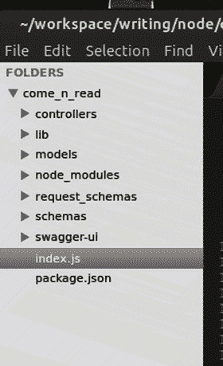
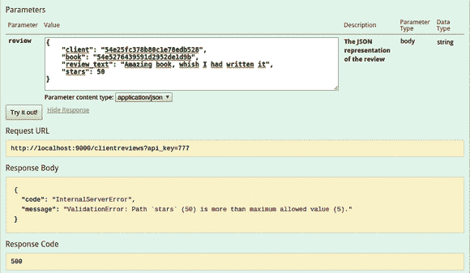

# 七、开发您的 REST API

现在我们已经最终定义了我们将使用的工具和我们将使用它们开发的项目，我们已经准备好实际开始编码了。本章将涵盖这一部分——从文件的组织(目录结构),到开发过程中做出的小的设计决策，最后到代码本身。

这一章将展示该项目的全部源代码，但我们将只讨论相关的部分。遗憾的是，有些部分非常无聊(比如 JSON 模式定义和更简单的模型)，所以我将跳过它。不管专业水平如何，这些东西对开发人员来说应该是不言自明的。

我将如下介绍开发阶段:

*   开发期间做出的微小简化/设计决策。
*   文件夹结构，因为了解所有东西的位置和原因总是很重要的。
*   代码本身，一个文件接一个文件，包括需要时的解释。

Note

本章中的代码只是解决第 [6](6.html) 章中提出的问题的无限可能的方法之一。它试图展示本书中提到的概念和模块。这也意味着只向您展示一个潜在的开发过程，它试图同时保持敏捷和动态。当然，这个过程有不同的方式，对每个读者来说可能更好或更坏。

## 对计划的小改动

我们花了整整两章的时间来研究不同的模块，并计划开发 API 的整个过程。我们制作了一些图表，甚至列出了我们需要的所有资源和端点。

然而，在开发过程中，计划会发生变化。不是很多，但我们仍然需要微调设计的某些方面。

不过，这不一定是件坏事。如果最初的计划发生了重大变化，那么是的，这将意味着我们肯定在计划中做错了什么；但是在这个阶段，除非你在设计阶段花更多的时间，否则小的改变是不可避免的。我在这里说的是完成全部九个步骤:编写详细的用例及其相应的边界条件、流程图——工作。这个过程——如果做得正确，并且被实现解决方案的团队所遵循——很可能在开发过程中没有任何变化。但是要做到这一点，我们需要更多的时间，让我们面对现实吧，除了开发中令人厌烦的部分(免责声明:如果你实际上更喜欢这一部分，而不是开发，那么你没有任何问题；我只是从来没有遇到过像你这样的人)，这也不是这本书的重点。

因此，我们可以玩设计，使用我们在上一章中做的部分分析和规划，并承担后果，正如您将看到的，后果非常小。

### 简化商店:员工关系

当我列出每个资源时，我说商店会保留一个员工列表，每个员工都会保留一个对商店的直接引用。然而，在 MongoDB 中维护这些关系意味着额外的工作。由于我们并不真的需要这样做，我们将只保留员工的记录，而不知道他们被分配到的商店，并确保每个商店都有在其中工作的员工。

### 添加 Swagger UI

我在第 [5](5.html) 章讲过 Swagger，也简单提到过 Swagger UI，但我从来没有真正解释过很多。Swagger UI 项目是我们将用来测试我们的 API 的 UI。swagger-node-express 和 swagger-node-restify 模块提供了 UI 所需的后端基础设施；但是没有 Swagger UI 项目，我们什么都没有。

因此，只需从 [`https://github.com/swagger-api/swagger-ui`](https://github.com/swagger-api/swagger-ui) 下载(或克隆回购)并将其添加到您的项目中。我稍后将介绍如何配置它。

### 简化的安全性

为了简化安全性，我们将在这样一个前提下工作，即我们并不是真的在做一个公共 API，而是为我们直接控制下的客户端做一个 API。

这意味着我们不会要求每个客户端都请求一个具有有限生命周期的访问令牌。相反，我们将在这样的假设下工作:当我们在一个新的分支机构中建立一个新的客户端时，我们共享这个秘密的密码短语；因此，客户端将总是发送使用该密码加密的 MAC 代码，API 将重新散列每个请求以确保两个结果匹配。通过这种方式，我们仍然在验证请求，并且我们对 REST 保持真实，因为这种方法是无状态的；我们只是没有简化新客户端应用的添加。

进一步解释一下，每个客户端在每次请求时都会发送两条非常具体的信息:

*   一个名为`hmacdata`的特殊头，其中的信息被加密。
*   带有加密结果值的`api_key`参数。

收到请求后，API 将从报头中获取数据，并使用正确的密码再次加密。如果结果与`api_key`参数的值相同，那么它会将请求标记为可信。否则，它会用 401 错误代码拒绝请求。

### 斯瓦格的一个小后门

我们做的另一个改变是因为 Swagger UI 对我们的身份验证方案没有事实上的支持。我们可以发送一个固定的`api_key`参数，但是我们必须改变客户端的代码，让它使用我们正在使用的算法。这就是为什么我们在代码中添加了一个小后门，让 Swagger UI 通过，而不需要验证每个请求。

破解非常简单。由于 UI 可以发送一个固定的`api_key`，我们将让所有具有等于 777 的`api_key`的请求通过，自动信任它们。当然，为了避免任何安全问题，在投入生产时需要移除这个后门。

### 手动音量调节

在第 [4](4.html) 章中，我回顾了 MVC 模式的几种变体，但从未真正选定一种用于我们的 API。就个人而言，我真的很喜欢分层 MVC 背后的想法，因为它允许一些真正干净的代码。也就是说，这也意味着开发时的额外工作。考虑到在一个控制器中处理来自另一个控制器的资源的情况并不多见，我们将尽量保持简单，使用基本的 MVC。

这意味着我们的项目将包含以下关键要素:

*   控制器:处理请求并调用模型进行进一步的操作。
*   模型:保存 API 的主要逻辑。因为在我们的简单例子中，逻辑基本上是查询数据库，这些将是 Mongoose 使用的模型。这将简化我们的架构。此外，Mongoose 提供了不同的机制来为我们的模型添加额外的行为(比如设置实例方法或动作后挂钩)。
*   视图:视图将以一种方法的形式嵌入到模型的代码中，该方法将一个模型的细节转换成可以返回给客户机的 HAL + JSON。

## 文件夹结构

为了完全理解我们的 API 背后的设计，让我们快速看一下我设置的文件夹结构(见图 [7-1](#Fig1) )。

图 7-1。

Project folder structure

以下是我们将创建和使用的文件夹:

*   这个文件夹包含了我们控制器的代码。它还有一个`index.js`文件来处理其余内容的导出。这里还有一个基控制器，包含了所有控制器应该有的所有泛型方法；所以每个新的控制器都可以扩展它并继承这些方法。
*   `lib`:这个文件夹包含的杂项代码不够大，不能有自己的文件夹，但是在我们的项目中需要跨几个不同的地方；例如，数据库访问、助手函数、配置文件等等。
*   这个文件夹里面是模型文件。通常，当使用 Mongoose 时，模型的文件有模式定义，您返回该模式的实例作为您的模型。在我们的例子中，实际的定义在其他地方，所以这段代码处理加载外部定义，添加特定于每个模型的额外行为，然后返回它。
*   `request_schemas`:这个文件夹中是用于验证不同请求的 JSON 模式。
*   这些是模型的 JSON 模式，用于 Swagger 模块定义用于测试的 UI 和 Mongoose 模型的定义。我们将不得不添加一些代码来从第一个翻译到后者，因为它们不使用相同的格式。
*   `swagger-ui`:这个文件夹包含了 Swagger UI 项目的内容。我们需要对`index.html`文件做一些小的调整，让它像我们期望的那样工作。

## 源代码

这里我将列出该项目的全部代码，如果需要的话，包括一些代码的基本描述。我将按照图 [7-1](#Fig1) 所示的顺序一个文件夹一个文件夹地进行。

### 控制器

/controllers/index.js

`module.exports = {`

`BookSales: require("./booksales"),`

`Stores: require("./stores"),`

`Employees: require("./employees"),`

`ClientReviews: require("./clientreviews"),`

`Clients: require("./clients"),`

`Books: require("./books"),`

`Authors: require("./authors")`

`}`

该文件用于导出每个控制器。使用这种技术，我们可以像导入一个模块一样导入整个文件夹:

`var controllers = require("/controllers")`

/controllers/basecontroller.js

`var _ = require("underscore"),`

`restify = require("restify"),`

`colors = require("colors"),`

`halson = require("halson")`

`function BaseController() {`

`this.actions = []`

`this.server = null`

`}`

`BaseController.prototype.setUpActions = function(app, sw) {`

`this.server = app`

`_.each(this.actions, function(act) {`

`var method = act['spec']['method']`

`//a bit of a logging message, to help us understand what’s going on under the hood`

`console.log("Setting up auto-doc for (", method, ") - ", act['spec']['nickname'])`

`sw['add' + method](act)`

`app[method.toLowerCase()](act['spec']['path'], act['action'])`

`})`

`}`

`BaseController.prototype.addAction = function(spec, fn) {`

`var newAct = {`

`'spec': spec,`

`action: fn`

`}`

`this.actions.push(newAct)`

`}`

`BaseController.prototype.RESTError = function(type, msg) {`

`if(restify[type]) {`

`return new restify[type](msg.toString())`

`} else {`

`console.log("Type " + type + " of error not found".red)`

`}`

`}`

`/**`

`Takes care of calling the "toHAL" method on every resource before writing it`

`back to the client`

`*/`

`BaseController.prototype.writeHAL = function(res, obj) {`

`if(Array.isArray(obj)) {`

`var newArr = []`

`_.each(obj, function(item, k) {`

`item = item.toHAL()`

`newArr.push(item)`

`})`

`obj = halson (newArr)`

`} else {`

`if(obj && obj.toHAL)`

`obj = obj.toHAL()`

`}`

`if(!obj) {`

`obj = {}`

`}`

`res.json(obj)`

`}`

`module.exports = BaseController`

每个控制器都扩展这个对象，获得对前面显示的方法的访问。我们将使用基本的原型继承，当我们开始列出其他控制器的代码时，你会看到。

至于这个，让我们快速浏览一下它公开的方法:

*   `setUpActions`:该方法在控制器实例化时调用；这意味着向 HTTP 服务器添加实际的路由。该方法在所有由`index.js`文件导出的控制器的初始化序列中被调用。
*   这个方法定义了一个动作，这个动作由动作的规范和实际的功能代码组成。Swagger 使用这些规范来创建文档，但是我们的代码也使用它们来设置路线；所以 JSON 规范中有一些也是针对服务器的，比如`path`和`method`属性。
*   这是一个简单的包装方法，包含了 Restify 提供的所有错误方法。 [1](#Fn1) 它提供了更干净代码的好处。
*   `writeHAL`:每个定义的模型(接下来你会看到)都有一个`toHAL`方法，`writeHAL`方法负责为我们试图渲染的每个模型调用它。它基本上集中了处理集合或简单对象的逻辑，这取决于我们要呈现的内容。

Tip

我们在这里使用`colors`模块以红色打印来自`RESTError`方法的错误消息。

/controllers/books.js

`var BaseController = require("./basecontroller"),`

`_ = require("underscore"),`

`swagger = require("swagger-node-restify")`

`function Books() {`

`}`

`Books.prototype = new BaseController()`

`module.exports = function(lib) {`

`var controller = new Books();`

`/**`

`Helper function for the POST action`

`*/`

`function mergeStores(list1, list2) {`

`var stores1 = {}`

`var stores2 = {}`

`_.each(list1, function(st) {`

`if(st.store)`

`stores1[st.store] = st.copies`

`})`

`_.each(list2, function(st) {`

`if(st.store)`

`stores2[st.store] = st.copies`

`})`

`var stores = _.extend(stores1, stores2)`

`return _.map(stores, function(v, k) {`

`return {store: k, copies: v}`

`})`

`}`

`controller.addAction({`

`'path': '/books',`

`'method': 'GET',`

`'summary': 'Returns the list of books',`

`"params": [ swagger.queryParam('q', 'Search term', 'string'), swagger.queryParam('genre','Filter by genre', 'string')],`

`'responseClass': 'Book',`

`'nickname': 'getBooks'`

`}, function(req, res, next) {`

`var criteria = {}`

`if(req.params.q) {`

`var expr = new RegExp('.*' + req.params.q + '.*')`

`criteria.$or = [`

`{title: expr},`

`{isbn_code: expr},`

`{description: expr}`

`]`

`}`

`if(req.params.genre) {`

`criteria.genre = req.params.genre`

`}`

`lib.db.model('Book')`

`.find(criteria)`

`.populate('stores.store')`

`.exec(function(err, books) {`

`if(err) return next(err)`

`controller.writeHAL(res, books)`

`})`

`})`

`controller.addAction({`

`'path': '/books/{id}',`

`'method': 'GET',`

`'params': [ swagger.pathParam('id', 'The Id of the book','int') ],`

`'summary': 'Returns the full data of a book',`

`'nickname': 'getBook'`

`}, function(req, res, next) {`

`var id = req.params.id`

`if(id) {`

`lib.db.model("Book")`

`.findOne({_id: id})`

`.populate('authors')`

`.populate('stores')`

`.populate('reviews')`

`.exec(function(err, book) {`

`if(err) return next(controller.RESTError('InternalServerError', err))`

`if(!book) {`

`return next(controller.RESTError('ResourceNotFoundError', 'Book not found'))`

`}`

`controller.writeHAL(res, book)`

`})`

`} else {`

`next(controller.RESTError('InvalidArgumentError', 'Missing book id'))`

`}`

`})`

`controller.addAction({`

`'path': '/books',`

`'method': 'POST',`

`'params': [ swagger.bodyParam('book', 'JSON representation of the new book','string') ],`

`'summary': 'Adds a new book into the collectoin',`

`'nickname': 'newBook'`

`}, function(req, res, next) {`

`var bookData = req.body`

`if(bookData) {`

`isbn = bookData.isbn_code`

`lib.db.model("Book")`

`.findOne({isbn_code: isbn})`

`.exec(function(err, bookModel) {`

`if(!bookModel) {`

`bookModel = lib.db.model("Book")(bookData)`

`} else {`

`bookModel.stores = mergeStores(bookModel.stores, bookData.stores)`

`}`

`bookModel.save(function(err, book) {`

`if(err) return next(controller.RESTError('InternalServerError', err))`

`controller.writeHAL(res, book)`

`})`

`})`

`} else {`

`next(controller.RESTError('InvalidArgumentError', 'Missing content of book'))`

`}`

`})`

`controller.addAction({`

`'path': '/books/{id}/authors',`

`'method': 'GET',`

`'params': [ swagger.pathParam('id', 'The Id of the book','int') ],`

`'summary': 'Returns the list of authors of one specific book',`

`'nickname': 'getBooksAuthors'`

`}, function(req, res, next) {`

`var id = req.params.id`

`if(id) {`

`lib.db.model("Book")`

`.findOne({_id: id})`

`.populate('authors')`

`.exec(function(err, book) {`

`if(err) return next(controller.RESTError('InternalServerError', err))`

`if(!book) {`

`return next(controller.RESTError('ResourceNotFoundError', 'Book not found'))`

`}`

`controller.writeHAL(res, book.authors)`

`})`

`} else {`

`next(controller.RESTError('InvalidArgumentError', 'Missing book id'))`

`}`

`})`

`controller.addAction({`

`'path': '/books/{id}/reviews',`

`'method': 'GET',`

`'params': [ swagger.pathParam('id', 'The Id of the book','int') ],`

`'summary': 'Returns the list of reviews of one specific book',`

`'nickname': 'getBooksReviews'`

`}, function(req, res,next) {`

`var id = req.params.id`

`if(id) {`

`lib.db.model("Book")`

`.findOne({_id: id})`

`.populate('reviews')`

`.exec(function(err, book) {`

`if(err) return next(controller.RESTError('InternalServerError', err))`

`if(!book) {`

`return next(controller.RESTError('ResourceNotFoundError', 'Book not found'))`

`}`

`controller.writeHAL(res, book.reviews)`

`})`

`} else {`

`next(controller.RESTError('InvalidArgumentError', 'Missing book id'))`

`}`

`})`

`controller.addAction({`

`'path': '/books/{id}',`

`'method': 'PUT',`

`'params': [ swagger.pathParam('id', 'The Id of the book to update','string'),`

`swagger.bodyParam('book', 'The data to change on the book', 'string') ],`

`'summary': 'Updates the information of one specific book',`

`'nickname': 'updateBook'`

`}, function(req, res, next) {`

`var data = req.body`

`var id = req.params.id`

`if(id) {`

`lib.db.model("Book").findOne({_id: id}).exec(function(err, book) {`

`if(err) return next(controller.RESTError('InternalServerError', err))`

`if(!book) return next(controller.RESTError('ResourceNotFoundError', 'Book not found'))`

`book = _.extend(book, data)`

`book.save(function(err, data) {`

`if(err) return next(controller.RESTError('InternalServerError', err))`

`controller.writeHAL(res, data.toJSON())`

`})`

`})`

`} else {`

`next(controller.RESTError('InvalidArgumentError', 'Invalid id received'))`

`}`

`})`

`return controller`

`}`

这个控制器的代码非常简单；其中包含了为这个特定项目定义的基本机制，即如何声明一个控制器及其动作。我们还有一个 POST 操作的特例，它检查一本新书的 ISBN，看它是否在另一家书店有库存。如果 ISBN 已经存在，这本书将被合并到所有相关的书店；否则，将创建一个新记录。

理论上，我们正在创建一个继承自`BaseController`的新函数，它使我们能够在特定的控制器上添加自定义行为。然而，现实将证明我们并不真的需要这样的自由。我们也可以通过在其他控制器文件上直接实例化`BaseController`来做同样的事情。

API 初始化期间需要控制器文件，当这种情况发生时，`lib`对象被传递给它们，如下所示:

`var controller = require("/controllers/books.js")(lib)`

这意味着(正如您在前面的代码中看到的)，导出函数接收到了`lib`对象，该函数负责实例化新的控制器，并向其添加动作以将其返回到所需的代码。

以下是代码中其他一些有趣的部分:

*   `getBooks`动作展示了如何使用 Mongoose 进行简单的基于正则表达式的过滤。
*   `update`动作实际上并没有使用来自 Mongoose 的`update`方法，而是使用来自下划线的`extend`方法加载模型，最后在模型上调用`save`方法。这样做的原因很简单:`update`方法不会触发模型上的任何 post 挂钩，但是`save`方法会，所以如果我们想要添加行为来对模型上的更新做出反应，这将是实现它的方法。

/controllers/stores.js

`var BaseController = require("./basecontroller"),`

`_ = require("underscore"),`

`swagger = require("swagger-node-restify")`

`function Stores() {`

`}`

`Stores.prototype = new BaseController()`

`module.exports = function(lib) {`

`var controller = new Stores();`

`controller.addAction({`

`'path': '/stores',`

`'method': 'GET',`

`'summary': 'Returns the list of stores ',`

`'params': [swagger.queryParam('state', 'Filter the list of stores by state', 'string')],`

`'responseClass': 'Store',`

`'nickname': 'getStores'`

`}, function (req, res, next) {`

`var criteria = {}`

`if(req.params.state) {`

`criteria.state = new RegExp(req.params.state,'i')`

`}`

`lib.db.model('Store')`

`.find(criteria)`

`.exec(function(err, list) {`

`if(err) return next(controller.RESTError('InternalServerError', err))`

`controller.writeHAL(res, list)`

`})`

`})`

`controller.addAction({`

`'path': '/stores/{id}',`

`'method': 'GET',`

`'params': [swagger.pathParam('id','The id of the store','string')],`

`'summary': 'Returns the data of a store',`

`'responseClass': 'Store',`

`'nickname': 'getStore'`

`}, function(req, res, next) {`

`var id = req.params.id`

`if(id) {`

`lib.db.model('Store')`

`.findOne({_id: id})`

`.populate('employees')`

`.exec(function(err, data) {`

`if(err) return next(controller.RESTError('InternalServerError', err))`

`if(!data) return next(controller.RESTError('ResourceNotFoundError', 'Store not found'))`

`controller.writeHAL(res, data)`

`})`

`} else {`

`next(controller.RESTError('InvalidArgumentError', 'Invalid id'))`

`}`

`})`

`controller.addAction({`

`'path': '/stores/{id}/books',`

`'method': 'GET',`

`'params': [swagger.pathParam('id','The id of the store','string'),`

`swagger.queryParam('q', 'Search parameter for the books', 'string'),`

`swagger.queryParam('genre', 'Filter results by genre', 'string')],`

`'summary': 'Returns the list of books of a store',`

`'responseClass': 'Book',`

`'nickname': 'getStoresBooks'`

`}, function (req, res, next) {`

`var id = req.params.id`

`if(id) {`

`var criteria = {stores: id}`

`if(req.params.q) {`

`var expr = new RegExp('.*' + req.params.q + '.*', 'i')`

`criteria.$or = [`

`{title: expr},`

`{isbn_code: expr},`

`{description: expr}`

`]`

`}`

`if(req.params.genre) {`

`criteria.genre = req.params.genre`

`}`

`//even though this is the stores controller, we deal directly with books here`

`lib.db.model('Book')`

`.find(criteria)`

`.populate('authors')`

`.exec(function(err, data) {`

`if(err) return next(controller.RESTError('InternalServerError', err))`

`controller.writeHAL(res, data)`

`})`

`} else {`

`next(controller.RESTError('InvalidArgumentError', 'Invalid id'))`

`}`

`})`

`controller.addAction({`

`'path': '/stores/{id}/employees',`

`'method': 'GET',`

`'params': [swagger.pathParam('id','The id of the store','string')],`

`'summary': 'Returns the list of employees working on a store',`

`'responseClass': 'Employee',`

`'nickname': 'getStoresEmployees'`

`}, function (req, res, next) {`

`var id = req.params.id`

`if(id) {`

`lib.db.model('Store')`

`.findOne({_id: id})`

`.populate('employees')`

`.exec(function(err, data) {`

`if(err) return next(controller.RESTError('InternalServerError', err))`

`if(!data) {`

`return next(controller.RESTError('ResourceNotFoundError', 'Store not found'))`

`}`

`console.log(data)`

`controller.writeHAL(res, data.employees)`

`})`

`} else {`

`next(controller.RESTError('InvalidArgumentError', 'Invalid id'))`

`}`

`})`

`controller.addAction({`

`'path': '/stores/{id}/booksales',`

`'method': 'GET',`

`'params': [swagger.pathParam('id','The id of the store','string')],`

`'summary': 'Returns the list of booksales done on a store',`

`'responseClass': 'BookSale',`

`'nickname': 'getStoresBookSales'`

`}, function (req, res, next) {`

`var id = req.params.id`

`if(id) {`

`//even though this is the stores controller, we deal directly with booksales here`

`lib.db.model('Booksale')`

`.find({store: id})`

`.populate('client')`

`.populate('employee')`

`.populate('books')`

`.exec(function(err, data) {`

`if(err) return next(controller.RESTError('InternalServerError', err))`

`controller.writeHAL(res, data)`

`})`

`} else {`

`next(controller.RESTError('InvalidArgumentError', 'Invalid id'))`

`}`

`})`

`controller.addAction({`

`'path': '/stores',`

`'method': 'POST',`

`'summary': 'Adds a new store to the list',`

`'params': [swagger.bodyParam('store', 'The JSON data of the store', 'string')],`

`'responseClass': 'Store',`

`'nickname': 'newStore'`

`}, function (req, res, next) {`

`var data = req.body`

`if(data) {`

`var newStore = lib.db.model('Store')(data)`

`newStore.save(function(err, store) {`

`if(err) return next(controller.RESTError('InternalServerError', err))`

`res.json(controller.toHAL(store))`

`})`

`} else {`

`next(controller.RESTError('InvalidArgumentError', 'No data received'))`

`}`

`})`

`controller.addAction({`

`'path': '/stores/{id}',`

`'method': 'PUT',`

`'summary': "UPDATES a store's information",`

`'params': [swagger.pathParam('id','The id of the store','string'), swagger.bodyParam('store', 'The new information to update', 'string')],`

`'responseClass': 'Store',`

`'nickname': 'updateStore'`

`}, function (req, res, next) {`

`var data = req.body`

`var id = req.params.id`

`if(id) {`

`lib.db.model("Store").findOne({_id: id}).exec(function(err, store) {`

`if(err) return next(controller.RESTError('InternalServerError', err))`

`if(!store) return next(controller.RESTError('ResourceNotFoundError', 'Store not found'))`

`store = _.extend(store, data)`

`store.save(function(err, data) {`

`if(err) return next(controller.RESTError('InternalServerError', err))`

`res.json(controller.toHAL(data))`

`})`

`})`

`} else {`

`next(controller.RESTError('InvalidArgumentError', 'Invalid id received'))`

`}`

`})`

`return controller`

`}`

商店控制器的代码与书籍控制器的代码非常相似。然而，它确实有一些值得注意的地方:`getStoresBookSales`动作清楚地显示了当我们不使用分层 MVC 模型时会发生什么。我说过这不是一个常见的情况，所以对于本书的目的来说这是很好的，但是它显示了关注点的分离是如何在最严格的意义上被另一个控制器的模型打破的，而不是通过那个控制器。考虑到这种机制会给我们的代码带来额外的复杂性，我们最好暂时换个方式。

以下是剩余的控制器。与之前的代码相比，它们并没有特别展示什么新的东西，所以只需要看看代码和偶尔的代码注释。

/controllers/authors.js

`var BaseController = require("./basecontroller"),`

`swagger = require("swagger-node-restify")`

`function BookSales() {`

`}`

`BookSales.prototype = new BaseController()`

`module.exports = function(lib) {`

`var controller = new BookSales()`

`//list`

`controller.addAction({`

`'path': '/authors',`

`'method': 'GET',`

`'summary' :'Returns the list of authors across all stores',`

`'params': [ swagger.queryParam('genre', 'Filter authors by genre of their books', 'string'),`

`swagger.queryParam('q', 'Search parameter', 'string')],`

`'responseClass': 'Author',`

`'nickname': 'getAuthors'`

`}, function(req, res, next) {`

`var criteria = {}`

`if(req.params.q) {`

`var expr = new RegExp('.*' + req.params.q + '.*', 'i')`

`criteria.$or = [`

`{name: expr},`

`{description: expr}`

`]`

`}`

`var filterByGenre = false || req.params.genre`

`if(filterByGenre) {`

`lib.db.model('Book')`

`.find({genre: filterByGenre})`

`.exec(function(err, books) {`

`if(err) return next(controller.RESTError('InternalServerError', err))`

`findAuthors(_.pluck(books, '_id'))`

`})`

`} else {`

`findAuthors()`

`}`

`function findAuthors(bookIds) {`

`if(bookIds) {`

`criteria.books = {$in: bookIds}`

`}`

`lib.db.model('Author')`

`.find(criteria)`

`.exec(function(err, authors) {`

`if(err) return next(controller.RESTError('InternalServerError', err))`

`controller.writeHAL(res, authors)`

`})`

`}`

`})`

`//get`

`controller.addAction({`

`'path': '/authors/{id}',`

`'summary': 'Returns all the data from one specific author',`

`'method': 'GET',`

`'responseClass': 'Author',`

`'nickname': 'getAuthor'`

`}, function (req, res, next) {`

`var id = req.params.id`

`if(id) {`

`lib.db.model('Author')`

`.findOne({_id: id})`

`.exec(function(err, author) {`

`if(err) return next(controller.RESTError('InternalServerError', err))`

`if(!author) {`

`return next(controller.RESTError('ResourceNotFoundError', 'Author not found'))`

`}`

`controller.writeHAL(res, author)`

`})`

`} else {`

`next(controller.RESTError('InvalidArgumentError', 'Missing author id'))`

`}`

`})`

`//post`

`controller.addAction({`

`'path': '/authors',`

`'summary': 'Adds a new author to the database',`

`'method': 'POST',`

`'params': [swagger.bodyParam('author', 'JSON representation of the data', 'string')],`

`'responseClass': 'Author',`

`'nickname': 'addAuthor'`

`}, function (req, res, next) {`

`var body = req.body`

`if(body) {`

`var newAuthor = lib.db.model('Author')(body)`

`newAuthor.save(function(err, author) {`

`if(err) return next(controller.RESTError('InternalServerError', err))`

`controller.writeHAL(res, author)`

`})`

`} else {`

`next(controller.RESTError('InvalidArgumentError', 'Missing author id'))`

`}`

`})`

`//put`

`controller.addAction({`

`'path': '/authors/{id}',`

`'method': 'PUT',`

`'summary': "UPDATES an author's information",`

`'params': [swagger.pathParam('id','The id of the author','string'),`

`swagger.bodyParam('author', 'The new information to update', 'string')],`

`'responseClass': 'Author',`

`'nickname': 'updateAuthor'`

`}, function (req, res, next) {`

`var data = req.body`

`var id = req.params.id`

`if(id) {`

`lib.db.model("Author").findOne({_id: id}).exec(function(err, author) {`

`if(err) return next(controller.RESTError('InternalServerError', err))`

`if(!author) return next(controller.RESTError('ResourceNotFoundError', 'Author not found'))`

`author = _.extend(author, data)`

`author.save(function(err, data) {`

`if(err) return next(controller.RESTError('InternalServerError', err))`

`res.json(controller.toHAL(data))`

`})`

`})`

`} else {`

`next(controller.RESTError('InvalidArgumentError', 'Invalid id received'))`

`}`

`})`

`// /books`

`controller.addAction({`

`'path': '/authors/{id}/books',`

`'summary': 'Returns the data from all the books of one specific author',`

`'method': 'GET',`

`'params': [ swagger.pathParam('id', 'The id of the author', 'string')],`

`'responseClass': 'Book',`

`'nickname': 'getAuthorsBooks'`

`}, function (req, res, next) {`

`var id = req.params.id`

`if(id) {`

`lib.db.model('Author')`

`.findOne({_id: id})`

`.populate('books')`

`.exec(function(err, author) {`

`if(err) return next(controller.RESTError('InternalServerError', err))`

`if(!author) {`

`return next(controller.RESTError('ResourceNotFoundError', 'Author not found'))`

`}`

`controller.writeHAL(res, author.books)`

`})`

`} else {`

`next(controller.RESTError('InvalidArgumentError', 'Missing author id'))`

`}`

`})`

`return controller`

`}`

/controllers/booksales.js

`var BaseController = require("./basecontroller"),`

`swagger = require("swagger-node-restify")`

`function BookSales() {`

`}`

`BookSales.prototype = new BaseController()`

`module.exports = function(lib) {`

`var controller = new BookSales();`

`controller.addAction({`

`'path': '/booksales',`

`'method': 'GET',`

`'summary': 'Returns the list of book sales',`

`'params': [ swagger.queryParam('start_date', 'Filter sales done after (or on) this date', 'string'),`

`swagger.queryParam('end_date', 'Filter sales done on or before this date', 'string'),`

`swagger.queryParam('store_id', 'Filter sales done on this store', 'string')`

`],`

`'responseClass': 'BookSale',`

`'nickname': 'getBookSales'`

`}, function(req, res, next) {`

`console.log(req)`

`var criteria = {}`

`if(req.params.start_date)`

`criteria.date = {$gte: req.params.start_date}`

`if(req.params.end_date)`

`criteria.date = {$lte: req.params.end_date}`

`if(req.params.store_id)`

`criteria.store = req.params.store_id`

`lib.db.model("Booksale")`

`.find(criteria)`

`.populate('books')`

`.populate('client')`

`.populate('employee')`

`.populate('store')`

`.exec(function(err, sales) {`

`if(err) return next(controller.RESTError('InternalServerError', err))`

`controller.writeHAL(res, sales)`

`})`

`})`

`controller.addAction({`

`'path': '/booksales',`

`'method': 'POST',`

`'params': [ swagger.bodyParam('booksale', 'JSON representation of the new booksale','string') ],`

`'summary': 'Records a new booksale',`

`'nickname': 'newBookSale'`

`}, function(req, res, next) {`

`var body = req.body`

`if(body) {`

`var newSale = lib.db.model("Booksale")(body)`

`newSale.save(function(err, sale) {`

`if(err) return next(controller.RESTError('InternalServerError', err))`

`controller.writeHAL(res, sale)`

`})`

`} else {`

`next(controller.RESTError('InvalidArgumentError', 'Missing json data'))`

`}`

`})`

`return controller`

`}`

/controllers/clientreviews.js

`var BaseController = require("./basecontroller"),`

`_ = require("underscore"),`

`swagger = require("swagger-node-restify")`

`function ClientReviews() {`

`}`

`ClientReviews.prototype = new BaseController()`

`module.exports = function(lib) {`

`var controller = new ClientReviews();`

`controller.addAction({`

`'path': '/clientreviews',`

`'method': 'POST',`

`'summary': 'Adds a new client review to a book',`

`'params': [swagger.bodyParam('review', 'The JSON representation of the review', 'string')],`

`'responseClass': 'ClientReview',`

`'nickname': 'addClientReview'`

`}, function (req, res, next) {`

`var body = req.body`

`if(body) {`

`var newReview = lib.db.model('ClientReview')(body)`

`newReview.save(function (err, rev) {`

`if(err) return next(controller.RESTError('InternalServerError', err))`

`controller.writeHAL(res, rev)`

`})`

`}`

`})`

`return controller`

`}`

/controllers/clients.js

`var BaseController = require("./basecontroller"),`

`_ = require("underscore"),`

`swagger = require("swagger-node-restify")`

`function Clients() {`

`}`

`Clients.prototype = new BaseController()`

`module.exports = function(lib) {`

`var controller = new Clients();`

`controller.addAction({`

`'path': '/clients',`

`'method': 'GET',`

`'summary': 'Returns the list of clients ordered by name',`

`'responsClass':'Client',`

`'nickname': 'getClients'`

`}, function(req, res, next) {`

`lib.db.model('Client').find().sort('name').exec(function(err, clients) {`

`if(err) return next(controller.RESTError('InternalServerError', err))`

`controller.writeHAL(res, clients)`

`})`

`})`

`controller.addAction({`

`'path': '/clients',`

`'method': 'POST',`

`'params': [swagger.bodyParam('client', 'The JSON representation of the client', 'string')],`

`'summary': 'Adds a new client to the database',`

`'responsClass': 'Client',`

`'nickname': 'addClient'`

`}, function(req, res, next) {`

`var newClient = req.body`

`var newClientModel = lib.db.model('Client')(newClient)`

`newClientModel.save(function(err, client) {`

`if(err) return next(controller.RESTError('InternalServerError', err))`

`controller.writeHAL(res, client)`

`})`

`})`

`controller.addAction({`

`'path': '/clients/{id}',`

`'method': 'GET',`

`'params': [swagger.pathParam('id', 'The id of the client', 'string')],`

`'summary': 'Returns the data of one client',`

`'responsClass': 'Client',`

`'nickname': 'getClient'`

`}, function (req, res, next) {`

`var id = req.params.id`

`if(id != null) {`

`lib.db.model('Client').findOne({_id: id}).exec(function(err, client){`

`if(err) return next(controller.RESTError('InternalServerError',err))`

`if(!client) return next(controller.RESTError('ResourceNotFoundError', 'The client id cannot be found'))`

`controller.writeHAL(res, client)`

`})`

`} else {`

`next(controller.RESTError('InvalidArgumentError','Invalid client id'))`

`}`

`})`

`controller.addAction({`

`'path': '/clients/{id}',`

`'method': 'PUT',`

`'params': [swagger.pathParam('id', 'The id of the client', 'string'), swagger.bodyParam('client', 'The content to overwrite', 'string')],`

`'summary': 'Updates the data of one client',`

`'responsClass': 'Client',`

`'nickname': 'updateClient'`

`}, function (req, res, next) {`

`var id = req.params.id`

`if(!id) {`

`return next(controller.RESTError('InvalidArgumentError','Invalid id'))`

`} else {`

`var model = lib.db.model('Client')`

`model.findOne({_id: id})`

`.exec(function(err, client) {`

`if(err) return next(controller.RESTError('InternalServerError', err))`

`client = _.extend(client, req.body)`

`client.save(function(err, newClient) {`

`if(err) return next(controller.RESTError('InternalServerError', err))`

`controller.writeHAL(res, newClient)`

`})`

`})`

`}`

`})`

`return controller`

`}`

/controllers/employees.js

`var BaseController = require("./basecontroller"),`

`_ = require("underscore"),`

`swagger = require("swagger-node-restify")`

`function Employees() {`

`}`

`Employees.prototype = new BaseController()`

`module.exports = function(lib) {`

`var controller = new Employees();`

`controller.addAction({`

`'path': '/employees',`

`'method': 'GET',`

`'summary': 'Returns the list of employees across all stores',`

`'responseClass': 'Employee',`

`'nickname': 'getEmployees'`

`}, function(req, res, next) {`

`lib.db.model('Employee').find().exec(function(err, list) {`

`if(err) return next(controller.RESTError('InternalServerError', err))`

`controller.writeHAL(res, list)`

`})`

`})`

`controller.addAction({`

`'path': '/employees/{id}',`

`'method': 'GET',`

`'params': [swagger.pathParam('id','The id of the employee','string')],`

`'summary': 'Returns the data of an employee',`

`'responseClass': 'Employee',`

`'nickname': 'getEmployee'`

`}, function(req, res, next) {`

`var id = req.params.id`

`if(id) {`

`lib.db.model('Employee').findOne({_id: id}).exec(function(err, empl) {`

`if(err) return next(err)`

`if(!empl) {`

`return next(controller.RESTError('ResourceNotFoundError', 'Not found'))`

`}`

`controller.writeHAL(res, empl)`

`})`

`} else {`

`next(controller.RESTError('InvalidArgumentError', 'Invalid id'))`

`}`

`})`

`controller.addAction({`

`'path': '/employees',`

`'method': 'POST',`

`'params': [swagger.bodyParam('employee', 'The JSON data of the employee', 'string')],`

`'summary': 'Adds a new employee to the list',`

`'responseClass': 'Employee',`

`'nickname': 'newEmployee'`

`}, function(req, res, next) {`

`var data = req.body`

`if(data) {`

`var newEmployee = lib.db.model('Employee')(data)`

`newEmployee.save(function(err, emp) {`

`if(err) return next(controller.RESTError('InternalServerError', err))`

`controller.writeHAL(res, emp)`

`})`

`} else {`

`next(controller.RESTError('InvalidArgumentError', 'No data received'))`

`}`

`})`

`controller.addAction({`

`'path': '/employees/{id}',`

`'method': 'PUT',`

`'summary': "UPDATES an employee's information",`

`'params': [swagger.pathParam('id','The id of the employee','string'), swagger.bodyParam('employee', 'The new information to update', 'string')],`

`'responseClass': 'Employee',`

`'nickname': 'updateEmployee'`

`}, function(req, res, next) {`

`var data = req.body`

`var id = req.params.id`

`if(id) {`

`lib.db.model("Employee").findOne({_id: id}).exec(function(err, emp) {`

`if(err) return next(controller.RESTError('InternalServerError', err))`

`emp = _.extend(emp, data)`

`emp.save(function(err, employee) {`

`if(err) return next(controller.RESTError('InternalServerError', err))`

`controller.writeHAL(res, employee)`

`})`

`})`

`} else {`

`next(controller.RESTError('InvalidArgumentError','Invalid id received'))`

`}`

`})`

`return controller`

`}`

### 解放运动

如前所述，`lib`文件夹包含了各种各样的助手函数和实用程序，它们太小了，不能放在一个单独的文件夹中，但是足够重要和通用，可以在代码的几个地方使用。

/lib/index.js

`var lib = {`

`helpers: require("./helpers"),`

`config: require("./config"),`

`controllers: require("../controllers"),`

`schemas: require("../schemas"),`

`schemaValidator: require("./schemaValidator"),`

`db: require("./db")`

`}`

`module.exports = lib`

该文件被认为是外部世界(项目的其余部分)和内部世界(该文件夹中分组的所有迷你模块)之间的单点联系。没什么特别的。它只需要一切，并使用预定义的密钥导出。

/lib/helpers.js

`var halson = require("halson"),`

`_ = require("underscore")`

`module.exports = {`

`makeHAL: makeHAL,`

`setupRoutes: setupRoutes,`

`validateKey: validateKey`

`}`

`function setupRoutes(server, swagger, lib) {`

`for(controller in lib.controllers) {`

`cont = lib.controllers[controller](lib)`

`cont.setUpActions(server, swagger)`

`}`

`}`

`/**`

`Makes sure to sign every request and compare it`

`against the key sent by the client, this way`

`we make sure its authentic`

`*/`

`function validateKey(hmacdata, key, lib) {`

`//This is for testing the swagger-ui, should be removed after development to avoid possible security problem :)`

`if(+key == 777) return true`

`var hmac = require("crypto").createHmac("md5", lib.config.secretKey)`

`.update(hmacdata)`

`.digest("hex");`

`//TODO: Remove this line`

`console.log(hmac)`

`return hmac == key`

`}`

`function makeHAL(data, links, embed) {`

`var obj = halson(data)`

`if(links && links.length > 0) {`

`_.each(links, function(lnk) {`

`obj.addLink(lnk.name, {`

`href: lnk.href,`

`title: lnk.title || ''`

`})`

`})`

`}`

`if(embed && embed.length > 0) {`

`_.each(embed, function (item) {`

`obj.addEmbed(item.name, item.data)`

`})`

`}`

`return obj`

`}`

正如由`index.js`文件导出的模块太小而不值得拥有它们自己的文件夹一样，这些函数也太小且太特殊而不值得拥有它们自己的模块，所以它们被分组在这里，在 helpers 模块内。这些功能意味着在整个项目中都是有用的(因此被命名为“助手”)。

让我们快速浏览一下这些名字:

*   `setupRoutes`:该函数在启动时从项目主文件中调用。这意味着初始化所有的控制器，进而将实际的路由代码添加到 HTTP 服务器。
*   `validateKey`:该函数包含通过重新计算 HMAC 密钥来验证请求的代码。如前所述，它包含规则的例外，允许任何请求验证发送的密钥是否为 777。
*   `makeHAL`:这个函数把任何类型的对象变成一个 HAL JSON 对象，准备渲染。这个特殊的函数在模型代码中被大量使用。

/lib/schemaValidator.js

`var tv4 = require("tv4"),`

`formats = require("tv4-formats"),`

`schemas = require("../request_schemas/")`

`module.exports = {`

`validateRequest: validate`

`}`

`function validate (req) {`

`var res = {valid: true}`

`tv4.addFormat(formats)`

`var schemaKey = req.route ? req.route.path.toString().replace("/", "") : ''`

`var actionKey = req.route.name`

`if(schemas[schemaKey]) {`

`var mySchema = schemas[schemaKey][actionKey]`

`var data = null`

`if(mySchema) {`

`switch(mySchema.validate) {`

`case 'params':`

`data = req.params`

`break`

`}`

`res = tv4.validateMultiple(data, mySchema.schema)`

`}`

`}`

`return res`

`}`

该文件包含根据我们定义的 JSON 模式验证任何请求的代码。唯一感兴趣的函数是`validate`函数，它验证请求对象。它还依赖于请求中的预定义结构，这是由 Swagger 添加的(`route`属性)。

正如您从前面的代码中可能已经猜到的，请求的验证是可选的；并非每个请求都被验证。目前，只有查询参数被验证，但是这可以通过简单地向 switch 语句添加一个新的 case 来扩展。

这个函数在“约定优于配置”的前提下工作，这意味着如果您“正确地”设置了所有东西，那么您不需要做太多事情。在我们的特殊例子中，我们在查看`request_schemas`文件夹以加载一组预定义的模式，这些模式具有非常特定的格式。在这种格式中，我们找到了要验证的动作的名称(我们设置的昵称)和我们想要验证的请求部分。在我们的特定函数中，我们只验证诸如无效格式之类的查询参数。我们现在设置要验证的唯一请求是 BookSales listing 动作；但是如果我们想要添加一个新的验证，只需要添加一个新的模式就可以了——不需要编程。

/lib/db.js

`var config = require("./config"),`

`_ = require("underscore"),`

`mongoose = require("mongoose"),`

`Schema = mongoose.Schema`

`var obj = {`

`cachedModels: {},`

`getModelFromSchema: getModelFromSchema,`

`model: function(mname) {`

`return this.models[mname]`

`},`

`connect: function(cb) {`

`mongoose.connect(config.database.host + "/" + config.database.dbname)`

`this.connection = mongoose.connection`

`this.connection.on('error', cb)`

`this.connection.on('open', cb)`

`}`

`}`

`obj.models = require("../models/")(obj)`

`module.exports = obj`

`function translateComplexType(v, strType) {`

`var tmp = null`

`var type = strType || v['type']`

`switch(type) {`

`case 'array':`

`tmp = []`

`if(v['items']['$ref'] != null) {`

`tmp.push({`

`type: Schema.ObjectId,`

`ref: v['items']['$ref']`

`})`

`} else {`

`var originalType = v['items']['type']`

`v['items']['type'] = translateTypeToJs(v['items']['type'])`

`tmp.push(translateComplexType(v['items'], originalType))`

`}`

`break;`

`case 'object':`

`tmp = {}`

`var props = v['properties']`

`_.each(props, function(data, k) {`

`if(data['$ref'] != null) {`

`tmp[k] = {`

`type: Schema.ObjectId,`

`ref: data['$ref']`

`}`

`} else {`

`tmp[k] = translateTypeToJs(data['type'])`

`}`

`})`

`break;`

`default:`

`tmp = v`

`tmp['type'] = translateTypeToJs(type)`

`break;`

`}`

`return tmp`

`}`

`/**`

`Turns the JSON Schema into a Mongoose schema`

`*/`

`function getModelFromSchema(schema) {`

`var data = {`

`name: schema.id,`

`schema: {}`

`}`

`var newSchema = {}`

`var tmp = null`

`_.each(schema.properties, function(v, propName) {`

`if(v['$ref'] != null) {`

`tmp = {`

`type: Schema.ObjectId,`

`ref: v['$ref']`

`}`

`} else {`

`tmp = translateComplexType(v) //{}`

`}`

`newSchema[propName] = tmp`

`})`

`data.schema = new Schema(newSchema)`

`return data`

`}`

`function translateTypeToJs(t) {`

`if(t.indexOf('int') === 0) {`

`t = "number"`

`}`

`return eval(t.charAt(0).toUpperCase() + t.substr(1))`

`}`

这个文件包含了一些有趣的函数，这些函数在模型代码中经常用到。在第 5 章中，我提到了 Swagger 使用的模式可能会被重用来做其他事情，比如定义模型的模式。但是要做到这一点，我们需要一个函数将标准 JSON 模式翻译成 Mongoose 定义模型所需的非标准 JSON 格式。这就是`getModelFromSchema`函数发挥作用的地方；它的代码旨在检查 JSON 模式的结构，并创建一个新的、更简单的 JSON 结构，用作 Mongoose 模式。

其他函数更简单:

*   connect:连接到数据库服务器，并为错误和成功情况设置回调。
*   模型:从外部访问模型。我们可以使用对象模型直接访问模型，但是提供一个包装器总是一个好主意，以防您需要添加额外的行为(比如检查错误)。

/lib/config.js

`module.exports = {`

`secretKey: 'this is a secret key, right here',`

`server: {`

`name: 'ComeNRead API',`

`version: '1.0.0',`

`port: 9000`

`},`

`database: {`

`host: 'mongodb://localhost',`

`dbname: 'comenread'`

`}`

`}`

这个文件非常简单；它只是导出一组常量值，供整个应用使用。

### 模型

该文件夹包含每个模型的实际代码。这些资源的定义不会在这些文件中找到，因为它们只是用来定义行为的。实际的属性是在`schemas`文件夹中定义的(模型和 Swagger 都在使用这个文件夹)。

/models/index.js

`module.exports = function(db) {`

`return {`

`"Book": require("./book")(db),`

`"Booksale": require("./booksale")(db),`

`"ClientReview": require("./clientreview")(db),`

`"Client": require("./client")(db),`

`"Employee": require("./employee")(db),`

`"Store": require("./store")(db),`

`"Author": require("./author")(db)`

`}`

`}`

同样，和其他文件夹一样，`index.js`文件允许我们一次请求每个模型，并把这个文件夹当作一个模块。这里需要注意的另一件事是将`db`对象传递给每个模型，以便它们可以访问`getModelFromSchema`函数。

/models/author.js

`var mongoose = require("mongoose")`

`jsonSelect = require('mongoose-json-select'),`

`helpers = require("../lib/helpers"),`

`_ = require("underscore")`

`module.exports = function(db) {`

`var schema = require("../schemas/author.js")`

`var modelDef = db.getModelFromSchema(schema)`

`modelDef.schema.plugin(jsonSelect, '-books')`

`modelDef.schema.methods.toHAL = function() {`

`var halObj = helpers.makeHAL(this.toJSON(),`

`[{name: 'books', 'href': '/authors/' + this.id + '/books', 'title': 'Books'}])`

`if(this.books.length > 0) {`

`if(this.books[0].toString().length != 24) {`

`halObj.addEmbed('books', _.map(this.books, function(e) { return e.toHAL() }))`

`}`

`}`

`return halObj`

`}`

`return mongoose.model(modelDef.name, modelDef.schema)`

`}`

作者模型的代码展示了加载 JSON 模式、将其转换为 Mongoose 模式、定义自定义行为以及最终返回新模型的基本机制。

下面定义了主要的自定义行为:

*   `jsonSelect`模型允许我们定义在将对象转换成 JSON 时要添加或删除的属性。我们希望从 JSON 表示中删除嵌入对象，因为它们将作为嵌入对象添加到 HAL JSON 表示中，而不是作为主对象的一部分。
*   `toHAL`方法负责以 JSON HAL 格式返回资源的表示。
*   与主对象相关联的链接是手动定义的。我们可以通过进一步定制用于模型的 JSON 模式的加载和转换的代码来改进这一点。

Note

类似下面的检查(在`toHAL`方法中)意在确定模型是否已经填充了一个引用，或者它仅仅是被引用对象的 id:

`if(this.books[0].toString().length != 24) {`

`//…`

`}`

下面是 models 文件夹中的其余代码，正如您所理解的，相同的机制在每种情况下都是重复的。

/models/book.js

`var mongoose = require("mongoose"),`

`jsonSelect = require('mongoose-json-select'),`

`helpers = require("../lib/helpers"),`

`_ = require("underscore")`

`module.exports = function(db) {`

`var schema = require("../schemas/book.js")`

`var modelDef = db.getModelFromSchema(schema)`

`modelDef.schema.plugin(jsonSelect, '-stores -authors')`

`modelDef.schema.methods.toHAL = function() {`

`var halObj = helpers.makeHAL(this.toJSON(),`

`[{name: 'reviews', href: '/books/' + this.id + '/reviews', title: 'Reviews'}])`

`if(this.stores.length > 0) {`

`if(this.stores[0].store.toString().length != 24) {`

`halObj.addEmbed('stores', _.map(this.stores, function(s) { return { store: s.store.toHAL(), copies: s.copies } } ))`

`}`

`}`

`if(this.authors.length > 0) {`

`if(this.authors[0].toString().length != 24) {`

`halObj.addEmbed('authors', this.authors)`

`}`

`}`

`return halObj`

`}`

`return mongoose.model(modelDef.name, modelDef.schema)`

`}`

/models/booksale.js

`var mongoose = require("mongoose"),`

`jsonSelect = require('mongoose-json-select'),`

`helpers = require("../lib/helpers"),`

`_ = require("underscore")`

`module.exports = function(db) {`

`var schema = require("../schemas/booksale.js")`

`var modelDef = db.getModelFromSchema(schema)`

`modelDef.schema.plugin(jsonSelect, '-store -employee -client -books')`

`modelDef.schema.methods.toHAL = function() {`

`var halObj = helpers.makeHAL(this.toJSON())`

`if(this.books.length > 0) {`

`if(this.books[0].toString().length != 24) {`

`halObj.addEmbed('books', _.map(this.books, function(b) { return b.toHAL() }))`

`}`

`}`

`if(this.store.toString().length != 24) {`

`halObj.addEmbed('store', this.store.toHAL())`

`}`

`if(this.employee.toString().length != 24) {`

`halObj.addEmbed('employee', this.employee.toHAL())`

`}`

`if(this.client.toString().length != 24) {`

`halObj.addEmbed('client', this.client.toHAL())`

`}`

`return halObj`

`}`

`return mongoose.model(modelDef.name, modelDef.schema)`

`}`

/models/client.js

`var mongoose = require("mongoose"),`

`jsonSelect = require('mongoose-json-select'),`

`helpers = require("../lib/helpers"),`

`_ = require("underscore")`

`module.exports = function(db) {`

`var schema = require("../schemas/client.js")`

`var modelDef = db.getModelFromSchema(schema)`

`modelDef.schema.methods.toHAL = function() {`

`var halObj = helpers.makeHAL(this.toJSON())`

`return halObj`

`}`

`return mongoose.model(modelDef.name, modelDef.schema)`

`}`

/models/clientreview.js

`var mongoose = require("mongoose"),`

`jsonSelect = require('mongoose-json-select'),`

`helpers = require("../lib/helpers"),`

`_ = require("underscore")`

`module.exports = function(db) {`

`var schema = require("../schemas/clientreview.js")`

`var modelDef = db.getModelFromSchema(schema)`

`modelDef.schema.methods.toHAL = function() {`

`var halObj = helpers.makeHAL(this.toJSON())`

`return halObj`

`}`

`modelDef.schema.post('save', function(doc, next) {`

`db.model('Book').update({_id: doc.book}, {$addToSet: {reviews: this.id}}, function(err) {`

`next(err)`

`})`

`})`

`return mongoose.model(modelDef.name, modelDef.schema)`

`}`

/models/employee.js

`var mongoose = require("mongoose"),`

`jsonSelect = require('mongoose-json-select'),`

`helpers = require("../lib/helpers"),`

`_ = require("underscore")`

`module.exports = function(db) {`

`var schema = require("../schemas/employee.js")`

`var modelDef = db.getModelFromSchema(schema)`

`modelDef.schema.methods.toHAL = function() {`

`var halObj = helpers.makeHAL(this.toJSON())`

`return halObj`

`}`

`return mongoose.model(modelDef.name, modelDef.schema)`

`}`

/models/store.js

`var mongoose = require("mongoose"),`

`jsonSelect = require("mongoose-json-select"),`

`_ = require("underscore"),`

`helpers = require("../lib/helpers")`

`module.exports = function(db) {`

`var schema = require("../schemas/store.js")`

`var modelDef = db.getModelFromSchema(schema)`

`modelDef.schema.plugin(jsonSelect, '-employees')`

`modelDef.schema.methods.toHAL = function() {`

`var halObj = helpers.makeHAL(this.toJSON(),`

`[{name: 'books', href: '/stores/' + this.id + '/books', title: 'Books'},`

`{name: 'booksales', href: '/stores/' + this.id + '/booksales', title: 'Book Sales'}])`

`if(this.employees.length > 0) {`

`if(this.employees[0].toString().length != 24) {`

`halObj.addEmbed('employees', _.map(this.employees, function(e) { return e.toHAL() }))`

`}`

`}`

`return halObj`

`}`

`var model = mongoose.model(modelDef.name, modelDef.schema)`

`return model`

`}`

### 请求模式

该文件夹包含将用于验证请求的 JSON 模式。他们需要描述一个对象及其属性。我们应该能够验证包含参数的请求对象属性(通常是`request.params`，但也可能是其他的东西，比如`request.body`)。

由于我们为端点定义的属性类型，实际上只有一个端点需要验证:端点`getBookSales` (GET `/booksales`)。它接收两个日期参数，我们可能希望验证它们的格式，以 100%确定日期是有效的。

同样，为了提供“约定优于配置”所提供的使用简单性，我们的模式文件必须遵循一种非常特定的格式，然后由我们前面看到的验证器使用:

`/request_schemas/``[CONTROLLER NAME]`T2】

`module.exports = {`

`[ENDPOINT NICKNAME]` `: {`

`validate``: [TYPE`T2】

`schema` `: [JSON SCHEMA]`

`}`

`}`

在前面的代码中有几个部分需要解释:

*   控制器名:这意味着模式文件需要与控制器同名，全部小写。因为我们已经为我们的控制器文件这样做了，这意味着每个控制器的模式必须与每个控制器的文件具有相同的名称。
*   端点昵称:这应该是将动作添加到控制器时给动作起的昵称(使用`addAction`方法)。
*   TYPE:要验证的对象的类型。目前唯一支持的值是`params`，它引用接收到的查询和路径参数。这可以扩展到支持其他对象。
*   JSON 模式:这是我们添加定义请求参数的实际 JSON 模式的地方。

下面是定义`getBookSales`动作验证的实际代码。

/request_schemas/booksales.js

`module.exports = {`

`getbooksales: {`

`validate:``'params'`T2】

`schema:` `{`

`type: "object",`

`properties: {`

`start_date: {`

`type: 'string',`

`format:'date'`

`},`

`end_date: {`

`type: 'string',`

`format:'date'`

`},`

`store_id: {`

`type: 'string'`

`}`

`}`

`}`

`}`

`}`

### 计划

这个文件夹包含我们的资源的 JSON 模式定义，当初始化我们的模型时，这些定义也转换成 Mongoose 模式。

这些文件中提供的详细程度非常重要，因为它也转化为实际的 Mongoose 模型。这意味着我们可以定义诸如值的范围和格式模式之类的东西，这将由 Mongoose 在创建新资源时进行验证。

例如，让我们看看 ClientReview，一个利用这种能力的模式。

/schemas/clientreview.js

`module.exports = {`

`"id": "ClientReview",`

`"properties": {`

`"client": {`

`"$ref": "Client",`

`"description": "The client who submits the review"`

`},`

`"book": {`

`"$ref": "Book",`

`"description": "The book being reviewed"`

`},`

`"review_text": {`

`"type": "string",`

`"description": "The actual review text"`

`},`

`"stars": {`

`"type": "integer",`

`"description": "The number of stars, from 0 to 5",`

`"min": 0,`

`"max": 5`

`}`

`}`

`}`

`stars`属性清楚地设置了我们在保存新评论时可以发送的最大值和最小值。如果我们试图发送一个无效的数字，那么我们会得到如图 [7-2](#Fig2) 所示的错误。

图 7-2。

An error when trying to save an invalid value in a validated model

当定义引用其他模式时，记得正确命名引用(每个模式的名称由`id`属性给出)。因此，如果你正确地设置了引用，`db`模块的`getModelFromSchema`方法也会在 Mongoose 中正确地设置引用(这对直接引用和集合都有效)。

这是该文件夹的主文件；`index.js`的工作方式类似于其他文件夹中的索引文件:

`module.exports = {`

`models: {`

`BookSale: require("./booksale"),`

`Book: require("./book"),`

`Author: require("./author"),`

`Store: require("./store"),`

`Employee: require("./employee"),`

`Client: require("./client"),`

`ClientReview: require("./clientreview")`

`}`

`}`

最后，这里是为项目定义的其余模式。

/schemas/author.js

`module.exports = {`

`"id": "Author",`

`"properties": {`

`"name": {`

`"type": "string",`

`"description": "The full name of the author"`

`},`

`"description": {`

`"type": "string",`

`"description": "A small bio of the author"`

`},`

`"books": {`

`"type": "array",`

`"description": "The list of books published on at least one of the stores by this author",`

`"items": {`

`"$ref": "Book"`

`}`

`},`

`"website": {`

`"type": "string",`

`"description": "The Website url of the author"`

`},`

`"avatar": {`

`"type": "string",`

`"description": "The url for the avatar of this author"`

`}`

`}`

`}`

/schemas/book.js

`module.exports = {`

`"id": "Book",`

`"properties": {`

`"title": {`

`"type": "string",`

`"description": "The title of the book"`

`},`

`"authors": {`

`"type":"array",`

`"description":"List of authors of the book",`

`"items": {`

`"$ref": "Author"`

`}`

`},`

`"isbn_code": {`

`"description": "Unique identifier code of the book",`

`"type":"string"`

`},`

`"stores": {`

`"type": "array",`

`"description": "The stores where clients can buy this book",`

`"items": {`

`"type": "object",`

`"properties": {`

`"store": {`

`"$ref": "Store",`

`},`

`"copies": {`

`"type": "integer"`

`}`

`}`

`}`

`},`

`"genre": {`

`"type": "string",`

`"description": "Genre of the book"`

`},`

`"description": {`

`"type": "string",`

`"description": "Description of the book"`

`},`

`"reviews": {`

`"type": "array",`

`"items": {`

`"$ref": "ClientReview"`

`}`

`},`

`"price": {`

`"type": "number",`

`"minimun": 0,`

`"description": "The price of this book"`

`}`

`}`

`}`

/schemas/booksale.js

`module.exports = {`

`"id": "BookSale",`

`"properties": {`

`"date": {`

`"type":"date",`

`"description": "Date of the transaction"`

`},`

`"books": {`

`"type": "array",`

`"description": "Books sold",`

`"items": {`

`"$ref": "Book"`

`}`

`},`

`"store": {`

`"type": "object",`

`"description": "The store where this sale took place",`

`"type": "object",`

`"$ref": "Store"`

`},`

`"employee": {`

`"type": "object",`

`"description": "The employee who makes the sale",`

`"$ref": "Employee"`

`},`

`"client": {`

`"type": "object",`

`"description": "The person who gets the books",`

`"$ref": "Client",`

`},`

`"totalAmount": {`

`"type": "integer"`

`}`

`}`

`}`

/schemas/client.js

`module.exports = {`

`"id": "Client",`

`"properties": {`

`"name": {`

`"type": "string",`

`"description": "Full name of the client"`

`},`

`"address": {`

`"type": "string",`

`"description": "Address of residence of this client"`

`},`

`"phone_number": {`

`"type": "string",`

`"description": "Contact phone number for the client"`

`},`

`"email": {`

`"type": "string",`

`"description": "Email of the client"`

`}`

`}`

`}`

/schemas/employee.js

`module.exports = {`

`"id": "Employee",`

`"properties": {`

`"first_name": {`

`"type": "string",`

`"description": "First name of the employee"`

`},`

`"last_name": {`

`"type": "string",`

`"description": "Last name of the employee"`

`},`

`"birthdate": {`

`"type": "string",`

`"description": "Date of birth of this employee"`

`},`

`"address": {`

`"type": "string",`

`"description": "Address for the employee"`

`},`

`"phone_numbers": {`

`"type": "array",`

`"description": "List of phone numbers of this employee",`

`"items": {`

`"type": "string"`

`}`

`},`

`"email": {`

`"type": "string",`

`"description": "Employee's email"`

`},`

`"hire_date": {`

`"type": "string",`

`"description": "Date when this employee was hired"`

`},`

`"employee_number": {`

`"type": "number",`

`"description": "Unique identifier of the employee"`

`}`

`}`

`}`

/schemas/store.js

`module.exports = {`

`"id": "Store",`

`"properties": {`

`"name": {`

`"type": "string",`

`"description": "The actual name of the store"`

`},`

`"address": {`

`"type": "string",`

`"description": "The address of the store"`

`},`

`"state": {`

`"type": "string",`

`"description": "The state where the store resides"`

`},`

`"phone_numbers": {`

`"type": "array",`

`"description": "List of phone numbers for the store",`

`"items": {`

`"type": "string"`

`}`

`},`

`"employees": {`

`"type": "array",`

`"description": "List of employees of the store",`

`"items": {`

`"$ref": "Employee"`

`}`

`}`

`}`

`}`

### 斯瓦格-ui

这个文件夹包含了下载的 Swagger UI 项目，所以我们就不赘述这段代码了；然而，我将提到我们需要对`index.html`文件(位于`swagger-ui`文件夹的根目录)进行的小修改，以使 UI 正确加载。

需要的改变非常简单，有三个:

Edit the routes for all the resources loaded (CSS and JS files) to start with `swagger-ui/`.   Change the URL for the documentation server to `http://localhost:9000/api-docs` (around line 31).   Uncomment the block of code in line 73\. Set the right value to the `apiKey` variable (set it to 777).  

有了这些改变，UI 应该能够正确加载，并允许您开始测试您的 API。

### 根文件夹

这是项目的根。这里只有两个文件:主文件`index.js`和包含依赖项和其他项目属性的`package.json`文件。

/package.json

`{`

`"name": "come_n_read",`

`"version": "1.0.0",`

`"description": "",`

`"main": "index.js",`

`"scripts": {`

`"test": "echo \"Error: no test specified\" && exit 1"`

`},`

`"author": "",`

`"license": "ISC",`

`"dependencies": {`

`"colors": "^1.0.3",`

`"halson": "^2.3.1",`

`"mongoose": "^3.8.23",`

`"mongoose-json-select": "^0.2.1",`

`"restify": "^2.8.5",`

`"swagger-node-restify": "^0.1.2",`

`"tv4": "^1.1.9",`

`"tv4-formats": "^1.0.0",`

`"underscore": "^1.7.0"`

`}`

`}`

这个文件最有趣的部分是依赖项列表。其余部分是使用`npm`命令行工具的`init`选项自动生成的。

/index.js

`var restify = require("restify"),`

`colors = require("colors"),`

`lib = require("./lib"),`

`swagger = require("swagger-node-restify"),`

`config = lib.config`

`var server = restify.createServer(lib.config.server)`

`//Middleware setup`

`server.use(restify.queryParser())`

`server.use(restify.bodyParser())`

`restify.defaultResponseHeaders = function(data) {`

`this.header('Access-Control-Allow-Origin', '*')`

`}`

`///Middleware to check for valid api key sent`

`server.use(function(req, res, next) {`

`//We move forward if we're dealing with the swagger-ui or a valid key`

`if(req.url.indexOf("swagger-ui") != -1 || lib.helpers.validateKey(req.headers.hmacdata || '', req.params.api_key, lib)) {`

`next()`

`} else {`

`res.send(401, { error: true, msg: 'Invalid api key sent'})`

`}`

`})`

`/**`

`Validate each request, as long as there is a schema for it`

`*/`

`server.use(function(req, res, next) {`

`var results = lib.schemaValidator.validateRequest(req)`

`if(results.valid) {`

`next()`

`} else {`

`res.send(400, results)`

`}`

`})`

`//the swagger-ui is inside the "swagger-ui" folder`

`server.get(/^\/swagger-ui(\/.*)?/, restify.serveStatic({`

`directory: __dirname + '/',`

`default: 'index.html'`

`}))`

`//setup section`

`swagger.addModels(lib.schemas)`

`swagger.setAppHandler(server)`

`lib.helpers.setupRoutes(server, swagger, lib)`

`swagger.configureSwaggerPaths("", "/api-docs", "") //we remove the {format} part of the paths, to`

`swagger.configure('``http://localhost:9000`T2】

`//start the server`

`server.listen(config.server.port, function() {`

`console.log("Server started succesfully…".green)`

`lib.db.connect(function(err) {`

`if(err) console.log("Error trying to connect to database: ".red, err.red)`

`else console.log("Database service successfully started".green)`

`})`

`})`

最后是主文件，也就是启动这一切的那个文件`index.js`。该文件有四个不同的部分:

*   初始部分，需要所有需要的模块并实例化服务器。
*   中间件设置部分，它负责设置中间件的所有部分(我们稍后将对此进行介绍)。
*   设置部分，负责加载模型、控制器、设置路线等等。
*   服务器启动部分，启动 web 服务器和数据库客户机。

文件的开头和结尾部分不需要太多解释，因为它们非常简单明了，所以让我们看一下另外两部分。

#### 中间件设置

中间件设置可能是 API 启动和正常运行所需的文件和引导过程中最重要的部分。但是由于中间件机制带来的易用性和简单性，它非常容易编写和理解。

我们在这里设置了五种不同的中间件:

*   查询解析器将查询参数转换成一个对象，这样我们就可以很容易地访问它们。
*   主体解析器，这样我们就可以访问 POST 的内容，并把请求作为一个对象，还有自动解析 JSON 字符串的额外好处。
*   安全检查，它负责每次重新散列请求，以确保我们处理的是经过身份验证的客户端。
*   validate 检查，根据任何现有的 JSON 模式验证请求。
*   静态内容文件夹，它不完全是一个中间件，但是作为一个特定的路由集，允许 Restify 提供静态内容。

#### 设置部分

这最后一节也非常重要；这五行代码实际上处理所有模型的实例化，链接 Swagger 和 Restify 服务器，设置所有路由(将每个动作的代码链接到 spec 部分中定义的相应路径和方法)，最后，为 Swagger 后端服务器设置路由。

## 摘要

恭喜你！你现在应该有了我们 API 的工作版本，能够做我们在第 [6](6.html) 章中设置的几乎所有事情。您还应该更好地理解这些模块是如何工作的。理想情况下，你会在下一个项目中考虑它们。当然，还有像在第五章[中讨论的那些选择，所以也不要忘记那些。](5.html)

在本书的最后一章，我将回顾一些在处理这类项目时可能遇到的最常见的问题，您将看到如何解决它们。

Footnotes [1](#Fn1_source)

[`http://mcavage.me/node-restify/#error-handling`见](http://mcavage.me/node-restify/#error-handling)。